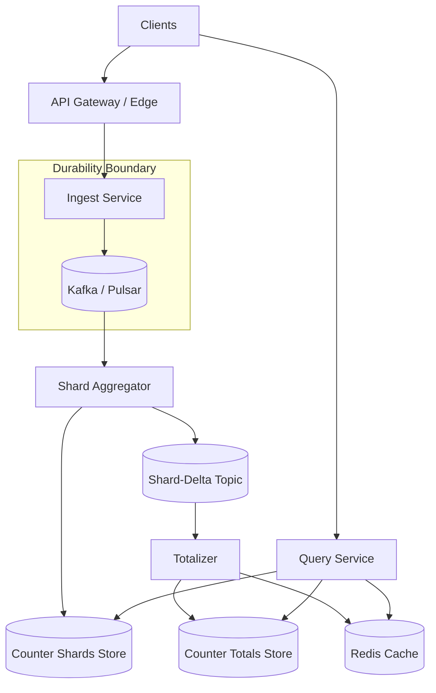
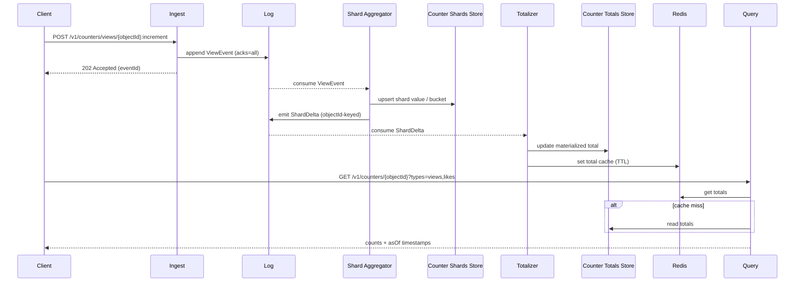

## Overview

A distributed counter service (views, likes) looks deceptively simple—“increment a number”—but becomes difficult at scale because the hottest objects (viral posts, trending videos) create extreme write contention and hot partitions. Naively updating a single row per object turns your datastore into a global lock for popular keys, and trying to make every increment strongly consistent across failures and regions becomes expensive and operationally fragile.

The core pattern is to decouple **ingestion** from **aggregation**:

- Treat each increment/toggle as an **immutable event** appended to a replicated log (the durability boundary for additive counters).
- Aggregate asynchronously into **sharded counter keys** to avoid hot partitions.
- Serve reads from **materialized totals** (plus cache) with bounded staleness, while preserving auditability and replay/backfill capability.

This is the same shape used by production systems for “high fan-in writes, low fan-out reads” telemetry-like workloads.

## Requirements

### Functional Requirements

- Increment view counters for arbitrary objects (post/video/comment) at very high throughput.
- Support like/unlike semantics with **idempotency** (no double-like from the same user).
- Read current counts for an object (views, likes) with **bounded staleness**.
- Support batch reads for feeds (e.g., 100 objects per request).
- Provide near-real-time updates (seconds) for hot objects.
- Provide backfill/recompute capabilities (replay from log) for correctness and incident recovery.
- Expose aggregation by time window (e.g., views per hour/day) for analytics/trending.

### Non-Functional Requirements (Targets)

- **Scale**
  - 200M DAU
  - Views: 50B/day ≈ 580K events/s average, peak 5M events/s
  - Likes: 2B/day ≈ 23K events/s average, peak 200K events/s
  - Hot objects/day: ~10M (with a steep Zipf distribution; top 0.01% dominate traffic)
- **Latency**
  - View ingest (durable): P50 10ms / P99 50ms (ack after replicated log write)
  - Like/unlike: P50 20ms / P99 120ms (ack after strongly consistent state write)
  - Read counts: P50 10ms / P99 80ms (cache or pre-aggregated store)
  - Freshness (counts): typical ≤ 5s, degraded ≤ 60s during incidents
- **Availability**
  - Reads: 99.99%
  - Writes: 99.9–99.99% (depends on regional write strategy)
- **Consistency**
  - Counts are **eventually consistent** (convergent totals).
  - Like state is **strongly consistent** per `(user_id, object_id)` (linearizable within a region).
- **Durability**
  - Views: configurable RPO in regional disaster (0–60s acceptable depending on cost/product needs)
  - Likes: no silent loss (RPO ≈ 0; state is the source of truth)

### Constraints & Assumptions

- Multi-AZ deployment; optional multi-region (active-active reads, optional cross-region writes).
- Budget favors horizontal scaling on commodity nodes; avoid single-writer designs.
- Store minimal PII; user IDs are opaque; raw events retention 7–30 days (policy-driven).
- Team can operate Kafka/Pulsar + a NoSQL store (DynamoDB/Cassandra/Scylla) + Redis.

### Out of Scope (Explicit)

- Fraud/bot detection, view quality scoring, and “unique views” (distinct users) counting.
- Strong read-after-write for counts in the UI (we provide strong **like state**, not necessarily synchronized totals).
- Full analytics warehouse modeling (we provide time buckets and replay hooks, not BI).

## Architecture

### Key Ideas (What Makes This Work)

- **Hot partitions**: Any single-key counter becomes a hotspot at viral scale; sharding is mandatory.
- **Event log as buffer**: The log absorbs bursts and provides replay for backfills and correctness.
- **Two-stage aggregation**: Write-heavy shard updates at high throughput; total/materialization at lower frequency.

### High-Level Diagram



### Data Flow (Views and Likes)



## Components

### 1) API Gateway / Edge

**Responsibilities**
- AuthN/AuthZ, request validation, rate limiting, and routing.
- Enforce per-client quotas to protect the log and downstream stores.

**Notes**
- Views endpoints often face the most abuse; add token-bucket limits (per user/device/IP/app key) and burst controls.

### 2) Ingest Service

**Responsibilities**
- Validate requests and normalize timestamps (use **server ingest time** for bucketing).
- Write events to the log for additive counters (views).
- For likes, execute strongly consistent state transitions and emit events.

**Key Design Decisions**
- **Durable-ack for views**: respond after the event is replicated in the log (`acks=all`, `min.insync.replicas>=2`).
- **Strong boundary for likes**: the canonical truth is `(user_id, object_id) -> liked`; the aggregated like count is derived.

**Partitioning for Hot Objects**
To avoid a viral object mapping to a single log partition, include a **write shard**:

- Compute `write_shard = hash(request_id or random) % W` (e.g., W=32–256 depending on peak).
- Partition key: `(counter_type, object_id, write_shard)`

This spreads writes across partitions while still allowing deterministic aggregation per shard.

### 3) Like State Store (Strong Consistency)

**Goal**: Prevent double-like and support idempotent toggles.

**Recommended Implementation**
- **DynamoDB** (or another KV with conditional writes) table `user_like_state` keyed by `(user_id, object_id)`.
- Update with a condition to ensure idempotency:
  - If request is identical (same `idempotency_key`), treat as retry and return the prior result.
  - If the state is already `liked=true` and request asks `true`, return `applied=false`.

**Event Emission (Avoid Dual-Write Bugs)**
Use an **outbox-style** mechanism so state changes produce exactly one downstream event:
- DynamoDB Streams (or CDC) emits `LikeStateChanged` events.
- A stream consumer publishes to the log topic used for aggregation.

This avoids “DB write succeeded but log publish failed” (or vice versa).

### 4) Event Log (Kafka/Pulsar)

**Responsibilities**
- Buffer bursts, provide ordering per partition key, and support replay/backfills.

**Topics**
- `views_events` (time-retained)
- `like_state_changes` (from CDC; time-retained)
- `shard_deltas` (short retention; derived stream for totalization)

**Operational Targets**
- Replication factor 3 across AZs.
- Compression: zstd/lz4; batch producers for throughput.

**Capacity Sanity Check**
If average serialized event size is ~100 bytes after compression:
- Views: 50B/day ≈ 5 TB/day; 7-day retention ≈ 35 TB (plus replication overhead).
This is feasible but must be explicitly planned (tiered storage helps).

### 5) Shard Aggregator (Stage 1)

**Responsibilities**
- Consume raw events and update shard counters (optionally time-bucketed).
- Emit compact `ShardDelta` records keyed by `(counter_type, object_id)` for totalization.

**Implementation Options**
- Kafka Streams / Flink (stateful processing with checkpoints), or custom consumers with RocksDB.
- Prefer managed state/checkpointing if your organization supports it; it reduces correctness risk.

**Correctness Model**
- Use **at-least-once** consumption.
- Make shard updates **idempotent by writing absolute values** from state (preferred) or by tracking per-shard applied offsets.
  - Absolute upserts are naturally idempotent on replay.
  - If writing deltas, you must add an idempotency mechanism (batch IDs) to avoid double-apply.

### 6) Totalizer (Stage 2)

**Responsibilities**
- Consume `ShardDelta` events keyed by `(counter_type, object_id)`.
- Update `counter_total` and refresh Redis.

**Why Separate This Stage**
- Shard writes can be extremely high QPS; totals only need updates every 1–5 seconds per hot object.
- This significantly reduces contention on the `counter_total` key even for viral objects.

### 7) Counter Stores

**Counter Shards Store**
- Write-optimized store (DynamoDB/Cassandra/Scylla).
- Keys distribute evenly because they include `(object_id, write_shard[, bucket])`.

**Counter Totals Store**
- Read-optimized table with one row per `(counter_type, object_id[, bucket])`.
- Serves as the durable fallback for cache misses.

**Redis Cache**
- Hot totals with short TTL (5–30s).
- Updated by Totalizer (write-through).

### 8) Query Service

**Responsibilities**
- Serve single and batch reads.
- Enforce freshness policy (`asOfMs`) and degrade gracefully during lag.
- Optionally fall back to shard-summing for a small fraction of requests (debug/reconciliation), not as the common path.

## Data Model

### Event Schemas

**ViewEvent**
```json
{
  "eventId": "evt_...",
  "counterType": "views",
  "objectId": "obj_...",
  "writeShard": 17,
  "amount": 1,
  "ingestedAtMs": 1730000000123,
  "idempotencyKey": "optional",
  "viewerId": "optional-opaque"
}
```

**LikeStateChanged** (emitted from CDC/outbox)
```json
{
  "eventId": "evt_...",
  "counterType": "likes",
  "objectId": "obj_...",
  "userId": "usr_...",
  "liked": true,
  "previousLiked": false,
  "changedAtMs": 1730000000456,
  "idempotencyKey": "req_..."
}
```

**ShardDelta** (derived; small)
```json
{
  "counterType": "views",
  "objectId": "obj_...",
  "bucketStartMs": 1729987200000,
  "delta": 1532,
  "asOfMs": 1730000005000
}
```

### Storage Schema (Logical)

#### 1) `counter_shard` (durable, write-optimized)
Partitioning is designed to avoid hot keys.

- `counter_type` (PK part; e.g., `views`, `likes`)
- `object_id` (PK part)
- `bucket_start_ms` (PK part; optional, for time-window counters like hourly/daily views)
- `write_shard` (PK part; 0..W-1)
- `value` (bigint; shard total for that bucket)
- `updated_at_ms`

#### 2) `counter_total` (durable, read-optimized)
- `counter_type` (PK part)
- `object_id` (PK part)
- `bucket_start_ms` (PK part; optional)
- `total_value` (bigint)
- `as_of_ms` (timestamp; freshness watermark)
- `version` (optional monotonic; for debugging)

#### 3) `user_like_state` (strongly consistent)
- `user_id` (PK part)
- `object_id` (PK part)
- `liked` (bool)
- `updated_at_ms`
- `idempotency_key` (string; last applied)

### Notes on Time Buckets

- Buckets should be derived from **ingest time** (server-side) to avoid client clock skew.
- Common buckets: 1h for trending, 1d for reporting; keep bucket cardinality bounded.

## API Design

### Increment Views
`POST /v1/counters/views/{objectId}:increment`

Request:
```json
{
  "amount": 1,
  "idempotencyKey": "optional-string",
  "timestampMs": 1730000000000
}
```

Response (`202 Accepted`):
```json
{ "eventId": "evt_...", "acceptedAtMs": 1730000000123 }
```

Errors:
- `400` invalid object/type/amount
- `401/403` unauthorized/forbidden
- `429` rate limited
- `503` log unavailable (retry with exponential backoff + jitter)

Idempotency:
- If `idempotencyKey` is provided, dedupe within a short window (e.g., 10 minutes) using a fast store (Redis `SET NX` with TTL).
- Without an idempotency key, views are treated as additive; retries may overcount (document this clearly).

### Like / Unlike (Idempotent Toggle)
`PUT /v1/likes/{objectId}`

Request:
```json
{ "userId": "usr_...", "liked": true, "idempotencyKey": "req_..." }
```

Response (`200 OK`):
```json
{ "liked": true, "applied": true }
```

Notes:
- `applied=false` when the same state is already set (idempotent no-op).
- The response reflects **strong state**; the displayed like count may lag for a few seconds.

### Read Like State (Strong)
`GET /v1/likes/{objectId}?userId=usr_...`

Response:
```json
{ "objectId": "obj_...", "userId": "usr_...", "liked": true, "asOfMs": 1730000000456 }
```

### Read Counts (Single)
`GET /v1/counters/{objectId}?types=views,likes`

Response:
```json
{
  "objectId": "obj_...",
  "counts": {
    "views": { "value": 12345, "asOfMs": 1730000005000 },
    "likes": { "value": 678, "asOfMs": 1730000004000 }
  }
}
```

### Read Counts (Batch)
`POST /v1/counters:batchGet`

Request:
```json
{ "objectIds": ["obj1", "obj2"], "types": ["views", "likes"] }
```

Response:
```json
{
  "results": [
    {
      "objectId": "obj1",
      "counts": { "views": { "value": 1, "asOfMs": 1730000005000 } }
    }
  ],
  "errors": [
    { "objectId": "obj2", "status": 404, "message": "unknown object" }
  ]
}
```

Batch semantics:
- Partial failures return per-item errors; successful items still return counts.
- Reads are safe to retry.

## Scaling & Performance

### Bottlenecks and Mitigations

- **Hot objects (viral keys)**
  - Mitigation: `(object_id, write_shard)` partitioning in the log + `counter_shard` fan-out writes.
  - Totalization updates are rate-limited (e.g., 1–5s) to keep `counter_total` stable under spikes.
- **Log throughput**
  - Mitigation: producer batching, compression, sufficient partitions, and isolating topics (views vs likes).
- **Store write amplification**
  - Mitigation: micro-batching in the aggregator and writing shard totals per short window, not per event.
- **Read fanout**
  - Mitigation: read `counter_total` (and Redis) as the default path; shard-summing is exceptional.

### Capacity Planning (Rule-of-Thumb)

- Kafka partitions:
  - If a partition can handle ~50K events/s sustained for this workload, a 5M events/s peak needs ~100 partitions for views, plus headroom (e.g., 200–400).
- Shard count `W`:
  - Start with 32–64 shards for general objects; allow hot classes to use 128–256 (configured per object type or popularity tier).
- Redis sizing:
  - Cache only totals (small values), not raw events. TTL-based eviction is enough; avoid explicit invalidations.

### Backpressure and Load Shedding

- If the counter store slows down:
  - Aggregators pause consumption (consumer group backpressure), increasing lag but preserving correctness.
  - Query service continues to serve stale cached totals with explicit `asOfMs` (graceful degradation).
- If the log is unavailable:
  - Views: return `503` (client retries); optionally buffer briefly at the edge only if you can bound memory and accept potential loss.
  - Likes: continue to serve strong state; the derived count will lag until the pipeline recovers.

## Consistency Model (What Users Can Expect)

- **Views count**: eventual consistency; monotonicity is not guaranteed at millisecond granularity (e.g., cache refresh races), but totals converge.
- **Like state**: strongly consistent for `(user_id, object_id)` in a region; clients should render UI based on state, not the aggregate count.
- **Like count**: derived from state changes; eventual consistency with bounded staleness.
- **Multi-region**
  - Simplest: single-writer per object type per region (active-passive writes, active-active reads).
  - True active-active writes require either (a) conflict-free replication semantics (e.g., CRDT PN-counter for views) or (b) a global log/consensus boundary—both add complexity.

## Trade-offs & Alternatives

### Key Trade-offs Made

- **Event log + async aggregation**
  - Pros: absorbs bursts, avoids hot DB locks, enables replay/backfill.
  - Cons: no immediate read-after-write for counts; requires stream processing ops.
- **Sharded counters + staged totalization**
  - Pros: removes hot partitions and keeps reads fast.
  - Cons: more moving parts; requires reconciliation/observability for lag and correctness.
- **Strong like state, eventual like count**
  - Pros: correctness anchored to user intent; idempotent and audit-friendly.
  - Cons: UI count may lag a few seconds; must educate consumers to use state for toggles.

### Alternative Approaches

- **Direct atomic counters in a single DB row (DynamoDB `ADD` / SQL `UPDATE`)**
  - Simple, but collapses under viral hot keys (throttling, lock contention, noisy neighbors).
- **Redis-only counters with periodic persistence**
  - Very fast, but durability and replay are hard; failure modes often produce silent loss unless engineered carefully.
- **CRDT PN-Counters for active-active multi-region**
  - Great for geo-writes with convergence, but adds metadata overhead and operational complexity (compaction, anti-entropy).

## Failure Modes & Mitigations

### 1) Log Partition Leader Loss / Broker Outage
- **Impact**: write latency spike, temporary unavailability.
- **Detection**: produce errors, under-replicated partitions, `acks=all` failures, SLO burn.
- **Mitigation**: RF=3 across AZs, `min.insync.replicas`, client retries with jitter, capacity headroom, isolated clusters for critical traffic.

### 2) Aggregator Crash / Rebalance Storm
- **Impact**: lag increases, totals become stale; risk of double-apply if sink isn’t idempotent.
- **Detection**: consumer lag, checkpoint age, rebalance rate, missing flush heartbeats.
- **Mitigation**: stateful processors with checkpoints, idempotent sink strategy (absolute upserts or offset tracking), controlled deployments to avoid mass rebalances.

### 3) Counter Store Hotspot / Partition Imbalance
- **Impact**: elevated write latency, backlog growth, possible throttling.
- **Detection**: p99 write latency, per-partition heatmaps, throttles/timeouts, skew metrics.
- **Mitigation**: increase `write_shard` for hot classes, adaptive shard assignment, isolate tenants, autoscale throughput, apply write buffering/micro-batching.

### 4) Redis Outage or Partial Cluster Failure
- **Impact**: higher read latency and load on totals store.
- **Detection**: cache hit rate drop, Redis error rate, connection churn.
- **Mitigation**: query falls back to `counter_total`, circuit breaker + bulkheads, gradual warmup after recovery.

### 5) Bad Deploy / Counting Bug (Systemic Miscount)
- **Impact**: widespread incorrect totals.
- **Detection**: anomaly detection vs historical baselines, sampled reconciliation (total vs shard sums), alerting on unexpected deltas.
- **Mitigation**: replay into versioned tables, canary pipelines, fast rollback, keep raw events long enough for recompute.

### Disaster Recovery

- **Single-AZ failure**: RTO minutes, RPO 0 (multi-AZ replication).
- **Regional disaster**:
  - Views: RTO 30–60 minutes; RPO 0–60s depending on cross-region replication cost/choice.
  - Likes: RPO ≈ 0 (replicate the state store / CDC stream; ensure recovery procedure preserves ordering and idempotency).
- **Backups**: daily snapshots of stores; continuous backups where supported; retain log 7–30 days for replay.
- **Failover**: promote secondary region services, switch DNS/traffic, rebuild Redis caches, reconcile totals via replay.

## Operations

### Monitoring & Alerting (SLO-Driven)

Key metrics:
- Ingest: QPS, P99 latency, 4xx/5xx, retry rate, rate-limit drops, dedupe hit rate.
- Log: throughput, under-replicated partitions, ISR shrink events, retention usage, end-to-end publish latency.
- Aggregators/Totalizers: consumer lag, checkpoint age, flush latency, state size, error rate, rebalance count.
- Stores: read/write P99, throttles, hot partition indicators, replication health.
- Query: cache hit rate, P99 latency, `asOfMs` staleness distribution.

Suggested alerts:
- Consumer lag > 30s (warn), > 120s (page).
- Ingest 5xx > 0.5% for 5 minutes (page).
- `asOfMs` staleness P99 > 60s for 10 minutes (page).
- Store throttles > baseline for 10 minutes (page).

### Deployment & Schema Evolution

- Canary 1–5% traffic for ingest and stream jobs.
- Feature flags for shard count changes and new bucket granularities.
- Versioned schemas for events (backward compatible); avoid breaking consumers.
- For data migrations: dual-write totals (v1/v2), backfill via replay, validate sampled diffs, then cut over reads.

### Replay / Backfill Playbook

- Freeze downstream writes if needed (or replay into new tables).
- Recompute from raw events into `counter_shard` and `counter_total` v2.
- Validate with:
  - sampled shard sums vs totals
  - invariants (likes cannot be negative; like count bounded by distinct likers)
- Switch query reads to v2 and retire v1 after a safety window.

### Security & Privacy

- Require auth on write endpoints; apply anti-abuse controls for views.
- Treat user IDs as opaque identifiers; avoid storing additional PII in events.
- Apply retention policies to raw topics; redact/debug logs carefully.
- Encrypt in transit (mTLS) and at rest; restrict access to replay tools.

## References & Further Reading

- Kafka documentation: https://kafka.apache.org/documentation/
- Pulsar architecture and geo-replication: https://pulsar.apache.org/docs/
- DynamoDB conditional writes and partition design: https://docs.aws.amazon.com/amazondynamodb/latest/developerguide/
- Cassandra/Scylla data modeling for high-write workloads: https://docs.datastax.com/ and https://docs.scylladb.com/
- CRDT background (PN-Counter): https://crdt.tech/
- Streaming stateful processing patterns: “Streaming Systems” (Akidau et al.), Kafka Streams/Flink documentation