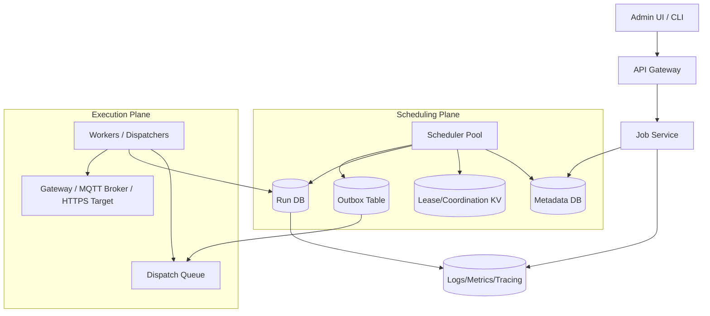
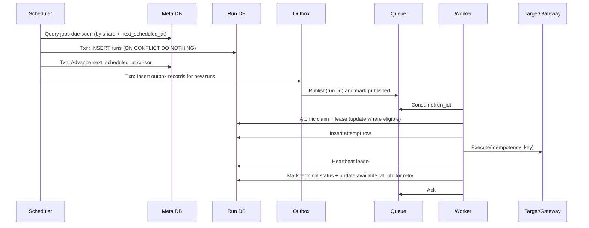

## Overview

A distributed cron system runs periodic jobs (e.g., “every minute”, “daily at 02:00 America/Los_Angeles”) across many targets (gateways/devices/regions) and must keep working through leader crashes, retries, partitions, and clock skew. The hard parts aren’t parsing cron strings—they’re:

- **Correctness**: deciding *which* scheduled occurrences exist (including DST/misfires) and materializing them durably.
- **Reliability**: ensuring due occurrences get dispatched and eventually executed when targets are reachable again.
- **Safety**: preventing uncontrolled duplicates while accepting that **at-least-once** is unavoidable under failures.

This design separates:
1. **Schedule decision + durable run materialization** (create “Run” records with unique keys)
2. **Execution** (workers claim runs via atomic transitions + leases/heartbeats)

The key invariant is: **a run is the unit of truth**. Leaders are replaceable; correctness depends on durable state, unique constraints, and idempotent transitions—not on a single process remembering what’s due.

---

## Requirements

### Functional Requirements
- CRUD periodic jobs with:
  - Cron or fixed-interval schedules
  - IANA timezone support (e.g., `America/Los_Angeles`)
  - Misfire policies (skip/catch-up/run-latest)
  - Per-job jitter
- Associate jobs to targets:
  - Gateways, device groups, regions (multi-tenant)
  - Concurrency and rate limits per target
- Materialize and dispatch due executions reliably
- Track per-run lifecycle:
  - `PENDING → CLAIMED → RUNNING → SUCCEEDED/FAILED/CANCELED`
  - Retries with backoff, max attempts, TTL/dead-letter policy
- Admin operations:
  - Pause/resume
  - “Run now”
  - Optional cancellation of not-yet-started runs
- Observability:
  - Audit trail for job changes
  - Per-job and per-run metrics and logs
- Idempotency:
  - Duplicate dispatch/execution must not cause duplicate side effects

### Non-Functional Requirements

#### Scale (Sizing Targets)
Assume a *control plane* in one primary region and an *execution plane* fan-out to IoT/edge.

- Tenants/projects: up to 10k
- Active jobs: **100k**
- Targets: up to **1M** gateways/agents (devices behind gateways)
- Average due rate: **50k runs/min** (~833 runs/s)
- Burst due rate: **10k runs/s** (top-of-minute alignment)
- Run history retention: **30 days**
  - Total runs: ~**2.16B** (50k/min × 60 × 24 × 30)

**Practical storage approach**:
- Hot OLTP retention (Run DB): **24–72 hours** for correctness + operational queries
- Warm/cold retention: tier to analytical store (e.g., ClickHouse/BigQuery) + object storage for logs/artifacts

#### Latency Targets
Define “schedule-to-dispatch” as “scheduled occurrence is materialized and available for workers to claim”.

- Due occurrence materialized (P50/P99): **< 250ms / < 2s**
- Queue availability for consumption (P99): **< 2s**
- Control-plane API P99: **< 150ms**
- End-to-end to edge execution is **best-effort** when targets are offline; guarantee is *eventual delivery per policy once reachable*.

#### Availability / Durability
- Control plane (job CRUD): **99.95%**
- Dispatch pipeline (run materialization + claimability): **99.99%**
- Durability:
  - Job metadata: RPO **≤ 1 minute**
  - Runs/attempts: RPO **0 for acknowledged writes** (no acknowledged run loss)

#### Consistency Model
- **Strong consistency** for:
  - Job definitions
  - Run creation uniqueness (no “phantom duplicates” for the same occurrence)
  - Run state transitions (atomic claim/lease/complete)
- **Eventual consistency** for:
  - Analytics, dashboards, long-term history search

### Constraints & Assumptions
- Edge connectivity can be intermittent (minutes to days).
- We accept **at-least-once dispatch**; achieve *effectively-once outcomes* via idempotency tokens and target-side dedupe.
- Data center clocks are NTP-synchronized; edge clocks may drift. Scheduling is computed server-side in UTC based on the job timezone.
- Multi-tenant isolation by `tenant_id` (authz + data partitioning).
- Secrets handled via KMS/Vault; downstream credentials never stored in plaintext.

---

## Architecture

### High-Level Diagram



### Why This Architecture
- **Durable runs are the source of truth**: leader crashes can’t “forget” scheduled occurrences.
- **Idempotent run creation** via unique constraints allows safe re-scans.
- **Atomic claiming with leases** prevents long-running stuck states and enables recovery.
- **Outbox pattern** prevents “DB write succeeded but queue publish failed” from losing dispatch.

---

## Components

## Job Service (Control Plane)

**Responsibilities**
- Job CRUD, validation (cron/timezone), authz, and query APIs for jobs/runs
- Versioning: schedule changes create a new `job_version`

**Key choices**
- **Optimistic concurrency** for updates (`If-Match: <version>`)
- Store timezone as IANA name; evaluate schedules using a well-tested library with timezone rules

**Tech**
- Postgres or CockroachDB (strong consistency)
- REST/JSON externally; gRPC internally is optional

---

## Scheduler Pool (Distributed Scheduling)

**Responsibilities**
- Determine due occurrences and materialize them as durable runs
- Ensure no missed occurrences across leader crashes and restarts

### Sharding + Leases
- Partition jobs into `N` shards by `hash(job_id) % N` (e.g., 1024–4096 shards).
- Each shard has a **lease** with TTL + heartbeats stored in a coordination KV (etcd/Consul) or via DB locks.
- Only the lease owner schedules jobs in that shard at a time; if it dies, ownership transfers after TTL.

### Efficient Scheduling (Avoid Full Scans)
Instead of scanning all jobs each minute, maintain a per-job “cursor”:

- `jobs.next_scheduled_at_utc` (indexed)
- Scheduler queries, per shard:
  - jobs with `enabled = true` AND `next_scheduled_at_utc <= now + lookahead` (lookahead e.g., 2–5 minutes)
- For each job, compute the next occurrences according to policy and materialize runs.

This makes workload proportional to “jobs that are due soon”, not to “all jobs”.

### Misfire Semantics (Clear Interview-Ready Definitions)
When the scheduler notices the job is behind (e.g., was paused or down):

- `SKIP`: create **no** past-due runs; set cursor to the first time ≥ now.
- `CATCH_UP`: create **all** occurrences between last cursor and now (bounded by `max_catch_up`).
- `RUN_LATEST`: create **only the latest** occurrence ≤ now; drop older ones.

To prevent runaway backlog, cap catch-up, e.g.:
- `max_catch_up_runs_per_job = 1000`
- `max_catch_up_window = 24h`

### Idempotent Run Keys
A “run” should be unique per **(job version, scheduled time, target)**.

- Define:
  - `run_key = hash(tenant_id | job_id | job_version | scheduled_time_utc | target_type | target_id)`
- Enforce:
  - `UNIQUE(tenant_id, job_id, job_version, scheduled_time_utc, target_type, target_id)`

Schedulers can safely re-run the same scheduling loop; duplicates become no-ops.

---

## Run Store (State Machine + Attempts)

**Responsibilities**
- Durable record of each execution (per scheduled occurrence per target)
- Atomic state transitions, leasing, retries, and audit

### State Machine
- `PENDING`: eligible to be claimed once `available_at_utc <= now`
- `CLAIMED`: reserved by a worker (short lease)
- `RUNNING`: worker is actively executing (lease renewed via heartbeats)
- Terminal: `SUCCEEDED`, `FAILED`, `CANCELED`, `DEAD_LETTERED`

Lease rules:
- Worker must heartbeat to extend `lease_expires_at_utc`.
- If lease expires, other workers may reclaim (at-least-once).

### Attempts vs Runs
Use an `attempts` table for each try:
- Run is the durable “occurrence”
- Attempt is one execution try (with start/end time, error, latency, and worker identity)

This keeps the run row stable and reduces contention while preserving full history.

---

## Dispatch Queue (Burst Absorption + Backpressure)

**Responsibilities**
- Absorb top-of-minute spikes
- Decouple scheduling from execution
- Provide consumer scaling and replay

**Key choices**
- Queue messages carry **references** (`run_id`, `attempt_id`) rather than payloads
- Use a **DLQ** for poison-pill failures (e.g., repeated transient errors due to malformed job payload)

**Critical correctness pattern: transactional outbox**
- Scheduler writes runs + an outbox record in the same DB transaction.
- A separate publisher reads outbox and publishes to the queue, then marks outbox delivered.
- If the queue is down, runs still exist and will be published later.

---

## Workers / Edge Dispatchers (Execution Plane)

**Responsibilities**
- Claim eligible runs
- Enforce per-target concurrency/rate limits
- Execute actions:
  - HTTP/gRPC to gateways
  - MQTT publish to device topics
- Heartbeat and write outcomes to the Run DB

**Idempotency**
- Use an idempotency token derived from the run uniqueness:
  - `idempotency_key = run_key` (or a stable encoding)
- Pass it to downstream systems (HTTP header, MQTT message field, gateway API).
- Gateways should store a bounded dedupe cache keyed by `(idempotency_key)` to ignore duplicates.

**Per-target concurrency**
Common options (trade-offs later):
1. Partition queue by `target_id` and run a fixed concurrency per partition
2. Use a distributed limiter (Redis) keyed by `target_id` with short TTL leases
3. Store per-target concurrency state in DB (strongest correctness, highest contention)

For IoT, option (2) is typically the best balance.

---

## Data Model

### Tables (Logical Schema)

**jobs**
- `tenant_id` (UUID, indexed)
- `job_id` (UUID, PK)
- `name` (text)
- `schedule_type` (enum: CRON, FIXED_INTERVAL)
- `cron_expr` (text, nullable)
- `interval_seconds` (int, nullable)
- `timezone` (text, IANA)
- `misfire_policy` (enum: SKIP, CATCH_UP, RUN_LATEST)
- `jitter_seconds` (int, default 0)
- `enabled` (bool)
- `max_attempts` (int)
- `run_ttl_seconds` (int, nullable)
- `next_scheduled_at_utc` (timestamp, indexed)
- `version` (int)
- `created_at`, `updated_at`
- Unique (optional): `(tenant_id, name)`

**job_targets**
- `tenant_id` (UUID)
- `job_id` (UUID)
- `target_type` (enum: GATEWAY, DEVICE_GROUP, REGION)
- `target_id` (text)
- `max_concurrency` (int)
- `max_rate_per_sec` (int, nullable)
- PK: (`tenant_id`, `job_id`, `target_type`, `target_id`)

**runs** (hot, partitioned by time)
- `tenant_id` (UUID)
- `run_id` (UUID, PK)
- `job_id` (UUID, indexed)
- `job_version` (int)
- `target_type` (enum)
- `target_id` (text)
- `scheduled_time_utc` (timestamp, indexed)
- `available_at_utc` (timestamp, indexed)  <!-- scheduled time + jitter + backoff -->
- `status` (enum)
- `lease_owner` (text, nullable)
- `lease_expires_at_utc` (timestamp, indexed)
- `attempts_created` (int)
- `max_attempts` (int)
- `last_error` (text, nullable)
- `idempotency_key` (text)
- `created_at`, `updated_at`
- Unique: (`tenant_id`, `job_id`, `job_version`, `scheduled_time_utc`, `target_type`, `target_id`)

**attempts**
- `tenant_id` (UUID)
- `attempt_id` (UUID, PK)
- `run_id` (UUID, indexed)
- `attempt_no` (int)
- `status` (enum: STARTED, SUCCEEDED, FAILED)
- `worker_id` (text)
- `started_at`, `finished_at`
- `error_code` (text, nullable)
- `error_message` (text, nullable)

**outbox_dispatch**
- `tenant_id` (UUID)
- `event_id` (UUID, PK)
- `run_id` (UUID, indexed)
- `created_at`
- `published_at` (nullable)
- `publish_attempts` (int)

### Indexing (Minimum Set)
- `jobs(tenant_id, next_scheduled_at_utc)` for due selection
- `runs(tenant_id, status, available_at_utc)` for claim scanning
- `runs(tenant_id, lease_expires_at_utc)` for reclaim detection
- Unique constraint for run idempotency

### Data Flow



---

## API Design

### Create Job
`POST /v1/jobs`

Request:
```json
{
  "name": "firmware-rollout",
  "schedule": { "type": "CRON", "cron": "*/5 * * * *", "timezone": "UTC", "jitterSeconds": 10 },
  "misfirePolicy": "CATCH_UP",
  "targets": [{ "type": "DEVICE_GROUP", "id": "group-123", "maxConcurrency": 200, "maxRatePerSec": 50 }],
  "maxAttempts": 5,
  "runTtlSeconds": 86400
}
```

Response `201`:
```json
{ "jobId": "uuid", "version": 1 }
```

Idempotency:
- Support `Idempotency-Key` header to dedupe client retries.

### Update Job
`PATCH /v1/jobs/{jobId}` with `If-Match: <version>`

- `412 PRECONDITION_FAILED` on version mismatch
- On update:
  - increment `version`
  - recompute `next_scheduled_at_utc` from “now” (policy-dependent)

### Pause/Resume
- `POST /v1/jobs/{jobId}:pause`
- `POST /v1/jobs/{jobId}:resume`

Pause behavior options (make it explicit):
- Default: prevents creating future runs; existing runs remain
- Optional flag: `cancelPending=true` cancels `PENDING` runs not yet started

### Run Now
`POST /v1/jobs/{jobId}:runNow`

- Creates a manual run with `scheduled_time_utc = now` and the current `job_version`
- Accepts `Idempotency-Key` to dedupe manual triggers

Response:
```json
{ "runId": "uuid", "scheduledTimeUtc": "2025-12-17T12:00:00Z" }
```

### List Runs
`GET /v1/jobs/{jobId}/runs?from=...&to=...&status=...&limit=...&pageToken=...`

- Prefer cursor pagination (`pageToken`) over offset for large histories

### Error Envelope
Use `application/problem+json` or a typed envelope:
```json
{ "code": "INVALID_SCHEDULE", "message": "Timezone is invalid", "requestId": "..." }
```

---

## Scaling & Performance

### Throughput Reality Check
At peak **10k runs/s**, two write-heavy paths dominate:
1. Run materialization (insert/upsert)
2. Claim transitions (update with predicates)

To make this achievable:
- Batch inserts (e.g., 100–1000 rows per statement)
- Partition hot runs by day/hour (or by hash + time) to keep indexes small
- Keep run rows narrow (store large payloads/logs outside OLTP)

### Top-of-Minute Burst Mitigation
- **Jitter** per job (recommended default 0–10s configurable)
- **Lookahead scheduling** (2–5 minutes) to spread inserts over time
- Queue buffering + autoscaling consumers
- Optional: randomize `next_scheduled_at_utc` within the jitter window at creation time

### Claim Strategy (Avoid Thundering Herd)
Workers should claim by small batches:
- Query candidate run_ids (by `status=PENDING and available_at<=now`) limited to N
- Claim with conditional update (or DB-native `SKIP LOCKED` if using row locks)

For example (conceptually):
- Eligible if `status='PENDING'` OR (`status in ('CLAIMED','RUNNING') AND lease_expires_at < now`)
- Update sets `lease_owner`, `lease_expires_at`, and moves to `CLAIMED/RUNNING`

### Backlog Control for Offline Targets
- Enforce per-target backlog limits:
  - e.g., cap pending runs per target to 10k
- Apply misfire `RUN_LATEST` to collapse stale schedules for long-offline targets
- Use `run_ttl_seconds` to expire obsolete runs (e.g., “daily report” older than 7 days is meaningless)

---

## Trade-offs & Alternatives

### Trade-offs (At Least 3)
1. **At-least-once execution + idempotency (chosen)**
   - Pros: robust under crashes/partitions; industry standard (queues, payments)
   - Cons: requires downstream idempotency support and careful semantics

2. **Run DB as source of truth (chosen)**
   - Pros: auditable history, strong state machine, safe recovery, flexible querying
   - Cons: heavy write load; requires partitioning and data tiering at scale

3. **Leases + shard ownership (chosen)**
   - Pros: fast failover, horizontal scale, bounded work per scheduler
   - Cons: coordination system availability matters; lease tuning and churn can be operationally tricky

4. **Outbox for queue publishing (chosen)**
   - Pros: eliminates lost-dispatch gap between DB and queue
   - Cons: extra table + publisher component; eventual queue publish when queue is degraded

### Alternatives
- **Single leader (active-passive)**
  - Simpler, but still needs durable cursors and idempotent run creation; failover can create gaps without careful design.
- **Cloud scheduler primitives / Kubernetes CronJobs**
  - Great for cluster-native workloads; less suitable for IoT fan-out, offline policies, and per-target throttling.
- **Workflow engines (Temporal/Cadence)**
  - Strong timers/retries; great when “jobs” are multi-step workflows.
  - Higher operational complexity and different abstraction model than “cron fan-out”.

---

## Failure Modes & Mitigations

### 1) Scheduler crashes mid-cycle
- Impact: delayed run creation/publishing
- Mitigation:
  - Lease expires and another scheduler takes over shard
  - Run inserts are idempotent (unique constraint)
  - Outbox ensures queue publish eventually happens

### 2) Queue outage or sustained lag
- Impact: runs exist but dispatch is delayed
- Mitigation:
  - Outbox retries publishing
  - Workers may optionally “DB-poll fallback” for eligible runs (rate-limited) to reduce dependency on the queue during incidents
  - Clear SLO: correctness preserved; latency degrades

### 3) Worker crashes during execution
- Impact: run stuck `RUNNING`
- Mitigation:
  - Lease expiry makes it reclaimable
  - Downstream idempotency prevents double side effects
  - Attempt history shows duplicates and timing

### 4) Coordination store partition / lease churn
- Impact: schedulers may temporarily stop scheduling shards or churn ownership
- Mitigation:
  - Conservative lease TTL (e.g., 10–30s) and heartbeat (e.g., 1–5s)
  - If using DB locks instead of etcd, reduce dependencies at cost of DB load
  - Correctness remains via unique run keys; worst case is duplicate scheduling work, not duplicate runs

### 5) DB degradation / partial outage
- Impact: run creation/claim slows; control plane may degrade
- Mitigation:
  - Prioritize write paths for run transitions
  - Shed load on non-critical endpoints (analytics/history)
  - Partitioning + connection pool protection + circuit breakers
  - Multi-region / HA DB configuration for 99.99% dispatch SLO

### Clock Skew and DST
- Scheduler computes in job timezone but persists `scheduled_time_utc` as the logical occurrence time.
- DST edge cases:
  - “Missing hour” (spring forward): occurrences that don’t exist are skipped by timezone rules.
  - “Repeated hour” (fall back): occurrences may repeat; the timezone library must disambiguate consistently (typically by generating distinct UTC instants).
- Edge clocks are not trusted for scheduling decisions; only for local telemetry.

### Disaster Recovery
- Target: RTO **30 minutes**
- DB backups: continuous WAL archiving + daily snapshots; restore drills
- Multi-region option:
  - CockroachDB multi-region for metadata + runs (latency trade-off)
  - Or primary-region writes with async replica for DR

---

## Operations

### SLOs / SLIs (Concrete)
- **Run materialization latency**: time from scheduled occurrence to row present in `runs`
- **Dispatch readiness**: time until run is published/visible to workers (queue or DB-poll)
- **Pending age**: `now - scheduled_time_utc` for `PENDING` runs (P99)
- **Stuck running**: count of runs with expired leases in `RUNNING`

### Monitoring & Alerting
- Scheduler:
  - shard lease ownership count, churn rate, scan duration
  - run insert rate, conflict/no-op rate (idempotent duplicates)
- Outbox/Queue:
  - outbox backlog, publish error rate
  - queue lag, DLQ size
- Workers:
  - claim success rate, execution latency
  - heartbeat failures, retry rates
- DB:
  - p99 query latency on claim/update paths
  - connection pool saturation, lock/txn retry rates (esp. Cockroach)

Alert examples:
- `PENDING` age P99 > 60s for 5m (excluding paused jobs)
- Outbox backlog growing for 10m
- Expired leases in `RUNNING` above threshold
- Queue lag increasing monotonically for 10m

### Deployment and Rollback
- Rolling deploy stateless components (API, schedulers, outbox publisher, workers)
- Backward-compatible DB migrations (expand/contract)
- Feature flags for schedule interpretation changes (cron parsing, misfire behavior)

### Security / Multi-tenancy
- Authn via OIDC; authz via tenant/project scopes
- Row-level isolation by `tenant_id` (enforced in queries and optionally via RLS in Postgres)
- Encrypt data at rest; encrypt in transit (mTLS internally)
- Audit log for job changes and sensitive operations

---

## References & Further Reading
- Kubernetes leader election leases: https://kubernetes.io/docs/reference/coordination/v1/
- etcd lease/lock patterns: https://etcd.io/docs/
- ZooKeeper recipes (locks, ephemeral nodes): https://zookeeper.apache.org/
- Quartz misfire handling concepts: https://www.quartz-scheduler.org/
- Temporal (workflow engine alternative): https://temporal.io/
- Kafka reliability and idempotent processing concepts: https://kafka.apache.org/documentation/