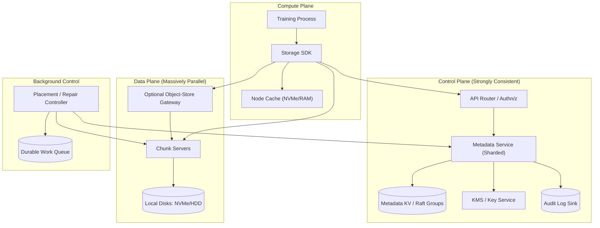
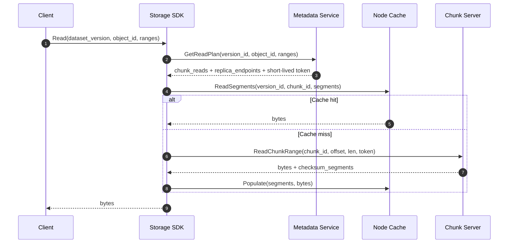
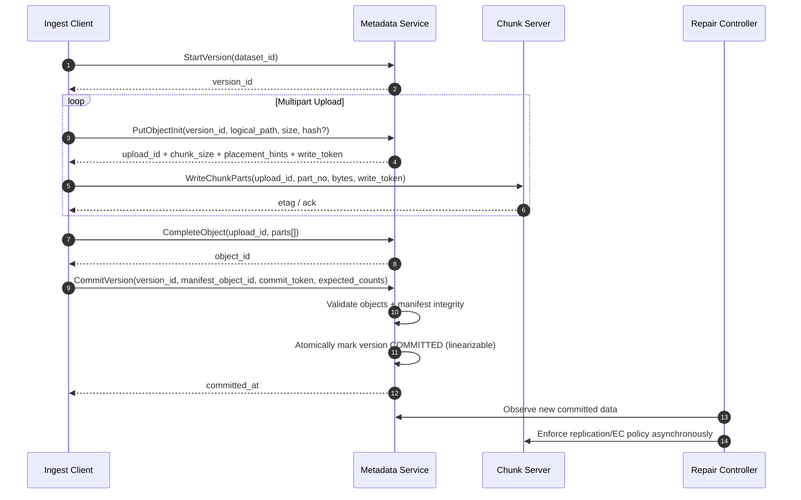

## Overview

AI/ML training workloads stress storage differently than general-purpose file systems:

- **Massive fan-out reads**: tens of thousands of workers reading concurrently.
- **Repeatable access across epochs**: the same data is reread many times (cacheable).
- **Large sequential reads + some byte-range reads**: container formats (WebDataset/TFRecord/Parquet) plus random-ish sampling.
- **Reproducibility matters**: “exactly what data did this model train on?” must be auditable and deterministic.

This document proposes an **object-oriented distributed “training file system”** optimized for:
- Parallel reads at very high aggregate throughput
- Dataset versioning with atomic commits
- Predictable tail latency under extreme fan-out
- Multi-tenant isolation and auditable access

It intentionally does **not** aim to fully implement POSIX semantics (renames, hard links, byte-range locks, close-to-open consistency). Instead, it resembles **“S3-like objects + chunked data plane + compute-adjacent caching + training-aware manifests and shard plans.”**

### Goals
- High-throughput read-optimized storage for immutable training data
- Atomic, strongly consistent dataset version commits
- Training-friendly primitives: manifests, shuffle plans, shard plans, prefetch hints
- Multi-tenant security, quotas, and fairness controls
- Operationally realistic: repair, rebalancing, decommissioning, observability, DR

### Non-Goals
- Full POSIX filesystem semantics (except via optional adapters with limitations)
- Low-latency small-file random reads as a primary workload (we encourage packing)
- Cross-region synchronous replication for the data plane (supported asynchronously)

---

## Requirements

### Functional Requirements
- Store **versioned datasets** composed of immutable objects and manifests for deterministic training.
- Support **high-throughput parallel reads** with **byte-range** access.
- Provide efficient listing/shuffling via **precomputed manifests** (avoid hot metadata scans).
- Support ingestion via multipart upload and atomic **`CommitVersion`**.
- Enforce **multi-tenant isolation**: quotas, rate limits, per-tenant encryption keys, and audit logs.
- Provide **locality hints** (best replicas/caches) and **client-side parallel fetch plans**.
- Support **background repair/rebalancing** (re-replication, EC transitions) without downtime.
- Provide operational controls: draining nodes, snapshots/backups, retention, deprecation, and lifecycle policies.

### Non-Functional Requirements (Targets)
**Assumptions (example cluster):**
- Up to **50,000 training workers** across **5,000–10,000 compute nodes**
- Data plane across **2,000–10,000 chunk servers** (often separate from compute; sometimes co-located)

**Scale**
- Total stored data: **5 PB**
- Total objects (logical): **200 M** (encourage packed formats; metadata supports small objects but does not optimize for them)
- Peak aggregate read throughput: **2–5 TB/s** (e.g., 50k workers × 40–100 MB/s)
- Peak data-plane read requests: **~1–3M range reads/s** (amortized via 4–8 MB segments and client batching)
- Sustained ingest: **50–200 GB/s** (bulk backfills + continuous dataset refreshes)

**Latency**
- Metadata `GetReadPlan` (in-region): **P50 < 5 ms**, **P99 < 30 ms**
- Data reads:
  - Cache hit (node-local NVMe/RAM): **P50 < 2 ms**, **P99 < 20 ms**
  - Remote chunk server (same AZ/rack fabric): **P50 < 10 ms**, **P99 < 50 ms**
- Dataset commit (metadata + manifest validation): **P50 < 500 ms**, **P99 < 3 s** (dominated by metadata, not bulk data upload)

**Availability**
- Reads: **99.99%**
- Writes/ingest + commit: **99.9%** (read-heavy system; commits must remain correct under failures)

**Consistency**
- **Linearizable**: dataset version commit; reading manifests for committed versions
- **Read-your-writes** within a single commit workflow (via commit tokens)
- **Eventual**: cache presence, telemetry, “best replica” hints (never correctness-critical)

**Durability**
- Data durability: target **≥ 11 nines** equivalent (replication and/or erasure coding)
- Metadata RPO: **≤ 5 minutes** (or better with synchronous replication for metadata)
- No acknowledged commit lost (commit linearizability + durable metadata log)

### Constraints & Assumptions
- Training reads are overwhelmingly against **immutable, committed versions**.
- Objects range from **64 MB to multi-GB**, but small objects exist; **packing is recommended**.
- Hybrid deployments possible: on-prem RDMA or cloud TCP; same logical architecture.
- Team size: **10–20 engineers**; prefer proven building blocks (Raft, mature observability).
- Compliance: encryption in transit/at rest, tenant-scoped access controls, auditability.

---

## Architecture

### High-Level Components

### Core Idea (Why This Works for Training)
- **Metadata is small and strongly consistent**: commits and read plans must be correct and fast.
- **Reads bypass centralized services**: clients read directly from the data plane using a plan.
- **Caching is first-class**: compute-adjacent caches absorb repeated epoch reads and reduce hot-spotting.
- **Training-aware manifests**: shuffle and shard plans avoid expensive metadata scans and enable deterministic training.

---

## Key Workflows & Data Flow

### Read Path (Plan + Direct Reads)

### Ingest + Commit Path (Bulk Upload + Atomic Commit)

---

## Component Deep-Dive

## Storage SDK (Client Library)

**Responsibilities**
- Fetch read plans, execute parallel reads, validate checksums, and populate caches
- Implement retries, hedged reads, client-side admission control, and backpressure
- Provide training-friendly APIs: manifests, shard plans, prefetch

**Key Design Decisions**
- Prefer library API over POSIX: enables batching, concurrency control, and training-aware access.
- Client-driven parallelism: best throughput and tail latency improvements at large fan-out.
- **Hedged reads**: after a small delay, issue a second read to a different replica if tail latency spikes.

**Implementation Notes**
- Control plane: gRPC
- Data plane: gRPC streaming and/or HTTP Range GET; optional RDMA transport for on-prem
- Token-based authorization on reads (short-lived, scope-limited)

**Safety Controls**
- Per-host concurrency caps and bandwidth limits to prevent incast
- Retry budgets per read (avoid “retry storms”)
- Adaptive hedging based on observed tail latency

---

## Metadata Service (Strong Consistency Boundary)

**Responsibilities**
- Namespace: tenants, datasets, versions
- Object metadata: object-to-chunk maps, content hashes, encodings
- Manifest pointers and shard plan generation
- AuthZ enforcement and issuance of scoped read/write tokens
- Quotas, rate limits, and audit logging hooks

**Key Design Decisions**
- **Linearizable commits** using Raft: `CommitVersion` is atomic and durable.
- Immutable, committed versions: training reads never depend on “latest mutable state.”
- Manifests are immutable objects: “shuffle/listing” work is moved off hot metadata scans.

**Storage Choice**
- Sharded metadata service backed by a **Raft-replicated KV store** (e.g., FoundationDB or a custom sharded Raft+RocksDB design).
- Partition primarily by `(tenant_id, dataset_id)` to keep commits and hot reads localized.

**Scaling Strategy**
- Stateless frontends + sharded leaders for writes
- Serve immutable read-mostly metadata via caching and follower reads where safe
- Explicit hot-key mitigation for popular manifests (cache + optional edge distribution)

---

## Chunk Servers (Data Plane)

**Responsibilities**
- Store immutable chunks, serve range reads, enforce rate limits, report health/telemetry
- Validate checksums quickly for range reads

**Key Design Decisions**
- Chunk size: **64–256 MB** (choose based on network/IO characteristics and metadata overhead)
- Integrity: per-chunk checksum tree (e.g., **4–8 MB segments**) to validate partial reads efficiently
- Storage policy:
  - **Replication** (e.g., 3x) for hot datasets and active training windows
  - **Erasure Coding** (e.g., 10+4) for cold/archival datasets to reduce cost

**Performance Notes**
- Use modern async IO (e.g., `io_uring`) and zero-copy where possible
- Prefer sequential reads from disk; coalesce adjacent range requests in the SDK

**Placement**
- Rack/AZ-aware replica placement; avoid correlated failures
- Placement groups to bound blast radius and manage recovery concurrency

---

## Node Cache (Compute-Adjacent)

**Responsibilities**
- Cache hot segments locally (NVMe/RAM)
- Prefetch upcoming shards/segments based on shard plans
- Expose cache telemetry (hit rate, bandwidth, health)

**Key Design Decisions**
- Cache is **advisory** and **eventually consistent**: never blocks correctness.
- No invalidation required for immutable committed data.
- Cache keys include `(version_id, chunk_id, segment_index)` to avoid cross-version ambiguity.

**Scaling Strategy**
- Scales naturally with compute fleet
- Reduces load on chunk servers and smooths synchronized epoch reads

---

## Placement / Repair Controller

**Responsibilities**
- Maintain durability policies: replication counts, EC conversion, re-replication
- Handle node drain/decommission; rebalance for capacity and hotspots
- Scrubbing and proactive corruption detection (optional but recommended)

**Key Design Decisions**
- Rate-limited, continuous repair to avoid saturating the fabric during failures
- Two-phase transitions for policy changes (replicated ↔ EC) to preserve durability invariants
- Work queue for durable task orchestration and retry safety

---

## Data Model

### Entities (Logical)
- `Tenant`: isolation boundary (quotas, KMS key ref, billing tags)
- `Dataset`: stable identifier + metadata
- `DatasetVersion`: immutable snapshot once committed
  - `STAGING`: objects can be uploaded
  - `COMMITTED`: immutable, readable by training jobs
  - `DEPRECATED`: readable but subject to lifecycle policy
- `Object`: logical file (often a packed shard) with content hash and encoding
- `Chunk`: physical storage unit; stored/replicated independently
- `Manifest`: immutable object listing samples/shards and optional shuffle order

### Suggested Metadata Tables (Conceptual)
- `tenants(tenant_id, kms_key_ref, quota_bytes, created_at)`
- `datasets(dataset_id, tenant_id, name, created_at)`
- `dataset_versions(version_id, dataset_id, status, created_at, committed_at, manifest_object_id, commit_token)`
- `objects(object_id, version_id, logical_path, size_bytes, content_hash, encoding, created_at)`
- `object_chunks(object_id, chunk_id, chunk_offset, length, object_offset)`
- `chunks(chunk_id, size_bytes, checksum_root, placement_group, state)`
- `chunk_replicas(chunk_id, node_id, rack_id, state, last_heartbeat)`
- `access_policies(tenant_id, principal, permissions, conditions, updated_at)`

### Invariants (Correctness Rules)
- A `COMMITTED` version is immutable: no new objects/chunks can be attached.
- `GetManifest(version_id)` for a committed version is linearizable (or effectively linearizable via commit ordering).
- Read tokens are time-bounded and scoped to `(tenant_id, version_id, chunk_id[, range])`.
- Chunk data is validated via checksum segments; corrupted replicas are quarantined and repaired.

---

## API Design

### Control Plane (gRPC)
- `CreateDataset(tenant_id, name) -> dataset_id`
- `StartVersion(dataset_id) -> version_id`
- `PutObjectInit(version_id, logical_path, size_bytes, content_hash?) -> upload_id, chunk_size, write_token, placement_hints`
- `PutObjectPart(upload_id, part_no, bytes) -> etag` (idempotent by `(upload_id, part_no)`)
- `CompleteObject(upload_id, parts[]) -> object_id`
- `CommitVersion(version_id, manifest_object_id, commit_token, expected_object_count, expected_total_bytes) -> committed_at`
- `GetManifest(version_id) -> manifest_object_id, encoding, etag`
- `GetShardPlan(version_id, job_id, num_workers, worker_index, epoch, seed) -> shards[]`
- `GetReadPlan(version_id, object_id, ranges[]) -> chunk_reads[]`
  - Each `chunk_read`: `chunk_id, replica_endpoints[], offset, length, checksum_ref, read_token, cache_hints`

**Error Semantics**
- `NOT_FOUND`: unknown dataset/version/object
- `FAILED_PRECONDITION`: reading a non-committed version
- `PERMISSION_DENIED`: ACL failure
- `RESOURCE_EXHAUSTED`: quota/rate limiting; include retry hints
- `UNAVAILABLE`: transient control-plane issue; clients retry with jitter and bounded budgets

### Data Plane
- `ReadChunkRange(chunk_id, offset, length, read_token) -> bytes + checksum_segments`
- Optional: `BatchReadChunkRanges(requests[]) -> responses[]` to reduce per-RPC overhead
- Optional: HTTP `GET /chunks/{chunk_id}` with `Range:` for debugging and hybrid gateways

**Idempotency & Safety**
- Writes: multipart upload parts are idempotent; completion validates ordered part list and hashes.
- Commits: `commit_token` makes `CommitVersion` idempotent and linearizable.

---

## Scaling & Performance

### Throughput Sizing (Back-of-the-Envelope)
A plausible way to reach **5 TB/s**:
- 50k workers × 100 MB/s = 5 TB/s (upper-bound peak)
- If node cache hit rate is 60–90% after warm-up, remote demand is ~0.5–2 TB/s
- Data plane sizing example:
  - 5,000 chunk servers × 400 MB/s sustained reads each ≈ 2 TB/s
  - 10,000 chunk servers × 400–600 MB/s ≈ 4–6 TB/s

The design depends on:
- Packing data into large sequential objects
- Coalescing range requests (4–8 MB segments)
- High cache hit rates after epoch 1
- Controlling incast via SDK-side concurrency caps

### Common Bottlenecks & Mitigations
- **Metadata hot keys (popular manifests / objects)**
  - Cache immutable entries aggressively; distribute manifests via edge/CDN-like layer if needed.
- **Hot chunks during synchronized epochs**
  - Adaptive replication for hot placement groups; strong node-cache prefetch; randomized shard assignment.
- **Tail latency from stragglers**
  - Hedged reads; replica-aware selection; per-range retry budgets; fast failover on bad endpoints.
- **Small-object overhead**
  - Use packed formats (WebDataset tar shards, TFRecord, Parquet row groups); store packed indexes as immutable sidecars.

### Partitioning & Placement
- Metadata shards by `(tenant_id, dataset_id)`; each shard is a Raft group
- Chunk IDs mapped into placement groups with rack/AZ constraints
- Large objects can be striped across chunks; mapping is stored at commit time and immutable thereafter

### Caching Strategy
- **Primary**: node-local NVMe/RAM cache (segment-based)
- **Optional secondary**: rack-level cache tier for dense clusters
- **Eviction**: size-based (LRU/LFU hybrid), with pinning for current epoch’s shards
- **No invalidation**: immutable committed data; version-scoped keys

---

## Consistency Model (What’s Strong vs Eventual)

- **Strong / Linearizable**
  - `CommitVersion`: atomic commit point for dataset version
  - Reads of committed manifests and object maps (as-of a committed version)
- **Eventual**
  - Cache population and cache location hints
  - Replica health/telemetry used for routing (must be treated as hints)
  - Repair progress and rebalance state (must not gate correctness)
- **Why this split works**
  - Training correctness depends on *what* data is in a version, not on instantaneous cache/replica routing state.
  - Strong consistency everywhere would centralize the read path and limit scale.

---

## Trade-offs & Alternatives

### Key Trade-offs
1. **Non-POSIX object + manifest model**
   - Pros: simpler semantics, scalable reads, deterministic training primitives
   - Cons: no native renames/locks; requires client SDK or adapters
2. **Strong consistency only for commits and immutable metadata**
   - Pros: scalability and availability for reads; clear correctness boundary
   - Cons: “latest mutable” workflows must be modeled as new versions
3. **Client-driven parallelism + hedged reads**
   - Pros: best tail latency control at massive fan-out; leverages workload knowledge
   - Cons: more complex SDK; requires careful retry budgets and backpressure
4. **Replication for hot, erasure coding for cold**
   - Pros: performance where needed, cost efficiency for retention
   - Cons: operational complexity (transitions, repair semantics, heterogeneous layouts)

### Alternatives (When You’d Choose Them)
- **Pure object store (S3/GCS) + CDN**
  - Best when ops simplicity is paramount and peak fan-out is lower; may struggle with extreme parallel range reads and tail latency at very high scale.
- **Parallel POSIX filesystem (Lustre/GPFS)**
  - Best for HPC environments requiring POSIX and high throughput; heavier operational burden and metadata contention patterns that aren’t necessary for most ML training pipelines.
- **HDFS-style filesystem**
  - Good for large sequential scans; often requires additional layers for multi-tenant isolation, range-read efficiency, and training-aware sharding.

---

## Failure Modes & Mitigations

### Failure Scenarios (Examples)
1. **Chunk server / disk loss**
   - Impact: reduced replica count; potential read slowdowns
   - Detection: missed heartbeats, increased read errors, SMART alerts
   - Mitigation: client fails over to other replicas; repair controller re-replicates; temporarily bias routing away from unstable racks

2. **Metadata leader failure / Raft election**
   - Impact: brief unavailability for commits and read-plan fetches in affected shard
   - Detection: elevated `UNAVAILABLE`, Raft election metrics
   - Mitigation: automatic election; client retries with jitter; keep shards small enough for fast elections and bounded log replay

3. **Network partition (control plane or data plane)**
   - Impact: split-brain risk (control plane), elevated timeouts (data plane)
   - Detection: quorum loss, cross-rack latency spikes, connection resets
   - Mitigation: Raft prevents split-brain writes; clients fail over to reachable replicas; SDK uses circuit breakers and avoids retry storms

4. **Hot shard / incast during synchronized training**
   - Impact: P99 latency spikes, throughput collapse
   - Detection: per-chunk QPS anomalies, queue depths, fabric congestion signals
   - Mitigation: adaptive replication, prefetch, per-host concurrency caps, randomized shard assignment, staggered epoch starts

5. **Silent data corruption (bitrot, firmware bugs, DMA issues)**
   - Impact: incorrect training data and hard-to-debug model regressions
   - Detection: checksum mismatches, background scrubbing, anomaly detection on error rates
   - Mitigation: per-segment checksums; quarantine bad replicas; rebuild from healthy replicas; periodic scrubber with rate limits

6. **KMS outage / key retrieval latency**
   - Impact: inability to mint new tokens or decrypt metadata
   - Detection: token issuance errors, increased auth latency
   - Mitigation: cache decrypted key material securely with TTL; allow already-issued tokens to remain valid; fail-safe policies that prefer availability for reads while preserving security boundaries

### Disaster Recovery
- **RTO**: 30–60 minutes for region-level outage (target; depends on automation maturity)
- **RPO**: ≤ 5 minutes for metadata (or better with synchronous replication); **0** for committed data within a region (by definition of commit durability)
- **Backups**
  - Metadata: periodic snapshots + continuous Raft log shipping
  - Data: replication/EC in-region; optional async cross-region replication for committed datasets and manifests
- **Failover**
  - Promote secondary metadata cluster using replicated logs/snapshots
  - Redirect clients via DNS/service discovery
  - Rebuild caches lazily; apply read throttles during warm-up

---

## Operations

### Observability (What to Measure)
- Control plane:
  - `GetReadPlan` QPS and P50/P99 latency
  - Commit latency and failure reasons
  - Raft elections, log growth, apply lag
  - Cache hit rates for metadata (manifests/object maps)
- Data plane:
  - Per-node throughput, p99 read latency, error rates
  - Queue depths, disk IO utilization, network utilization
  - Checksum mismatch rates, replica health
  - Hedged read rate and “second attempt won” rate (tail diagnosis)
- Cache:
  - Hit ratio, bytes served, eviction rate
  - Prefetch accuracy (prefetch bytes read vs wasted)
  - Local disk usage and corruption/quarantine events

### Alerting (Example Thresholds)
- Read error rate > **0.1%** for 5 minutes (page)
- Data-plane P99 > **100 ms** for 10 minutes (page / severity based on time)
- Replica count below policy for > **15 minutes** (page)
- Metadata shard unavailable > **60 seconds** (page)
- Checksum mismatches above baseline (page; potential corruption event)

### Deployment & Change Management
- Rolling deploy with canaries per tier (metadata, chunk servers, cache daemon, SDK)
- Backward-compatible wire formats; feature flags for read-plan evolution
- Safe rollback with N-1 binaries; additive schema migrations with guards
- Chaos testing in staging: kill chunk servers, inject latency, force Raft elections, corrupt cache entries, simulate rack loss

### Capacity & Lifecycle Management
- Quotas per tenant (bytes, QPS, bandwidth); enforce at metadata and data plane
- Lifecycle policies: retain N versions, time-based expiration, cold tiering to EC
- Drain/decommission runbook: move replicas off nodes with bounded bandwidth; verify durability before removal

---

## Interview Notes (How to Discuss This Design)
- Start with training access patterns (fan-out, epochs, packing) and explain why POSIX is the wrong default.
- Draw the consistency boundary: “commit is the truth; everything else is a hint.”
- Make caching and shard plans central: they’re the difference between “works on paper” and “works at 50k workers.”
- Explain tail-latency mitigation: hedged reads, retry budgets, and avoiding incast.
- Be explicit about operational reality: repair rate limits, correlated failures, and safe migrations.

---

## References & Further Reading
- Google File System (GFS) / Colossus: chunked storage, metadata separation
- HDFS architecture: replication, NameNode vs DataNode separation
- Alluxio: compute-adjacent caching patterns for analytics/ML
- Ceph (RADOS): placement groups, recovery/backfill engineering, durability trade-offs
- Dataset layout strategies for training:
  - WebDataset tar sharding
  - TFRecord/Parquet sharding and row group design
  - Industry talks on data-loader bottlenecks and tail latency under fan-out