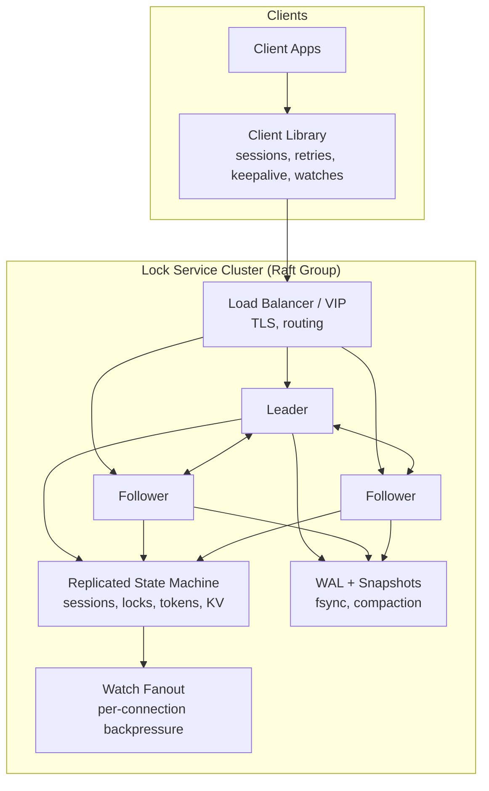
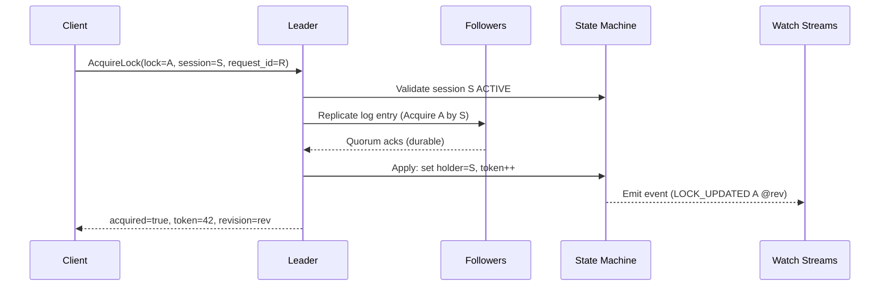
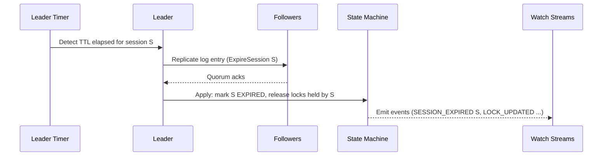

## Overview

A distributed lock service is a coordination primitive that provides **mutual exclusion** for shared resources across many unreliable clients. The hard part is not tracking “who holds the lock,” but doing so **safely** under network partitions, process crashes, long GC pauses, clock drift, and retry storms—while still offering **low-latency, linearizable** semantics that other systems can trust.

This design follows the proven pattern of **Chubby / ZooKeeper / etcd**: a small replicated control-plane cluster that provides:

- **Linearizable writes** (acquire/release, session/lease state)
- **Linearizable reads** (optional but supported) and cheaper **serializable reads** (optional)
- **Leases/sessions** for liveness and automatic cleanup of ephemeral state
- **Watches** for efficient notification (to avoid polling)
- **Fencing tokens** to prevent stale clients from corrupting downstream systems

The key separation is:

- **Safety**: ensured by **consensus** (single authoritative history) and **fencing tokens**
- **Liveness**: ensured by **leases/sessions** (TTL + keepalive) and bounded failure detection

> Core rule: locks are only “safe” if *downstream systems enforce fencing tokens* (or an equivalent monotonic guard).

---

## Requirements

### Functional Requirements

- Create and manage **sessions** with server-assigned leases (TTL-based).
- Support **Acquire/Release** of named locks with **linearizable** semantics.
- Return a **fencing token** (monotonically increasing per lock name) on successful acquire.
- Automatically revoke locks and ephemeral keys when a session expires.
- Provide **watch/notify** APIs to wait for changes without polling.
- Support:
  - `TryAcquire` (no-wait)
  - `Acquire(wait, timeout)` (wait with bounded resource usage)
  - **Reentrant** locks per session (optional; common in practice)
- Provide primitives commonly built atop leases:
  - ephemeral membership (presence)
  - leader election recipes (e.g., “smallest sequential node” pattern, if implemented)
- Expose admin endpoints for:
  - health and readiness
  - metrics
  - membership changes (add/remove voter/learner)
  - snapshots/backup triggers (optional)

### Non-Functional Requirements

#### Scale (single cluster, single region)
- **Sessions**: 50,000 concurrent
- **Locks (active)**: 200,000
- **Total keys** (locks + ephemeral/membership + metadata): up to 5,000,000
- **Traffic**
  - Reads (`Get`, `Watch` streams): ~20,000 QPS
  - Writes (linearizable): ~7,000 QPS typical peak
    - KeepAlive: 50k sessions, keepalive every 10s ⇒ **~5,000 QPS**
    - Lock ops (Acquire/Release combined): **~2,000 QPS** peak

> If you need materially higher write rates, you typically scale by **more clusters** (namespaces/tenants) rather than trying to shard a single consensus group.

#### Latency targets (single region, healthy quorum, NVMe/SSD)
- Linearizable writes (Acquire/Release/KeepAlive):
  - P50 **< 10ms**
  - P99 **< 50ms**
- Linearizable reads (`Get` with `linearizable=true`):
  - P50 **< 5ms**
  - P99 **< 25ms**
- Watch delivery:
  - P99 **< 250ms** from commit to client receive (assuming healthy client connection)

#### Availability & behavior under partitions
- **SLO**: 99.99% monthly availability for quorum-available scenarios
- **Safety over availability** for writes:
  - Without quorum: **no lock writes** (Acquire/Release/KeepAlive reject)
  - Optional: allow **serializable reads** from followers when leader/quorum unavailable (clearly labeled as potentially stale)

#### Consistency model
- **Linearizable**:
  - Acquire/Release
  - session lifecycle (create/renew/expire)
  - fencing token assignment
- **Watch**:
  - at-least-once delivery
  - may include duplicates / reordering across reconnects
  - clients must treat watch events as **hints** and re-check state (via `Get` or retry Acquire)

#### Durability & recovery
- Committed operations are not lost:
  - WAL is persisted before acknowledging commit (fsync or equivalent durability)
  - snapshots bound replay time
- In-region: **RPO = 0** (for committed entries), **RTO < 1 minute** typical for single-node restart / leader failover
- Cross-region DR: configurable, typically **RPO minutes** and **RTO 15–30 minutes** (unless you accept higher latency by doing synchronous multi-region consensus)

### Constraints & Assumptions

- Small ops team; correctness and operability prioritized over maximum throughput.
- Client libraries exist for at least Go/Java/Python and provide consistent semantics.
- Primary deployment is single region for low latency; DR is optional.
- Security baseline:
  - TLS everywhere; optional mTLS for internal workloads
  - authn/authz and audit logs for administrative actions
- Cost: small clusters (3–5 nodes) with predictable CPU/disk; avoid heavyweight dependencies.

---

## Architecture

### High-level diagram

### Core invariants

1. **Single-writer history**: all state transitions that affect lock ownership and fencing tokens are committed through Raft.
2. **Leases are authoritative**: sessions are considered valid only if their lease is valid in the replicated state.
3. **Fencing tokens are monotonic per lock**: incremented only on successful acquisition, and never reused.
4. **Watches are advisory**: correctness never depends on receiving watch events.

---

## Components

### 1) Raft Consensus Layer

**Responsibility**: Provide a single, linearizable log of state transitions with a leader per term.

**Key design choices**
- 3 nodes is typical for latency and cost; 5 nodes for higher fault tolerance (but higher write latency).
- Use a production-proven Raft implementation (etcd-style) with:
  - pre-vote to reduce disruption
  - joint consensus for membership changes
  - snapshotting + log compaction

**Write path (linearizable)**
- Client request → leader appends log entry → replicate to followers → quorum fsync/ack → commit → apply to state machine → respond.

**Read path**
- Linearizable read: leader uses `ReadIndex` (or equivalent) to ensure it is current with quorum.
- Optional serializable read: follower/local read without quorum (stale possible).

### 2) Replicated State Machine (Locks + Sessions)

**Responsibility**: Deterministically apply committed log entries to produce:
- session table (lease TTL, expiry, status)
- lock table (holder session, reentrancy count, fencing token)
- optional KV namespace (for ephemeral membership and recipes)

**Important properties**
- Deterministic application: given the same log, all nodes converge to identical state.
- Revisioning: each committed log index becomes a **revision** used by:
  - watch resume (`start_revision`)
  - idempotency records
  - debugging and audits

### 3) Lease & Session Manager

**Responsibility**: Manage session leases (TTL) and ensure cleanup of ephemeral state.

**Key design choices**
- Server uses **monotonic time** for lease accounting; never trusts client clocks.
- KeepAlive updates are committed (linearizable), so lease extensions are consistent across the cluster.
- Expiry is applied via a committed operation (e.g., `ExpireSession(session_id, at_revision)`), triggered by the leader when it observes TTL elapsed.

**Tuning defaults**
- Default TTL: **30s**
- Client keepalive period: **10s** (≈ TTL/3)
- Expiry grace: small jitter (e.g., ±250ms) to avoid synchronized storms

### 4) Lock Manager (with Fencing Tokens)

**Responsibility**: Implement lock semantics and generate fencing tokens.

**Lock semantics**
- Acquire is successful if:
  - session is ACTIVE
  - lock is free, or is already held by the same session (reentrant)
- Release is successful if:
  - lock is held by the session (or reentrant count decrements to zero)

**Fencing tokens**
- Per `lock_name`, store a counter `next_token`.
- On successful acquisition from free → held:
  - increment token and return the new value.
- On reentrant acquire:
  - typically return the *existing* fencing token for that holder.

> Tokens must be enforced by the downstream resource to be meaningful.

### 5) Watch Dispatcher

**Responsibility**: Efficiently notify clients of state changes.

**Semantics**
- At-least-once delivery per stream.
- Events are tagged with revision.
- On overflow/slow consumers:
  - drop buffered events and send a “compacted/overflow” signal requiring client resync from a revision or do a fresh `Get`.

**Resource controls**
- Max watches per session/client.
- Per-stream outbound buffer limits (bytes and event count).
- Rate limits on watch creation and event delivery.

---

## Data Model

The physical storage is typically a key-value map plus indexes, but shown here logically.

### Sessions

**sessions**
- `session_id` (UUID)
- `client_id` (string)
- `ttl_ms` (int32)
- `lease_expiry_mono_ms` (int64)
- `status` (`ACTIVE|EXPIRED|REVOKED`)
- `created_revision` (int64)
- `last_keepalive_revision` (int64)

### Locks

**locks**
- `lock_name` (string, primary key)
- `holder_session_id` (UUID, nullable)
- `fencing_token` (int64, last issued token for this lock)
- `reentrancy_count` (int32)
- `acquired_revision` (int64)
- `updated_revision` (int64)

### Idempotency (recommended)

**idempotency_keys**
- `session_id` (UUID)
- `request_id` (string/UUID)
- `op` (enum/string)
- `result` (bytes/json)
- `expires_revision` or `expires_mono_ms`

> Must be bounded (TTL + size cap) to prevent unbounded growth.

### Events / Revisions

Events can be derived from state transitions; many systems store a compact “watch event” stream keyed by revision.

**watch_events** (optional materialization)
- `revision` (int64)
- `key` (string)
- `type` (enum: `LOCK_UPDATED`, `SESSION_EXPIRED`, …)
- `payload` (bytes/json)

---

## Request/Response Flows

### Acquire with fencing token

### Lease expiry and automatic revoke

---

## API Design (gRPC)

Use gRPC for low-latency streaming (KeepAlive/Watch). A REST gateway can be added for admin/debug, but core correctness should rely on gRPC.

### Core RPCs (proto-like)

#### CreateSession
- Request: `client_id`, `ttl_ms`
- Response: `session_id`, `lease_expiry_unix_ms`, `revision`

Errors:
- `INVALID_ARGUMENT` (bad TTL)
- `RESOURCE_EXHAUSTED` (session limits)
- `UNAVAILABLE` (no leader/quorum)

#### KeepAlive (bi-directional stream)
Client stream:
- `session_id`

Server stream:
- `session_id`, `lease_expiry_unix_ms`, `revision`

Semantics:
- Linearizable lease extension.
- If session is expired/revoked, server returns `FAILED_PRECONDITION`.

Errors:
- `NOT_FOUND` (unknown session)
- `FAILED_PRECONDITION` (expired/revoked)
- `UNAVAILABLE` (no leader/quorum)

#### AcquireLock
Request:
- `session_id`
- `lock_name`
- `wait` (bool)
- `timeout_ms` (int32)
- `request_id` (string/UUID)

Response:
- `acquired` (bool)
- `fencing_token` (int64, only meaningful if acquired)
- `revision` (int64)

Semantics:
- Linearizable.
- If `wait=false` and lock is held by another session → `acquired=false`.
- If `wait=true`, recommended pattern is:
  1) server returns quickly with `acquired=false` and `recommended_start_revision`
  2) client sets a watch and retries Acquire on notification (avoids server-side waiter buildup)

Idempotency:
- `(session_id, request_id)` must not cause multiple token increments on retry.

Errors:
- `NOT_FOUND` (no session)
- `DEADLINE_EXCEEDED` (timeout)
- `ABORTED` (leader change; retryable)
- `UNAVAILABLE` (no leader/quorum)

#### ReleaseLock
Request:
- `session_id`, `lock_name`, `request_id`

Response:
- `released` (bool), `revision`

Semantics:
- Linearizable and idempotent.
- If lock not held by session:
  - either `released=false` (simple) or `PERMISSION_DENIED` (stricter). Pick one and keep consistent.

#### GetLock
Request:
- `lock_name`
- `linearizable` (bool)

Response:
- `held` (bool)
- `holder_session_id` (string)
- `fencing_token` (int64)
- `revision` (int64)

#### Watch
Request:
- `prefix` (string) or `key`
- `start_revision` (int64)

Stream:
- `revision`, `key`, `type`, `payload`

Semantics:
- at-least-once
- on compaction/overflow: server returns a special error/detail instructing client to resync

### Client-library contract (what interviewers look for)

- Maintains exactly one session per process (or per logical client identity).
- Keeps KeepAlive stream open; reconnects with backoff and jitter.
- Treats `FAILED_PRECONDITION` (expired) as terminal: stop using any held locks and force re-acquire.
- Uses watches for waiting; does not busy-loop Acquire.
- Exposes a clear “lease lost” signal to application code.

---

## Fencing Tokens (Downstream Enforcement)

A lock service can only guarantee “at most one holder at a time” at the lock layer. To protect the *resource*, downstream must enforce the fencing token.

Common enforcement patterns:

- **Database row**: `UPDATE resource SET owner=?, token=? WHERE token < ?`
- **Job scheduler**: accept work only if `token` ≥ last seen token for that resource
- **Object store / blob**: store token in metadata and reject writes with smaller token

If the downstream cannot enforce monotonicity, the lock is vulnerable to:
- stalled client resuming after lease expiry
- partitioned client continuing to act locally

---

## Scaling & Performance

### Capacity reality check

With the targets above:
- KeepAlive write rate is dominated by session count:
  - 50k sessions / 10s = **5k writes/s**
- Each write requires:
  - leader append + fsync (group commit helps)
  - replication to followers
  - quorum ack

This is achievable on 3 nodes with fast disks and careful batching, but:
- **disk latency variance** (fsync tail latency) is often the primary driver of P99
- watch fanout and connection count drive memory and CPU

### Primary bottlenecks & mitigations

- **Consensus write throughput**
  - Streaming keepalive (one stream per client) to reduce per-request overhead
  - Coalesce keepalive updates (e.g., apply at most once per session per 200ms)
  - Snapshot + compaction to keep log small
  - Fast NVMe/SSD; avoid network-attached disks with unpredictable fsync

- **Hot locks / thundering herd**
  - Watch-based waiting + jittered retry
  - Application-level lock striping (e.g., shard work items)
  - Rate limits per lock prefix if a single lock becomes pathological

- **Watch memory pressure**
  - Bound per-stream buffers
  - Drop + resync semantics
  - Max watches per client; require prefix selection discipline

### Horizontal scaling strategy

A single Raft group does not scale writes linearly. The standard approach is:
- Run **multiple independent clusters** partitioned by:
  - tenant
  - environment (prod/staging)
  - namespace/prefix (`teamA/*`, `teamB/*`)
- Keep each cluster 3 nodes unless you have a strong reason for 5.

Within one cluster:
- Use followers for cheaper (serializable) reads if acceptable.
- Keep linearizable reads on leader (ReadIndex) for correctness.

### Caching

- Client-side cache for non-critical reads (short TTL, e.g. 250ms) is fine if:
  - Acquire remains linearizable
  - cache is invalidated on watch events (best-effort)
- Avoid server-side caching that weakens read-your-writes guarantees.

---

## Trade-offs & Alternatives

### Trade-offs made

1) **Linearizable locking via consensus**
- Benefit: no split-brain locks; strong correctness
- Cost: writes unavailable without quorum; throughput bounded by quorum commit latency

2) **Leases + fencing tokens**
- Benefit: protects against stalled clients and ambiguous failure detection
- Cost: more complexity; requires downstream enforcement to be truly safe

3) **Watch-based waiting instead of server-side waiter queues**
- Benefit: avoids unbounded server memory under contention; scales better
- Cost: more client complexity; duplicates/reconnect handling required

### Alternatives (and when they fit)

- **Redis locks / Redlock**
  - Good for: best-effort coordination where occasional anomalies are tolerable
  - Risk: subtle failure modes under partitions/failover; fencing often missing; not ideal for foundational primitives

- **Database locks (row/advisory locks)**
  - Good for: coordination tightly coupled to a single DB, small scale
  - Limitations: hard to scale cross-service; poor watch semantics; can overload the DB

- **Gossip / eventual coordination**
  - Good for: high availability membership/health hints
  - Not suitable for: general-purpose mutual exclusion requiring linearizability

- **Single-writer ownership service**
  - If one service can safely own the resource, you can sometimes avoid distributed locks entirely.

---

## Failure Modes & Mitigations

### 1) Leader crash / restart
- Impact: write unavailability during election (typically 200ms–2s, depending on timeouts)
- Mitigations:
  - tuned election timeouts (avoid too-low values causing flapping)
  - client retries with jittered backoff
  - expose leader identity for faster reroute (optional)

### 2) Cluster partition / quorum loss
- Impact:
  - minority partition becomes read-only
  - writes rejected (safety preserved)
- Mitigations:
  - clear `UNAVAILABLE` / “no quorum” errors
  - optional serializable reads from followers for diagnostics only

### 3) Client stall (GC pause) beyond TTL
- Impact:
  - session expires; locks revoked; client may continue executing
- Mitigations:
  - fencing tokens prevent stale writes
  - client library emits “lease lost” and forces stop/re-acquire

### 4) Slow disk / fsync tail latency
- Impact:
  - write P99 spikes; watch delivery delays; potential timeouts
- Mitigations:
  - NVMe/SSD and disk health monitoring
  - WAL group commit
  - alert on fsync P99 and queue growth
  - shed load (rate limit keepalive bursts) before collapse

### 5) Watch overload / slow consumer
- Impact:
  - memory pressure; delayed events; dropped buffers
- Mitigations:
  - bounded buffers + drop/resync protocol
  - per-client watch limits
  - backpressure-aware streaming and metrics

### 6) Bugs or non-determinism in state machine
- Impact: divergence across replicas (worst-case catastrophic)
- Mitigations:
  - strict determinism rules
  - schema/version gating
  - replay tests on recorded WAL segments
  - canary rollout + feature flags for state changes

---

## Disaster Recovery

### In-region
- RPO: **0** for committed operations
- RTO: **< 1 minute** typical for leader failover + process restart
- Practice:
  - anti-affinity across AZs
  - automated restart
  - periodic snapshots for fast recovery

### Cross-region
Two common approaches:

1) **Async DR (recommended for low-latency primary)**
- Ship snapshots + WAL segments to object storage in another region.
- RPO: **1–5 minutes** (configurable)
- RTO: **15–30 minutes**

2) **Synchronous multi-region consensus (rare; expensive)**
- Stronger RPO, but much higher write latency (cross-region RTT).
- Usually only justified for very high criticality and when clients tolerate higher latencies.

Failover behavior:
- Clients reconnect and create new sessions.
- Locks are not guaranteed to be “preserved” across region failover; applications must tolerate re-acquire and rely on fencing.

---

## Operations

### Monitoring (golden signals + Raft specifics)

Key metrics:
- Raft:
  - leader changes / term increases
  - commit latency (P50/P99)
  - replication lag per follower
  - log size, snapshot duration, compaction time
- Storage:
  - WAL fsync latency (P50/P99)
  - disk queue depth, IOPS, %util, free space
- API:
  - QPS by method
  - error rate by code (`UNAVAILABLE`, `ABORTED`, `FAILED_PRECONDITION`, …)
  - end-to-end latency P50/P99
- Leases:
  - active sessions
  - keepalive QPS
  - expirations per minute (and spikes)
- Watches:
  - active watch streams
  - event fanout rate
  - dropped/compacted events
  - reconnect rate

Example alerts:
- No leader for > 10s
- Commit latency P99 > 100ms for 5m
- WAL fsync P99 > 20ms for 5m
- Snapshot/compaction failures > 0
- Watch drops > 0.1% of events
- Session expirations spike > 10× baseline (often indicates network issues)

### Deployment & upgrades

- Rolling upgrade one node at a time; maintain quorum.
- Version state machine changes carefully:
  - forward-compatible encodings
  - feature gated by cluster version
- Prefer “roll forward” for state machine bugs; rollback can be unsafe if log/snapshot formats change.

### Administrative controls

- Authenticated membership changes (learner → voter).
- Snapshot and compaction controls (with safe defaults).
- Rate limit knobs (per-client sessions/watches/QPS).
- Audit logs for:
  - membership changes
  - config changes
  - manual revokes (if supported)

### Common pitfalls (practical interview guidance)

- Using locks for long-lived work without heartbeats/checkpoints.
- Assuming “Release succeeded” implies safety (it doesn’t under partitions).
- Building workflows that require strict fairness (most lock services provide only best-effort fairness).
- Relying on watches without re-checking state (watches are advisory).

---

## References & Further Reading

- *The Chubby lock service for loosely-coupled distributed systems* (Burrows)
- ZooKeeper documentation and recipes (watches, ephemeral nodes)
- etcd documentation (Raft, linearizable reads, watch semantics)
- *In Search of an Understandable Consensus Algorithm (Raft)* (Ongaro, Ousterhout)
- Jepsen analyses of coordination systems (real failure modes under partitions)
- Fencing token patterns (e.g., HDFS, Kubernetes controllers, distributed schedulers)