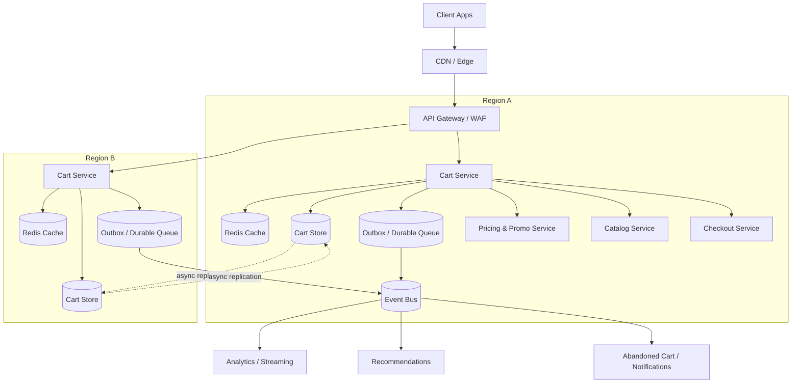
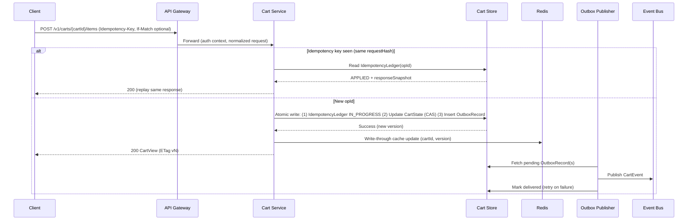

## Overview

A shopping cart seems simple (add/remove items, show totals), but becomes non-trivial at scale when you need cross-device persistence, low latency, multi-region availability, and correct checkout semantics despite concurrent updates and flaky clients.

A production-grade design separates two concerns:

- **Browsing cart = highly available collaboration object**: low-latency reads/writes, tolerant of retries and conflicts, and resilient when dependencies (pricing/promo) are slow.
- **Checkout = strong consistency boundary**: authoritative price/promo/tax/inventory validation and order creation must be deterministic and atomic (or orchestrated safely), regardless of how “stale” browsing state may be.

This document focuses on building a cart system that is fast and always-on during browsing, while guaranteeing correctness where money and inventory are committed.

---

## Requirements

### Functional Requirements

- Create carts for **guest** and **authenticated** users.
- Persist authenticated carts across sessions/devices; guest carts persist via cookie/device token.
- Mutate cart contents:
  - Add item, remove item, set quantity, update options.
  - Apply/remove promo codes (best-effort validation in cart view).
- Return a cart “view” including items, best-effort computed totals, and warnings (e.g., price changed, out of stock).
- Support **idempotent** mutations (safe retries) and concurrent updates across devices.
- Merge guest cart into user cart on login with deterministic rules.
- Support cart expiration + cleanup without deleting active carts.
- At checkout, produce a canonical “checkout-ready” snapshot and create an order with consistent final pricing/taxes/promos and inventory reservation.

### Non-Functional Requirements (Targets)

**Scale (example sizing)**
- 20M DAU.
- Peak: **50k read QPS**, **10k write QPS** (cart endpoints).
- Average cart size: 10–30 items; **~2–10 KB** stored state typical (items + metadata), with a hard cap.

**Latency (regional, not including client network)**
- `GET cart`: P50 **15–30 ms**, P99 **80–150 ms** (cache-hit path).
- Cart mutation: P50 **30–60 ms**, P99 **150–300 ms** (includes durable write).
- Checkout validate+reserve+create order: P50 **200–400 ms**, P99 **800–1500 ms** (dependency-driven).

**Availability**
- Browsing cart read/write: **99.95–99.99%** (multi-AZ; multi-region failover).
- Checkout confirm: **99.9–99.95%** (strong dependencies: inventory, pricing, order DB).

**Consistency**
- Browsing: eventual convergence across devices/regions; session-level monotonic reads best-effort.
- Checkout: strong consistency for inventory reservation and order creation; authoritative recalculation.

**Durability**
- No acknowledged mutation lost under **single-AZ failure** (multi-AZ durability).
- Under **sudden full-region loss**, replication mode determines RPO:
  - Async multi-region replication: small but non-zero RPO (typically seconds).
  - Optional dual-region commit: near-zero RPO, higher latency/cost.

### Constraints & Assumptions

- Deployed in 2–3 regions; clients routed to nearest healthy region.
- Promotions/pricing/inventory are owned by separate services; cart must degrade gracefully.
- Prefer managed services (e.g., DynamoDB/Spanner/Cassandra-as-a-service; managed Redis; managed Kafka/PubSub).
- Payment is handled out of PCI scope; cart does not store PAN data.
- Minimize cross-region synchronous writes during browsing; accept eventual convergence.

---

## Architecture

### High-Level Architecture



### Key Design Choices

- **Stateless Cart Service** behind an API gateway; scale horizontally.
- **Redis** for low-latency reads and write-through updates.
- **Durable Cart Store** as the source of truth (document or wide-row model).
- **Idempotency ledger** to guarantee “exactly-once effect” for retries.
- **Transactional outbox** (or equivalent) to reliably publish events without losing them on process crashes.
- **Checkout is separate** and re-validates everything authoritatively.

### Read/Write and Consistency Model

**Browsing reads**
- Prefer Redis (`cartId → CartState/CartView`).
- On miss: load from Cart Store, populate cache with TTL+jitter.
- Serve **best-effort totals**; if dependencies are slow, return last-known totals + warnings.

**Browsing writes**
- Require `Idempotency-Key`.
- Apply mutation with optimistic concurrency (ETag/version) where possible.
- Persist mutation + updated cart state durably before acknowledging.
- Update cache and emit an event (via outbox).

**Multi-region**
- Recommended default: **home-region affinity per cart** (reduces conflicts).
  - Writes received in a non-home region can be forwarded/redirected to the home region.
  - On region failure, home-region assignment can fail over (controlled, observable).
- Optional “accept local writes everywhere” mode increases availability but needs stronger merge semantics and typically higher conflict rates.

**Checkout boundary**
- Checkout never trusts cart-view totals.
- Checkout performs authoritative recalculation and reserves inventory with strong guarantees.

---

## Components

### API Gateway (Edge)

**Responsibilities**
- Authn/authz (user vs guest), rate limiting, WAF protections.
- Request normalization, timeouts, and retry policy guidance.
- Enforce idempotency requirement on mutations.

**Notes**
- Rate limit per user/device + per cartId to protect hot keys.
- Consider request hedging only for safe idempotent operations.

### Cart Service

**Responsibilities**
- Cart CRUD/mutations, deterministic merge on login, warnings/totals rendering.
- Idempotency enforcement and optimistic concurrency.
- Cache management and dependency orchestration (pricing/promo/catalog reads).
- Event emission via outbox.

**Hot-key protections**
- Per-cart request coalescing (singleflight) for cache-miss reads and expensive recomputations.
- Per-cart token-bucket throttling for mutation storms (flash sales).

### Cart Store (Durable Persistence)

**Responsibilities**
- Store the canonical cart state and idempotency metadata.
- Support conditional updates (compare-and-swap) and TTL expiration.

**Technology options**
- Managed: DynamoDB (Global Tables), Spanner, Cosmos DB (multi-region).
- Self/managed: Cassandra/Scylla multi-DC (LOCAL_QUORUM per region).

**Operational guidance**
- Prefer partitioning by `cartId` with bounded item count and payload size.
- Use conditional writes on `version` (and/or per-item sub-versioning) to detect races.

### Redis Cache

**Responsibilities**
- Cache CartState/CartView for low-latency reads.
- Reduce load on Cart Store and downstream dependencies.

**Practices**
- TTL 5–30 minutes + jitter; optional soft-TTL with background refresh.
- Write-through on successful mutations; version embedded to detect stale entries.

### Outbox + Event Bus

**Why**
- If events matter (analytics, notifications, rebuild/debug), publishing must be reliable.
- Direct “write DB then publish bus” can lose events on crashes between steps.

**Pattern**
- Persist an outbox record in the same transaction/atomic write as the cart update (or in the same DynamoDB transaction).
- Asynchronously publish to the event bus; retry with backoff; mark outbox record delivered.

### Checkout Service (Strong Consistency Boundary)

**Responsibilities**
- Create a checkout intent, compute authoritative preview, and confirm to create an order.
- Reserve inventory (or validate availability) and create order with idempotency.

**Practices**
- Server-generated `checkoutIntentId` with TTL (e.g., 10–30 minutes).
- Confirm endpoint is idempotent and safe under retries/timeouts.
- Use Saga/orchestration if inventory and order creation span services.

---

## Data Model

### Keys and Identifiers

- `cartId`:
  - Authenticated: `user:{userId}`
  - Guest: `guest:{guestId}` (guestId stored in cookie/local storage; rotate with care)
- `itemKey`: stable identifier for a line item, e.g. `hash(skuId + normalizedOptions)`.
- `version`: monotonic integer per cart update (used for ETag/If-Match and cache validation).

### CartState (document or wide-row)

- `cartId` (PK)
- `ownerType` (`USER|GUEST`)
- `userId` (nullable)
- `currency`
- `version`
- `items[]`:
  - `itemKey`, `skuId`, `qty`
  - `options` (normalized map) or `optionsHash`
  - `addedAt`, `updatedAt`
- `promoCodes[]`
- `lastComputedTotals` (best-effort, non-authoritative):
  - `subtotal`, `discount`, `taxEstimate`, `shippingEstimate`, `grandTotal`
  - `computedAt`, `pricingSnapshotVersion`
- `warnings[]` (e.g., `PRICE_STALE`, `PROMO_UNVERIFIED`, `OOS_POSSIBLE`)
- `updatedAt`
- `expiresAt` (TTL)

**Recommended limits**
- Max items/cart: 200 (configurable).
- Max payload size: keep within store limits (e.g., DynamoDB 400KB item limit; aim far below).

### IdempotencyLedger (per cart)

Purpose: guarantee **exactly-once effect** per mutation key.

- `cartId` (PK)
- `opId` (SK) = hash(`Idempotency-Key` + route)
- `requestHash` (detect reuse with different payload)
- `status` (`IN_PROGRESS|APPLIED|REJECTED`)
- `responseSnapshot` (small, optional)
- `createdAt`, `expiresAt` (TTL 24–72h)

### OutboxRecord (if using outbox)

- `cartId` (PK)
- `eventId` (SK)
- `type`, `payload`, `opId`, `occurredAt`
- `deliverAfter` (for backoff)
- `deliveredAt` (nullable)
- TTL (optional; keep long enough for retries and audits)

### Retention & Expiration

- Guest carts: TTL 7–14 days since last update.
- User carts: TTL 30–90 days since last update (business-driven).
- Idempotency ledger: TTL 24–72 hours (long enough for client retries and delayed networks).

---

## Data Flow

### Mutation Write (Idempotent + Durable)



### Read Path (Cache-Aside)

- Client calls `GET /v1/carts/{cartId}`.
- Cart Service:
  - Check Redis; if hit, return quickly.
  - On miss, load from store, compute best-effort view, populate Redis.
  - If pricing/promo calls exceed budget, return last-known totals + warnings.

---

## API Design

### Authentication and Guest Identity

- Authenticated requests include user auth (JWT/session).
- Guest carts use a `guestId` stored in a secure, httpOnly cookie where possible.
- The server validates that callers may access the referenced `cartId`.

### Get Cart

- `GET /v1/carts/{cartId}`
- Headers:
  - `If-None-Match: "v{version}"` (optional)
- Responses:
  - `200` cart view + `ETag: "v{version}"`
  - `304` not modified
  - `404` unknown cart (or `200` empty cart, depending on product choice)
  - `503` unavailable

### Mutations (Idempotent)

All mutation endpoints require:
- `Idempotency-Key: <uuid>` (required)
- `If-Match: "v{version}"` (recommended for clients that can maintain state)

**Add item**
- `POST /v1/carts/{cartId}/items`
- Body:
  ```json
  { "skuId": "SKU123", "qtyDelta": 1, "options": { "size": "M", "color": "black" } }
  ```
- Responses:
  - `200` updated cart view + new ETag
  - `412` precondition failed (If-Match version mismatch)
  - `409` idempotency key reused with different payload
  - `422` invalid options/qty

**Set quantity**
- `PUT /v1/carts/{cartId}/items/{itemKey}`
- Body:
  ```json
  { "qty": 3 }
  ```

**Remove item**
- `DELETE /v1/carts/{cartId}/items/{itemKey}`

### Promo Codes (Best-Effort in Cart)

- `POST /v1/carts/{cartId}/promos` body `{ "code": "SAVE10" }`
- `DELETE /v1/carts/{cartId}/promos/{code}`
- Cart view may include warnings like `PROMO_UNVERIFIED`; checkout is authoritative.

### Merge Guest Cart on Login

- `POST /v1/carts/user:{userId}/merge`
- Body: `{ "fromCartId": "guest:abc" }`
- Deterministic rules (example):
  - Items merged by `itemKey`.
  - Quantities summed with cap (e.g., 99).
  - Promo codes unioned; duplicates removed.
  - If conflicts occur (e.g., invalid options), keep user cart and surface warnings.
- Idempotent with `Idempotency-Key`.

### Checkout Intent (Strong Consistency)

**Create intent**
- `POST /v1/checkout/intents`
- Body:
  ```json
  { "cartId": "user:123", "shippingAddressId": "addr_1", "paymentMethodId": "pm_1" }
  ```
- Response: `{ "checkoutIntentId": "...", "expiresAt": "...", "orderPreview": {...}, "warnings": [...] }`

**Confirm**
- `POST /v1/checkout/intents/{checkoutIntentId}/confirm`
- Headers: `Idempotency-Key` required
- Behavior:
  - Authoritative price/promo/tax recomputation.
  - Inventory reservation and order creation (atomic within order DB; orchestrated across services).
  - Returns order id and final totals; failures are explicit and retry-safe.

---

## Scaling & Performance

### Capacity Planning (Back-of-the-Envelope)

- Peak 10k write QPS, each write updates one cart item:
  - Cart Store write throughput sized for conditional writes + idempotency/outbox records (often 2–3 writes per mutation if not transactional).
  - Prefer transactional/atomic write primitives where available (e.g., DynamoDB transactions) to reduce partial-state edge cases.
- Redis memory:
  - If caching 5M active carts at ~5KB average payload: ~25GB raw, plus overhead; plan for 2–4× overhead depending on encoding.
  - In practice, cache fewer (hot carts), compress payloads, and keep TTL moderate.

### Partitioning and Hot Keys

- Partition Cart Store by `cartId` hash to distribute load.
- Preserve **per-cart ordering** in the event bus by partitioning on `cartId`.
- Mitigate flash-sale hotspots:
  - Rate limit per cart/user.
  - Coalesce requests.
  - Degrade totals computation (skip pricing calls, return warnings).

### Dependency Budgets

- Pricing/promo calls are latency amplifiers.
- Enforce strict timeouts (e.g., 30–80ms budget in cart view) and circuit breakers.
- Cache price snapshots where acceptable, but always revalidate at checkout.

---

## Trade-offs & Alternatives

### Trade-offs Made

1. **Eventual consistency during browsing**
   - Gain: low latency and high availability under partitions.
   - Cost: cross-device convergence is not instantaneous; conflicts can occur.
   - Mitigation: home-region affinity + deterministic merge + clear UX warnings.

2. **Optimistic concurrency + idempotency ledger**
   - Gain: no distributed locks; safe retries; scalable writes.
   - Cost: clients may see `412` and must refetch/retry; ledger adds storage/write overhead.
   - Mitigation: good SDKs, server-side merge for some operations, bounded TTL ledger.

3. **Best-effort totals in cart**
   - Gain: fast UX even when pricing/promo is slow.
   - Cost: displayed totals can be stale.
   - Mitigation: explicit warnings and authoritative checkout recompute.

4. **Outbox for reliable events**
   - Gain: prevents silent event loss.
   - Cost: extra storage + background publisher complexity.
   - Mitigation: keep payload small; retry with backoff; monitor outbox lag.

### Alternatives

- **Strongly consistent cart (single region or synchronous quorum)**
  - Pros: simpler mental model, fewer merge surprises.
  - Cons: cross-region latency and lower availability during partitions.

- **Event-sourced cart as source of truth**
  - Pros: excellent auditability; easy replay for debugging.
  - Cons: read amplification; requires compaction/materialization and careful versioning.

- **CRDT-based cart (OR-set/PN-counters)**
  - Pros: automatic convergence across regions without conflicts.
  - Cons: more complex semantics for promos/options; metadata growth and implementation complexity.

---

## Failure Modes & Mitigations

### Scenarios (Examples)

1. **Redis outage / partition**
   - Impact: higher latency and Cart Store load; potential thundering herd.
   - Mitigation: cache-aside fallback, request coalescing, temporary stricter rate limits, progressive re-warm.

2. **Cart Store throttling / hot partitions**
   - Impact: elevated error rates and p99 latency; failed mutations.
   - Mitigation: adaptive throttling, exponential backoff with jitter, partition-key salting only if necessary (prefer fixing access patterns first), raise capacity, protect hot carts.

3. **Client retries/timeouts causing duplicate mutations**
   - Impact: double increments/removals without safeguards.
   - Mitigation: require `Idempotency-Key`, store `requestHash`, replay cached response for duplicates.

4. **Conflicting updates from multiple devices/regions**
   - Impact: unexpected quantity/options after merge; occasional `412`.
   - Mitigation: home-region affinity, optimistic concurrency, deterministic merge rules for server-side merges, UX hint “updated elsewhere”.

5. **Pricing/Promo dependency slow/unavailable**
   - Impact: missing/incorrect totals in cart view; slower responses.
   - Mitigation: strict timeouts, circuit breaker, cached snapshots, warnings; checkout recompute always authoritative.

6. **Event bus outage**
   - Impact: delayed analytics/notifications; missing downstream signals without outbox.
   - Mitigation: outbox + retry; alert on outbox backlog; degrade non-critical consumers.

7. **Sudden full-region loss**
   - Impact: failover; possible small data loss if using async replication.
   - Mitigation: health-based routing, home-region reassignment, optional dual-region commit for higher durability tiers, clear operational RPO expectations.

### DR Targets (Example)

- **RTO**: 15–30 minutes for full-region loss (including traffic shift and stabilization).
- **RPO**:
  - Multi-AZ: ~0 for acknowledged writes.
  - Multi-region async: typically seconds; validate with chaos tests and measured replication lag.
- Run game days: region evacuation, dependency brownouts, and cache loss scenarios.

---

## Operations

### SLOs and SLIs

- SLIs:
  - `GET /carts` availability, p50/p95/p99 latency.
  - Mutation success rate, p99 latency, `412` rate.
  - Redis hit rate and eviction rate.
  - Cart Store throttles and conditional check failures.
  - Outbox backlog age (oldest undelivered record).
  - Dependency latency/error (pricing/promo/catalog).

- Example SLOs:
  - Browsing reads: 99.95% monthly availability; p99 < 150ms.
  - Browsing writes: 99.9–99.95% monthly availability; p99 < 300ms.
  - Checkout confirm: 99.9% monthly availability; p99 < 1500ms.

### Monitoring and Alerting

- Page on:
  - Error-rate SLO burn for reads/writes.
  - Sustained Cart Store throttling or replication lag spikes.
  - Redis hit-rate collapse or eviction storm.
  - Outbox backlog age > threshold (e.g., >5 minutes).
- Investigate dashboards:
  - Per-endpoint latency breakdown and dependency traces.
  - Hot cartIds / top talkers.
  - Idempotency conflicts (same key different payload).

### Deployment and Schema Evolution

- Progressive delivery (canary → ramp) with automated rollback on SLO regression.
- Backward-compatible schema evolution (additive fields; tolerate unknown fields).
- Feature flags for:
  - Totals computation strategy
  - Merge behavior
  - Home-region routing policy
- Load tests for flash-sale patterns; chaos tests for dependency outages.

### Security & Privacy

- Access control: ensure callers can only access their cart (`userId` binding; guest token validation).
- Encrypt at rest and in transit; avoid storing sensitive payment data.
- Log hygiene: redact PII; treat promo/payment identifiers carefully.
- Abuse protections: WAF rules, bot detection, and per-cart mutation limits.

---

## References & Further Reading

- DynamoDB Global Tables: https://docs.aws.amazon.com/amazondynamodb/latest/developerguide/GlobalTables.html
- Designing Data-Intensive Applications (consistency, replication, idempotency): https://dataintensive.net/
- Stripe: Idempotency patterns: https://stripe.com/blog/idempotency
- Transactional Outbox pattern: https://microservices.io/patterns/data/transactional-outbox.html
- CRDT background: https://crdt.tech/