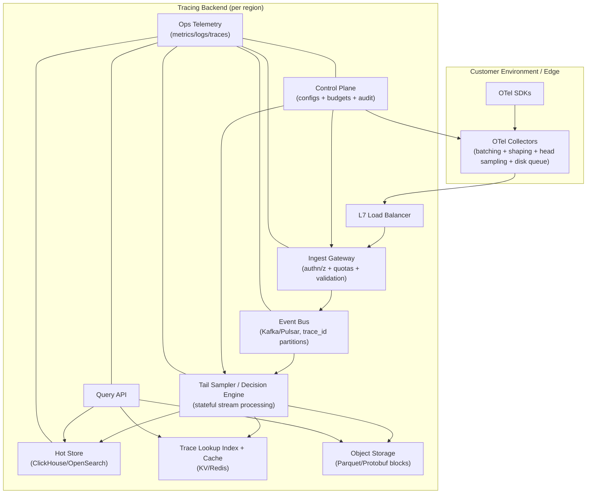
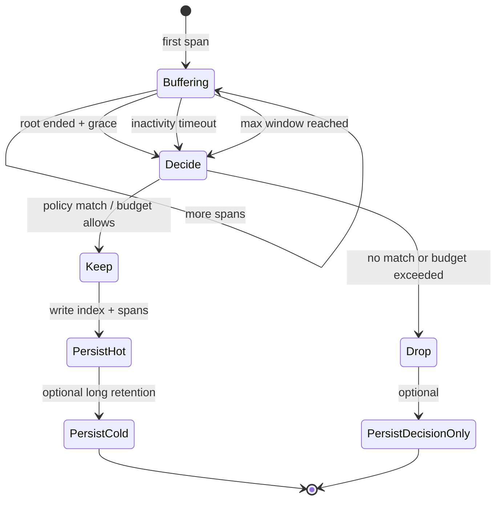
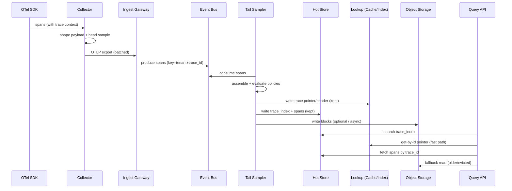

## Overview

A distributed tracing backend ingests high-cardinality span data from thousands of services, reconstructs traces, and serves low-latency search and retrieval for debugging, performance investigations, and SLO burn analysis.

The central challenge is balancing **fidelity vs. cost vs. safety**:

- Traces are most valuable during incidents—exactly when traffic spikes and systems are least stable.
- Raw span payloads are large, high-cardinality, and can amplify downstream load (storage, indexing, query).
- The system must preserve “interesting” traces (errors, slow outliers, rare paths) while enforcing strict multi-tenant budgets.

The core design is a **multi-stage sampling and cost-control pipeline**:

1. **Edge shaping + head sampling** (SDK/collector): cheap, immediate protection; reduces payload size and caps ingress.
2. **Central tail sampling** (trace decision engine): makes deterministic “keep/drop” decisions using trace-level context.
3. **Continuous governance** (every stage): per-tenant quotas, cardinality limits, and retention tiers with transparent accounting.

This keeps the ingest path fast and resilient while concentrating complexity in a horizontally scalable stream-processing layer.

---

## Requirements

### Functional Requirements
- Ingest traces using OpenTelemetry OTLP (gRPC/HTTP) from SDKs and collectors.
- Support **head-based sampling** (probabilistic, rate-limited, rule-based) with dynamic configs per tenant/service/route.
- Support **tail-based sampling** with policies:
  - error/status-based
  - latency percentiles / thresholds
  - attribute match (e.g., `http.route`, `db.system`)
  - “rare path” detection (bounded, explainable)
- Enforce cost controls:
  - per-tenant ingestion budgets (bytes/s, spans/s)
  - max payload bytes/request; max spans/trace; max attributes/span
  - attribute allow/deny lists; event/stacktrace truncation
  - cardinality guards (detect & throttle high-cardinality tags)
  - retention tiers (hot/warm/cold)
- Persist sampled traces for:
  - search (service, operation, time, tags, duration, error)
  - retrieval by `trace_id` (full trace)
- Provide near-real-time search for recent traces and long-term retention in cold storage.
- Provide admin APIs/UI for sampling rules, budgets, drop/keep reasons, and tenant usage.
- Ensure strict multi-tenancy: authn/z, quotas, noisy-neighbor protection, audit logs.

### Non-Functional Requirements (Targets)
**Scale (peak)**
- Tenants: 200 (with a small number of very large tenants)
- Services: ~10,000; hosts/pods: ~200,000
- Ingest: **5M spans/s** peak
- Query: **2,000 QPS** peak (search + trace-by-id)

**Sizing sanity check (order-of-magnitude)**
- Assume average accepted span payload:
  - 400–1200 bytes compressed on the wire (after shaping), depending on attributes/events.
- At 5M spans/s:
  - ~2–6 GB/s compressed (16–48 Gbps), plus protocol overhead.
- This is feasible with multi-AZ ingestion + compression, but requires strict shaping and strong backpressure.

**Latency**
- Ingest ACK (collector → backend): P50 **30ms**, P99 **150ms** (ACK after durable bus write).
- Tail decision latency (bounded buffering): P50 **2s**, P99 **8s**.
- Query:
  - Search: P50 **200ms**, P99 **1.5s**
  - Get trace by ID (hot tier): P50 **50ms**, P99 **300ms**

**Availability**
- Ingest path: **99.99%** (multi-AZ; degraded modes allowed)
- Query path: **99.9%** (degraded query acceptable during incidents)

**Consistency**
- Tail-sampling: deterministic per trace (**all-or-nothing** for the spans included in the decision window).
- Search indexes: **eventual** (seconds to minutes).
- Trace-by-id (kept traces in hot tier): **read-after-write target** via a dedicated trace lookup index + cache (details below).

**Durability**
- For spans that receive a successful ingest ACK: **no loss** beyond stated RPO.
- For drops (sampling/quota/limits): explicit accounting via metrics and decision records.

### Constraints & Assumptions
- Multi-region deployment for HA; tenants primarily query in-region; optional cross-region query for compliance/debug.
- Cost-capped service: every tenant has explicit budgets; “incident mode” allows controlled temporary increases.
- Prefer managed primitives: Kafka/Pulsar-like bus, object storage, managed databases where possible.
- Team size 6–10 engineers; operational simplicity matters.

---

## Architecture

### High-Level System



### Key Data Paths
- **Ingest path**: Collector → Ingest Gateway → Event Bus (durable) → Tail Sampler → Hot/Cached lookup + Cold.
- **Query path**:
  - Search: Query API → Hot Store (`trace_index`) → fetch spans for selected `trace_id`s
  - Trace-by-id: Query API → Lookup Cache/Index → Hot (preferred) or Cold fallback
- **Control path**: Control Plane distributes versioned rules/budgets to collectors, ingest, and tail sampler.

---

## Components

### 1) SDKs & Collectors (Edge)
**Responsibilities**
- Batch and export OTLP.
- Apply **payload shaping** (truncate events/stack traces, filter attributes).
- Apply **head sampling** with deterministic decisions (hash on `trace_id` + tenant salt).
- Provide buffering during backend disruptions (disk queue).

**Why this matters**
- Edge shaping is the cheapest way to prevent high-cardinality incidents and payload explosions from taking down ingestion/storage.
- Deterministic head sampling ensures consistent sampling across services (avoids broken traces due to inconsistent per-span sampling).

**Recommended approach**
- Use OpenTelemetry Collector with:
  - `batch` processor
  - `memory_limiter`
  - `attributes` / `transform` for allow/deny lists and truncation
  - `tailsampling` *only if operating a local decision layer per cluster* (optional; increases complexity)
  - disk-backed `sending_queue` for resilience

---

### 2) Ingest Gateway
**Responsibilities**
- Terminate OTLP (gRPC/HTTP), validate payloads, enforce authn/z and quotas.
- Apply hard limits (payload bytes, spans/request, max attributes/span).
- Produce spans to the event bus with appropriate partitioning and headers (tenant, timestamps, schema version).

**Key design decisions**
- **ACK after durable bus write** (e.g., Kafka `acks=all`, min ISR): keeps ingest latency low and avoids coupling to downstream storage/indexing.
- **Backpressure and fairness**:
  - per-tenant rate limiting (spans/s and bytes/s)
  - request shedding (429) when budgets exceeded
  - optional tenant isolation via separate topics/quotas for top tenants

**Anti-pattern to avoid**
- ACK only after storage write/indexing: causes long tail latencies and cascading failures during hot-store incidents.

---

### 3) Event Bus
**Responsibilities**
- Decouple ingest from tail sampling and storage.
- Provide ordered consumption per partition and short-term retention for reprocessing.

**Key design decisions**
- Partition key: `tenant_id + trace_id` (or `trace_id` with tenant embedded) to:
  - co-locate spans for a trace
  - prevent cross-tenant interference in partition hot spots
- Retention: **15–60 minutes** of raw spans (enough to recover tail samplers and tolerate short outages).
- Compression: zstd/snappy to reduce network and storage costs.

**Notes**
- Ordering is guaranteed **within a partition**, not globally; spans can arrive out of order due to instrumentation/export timing. Tail sampler must handle this.

---

### 4) Tail Sampler (Trace Decision Engine)
**Responsibilities**
- Assemble spans into traces within a bounded window.
- Evaluate tail policies and emit an auditable decision.
- Write kept traces to hot and cold storage; publish decision metrics.

**Correctness goals**
- **Deterministic** decision per trace: all spans *seen in the decision window* are kept or dropped consistently.
- **Duplicate tolerance**: retries may produce duplicate spans; de-dup on `(tenant_id, trace_id, span_id)` within TTL.

**Bounded buffering**
- Maintain per-trace state with:
  - span set / de-dup index
  - trace summary (duration-so-far, error flags, services, routes)
  - first/last-seen timestamps
- Decision triggers:
  - “root ended + grace” (preferred)
  - inactivity timeout (e.g., 2–5s)
  - hard max window (e.g., 10–30s)
- For **very long traces** (minutes), apply one of:
  - keep-on-signal (if any error/slow signal appears, keep without waiting)
  - partial trace handling with clear UX labeling (“partial trace due to window”)

**Decision record**
- Write a small decision record even for drops (configurable retention), enabling:
  - “why was this trace dropped?”
  - budget consumption explanations
  - anomaly detection for sudden changes



---

### 5) Storage Layer (Hot + Cold + Lookup)
**Hot store responsibilities**
- Fast search over trace metadata and common tags.
- Efficient retrieval of spans for selected trace IDs.

**Cold store responsibilities**
- Cheap long-term retention with infrequent reads and bulk scans.

**Lookup responsibilities (for trace-by-id)**
- Provide a fast mapping from `(tenant_id, trace_id)` → storage location(s) for read-after-write and fast retrieval.

**Recommended design**
- Hot store: **ClickHouse** for cost-effective, time-partitioned analytics and high ingest rates.
- Cold store: **S3/GCS** with Parquet (or compressed protobuf blocks) partitioned by time and tenant.
- Lookup:
  - Redis cache for hot traces (TTL hours–days)
  - durable KV/index (optional) for stronger read-after-write guarantees (e.g., Cassandra/Scylla/DynamoDB) storing trace pointers and minimal headers

**Why a lookup layer**
- “Trace-by-id” should not depend on search indexes being updated; a direct pointer enables near read-after-write behavior for kept traces.

---

### 6) Query API + UI
**Responsibilities**
- Search traces (bounded time ranges, service/operation/tags).
- Retrieve full traces by ID.
- Enforce RBAC, tenant isolation, and query admission control.
- Provide sampling transparency (keep/drop reasons, effective rate, budget usage).

**Key design decisions**
- Separate endpoints and SLAs for:
  - search (can be slower, eventual)
  - get-by-id (should be fast, uses lookup + cache)
- Query protection:
  - mandatory time range and max range enforcement
  - result limits + cursor pagination (no deep offsets)
  - per-tenant query QPS and “scan budget” limits (bytes scanned / partitions touched)

---

### 7) Control Plane
**Responsibilities**
- Manage tenant configs: sampling policies, budgets, attribute governance, retention tiers.
- Versioning, audit logs, and safe rollout (dry-run/simulate).
- Distribute config to collectors/ingest/tail with watch/streaming updates.

**Safety features**
- Validate rules (schema + constraints), reject dangerous patterns (e.g., unbounded match-all keep).
- Provide “what-if” simulation using recent trace summaries (without storing full spans).

---

## Data Model

### Identifiers and Canonical Fields
- `trace_id`: 16 bytes (128-bit) as defined by W3C Trace Context / OTel (often rendered as 32 hex chars).
- `span_id`: 8 bytes (64-bit).
- Store IDs as **binary** where possible (space and speed), render as hex in APIs/UI.

### Hot Store Schema (ClickHouse example)

**Table: `trace_index` (primary search surface)**
- `tenant_id` String
- `trace_id` FixedString(16)
- `start_ts` DateTime64(3)
- `end_ts` DateTime64(3)
- `duration_ms` UInt32
- `root_service` LowCardinality(String)
- `root_operation` LowCardinality(String)
- `services` Array(LowCardinality(String))
- `has_error` UInt8
- `span_count` UInt32
- `http_route` LowCardinality(String) (optional, governed)
- `decision_policy_id` LowCardinality(String)
- `decision_reason` LowCardinality(String)
- `effective_sample_rate` Float32
- `ingest_region` LowCardinality(String)
- `schema_version` UInt16

Recommended ClickHouse layout:
- `PARTITION BY (tenant_id, toDate(start_ts))`
- `ORDER BY (tenant_id, start_ts, root_service, trace_id)`
- Data skipping indices on `has_error`, `duration_ms`, and a small set of governed attributes.

**Table: `spans` (span retrieval and limited filtering)**
- `tenant_id` String
- `trace_id` FixedString(16)
- `span_id` FixedString(8)
- `parent_span_id` FixedString(8) (nullable)
- `service` LowCardinality(String)
- `operation` LowCardinality(String)
- `start_ts` DateTime64(3)
- `end_ts` DateTime64(3)
- `duration_ms` UInt32
- `status_code` UInt8
- `error` UInt8
- Governed attributes:
  - either flattened columns (preferred for queryable keys)
  - plus `attrs_json` String (optional, for debugging; size-capped)

Recommended ClickHouse layout:
- `PARTITION BY (tenant_id, toDate(start_ts))`
- `ORDER BY (tenant_id, trace_id, start_ts, span_id)`
- TTL policies by tier (e.g., 7 days hot, then delete).

**Decision records (optional, but strongly recommended)**
- Store a compact `trace_decisions` table (or stream) with:
  - `tenant_id`, `trace_id`, `decision`, `reason`, `policy_id`, `budget_state`, `ts`
- Retain longer than hot spans to explain sampling outcomes without retaining full trace payloads.

### Cold Storage Format
- Partition path: `tenant_id=.../date=YYYY-MM-DD/hour=HH/`
- Files: Parquet (or protobuf blocks) containing:
  - trace header rows + span rows, clustered by `trace_id`
- Maintain a small sidecar index:
  - `trace_id` → `{object_key, byte_range}` (built during compaction)
- Compaction job merges small files and builds sidecar indexes.

---

## Data Flow



---

## API Design

### Ingestion (OTLP)
- OTLP/HTTP: `POST /v1/traces`
- OTLP/gRPC: `opentelemetry.proto.collector.trace.v1.TraceService/Export`

**Error handling**
- `401/403`: auth failures
- `429`: tenant over budget / rate-limited (`Retry-After`)
- `413`: payload too large
- `400`: invalid OTLP

**Delivery semantics**
- Successful ACK implies spans are durably written to the bus (at-least-once thereafter).
- Duplicates are expected; dedupe in tail sampler (TTL bounded).

---

### Control Plane
- `GET /api/v1/tenants/{tenantId}/sampling-rules`
- `PUT /api/v1/tenants/{tenantId}/sampling-rules` (atomic replace; versioned; supports dry-run)
- `GET /api/v1/tenants/{tenantId}/budgets`
- `PUT /api/v1/tenants/{tenantId}/budgets`
- `GET /api/v1/tenants/{tenantId}/governance` (attribute allow/deny lists, caps, retention tiers)

**Concurrency control**
- `If-Match: <etag>` (or explicit `version`) required on writes.

**Sampling rule concepts**
- Matchers: service, operation, route, env, arbitrary attribute predicates
- Actions:
  - head sampling rate or rule
  - tail policies (error/latency/attribute/rare)
  - payload shaping overrides (within global caps)
  - retention tier for kept traces
- Priority order + default fallback

---

### Query
- `GET /api/v1/traces/{traceId}` (tenant inferred from auth context; optional explicit `tenantId` for admins)
- `POST /api/v1/traces/search`

**Search request (example)**
```json
{
  "time_range": { "start": "2025-12-17T10:00:00Z", "end": "2025-12-17T11:00:00Z" },
  "root_service": "checkout",
  "operation": "POST /api/orders",
  "tags": { "http.route": "/api/orders", "deployment.environment": "prod" },
  "min_duration_ms": 250,
  "has_error": false,
  "limit": 50,
  "cursor": null
}
```

**Search response (example)**
```json
{
  "traces": [
    {
      "trace_id": "4bf92f3577b34da6a3ce929d0e0e4736",
      "start_ts": "2025-12-17T10:42:11.231Z",
      "duration_ms": 812,
      "root_service": "checkout",
      "root_operation": "POST /api/orders",
      "has_error": false,
      "span_count": 43,
      "decision": { "policy_id": "slow-requests", "reason": "latency_threshold", "effective_sample_rate": 0.02 }
    }
  ],
  "next_cursor": "eyJvZmZzZXQiOjEyMzQ1fQ=="
}
```

**Query error handling**
- `400`: invalid filters (e.g., missing time range)
- `429`: query rate limited / scan budget exceeded
- `503`: hot store degraded (optionally allow explicit cold fallback with slower SLA)

---

## Scaling & Performance

### Where the System Bottlenecks
- **Ingest CPU/network**: OTLP decoding + auth + compression.
- **Bus throughput**: partition hot spots, ISR health, disk IO.
- **Tail state**: buffering and de-dup sets for many concurrent traces.
- **Hot store write amplification**: indexing/merges and high-cardinality attributes.
- **Query fanout**: unselective filters causing wide scans.

### Capacity Planning (Practical Back-of-the-Envelope)
Assumptions at peak:
- 5M spans/s inbound after edge shaping/head sampling.
- Tail keep rate (post tail sampling): 1–10% depending on tenant policy.

Implications:
- If you keep 5% of spans, storage and query scale are dominated by kept traces, while bus/tail must still handle the full accepted stream.
- Hot store sizing is driven by:
  - kept spans/day
  - index footprint for `trace_index`
  - merge/compaction capacity (write amplification)
- Cold store sizing is driven by:
  - retained days × kept volume/day
  - compaction and index build throughput

Operationally, this architecture is viable because **only the bus + tail layer must scale to accepted ingestion**, while storage can scale with **kept volume**.

### Horizontal Scaling Levers
- **Ingest gateway**: stateless autoscale on CPU + ingress bytes + 429 rate + bus produce latency.
- **Event bus**: increase partitions; maintain healthy ISR; monitor produce/consume latency and disk.
- **Tail sampler**: scale consumers with partitions; enforce per-tenant in-flight trace caps and backpressure.
- **Hot store**: shard by tenant/time; separate ingest writers from query replicas if needed; tune merges.
- **Query API**: stateless; cache headers; enforce pagination and scan budgets.

### Caching Strategy
- **Trace header/lookup cache (Redis)**: `(tenant_id, trace_id) → {hot pointer, cold pointer, header}` TTL 1–24h.
- **Search caching**: only for repeated dashboards, TTL 10–30s; include tenant + normalized query + time bucket.
- **Config caching**: versioned configs with watch updates; collectors keep last-known-good with TTL and exponential backoff.

---

## Trade-offs & Alternatives

### Key Trade-offs
- **Bus + tail sampler vs. direct-to-store**
  - Pros: decoupling, backpressure, replay, deterministic tail decisions, safer ingest.
  - Cons: operational overhead (Kafka/Pulsar + stateful processing), added end-to-end latency for tail decisions.
- **ClickHouse vs. Elasticsearch/OpenSearch for hot**
  - Pros: excellent ingest cost/perf for time-partitioned analytics; predictable scaling.
  - Cons: less flexible text search; requires disciplined schema/governance for attributes.
- **Bounded tail window**
  - Pros: caps memory and decision latency; operationally safe.
  - Cons: long-running traces may be partial or decided without full context; must be explained in UX and policy semantics.

### Alternatives (When to Choose Them)
- **Head sampling only**
  - Choose when cost must be minimal and “good enough” debugging is acceptable; less effective for rare/slow outliers.
- **Off-the-shelf backends (Tempo/Jaeger)**
  - Choose for speed of delivery; extend with governance layers if strict multi-tenant budgets are required.
- **Query-time sampling**
  - Useful for analytics on already-stored data; not a replacement for ingestion/storage cost control.

---

## Failure Modes & Mitigations

### Failure Scenarios
1) **Event bus partition outage / ISR collapse**
- Impact: ingest backpressure; tail decisions delayed; potential 429/5xx on ingest.
- Detection: under-replicated partitions, produce latency spikes, consumer lag growth, elevated ingest errors.
- Mitigation:
  - multi-AZ replication, rack awareness, capacity headroom
  - collector disk queue buffering
  - degrade mode: stricter head sampling + payload shaping; optionally pause tail sampling policies requiring long windows

2) **Tail sampler OOM due to trace explosion (cardinality or burst)**
- Impact: increased drops, restart loops, lag spikes, delayed decisions.
- Detection: memory pressure, state size growth, GC thrash, lag > SLO.
- Mitigation:
  - hard caps: max spans/trace, max in-flight traces/tenant, max bytes/trace buffer
  - early-drop policies when caps exceeded (with explicit “dropped_reason=capped” metrics)
  - autoscale partitions + consumers; admission control at ingest for abusive tenants

3) **Hot store overload / merge backlog**
- Impact: search latency spikes; timeouts; ingestion writers slowed; potential cascading backpressure.
- Detection: query P99, merge backlog, IO saturation, replication lag.
- Mitigation:
  - strict attribute governance (flatten only key attributes; cap high-card tags)
  - separate write and read resources; query admission control and scan budgets
  - degrade query features (disable expensive tag scans) while preserving trace-by-id

4) **Misconfigured sampling drops critical traces**
- Impact: reduced debuggability during incidents.
- Detection: abrupt changes in keep rate; spikes in “dropped_by_policy”; user reports.
- Mitigation:
  - validation + simulation (“what-if”) on recent trace summaries
  - staged rollout (canary tenants/services)
  - emergency “incident mode” override: temporary budget increase + higher keep policies (audited)

5) **Control plane outage**
- Impact: inability to change policies; risk of stale configs.
- Detection: control-plane health checks, config propagation lag.
- Mitigation:
  - data plane runs on last-known-good config with TTL
  - safe defaults when TTL expires (conservative head sampling + strict caps)
  - audit log and config store replicated across AZs

### Disaster Recovery
- Targets:
  - RTO: **30 minutes** (ingest), **2 hours** (query)
  - RPO: **≤5 minutes** for kept traces (hot), **≤1 hour** for cold compaction indexes
- Strategy:
  - multi-AZ within region; optional active-active ingest across regions
  - collectors configured with primary + secondary endpoints for failover
  - control plane configs backed up hourly; audited and reproducible
  - hot store replication/snapshots; cold store is inherently durable (object storage)

---

## Operations

### SLOs and Error Budgets (Example)
- Ingest availability: 99.99% monthly (≈4.3 min downtime/month)
- Ingest ACK latency: P99 ≤ 150ms
- Tail decision latency: P99 ≤ 8s
- Search: P99 ≤ 1.5s (hot); degraded modes allowed during incidents
- Trace-by-id (hot): P99 ≤ 300ms

### Monitoring & Alerting
- Ingest:
  - QPS/bytes, P99 latency, 4xx/5xx, 429 rate (overall + per-tenant), auth failures
- Bus:
  - under-replicated partitions, produce/consume latency, consumer lag, disk usage
- Tail sampler:
  - in-flight traces, state size, decision latency, dedupe rate, drop reasons, restarts/OOM
- Hot store:
  - ingest throughput, merge backlog, replication lag, query P99, disk/IO saturation
- Cold store/compaction:
  - compaction lag, object count, index build errors, retrieval latency
- Product metrics:
  - effective sample rate per tenant/service
  - top cardinality offenders
  - budget utilization and throttling reasons

Example alerts:
- consumer lag > 60s sustained 5m
- ingest P99 > 300ms sustained 10m
- hot search P99 > 2s sustained 10m
- drop rate > 2× baseline sustained 5m (per tenant)

### Deployment Strategy
- Canary ingest and tail changes (1–5% traffic) with rollback on SLO regression.
- Versioned sampling configs with:
  - dry-run evaluation (compute decisions, don’t enforce)
  - staged rollout by tenant/service
- Backward-compatible OTLP handling; feature flags for new policy types.

### Cost Governance Playbook
- Default: strict payload shaping + conservative keep rates.
- Incident mode (time-bounded, audited):
  - increase budgets temporarily
  - enable “keep errors + slow > X ms”
  - tighten query limits to protect hot store
- Post-incident:
  - review “top offenders” (cardinality, payload size)
  - adjust governance and instrumentation guidelines

---

## Security & Compliance

- Authn/z: mTLS from collectors; JWT/OAuth for APIs; RBAC with tenant isolation.
- Encryption: TLS in transit; encryption at rest (hot store disks + object storage).
- PII controls:
  - attribute allowlist/denylist (e.g., block headers, emails, tokens)
  - size caps and hashing for sensitive IDs where needed
- Audit logs:
  - config changes (who/what/when)
  - incident-mode activations
- Data residency:
  - region-scoped storage; restrict cross-region queries by tenant policy.

---

## References & Further Reading
- OpenTelemetry Specification: https://opentelemetry.io/docs/specs/
- OTLP Protocol: https://opentelemetry.io/docs/specs/otlp/
- W3C Trace Context: https://www.w3.org/TR/trace-context/
- Jaeger tail-based sampling concepts: https://www.jaegertracing.io/docs/
- Grafana Tempo architecture: https://grafana.com/docs/tempo/
- Kafka Streams: https://kafka.apache.org/documentation/streams/
- Apache Flink (stateful stream processing): https://nightlies.apache.org/flink/flink-docs-stable/