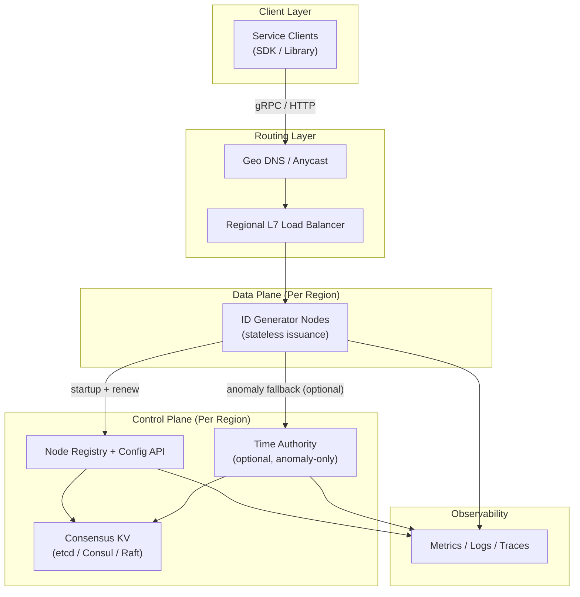
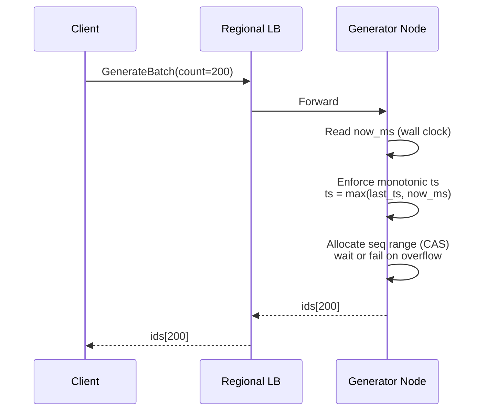
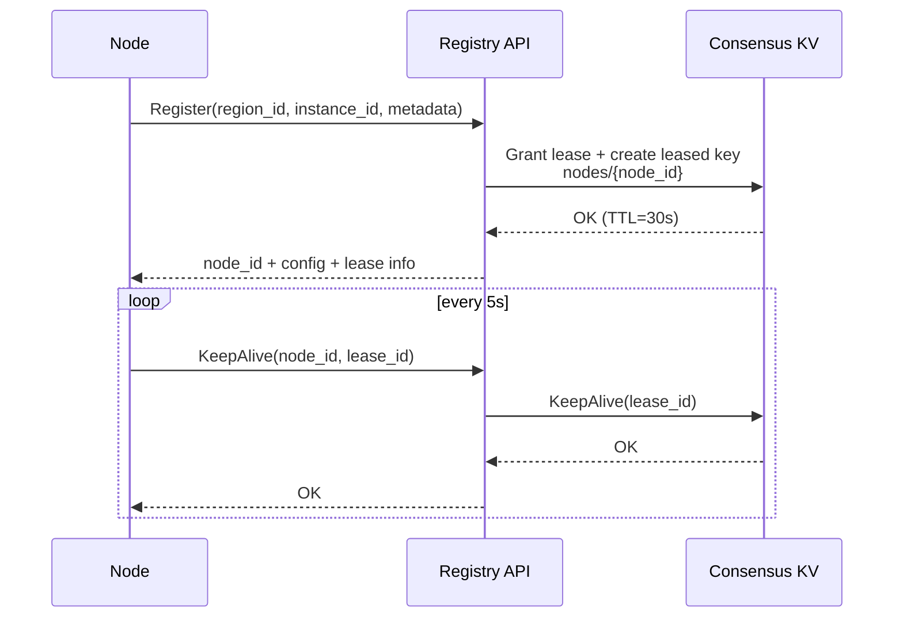
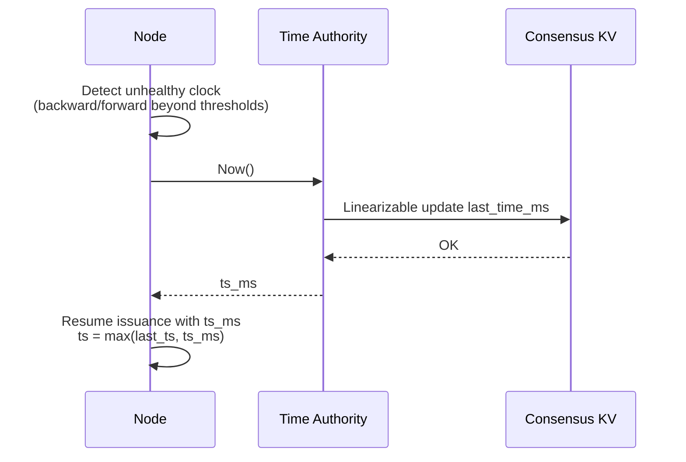

## Overview

A distributed unique ID generator is foundational infrastructure that often sits on hot paths (writes, event ingestion, object creation). The tricky part is not “unique” (random UUIDs solve that), but **unique + roughly time-ordered + multi-region + safe under clock anomalies**, without adding a global dependency to every request.

This design provides **Snowflake-like 64-bit IDs** that are:

- **Globally unique** under clearly stated invariants (region partitioning + leased worker identity + guarded issuance).
- **K-sortable**: sorting by ID approximates creation time (millisecond granularity).
- **High-throughput**: lock-free per-node generation; batch API to amortize network cost.
- **Operationally safe**: explicit handling for backward/forward clock jumps, sequence exhaustion, and control-plane outages.
- **Multi-region**: no cross-region coordination on the hot path; region is encoded in the ID.

> “K-sortable” means IDs created later will usually compare larger than earlier ones, but **not strictly globally monotonic**, especially across machines/regions or under clock skew.

---

## Requirements

### Functional Requirements

- Generate globally unique IDs via low-latency APIs: `Generate`, `GenerateBatch`.
- IDs are k-sortable at millisecond granularity.
- Provide clock-skew protection:
  - Never issue duplicates even if the local clock steps backward (within configured bounds).
  - Detect and respond to unhealthy clocks (backward/forward jumps).
- Support multi-region issuance and failover (clients can switch regions without losing uniqueness).
- Scale horizontally by adding generator nodes; avoid a single-node bottleneck.
- Provide decode/introspection utilities (extract timestamp/region/node/sequence) for debugging.
- Provide operational controls: worker identity assignment, safe reuse, rollout-safe config versioning.
- Provide observability: per-node QPS, tail latency, sequence exhaustion, clock guard trips, and alerts.

### Non-Functional Requirements (Concrete Targets)

- **Scale**
  - Global peak: **2,000,000 IDs/sec**
  - Request rate: **~200,000 req/sec** (assuming `GenerateBatch` average `count=10`)
  - Regions: up to **20**
  - Generator nodes: up to **200 per region** (upper bound; typical deployments are far smaller)
- **Latency (in-region)**
  - `Generate`: **P50 1–2 ms**, **P99 < 10 ms** (gRPC, warm connections)
  - `GenerateBatch(count<=1000)`: **P99 < 15 ms**
- **Failover**
  - Cross-region routing failover: **P99 < 250 ms** to first successful response (DNS/Anycast dependent)
- **Availability**
  - Data plane (issuance): **99.99%**
  - Control plane (registration/config): **99.9%**
- **Consistency**
  - **Uniqueness**: strong (must never duplicate under stated invariants)
  - **Ordering**: best-effort globally; strict monotonic *per generator process* for embedded timestamps
  - Control plane state (leases/config): strong within a region (Raft quorum)
- **Security**
  - Authenticated clients (mTLS or signed tokens), rate limits, abuse protection
  - No PII in IDs; note that timestamp reveals approximate creation time unless mitigated

### Constraints & Assumptions

- Commodity VMs/Kubernetes across **3 AZs** per region.
- Clock sync via NTP/chrony is available but imperfect; clocks may step backward/forward.
- Network partitions can occur within a region and across regions.
- `region_id` is uniquely provisioned and rarely changes.
- Avoid global coordination on the hot path; prefer per-region autonomy.

### Out of Scope (Explicit)

- Cryptographic non-guessability (IDs are not secrets).
- Strict global ordering across regions.
- Proving issuance via an immutable issuance log (would change hot-path cost profile).

---

## Architecture

### High-Level Design

- **Data plane**: stateless generator nodes behind a regional load balancer.
- **Control plane**: per-region registry/config service backed by a consensus KV (e.g., etcd).
- **Optional time authority**: used only when clocks are unhealthy (not on every request).
- **Multi-region uniqueness**: achieved by embedding `region_id` bits into the ID.

### Key Invariants (What Makes “Never Duplicate” True)

1. **Region partitioning**: each region has a unique `region_id` encoded in the ID.
2. **Exclusive worker identity**: within a region, a `(node_id)` is held under a **strongly consistent lease** (Raft quorum).
3. **Lease fencing**: a generator issues IDs **only while its lease is valid** (locally enforced via last successful renewal + TTL).
4. **Clock guardrails**: the generator enforces monotonic embedded timestamps and refuses issuance when the clock is dangerously unhealthy.

If any invariant is violated (misconfigured `region_id`, bypassing leases, buggy “issue while lease expired”), duplicates become possible; the design treats these as **hard correctness boundaries** and protects them operationally.

---

## Components

### 1) ID Generator Node (Data Plane)

**Responsibility**: Issue unique, k-sortable IDs with minimal latency while enforcing guardrails.

**Core algorithm** (per node, atomic state):

- Maintain `last_ts_ms` and `seq`.
- On request, read `now_ms` from wall clock.
- Compute `ts = max(now_ms, last_ts_ms)` (never embed a timestamp lower than the previous embedded timestamp).
- If `ts == last_ts_ms`, allocate sequence range; if overflow, either:
  - wait until the next millisecond, or
  - fail fast with `RESOURCE_EXHAUSTED` (policy-driven; waiting is typical).
- If the clock is unhealthy (large backward/forward jump), trigger mitigation (wait, consult time authority, or safe-stop).

**Clock handling policies** (recommended defaults):

- `max_backward_ms`: **10 ms** (tolerate small NTP steps)
- `max_forward_ms`: **250 ms** (avoid issuing “far future” IDs)
- `max_wait_on_overflow_ms`: **2 ms** (bound tail latency contribution)
- If exceeded: consult time authority (if enabled) else return `FAILED_PRECONDITION`

**Why this works**:
- Uniqueness comes from `(region_id, node_id, ts, seq)`; ordering is approximate because `ts` is based on wall clock and can differ across nodes.
- Monotonic embedded `ts` prevents duplicates and preserves per-node ordering even if `now_ms` goes backward briefly.

**Implementation notes**:
- Prefer gRPC with long-lived connections and connection pooling.
- Use atomic CAS to allocate sequences for batch requests without per-ID locks.
- Warm up by reading the current lease/config and validating `region_id`, `node_id`, and bit layout version.

---

### 2) Node Registry & Config Service (Control Plane)

**Responsibility**: Assign exclusive worker identity (`node_id`) via leases, publish config (epoch/bit layout/thresholds), and prevent unsafe reuse.

**Key behaviors**:

- `AcquireLease(region_id, instance_identity) -> node_id, lease_ttl, config_version`
- `KeepAlive(node_id, lease_id)` at a fixed cadence (e.g., every **5s** for a **30s** TTL)
- Config distribution via watch/stream; changes are **versioned** and validated for compatibility.

**Critical correctness rule**:
- The generator must **stop issuing** when it cannot prove lease validity (e.g., no successful renewal for `TTL`).

**Why leases**:
- Prevents accidental concurrent reuse of `node_id` across nodes.
- Allows automatic cleanup on node death without manual intervention.

**Tech**:
- etcd/Consul for KV + leases; stateless API service for policy, auditing, and compatibility checks.
- Keep the KV cluster small and stable: **3 or 5 nodes** across AZs, tuned for low tail latency.

---

### 3) Time Authority (Optional, Anomaly-Only)

**Responsibility**: Provide a monotonic timestamp source for recovery from severe local clock anomalies.

**Design**:

- Expose `Now()` returning a timestamp that never goes backward *as observed by the authority*.
- Implement using Raft-backed state:
  - Maintain `last_time_ms` in quorum state.
  - On request: `last_time_ms = max(last_time_ms, physical_now_ms)` and return it (linearizable write).
- Use only on anomaly paths to avoid turning it into a throughput bottleneck.

**When to use**:
- Large backward jumps (e.g., VM suspend/resume)
- Time sync failures in a specific AZ
- Hosts with unreliable time sources

---

### 4) Edge Routing (Geo DNS / Anycast + Regional LB)

**Responsibility**: Route clients to the nearest healthy region and handle regional failover.

**Recommendations**:

- Prefer in-region issuance for latency and to reduce cross-region tail latency.
- Failover based on health + SLO signals (synthetics + real SLIs), not just ping checks.
- Keep DNS TTL short (e.g., **10–30s**) if using Geo DNS; Anycast/global accelerator provides faster steering.

---

### 5) Client SDK (Strongly Recommended)

**Responsibility**: Make issuance reliable and cheap for clients.

**Features**:

- Connection pooling, retries with jitter, and region fallback.
- Optional local prefetch cache using `GenerateBatch` (e.g., fetch 1,000 IDs, serve locally).
- Backpressure: if the client drains its local cache too quickly, it can increase batch size or add parallel streams.

---

## Data Model (Control Plane)

IDs are not stored.

### Consensus KV Keyspace (Example)

- `config/global/epoch_ms` (int64)
- `config/global/bit_layout_version` (int)
- `config/regions/{region_id}/enabled` (bool)
- `config/regions/{region_id}/limits/max_backward_ms` (int)
- `config/regions/{region_id}/limits/max_forward_ms` (int)
- `leases/regions/{region_id}/nodes/{node_id}` (lease-backed value: `{instance_id, az, started_at_ms, lease_id}`)
- `audit/regions/{region_id}/events/...` (optional; low-rate control-plane audit log)

### Lease Validity (Local Enforcement)

Each generator caches:

- `lease_ttl_ms`
- `last_lease_renew_ok_at_ms`

Issuance is allowed only if:

- `now_monotonic_ms - last_lease_renew_ok_at_ms < lease_ttl_ms`

This is the “fence” that prevents a partitioned node from continuing to issue IDs after its identity may have been reassigned.

---

## ID Format

### Bit Layout (Versioned)

Use **63 bits** (positive signed 64-bit integer) to avoid issues in languages that treat int64 as signed.

Recommended layout (v1):

| Field | Bits | Notes |
|---|---:|---|
| `timestamp_ms` | 41 | ms since custom epoch (~69 years) |
| `region_id` | 5 | up to 32 regions (>= 20 required) |
| `node_id` | 8 | up to 256 nodes/region (>= 200 required) |
| `sequence` | 9 | 0–511 per ms per node |

This yields per-node peak capacity: **512 IDs/ms ≈ 512,000 IDs/sec**. With modest node counts this comfortably meets the global target.

> If you need stronger protection against unsafe `node_id` reuse across different machines (e.g., aggressive autoscaling churn), introduce a small `node_epoch` field and reduce `sequence` bits, or move to 128-bit IDs. Keep the layout **versioned**, and plan migrations explicitly.

### Encoding / Representation

- Transport as `fixed64` in gRPC.
- In logs/URLs, represent as unsigned decimal or base10 string; avoid JSON number precision issues by using strings in JSON.

### Decode Utility

Decoding extracts:
- `timestamp_ms` (convert to wall time using epoch)
- `region_id`, `node_id`, `sequence`
- `bit_layout_version`

---

## Data Flow

### Hot Path: Batch Issuance

### Control Path: Startup + Lease Renewal

### Anomaly Path: Time Authority Fallback (Optional)

---

## API

Prefer gRPC for low overhead and strong typing. Offer HTTP/JSON only if necessary (and return IDs as strings).

### gRPC Service

- `rpc Generate(GenerateRequest) returns (GenerateResponse)`
- `rpc GenerateBatch(GenerateBatchRequest) returns (GenerateBatchResponse)`
- `rpc Decode(DecodeRequest) returns (DecodeResponse)` (admin/ops only)
- `rpc Health(HealthRequest) returns (HealthResponse)`

**Requests (illustrative)**:
- `GenerateRequest { string client_id; }`
- `GenerateResponse { fixed64 id; }`
- `GenerateBatchRequest { string client_id; uint32 count; string idempotency_key; }`
- `GenerateBatchResponse { repeated fixed64 ids; }`

### Limits

- `GenerateBatch.count`: **1..1000** (tunable; keep responses bounded)
- Per-client rate limits (token bucket) to protect the service and ensure fairness.

### Error Handling

- `UNAVAILABLE`: no healthy generator nodes reachable.
- `RESOURCE_EXHAUSTED`: sequence overflow and waiting is disabled or exceeds wait budget.
- `FAILED_PRECONDITION`: clock unhealthy (beyond thresholds) or lease not valid.
- `INVALID_ARGUMENT`: invalid `count`, malformed request.

### Idempotency

- **Uniqueness does not require idempotency** (retries produce different IDs safely).
- Idempotency is useful to prevent “double-create” semantics at the application layer for batch calls:
  - Support `idempotency_key` with **best-effort**, short-lived cache (e.g., 10–30s) per node.
  - If you need strong idempotency across retries and failover, implement it in the application layer (durable de-dup keyed by business idempotency key).

---

## Scaling

### Capacity Planning (Numbers That Close)

Target: **2,000,000 IDs/sec** globally.

Example deployment:
- 4 active regions (for latency + resilience)
- 12 generator nodes per region (spread across 3 AZs)

Per-node requirement (roughly):
- Global: 2,000,000 / (4 * 12) ≈ **41,667 IDs/sec per node**
- With `sequence=9 bits`, per-node capacity is **512,000 IDs/sec**, so there is ample headroom.
- Even if traffic concentrates into one region during failover, a single region with 24 nodes supports:
  - 24 * 512,000 ≈ **12.3M IDs/sec** theoretical (CPU and network permitting)

### Latency Considerations

- The generator does not hit storage on the hot path, so latency is dominated by:
  - LB + network RTT
  - gRPC serialization
  - minor CPU for atomic allocation
- Use `GenerateBatch` to amortize RTT; for many services, batching reduces cost more than optimizing per-ID atomics.

### Bottlenecks & Mitigations

- **Sequence exhaustion** (too many IDs in one millisecond on a single node)
  - Mitigate via more nodes, better LB distribution, batching, and allowing a short wait for next ms.
- **Tail latency from LB / connection churn**
  - Use long-lived gRPC connections, keepalive, and client-side pooling.
- **Control plane dependency at startup**
  - Nodes cache config; only require the registry for registration/renewal.
- **Time authority saturation** (if enabled)
  - Ensure it is anomaly-only; alert if it’s used frequently (that indicates a systemic clock issue).

---

## Trade-offs & Alternatives

### Trade-offs Made (At Least 3)

1. **Region bits for uniqueness**
   - Gain: no cross-region coordination on the hot path; clean failover story
   - Cost: global ordering is best-effort; two regions can interleave IDs under skew

2. **Stateless issuance (no per-ID persistence)**
   - Gain: very low latency and high availability; minimal operational overhead
   - Cost: cannot “prove issuance” after the fact without additional logging; rely on metrics/audit sampling instead

3. **Lease-based worker identity (Raft control plane)**
   - Gain: prevents concurrent `(region_id, node_id)` collisions; supports safe automation
   - Cost: adds a control plane; nodes must stop issuing if they cannot prove lease validity

### Alternatives (When to Choose Them)

- **UUIDv7 / ULID**
  - Great when you want k-sortability without a control plane; typically larger payload and different ordering properties
- **Database-backed sequences (SQL auto-increment / Redis INCR)**
  - Simpler correctness story but becomes a throughput, latency, and availability bottleneck; cross-region is expensive
- **Hi/Lo allocation**
  - Reserve ranges from durable storage, issue locally; good middle ground but adds operational complexity and storage dependence
- **128-bit IDs**
  - Easiest way to add entropy, epochs, signatures, or stronger fencing fields without painful bit trade-offs

---

## Failure Modes

### 1) Backward Clock Step (Small, e.g., 2–10 ms)

- **Impact**: ordering anomalies; duplicates in naïve implementations
- **Detection**: `now_ms < last_ts_ms` counter; `clock_backward_ms` histogram
- **Mitigation**: embed `ts = max(last_ts, now_ms)`; continue issuing under the same `ts` with sequence; if sequence overflows, wait for next ms (bounded)

### 2) Backward Clock Step (Large, e.g., seconds/minutes due to suspend/resume)

- **Impact**: risk of issuing timestamps far behind real time; potential operational confusion downstream
- **Detection**: `last_ts_ms - now_ms > max_backward_ms`
- **Mitigation**:
  - Prefer: consult time authority (if enabled) and resume with monotonic timestamp
  - Otherwise: safe-stop issuance (`FAILED_PRECONDITION`) and alert; require time sync remediation

### 3) Forward Clock Jump (e.g., +5 minutes)

- **Impact**: IDs appear “from the future”, breaking downstream assumptions (TTL, ordering windows, compaction heuristics)
- **Detection**: `now_ms - last_ts_ms > max_forward_ms`
- **Mitigation**: safe-stop or route to time authority; alert and remediate time source

### 4) Lease Loss / Control Plane Partition

- **Impact**: if a node continues issuing after lease expiry and the `node_id` is reassigned, duplicates become possible
- **Detection**: keepalive failures; `lease_valid=0`; control plane SLO alerts
- **Mitigation**: strict local lease fencing:
  - stop issuing when `now - last_renew_ok >= TTL`
  - return `FAILED_PRECONDITION` so clients can retry in-region or fail over

### 5) Misconfiguration: Two Regions Share the Same `region_id`

- **Impact**: catastrophic duplicates across regions
- **Detection**: config validation; automated CI checks; runtime “region_id collision” guardrails in provisioning
- **Mitigation**: treat `region_id` as managed infrastructure state (IaC + approvals); prevent manual overrides

### 6) Retry Storms / Client Timeouts

- **Impact**: load amplification; higher tail latency; time authority may be overused
- **Detection**: elevated retry rates, connection churn, request rate spikes with stable business traffic
- **Mitigation**: SDK backoff with jitter, circuit breakers, and `GenerateBatch` prefetch to reduce sensitivity to transient latency

---

## Operations

### SLOs and Error Budgets

- **Data plane availability**: 99.99%
- **In-region latency**: `Generate` P99 < 10 ms
- **Correctness SLO**: zero duplicates (treat any duplicate as SEV-0)

### Monitoring & Alerting (Minimum Set)

- Issuance:
  - `idgen.requests_total`, `idgen.ids_issued_total`
  - `idgen.latency_ms{p50,p95,p99}`
  - `idgen.errors_total{code}`
- Correctness guardrails:
  - `idgen.clock_backward_events_total`
  - `idgen.clock_forward_guard_trips_total`
  - `idgen.sequence_overflow_total`
  - `idgen.lease_valid` (0/1) and `idgen.lease_renew_latency_ms`
- Control plane:
  - `registry.requests_total`, `registry.errors_total`
  - `kv.leader_changes_total`, `kv.quorum_health`

Alert examples:
- Any sustained `lease_valid=0` on >1 node for >30s
- Any `clock_forward_guard_trips` > 0 sustained (indicates systemic time issue)
- P99 latency > 20 ms for 5 minutes (regional)
- Time authority usage > 0.1% of issuance requests (should be anomaly-only)

### Deployment & Rollout

- Run generator nodes across **3 AZs**; ensure LB distributes evenly.
- Canary new versions (1–5%), then progressive rollout.
- Keep the ID bit layout **versioned**; prohibit in-place layout changes without a migration plan.
- Generators fail closed on incompatible config/version.

### Security

- mTLS between clients and generator, and generator to control plane.
- AuthZ: restrict `Decode` and admin endpoints.
- Rate limits per client to prevent abuse and protect tail latency.
- If timestamp leakage is a concern, consider:
  - application-layer indirection (store an opaque token -> internal ID), or
  - 128-bit IDs with additional entropy (still decodable internally)

### Runbooks (What On-Call Does)

- **Clock guard trips**: check NTP/chrony status, host time drift, recent suspend/resume; drain affected nodes; consider enabling time authority.
- **Lease renew failures**: inspect etcd quorum and networking; if KV is degraded, expect generators to stop after TTL—shift traffic cross-region.
- **High sequence overflow**: add nodes, improve LB distribution, increase batching, or adjust bit layout (long-term).

### Disaster Recovery

- Data plane: stateless; rebuild capacity from images/manifests (RTO minutes).
- Control plane (KV):
  - Automated snapshots (e.g., every **5 minutes**) to durable object storage
  - Rebuild from snapshot with verified cluster identity
  - Treat config as code (GitOps) and reconcile after restore

---

## References & Further Reading

- Twitter Snowflake: https://blog.twitter.com/engineering/en_us/a/2010/announcing-snowflake
- Sonyflake: https://github.com/sony/sonyflake
- Hybrid Logical Clocks (HLC): https://cse.buffalo.edu/tech-reports/2014-04.pdf
- etcd (leases, linearizable reads/writes): https://etcd.io/docs/
- Google Spanner TrueTime: https://research.google/pubs/pub39966/