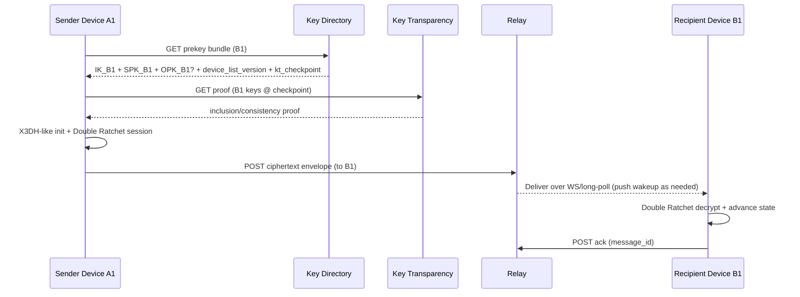

## Overview

End-to-end encrypted (E2EE) messaging is primarily a **key management and state synchronization** problem: safely binding users to long-lived identity keys, enabling asynchronous session setup (when recipients are offline), and continuously rotating per-message keys for **forward secrecy** (and, with ongoing communication, **post-compromise security**)—all while operating a high-availability real-time delivery system that must not learn message plaintext.

This design follows a Signal-style approach:

- **Session bootstrap**: X3DH-like authenticated key agreement using a published *prekey bundle* (identity key, signed prekey, and optional one-time prekey).
- **Message encryption**: **Double Ratchet** per sender-device ↔ recipient-device session, deriving unique message keys and supporting skipped-message recovery.
- **Multi-device**: each device is its own cryptographic principal (`user_id + device_id`). Senders encrypt separately to **each recipient device** and to **their own devices** (“self-sync”) so history stays consistent without server-side plaintext access.
- **Key substitution defense**: **Key Transparency** (append-only log + proofs + gossip/monitors) to detect directory equivocation or malicious key changes.

The server is *untrusted for content* but still responsible for routing, abuse controls, durable delivery, and operational excellence.

---

## Goals and Non-Goals

### Goals
- Confidentiality and integrity of message content against the service operator and attackers who compromise server infrastructure.
- Robust multi-device support with explicit device authorization and revocation.
- Reliable, low-latency delivery with durable buffering for offline devices.
- Auditable detection of malicious key-directory behavior via transparency proofs and monitoring.

### Non-Goals (can be added as separate chapters)
- Private contact discovery (e.g., PSI-based phonebook matching).
- Encrypted media storage and large attachments (different scaling and retention needs).
- Full legal/compliance policy design (covered only at system interface points like retention and access controls).

---

## Requirements

### Functional Requirements
- Account registration and authenticated sessions for each device.
- Explicit multi-device enrollment with user approval (approve/deny new device).
- Publish and rotate device key material:
  - Device identity key (signature key).
  - Signed prekey (DH key signed by identity key).
  - One-time prekeys (DH keys for asynchronous forward secrecy).
- Asynchronous session establishment using prekey bundles.
- Send/receive E2EE messages with multi-device fanout.
- Multi-device sync of outgoing messages, edits/deletes, reactions, and (optionally) read receipts via E2EE “self messages”.
- Group messaging with membership changes and efficient fanout (e.g., Sender Keys).
- Key verification UX (fingerprints / safety numbers), key-change notifications, and optional “verify-before-send” policies for high-risk users.
- Key Transparency proofs and monitoring hooks to detect server-side key substitution/equivocation.

### Non-Functional Requirements (with concrete targets)

#### Scale (example production targets)
- Users: **50M MAU**, **10M DAU**
- Devices: avg **1.8 devices/user**, p95 **4**
- Messaging volume:
  - Avg sends: **6k–15k sends/sec** (typical day curve)
  - Peak sends: **100k sends/sec** (events + diurnal overlap), with capacity headroom to **150k sends/sec**
- Payload: **1–8KB** per recipient-device ciphertext (text + headers), p95 **12KB** (rich metadata, quote, etc.)

**Important multiplier**: each “send” becomes multiple deliveries:
- 1:1 chat: recipient devices (avg ~1.8) + sender self-sync devices (avg ~1.8) ⇒ ~**3–5 ciphertext objects** per send.
- Groups: depends on group size and online/offline distribution; Sender Keys reduce per-message encryption cost but not delivery fanout.

#### Latency
- Key directory:
  - Prekey bundle fetch P99 **< 150ms** (same region)
  - Device list fetch P99 **< 150ms**
- Send acceptance (API ack, excluding push provider latency):
  - P50 **< 60ms**, P99 **< 200ms** (same region)
- Delivery to an online device over existing WebSocket:
  - P50 **< 50ms**, P99 **< 200ms** from relay enqueue to socket write (same region)

#### Availability and Durability
- Message relay + key directory: **99.99%** monthly availability (SLO)
- Key transparency proof retrieval: **99.9%** (messages continue; clients can warn/defer strict checks)
- Durable buffering: store undelivered ciphertext for **up to 7 days** (configurable), delete promptly after ack
- At-least-once delivery with client-side dedupe

#### Consistency model
- **Strong consistency** required for:
  - Device enrollment/revocation state (device list + version)
  - Signed prekey “current pointer”
  - One-time prekey consumption (no double-claim)
- **Eventual consistency** acceptable for:
  - Message delivery timing
  - Receipts and sync messages (they are just messages)
  - Key transparency gossip/monitor propagation

### Constraints & Assumptions
- The server is untrusted for message content, but trusted for:
  - Authenticating accounts/devices
  - Rate limiting and abuse defenses
  - Availability and storage integrity
- Clients have secure key storage when possible (Secure Enclave/Keystore), but must tolerate:
  - Device compromise
  - App reinstalls (ratchet state loss)
- Data minimization: store only metadata required to route and deliver messages; encrypt at rest; strict access controls; audited administrative access.
- Prefer mature, audited crypto libraries and managed infrastructure over bespoke cryptographic services.

---

## Architecture

### High-Level Components

```mermaid
graph TB
  subgraph Clients
    C1[Mobile/Desktop Clients]
  end

  subgraph Edge
    EdgeAPI[Edge/API Gateway]
    Auth[Auth Service]
    Abuse[Rate Limit & Abuse Signals]
  end

  subgraph Core
    KD[Key Directory]
    Relay[Message Relay]
    Deliver[Delivery Tier<br/>(WS/Long-Poll)]
    Push[Push Gateway<br/>(APNS/FCM)]
  end

  subgraph Data
    KeyDB[(Key DB)]
    MsgDB[(Message Inbox DB<br/>TTL + per-device partitions)]
    MQ[(Queue/Stream)]
  end

  subgraph Transparency
    KT[Key Transparency Service]
    KTStore[(Append-only Log Store)]
    Mon[Monitors/Gossip]
  end

  C1 --> EdgeAPI
  EdgeAPI --> Auth
  EdgeAPI --> Abuse
  EdgeAPI --> KD
  EdgeAPI --> Relay
  Relay --> MQ
  MQ --> Deliver
  Deliver --> Push
  KD --> KeyDB
  Relay --> MsgDB

  KD --> KT
  KT --> KTStore
  C1 <--> KT
  Mon <--> KT
```

### Core request flows (at a glance)
1. **Device enrollment**: authenticated device registers, user approves, directory commits device keys, transparency logs the update.
2. **Session setup**: sender fetches recipient device bundle (and KT proof), performs X3DH-like handshake locally, stores a new Double Ratchet session.
3. **Send message**: sender encrypts once per recipient device (+ self devices), relay persists ciphertext and enqueues delivery.
4. **Delivery**: recipient devices fetch pending messages or receive via WebSocket; ack deletes server-side copies.
5. **Key change detection**: clients verify key directory responses against transparency proofs and cached fingerprints, warn on unexpected changes, and optionally block in strict mode.

---

## Component Deep-Dive

### 1) Client Crypto Engine
**Responsibilities**
- Generate and store device keys.
- Perform X3DH-like session initiation using prekey bundles.
- Maintain Double Ratchet state per peer device.
- Encrypt/decrypt messages; manage skipped-message keys with bounded memory.
- Handle device linking, self-sync, and group key distribution.

**Key design points**
- **Per-device principal**: sessions are between devices, enabling clean revocation and explicit fanout.
- **State safety**: ratchet state is critical. Losing it forces session reset; clients should persist it atomically and back it up to local secure storage where possible.
- **Key change UX**: cache peer device fingerprints; warn on changes; support out-of-band verification (QR/safety number).

**Cryptographic choices (typical)**
- DH: X25519
- Signatures: Ed25519
- KDF: HKDF
- AEAD: ChaCha20-Poly1305 (or AES-256-GCM with hardware acceleration)
- Transcript binding: include context/associated data (conversation id, sender/recipient device ids, protocol version) in AEAD AAD to prevent substitution.

### 2) Key Directory Service
**Responsibilities**
- Store device public keys and prekey material.
- Serve prekey bundles for session initiation.
- Enforce:
  - explicit device authorization flows
  - strong consistency for device list/version and one-time prekey claims
- Integrate with Key Transparency (log every key change).

**Key design points**
- **One-time prekey claim is atomic**: conditional update/transaction to prevent double-claim under concurrency.
- **Device list versioning**: every device add/revoke increments `device_list_version`; senders can detect staleness.
- **Prekey hygiene**:
  - Signed prekeys rotate (e.g., every 7–14 days) and overlap during rollouts.
  - One-time prekeys are replenished (e.g., keep 50–200 available per device; tune by traffic).

**Implementation notes**
- Strong consistency can be achieved with:
  - DynamoDB transactions/conditional writes, or
  - a strongly consistent SQL store per user shard, or
  - Cassandra with lightweight transactions (careful with tail latency)
- Cache *bundle components that are safe to cache* (device identity key + current signed prekey); never “cache availability” of one-time prekeys without an atomic claim.

### 3) Message Relay Service
**Responsibilities**
- Authenticate sender (account/device) without seeing plaintext.
- Accept ciphertext envelopes and persist them in a per-recipient-device inbox.
- Enqueue delivery and support:
  - WebSockets for online devices
  - long-poll/fetch for background operation
  - push notification “wakeups” (metadata only)
- Provide dedupe hooks (idempotency) and abuse controls.

**Key design points**
- **At-least-once delivery**: the relay may deliver duplicates; clients dedupe by `message_id` and/or ratchet message number.
- **Inbox model**: store ciphertext keyed by `(recipient_user_id, recipient_device_id)` with TTL; delete on ack.
- **Privacy options**:
  - “Sealed sender”-style sender privacy can reduce metadata exposure but increases complexity (certificate issuance, rate limiting, abuse triage).

### 4) Delivery Tier (WS/Long-Poll) + Push Gateway
**Responsibilities**
- Maintain large numbers of concurrent connections efficiently.
- Apply backpressure and fairness (per-device quotas).
- Send push notifications that reveal minimal metadata:
  - typically “you have a message” + opaque token; no sender/conversation details.

**Key design points**
- Separate **ingest** (send API) from **delivery** to isolate spikes and protect tail latency.
- Prefer **regional delivery**: keep recipient device inbox and delivery workers in the same region as the connected client.

### 5) Key Transparency Service
**Responsibilities**
- Maintain an append-only log of device key registrations/updates.
- Provide proofs to clients:
  - inclusion proof (this key change is in the log)
  - consistency proof (log is append-only over time)
- Support monitors/gossip to detect equivocation (different views shown to different clients).

**Key design points**
- Transparency **detects** server misbehavior; it does not prevent it in real-time unless clients enforce strict policy (which can harm availability).
- Run independent monitors (internal + optionally external) that:
  - fetch signed tree heads periodically
  - check consistency
  - alert on split views or suspicious key churn

---

## Data Model

### Core entities (conceptual)
- **User**: account identifier and status.
- **Device**: per-device identity and capabilities.
- **Prekeys**: signed prekey and one-time prekeys per device.
- **Message inbox**: ciphertext entries per recipient device with TTL and ack deletion.
- **Groups** (optional in this chapter): group membership and sender-key distribution state.
- **Transparency log**: append-only key-change events.

### Example storage schema (illustrative)

**`users`**
- `user_id` (PK)
- `created_at`
- `status` (`active`, `disabled`, `deleted`)

**`devices`**
- `user_id` (PK)
- `device_id` (SK)
- `identity_public_key` (Ed25519)
- `identity_key_fingerprint`
- `capabilities` (protocol versions, sealed-sender support, client type)
- `created_at`, `last_seen_at`
- `revoked_at` (nullable)
- `device_list_version` (monotonic; also stored at user level)

**`signed_prekeys`**
- `user_id` (PK)
- `device_id` (SK)
- `spk_id`
- `spk_public` (X25519)
- `spk_signature` (by device identity key)
- `not_before`, `expires_at`
- `is_current` (or maintain a pointer in `devices`)

**`one_time_prekeys`**
- `user_id` (PK)
- `device_id` (SK)
- `opk_id` (unique)
- `opk_public` (X25519)
- `claimed_at` (nullable)
- `claimed_by` (optional audit: sender user_id hash/token)

**`device_inbox`** (ciphertext only; TTL-based)
- `recipient_user_id` (PK)
- `recipient_device_id` (SK)
- `created_at` (sort key component)
- `message_id` (UUID)
- `ciphertext` (bytes)
- `envelope_meta` (minimal: protocol version, optional sender token)
- `ttl_expires_at`

**`idempotency_keys`** (optional)
- `sender_device_id` (PK)
- `message_id` (SK)
- `seen_at`
- TTL (e.g., 24h) to cap growth

**`kt_log_entries`**
- `log_shard` (PK)
- `seq` (SK)
- `user_id`, `device_id`
- `event_type` (`add_device`, `revoke_device`, `rotate_spk`, etc.)
- `key_fingerprint`
- `timestamp`
- `tree_head_ref`

### Data flow: session setup and send



---

## API Design

All APIs require TLS. Authentication is via device-bound access tokens (e.g., OAuth2/OIDC session bound to device, or short-lived tokens minted after device authentication).

### Common headers
- `Authorization: Bearer <device_token>`
- `Idempotency-Key: <uuid>` for write endpoints
- `X-Client-Protocol: signal-vN` (or negotiated via capabilities)

### Key Directory APIs

**Register device (initiates approval)**
- `POST /v1/users/{user_id}/devices`
  - Request: `{ device_id, identity_public_key, capabilities, device_name? }`
  - Response: `{ status: "PENDING_APPROVAL" | "ACTIVE", device_list_version }`

**Approve/reject device (from an existing approved device)**
- `POST /v1/users/{user_id}/devices/{device_id}:approve`
- `POST /v1/users/{user_id}/devices/{device_id}:reject`

**Revoke device**
- `POST /v1/users/{user_id}/devices/{device_id}:revoke`
  - Response: `{ device_list_version }`

**Upload prekeys**
- `PUT /v1/users/{user_id}/devices/{device_id}/prekeys`
  - Request:
    ```json
    {
      "signed_prekey": { "spk_id": 7, "spk_public": "base64", "spk_signature": "base64", "expires_at": "..." },
      "one_time_prekeys": [{ "opk_id": 1001, "opk_public": "base64" }]
    }
    ```
  - Response: `{ accepted_opk_count, device_list_version, server_time }`
  - Notes:
    - Enforce uniqueness on `(user_id, device_id, spk_id)` and `(user_id, device_id, opk_id)`
    - Rate limit uploads to prevent DB abuse

**Fetch prekey bundle**
- `GET /v1/prekey-bundles/{user_id}/{device_id}`
  - Response:
    ```json
    {
      "identity_key": "base64",
      "signed_prekey": { "spk_id": 7, "spk_public": "base64", "spk_signature": "base64", "expires_at": "..." },
      "one_time_prekey": { "opk_id": 1001, "opk_public": "base64" },
      "device_list_version": 42,
      "kt_checkpoint": { "log_shard": 3, "tree_head": "base64", "timestamp": "..." }
    }
    ```
  - Behavior:
    - OPK may be omitted if depleted; clients continue with reduced asynchrony forward secrecy for the initial message and should trigger replenishment.

**List devices (strongly consistent)**
- `GET /v1/users/{user_id}/devices?min_version=41`
  - Response: `{ devices: [...], device_list_version }`

### Key Transparency APIs
- `GET /v1/key-transparency/proof?user_id=...&device_id=...&checkpoint=...`
  - Response: `{ inclusion_proof, consistency_proof, signed_tree_head }`

### Message Relay APIs

**Send message (multi-device)**
- `POST /v1/messages:send`
  - Request:
    ```json
    {
      "message_id": "uuid",
      "conversation_id": "opaque",
      "device_list_version": 42,
      "recipients": [
        { "user_id": "U2", "device_id": "D1", "ciphertext": "base64", "protocol": "signal-vN" }
      ],
      "sender_auth": { "type": "device_token" }
    }
    ```
  - Response: `{ accepted: [...], rejected: [{ user_id, device_id, error }] }`
  - Errors:
    - `409 STALE_DEVICE_LIST` (include latest `device_list_version`)
    - `413 PAYLOAD_TOO_LARGE`
    - `429 RATE_LIMITED`
- Notes:
  - Server should not require plaintext metadata; `conversation_id` can be opaque (client-generated).
  - Store idempotency keyed by `(sender_device_id, message_id)` for a short TTL.

**Fetch pending messages**
- `GET /v1/messages:pending?device_id=...&limit=100&cursor=...`
  - Response: `{ messages: [{ message_id, ciphertext, created_at }], next_cursor }`

**Acknowledge receipt (deletes from inbox)**
- `POST /v1/messages:ack`
  - Request: `{ device_id: "D1", message_ids: ["..."] }`
- Notes:
  - Read receipts and reactions should be sent as E2EE messages to avoid server learning read state.

---

## Group Messaging (Production Considerations)

### Approach: Sender Keys (Signal-style)
- For each group:
  - A sender distributes a **sender key** to each member device via existing pairwise sessions.
  - Subsequent group messages are encrypted once per sender (per device) and can be decrypted by all group members, reducing per-message encryption cost.
- Membership changes:
  - On member removal, rotate sender keys (or rotate group state) to prevent future access; past messages remain accessible to prior members unless additional mechanisms are used.

### Alternative: MLS (Messaging Layer Security)
- Better for large groups and complex membership changes, but introduces ecosystem and migration complexity. Still requires an identity system, device management, and a transparency story.

---

## Scaling & Performance

### Capacity sizing (order-of-magnitude)
Assume peak **150k sends/sec**, average **4 ciphertext objects per send** (recipient devices + self-sync):
- Inbox writes: ~**600k writes/sec**
- Data written at 3KB avg ciphertext: ~**1.8GB/sec** peak write bandwidth into inbox storage (bursty; must smooth via queue/backpressure)

Implications:
- Prefer a storage model optimized for high write throughput and TTL deletion (DynamoDB/Cassandra-style wide partitions with TTL).
- Isolate “hot partitions” by including time-bucketing in sort keys (e.g., hourly buckets) to avoid single-device hotspots.

### Bottlenecks and mitigations
- **Prekey bundle reads** (cold-start conversations, reinstall storms):
  - Cache IK + current SPK aggressively (minutes) keyed by `(user_id, device_id, spk_id)`.
  - Keep OPK claim atomic and uncached.
- **Inbox write amplification** (multi-device + self-sync + groups):
  - Batch recipient list in a single send call; do server-side fanout.
  - Apply quotas: max devices per user (soft), max recipients per message, and group size limits or tiered service levels.
- **WebSocket fanout cost**:
  - Separate delivery fleet; shard by connection count; enforce per-connection write limits.
  - Prefer binary framing and compact envelopes.
- **Queue lag**:
  - Use partitioning aligned with `(recipient_user_id, recipient_device_id)` hash for locality and fairness.
  - Implement backpressure: if lag exceeds threshold, degrade to pull-based fetch and reduce push frequency.

### Multi-region strategy
- **Regional affinity**:
  - Keep a user’s inbox and delivery in their “home region” for low latency.
- **Key directory consistency**:
  - Strong consistency is easiest if a user’s key state is single-writer (home region) with read replicas elsewhere.
  - If using multi-region active-active, ensure conditional writes/transactions preserve OPK single-claim semantics and accept higher tail latency.

---

## Security, Privacy, and Abuse Controls

### Threat model (simplified)
- Adversary can compromise servers, databases, and networks, but not the endpoints (in the ideal case).
- Adversary may attempt **key substitution** (MITM) via directory control.
- Some endpoints may be compromised; system should limit blast radius and support revocation and recovery.

### Protections
- **E2EE content protection**: server never receives plaintext; ciphertext is authenticated and bound to context via AEAD AAD.
- **Forward secrecy**: Double Ratchet provides FS for messages after session establishment; OPKs improve asynchronous FS for initial messages.
- **Post-compromise security**: Double Ratchet recovers after a compromise once honest parties exchange new messages (not guaranteed for offline-only scenarios).
- **Key transparency**: detects malicious directory behavior over time; clients warn/block based on policy.
- **Metadata minimization**:
  - Push contains minimal metadata.
  - Avoid storing conversation names/participants server-side when feasible.
  - Use short retention for routing metadata; store only what is needed for delivery and abuse controls.

### Abuse prevention (without breaking E2EE)
- Rate limit by account/device, IP, and behavioral signals.
- Spam controls based on metadata and graph heuristics (join time, complaint rates, sending patterns).
- Optional privacy-preserving sender authentication (sealed sender) balanced against abuse triage needs.

---

## Trade-offs & Alternatives

### Trade-offs made
- **Encrypt per recipient device (+ self-sync)**
  - Pros: clear principals, fine-grained revocation, consistent multi-device semantics
  - Cons: CPU/bandwidth and inbox write amplification
- **Strong consistency for device list + OPK claims**
  - Pros: prevents OPK reuse and reduces key-change races that harm UX/security
  - Cons: higher cost and tail latency vs fully eventual stores
- **Key Transparency subsystem**
  - Pros: measurable mitigation for malicious directory threats
  - Cons: operational complexity; proof fetch can impact UX unless policy is carefully designed
- **At-least-once delivery**
  - Pros: simpler, more reliable under retries and transient failures
  - Cons: clients must dedupe; must avoid ratchet desync via robust skipped-key handling

### Alternatives
- **MLS for groups**: efficient membership evolution; higher complexity/maturity risk.
- **Account-wide shared private identity key across devices**:
  - Simpler verification UX
  - Larger blast radius on compromise; weaker revocation semantics
- **Server-assisted re-encryption / escrow**:
  - Improves multi-device history sync
  - Violates E2EE threat model; not acceptable for Signal-style guarantees

---

## Failure Modes & Mitigations

### 1) One-time prekeys depleted
- Impact: new sessions fall back to signed prekey only; weaker asynchronous forward secrecy for the initial message.
- Detection: OPK stock metrics per device; bundle responses indicate OPK absence.
- Mitigation: background replenishment, server nudges, enforce minimum OPK stock for “active” devices, alerting thresholds.

### 2) Directory key substitution / equivocation (malicious or compromised server)
- Impact: confidentiality loss (MITM) for new sessions.
- Detection: KT proof mismatch, inconsistent tree heads via gossip/monitors, unexpected fingerprint changes.
- Mitigation: transparency proofs (warn/strict), out-of-band verification, safety-number change alerts, high-risk mode that blocks sending until verified.

### 3) Duplicate delivery / replay (at-least-once semantics)
- Impact: duplicate UI events; potential ratchet confusion if clients are buggy.
- Detection: repeated `message_id` and/or repeated ratchet message numbers.
- Mitigation: client dedupe; bounded skipped-message key cache; server idempotency on send acceptance.

### 4) Stale device list (new device misses messages)
- Impact: user confusion; device history incomplete until next sync.
- Detection: `409 STALE_DEVICE_LIST` and/or periodic device list refresh detects version mismatch.
- Mitigation: sender retries with updated list; self-sync ensures other sender devices receive messages; new device runs a “catch-up” workflow.

### 5) Regional outage or partition
- Impact: elevated send/delivery latency or temporary unavailability.
- Detection: SLO burn alerts, elevated error rates, queue lag.
- Mitigation: multi-region failover for relay/delivery; directory operations may degrade to single-writer region; clients retry with backoff and alternate endpoints.

---

## Operations

### SLOs and SLIs
- SLIs:
  - Send acceptance latency (P50/P99) and error rate
  - Delivery latency (enqueue → delivered/acked)
  - Inbox backlog per device and queue lag
  - Directory conditional-write conflict rate (OPK claims, device version conflicts)
  - KT proof generation latency and monitor consistency checks
- SLOs:
  - Relay + directory availability 99.99%
  - P99 send acceptance < 200ms (in-region)
  - Inbox durability: no loss of undelivered ciphertext within retention window

### Monitoring and alerting (high-signal)
- OPK stock distribution (p50/p95) and SPK expiry horizon by cohort/app version.
- Sudden spikes in key changes or device enrollments (attack/bug indicator).
- Queue lag and WS connection saturation (capacity and incident indicators).
- KT monitor alerts for inconsistent tree heads or proof failures.

### Deployment strategy
- Protocol versioning embedded in bundles and envelopes; maintain backward-compatible windows.
- Canary releases by region/user-hash; shadow-fetch KT proofs before enforcement.
- Feature flags for strict transparency enforcement and sealed-sender modes.

### Key management and audits
- HSM/KMS for:
  - transparency log signing keys
  - sender certificates (if using sealed sender)
- Rotate server signing keys with overlap and published keysets.
- Audit logs for administrative access to key directory and transparency infrastructure.

### Data retention
- Keep undelivered ciphertext only as long as needed; delete on ack; enforce max TTL (e.g., 7–30 days).
- Minimize and TTL metadata (IP logs, abuse signals) separately with least-privilege access controls.

---

## References & Further Reading
- Signal Protocol overview: https://signal.org/docs/
- X3DH: https://signal.org/docs/specifications/x3dh/
- Double Ratchet: https://signal.org/docs/specifications/doubleratchet/
- Sealed Sender: https://signal.org/blog/sealed-sender/
- Key Transparency concepts: CONIKS: https://coniks.cs.princeton.edu/
- Trillian (Merkle tree transparency): https://github.com/google/trillian
- MLS (Messaging Layer Security): https://datatracker.ietf.org/wg/mls/about/