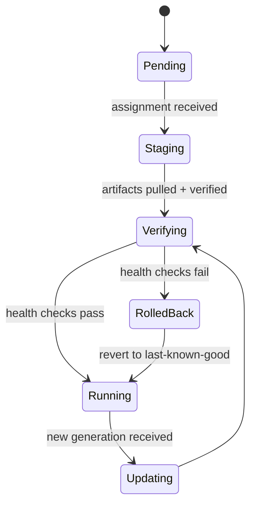
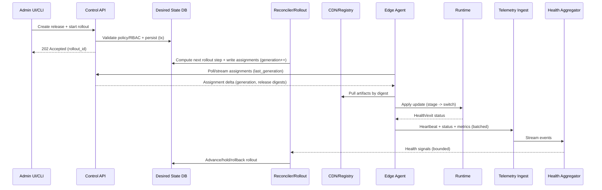

# Edge Compute Platform

## Overview

An edge compute platform deploys and operates containerized workloads across **thousands of geographically distributed sites** (cell towers, retail stores, factories). Unlike a cloud region, the edge is **intermittently connected**, **hardware-heterogeneous**, **bandwidth-constrained**, and **physically accessible** (higher compromise risk). The platform must deliver cloud-like rollout safety, observability, and operational controls while assuming sites can be offline for hours and on-site interventions are expensive.

The core architectural move is to separate:
- A **highly available cloud control plane** for *intent* (desired state, policy, rollout orchestration, audit).
- A **resilient edge data plane** that can *execute autonomously* (local orchestration, caching, health-based rollback, safe degradation).

A second key insight is to **decouple telemetry from correctness paths**: rollouts must remain safe even under noisy logs/metrics spikes. Telemetry is streamed and aggregated asynchronously; the control plane consumes only bounded “health signals” needed for rollout gates.

---

## Requirements

### Functional Requirements
- **Identity & provisioning**: zero-touch enrollment for locations/nodes with strong per-device identity; rotation and revocation.
- **Deployment management**: deploy OCI images + config + secrets; support canary, blue/green, and phased rollouts.
- **Placement & resources**: constraints (arch/GPU/labels), priorities, quotas; CPU/memory/disk/network limits.
- **Lifecycle**: start/stop, pin versions, rollback, health checks, auto-repair, drift detection.
- **Offline operation**: edge continues running last known good desired state; queues deferred updates; resumes reconciliation on reconnect.
- **Observability**: heartbeats, metrics, logs, traces/events; fleet health views and alerts.
- **Remote operations**: cordon/drain, restart workload, fetch diagnostics, controlled debug access with full auditing.
- **Multi-tenancy**: tenant/project isolation; RBAC; per-tenant quotas and noisy-neighbor controls; policy-as-code.

### Non-Functional Requirements (Concrete Targets)

**Fleet Scale**
- Locations: **10,000**
- Nodes: **~30,000** (avg 3/location)
- Workloads: **50–200 containers/location** (**0.5M–2M** total)
- Admin/control-plane API: **5,000 RPS peak** (deploy/status/ops mixed; bursty during incidents)
- Telemetry ingest: **200,000 events/sec peak** (metrics samples + logs + heartbeats + status deltas)

**Back-of-the-envelope bandwidth**
- Heartbeats: 30,000 nodes × 1 heartbeat/10s × ~600 B ≈ **1,800 msgs/sec** ≈ **~1 MB/s**
- Status deltas (deploy changes, restarts): highly bursty; plan for **10×** during rollouts/incidents
- Logs dominate: require **sampling/quotas** and **local buffering** to avoid saturating uplinks

**Latency (steady state, online edges)**
- Deploy request accepted (validated + persisted): **P50 < 200 ms, P99 < 800 ms**
- Assignment visibility to an online edge (stream/long-poll): **P50 < 2 s, P99 < 15 s**
- Artifact availability at edge (CDN hit): **P50 < 2 s**, larger artifacts are bandwidth-bound
- Fleet status query (last 15m, per site): **P50 < 500 ms, P99 < 2 s** (pre-aggregated read model)

**Availability & Durability**
- Control plane (API + orchestration): **99.99%** (multi-AZ, multi-region failover; degraded modes allowed)
- Artifact distribution: **99.99%** (multi-region origin + CDN; edge cache mitigates)
- Desired state + audit data: **RPO ≤ 5 min**, **RTO ≤ 30 min**
- Telemetry: best-effort; tolerate partial loss up to **≤ 1 min** during outages (buffered + sampled)

**Consistency Model**
- **Strong**: desired-state mutations (deploy intent, RBAC/policy decisions, audit)
- **Bounded eventual**: observed status/telemetry (delayed/out-of-order tolerated with timestamps + monotonic sequence numbers)
- **Edge autonomy rule**: edge safety decisions (health-based rollback) must not require synchronous control-plane reads

### Constraints & Assumptions
- Connectivity is often **NATed/outbound-only**; inbound ports at sites are not assumed.
- Heterogeneous hardware (x86/ARM, optional GPU), limited disk; local caching must be quota-managed.
- Assume **physical access is possible**; secrets must be short-lived, scoped, and revocable; binaries and artifacts must be signed.
- Small platform team (**6–10 engineers**): prefer managed databases/streaming/CDN, and keep edge footprint simple.
- Compliance: encryption in transit/at rest; audit logs for privileged actions; tenant isolation and deletion/retention policies.

---

## Architecture

### High-Level (Control Plane vs Edge Plane)

```mermaid
graph TB
  Admin[Admin UI / CLI] --> APIGW[API Gateway]

  subgraph CP[Cloud Control Plane]
    APIGW --> ControlAPI[Control API (Desired State + RBAC + Audit)]
    ControlAPI --> Policy[Policy Engine (OPA)]
    ControlAPI --> DesiredDB[(Desired State DB)]
    ControlAPI --> AuditDB[(Audit Log DB)]
    ControlAPI --> Queue[Work Queue]
    Queue --> Reconciler[Reconciler / Rollout Orchestrator]
    Reconciler --> DesiredDB
    Reconciler --> HealthSignals[(Health Signals Store)]
    Artifacts[Artifact Service (OCI Registry + Signing)] --> Obj[(Object Store)]
    Artifacts --> CDN[CDN]
    TeleIngest[Telemetry Ingest] --> Stream[Event Stream]
    Stream --> Metrics[(Metrics TSDB)]
    Stream --> Logs[(Log Store)]
    Stream --> HealthAgg[Health Aggregator]
    HealthAgg --> HealthSignals
  end

  subgraph Edge[Edge Sites (10k+)]
    Agent[Edge Agent]
    LocalStore[(Local State + Cache)]
    Runtime[Runtime (containerd or k3s)]
    Agent --> Runtime
    Agent --> LocalStore
  end

  Agent -->|mTLS outbound| ControlAPI
  Agent -->|pull by digest| CDN
  Agent -->|buffered telemetry| TeleIngest
```

**What is strongly consistent?** Only the **intent** path: control-plane writes to `DesiredDB` and `AuditDB`.  
**What is eventually consistent?** Everything derived from edge reports (status, logs, metrics), stored in streaming/observability systems and read models.

### Edge Site Internals (Autonomy + Safety)

```mermaid
graph LR
  subgraph Site[Edge Site]
    Agent[Edge Agent]
    LS[(Local SQLite / BoltDB)]
    Cache[(Artifact Cache)]
    Secrets[(Secrets Cache)]
    RT[Runtime: containerd + CNI]
    HC[Health Checker]
    Buf[(Telemetry Buffer)]

    Agent --> LS
    Agent --> Cache
    Agent --> Secrets
    Agent --> RT
    Agent --> HC
    Agent --> Buf
    HC --> Agent
  end

  Agent -->|mTLS| CP[Control Plane]
  Agent -->|HTTPS| CDN[CDN / Registry]
  Agent -->|batched| Tele[Telemetry Ingest]
```



**Safety gates at the edge**
- Verify artifact signatures before activation.
- Apply rollout changes in a controlled order (pull → verify → stage → switch traffic → verify).
- On repeated failures (crash loops, health check failures), **rollback locally** to last-known-good and quarantine the bad version until the control plane updates intent.

### Deployment/Rollout State Machine (Simplified)



---

## Components

### Control Plane (Desired State + Orchestration)
**Responsibilities**
- Validate requests (RBAC + policy), persist desired state, produce assignments, orchestrate rollouts, and maintain audit logs.
- Reconcile fleet toward intent using controllers (Kubernetes-style reconciliation pattern).

**Key design decisions**
- **Desired vs observed separation**: desired state in a transactional DB; observed state via streams/read models. Avoids “hot row” contention from frequent heartbeats.
- **Generation-based convergence**: each location/node applies monotonic `generation` numbers; agents report `observed_generation` for progress tracking and idempotency.
- **Cell-based scaling (recommended)**: partition the fleet into **cells** (often by geography/tenant) so reconciliation and DB load are isolated. A cell outage impacts only its subset.

**Suggested technology**
- Stateless services in Go/Rust/Java
- `DesiredDB`: Postgres (multi-AZ) or distributed SQL (Spanner/Cockroach) if you truly need multi-region strong writes
- Work queues: Kafka/PubSub/SQS-style (exactly-once not required; idempotency is)

### Edge Agent (Local Control Loop)
**Responsibilities**
- Authenticate and maintain outbound connectivity.
- Persist last known desired state + last-known-good release.
- Pull and verify artifacts; apply changes to the runtime; enforce local health policy.
- Buffer and batch telemetry; rate limit to protect uplink.

**Key design decisions**
- Outbound-only **mTLS** sessions (no inbound firewall rules).
- Local persistence so the site survives reboots and disconnects.
- **Adaptive reporting**: increase heartbeat frequency during instability; slow down when stable.

**Runtime options**
- `containerd` directly (smaller footprint, fewer moving parts)  
- `k3s`/lightweight Kubernetes (more ecosystem integration, higher complexity)

### Artifact Service (OCI + Integrity)
**Responsibilities**
- Store images/config bundles and distribute them efficiently.
- Ensure supply chain integrity (signing, verification, provenance).

**Key design decisions**
- Content-addressed, immutable artifacts (digests) to enable caching and reproducibility.
- Signature verification at the edge before activation; optionally require SBOM/provenance attestations.

**Implementation**
- OCI registry backed by object storage + CDN
- Signing with Sigstore/cosign-style workflows (or equivalent)

### Telemetry Ingest + Read Models
**Responsibilities**
- Ingest edge telemetry and produce:
  - raw logs/metrics storage for troubleshooting,
  - **health signals** for rollouts (bounded, low-cardinality),
  - fleet-wide read models for the UI.

**Key design decisions**
- Stream-first ingestion (Kafka/PubSub) with multiple consumers.
- Cardinality controls: enforce label allowlists, per-tenant quotas, sampling; reject/shape at ingest.
- **Do not gate rollouts on raw logs**; gate on synthesized health signals (error rates, restart loops, probe failures).

**Storage**
- Metrics: Mimir/Thanos/VictoriaMetrics or managed TSDB
- Logs: Loki/OpenSearch/S3+indexing depending on cost/queries
- Fast “status UI” read model: Postgres summary tables, ClickHouse, or Elasticsearch (depending on query patterns)

### Policy, Identity, and Secrets
**Identity model**
- Each node gets a unique identity (cert-based). Prefer TPM-backed keys when available.
- Enrollment uses short-lived tokens; after enrollment, use short-lived certs rotated automatically.

**Secrets distribution**
- Secrets are delivered as **short-lived leases** (minutes-hours), scoped per workload, encrypted for the node/workload identity.
- Offline behavior: edges may use cached secrets until lease expiry; beyond that, workloads must fail closed or degrade per policy.

**Authorization**
- RBAC per tenant/project; OPA policies for deployment constraints, allowed capabilities, and debug access.

---

## Data Model

### Core Entities (Authoritative)
**Desired State DB (Postgres / distributed SQL)**
- `tenants(tenant_id, name, created_at)`
- `locations(location_id, tenant_id, region, labels_jsonb, created_at)`
- `nodes(node_id, location_id, arch, capacity_cpu, capacity_mem, labels_jsonb, enrolled_at, revoked_at)`
- `deployments(deployment_id, tenant_id, name, policy_ref, strategy, created_by, created_at)`
- `releases(release_id, deployment_id, image_digest, config_digest, secrets_ref, constraints_jsonb, version, created_at)`
- `location_assignments(location_id, release_id, generation, desired_spec_jsonb, updated_at)`
- `rollouts(rollout_id, release_id, state, step_index, started_at, completed_at)`
- `audit_log(event_id, tenant_id, actor, action, resource, request_jsonb, created_at)` (time-partitioned)

**Invariants**
- `generation` is monotonically increasing per `location_id`.
- Agents apply assignments idempotently: apply only if `generation > applied_generation`.
- Release artifacts are immutable by digest; “mutable tags” are resolved at release creation, not at the edge.

### Observed State (Derived, Eventually Consistent)
Keep high-churn “last seen” and workload status **out of** the transactional desired-state tables:
- Telemetry stream topics:
  - `edge.heartbeat` (key: `location_id`)
  - `edge.status_delta` (key: `location_id`)
  - `edge.metrics` (key: `location_id`)
  - `edge.logs` (key: `location_id`, heavily sampled/filtered)
- A derived read model for fast UI queries:
  - `location_status_summary(location_id, last_seen_at, applied_generation, health, workload_counts, updated_at)`

### Data Flow (Deploy + Health Gates)



---

## API

### Admin/Control APIs (REST)

**Conventions**
- All create/mutate endpoints accept `Idempotency-Key`.
- Use optimistic concurrency for updates with `If-Match` on resource `etag`.
- Pagination: `?pageSize=100&pageToken=...`; filtering by `tenantId`, `region`, labels.

**Examples**

- `POST /v1/tenants/{tenantId}/locations`
  - Request:
    ```json
    { "region": "us-east-1", "labels": { "tower": "A12" } }
    ```
  - Response:
    ```json
    { "locationId": "loc_123", "enrollmentToken": "tok_...", "expiresAt": "2026-01-01T00:00:00Z" }
    ```

- `POST /v1/tenants/{tenantId}/deployments`
  - Request:
    ```json
    { "name": "video-transcode", "policyRef": "opa://policies/edge-default", "strategy": "canary" }
    ```
  - Response: `{ "deploymentId": "dep_123" }`

- `POST /v1/tenants/{tenantId}/deployments/{deploymentId}/releases`
  - Request:
    ```json
    {
      "imageDigest": "sha256:...",
      "configDigest": "sha256:...",
      "secretsRef": "secrets://team-a/video-transcode",
      "constraints": { "arch": ["amd64"], "labels": { "gpu": "true" } }
    }
    ```
  - Response: `{ "releaseId": "rel_456", "version": 17 }`

- `POST /v1/tenants/{tenantId}/releases/{releaseId}/rollouts`
  - Request:
    ```json
    {
      "type": "canary",
      "steps": [{"percent": 1}, {"percent": 10}, {"percent": 50}, {"percent": 100}],
      "healthGate": { "maxRestartRatePerMin": 0.1, "maxErrorRate": 0.01, "minBakeSeconds": 300 }
    }
    ```
  - Response: `{ "rolloutId": "ro_789", "status": "running" }`

- `GET /v1/tenants/{tenantId}/locations/{locationId}/status`
  - Response:
    ```json
    {
      "locationId": "loc_123",
      "lastSeenAt": "2026-01-01T00:00:00Z",
      "stalenessSeconds": 12,
      "appliedGeneration": 1042,
      "health": "degraded",
      "nodes": [{"nodeId":"n1","arch":"amd64","status":"ready"}],
      "workloads": [{"name":"video-transcode","version":17,"state":"running"}]
    }
    ```
  - Consistency: eventual; clients must handle staleness.

### Edge APIs (gRPC)

**Why gRPC here?** Long-lived streams/long-poll reduce overhead and improve propagation latency through NATed outbound connections.

Core RPCs:
- `RegisterNode(EnrollToken, NodeInfo) -> NodeIdentity`
- `StreamAssignments(NodeIdentity, last_generation) -> stream AssignmentDelta`
- `ReportStatus(NodeIdentity, StatusBatch) -> Ack`
- `FetchSecrets(NodeIdentity, SecretRefs) -> EncryptedSecrets`

**Idempotency**
- `ReportStatus` is idempotent by `(node_id, sequence_number)` with bounded server-side dedupe window.
- Assignment application is idempotent by `generation`.

**Error model**
- Structured errors: `{code, message, retryable, retryAfterMs, details}`
- Retryable responses must include backoff guidance; agents use exponential backoff with jitter and circuit breaking.

---

## Scaling

### Control Plane Scaling
- **Shard reconciliation** by `location_id` (or cell + hash) with bounded concurrency.
- Use **work queues** for reconciliation steps and rollout transitions; avoid synchronous fanout.
- Avoid high-churn writes to transactional DB (e.g., per-heartbeat updates). Store “last seen” in a derived read model instead.

### Telemetry Scaling
- Partition stream topics by `location_id` to keep per-site ordering where needed.
- Enforce per-tenant budgets:
  - max metrics series / labels,
  - logs bytes/sec,
  - status update frequency.
- Buffer at the edge with spill-to-disk and drop policies (e.g., drop debug logs first).

### Artifact Distribution Scaling
- CDN-backed distribution with immutable digests.
- Prevent stampedes:
  - rollout step sizing (percent-based),
  - edge-side randomized delay (“jittered fetch”),
  - optional prefetch windows.
- Disk quotas and LRU eviction for artifact cache; keep last-known-good pinned.

### Database / Storage Partitioning
- `audit_log`: time partitioning + tenant_id indexes.
- `location_assignments`: partition by tenant or hash(location_id) if a single tenant dominates.
- Read model tables can be stored in a system optimized for scans/aggregations (ClickHouse) if Postgres becomes a bottleneck.

---

## Trade-offs

- **Decoupled telemetry pipeline (stream + TSDB/log store) vs single DB**
  - Pros: protects rollout correctness and API latency under telemetry spikes
  - Cons: more components, eventual consistency, more operational overhead

- **Edge autonomy (local rollback + cached desired state) vs centralized real-time control**
  - Pros: survives disconnects; safer under control-plane outages
  - Cons: harder to guarantee uniform fleet state; requires strong local safety rules and careful versioning

- **Immutable digest-based artifacts + signing vs mutable tags (“latest”)**
  - Pros: reproducible, cache-friendly, strong integrity guarantees
  - Cons: requires CI/CD discipline; more metadata plumbing (digests, attestations)

- **Cell-based partitioning vs global single control plane**
  - Pros: limits blast radius; improves scalability; simpler regional operations
  - Cons: cross-cell coordination is harder (global policies, global rollouts)

- **containerd-first edge runtime vs Kubernetes everywhere**
  - Pros: smaller footprint; fewer failure modes; easier upgrades
  - Cons: less ecosystem leverage; more custom features (namespacing, scheduling primitives)

---

## Failure Modes

### 1) Site loses connectivity for hours
- Impact: no new deploys; stale fleet view; workloads must continue safely
- Detection: missed heartbeats; staleness thresholds on derived read model
- Mitigation: local desired state + last-known-good; deferred updates queued; reconcile on reconnect

### 2) Bad release causes crash loops
- Impact: partial outage; risk of fleet-wide impact if rollout continues
- Detection: local health checks + restart-rate gates; aggregated health signals breach thresholds
- Mitigation: automatic rollout halt; edge local rollback; require manual approval to proceed; quarantine bad version

### 3) Registry/CDN outage or regional artifact unavailability
- Impact: new rollouts stall; existing workloads unaffected
- Detection: elevated fetch failures; CDN health checks; edge reports “artifact unavailable”
- Mitigation: multi-region origins; multi-CDN if needed; edge caches; prefetch + staggered rollout

### 4) Control plane regional outage / DB failover
- Impact: admin actions degraded; assignment updates delayed; edges continue running
- Detection: synthetic probes, SLO burn alerts, queue growth
- Mitigation: multi-AZ DB; automated regional failover (RPO ≤ 5 min); agents configured with endpoint list and exponential backoff

### 5) Compromised edge node attempts impersonation or secret exfiltration
- Impact: unauthorized workload execution, telemetry poisoning, data exposure
- Detection: cert anomalies, unexpected identity reuse, unusual secret fetch patterns
- Mitigation: per-node mTLS identities, short-lived certs, revocation, hardware attestation where available, least-privilege secrets, audit trails and alerts

### 6) Time skew / clock jumps on edge
- Impact: bad TTL handling, misleading metrics timestamps, rollout gate errors
- Detection: NTP drift checks; server-side timestamp sanity rules
- Mitigation: prefer monotonic sequence numbers for ordering; clamp timestamps; edge time sync requirements

---

## Operations

### SLOs and Alerts (Examples)
- Control API:
  - Availability: **99.99%**
  - Latency: **P99 < 800 ms** for write acceptance
  - Alerts: 5xx > **1% for 5m**, DB p95 latency > **50 ms for 10m**, queue lag p99 > **60s**
- Fleet:
  - Offline locations: > **2%** (exclude maintenance windows) for 15m
  - Rollout stuck rate: > **1%** of active rollouts blocked > **30m**
- Telemetry:
  - Stream ingest lag > **2 min**; dropped events > **0.5%** sustained
  - High-cardinality rejections spike (indicative of misconfigured clients)

### Deployment and Change Management
- Control plane:
  - Regional canaries → global rollout; feature flags for rollout logic
  - Expand/contract DB migrations
- Edge agent:
  - Ring-based rollout (1% → 10% → 50% → 100%), auto-rollback on crash rate
  - Signed binaries; verify signatures before upgrade; keep N-1 agent for rollback

### Incident Response and Debugging
- Provide “break-glass” debug:
  - time-bound approvals,
  - session recording,
  - per-tenant audit logs,
  - least-privileged diagnostic commands over an agent-mediated channel
- Runbooks:
  - halt rollout globally/tenant/cell,
  - revoke node identity,
  - rotate CA / enrollment tokens,
  - drain a location and pin to last-known-good.

### Disaster Recovery
- Desired state + audit:
  - PITR/WAL archiving; periodic restore tests
  - RTO **30 min**, RPO **≤ 5 min**
- Telemetry:
  - best-effort; define retention tiers (e.g., logs 7–30 days, metrics 30–180 days) and costs upfront

---

## References & Further Reading
- Kubernetes controller/reconciliation pattern: https://kubernetes.io/docs/concepts/architecture/controller/
- OCI image specification: https://github.com/opencontainers/image-spec
- Sigstore / cosign (artifact signing): https://docs.sigstore.dev/
- AWS Greengrass (edge fleet management concepts): https://docs.aws.amazon.com/greengrass/
- Azure IoT Edge concepts: https://learn.microsoft.com/azure/iot-edge/
- Envoy xDS (config distribution patterns): https://www.envoyproxy.io/docs/envoy/latest/api-docs/xds_protocol
- Kafka (streaming backbone): https://kafka.apache.org/documentation/