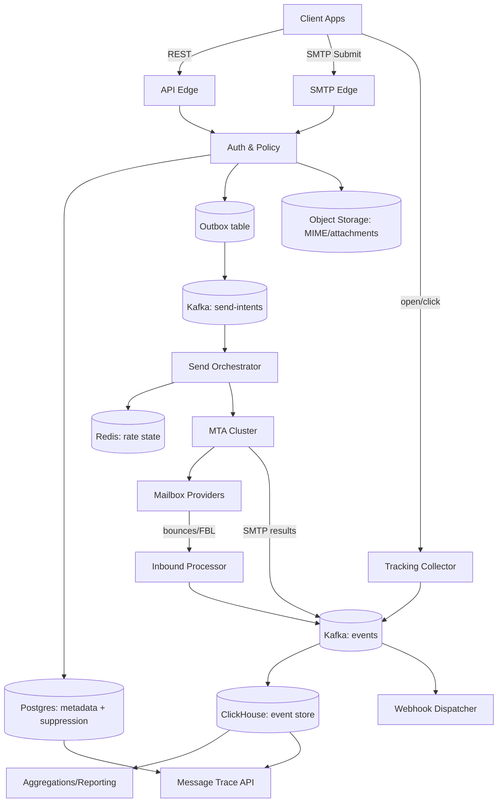

# Email Delivery Platform

## Overview

An email delivery platform (SendGrid/Mailgun-like) accepts high-throughput send requests, renders personalized content, and delivers mail reliably while protecting sender reputation. “Success” is not just throughput—it’s sustained inbox placement, which depends on IP/domain reputation, complaint rates, bounce handling, authentication (SPF/DKIM/DMARC), and strict compliance controls (unsubscribe, suppression, auditing, data minimization).

The core architectural principle is to decouple **accepting send intent** (fast, strongly validated, durable) from **attempting delivery** (slow, provider-throttled, retry-heavy) using an event-driven pipeline. This enables:
- Predictable API latency and backpressure control.
- Per-tenant policy enforcement and isolation (quotas, pools, kill switches).
- Deterministic idempotency and safe retries.
- Robust post-delivery processing (bounces, feedback loops, engagement) without blocking the hot path.

---

## Requirements

### Functional Requirements
- Accept send requests via:
  - REST API (JSON payloads).
  - SMTP relay (authenticated tenants, submission port 587).
- Support:
  - Templates + substitutions (per-recipient personalization).
  - Attachments and/or raw MIME.
  - Per-recipient headers and metadata.
- Deliverability controls:
  - Shared and dedicated IP pools.
  - Warm-up schedules and ramp limits.
  - Provider-aware throttling (per destination domain).
  - Adaptive routing based on reputation signals.
- Compliance and safety:
  - Unsubscribe support (List-Unsubscribe headers + one-click where applicable).
  - Suppression lists (manual, bounce, complaint, unsubscribe).
  - Tenant/campaign kill switch and quarantine pools.
  - Audit log for policy-relevant actions.
- Eventing:
  - Delivery events: accepted, queued, sent, delivered, deferred, bounced (hard/soft), complained, unsubscribed.
  - Engagement: opened/clicked (optional; privacy-sensitive and increasingly limited).
  - Webhooks to tenants with retries and signatures.
- Analytics:
  - Campaign/domain/IP pool breakdown.
  - Time-series aggregates (hour/day).
  - Searchable per-message trace (support tooling).

### Non-Functional Requirements (Targets)
- **Scale (example target)**
  - Tenants: 50k.
  - Active tenants/day: 10k.
  - Emails/day: 500M average, up to 1B peak season.
  - Peak ingest: 150k send requests/sec sustained for bursts (5–15 minutes).
  - Peak telemetry (events): 1–3M events/sec (opens/clicks can dominate).
  - Storage: 1–5 TB/day compressed event data (depends heavily on engagement tracking and retention).
- **Latency**
  - Send API: P50 < 50 ms, P99 < 250 ms (returns after durable acceptance, not delivery).
  - Webhooks: P99 < 5 s from event ingestion to enqueue attempt (end-to-end delivery to tenant depends on tenant endpoint).
- **Availability**
  - Send ingestion: 99.99% (multi-AZ, region failover supported).
  - Webhook delivery pipeline: 99.9% (degrades gracefully with retries).
  - Analytics dashboards: 99.9% (can be slower during incidents).
- **Consistency**
  - Strong consistency for: suppression/unsubscribe checks, idempotent acceptance, tenant kill switches.
  - Eventual consistency for: analytics aggregates, searchable event logs (seconds to minutes).
- **Durability**
  - No loss for accepted sends (RPO ≈ 0 for accepted requests).
  - Telemetry loss tolerance: up to 0.1% during major regional incidents with best-effort backfill.

### Constraints & Assumptions
- Multi-tenant and untrusted inputs; strict isolation for quotas, pools, and abuse handling.
- PII minimization: store only what is needed (hash emails when possible); support deletion requests.
- Encryption in transit and at rest; tenant keys/secrets stored in a KMS-backed system.
- Two-region design: active-active *for the edge*, with well-defined write ownership to keep strong consistency feasible.
- DNS control for platform domains; optionally support customer-managed domains (bring-your-own DKIM).

---

## Architecture

### High-Level Diagram



### Key Architectural Choices (Why)
- **Transactional Outbox for acceptance**: avoids “dual write” inconsistency between Postgres and Kafka.
- **Separate intent stream and event stream**: prevents high-volume telemetry (opens/clicks) from starving delivery.
- **Rate control in orchestrator**: centralizes deliverability logic; MTAs remain fast SMTP executors.

---

## Components

### API Edge / SMTP Edge
**Responsibilities**
- Authenticate tenants and validate requests.
- Enforce request-level limits (payload size, recipients count, attachment caps).
- Normalize content references (template IDs, stored MIME pointers).
- Create a durable acceptance record and return `message_id`.

**Acceptance contract**
- Return `202 Accepted` only after:
  - Policy checks pass (including suppression).
  - Metadata is committed in the source-of-truth DB.
  - Send intent is guaranteed to be published (via outbox).

**Idempotency**
- REST: `Idempotency-Key` (tenant-scoped) with payload hash; replay returns the same `message_id`.
- SMTP: accept `X-Message-Id` (or a custom header) for deterministic dedupe; otherwise document as best-effort.

### Auth & Policy (Quota, Suppression, Compliance)
**Responsibilities**
- Validate API keys/OAuth and tenant status.
- Enforce hierarchical limits:
  - Tenant/day and tenant/minute quotas.
  - Campaign throttles.
  - Recipient caps per request.
- Suppression/unsubscribe checks on the accept path.
- Enforce compliance flags (e.g., require `List-Unsubscribe` for marketing category).

**Data consistency**
- Suppression source of truth in Postgres with indexes on `(tenant_id, email_hash)`.
- Redis is a cache and rate-state store, not the authority.

### Send Orchestrator (Routing, Scheduling, Reputation)
**Responsibilities**
- Consume send intents, fetch content, render templates.
- Expand to per-recipient work units (if not already expanded at accept time).
- Choose:
  - IP pool (shared/dedicated/quarantine).
  - From-domain identity (platform vs customer domain).
  - Provider-specific throttling parameters.
- Execute retries with exponential backoff and provider-aware rules.

**Retry policy (typical)**
- 4xx deferrals: retry up to 48–72 hours with increasing backoff and jitter.
- 5xx permanent failures: classify as hard bounce (provider-dependent) and suppress when appropriate.
- Enforce maximum attempts per recipient to bound cost and queue growth.

**Reputation signals**
- Maintain rolling windows per `(ip, provider_domain)`:
  - complaint rate, hard bounce rate, deferral rate, timeout rate.
- Use these to adjust token buckets (rate) and concurrency.

### MTA Cluster (SMTP Delivery)
**Responsibilities**
- SMTP transactions, TLS, connection pooling, DKIM signing, and detailed SMTP response capture.
- Maintain per-destination connection reuse and limits (to reduce handshake overhead and avoid provider blocks).

**Design stance**
- MTAs should be operationally simple and fast.
- Policy, routing, and retry decisions live in the orchestrator for consistency and observability.

### Inbound Processor (Bounces & Feedback Loops)
**Responsibilities**
- Receive and parse:
  - DSNs (bounces) via inbound MX for return-path domains.
  - FBL complaint reports (ARF) where supported.
- Normalize into canonical events and update suppression when policy says so.

### Tracking Collector (Opens/Clicks)
**Responsibilities**
- Serve tracking pixel (opens) and redirect service (clicks).
- Emit telemetry events asynchronously with aggressive buffering and shedding controls.

**Privacy note**
- Engagement tracking is increasingly constrained (e.g., MPP). Treat opens/clicks as best-effort signals, not delivery truth.

### Event Pipeline & Webhook Dispatcher
**Responsibilities**
- Normalize, dedupe, and append immutable events.
- Deliver tenant webhooks with:
  - At-least-once semantics.
  - Per-tenant concurrency caps.
  - Signed payloads and replay protection.

**Dedupe strategy**
- Assign globally unique `event_id` (ULID/UUIDv7).
- For sources that can duplicate (tracking, some inbound), dedupe by `(tenant_id, event_type, message_id, rcpt_id, source_event_key)` within a time window.

---

## Data Model

### Identifiers and PII
- Use ULID/UUIDv7 for `message_id` and `event_id` to support roughly time-ordered writes.
- Store recipient emails as:
  - `email_hash = SHA-256(normalized_email + tenant_salt)` for suppression joins.
  - Optional encrypted email (for UI display / webhook payload requirements) with strict access controls and retention limits.

### Primary Store (Postgres: strongly consistent)
- `tenants(tenant_id, status, plan, home_region, created_at)`
- `api_keys(key_id, tenant_id, hashed_secret, scopes, created_at, revoked_at)`
- `messages(message_id, tenant_id, campaign_id, template_id, from_identity, ip_pool_id, status, accepted_at)`
- `message_recipients(message_id, rcpt_id, email_hash, dest_domain, personalization_json, status)`
- `idempotency_keys(tenant_id, idem_key, payload_sha256, message_id, created_at)` with unique `(tenant_id, idem_key)`
- `attempts(attempt_id, message_id, rcpt_id, mta_id, ip_id, provider_domain, smtp_code, smtp_response, attempted_at)`
- `suppression(tenant_id, email_hash, reason, created_at, source_event_id)` with unique `(tenant_id, email_hash)`
- `ip_pools(ip_pool_id, tenant_id, pool_type, warmup_policy, status)`
- `kill_switches(tenant_id, scope, scope_id, enabled, reason, updated_at)`
- `outbox(id, aggregate_type, aggregate_id, topic, payload_json, created_at, published_at)` (transactional outbox)

### Object Storage (large payloads)
- `mimes/{tenant_id}/{message_id}.eml` for raw MIME (optional).
- `attachments/{tenant_id}/{blob_id}` referenced by messages.
- Store only pointers in Postgres; enforce size caps at the edge.

### Event Store (ClickHouse: append-only analytics)
- `events`
  - Columns: `tenant_id, event_time, event_id, message_id, rcpt_id, type, provider_domain, ip_id, smtp_code, meta Map(String,String)`
  - Partition: by `toDate(event_time)`
  - Order: `(tenant_id, event_time, message_id)`
- `aggregates_hourly`
  - `tenant_id, hour, campaign_id, type, count`

### Redis (hot state / rate control)
- Token buckets: `rl:{tenant_id}:{scope}:{scope_id}`
- Domain throttles: `dom:{provider_domain}:{ip_pool_id}`
- Webhook retry state: `wh:{tenant_id}`

---

## API

### REST

**POST `/v1/messages:send`**
- Headers:
  - `Authorization: Bearer <token>`
  - `Idempotency-Key: <uuid>`
- Request:
  ```json
  {
    "from": {"email":"noreply@example.com","name":"Example"},
    "to": [{"email":"a@example.com","vars":{"first":"A"}}],
    "subject":"Hello {{first}}",
    "template_id":"tpl_123",
    "campaign_id":"cmp_456",
    "content": {
      "mime_object_key": "mimes/ten_1/msg_abc.eml"
    },
    "ip_pool": "dedicated",
    "track": {"opens":true,"clicks":true},
    "headers": {"X-Custom":"123"},
    "metadata": {"order_id":"o-987"}
  }
  ```
- Response `202`:
  ```json
  {"message_id":"01JFA4QZK8Q1J3Q0Y6W0Y8M7YV","accepted_at":"2025-12-17T12:00:00Z"}
  ```
- Errors:
  - `401` invalid auth
  - `403` tenant disabled / kill switch
  - `409` idempotency conflict (same key, different payload hash)
  - `422` invalid recipient/template/content reference
  - `429` rate limited / quota exceeded

**GET `/v1/messages/{message_id}`**
- Returns acceptance metadata, per-recipient status summary, and pointers for trace/events.

**GET `/v1/events`**
- Filters: `message_id`, `campaign_id`, `type`, `from_time`, `to_time`, `cursor`, `limit`
- Returns paginated events (eventual consistency acceptable).

**POST `/v1/suppressions`**
- Body: `{ "email":"a@example.com", "reason":"manual" }`
- Idempotent by `(tenant_id, email_hash)`.

**POST `/v1/messages/{message_id}:cancel`**
- Best-effort cancellation for messages not yet attempted; returns `409` if already in-flight/attempted.

### Webhooks
**POST `{tenant_webhook_url}`**
- Headers:
  - `X-Event-Id: <event_id>`
  - `X-Signature: <hmac_sha256>`
  - `X-Timestamp: <unix_seconds>`
  - `X-Retry-Count: <n>`
- Delivery semantics: at-least-once; tenants dedupe by `event_id`.
- Security:
  - Include timestamp in the signed payload to prevent replay.
  - Reject if timestamp skew exceeds configured window (e.g., 5 minutes).

---

## Scaling & Performance

### Capacity Planning (sanity checks)
- Peak 150k sends/sec:
  - If average 1.2 recipients/message ⇒ ~180k recipient deliveries/sec (work units).
  - Template rendering and DKIM signing must be parallelized and cached.
- Events at 2M/sec:
  - Must batch ingest into ClickHouse (e.g., 5k–50k rows per insert).
  - Keep event schema compact; avoid large JSON blobs in hot columns.

### Hot Path Optimization (acceptance)
- Single strongly consistent write transaction in Postgres (message + idempotency row + outbox row).
- Publish to Kafka asynchronously via outbox poller with retry and backpressure.
- Redis used only for:
  - Rate-limit counters.
  - Cached auth/plan data.
  - Short-lived suppression cache (never as the authority).

### Delivery Path Optimization
- Partition Kafka send-intents by `(tenant_id)` and optionally by `(provider_domain)` to reduce cross-domain head-of-line blocking.
- Maintain per-provider-domain concurrency caps and token buckets to avoid provider rate limits.
- Use connection pooling and reuse at MTAs to reduce TLS handshakes.

### Analytics Optimization
- Immutable event log + rollups:
  - `events` for trace and ad-hoc queries.
  - `aggregates_hourly/daily` for dashboards.
- Retention tiers:
  - Full-fidelity events: 7–30 days (configurable by plan).
  - Aggregates: 12–24 months.

---

## Trade-offs & Alternatives

### Trade-offs (explicit)
1. **Durable acceptance via DB+Outbox (strong correctness) vs direct Kafka publish (lower latency)**
   - Outbox avoids lost/duplicated intents at the cost of extra DB writes and a publisher service.
2. **Centralized orchestrator retry logic vs MTA-native spooling**
   - Centralization improves consistency, observability, and policy control; MTA spooling can reduce orchestrator complexity but can fragment logic and complicate tenant isolation.
3. **Append-only event store (scalable writes + audit) vs mutable status rows (simple reads)**
   - Append-only scales to high event rates; mutable “current status” can become a write hotspot and lose history without careful design.

### Alternatives
- **Global strongly consistent DB (Spanner/CockroachDB)**
  - Simplifies multi-region idempotency/suppression; increases cost and operational complexity (or vendor lock-in).
- **KV store for suppression/idempotency (DynamoDB/Bigtable)**
  - High throughput and simpler scaling; requires careful schema design and can complicate ad-hoc queries/audits.
- **Provider-specific delivery pipelines**
  - Better tuning and isolation; increases complexity and requires specialized operational knowledge.

---

## Failure Modes & Mitigations

### Scenario 1: Kafka outage / severe degradation (send-intents)
- **Impact**: Orchestrator cannot consume; delivery stalls; acceptance may need to slow/stop.
- **Detection**: Partition unavailability, ISR shrink, producer errors, consumer lag growth.
- **Mitigation**
  - Multi-AZ Kafka with strict durability settings on send-intents.
  - Backpressure: throttle acceptance and return `429` early when lag crosses thresholds.
  - Outbox retains intents in Postgres until Kafka recovers (bounded by storage and retention policy).

### Scenario 2: Postgres degradation (accept path)
- **Impact**: Cannot strongly enforce suppression/idempotency; must fail closed for compliance.
- **Detection**: Increased commit latency, replication lag (if applicable), error rate.
- **Mitigation**
  - Multi-AZ Postgres with automated failover and PITR.
  - Rate-limit at edge to protect DB.
  - Fail closed for sends requiring suppression checks; optionally allow only explicitly exempt traffic (rare, policy-driven).

### Scenario 3: Provider throttling / temporary blocks (e.g., Gmail deferrals)
- **Impact**: Rising deferrals, delayed delivery, queue growth.
- **Detection**: Spike in 4xx codes by provider domain/IP; increased retry backlog.
- **Mitigation**
  - Adaptive token buckets and concurrency reduction for affected domains.
  - Automated warm-up enforcement and quarantine of risky tenants.
  - Switch to alternate pools only when policy allows (avoid reputation “pool hopping” that can worsen outcomes).

### Scenario 4: Bad tenant causes complaint spike on shared IP pool
- **Impact**: Reputation damage and reduced inbox placement for other tenants.
- **Detection**: Complaint rate thresholds (e.g., >0.1%), anomaly detection vs tenant baseline.
- **Mitigation**
  - Auto-pause tenant/campaign; move to quarantine pool.
  - Require dedicated IP or additional verification for continued sending.
  - Hard caps on shared pool contribution per tenant.

### Scenario 5: Webhook storms / tenant endpoint down
- **Impact**: Retry backlog, resource exhaustion, delayed notifications.
- **Detection**: Per-tenant 5xx/timeout spikes, DLQ growth, retry queue age.
- **Mitigation**
  - Per-tenant concurrency limits and exponential backoff with jitter.
  - DLQ + replay API; stop retrying after max age (e.g., 72h) per plan.
  - Allow tenant to temporarily disable webhooks without losing events (events remain queryable).

### Scenario 6: Region outage
- **Impact**: Edge capacity reduced; potential acceptance unavailability depending on write ownership.
- **Mitigation**
  - Define tenant “home region” for strong consistency; route writes to home region.
  - On home-region outage: fail over tenants to secondary region with explicit degraded-mode semantics (possible duplicates without global consensus; require idempotency keys and document behavior).
  - Keep IP pools pre-provisioned and warm-up-aware in both regions.

---

## Operations

### SLOs / SLIs
- **Ingest SLO**: 99.99% `POST /messages:send` success for valid requests.
  - SLIs: request success rate, P99 latency, durable acceptance rate (outbox growth).
- **Delivery health** (best-effort, provider-dependent):
  - SLIs: deferral rate by provider domain, hard bounce rate, complaint rate, timeout rate.
- **Webhook SLO**: 99.9% enqueue-to-attempt within 5s; delivery depends on tenant endpoint.
  - SLIs: dispatcher backlog age, per-tenant success rate.

### Monitoring & Alerting (minimum set)
- Edge: RPS, 4xx/5xx, P99 latency, auth failures, payload rejection reasons.
- Postgres: commit latency, CPU/IO, connection saturation, replication lag, outbox table growth.
- Kafka: produce error rate, under-replicated partitions, consumer lag by topic/partition.
- Orchestrator: intent backlog age, retry backlog, per-provider throttle state, rendering latency.
- MTA: connection counts, TLS success, SMTP code distribution, queue depth, per-IP send rate.
- Events/ClickHouse: ingest throughput, insert latency, merge lag, query P99.
- Webhooks: success rate, retry backlog age, DLQ size, tenant-specific error hotspots.

### Deployment & Change Management
- Canary/blue-green for edge and orchestrator.
- Versioned Kafka schemas (schema registry) with forward/backward compatibility.
- DB migrations: expand/contract; async backfills; avoid long locks.
- Feature flags for routing/throttling algorithms with per-tenant rollout.

### Security & Compliance
- API keys: hashed secrets, scoped permissions, rotation, and revocation.
- Webhooks: HMAC signing + timestamp; per-tenant secret rotation.
- Data retention and deletion:
  - Configurable event retention by plan.
  - Deletion workflows for recipient data (remove encrypted email, keep hashed references if required for suppression compliance, per policy and jurisdiction).
- Abuse prevention:
  - Content scanning hooks (optional) and strict tenant onboarding controls.
  - Rate limiting, anomaly detection, and automated quarantining.

---

## References & Further Reading
- RFC 5321 (SMTP), RFC 5322 (Message Format)
- RFC 6376 (DKIM), RFC 7208 (SPF), RFC 7489 (DMARC)
- RFC 3464 (Delivery Status Notifications), RFC 5965 (ARF - Abuse Reporting Format)
- Gmail Postmaster Tools, Microsoft SNDS (deliverability feedback signals)
- Transactional Outbox pattern (reliable DB-to-stream publishing)
- ClickHouse ingestion and rollup patterns for high-volume analytics