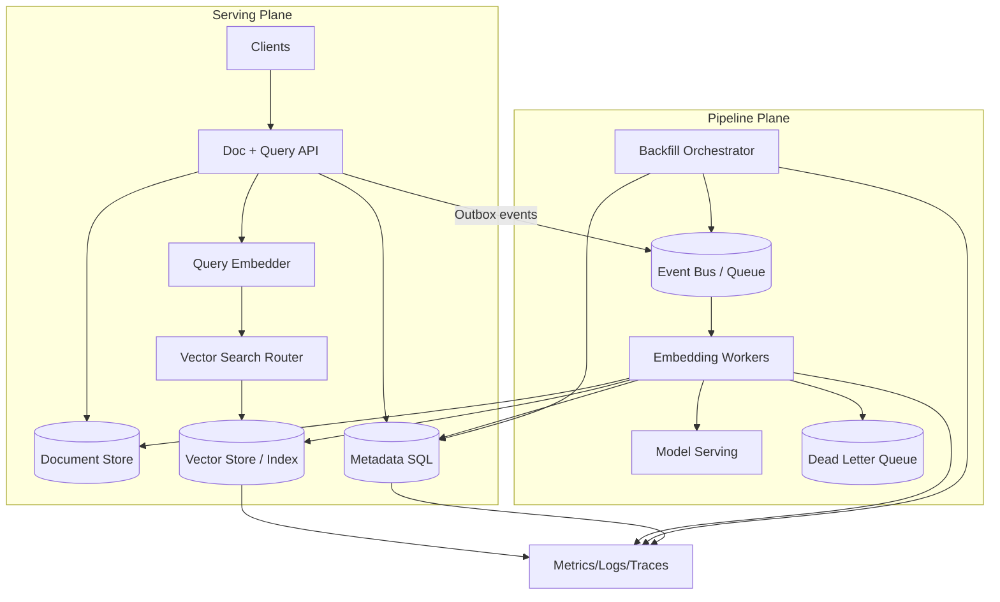
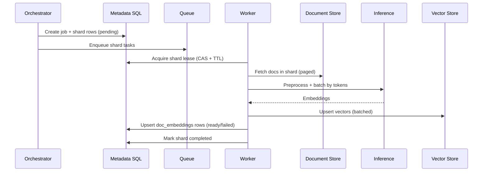
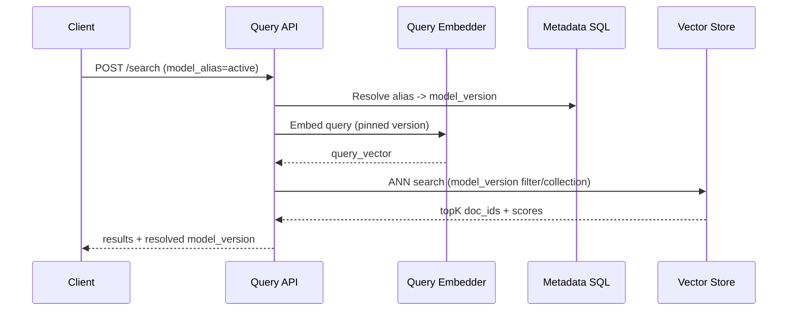

## Overview

Modern search, recommendations, and RAG systems rely on **vector embeddings** that are *derived data* from documents plus a specific embedding stack (model + tokenizer + preprocessing). In production, embeddings are not static: models are upgraded, tokenizers change, normalization evolves, and the underlying document distribution drifts. For millions to hundreds of millions of documents, re-embedding must be **safe, observable, cost-controlled, and compatible with continuous serving traffic**.

This design treats embeddings as **versioned, recomputable artifacts** with an explicit lifecycle:

1. **Immutable versions**: a `model_version` fully pins model artifact, tokenizer, preprocessing, output dims, and normalization.
2. **Idempotent work units**: backfills are partitioned into shards with durable leases and retries.
3. **Dual-read/dual-write via aliases**: `active` and `shadow` aliases enable safe rollouts, shadow evaluation, and fast rollback.
4. **Quality + drift gates**: recomputation happens through controlled workflows rather than “re-embed everything” fire drills.

---

## Requirements

### Functional Requirements
- Document CRUD (create/update/delete) with embedding status tracking.
- Generate embeddings for a specified `model_version` over a large corpus (full backfill).
- Incrementally embed documents that changed since the last successful embed for a version.
- Serve queries against a selected alias (e.g., `active`) while other versions are built in parallel.
- Provide job progress, shard health, and error reporting.
- Detect drift (distribution shift and/or quality regression) and trigger controlled re-embedding.
- Safe rollout (shadowing) and rollback without downtime.
- End-to-end idempotency: retries must not duplicate or corrupt embeddings.

### Non-Functional Requirements (Targets)

#### Scale (Concrete)
| Dimension | Target | Notes |
|---|---:|---|
| Corpus size | 10–50M docs initially, design to 200M | Multi-tenant support |
| Avg normalized text | 1–5 KB (typical), up to 100 KB worst-case | Enforce max tokens |
| Tokens per doc | P50 300–800, P95 2,000, max 8,192 | Hard cap to avoid OOM |
| Embedding dims | 768–3,072 | Common: 768/1024/1536 |
| Storage format | float16 (preferred), float32 when needed | float16 halves storage |
| Steady-state updates | 200–2,000 docs/sec bursty | Tenant-aware throttling |
| Backfill throughput | 0.5–5M docs/hour depending on tokens | Expressed in tokens/sec below |

**Throughput should be planned in tokens/sec, not docs/sec.** A realistic GPU budget target:
- Example capacity: ~50k–300k tokens/sec per GPU (depends heavily on model, batching, and seq length).
- Example backfill goal: 2B tokens/day requires ~23k tokens/sec sustained; 20B tokens/day requires ~231k tokens/sec sustained.

#### Latency (Online Path)
- Online doc embedding (ingest → embedding persisted):
  - P50 < 400 ms, P99 < 2.0 s (includes preprocess + inference + vector upsert, under normal load)
- Vector upsert per batch:
  - P50 < 75 ms, P99 < 300 ms (store-dependent; measured from worker)
- Query path (excluding application rendering):
  - Query embed P50 < 150 ms, P99 < 800 ms (with small batching)
  - Vector search P50 < 50 ms, P99 < 200 ms (index + filters dependent)
- Control-plane APIs (job status, alias updates): P99 < 200 ms

#### Availability & Durability
- Vector search read availability: **99.99%**
- Pipeline (embedding freshness) availability: **99.9%** (brief delays acceptable; no lost work)
- Metadata/job state RPO: **~0** (transactional + PITR)
- Embeddings RPO: **<= 24h** preferred (recomputable, but avoid massive recompute due to loss)

#### Consistency Model
- **Strong consistency** for metadata, leases, job state (SQL).
- **Eventual consistency** for embeddings (async pipeline + vector store).
- **Read-your-writes** for doc updates using version pinning:
  - Document reads are strongly consistent in the doc store.
  - Embedding availability is exposed explicitly (`pending/ready/failed`) per alias/version.

### Constraints & Assumptions
- Team: 4–8 engineers with on-call rotation and standard SRE practices.
- GPU is the primary cost driver; must support throttling, scheduling, spot/preemptible usage.
- Documents may contain PII: encryption at rest/in transit, strict access controls, audit logs, tenant isolation.
- Vector DB may be managed or self-hosted; design supports both.
- Models are served behind a stable inference API; artifacts + configs are immutable once promoted.

---

## Architecture

### High-Level Diagram

### Key Ideas (Why This Works)
- **Serving plane is isolated** from pipeline load. Backfills should not take down query latency.
- **SQL metadata is the control-plane source of truth** for job planning, shard leases, idempotency, and alias routing.
- **Event bus + outbox pattern** prevents missed updates when APIs crash mid-write.
- **Alias routing** (`active`, `shadow`) enables safe evaluation and rollback without rewriting embeddings in place.

---

## Components

### 1) Document + Query API
**Responsibilities**
- Document CRUD and metadata updates.
- Expose embedding status per alias/version.
- Query endpoint: embeds query text and executes vector search (with filters).

**Design Decisions**
- **Transactional write + outbox**:
  - Write doc + metadata and append an outbox event in the same SQL transaction.
  - A publisher relays outbox events to the queue, ensuring “no lost doc_changed”.
- **Version-aware status**:
  - Responses include `embedding_status` per alias (`active`, optionally `shadow`) to make eventual consistency explicit.

**Implementation Notes**
- Stateless service (Go/Java/Kotlin), REST externally; gRPC internally is optional.
- Use request idempotency:
  - `PUT /docs/{doc_id}` is naturally idempotent; dedupe by `content_hash`.

---

### 2) Metadata Store (SQL)
**Responsibilities**
- Source of truth for:
  - model versions + aliases
  - job runs + shard planning
  - per-document embedding state and idempotency
  - leases for shard processing

**Why SQL**
- Strong consistency, uniqueness constraints, leases, and progress queries are easier and safer than trying to reconstruct state from logs/queues.

**Scaling Notes**
- PostgreSQL is sufficient for many deployments; for very large multi-region control planes, consider Spanner/Cockroach.
- Use partitioning (by `model_version` and/or time) for the largest tables.

---

### 3) Backfill Orchestrator
**Responsibilities**
- Create jobs and shard plans.
- Enqueue shard tasks (rate-limited by budget).
- Track completion and enforce promotion gates (`shadow` → `active`).
- Pause/resume/cancel jobs and requeue failed shards.

**Design Decisions**
- **Shard-based planning** (not one task per doc):
  - Reduces queue overhead and increases GPU batch efficiency.
- **Leases with TTL**:
  - Workers acquire a shard lease; if they die, lease expires and shard is retried.
- **Priority classes**:
  - Online updates and incremental jobs preempt bulk backfills to protect freshness.

**Technology Options**
- Temporal (durable orchestration) or Kubernetes controller + Jobs + SQL leases.
- Queue: Kafka/SQS/PubSub (must support retries + DLQ).

---

### 4) Embedding Workers
**Responsibilities**
- Fetch documents for a shard or a doc event.
- Normalize + preprocess text.
- Batch by token count.
- Call model serving for embeddings.
- Upsert vectors and update SQL state.

**Key Safety Properties**
- **Idempotent writes**:
  - A doc is “ready” for `(doc_id, model_version, content_hash)`; if it’s already ready, skip.
- **Token caps and sanitization**:
  - Hard cap input length; record truncation and error reasons in metadata.
- **Per-doc fault isolation**:
  - Poison docs go to DLQ; shard continues.

**Implementation Notes**
- Python worker is common; use Triton client or HTTP/gRPC inference API.
- Separate worker pools:
  - `online` (low latency, smaller batches)
  - `bulk` (high throughput, large batches, spot/preemptible)

---

### 5) Model Serving
**Responsibilities**
- Serve a pinned `model_version` embedding endpoint.
- Provide dynamic batching, mixed precision, and stable output shapes.

**Requirements**
- Must be able to verify at startup:
  - dims match expected
  - tokenizer/preprocess versions match pinned config
  - deterministic normalization settings (e.g., L2 normalize yes/no)

**Options**
- Triton Inference Server, TorchServe, custom FastAPI/gRPC, or managed inference.

---

### 6) Vector Store + Search Router
**Responsibilities**
- Store embeddings and support ANN search with metadata filters (tenant, visibility, language, doc_type).
- Keep `active` alias routing stable, enabling fast cutover.

**Storage Layout**
- Prefer **separate index/collection per model_version** (simplifies cutover and index tuning).
- If using a single collection, ensure the store supports efficient filtering on `model_version` without recall collapse.

**Index Lifecycle**
- Bulk ingest → build/optimize index → warm caches → start shadow reads → promote alias.

---

## Data Model

### SQL Schema (Metadata)

**`documents`**
- `doc_id (PK)`
- `tenant_id`
- `source_uri` (optional)
- `content_hash` (hash of normalized content + preprocess_version)
- `updated_at`
- `deleted_at (nullable)`

**`model_versions`**
- `model_version (PK)` (e.g., `v2025_01_15`)
- `model_name`
- `tokenizer_version`
- `preprocess_version`
- `dims`
- `normalize` (boolean)
- `created_at`
- `status` (`staged|shadow|active|retired`)

**`model_aliases`**
- `alias (PK)` (e.g., `active`, `shadow`)
- `model_version`
- `updated_at`

**`doc_embeddings`**
- `doc_id`
- `model_version`
- `content_hash` (the embedded hash)
- `embedding_ref` (vector id / pointer)
- `status` (`pending|ready|failed`)
- `last_error` (nullable)
- `attempts`
- `updated_at`
- **PK**: (`doc_id`, `model_version`)

**`backfill_jobs`**
- `job_id (PK)`
- `model_version`
- `scope` (`full|incremental|drift_triggered`)
- `state` (`running|paused|completed|failed|canceled`)
- `rate_limit_tokens_per_sec` (preferred) and/or `rate_limit_docs_per_sec`
- `created_at`, `updated_at`

**`backfill_shards`**
- `job_id`
- `shard_id` (e.g., `hash_mod_4096=17`)
- `state` (`pending|running|completed|failed`)
- `lease_owner` (nullable)
- `lease_expires_at` (nullable)
- `attempts`
- `last_error` (nullable)
- **PK**: (`job_id`, `shard_id`)

**`outbox_events`** (for doc changes)
- `event_id (PK)`
- `event_type` (`doc_changed|doc_deleted|alias_updated`)
- `payload_json`
- `created_at`
- `published_at (nullable)`

### Vector Store Record
- `id`: `{tenant_id}:{doc_id}` (or `{doc_id}` if tenant is in namespace)
- `vector`: float16/float32 array
- `metadata`: `{tenant_id, model_version, updated_at, language, visibility, doc_type}`

---

## Data Flow

### Full Backfill (Shard-Based)

### Incremental Update (Doc Changed)

```mermaid
sequenceDiagram
  participant C as Client
  participant API as Doc API
  participant S as Metadata SQL
  participant DS as Document Store
  participant OB as Outbox
  participant Q as Queue
  participant W as Worker

  C->>API: PUT doc
  API->>S: Txn: update documents + outbox event
  API->>DS: Store content (idempotent)
  API-->>C: 200 (embedding pending)
  OB->>Q: Publish doc_changed
  W->>S: Load doc + resolve aliases (active/shadow)
  W->>DS: Fetch content
  W->>S: Skip if content_hash already ready
  W->>W: Embed + upsert + update status
```

### Query Path (Alias-Aware)

---

## API Design

### Control Plane

**Create model version**
- `POST /v1/models/versions`
- Request:
  - `{"model_name":"e5-large","model_version":"v2025_01_15","dims":1024,"tokenizer_version":"t3","preprocess_version":"p7","normalize":true}`
- Response: `201 {"model_version":"v2025_01_15","status":"staged"}`

**Start backfill**
- `POST /v1/backfills`
- Request:
  - `{"model_version":"v2025_01_15","scope":"full","rate_limit_tokens_per_sec":200000}`
- Response: `202 {"job_id":"bf_...","state":"running"}`
- Idempotency: `Idempotency-Key` header

**Get backfill status**
- `GET /v1/backfills/{job_id}`
- Response:
  - `{"state":"running","shards_total":4096,"shards_done":1024,"docs_done":12000000,"error_rate":0.002,"eta_seconds":14400}`

**Update alias (cutover)**
- `PUT /v1/models/aliases/{alias}`
- Request: `{"model_version":"v2025_01_15","force":false}`
- Response: `200 {"alias":"active","model_version":"v2025_01_15"}`
- Safety gates (recommended defaults):
  - `shadow_ready_ratio >= 0.999`
  - `shadow_quality_checks == pass`
  - `shadow_index_state == warmed`

---

### Data Plane

**Upsert document**
- `PUT /v1/tenants/{tenant_id}/docs/{doc_id}`
- Request: `{"content":"...","metadata":{"language":"en","visibility":"public"}}`
- Response:
  - `200 {"doc_id":"...","content_hash":"...","embedding_status":{"active":"pending","shadow":"pending"}}`

**Get embedding status**
- `GET /v1/tenants/{tenant_id}/docs/{doc_id}/embeddings`
- Response:
  - `200 {"doc_id":"...","versions":[{"alias":"active","model_version":"v2025_01_15","status":"ready"},{"alias":"shadow","model_version":"v2025_02_01","status":"pending"}]}`

**Vector search**
- `POST /v1/tenants/{tenant_id}/search`
- Request:
  - `{"query":"how to reset password","top_k":20,"model_alias":"active","filters":{"visibility":"public","language":"en"}}`
- Response:
  - `200 {"model_version":"v2025_01_15","results":[{"doc_id":"...","score":0.83}]}`
- Common errors:
  - `400` invalid filters / top_k
  - `429` rate limited
  - `503` vector store unavailable

---

## Scaling & Performance

### Bottlenecks and Mitigations
- **Inference throughput (GPU)**:
  - Token-based batching, mixed precision, dynamic batching, and separate online/bulk pools.
  - Measure and plan capacity in tokens/sec; enforce max tokens.
- **Document fetch bandwidth**:
  - Fetch in pages; compress storage; co-locate workers with doc store; cache normalized text if preprocessing is expensive.
- **Vector store ingestion/indexing**:
  - Use bulk ingestion mode when available.
  - Separate ingestion and serve-optimized phases; build/warm index before promotion.
- **Metadata hot spots**:
  - Avoid synchronous per-doc status reads on the API hot path.
  - Use partial indexes for `status IN ('pending','failed')`.
  - Partition `doc_embeddings` by `model_version` if necessary.

### Horizontal Scaling Strategy
- API: stateless; autoscale on latency/QPS.
- Orchestrator: stateless with leader election; store state in SQL.
- Workers: autoscale on queue lag + GPU utilization; use priority queues.
- Vector DB: shard/partition by tenant or hashed key; replicate for read QPS.

### Caching (Optional, Carefully)
- Metadata cache (Redis): `doc_id -> status per alias` TTL 1–5 min; invalidate on updates.
- Query embedding cache: cache normalized query → vector for short TTL (5–30 min); include `model_version` in key.
- Search result cache: only for non-personalized, filter-stable queries; TTL seconds-to-minutes; include alias+filters+tenant in key.

---

## Quality, Drift Detection, and Rollout Gates

### Drift Signals (Examples)
- **Input drift**: token length distribution, language mix, doc_type mix.
- **Embedding drift**: embedding norm distribution, cosine similarity to previous version on matched docs, PCA/cluster movement.
- **Downstream quality**:
  - Offline: NDCG@k / MRR on labeled set, retrieval recall for golden queries.
  - Online: CTR/engagement, success rate, complaint rate (guarded and tenant-aware).

### Rollout Gates
Before promoting `shadow` → `active`:
- Completion: `>= 99.9%` docs ready for target tenant(s)/scope.
- Stability: inference error rate within SLO; vector store search latency stable.
- Quality: offline eval above threshold; online shadow sampling shows no regression.
- Operational: index warmed; rollback plan tested (alias flip).

---

## Trade-offs & Alternatives

### Trade-offs (Explicit)
1. **Alias-based version routing**
   - Pros: safe cutover/rollback, supports shadow reads, isolates index tuning per version.
   - Cons: additional storage and operational complexity (multiple versions).
   - Rationale: derived data safety > storage cost.

2. **At-least-once processing + idempotent writes**
   - Pros: robust to retries and partial failures; simpler than exactly-once across heterogeneous systems.
   - Cons: occasional duplicate compute under retries.
   - Rationale: correctness is enforced at write boundaries; compute is cheaper than data corruption.

3. **Shard-based tasks instead of per-doc tasks**
   - Pros: lower queue overhead, better batching, higher throughput.
   - Cons: less granular retries; must isolate poison docs within a shard.
   - Rationale: practical necessity for millions+ scale and GPU efficiency.

4. **Separate online and bulk worker pools**
   - Pros: protects freshness and user latency.
   - Cons: more infra to manage.
   - Rationale: prevents backfills from starving online updates.

### Alternatives (When to Choose Them)
- **In-place overwrite (single embedding store)**:
  - Simpler storage, but risky cutovers and hard rollback; only acceptable if quality risk is low and rollbacks are rare.
- **Batch-only (Spark/Ray) recompute**
  - Strong for scheduled backfills; weaker for near-real-time freshness unless paired with a streaming layer.
- **PostgreSQL + pgvector**
  - Great for smaller deployments and simpler ops; may struggle at high QPS/high recall with heavy filtering unless carefully tuned and sharded.

---

## Failure Modes & Mitigations

### Common Failure Scenarios (At Least 3)
1. **Model serving degraded (latency/errors)**
   - Impact: online freshness and backfill throughput drop.
   - Detection: inference P99, error rate, queue lag, GPU OOM.
   - Mitigation: circuit breaker, exponential backoff, autoscale, shed bulk load first, pause backfills, keep `active` pinned.

2. **Vector store throttling / write failures**
   - Impact: embeddings not persisted; shards stall; index build delays.
   - Detection: upsert latency, rejection rate, error codes, ingest backlog.
   - Mitigation: adaptive rate limiting, smaller batches, retry with jitter, bulk ingest mode, DLQ for persistent failures.

3. **Orchestrator crash / duplicate scheduling**
   - Impact: duplicate shard work.
   - Detection: lease contention, repeated shard attempts, elevated duplicate skips.
   - Mitigation: SQL-backed shard leases with TTL and CAS; idempotent doc-level writes.

4. **Queue outage or backlog**
   - Impact: incremental updates stall; backfills pause.
   - Detection: publish failures, consumer lag, DLQ growth.
   - Mitigation: multi-AZ queue, backpressure, outbox replay, manual drain tooling.

5. **Poison documents / preprocessing bugs**
   - Impact: repeated failures; shard stuck if not isolated.
   - Detection: high per-doc retries; same doc_id failing with same signature.
   - Mitigation: per-doc error isolation, DLQ with reason, token caps, quarantine workflow, fix-forward and replay.

6. **Silent config mismatch (wrong tokenizer/preprocess)**
   - Impact: quality regression that looks “healthy” operationally.
   - Detection: dims/normalization checks, embedding checksum/version tags, shadow quality gates.
   - Mitigation: immutable version configs, startup self-tests, require shadow acceptance before promotion.

### Disaster Recovery
- Targets:
  - Metadata SQL: RPO ~ 0, RTO < 1 hour
  - Vector store: RPO <= 24h, RTO < 4 hours (product-dependent)
- Backups:
  - SQL PITR + daily snapshots; cross-region replica
  - Vector snapshots/exports to object storage (e.g., parquet) when supported
- Failover:
  - Promote SQL replica
  - Redeploy API/orchestrator/workers in secondary region
  - Route vector search to secondary index (or temporarily pin to last known-good `active`)

---

## Operations

### Observability (Dashboards)
- Pipeline: docs/sec and tokens/sec, queue lag, shard completion rate, retries, DLQ volume, cost per 1M tokens.
- Inference: GPU utilization, batch sizes, tokens/sec, latency percentiles, OOM counts.
- Vector store: upsert latency/errors, query latency, index build time, recall proxy metrics, resource saturation.
- Quality: offline eval trends, shadow-vs-active deltas, drift metrics.

### Alerting (Examples)
- Online queue lag > 15 minutes (sustained 5–10 min)
- Inference error rate > 1% (5 min) or P99 > SLO (10 min)
- Vector upsert rejection > 0.5% (10 min)
- DLQ growth rate above baseline
- Shadow quality regression beyond threshold (block promotion)

### Deployment and Change Management
- Progressive delivery:
  - Stage model → backfill to `shadow` → warm index → shadow query sampling → acceptance → promote alias
- Rollback:
  - Flip `active` alias back to previous version (fast, low-risk)
- Safety:
  - Feature-flag preprocess changes
  - Pin worker image + model version
  - Validate dims/tokenizer/normalization at startup

### Cost Controls
- Token-based budgeting and per-tenant quotas.
- Preemptible/spot GPUs for bulk backfills; keep online pool on stable capacity.
- Pause/resume backfills automatically during peak traffic or elevated error rates.
- Consider float16 embeddings and metadata-only deletes (tombstones) with periodic compaction.

---

## References & Further Reading
- Milvus architecture and indexing: https://milvus.io/docs
- Pinecone upserts and namespaces: https://docs.pinecone.io
- Temporal workflows (durable orchestration): https://temporal.io
- Triton Inference Server (dynamic batching): https://github.com/triton-inference-server/server
- ANN concepts (HNSW/IVF): https://arxiv.org/abs/1603.09320
- Netflix Tech Blog (derived data and reliability patterns): https://netflixtechblog.com