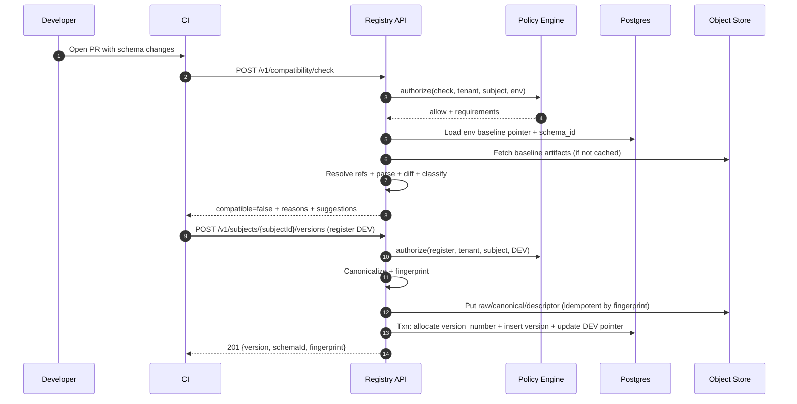
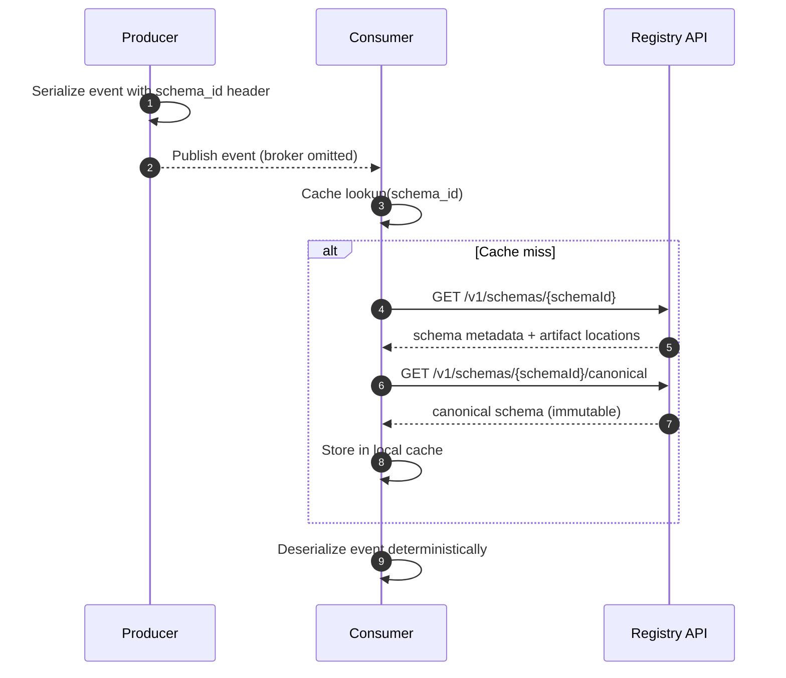

## Overview

An event schema registry is the control plane for event contracts in an event-driven organization. Its core job is not merely “storing schemas”, but preventing unsafe schema evolution across hundreds (or thousands) of independently deployed producers and consumers—without centralizing all decision-making.

The registry provides:
- A **system of record** for schemas (Avro/Protobuf), references, versions, and lifecycle states.
- **Deterministic compatibility checks** and linting integrated into CI/CD.
- **Policy-as-code governance** (ownership, approvals, environment promotion, separation of duties).
- **Runtime discovery** for serializers/deserializers (ideally by immutable identifiers, not “latest”).

The key production insight: **most safety must be enforced pre-deploy** (CI gates + approvals). Runtime lookups should be rare, cacheable, and resilient.

---

## Goals, Non-goals, and Glossary

### Goals
- Prevent breaking changes from reaching production topics/streams.
- Enable teams to evolve schemas safely with clear feedback and auditability.
- Provide deterministic resolution of imports/references so CI results match production.
- Support multi-environment promotion (DEV → STAGE → PROD) with governance.

### Non-goals
- Providing the event broker itself (Kafka/PubSub is assumed).
- Enforcing business semantics correctness (only structural/contract compatibility).
- Rewriting existing producer/consumer code (we provide SDKs and patterns).

### Glossary
- **Subject**: A named schema stream/contract, e.g., `payments.TransactionCreated`.
- **Version**: Monotonic per subject (1, 2, 3…), immutable.
- **Schema ID**: A stable identifier for a specific schema artifact (global or per-tenant).
- **Fingerprint**: Content hash of a canonicalized schema (e.g., `sha256:<hex>`).
- **Compatibility mode**: Backward/Forward/Full/None (rules differ for Avro vs Protobuf).
- **Promotion**: Moving a version to a higher environment with required approvals.

---

## Requirements

### Functional Requirements
- Register and version schemas per subject:
  - Avro `.avsc` (JSON) and Protobuf `.proto` (via descriptor sets or source bundles).
- Deterministically resolve schema references/imports:
  - Avro references pinned by fingerprint/version.
  - Protobuf imports resolved from pinned dependency descriptors.
- Enforce configurable compatibility rules at registration and promotion time:
  - Backward/Forward/Full/None, per subject and per environment.
- Integrate with CI/CD:
  - PR checks (lint + compatibility) and merge/release gates (register + promote).
- Support multi-environment lifecycle:
  - `DRAFT` (DEV), `STAGED` (STAGE), `PROD`, `DEPRECATED` (and optional `RETIRED`).
- Provide discovery APIs:
  - Fetch by subject+version, subject+env latest, schema ID, and fingerprint.
- Provide diff and explanation:
  - Human-readable change classification, breaking reasons, and suggestions.
- Governance and audit:
  - Ownership, approvals, separation of duties for PROD, immutable audit logs exportable to SIEM.
- Tooling:
  - UI/CLI for browsing, diffing, searching, approvals, and policy inspection.

### Non-Functional Requirements (Targets)
#### Scale (initial targets, with headroom)
- Tenants (orgs/business units): up to **200**
- Teams: up to **5,000**
- Subjects: **50,000**
- Total schema versions: **1,000,000**
- Peak request rates:
  - Reads: **2,000 RPS** (schema fetch by ID/fingerprint/latest)
  - Writes: **50 RPS** (register/promote/approval actions)
  - CI checks: **200 RPS** bursty during business hours

#### Latency (single-region, warm cache)
- `GET` (by ID/fingerprint): **P50 5–15ms**, **P99 50ms**
- `GET latest` (subject+env): **P50 5–20ms**, **P99 75ms** (cache-sensitive)
- Compatibility check (includes parsing + resolution + diff):
  - **P50 75ms**, **P99 500ms** for typical schemas
  - Enforce size/complexity limits and provide async option for heavy graphs

#### Availability
- Reads: **99.99%**
- Writes: **99.9%** (CI can retry; governance actions can tolerate brief unavailability)

#### Consistency
- Strong consistency for:
  - Register new version, promote, approvals, policy updates, “latest in env” pointers
- Eventual consistency acceptable for:
  - Search index, UI activity feeds, analytics

#### Durability & DR
- Metadata RPO: **≤ 5 minutes**
- RTO: **≤ 30 minutes** (regional failover)
- Schema artifacts: **11 9s** durability via object storage (S3/GCS/Azure Blob)

### Constraints & Assumptions
- Multi-tenant isolation by `tenant_id` and namespace; no cross-tenant reads.
- Regulated environments require:
  - Immutable audit logs (WORM retention)
  - Separation of duties for PROD promotion (creator ≠ approver)
- CI has network access to the registry with service-to-service auth.
- Small platform team (3–6 engineers) operating managed Postgres, object storage, and Kubernetes.

---

## Capacity & Sizing (Concrete Estimates)

Assume:
- Average raw schema size: **5–20 KB**
- Canonical form: similar
- Protobuf descriptor sets: **10–200 KB** depending on dependency graph
- Average versions per subject: **20** (1,000,000 / 50,000)

Storage rough order-of-magnitude:
- Avro raw + canonical: ~20 KB/version → ~20 GB for 1M versions
- Protobuf descriptors and bundles can dominate; budget **50–200 GB** total artifacts with growth.
- Metadata in Postgres:
  - 1M versions + indexes + audit/outbox: typically **tens of GB** (plan for **100+ GB** with retention and indexes)

Compute:
- Compatibility checks are CPU-bound; isolate via worker pool and caching/memoization.

---

## High-Level Architecture

```mermaid
flowchart TB
  %% Clients
  Dev[Developer] -->|PR / code review| Git[Git Provider]
  Git --> CI[CI Pipeline]
  Dev --> UI[UI / CLI]

  %% Core APIs
  CI -->|mTLS/OIDC| API[Registry API]
  UI -->|OIDC| API

  %% Control plane internals
  API --> OPA[Policy Engine (OPA/Cedar)]
  API --> PG[(Postgres: metadata)]
  API --> REDIS[(Redis: hot cache)]
  API --> OBJ[(Object Storage: artifacts)]

  %% Async + audit
  API --> OUTBOX[(Outbox table)]
  OUTBOX --> AUDITBUS[Audit Stream (Kafka/PubSub)]
  AUDITBUS --> SIEM[SIEM / WORM Archive]

  %% Heavy compute + indexing
  API --> Q[Work Queue]
  Q --> WORKERS[Compatibility Workers]
  WORKERS --> PG
  WORKERS --> OBJ

  API --> IDX[Search Index (OpenSearch/ES) (optional)]
  IDX --> UI
```

### Key architectural choices
- **Control plane focus**: pre-deploy enforcement (CI + promotion gates) is primary safety mechanism.
- **Immutable artifacts** in object storage, **strong metadata transactions** in Postgres.
- **Write serialization per subject** ensures monotonic version numbers and avoids races.
- **Outbox pattern** guarantees audit events are durable and emitted exactly-once effectively (idempotent consumers).

---

## Core Workflows

### 1) CI Compatibility Check (Pre-merge)
1. CI submits candidate schema + pinned references.
2. Registry resolves the schema bundle deterministically.
3. Registry computes diff vs the target environment’s latest (or specified baseline).
4. Policy engine determines whether results are blocking vs warning, and whether action is permitted.
5. CI receives a structured report.

### 2) Register New Version (Post-merge)
1. CI registers the schema to DEV (or directly to STAGE depending on org).
2. Registry canonicalizes, fingerprints, stores artifacts, allocates a new version number transactionally.
3. Registry emits an audit event.

### 3) Promotion (DEV → STAGE → PROD)
1. Request promotion; policy determines required approvals and separation-of-duties.
2. Approvers approve/reject; once satisfied, registry atomically updates environment pointers/status.
3. Audit events are emitted for each transition.

### 4) Runtime Resolution (Recommended Pattern)
Prefer **schema ID in message headers** (or payload envelope) to avoid “GET latest” at runtime:
- Producer encodes `schema_id` (or fingerprint) with the event.
- Consumer fetches schema by ID once, caches locally, and decodes deterministically.

---

## Component Deep-Dive

### Registry API Service
**Responsibilities**
- Authentication/authorization, policy evaluation, schema CRUD, promotion, approvals.
- Provides a stable retrieval interface for runtime/tooling.

**Key design decisions**
- Canonicalize and fingerprint on ingest:
  - Avro: parse + canonical form (per Avro spec) → `sha256`.
  - Protobuf: build deterministic `FileDescriptorSet` and normalize ordering → `sha256`.
- Allocate version numbers in a single DB transaction per subject to guarantee monotonicity.
- Prefer retrieval by immutable identifiers (schema ID or fingerprint) for runtime stability.

**Implementation notes**
- Stateless service (Go or Java/Kotlin) behind an L7 load balancer.
- Request timeouts and budgets; circuit breakers for object store.
- Pagination for list endpoints; ETags for immutable artifacts.

---

### Compatibility & Lint Engine
**Responsibilities**
- Parse schemas, resolve references, compute compatibility classification, produce diffs/reasons.
- Run lint rules (naming, reserved fields usage, docstrings, default values, etc.).

**Deterministic resolution**
- Every compatibility check runs against a **resolved bundle**:
  - Candidate schema + explicit dependency versions/fingerprints.
  - No “floating” dependencies; CI must pin or registry pins at registration time.
- Store resolved bundle metadata so checks are reproducible.

**Caching/memoization**
- Cache parsed AST/descriptor sets keyed by fingerprint.
- Memoize compatibility results keyed by `(tenant, subject, old_fp, new_fp, compat_mode, ruleset_version)`.

**Bounded complexity**
- Enforce limits:
  - Max schema size (e.g., 1–2 MB raw)
  - Max dependency graph size / descriptor count
  - Max check CPU time (e.g., 2s) with clear error messaging and an async option

---

### Policy Engine (Governance)
**Responsibilities**
- Decide if an action is allowed and what approvals are required based on:
  - Tenant, namespace ownership, actor identity/role
  - Environment (DEV/STAGE/PROD)
  - Compatibility classification (non-breaking vs breaking vs unknown)
  - Change risk signals (e.g., removing fields, changing types, renaming packages)

**Policy-as-code**
- OPA/Rego or Cedar policies versioned and tested like code.
- Policies can implement:
  - Separation of duties (approver must be different principal)
  - Minimum approvals (e.g., 2 approvals from different groups)
  - Break-glass override with mandatory ticket reference and enhanced audit

---

### Storage Layer (Metadata + Artifacts)
**Metadata (Postgres)**
- Strong consistency and constraints for:
  - Subjects, versions, environment pointers, approvals, policies, audit/outbox
- Common patterns:
  - Partial indexes for “latest in env”
  - Tenant partitioning when needed (table partitioning by `tenant_id`)

**Artifacts (Object storage)**
- Immutable storage for:
  - Raw schema, canonical schema, descriptor sets, dependency bundles
- Optional: serve immutable artifacts via signed URLs and/or CDN for large descriptors.

**Cache (Redis)**
- Hot keys:
  - `(tenant, subject, environment) -> version_id, schema_id, fingerprint`
  - `(tenant, schema_id) -> artifact locations`
- TTL + explicit invalidation on promote/register.

---

### Audit & Workflow
**Audit**
- Append-only audit events for every state transition:
  - register, check, approve, promote, deprecate, policy change
- Tamper-evidence:
  - Hash chaining per tenant/day (store `prev_event_hash`, `event_hash`)
- Retention:
  - Stream to SIEM and/or WORM bucket for compliance.

**Outbox**
- Registry writes audit events to Postgres in the same transaction as state change.
- Background publisher reads outbox, publishes to audit stream with idempotent keys.

---

## Data Model

### Lifecycle States & Environment Pointers
Use two concepts:
1. **Immutable versions** (`schema_versions` rows).
2. **Environment pointers** (“what is latest PROD/STAGE/DEV for this subject”) updated atomically.

This avoids rewriting version history while still providing fast `GET latest`.

### Postgres Tables (Core)
- `tenants(tenant_id pk, name, created_at)`
- `namespaces(namespace_id pk, tenant_id fk, name, owner_group, created_at)`
- `subjects(subject_id pk, tenant_id fk, namespace_id fk, name, schema_type, default_compat_mode, created_at)`
  - Unique `(tenant_id, namespace_id, name)`
- `schema_artifacts(schema_id pk, tenant_id fk, schema_type, fingerprint, raw_uri, canonical_uri, descriptor_uri null, created_at)`
  - Unique `(tenant_id, fingerprint, schema_type)`
- `schema_versions(version_id pk, tenant_id fk, subject_id fk, version_number int, schema_id fk, created_by, created_at, message)`
  - Unique `(subject_id, version_number)`
  - Optional unique `(subject_id, schema_id)` if you want per-subject dedupe semantics
- `schema_references(version_id fk, ref_subject_id fk, ref_version_number int, ref_schema_id fk, ref_fingerprint)`
- `subject_env_pointers(subject_id fk, environment, version_id fk, updated_at, updated_by)`
  - Unique `(subject_id, environment)`
- `rulesets(ruleset_id pk, tenant_id fk, name, engine, bundle_uri, version, created_at)`
- `subject_ruleset_bindings(subject_id fk, ruleset_id fk, environment)`
- `approvals(approval_id pk, tenant_id fk, subject_id fk, version_id fk, to_environment, state, requested_by, approved_by, reason, created_at, decided_at)`
- `audit_outbox(event_id pk, tenant_id, actor, action, resource_type, resource_id, payload_json, created_at, prev_event_hash, event_hash, published_at null)`

### Object Storage Layout (Artifacts)
- `schemas/{tenant}/{schemaType}/{fingerprint}/raw`
- `schemas/{tenant}/{schemaType}/{fingerprint}/canonical`
- `schemas/{tenant}/{schemaType}/{fingerprint}/descriptor.pb` (Protobuf)
- `bundles/{tenant}/{subject}/{version}/resolved-bundle.tar.gz` (optional, for reproducibility)
- `policies/{tenant}/{ruleset}/{version}.tar.gz`

---

## Data Flow Diagrams

### CI Compatibility Check + Register



### Runtime Fetch by Schema ID (Preferred)



---

## API Design

### AuthN/AuthZ
- Humans (UI/CLI): OIDC login → short-lived JWT
- CI/workloads: mTLS + workload identity (or OIDC client credentials)
- Authorization:
  - RBAC roles: `reader`, `publisher`, `approver`, `admin`
  - Ownership model: namespace/subject ownership groups
  - Policies can enforce environment-specific requirements

### Common API Conventions
- Idempotency:
  - `Idempotency-Key` header for write operations
  - Server stores `(tenant, key, endpoint) -> response` for 24h (configurable)
- Concurrency control:
  - For mutable pointers/promotions, support `If-Match` with ETag on pointer resources
- Errors:
  - Standard envelope:
    ```json
    {
      "error": {
        "code": "POLICY_DENIED",
        "message": "Promotion to PROD requires 2 approvals.",
        "details": { "requiredApprovals": 2 }
      }
    }
    ```
- Rate limits:
  - Per-tenant token buckets (separate pools for reads vs writes vs compatibility)
  - `429` with `Retry-After`

---

### Compatibility Check (CI pre-merge)
`POST /v1/compatibility/check`

Request:
```json
{
  "tenant": "acme",
  "subject": "payments.TransactionCreated",
  "schemaType": "PROTOBUF",
  "baseline": { "environment": "PROD" },
  "schema": {
    "contentType": "text/plain",
    "content": "syntax = \"proto3\"; package payments; message TransactionCreated { ... }"
  },
  "references": [
    { "subject": "common.Money", "version": 12 }
  ]
}
```

Response:
```json
{
  "compatible": false,
  "classification": "BREAKING",
  "baseline": { "environment": "PROD", "version": 36, "fingerprint": "sha256:..." },
  "reasons": [
    { "code": "FIELD_REMOVED", "path": "TransactionCreated.amount" }
  ],
  "suggestions": [
    "For Protobuf, reserve removed field numbers/names instead of deleting."
  ]
}
```

Notes:
- If subject does not exist, return `200` with `"classification":"NEW_SUBJECT"` and policy-based guidance, or `404` if tenant policy forbids creating new subjects.

---

### Register New Version (CI on merge)
`POST /v1/subjects/{subjectId}/versions`

Request:
```json
{
  "environment": "DEV",
  "message": "Add optional promoCode",
  "schema": {
    "contentType": "application/octet-stream",
    "contentBase64": "Li4u"
  },
  "references": [
    { "subjectId": "subj_common_money", "version": 12 }
  ]
}
```

Response (`201 Created`):
```json
{
  "subjectId": "subj_payments_tx_created",
  "version": 37,
  "schemaId": "sch_01J...ZP",
  "fingerprint": "sha256:...",
  "environmentPointers": { "DEV": 37 }
}
```

Idempotency behavior:
- If the same fingerprint is re-registered for the subject, return the existing version (or the newly allocated one if policy allows repeated materialization).

---

### Promote Version
`POST /v1/subjects/{subjectId}/versions/{version}/promote`

Request:
```json
{
  "toEnvironment": "PROD",
  "reason": "Release 2025.12.17",
  "ticket": "JIRA-12345"
}
```

Response (`200 OK`):
```json
{
  "subjectId": "subj_payments_tx_created",
  "version": 37,
  "toEnvironment": "PROD",
  "state": "PENDING_APPROVALS",
  "requiredApprovals": 2,
  "approvalIds": ["apr_01J...AA", "apr_01J...BB"]
}
```

---

### Fetch Schemas (Runtime/Tooling)
- Immutable schema metadata:
  - `GET /v1/schemas/{schemaId}`
- Immutable artifacts:
  - `GET /v1/schemas/{schemaId}/canonical`
  - `GET /v1/schemas/{schemaId}/raw`
- Subject/version:
  - `GET /v1/subjects/{subjectId}/versions/{version}`
- Latest by environment (tooling; avoid in runtime hot path):
  - `GET /v1/subjects/{subjectId}/versions/latest?environment=PROD`
- By fingerprint (tooling and dedupe workflows):
  - `GET /v1/schemas/by-fingerprint/{sha256}`

---

### Approvals
- `POST /v1/approvals/{approvalId}:approve`
- `POST /v1/approvals/{approvalId}:reject`

Enforced by policy:
- Approver identity must differ from requester for PROD (separation of duties).
- Optional “two-person rule” with distinct groups.

---

## Consistency Model & Concurrency

### Writes (strong consistency)
- Registration and promotion run inside Postgres transactions.
- Per-subject serialization:
  - Lock `subjects` row or use an allocator table to avoid version races.
- Environment pointers update atomically with promotion:
  - Prevents “latest points to non-existent version” and ensures monotonicity.

### Reads (fast, cacheable)
- Immutable artifacts (by schema ID/fingerprint) are safe to cache aggressively:
  - CDN-friendly if served via signed URLs.
- “Latest” reads are cacheable but must tolerate brief staleness:
  - Use explicit invalidation on promotion + short TTL as fallback.

---

## Scaling & Performance

### Primary bottlenecks and mitigations
- Compatibility CPU (Protobuf graphs, large dependencies)
  - Worker pool + queue, caching descriptors, memoizing diffs
  - Limits + async checks for extreme cases
- Hot subjects (`GET latest` bursts)
  - Redis cache for env pointers; local in-memory LRU for schemas by ID
  - Prefer runtime by schema ID to reduce “latest” traffic
- DB contention for version allocation
  - Keep transactions short; lock only per-subject
  - Partition by tenant when necessary; read replicas for heavy reads

### Horizontal scaling plan
- API layer: stateless replicas, autoscale on CPU and latency
- Workers: separate deployment, autoscale on queue depth
- Postgres: managed HA primary + read replicas; partitioning; connection pooling
- Object storage: scales independently; protect with retries and circuit breakers

### Caching strategy
- Local in-process cache (fast) + Redis (shared)
- Keys:
  - `schemaId -> canonical artifact bytes` (or URI + ETag)
  - `(tenant, subjectId, env) -> versionId/schemaId/fingerprint`
- Invalidation:
  - Publish invalidation events on register/promote
  - TTL fallback (60–300s) to avoid indefinite staleness

---

## Trade-offs & Alternatives

### Key Trade-offs
1. **Central registry + governance** vs **Git-only schemas**
   - Trade-off: adds an operational system and runtime dependency surface
   - Why: enables standardized CI enforcement, approvals, auditability, and runtime discovery at scale

2. **Schema ID in event headers** vs **runtime “latest” lookups**
   - Trade-off: requires producer/consumer SDK changes and conventions
   - Why: improves correctness, reduces latency and registry load, and avoids “latest drift” during rollouts

3. **Postgres metadata + object storage artifacts** vs **single datastore**
   - Trade-off: two systems and consistency boundaries
   - Why: Postgres excels at transactions/constraints; object storage is cheap and durable for immutable blobs

4. **Policy-as-code (OPA/Cedar)** vs **hardcoded governance**
   - Trade-off: debugging and learning curve
   - Why: policies become reviewable, testable, versioned, and safer to evolve across org changes

### Alternatives
- **Confluent Schema Registry (managed)**
  - Strong baseline for Avro/Kafka patterns; may be insufficient for multi-environment promotion + custom approvals without extensions.
- **Apicurio Registry**
  - Solid open-source option; evaluate IAM, multi-tenancy, and workflow requirements.
- **Buf Schema Registry (Protobuf-first)**
  - Excellent for Protobuf ecosystems; less ideal if Avro parity and Kafka subject semantics are primary.

---

## Failure Modes & Mitigations

### 1) Registry API outage
- Impact: CI checks and promotions fail; runtime schema fetch by ID may fail on cache miss.
- Detection: SLO burn alerts, synthetic probes, elevated 5xx.
- Mitigation:
  - Multi-replica HA; load balancer health checks
  - Client retries with jitter and bounded timeouts
  - SDKs cache last-known-good schemas and support warm-up

### 2) Postgres primary failure / failover
- Impact: writes unavailable; reads may degrade or become stale.
- Detection: DB health checks, replication lag, connection saturation.
- Mitigation:
  - Managed Postgres with automatic failover and PITR
  - Graceful “read-only mode” for API when primary is unavailable
  - Connection pooling and query timeouts to prevent cascades

### 3) Policy misconfiguration blocks promotions
- Impact: deployment pipeline stuck, approval queues grow.
- Detection: spike in `403/412`, increased time-to-promote.
- Mitigation:
  - Policy unit tests + staged rollout (DEV→STAGE→PROD)
  - Policy version pinning and rapid rollback
  - Break-glass override requiring ticket + elevated audit logging

### 4) Cache inconsistency (stale “latest” pointers)
- Impact: tooling fetches older latest briefly.
- Detection: pointer/version mismatch metrics, cache hit anomalies.
- Mitigation:
  - Explicit invalidation on promotion, short TTL
  - Encourage runtime use of schema ID instead of latest
  - Support `no-cache`/strong read option for critical tooling paths

### 5) Object storage degradation/outage
- Impact: new registrations fail; schema fetch by ID may fail without cached artifacts.
- Detection: increased object store errors and latency.
- Mitigation:
  - Retries + circuit breakers; multi-region replication where required
  - Optionally store small canonical schemas inline in Postgres (size-bounded) for emergency reads
  - Pre-warm caches for critical subjects in consumers

---

## Disaster Recovery

- RPO: **≤ 5 minutes** (Postgres WAL archiving / continuous backups)
- RTO: **≤ 30 minutes** (regional failover with warm standby)
- Strategy:
  - Postgres PITR + periodic restore drills
  - Multi-region artifact replication (as required)
  - Audit logs shipped to SIEM + WORM archive independent of primary region
- Validation after failover:
  - Run synthetic `GET schema by ID`, `GET latest`, and a sample compatibility check
  - Verify outbox publisher resumes without gaps (idempotent publish)

---

## Operations

### SLOs (example)
- `GET /v1/schemas/{schemaId}` availability: **99.99%**
- Read latency: **P99 ≤ 75ms**
- Compatibility check latency: **P99 ≤ 500ms** (sync); async option for heavy checks
- Audit publication lag (outbox → stream): **P99 ≤ 60s**

### Monitoring & Alerting
- API: RPS, P50/P95/P99 latency, 4xx/5xx rates, auth failures, rate-limit events
- Compatibility: CPU/check, queue depth, timeout rate, cache hit rate, parse failures
- DB: replication lag, slow queries, lock waits, pool saturation, disk growth
- Object store: error rate, latency, throttling
- Governance: approvals backlog, time-to-approve, break-glass usage

### Deployment & Rollback
- Canary or blue/green for API and workers
- Feature flags for new compatibility engines/rules
- Rollback:
  - Code: standard deploy rollback
  - Policy: pin to previous ruleset version (immediate)
  - Schema: “roll back” by promoting a previous version (immutable history remains)

### Security & Compliance
- Encryption:
  - TLS everywhere; encryption at rest (Postgres + object storage)
- Secrets:
  - KMS-managed keys; short-lived credentials for CI and services
- Multi-tenancy:
  - Enforce `tenant_id` in every query; consider Postgres RLS for defense-in-depth
- Audit:
  - Immutable, append-only logs; WORM retention where required
- Supply chain:
  - Optionally sign schema artifacts and store provenance metadata (SLSA concepts)

---

## References & Further Reading
- Confluent Schema Registry: https://docs.confluent.io/platform/current/schema-registry/index.html
- Apicurio Registry: https://www.apicur.io/registry/
- Buf (Protobuf tooling/registry): https://buf.build/docs/
- Open Policy Agent (OPA): https://www.openpolicyagent.org/docs/latest/
- SLSA provenance: https://slsa.dev/
- Avro specification (schema resolution & parsing canonical form): https://avro.apache.org/docs/current/spec.html
- Protobuf language guide & descriptors: https://protobuf.dev/
