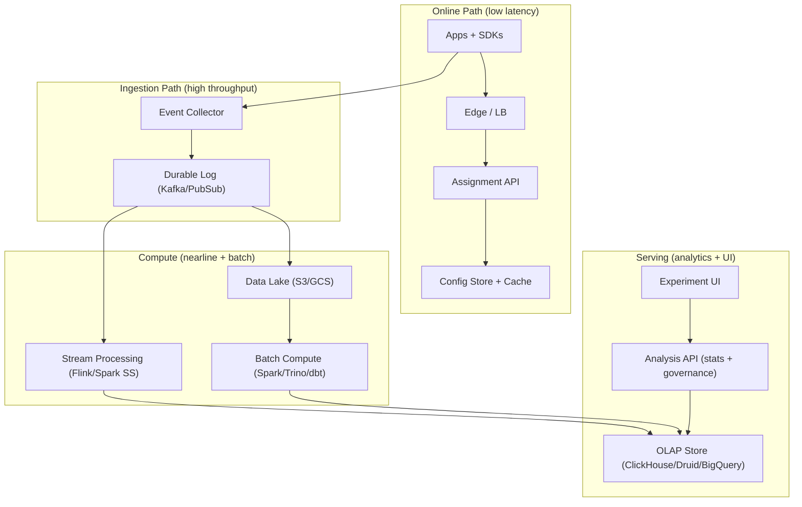
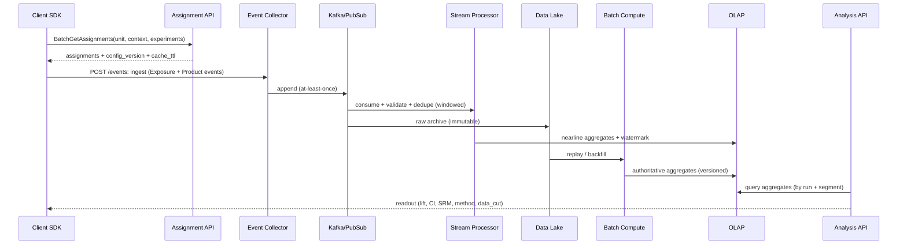

## Overview

An experimentation (A/B) platform is the control plane and data plane that lets product teams **safely change behavior**, **measure impact**, and **make statistically valid decisions** at scale. The core challenges are:

- **Assignment correctness**: unbiased randomization, sticky bucketing, the right unit of randomization, and mutual-exclusion across overlapping tests.
- **Measurement correctness**: trustworthy exposure logging, deduplication, late/out-of-order events, bot filtering, and identity consistency.
- **Statistical validity**: peeking/sequential looks, multiple comparisons, metric multiplicity, heterogeneous effects, and guardrails that prevent shipping regressions.

This design splits the system into an **online path** (low-latency assignment + exposure logging) and an **offline/nearline path** (ingestion, attribution, metric computation, and analysis). A key principle is to make **experiment attribution a first-class join key**: events become attributable to experiments/variants via a well-defined exposure model, enabling reproducible results, backfills, and shared metric definitions across teams.

## Requirements

### Functional Requirements
- Create, configure, and ramp experiments (targeting, traffic allocation, start/stop, holdouts).
- Deterministic randomized assignment for a chosen unit (`user_id`, `device_id`, `org_id`, `session_id`).
- Sticky bucketing across requests and over time (unless re-randomization is explicitly configured).
- Mutual exclusion and layering (avoid collisions when many experiments run concurrently).
- Exposure tracking and attribution of downstream events to variants.
- Metric definition management (north-star + guardrails), including derived metrics (rates, ratios) and windows (D1/D7 retention).
- Nearline readouts (e.g., every 5–15 minutes) plus final analyses with confidence intervals and decision support.
- Statistical safeguards: SRM detection, sequential-safe inference for peeking, multiple-testing controls.
- Auditability: immutable configuration history, reproducible results, explainable outputs, and provenance for every readout.

### Non-Functional Requirements

#### Scale (example target)
- **Assignment**: 100k QPS peak, 10M DAU, up to 10k concurrent experiments (most small and segmented).
- **Telemetry ingestion**: 0.5–2M events/sec peak (bursty), including exposures and product events.
- **Data volume**: 1–5 TB/day raw events; 30–180 days hot retention; 2+ years cold retention (compressed).

#### Latency
- **Assignment API**: P50 2–5 ms, P99 ≤ 20 ms (same region, warm cache); hard timeout at 50–100 ms with fallback.
- **Client enqueue (exposure/event)**: < 5 ms added latency; send async in batches.
- **Nearline readouts**: available within 15 minutes (P95) from event time (with explicit freshness watermark).
- **Backfills**: hours for full recompute on typical experiment windows (days–weeks).

#### Availability & Durability
- **Assignment/exposure**: 99.99% (must not block product flows).
- **Analytics/readouts**: 99.9% (degradation acceptable with stale reads).
- **Config & audit**: RPO ≈ 0 (PITR + synchronous replication for metadata).
- **Raw telemetry**: at-least-once ingestion; tolerate < 0.01% loss after retries; dedupe downstream.

#### Consistency Model
- **Assignment**: deterministic per `(experiment_id, unit_id, config_version)`; “effectively strong” within a config snapshot.
- **Metrics**: eventual consistency due to late events/backfills; all results are **versioned** by analysis run + data cut.
- **Governance**: immutable config history; “what was shown to whom, when” is reconstructable.

### Constraints & Assumptions
- Multi-tenant: many teams share the platform; RBAC, quotas, and tenant isolation required.
- Privacy/compliance: minimize PII; support GDPR/CCPA deletion with a deletion pipeline and lifecycle policies.
- Small core platform team (5–10 engineers): prioritize correctness, operability, and paved roads (SDKs, templates).
- Clients may be mobile/web/server; offline clients require caching and retry semantics.

## Architecture

### High-Level Diagram

### Key Architectural Principles
- **Separation of concerns**: assignment must be fast and highly available; analytics can be nearline/eventual.
- **Event log as source of truth**: replayable ingestion enables backfills and schema evolution.
- **Version everything**: config snapshots, metric definitions, and analysis runs to make results reproducible.
- **Guardrails as first-class**: safety checks (latency, errors, revenue, crashes) are monitored and can block ramp.

## Concepts & Terminology (for interviews and correctness)

- **Unit of randomization**: the entity being randomized (user/device/org/session). Using the wrong unit leads to biased inference (e.g., randomize by session but analyze by user).
- **Exposure**: a logged event indicating the unit had an opportunity to experience the treatment (often “first seen” of an assignment). Exposure logging is required for correct attribution.
- **Assignment vs exposure**: assignment is “which variant would apply”; exposure is “did the user actually see it.” Metrics should generally be attributed after exposure.
- **SRM (Sample Ratio Mismatch)**: observed variant counts differ from expected allocation; often indicates targeting/assignment/telemetry bugs.
- **Peeking / sequential looks**: repeatedly checking p-values inflates false positives unless using sequential-safe methods (alpha spending, always-valid inference).
- **Multiplicity**: testing many metrics or many experiments increases false discovery; address via metric packs, pre-registration, or FDR controls.

## Components

### Experiment Management & Governance
**Responsibility**: CRUD experiments, targeting, ramps, holdouts, approvals, RBAC, and audit logs.

**Key decisions**
- Immutable config history: every change creates a new `config_version`.
- Approval workflow: risky ramps require second approval; guardrail breaches can auto-freeze.
- Templates/metric packs: reduce metric shopping and standardize interpretation.

**Tech choices**
- Backend service + Postgres metadata.
- OIDC/SAML for auth; fine-grained RBAC by tenant/team/project.
- Audit logs written to append-only storage (e.g., WORM bucket) in addition to Postgres.

### Assignment Service
**Responsibility**: deterministically assign a unit to a variant given experiment config, targeting, and mutual exclusion.

**Key decisions**
- Stateless assignment via deterministic hashing:
  - Compute `bucket = H(experiment_salt, unit_id) mod 10000`.
  - Map bucket to variant via allocation thresholds (basis points).
- Versioned configs: response includes `config_version` for debuggability and reproducibility.
- Layering/mutual exclusion: experiments in the same layer share the same “layer bucket” to prevent simultaneous enrollment.

**Notes on ramping**
- Changing allocation thresholds intentionally moves some units between variants (that’s the ramp). If “never reassign after first exposure” is required, you must store enrollment (higher cost/complexity).

**Tech choices**
- Go/Java service behind Envoy; in-process cache of compiled configs.
- Strongly consistent metadata store (Postgres) + optional pub/sub invalidation to reduce stale configs.

### SDKs (Client + Server)
**Responsibility**: call assignment, cache results, log exposures/events reliably, and apply local targeting context.

**Key decisions**
- SDK caches assignments for `cacheTtlSeconds` and persists (mobile) to reduce QPS and enable offline continuity.
- Explicit fallback modes:
  - **Use cached assignment** if available.
  - Otherwise **default to control** (and emit a `fallback_reason` to avoid silent bias).
- Exposure logging semantics are standardized (first exposure, per-session exposure, or per-impression) based on experiment type.

### Event Collector & Durable Log
**Responsibility**: ingest exposures and product events at high throughput with validation, schema governance, and backpressure.

**Key decisions**
- Schemas enforced via Protobuf/Avro + schema registry; compatibility checks in CI.
- Each event includes `event_id` (UUID), `event_time`, `received_time`, `tenant_id`, `unit`, and `event_type`.
- Backpressure: `429` with retry-after + jitter; prioritize exposures and guardrail events.

**Tech choices**
- Kafka/PubSub; collectors as autoscaled stateless services; object storage as immutable raw archive.

### Attribution + Metric Computation (Nearline + Batch)
**Responsibility**: produce trustworthy aggregates for analysis, handling late events, dedupe, and backfills.

**Key decisions**
- Build **Analysis Base Tables (ABTs)**:
  - ABT rows keyed by `(experiment_id, unit_id, first_exposure_time, variant_id, config_version, tenant_id, segments...)`.
  - Downstream events are joined to ABT by unit and time (post-exposure, within window).
- Nearline: event-time processing with watermarks and allowed lateness (e.g., 24h); emits “freshness watermark” alongside results.
- Batch: authoritative reconciliation from the lake; replays dedupe and identity mapping consistently.

**Tech choices**
- Flink/Spark Structured Streaming for nearline; Spark/Trino/dbt for batch transformations.
- Aggregates stored in OLAP; raw and ABT snapshots stored in the lake for backfills.

### OLAP Store
**Responsibility**: serve fast aggregates by experiment/variant/segment/time for UI and APIs.

**Key decisions**
- Controlled segmentation keys to avoid cardinality explosions (e.g., country, platform, app_version_major).
- Materialized views for common metric packs and top segments.
- Optional sketches (HLL, t-digest) for approximate uniques/quantiles when acceptable.

### Analysis & Statistics Service
**Responsibility**: compute readouts (lifts, CIs), run quality checks, apply sequential/multiple-testing corrections, and produce decision artifacts.

**Key decisions**
- Results are immutable and versioned by `analysis_run_id`:
  - includes config snapshot, metric definitions, identity version, and data cut time.
- Inference modes:
  - Fixed-horizon (final) for pre-registered end dates.
  - Sequential-safe option for frequent peeking (alpha spending like O’Brien–Fleming, or always-valid methods such as e-values).
- Data quality gates:
  - SRM checks (chi-square) with minimum sample thresholds.
  - Exposure-to-event join rates and missing telemetry alerts.
  - Bot/anomaly detection inputs (heuristics + allowlists/denylists).

**Tech choices**
- Python service with vetted libraries (`scipy`, `statsmodels`) behind a stable API; async execution via Temporal/Celery/SQS-style queue.

## Data Model

### Metadata (Postgres; strongly consistent)
- `tenants(tenant_id, name, created_at, ...)`
- `experiments(experiment_id, tenant_id, experiment_key, name, status, unit_type, layer_key, start_time, end_time, targeting_rules, allocation, salt, config_version, created_by, created_at, updated_at)`
- `variants(variant_id, experiment_id, name, weight_bps, is_control)`
- `metric_definitions(metric_id, tenant_id, name, description, type, numerator_expr, denominator_expr, event_sources, window, owner, created_at, version)`
- `analysis_runs(analysis_run_id, experiment_id, config_version, data_cut_time, metrics_snapshot, identity_version, method, status, created_at)`
- `audit_log(audit_id, tenant_id, actor, action, resource_type, resource_id, before, after, created_at)` (also mirrored to append-only storage)

### Event Schemas (Log/Lake; append-only)
**Exposure event**
- `event_id`, `tenant_id`, `event_time`, `received_time`
- `experiment_id`, `variant_id`, `config_version`
- `unit_type`, `unit_id` (or tokenized form), optional `secondary_ids` (e.g., device + user)
- `exposure_type` (`first_seen|impression|session_start`)
- `context` (controlled keys: country, platform, app_version_major, ...)

**Product event**
- `event_id`, `tenant_id`, `event_time`, `received_time`
- `unit_type`, `unit_id`, optional `secondary_ids`
- `event_type`, `properties` (schema-governed), `trace_id` (optional)

### Serving Tables (OLAP)
Example aggregate table (daily rollup):
- `exp_variant_daily(date, tenant_id, experiment_id, variant_id, segment_key, units_exposed, metric_sums_map, metric_counts_map, sum_sq_map, denom_map, watermark_time, analysis_version)`

### Deletion & Retention
- PII-minimization: prefer stable, non-PII IDs; if IDs are sensitive, store tokenized IDs and keep token mapping in a separate secured system.
- GDPR/CCPA deletion:
  - deletion requests produce tombstones for affected unit IDs.
  - batch jobs purge lake partitions (or apply delete vectors) and trigger re-aggregation.
  - analysis runs record the identity/deletion version for reproducibility.

## Data Flow

**Attribution rule (default)**: an event is attributable to a variant if it occurs **after first exposure** for the same unit and experiment, optionally within a configured window (e.g., “within 7 days of exposure”). The platform supports alternative models (e.g., per-impression or session-based) but requires explicitly configuring exposure semantics to avoid ambiguous causality.

## API Design

### Assignment API (gRPC recommended; REST acceptable)

**`POST /v1/assignments:batchGet`**
- Request
  - `unit`: `{ "type": "user", "id": "u123" }`
  - `context`: `{ "locale": "en-US", "appVersion": "1.2.3", "country": "US" }`
  - `experiments`: `["checkout_redesign", "search_ranker_v2"]`
- Response
  - `assignments`: `[{ "experimentKey": "checkout_redesign", "variant": "control", "configVersion": 42, "reason": "targeted" }]`
  - `cacheTtlSeconds`: 300

**Error handling**
- `400` invalid schema / context
- `403` tenant/RBAC violation
- `404` unknown experiment key (configurable: error vs omit)
- `429` throttled (retry with jitter)
- `503` degraded; SDK falls back to cached assignment or control and logs `fallback_reason`

**Determinism & idempotency**
- Deterministic hashing makes repeated calls idempotent for the same `(experiment_id, unit_id, config_version)`.

### Events Ingestion API

**`POST /v1/events:ingest`**
- Batch up to 200–1000 events/request (size bounded; compress with gzip/zstd).
- Each event includes:
  - `eventId` (UUID), `eventTime`, `unit`, `eventType`, `properties`, optional `experimentContext`.

**Error handling**
- `413` payload too large
- `429` backpressure (retry-after + jitter)
- `400` schema violation with field-level errors

**Idempotency**
- At-least-once ingestion with downstream dedupe by `eventId` within a bounded window (e.g., 7–30 days depending on lateness/retention).

### Experiment Management API
- `POST /v1/experiments`
- `PATCH /v1/experiments/{id}`
- `POST /v1/experiments/{id}:start`
- `POST /v1/experiments/{id}:pause`
- `POST /v1/experiments/{id}:stop`
- Enforces RBAC, approvals, and monotonic `config_version` increments.

### Analysis API
**`GET /v1/experiments/{id}/results?run=latest&segment=country:US`**
- Response includes:
  - sample sizes and exposure counts
  - metric values per variant
  - lift vs control, CI, and test outputs (p-value or sequential-adjusted)
  - SRM status and data-quality gates
  - data cut time, watermark time, and analysis method metadata
  - `analysis_run_id` and `config_version` for provenance

## Scaling & Performance

### Capacity Planning (rule-of-thumb)
- **Kafka/PubSub partitions**: size by peak throughput and consumer parallelism; ensure headroom for reprocessing and backfills.
- **Collector autoscaling**: scale on CPU + request rate + queue depth; cap per-tenant to prevent noisy neighbors.
- **OLAP sizing**: daily partitions + experiment_id distribution; ensure queries hit pre-aggregates for common readouts.
- **Stream processing**: keep exposures and guardrail metrics on higher-priority pipelines to detect regressions quickly.

### Bottlenecks & Mitigations
- **Assignment hot path** (config fetch + targeting evaluation):
  - compile targeting rules and cache compiled artifacts in-process;
  - keep request payloads small; limit per-call experiment list.
- **Ingestion spikes** (network/CPU):
  - batching, compression, and backpressure;
  - dedicated topics for exposures/guardrails with higher SLOs.
- **High-cardinality segmentation**:
  - enforce controlled segment keys;
  - precompute top segments; sample or require explicit justification for new segments.
- **Backfills competing with nearline**:
  - isolate batch and stream clusters;
  - priority queues; per-tenant job quotas.

### Caching Strategy
- SDK-side cache (default 5 minutes) with persistence for mobile.
- Server-side config cache keyed by `(tenant_id, experiment_id)` with push invalidation where possible.
- Readout cache keyed by `(analysis_run_id, segment_key)` for 1–5 minutes; invalidate when new partitions arrive or new run completes.

## Trade-offs & Alternatives

### Key Trade-offs
- **Deterministic hashing vs stored enrollments**
  - Chosen: hashing for scale and availability.
  - Cost: mid-flight changes can move some units (especially during ramps) unless you store enrollment.
  - Why: avoids massive per-unit state and simplifies multi-region availability.
- **Exposure-based attribution vs assignment-based attribution**
  - Chosen: exposure-based to preserve causal interpretation.
  - Cost: missing/buggy exposure logging can bias results and reduce power.
  - Why: counting pre-treatment events as treated is a common source of false lifts.
- **Nearline aggregates + batch reconciliation**
  - Chosen: fast feedback with eventual correctness.
  - Cost: “latest numbers” can change as late events arrive or dedupe/backfills run.
  - Why: most decisions tolerate minutes of delay but cannot tolerate silent bias.
- **Controlled segment keys vs arbitrary slicing**
  - Chosen: controlled keys to keep OLAP costs bounded.
  - Cost: less ad-hoc exploration without additional compute.
  - Why: uncontrolled cardinality is a frequent failure mode in production analytics systems.
- **Default-to-control fallback vs fail-closed**
  - Chosen: default-to-control to protect product availability.
  - Cost: can dilute effects and bias results if fallback is correlated with user cohorts.
  - Why: experimentation must not become a critical path; fallback is explicitly logged and monitored.

### Alternatives (when they fit)
- **Event-level analysis only**: simplest semantics, but OLAP cost/latency can explode at high event rates.
- **Stateful assignment store (Redis/Cassandra)**: supports “never reassign” semantics, but increases operational load and introduces new consistency/failure modes.
- **Bayesian decisioning**: excellent for continuous monitoring and interpretability, but requires careful prior governance; can be offered as an advanced mode.

## Failure Modes & Mitigations

### Common Failure Scenarios
- **Assignment service outage**
  - Impact: inability to assign; risk to product flows.
  - Detection: elevated 5xx/timeouts; SDK fallback rate spike.
  - Mitigation: multi-region failover; aggressive caching; short timeouts; fallback-to-cache/control with explicit logging.
- **Config propagation delay or stale caches**
  - Impact: inconsistent assignments across regions; confusing readouts.
  - Detection: config_version skew metrics; canary comparisons across regions.
  - Mitigation: push invalidation; bounded staleness SLO (e.g., < 30s); include `config_version` in all logs and readouts.
- **Sample Ratio Mismatch (SRM) from targeting/SDK bugs**
  - Impact: invalid inference and biased conclusions.
  - Detection: SRM chi-square with minimum n; abrupt share shifts; missing exposure anomalies.
  - Mitigation: auto-freeze ramp; alert owners; require fix + backfill; mark results invalid until resolved.
- **Ingestion lag/backlog**
  - Impact: stale readouts; delayed guardrail detection.
  - Detection: consumer lag; end-to-end freshness SLIs (event_time → OLAP watermark).
  - Mitigation: autoscale consumers; prioritize exposures/guardrails; shed non-critical events; increase partitions.
- **Duplicate events inflate metrics**
  - Impact: biased lifts and incorrect variance estimates.
  - Detection: dedupe-rate anomalies; per-producer duplicate rate; event_id collision checks.
  - Mitigation: enforce `eventId`; bounded dedupe in stream + batch; quarantine bad producers; schema/SDK validation.
- **Clock skew / bad timestamps**
  - Impact: broken event-time windows; incorrect attribution.
  - Detection: `event_time` vs `received_time` skew distributions; sudden future timestamps.
  - Mitigation: clamp to received_time when skew exceeds threshold; flag producer; route to quarantine topic.
- **Identity merge/split instability**
  - Impact: unit inconsistency; diluted effects; double-counted exposures.
  - Detection: identity churn metrics; repeat-exposure anomalies; join-rate drops.
  - Mitigation: choose stable unit per experiment; version identity mapping; rerun analyses with consistent identity_version.

### Disaster Recovery (DR)
- **Targets**
  - Config/audit: RTO ≤ 30 minutes, RPO ≈ 0.
  - Telemetry + analytics: RTO hours (rebuild from log/lake), RPO < 0.01% after retries.
- **Backups**
  - Postgres PITR + daily snapshots in separate account/project.
  - Kafka tiered storage or mirrored cluster; lake as immutable raw source of truth.
- **Rebuild**
  - Recompute OLAP aggregates from lake partitions by date range; verify with reconciliation checks (counts, sums, invariants).

## Operations

### Monitoring (SLIs) & Alerting (SLO-driven)
- **Assignment**
  - SLIs: P50/P99 latency, 5xx rate, timeout rate, cache hit rate, config_version skew, fallback rate.
  - Alerts: 5xx > 0.1% for 5 min; P99 > 50 ms for 5 min; fallback rate > baseline + threshold.
- **Ingestion**
  - SLIs: accepted events/sec, 4xx/5xx, bytes/sec, schema violations, queue depth, Kafka lag per topic.
  - Alerts: exposures topic lag > 10 minutes; schema violations spike; sustained 429s.
- **Data quality**
  - SLIs: SRM rate, exposure→event join rate, late-event %, dedupe %, bot-filter hit rate.
  - Alerts: SRM p-value < 1e-4 for running experiment with > 10k exposures; join rate drops below threshold.
- **Analytics**
  - SLIs: nearline watermark freshness, job success rate, runtime, OLAP query latency, cache hit rate.
  - Alerts: freshness exceeds 15 minutes (P95); batch backfill failures; OLAP query P95 regression.

### Deployment & Change Management
- Progressive delivery:
  - canary assignment/collector by tenant;
  - SDK feature flags to control fallback behavior and exposure semantics.
- Schema evolution:
  - backward-compatible changes enforced by CI (schema registry compatibility mode);
  - quarantine unknown fields/events instead of dropping silently.
- Analytics pipeline safety:
  - shadow runs + diff checks for aggregates before promotion;
  - immutable analysis runs enable rollback by pointing UI to prior run.

### Cost Controls
- Prefer pre-aggregation and controlled segmentation over raw ad-hoc scans.
- Tiered retention (hot OLAP vs cold lake) with explicit rehydration/backfill workflows.
- Per-tenant quotas on ad-hoc slicing and backfill frequency.

## References & Further Reading
- Ron Kohavi et al., *Trustworthy Online Controlled Experiments*.
- Deng et al., *CUPED* variance reduction (Microsoft).
- Netflix Tech Blog and engineering posts on experimentation platforms and guardrails.
- O’Brien–Fleming alpha spending and sequential analysis primers; always-valid inference (e-values).
- Apache Flink and Spark Structured Streaming docs (event-time, watermarks, exactly-once vs at-least-once semantics).
- ClickHouse/Druid/BigQuery best practices for time-series aggregates and materialized views.