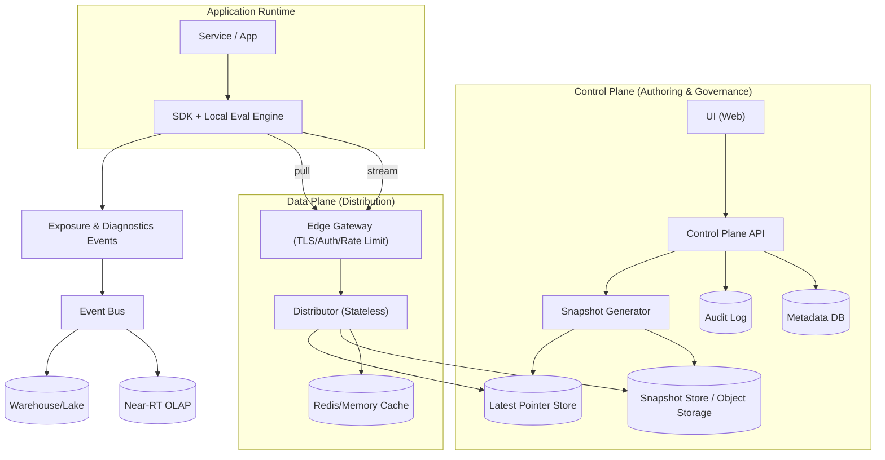
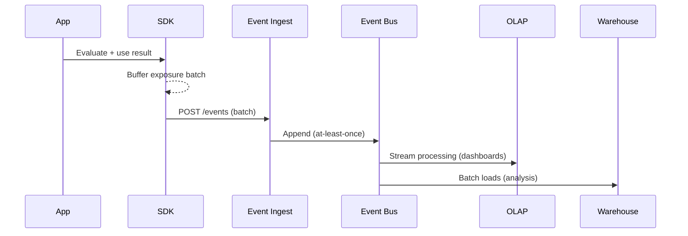

## Overview

Feature flag platforms look deceptively simple (“return true/false”), but become hard at scale because correctness, safety, and latency all matter at once. The system must support complex targeting rules (attributes, segments, geo, device), deterministic percentage rollouts, and experimentation, while also providing emergency kill switches that propagate quickly and reliably.

A production-grade feature flag system is best understood as two planes:

- **Control plane**: authoring, governance, validation, audit, approvals, experimentation setup, snapshot generation.
- **Data plane**: ultra-low-latency delivery of configuration to SDKs (stream + pull) so **flag evaluation happens locally** inside the SDK with a cached ruleset.

This separation keeps the critical request path fast and resilient: application requests should not depend on a network call to the feature flag service. Exposure tracking (for experiments) is handled asynchronously so analytics outages don’t slow or break production traffic.

---

## Requirements

### Functional Requirements

- Create, update, archive feature flags across environments (dev/stage/prod) with immutable revision history.
- Target flags based on context attributes (e.g., `userId`, `orgId`, geo, plan, app version), including reusable segments.
- Support deterministic percentage rollouts and ramp schedules (e.g., 1% → 5% → 25% → 100%).
- Support experiments (A/B, multivariate) with stable bucketing and exposure logging.
- Provide emergency kill switches (global and scoped) with fast propagation and safe defaults.
- Provide server and client SDKs with:
  - local evaluation
  - offline mode
  - last-known-good behavior
  - reason metadata (why a value was returned)
- Provide RBAC, audit logs, optional approvals, and guardrails to reduce blast radius.
- Provide operational tooling: search, change history, diffs, and rollback to a prior revision.

### Non-Functional Requirements

#### Scale (example target)

- Tenants: up to 2,000 orgs
- Flags: up to 100k total, ~1k–10k per large org across environments
- SDK instances (servers): ~50,000 concurrent (pods/VMs)
- Client devices (mobile/web): up to 5–20 million daily active clients (intermittent connectivity)
- Data plane connections:
  - ~50k concurrent streams (server SDKs)
  - client SDKs prefer pull with longer TTL (and may use push only where feasible)
- Control plane traffic: low/moderate (e.g., 10–200 QPS steady, bursty publishes during incidents)
- Event ingestion (exposures + diagnostics): up to 200k events/sec peak (bursty), with batching

#### Latency

- **Evaluation (in-process)**:
  - Server SDK: P50 < 50µs, P99 < 200µs
  - Client SDK: P50 < 0.5ms, P99 < 2ms
- **Config propagation (publish → applied by SDK)**:
  - P50 < 1s, P99 < 10s for server SDKs on streams
  - P99 < 60s for client SDKs relying primarily on pull (battery/network friendly)

#### Availability & Durability

- Data plane (config pull + stream): 99.99% (regional), with multi-region failover
- Control plane (UI/API): 99.9%
- Flag definitions + audit logs: durable (RPO ≤ 1 minute, typically near-0 with replicated logs)
- Event pipeline: at-least-once ingestion; allow sampling/dropping under extreme backpressure with explicit accounting

#### Consistency Model

- **Authoring/publish**: strong consistency per `(org, env)` for revision sequencing (linearizable “latest revision”).
- **Distribution**: eventual consistency; SDKs apply **versioned immutable snapshots** and expose their applied `revision`.
- **Runtime evaluation**: deterministic given `(snapshot revision, context)`.

### Constraints & Assumptions

- Multi-tenant (org/project/environment) with strict isolation.
- Some customers require data residency (EU/US) and audit retention (1–7 years).
- Client SDKs must not receive secrets; sensitive targeting should be server-side.
- Guardrails are mandatory for safe rollouts (approvals, max rollout delta, env scoping).
- Services can reach the data plane; clients may be offline or behind restrictive networks.

---

## Architecture

### High-Level System



### Key Idea: Immutable Snapshots + Local Evaluation

- Every publish produces an **immutable** snapshot identified by `(org, env, revision)`.
- SDKs evaluate flags locally against the snapshot.
- Updates propagate via:
  - **stream** (fast notification of a new revision)
  - **pull** (ETag/If-None-Match) as fallback and for cold start
- “Latest” is a small pointer (`revision`, `checksum`, `snapshotUrl`) with a short TTL and can be CDN cached.

---

## Components

## SDK + Local Evaluation Engine

**Responsibilities**
- Maintain a local snapshot cache and apply updates atomically.
- Evaluate flags with deterministic results (low latency, no network on the request path).
- Emit exposure events (for experiments) and diagnostic metrics (staleness, fetch errors).

**Key design details**
- **Atomic snapshot swap**: evaluation reads from an immutable in-memory structure; updates replace the pointer.
- **Deterministic bucketing**: stable hashing across languages using a published algorithm (e.g., 64-bit xxHash or Murmur3) and canonical encoding.
- **Last-known-good**: if updates cannot be fetched/verified, keep the previous verified snapshot.

**SDK modes**
- **Server SDKs**: stream + periodic pull, optional disk persistence for warm restarts.
- **Client SDKs**: primarily pull (battery/network), optional push where viable; stricter PII handling.

## Edge Gateway (Auth + Routing)

**Responsibilities**
- Terminate TLS, authenticate SDKs, enforce rate limits, route to regional distributors.
- Provide CDN-friendly endpoints for immutable snapshots and “latest pointer”.

**Key design details**
- Separate endpoints for streaming vs pull to isolate long-lived connections.
- Regional routing via geo-DNS/anycast; pin tenants to regions for residency.

## Distributor (Data Plane)

**Responsibilities**
- Serve “latest pointer”, snapshots, and (optionally) deltas.
- Fan out revision notifications for streams.
- Cache hot artifacts; coalesce cold-start fetches.

**Key design details**
- Immutable snapshot caching keyed by `(org, env, revision)` with long TTLs.
- Latest pointer cached with very short TTL (e.g., 1–5s) and ETag support.
- Optional delta support: useful for very large snapshots but increases complexity; immutable full snapshots are the baseline.

## Control Plane API/UI

**Responsibilities**
- Author flags/segments/experiments, validate and publish revisions, enforce RBAC/approvals, write audit logs.
- Generate snapshots and manage signing keys and schema versions.

**Key design details**
- **Guardrails**:
  - lint rules (unreachable rules, conflicting clauses)
  - maximum rollout delta per time window (blast-radius control)
  - kill switch precedence validation
  - environment scoping + required approvals for prod
- **Optimistic concurrency**: publish with `baseRevision`; reject on mismatch.

## Event Pipeline (Exposures + Diagnostics)

**Responsibilities**
- Ingest and store exposure events for experiment analysis.
- Produce near-real-time dashboards and long-term analytics.
- Ingest diagnostic events (SDK health, staleness) separately from exposures.

**Key design details**
- At-least-once ingestion with idempotent `eventId` dedupe window.
- Backpressure handling: batching, compression, sampling policies with counters.

---

## Data Model

### Relational Metadata (e.g., Postgres)

- `organizations(id, name, created_at)`
- `projects(id, org_id, name)`
- `environments(id, project_id, name, region_policy, created_at)`
- `flags(id, env_id, key, type, description, owner, created_at, archived_at)`
- `flag_drafts(id, flag_id, base_revision, draft_json, updated_at, updated_by)`
- `flag_revisions(id, flag_id, revision, published_at, published_by, checksum, status)`
- `segments(id, env_id, key, definition_json, updated_at)`
- `experiments(id, env_id, key, flag_key, variations_json, start_at, end_at, status)`
- `rbac_roles(id, org_id, name, policy_json)`
- `audit_events(id, org_id, actor, action, resource_type, resource_key, at, diff_json)`

**Invariants**
- Revisions are strictly increasing per `(org, env)` (or per `(flag, env)` if you choose that model; the SDK snapshot approach typically benefits from per-env revision for a single snapshot).
- A snapshot is immutable once published.
- A “latest pointer” moves forward, except when a rollback creates a new revision pointing to prior content.

### Snapshot Store (immutable blobs)

- `snapshot/{orgId}/{envId}/{revision}.json.zst`
- Contents (conceptual):
  - `schemaVersion`
  - `orgId`, `envId`
  - `revision`, `generatedAt`
  - `flags[]` (compiled representation for fast evaluation)
  - `segments[]` (inlined or referenced by hash)
  - `salts` (per-flag or per-env, stable)
  - `signatures[]` (for integrity)

### Latest Pointer Store

- `latest:{orgId}:{envId}` → `{ revision, checksum, snapshotUrl, updatedAt }`

This can live in Redis, a strongly consistent KV, or the metadata DB depending on consistency requirements. The key property is that reads are cheap and updates are linearizable.

---

## Flag Evaluation Semantics

### Evaluation Order (recommended)

1. **Global kill switch** (e.g., “force off everywhere”)
2. **Scoped kill switches** (e.g., by tenant, region, or segment)
3. **Targeting rules** (ordered list; first match wins)
4. **Experiment assignment** (if flag is part of an active experiment)
5. **Percentage rollout**
6. **Default** (per environment)

### Deterministic Bucketing

- Compute a stable 0–99,999 bucket (or 0–1) using a published cross-SDK algorithm.
- Include a stable **salt** to prevent correlations and to enable “rebucketing” if needed.

Example (conceptual):

- `bucket = hash64(canonical(userKey) + ":" + flagKey + ":" + salt) mod 100000`
- Rollout `p = 25%` means `bucket < 25000`

**Important**: define canonical encoding (UTF-8, separators, normalization rules) and publish test vectors so SDKs in different languages produce identical results.

### Exposure Logging Rules

- Log exposure when the application *uses* a flag value in a user-visible decision (“impression”), not necessarily on every evaluation call.
- Include:
  - `flagKey`, `variation`, `ruleId`/`reason`, `revision`, `experimentKey` (if any)
  - `contextKey` (stable, non-PII) or `contextHash` to avoid leaking raw identifiers

---

## API Design

### Control Plane (REST; internal auth via OIDC)

- `POST /v1/orgs/{orgId}/envs/{envId}/flags`
  - Request:
    ```json
    { "key": "checkout_new", "type": "boolean", "description": "New checkout", "owner": "payments" }
    ```
  - Response:
    ```json
    { "flagId": "flg_123", "key": "checkout_new", "createdAt": "2025-01-01T00:00:00Z" }
    ```

- `POST /v1/orgs/{orgId}/envs/{envId}/flags/{flagKey}:publish`
  - Headers: `Idempotency-Key: <uuid>`
  - Request:
    ```json
    {
      "baseRevision": 41,
      "comment": "Ramp to 10%",
      "rules": [
        { "id": "r1", "when": { "attr": "plan", "op": "IN", "values": ["pro"] }, "serve": { "variation": "on" } }
      ],
      "rollout": { "percentage": 10.0 },
      "defaultServe": { "variation": "off" }
    }
    ```
  - Response:
    ```json
    { "newRevision": 42, "checksum": "sha256:...", "publishedAt": "2025-01-01T00:00:10Z" }
    ```
  - Errors: `409` revision conflict, `422` validation failed

- `POST /v1/orgs/{orgId}/envs/{envId}/flags/{flagKey}:rollback`
  - Request:
    ```json
    { "toRevision": 39, "comment": "Rollback after errors" }
    ```
  - Response:
    ```json
    { "newRevision": 43, "rolledBackTo": 39 }
    ```

### Data Plane (SDK-facing; cacheable)

- `GET /sdk/v1/config/{orgId}/{envId}/latest`
  - Headers: `If-None-Match: "<etag>"`
  - Response `200`:
    ```json
    {
      "revision": 42,
      "checksum": "sha256:...",
      "snapshotUrl": "https://cdn.example.com/sdk/v1/snapshots/org/env/42",
      "schemaVersion": 3
    }
    ```
  - Response `304`: unchanged

- `GET /sdk/v1/snapshots/{orgId}/{envId}/{revision}`
  - Response `200`: compressed bytes (`application/octet-stream`) + `ETag`
  - Security: snapshot signature embedded; SDK verifies signature + schema version

- `GET /sdk/v1/stream/{orgId}/{envId}`
  - Protocol: SSE or WebSocket (server SDKs)
  - Messages:
    ```json
    { "type": "rev", "revision": 42, "checksum": "sha256:..." }
    ```
  - Reconnect: `Last-Event-ID` or resume token; SDK still confirms by pulling `latest` or the referenced revision.

### Events (Exposure + Diagnostics)

- `POST /sdk/v1/events`
  - Request (batched):
    ```json
    {
      "sdkKeyId": "sdk_abc",
      "events": [
        {
          "id": "2bdbb6fb-3e23-4ddf-9a93-1f3e2db1b3c2",
          "ts": "2025-01-01T00:00:05Z",
          "kind": "exposure",
          "orgId": "org_1",
          "envId": "prod",
          "flagKey": "checkout_new",
          "variation": "on",
          "experimentKey": "exp_checkout_2025q1",
          "revision": 42,
          "reason": "RULE_MATCH",
          "contextHash": "sha256:..."
        }
      ]
    }
    ```
  - Response: `202 Accepted`
  - Idempotency: dedupe by `events[].id` within a rolling window (e.g., 24h)

---

## Data Flows

### Publish → Propagate → Apply

```mermaid
sequenceDiagram
  participant Dev as Developer
  participant CP as Control Plane
  participant Meta as Metadata DB
  participant Obj as Snapshot Store
  participant Latest as Latest Pointer
  participant Dist as Distributor
  participant SDK as SDK

  Dev->>CP: Publish(flag change, baseRevision)
  CP->>Meta: Txn: validate + record revision
  CP->>Obj: Write snapshot(rev)
  CP->>Latest: Update latest pointer (rev, checksum)
  CP->>Dist: Notify(org, env, rev)

  Dist-->>SDK: Stream event: rev
  SDK->>Dist: GET latest (ETag)
  SDK->>Dist: GET snapshot(rev)
  SDK->>SDK: Verify signature; swap snapshot atomically
```

### Exposure Events (Async)



---

## Scaling & Performance

### Bottlenecks and Mitigations

- **Stream fanout (50k long-lived connections)**:
  - event-driven servers (epoll/kqueue), connection sharding, regional affinity
  - separate stream tier from pull tier to isolate resource profiles
- **Snapshot size (large segments)**:
  - segment references by hash, compiled predicates, compression (zstd)
  - optional precomputed membership for expensive segments (with clear limits)
- **Cold-start thundering herd (deploy waves)**:
  - immutable snapshots served from CDN/object storage
  - jittered SDK refresh + request coalescing in distributor
- **Event ingestion spikes**:
  - batching + compression, backpressure, sampling with explicit counters
  - isolate diagnostics from exposures to protect experiment quality

### Caching Strategy

- **SDK**: in-memory snapshot; optional disk persistence for server SDKs; periodic refresh even with stream.
- **CDN/Edge**: cache immutable snapshot URLs (`/snapshots/.../{revision}`) for hours/days.
- **Distributor**: Redis/memory cache for hot snapshots and latest pointer; negative caching for missing revisions.
- **Invalidation**: avoid invalidation by making snapshots immutable; only “latest pointer” changes frequently.

### Multi-Region & Residency

- Run control plane and data plane per residency region (e.g., EU, US).
- Keep snapshots and latest pointers region-local.
- For global services: route SDKs to the correct region based on tenant mapping (and enforce it at auth time).

---

## Trade-offs & Alternatives

### Trade-offs

- **Local SDK evaluation**
  - Pros: near-zero latency, no hard dependency on network in request path, resilient to data plane outages
  - Cons: bounded staleness; requires careful SDK versioning and consistent hashing across languages

- **Immutable, versioned snapshots**
  - Pros: reproducibility, fast rollback, CDN caching, strong auditability
  - Cons: storage growth; snapshot generation complexity; need schema/version migration strategy

- **Eventual distribution consistency**
  - Pros: higher availability and simpler scaling; tolerates partitions
  - Cons: flips aren’t perfectly synchronized; requires staleness monitoring and operational discipline

- **Async exposure logging**
  - Pros: analytics outages don’t affect production traffic
  - Cons: delayed or incomplete metrics under failure; requires dedupe/sampling policies

### Alternatives

- **Remote evaluation service (per-request RPC)**: simpler SDKs but introduces tail latency and makes the flag service a critical dependency for every request.
- **Database-driven evaluation in application code**: flexible but expensive and operationally risky at high QPS.
- **Edge-only evaluation (CDN workers)**: great for HTTP routing and web traffic but not a complete solution for internal services and rich context.

---

## Failure Modes & Mitigations

### Failure Scenarios

- **Distributor outage in a region**
  - Impact: SDKs can’t fetch updates; evaluation continues using cached snapshot
  - Detection: 5xx spikes, stream disconnect rate, increased `sdk_staleness_seconds`
  - Mitigation: multi-region failover via geo-DNS; exponential backoff; keep last-known-good

- **Bad publish (logical rule error)**
  - Impact: incorrect targeting/rollout; customer harm
  - Detection: rule linting, canary environment, anomaly detection (errors by variant, unexpected variant skew)
  - Mitigation: one-click rollback; emergency kill switch that overrides rule evaluation

- **Stream tier degradation (LB limits, reconnect storms)**
  - Impact: slower propagation
  - Detection: publish→apply SLO breach; reconnect storm metrics
  - Mitigation: periodic pull fallback; autoscale stream tier; connection sharding

- **Snapshot integrity failures (corruption or signing key mismatch)**
  - Impact: SDK refuses updates or, worse, applies untrusted config (if verification is weak)
  - Detection: signature verification failures, checksum mismatch alarms
  - Mitigation: strict signature verification; dual-sign during key rotation; WORM retention + checksums

- **Cross-SDK hashing mismatch (inconsistent bucketing across languages/versions)**
  - Impact: users see different variants across services; experiment data becomes invalid
  - Detection: SDK self-test against published vectors; diagnostic events flag mismatch
  - Mitigation: publish canonical algorithm + test vectors; version-gate snapshot schema; block publishes if unsupported SDK versions are detected (optional)

- **Event bus backlog/outage**
  - Impact: delayed experiment results; potential loss if buffers overflow
  - Detection: consumer lag, ingest error rates, SDK drop counters
  - Mitigation: local buffering with caps; sampling; durable ingest queue; degrade analytics independently

### Disaster Recovery

- Targets (example):
  - Data plane: RTO 5–15 minutes per region, RPO ~0 for snapshots (immutable, replicated)
  - Control plane: RTO 1 hour, RPO ≤ 1 minute (replicated DB + audit log)
- Backups:
  - Continuous backups for metadata DB
  - Cross-AZ and cross-region replication for snapshot buckets and audit log
- Runbooks:
  - promote secondary DB
  - switch tenant routing
  - rotate signing keys (with dual-sign overlap)

---

## Operations

### SLOs (example)

- `config_fetch_success_rate`: 99.99% (server SDKs)
- `publish_to_apply_p99`: < 10s (server SDKs on stream)
- `sdk_staleness_seconds_p99`: < 60s for top tenants
- `snapshot_verify_failure_rate`: < 0.01%

### Monitoring & Alerting

- Data plane:
  - `config_fetch_p50/p95/p99`, `cdn_hit_ratio`, `etag_hit_ratio`
  - `active_streams`, `stream_disconnect_rate`, `reconnect_rate`
  - `publish_to_apply_p50/p99`, `sdk_staleness_seconds`
  - `snapshot_verify_failures`, `latest_pointer_read_errors`
- Control plane:
  - `publish_error_rate`, `revision_conflicts`, `approval_queue_time`
  - `snapshot_generation_latency`, `audit_write_lag`
- Events:
  - `ingest_qps`, `consumer_lag`, `drop_rate`, `dedupe_rate`

### Deployment & Migration

- Backward-compatible snapshot schema with `schemaVersion`.
- Additive changes first; dual-read/dual-write only when necessary.
- SDK rollout strategy:
  - publish test vectors and enforce SDK compatibility windows
  - block incompatible schema versions from being served to outdated SDKs (or serve a downgraded schema variant)

---

## Security & Privacy

- **Authentication**
  - Server SDKs: short-lived tokens (OIDC/JWT) or mTLS; scoped to `(org, env)`
  - Client SDKs: public “client keys” with strict scoping and rate limits; do not embed secrets
- **Authorization**
  - RBAC with least privilege; approvals for prod; audit everything
- **Integrity**
  - Snapshots are signed; SDK verifies signature before applying
- **PII**
  - Prefer hashed stable identifiers in events (`contextHash`)
  - Avoid sending raw user attributes in exposure events; keep targeting attributes local where possible
- **Tenant isolation**
  - Namespaced storage keys; per-tenant encryption keys if required; region enforcement

---

## References & Further Reading

- LaunchDarkly docs (control/data plane concepts, SDK caching): https://docs.launchdarkly.com/
- Unleash (open-source feature management): https://www.getunleash.io/
- Netflix Archaius (dynamic configuration): https://github.com/Netflix/archaius
- Twelve-Factor App config principle: https://12factor.net/config
- Kafka documentation (event pipeline fundamentals): https://kafka.apache.org/documentation/
