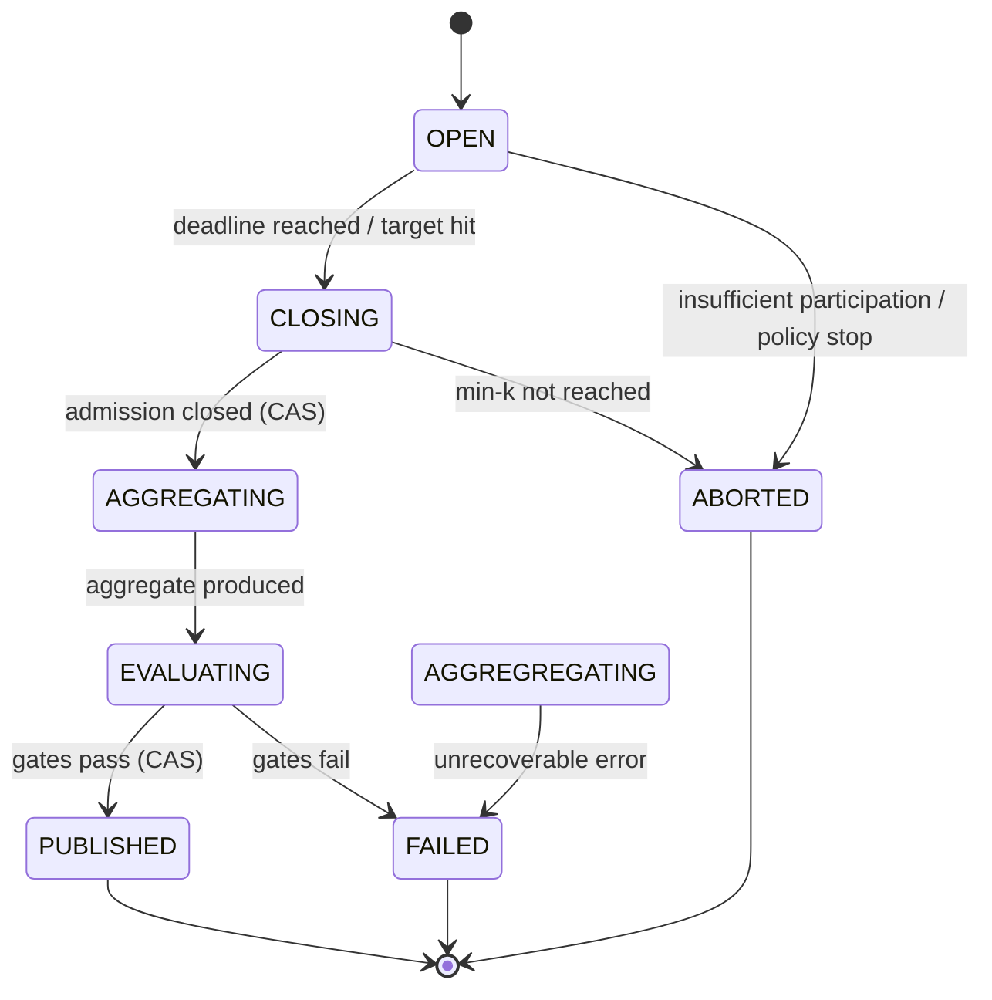
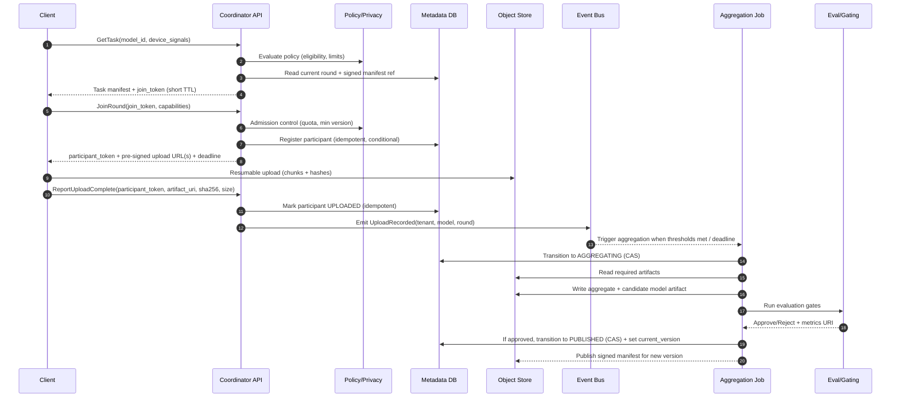

## Overview

A federated learning (FL) system coordinates training across millions of edge devices (phones/IoT/browsers) by distributing a training task (model + config) and aggregating local updates—without centralizing raw user data. The hard parts are operating a globally distributed, intermittent, partially adversarial fleet with strict privacy guarantees, bandwidth constraints, heterogeneous compute, and regulatory requirements.

This design uses round-based orchestration with **secure aggregation** (so the server cannot see individual client updates) and optional **differential privacy (DP)** at model release (so the published model resists inference about any single participant). Architecturally, it cleanly separates:

- **Control plane**: eligibility, scheduling, policies, state machine, audit, tokens
- **Data plane**: high-throughput, resumable transport of large update artifacts and aggregation compute

The key principle: treat privacy as a protocol and product requirement (enforced by design and automation), not an “encryption checkbox”.

---

## Requirements

### Functional Requirements

- Devices fetch the latest training task for a model (manifest, weights URL, training + privacy config).
- Server selects eligible devices and coordinates training rounds (cohorts, quotas, deadlines, backoff).
- Devices upload encrypted/masked updates and aggregate-only training metrics.
- System aggregates updates into a new global model and publishes atomically (single visible version).
- Multi-tenant support: isolation for policies, keys, quotas, storage prefixes, and observability.
- Auditability at aggregate level: round configs, thresholds, aggregate counts, publish history.
- Detect/mitigate malformed or adversarial behavior:
  - protocol compliance (schema, size, deadlines, token validity)
  - training safety (clipping, robust aggregation options, offline evaluation gates)
- Safe rollouts/rollbacks of both models and training configs.

### Non-Functional Requirements (Concrete Targets)

#### Scale (example sizing)

- Enrolled devices: **10M–100M**
- Daily active participants: **1M–5M**
- Peak concurrent participants (global): **200K**
- Model size (download): **10–50 MB** typical (mobile-friendly); up to 200 MB for large models (less common)
- Update size (upload): **0.5–5 MB** typical with compression/sparsity; hard cap per policy (e.g., 10 MB)

Derived peak bandwidth (order-of-magnitude):
- If **200K** devices upload **3 MB** within **10 minutes**:  
  `200,000 * 3 MB / 600 s ≈ 1,000 MB/s ≈ 8 Gbps` (plus overhead and regional skew)
- Plan for **10–30 Gbps** aggregate ingest headroom to handle clustering, retries, and larger updates.

#### Latency / Timeliness

- Task fetch (regional): **P50 ≤ 50 ms**, **P99 ≤ 200 ms**
- Join/eligibility decision: **P99 ≤ 250 ms**
- Upload service processing (server-side, excluding network transfer): **P99 ≤ 300 ms per chunk**
- Upload completion time is network-dependent; target **median ≤ 10 s** for a ~3 MB artifact on Wi‑Fi.
- Round completion: **5–30 minutes** (cohort size, dropout, multi-phase secure aggregation)

#### Availability / Durability

- Task fetch + join APIs: **99.95%** monthly
- Upload authorization + intake path: **99.9%** monthly (rounds tolerate partial delays)
- Aggregation + publish pipeline: **99.9%** monthly (retries allowed; correctness > speed)
- Published model artifacts: **RPO = 0**, cross-region replicated/versioned
- Metadata DB: **RPO ≤ 5 minutes**, **RTO ≤ 30 minutes** (by region failover)

#### Consistency Model

- **Strong consistency** for round state transitions and publish (no double publish, no split-brain).
- **Eventual consistency** for telemetry, device health signals, and derived analytics.

### Constraints & Assumptions

- Devices are intermittent, battery/thermal constrained, behind NAT, and frequently update client versions slowly.
- Privacy requirement: the server must not learn any individual plaintext update (secure aggregation).
- Optional DP at release: DP budget is tracked and enforced per model/tenant.
- Compliance: GDPR/CCPA; minimize identifiers; enforce retention limits and purpose limitation.
- Small platform team (6–10 engineers): prefer managed primitives; minimize bespoke distributed systems.

---

## Architecture

### High-Level Diagram

```mermaid
flowchart TB
  %% ===== Edge =====
  subgraph Edge["Edge Devices"]
    C[Clients<br/>(mobile/IoT/browser)]
  end

  %% ===== Control Plane =====
  subgraph CP["Control Plane (low payload, high QPS)"]
    GLB[Global Anycast / L7 Load Balancer]
    API[Coordinator API<br/>(stateless)]
    CACHE[(Eligibility/Task Cache<br/>Redis/Edge Cache)]
    META[(Metadata DB<br/>strong consistency)]
    POLICY[Policy & Privacy Service<br/>(DP budgets, min-k, limits)]
    SCHED[Round Scheduler<br/>(single-writer per model)]
    BUS[(Event Bus<br/>Kafka/PubSub/SQS)]
    REG[Model Registry<br/>(manifests, versions)]
  end

  %% ===== Data Plane =====
  subgraph DP["Data Plane (large payload)"]
    CDN[CDN / Object Store Download]
    UPX[Upload Proxy (optional)<br/>(auth, rate limit)]
    OBJ[(Object Store<br/>(updates, models))]
  end

  %% ===== Compute =====
  subgraph Compute["Async Compute"]
    AGG[Aggregation Jobs<br/>(secure aggregation + checks)]
    EVAL[Evaluation & Gating<br/>(offline metrics/canary)]
  end

  %% ===== Flows =====
  C --> GLB --> API
  API <--> CACHE
  API <--> META
  API --> POLICY
  API <--> REG
  SCHED <--> META
  SCHED --> BUS
  API --> BUS

  C -->|model download| CDN
  API -->|pre-signed upload URL| C
  C -->|resumable upload| UPX --> OBJ

  BUS --> AGG
  AGG <--> OBJ
  AGG <--> META
  AGG --> EVAL
  EVAL -->|approve/pin version| META
  AGG -->|publish model artifact| OBJ
  REG -->|signed manifest| API
```

### Key Architectural Choices (and why)

- **Direct-to-object-store uploads**: keeps the Coordinator API out of the bandwidth path; scales elastically.
- **Strongly consistent round state machine**: prevents double publish and inconsistent model versions.
- **Single-writer per model (scheduler)**: simplifies lifecycle and correctness for rounds and DP budgets.
- **Event-driven aggregation**: converts bursty device behavior into a durable queue and autoscaled compute.

---

## Protocols & Privacy Model

### Secure Aggregation (server cannot see individual updates)

At a high level, secure aggregation ensures the server only learns the **sum/average** of updates across a cohort, not any individual update. Production systems typically use a dropout-resilient MPC-style protocol (e.g., Bonawitz et al.) that:

- Establishes per-round cryptographic material (ephemeral keys; masking values).
- Requires a minimum threshold `k` of successful participants; otherwise the round is aborted.
- Handles dropouts by reconstructing masks/shares only when enough participants remain.

Operational implications:
- Secure aggregation often requires **multiple phases** (setup, upload masked update, unmask/shares).
- The system must be resilient to late arrivals, retries, and partial failures.
- Because individual updates are hidden, server-side per-update anomaly inspection is limited; defenses shift to **on-device constraints** (clipping, validation) and **offline evaluation gates**.

### Differential Privacy at Release (optional but common)

If enabled, the system enforces:
- **Clipping** (client-side or enforced by training library): bound each client’s contribution.
- **Noise addition** at aggregation/publish: calibrated noise to achieve a target privacy budget.
- **Budget accounting** per model/tenant: block publishing when the remaining budget is insufficient.

DP is a release policy: it protects the *published model* (or published aggregates), not just transport.

### Authenticity & Integrity (minimum bar)

- Manifests and training configs are **signed**; clients verify signatures to prevent malicious task injection.
- Upload artifacts include **hashes** and sizes; the system validates integrity before aggregation.
- Optional device attestation / app integrity signals to reduce Sybil and modified-client risk (policy-based).

---

## Requirements-to-Design Mapping (Interview-Friendly)

- Privacy → secure aggregation + min-`k`, signed configs, audited DP gating
- Scale → stateless API + caching + object store + queue + autoscaled jobs
- Correctness → round state machine with conditional updates and idempotency
- Adversarial environment → rate limiting, admission control, schema validation, offline evaluation gates, robust aggregation options
- Operability → multi-region, durable event bus, runbooks, metrics, and safe deployments

---

## Component Deep-Dive

### Coordinator API

**Responsibilities**
- `GetTask`: serve current task manifest and join token
- `JoinRound`: eligibility check, cohort admission, token minting, upload URL issuance
- `ReportUploadComplete`: record upload completion (idempotent)
- Aggregate-only status endpoints for observability/debugging

**Design notes**
- Stateless service behind L7 LB; no sticky sessions.
- Uses short-lived signed tokens (JWT/PASETO) for join and upload authorization.
- Treats metadata writes as correctness-critical: conditional updates / transactions.

**Scaling**
- Cache current task manifests aggressively (edge cache/Redis).
- Partition metadata by `(tenant_id, model_id)` and sort by `round_id`.

### Policy & Privacy Service

**Responsibilities**
- Central source of truth for:
  - per-tenant/model limits (max update size, allowed geos, min OS/app version)
  - secure aggregation parameters (min-`k`, timeouts, protocol versions)
  - DP parameters and budget tracking (epsilon/delta, accounting method)

**Why separate**
- Prevents “config sprawl” across services.
- Enables explicit approvals, auditing, and automated guardrails (e.g., blocking publish when budget exhausted).

### Round Scheduler (single-writer per model)

**Responsibilities**
- Create rounds, compute cohorts, enforce policy constraints (charging/Wi‑Fi, region, device class).
- Adaptive oversubscription to hit target `k` despite dropouts.
- Close rounds based on thresholds and deadlines.

**Design notes**
- Decouple **selection** (invite) from **admission** (join-time check) to handle stale signals.
- Leader election per model partition or use a workflow engine (e.g., Temporal) for retries and timers.

### Upload Path (Data Plane)

**Responsibilities**
- Provide resumable, chunked uploads; enforce auth/rate limits.
- Keep the control plane off the hot bandwidth path.

**Recommended pattern**
- Coordinator issues pre-signed URLs for object store uploads.
- Optional upload proxy for:
  - request authentication (avoid public pre-signed URL abuse)
  - per-tenant rate limiting
  - uniform observability and WAF protections

**Correctness**
- Chunk hashes + final artifact hash.
- Idempotency key per `(participant_id, round_id, artifact_digest)`.

### Aggregation Jobs

**Responsibilities**
- Execute secure aggregation protocol phases (as applicable).
- Validate artifacts (schema, size, hashes), enforce min-`k`.
- Aggregate updates, apply optional DP noise, produce new model artifact.
- Run robustness checks that are compatible with secure aggregation (aggregate stats, holdout evals).
- Publish atomically and advance round state.

**Scaling**
- One job per `(tenant_id, model_id, round_id)` with parallelism inside the job (artifact reads/shards).
- Autoscale based on queue depth and artifact volume.

### Model Registry & Artifacts

**Responsibilities**
- Store immutable model artifacts (versioned, replicated).
- Publish signed task manifests referencing model version and training config.
- Support rollback by pinning an earlier version.

**Durability**
- Object store versioning + cross-region replication for model artifacts.
- Metadata points to the immutable artifact version.

---

## Data Model

### Core Entities (Metadata DB)

**`models`**
- `tenant_id` (pk)
- `model_id` (pk)
- `current_version` (pointer to immutable artifact version)
- `policy_version` (ref to signed policy/config snapshot)
- `dp_budget_state` (if DP enabled; aggregate-only)
- `created_at`, `updated_at`

**`rounds`**
- `tenant_id` (pk)
- `model_id` (pk)
- `round_id` (pk, monotonic or ULID)
- `state` (`OPEN | CLOSING | AGGREGATING | EVALUATING | PUBLISHED | FAILED | ABORTED`)
- `min_participants_k`
- `target_participants_n`
- `deadline_at`
- `task_manifest_uri` (signed)
- `agg_result_uri` (set after aggregation)
- `published_model_uri` (set after publish)
- `metrics_uri` (aggregate-only)
- `created_at`, `updated_at`

**`participants`** (bounded retention; pseudonymous, no raw device identifiers)
- `tenant_id`, `model_id`, `round_id` (pk)
- `participant_id` (pk; random per round or per model with rotation)
- `status` (`JOINED | UPLOADED | DROPPED | REJECTED`)
- `artifact_uri` (object store pointer)
- `uploaded_at`
- TTL/retention: e.g., **7–30 days** depending on compliance and debugging needs

**`events`** (optional; append-only for audit/analytics)
- `event_id` (pk)
- `tenant_id`, `model_id`, `round_id`
- `type` (`ROUND_CREATED`, `ROUND_CLOSED`, `UPLOAD_RECORDED`, `PUBLISHED`, `FAILED`, ...)
- `payload` (aggregate-only)
- `created_at`

### Object Store Layout

- Updates: `s3://bucket/tenant={t}/model={m}/round={r}/participant={p}/update.bin`
- Aggregates/results: `.../round={r}/aggregate.bin`
- Models (immutable): `.../model={m}/version={v}/model.safetensors` (or framework-native format)
- Manifests (signed): `.../model={m}/version={v}/manifest.json`

Lifecycle policies:
- Per-round uploads: TTL (e.g., 30–90 days), shorter if required by privacy policy.
- Published models: retained per product needs, typically long-lived with explicit deletion workflows.

### Round State Machine (Correctness-Critical)



Enforcement:
- Every transition is a conditional update (compare-and-swap) on `(tenant_id, model_id, round_id, state, version)`.

---

## Data Flow



---

## API Design

### gRPC-first (with REST mapping)

Key goals:
- Small payloads, explicit versioning, efficient mobile performance, clear error semantics.
- All mutating calls are idempotent and safe under retries.

#### Example `.proto` (simplified)

```proto
syntax = "proto3";

package atlas.fl.v1;

message GetTaskRequest {
  string tenant_id = 1;
  string model_id = 2;
  map<string, string> device_signals = 3; // wifi/charging/region/app_version (no raw identifiers)
}

message GetTaskResponse {
  string round_id = 1;
  string manifest_url = 2; // signed + cacheable
  string join_token = 3;   // short TTL
  int64 join_token_expires_at_ms = 4;
}

message JoinRoundRequest {
  string tenant_id = 1;
  string model_id = 2;
  string join_token = 3;
  map<string, string> capabilities = 4;
  string idempotency_key = 5;
}

message JoinRoundResponse {
  string round_id = 1;
  string participant_token = 2; // short TTL, scoped to round
  repeated string upload_urls = 3;
  int64 deadline_at_ms = 4;
  int64 max_upload_bytes = 5;
}

message ReportUploadCompleteRequest {
  string tenant_id = 1;
  string model_id = 2;
  string round_id = 3;
  string participant_token = 4;
  string artifact_uri = 5;
  string artifact_sha256 = 6;
  int64 size_bytes = 7;
  string idempotency_key = 8;
}

message ReportUploadCompleteResponse {
  bool accepted = 1;
}
```

REST mapping (example):
- `GET /v1/tenants/{tenant_id}/models/{model_id}/task`
- `POST /v1/tenants/{tenant_id}/models/{model_id}/rounds:join`
- `POST /v1/tenants/{tenant_id}/models/{model_id}/rounds/{round_id}:uploadComplete`

### Error Handling & Retries

- Use structured error codes (`INELIGIBLE`, `ROUND_CLOSED`, `TOKEN_EXPIRED`, `QUOTA_EXCEEDED`, `BAD_HASH`, `ARTIFACT_TOO_LARGE`).
- Clients retry on transient errors with exponential backoff + jitter.
- Honor `Retry-After` for admission control and throttling.
- Tokens are short-lived; refresh via `GetTask`/`JoinRound`.

### Idempotency Rules (must-have)

- `JoinRound` idempotent by `(tenant_id, model_id, join_token_subject, idempotency_key)`.
- `ReportUploadComplete` idempotent by `(tenant_id, model_id, round_id, participant_id, artifact_sha256)`.

---

## Scaling & Performance

### Bottleneck Analysis

- **Task fetch hot path**: cache signed manifests at CDN/edge; Redis for “current round pointer”.
- **Join bursts**: enforce quotas and admission control; keep join logic O(1) metadata operations.
- **Upload spikes**: use direct object store uploads; cap update size; per-tenant rate limiting.
- **Aggregation throughput**: autoscale jobs; stream reads; validate early; avoid heavy per-update compute server-side.
- **Metadata contention**: single-writer scheduler per model; conditional updates for transitions.

### Admission Control (keeps the system stable)

- Global and per-tenant QPS limits on `JoinRound`.
- Dynamic “join window” and cohort sizing (oversubscribe to account for dropouts).
- Backpressure when object store throttles or aggregation queue lags:
  - reduce joins
  - extend deadlines
  - prioritize smaller artifacts / specific regions

### Caching Strategy

- Signed manifests cacheable at CDN with versioned URLs.
- Redis cache for:
  - current round pointer per model
  - coarse eligibility decisions (very short TTL, e.g., 1–5 seconds)
- Avoid caching participant state (write-heavy); derive aggregates from events.

### Multi-Region

- Serve `GetTask`/`JoinRound` from multiple regions with geo routing.
- Keep metadata strongly consistent (single region per tenant/model or globally consistent DB). If using regional primaries:
  - pin each tenant/model to a home region for writes
  - allow read-only degraded mode elsewhere

---

## Trade-offs & Alternatives

### Key Trade-offs

1. **Secure aggregation (min-`k`)**
   - Pros: server cannot inspect individual updates; reduces insider/compliance risk.
   - Cons: multi-phase coordination, dropout handling, limited per-update validation, higher latency.

2. **Direct-to-object-store uploads**
   - Pros: removes bandwidth bottleneck; leverages managed durability and scaling; cheaper.
   - Cons: more integration complexity (pre-signed URLs, callbacks), more challenging local debugging, careful abuse prevention needed.

3. **Strongly consistent round state**
   - Pros: prevents double publish and model/version corruption; simplifies reasoning.
   - Cons: higher write latency and/or regional constraints; careful schema/indexing required.

4. **Offline evaluation gates vs real-time anomaly detection**
   - Pros: strong safety net compatible with secure aggregation; catches regressions/backdoors via behavior.
   - Cons: slower iteration; requires eval infrastructure and representative holdouts.

### Alternatives (when you’d choose them)

- **Centralized training (data upload)**: simpler, faster iteration; unacceptable when privacy/compliance constraints prohibit raw data centralization.
- **TEE-based aggregation**: enables more validation on individual updates inside enclaves; adds hardware trust/attestation complexity and capacity constraints; often complementary (e.g., for high-risk models).
- **Peer-to-peer aggregation**: theoretically reduces server load; operationally difficult across NAT/intermittency; complex security story.
- **Streaming (non-round) FL**: reduces coordination overhead; harder correctness/privacy accounting; more complex for interviews unless explicitly requested.

---

## Failure Modes & Mitigations

### Scenarios (at least 3)

1. **Object store throttling / regional degradation**
   - Impact: upload failures, missed round deadlines, reduced participation.
   - Detection: 429/5xx from object store, increased upload retries, backlog in upload-complete events.
   - Mitigation: admission control (reduce joins), multi-region buckets or dual writes for critical artifacts, adaptive deadline extension, client backoff with jitter.

2. **Aggregation job crash or node preemption**
   - Impact: delayed publish; round stuck in `AGGREGATING`.
   - Detection: missing heartbeats, job failure rate, queue lag.
   - Mitigation: checkpoint progress, idempotent writes, re-run job safely, timeout watchdog to move to `FAILED` or retry.

3. **Metadata DB partial outage / partition**
   - Impact: cannot join rounds or publish; correctness at risk if split-brain.
   - Detection: elevated p99, error rates, failed CAS transitions.
   - Mitigation: fail closed on publish (no publish without strong writes), serve last known task in read-only mode, regional failover procedures, retry with jitter.

4. **Malicious/poisoned behavior (backdoor or data poisoning)**
   - Impact: unsafe model, degraded quality, potential policy violations.
   - Detection: offline evaluation regressions, drift signals, canary cohort metrics, aggregate statistics anomalies.
   - Mitigation: client-side clipping and validation, robust aggregation where feasible, strict gating before publish, staged rollout + fast rollback, quarantine suspicious rounds.

5. **Privacy misconfiguration / DP budget overrun**
   - Impact: privacy guarantees invalid; compliance incident.
   - Detection: policy audit failures, config drift alerts, publish attempts blocked by budget service.
   - Mitigation: signed configs with approvals, centralized policy enforcement, automated budget accounting and hard stops, immutable audit logs.

### Disaster Recovery

- Metadata: PITR backups; tested restore; **RPO ≤ 5 min**, **RTO ≤ 30 min**
- Published model artifacts: object store versioning + cross-region replication; **RPO = 0**
- Event bus: durable retention (e.g., 24–72h) so aggregation can resume after outages.

---

## Operations

### Monitoring & Alerting

Key metrics:
- API: QPS, p50/p99 latency, 4xx/5xx rates, auth/token failures
- Join funnel: invited → joined → uploaded → aggregated → published; dropout rate
- Upload: success rate, bytes/sec, retry rate, throttling signals, median completion time
- Aggregation: queue depth, job duration, failure rate, checkpoint/resume counts
- Quality gates: offline eval metrics, canary health, drift indicators
- Privacy: min-`k` violations, DP budget consumption, config change audits

Example alerts:
- `JoinRound` 5xx > 1% for 5 minutes
- Upload throttling spikes or failure rate > 2% for 10 minutes
- Any publish without meeting `min_k` (page immediately; should be impossible if enforced correctly)
- Round stuck in `AGGREGATING` beyond expected window (e.g., > 2x baseline)

### Deployment & Change Management

- Progressive delivery for API/scheduler via canaries and feature flags per tenant/model.
- Versioned manifests and protocol; support N-2 clients.
- Rollback:
  - pin previous `current_version`
  - disable new joins for affected round(s)
  - preserve audit trail (never “rewrite history”)

### Security & Compliance Operations

- Data minimization: no raw device identifiers in long-lived stores; rotate pseudonymous IDs.
- Retention controls and deletion workflows aligned with policy.
- Access controls:
  - least privilege for aggregation jobs and artifact access
  - separate roles for policy changes, publish approvals, and ops
- Audit logs: immutable records for publish decisions and policy/config versions.

---

## References & Further Reading

- Bonawitz et al., “Practical Secure Aggregation for Privacy-Preserving Machine Learning”
- McMahan et al., “Communication-Efficient Learning of Deep Networks from Decentralized Data” (FedAvg)
- Dwork et al., Differential Privacy; DP-SGD and privacy accounting
- TensorFlow Federated, Flower, PySyft (FL frameworks and patterns)
- MPC/dropout-resilience literature for threshold-based secure aggregation