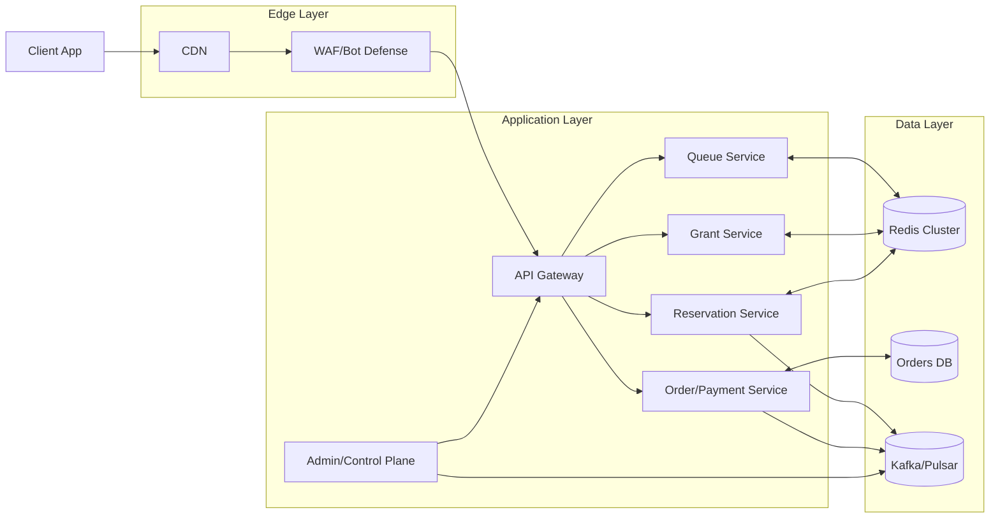
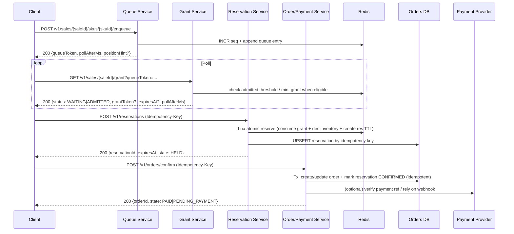

## Overview

Flash sales generate extreme, short-lived load spikes (often 50–200× baseline) focused on a small “hot set” of SKUs. The system must:

- Prevent overselling (inventory correctness).
- Remain responsive under overload (no cascading timeouts/retry storms).
- Provide a fair, predictable user experience (no “retry advantage,” bot resistance).

The core design separates the problem into two control loops:

1. **Admission & fairness**: a *virtual waiting room* that sequences users and issues short-lived **purchase grants** at a controlled rate.
2. **Inventory correctness**: an **inventory reservation** workflow that performs atomic holds with TTLs and converts holds into orders exactly once via idempotent state transitions.

This isolates the “always-on under overload” path (enqueue/status/grant) from the correctness-critical path (reserve/confirm), so traffic spikes don’t compromise order and inventory integrity.

---

## Requirements

### Functional Requirements

- Users can join a sale-specific queue and receive status (position hint / ETA hint).
- The system admits users at a controlled rate per sale/SKU and issues a short-lived **grant**.
- Users with a valid grant can create a **reservation (hold)** for a SKU with a fixed TTL (e.g., 2–5 minutes).
- Users can confirm purchase via payment; a reservation converts to an order **exactly once**.
- Users can abandon or cancel; expired holds automatically return inventory.
- Fairness:
  - FIFO within a sale/SKU for eligible users.
  - No retry advantage (repeated polling or retries must not improve odds).
- Anti-abuse:
  - Per-account/device/IP constraints.
  - Bot detection/challenges at the edge.
- Operators can start/stop a sale, adjust inventory and admit rate safely, and pause admission for a SKU on incident.

### Non-Functional Requirements

#### Scale (Concrete Targets)

Assume a globally promoted sale with a hot set of 1–10 SKUs:

- **Peak enqueue**: 500k QPS (global) for 30–120 seconds.
- **Concurrent waiting**: 1M active queue participants during peak minute.
- **Grant issuance**: up to 50k grants/sec (aggregate), typically 5–10k/sec per hottest SKU.
- **Reservation attempts**: up to 20k QPS.
- **Order confirmation**: up to 10k QPS (often lower due to payment and user drop-off).
- **Inventory**: 1k–1M units per SKU; 100–10k SKUs per sale (but hot set is small).

#### Latency (Service SLOs)

Measured at the API boundary, excluding client network:

- **Enqueue**: P50 30ms, P99 150ms.
- **Grant poll**: P50 30ms, P99 150ms (most responses are “WAITING” and cacheable in-process).
- **Reserve**: P50 50ms, P99 200ms (dominated by Redis + one DB write).
- **Confirm (excluding payment provider)**: P50 100ms, P99 300ms.

Tail-latency strategy: fail fast + controlled admission + avoid synchronous fan-out.

#### Availability (SLOs)

During the sale window:

- **Enqueue/status/grant**: 99.99% (degrade gracefully; position/ETA may be approximate).
- **Reserve/confirm**: 99.95% (correctness over availability; fail closed to prevent oversell).

#### Consistency & Correctness

- **Strong consistency required**:
  - A grant can be consumed at most once.
  - A reservation hold decrements available inventory atomically.
  - A reservation can be confirmed into an order exactly once.
- **Eventual consistency acceptable**:
  - Queue position/ETA hints.
  - Analytics, emails, notifications, dashboards.

#### Durability (RPO/RTO)

- **Orders and payment state**: RPO ≈ 0 (durable DB + WAL archiving), RTO 30–60 minutes.
- **Queue state**: small loss acceptable (RPO 1–5s) *as long as already-issued grants remain valid and enforceable*.

### Constraints & Assumptions

- Flash sale checkout is for a **single SKU** (multi-item carts happen outside this flow).
- **Single write region** for sale-critical state (grants/reservations/orders). Static assets and read-only endpoints are globally served via CDN/edge.
- PCI is handled by an external payment provider; the system stores only tokens/refs, not raw card data.
- Fairness is defined as FIFO among eligible users within a sale/SKU, not “global fairness” across SKUs.

---

## Architecture

### High-Level Diagram

### Key Invariants (Interview-Grade “Must Always Be True”)

1. **No oversell**: `confirmed_orders + active_holds <= total_inventory`.
2. **No retry advantage**: repeated poll/retry cannot increase admission priority.
3. **Exactly-once confirmation**: a reservation produces at most one order; duplicate payment callbacks are safe.
4. **Fail closed on uncertainty**: if the system cannot prove inventory is available or a grant is valid, it rejects the operation (with a user-facing retry path).

---

## Components

### Queue Service (Virtual Waiting Room)

**Responsibilities**
- Accept enqueue requests at very high QPS.
- Produce a stable, server-assigned sequence for fairness.
- Provide status hints (position/ETA), with graceful degradation under overload.

**Data Structures (Redis)**
- Per sale/SKU monotonic sequence: `seq:{saleId}:{skuId}` via `INCR`.
- Queue record store:
  - Option A (simple, fast): Redis Stream `q:{saleId}:{skuId}` entries with `{seq, userId, enqueueTs}`.
  - Option B (precise rank queries): Sorted set `qz:{saleId}:{skuId}` where score=`seq`.
- Duplicate prevention: `enq:{saleId}:{skuId}:{userId}` set via `SETNX` with TTL = sale window.

**Fairness Mechanics**
- The server assigns `seq` once and returns an opaque `queueToken` that includes `{saleId, skuId, userId, seq}` and is signed (HMAC) to prevent tampering.
- Users poll with `queueToken`; the system never trusts client-provided position.

**Position/ETA**
- Exact position requires rank queries; under peak load, the system can return:
  - `positionHint`: derived from (lastIssuedSeq - userSeq) + cached depth estimates.
  - `etaHintSeconds`: based on admit rate and outstanding count.
- When overloaded, it can degrade to “WAITING” + `pollAfterMs` without position.

**Anti-abuse**
- Edge: IP/device rate limits, bot challenges (e.g., proof-of-work/captcha) for suspicious traffic.
- App: per-account and per-device enqueue limits; deny-list/allow-list toggles per sale.

### Grant Service (Admission Control)

**Responsibilities**
- Admit users from the queue at a controlled rate per sale/SKU.
- Issue short-lived, single-use **grant tokens**.
- Enforce “one active grant / one active reservation per user per sale/SKU” policies.

**Grant Token**
- A signed token (JWT or PASETO) containing:
  - `saleId`, `skuId`, `userId`, `seq`, `jti`, `exp`.
- Recommended: PASETO (symmetric) for simplicity and safer defaults; JWT is acceptable with strong key management and validation.

**Single-Use Enforcement**
- Redis key: `grant_used:{saleId}:{jti}` created with `SETNX` and TTL to `exp`.
- If `SETNX` fails, the grant is already consumed (idempotent conflict).

**Rate Control**
- Per sale/SKU token bucket stored in Redis (atomic Lua) or a dedicated rate limiter:
  - `admit_rate_per_sec` configured by operators and tuned based on downstream health (reservation + DB + payment).
- Control loop example:
  - Reduce admit rate if reserve P99 latency > 200ms or reserve errors > 1%.
  - Increase gradually if system healthy and inventory remains.

**Consumption**
- A background worker per `(saleId, skuId)` reads from the queue and mints grants up to the token bucket capacity.
- Key property: the admission worker must advance in `seq` order and avoid skipping unless a user is explicitly disqualified (e.g., banned).

### Reservation Service (Inventory Locking)

**Responsibilities**
- Atomically decrement available inventory and create a TTL-based hold.
- Enforce one active reservation per user per sale/SKU (optional policy).
- Convert holds into durable reservation records in the Orders DB.
- Release inventory on expiration/cancellation.

**Atomic Reserve (Redis Lua)**
Single script performs:

1. Validate grant signature and claims (sale/SKU/user/exp).
2. `SETNX grant_used:{saleId}:{jti}` to enforce single-use grant.
3. Optional: `SETNX user_res:{saleId}:{skuId}:{userId}` to prevent multiple holds.
4. Check `inv:{saleId}:{skuId}:available >= qty`.
5. Decrement available.
6. Create `res:{reservationId}` hash and set TTL to `holdTtlSeconds`.

This is a single round-trip and prevents oversell under contention.

**Durable Ledger (Orders DB)**
- The system writes a reservation row with an idempotency key (`Idempotency-Key`) so retries return the same outcome.
- If Redis succeeds but DB write fails, the system returns a retriable error and relies on reconciliation to ensure DB reflects Redis holds (or cancels conservatively).

**Hold Expiration**
- Redis TTL enforces the hot-path “release” automatically.
- A periodic reconciler job repairs discrepancies (e.g., DB says HELD but Redis key missing → mark EXPIRED).

### Order & Payment Service (Durable State Machine)

**Responsibilities**
- Create an order tied to a reservation.
- Handle payment provider workflows and webhook callbacks.
- Guarantee idempotent transitions and deduplicate provider events.

**State Machines**
- Reservation: `HELD -> CONFIRMED | EXPIRED | CANCELED`
- Order: `PENDING_PAYMENT -> PAID | FAILED | CANCELED`

**Payment Integration**
Two common models:

1. **Synchronous confirm with paymentRef** (as in this doc): client presents a `paymentProviderRef` obtained from provider SDK/checkout session.
2. **Async webhook-driven confirmation** (recommended for resilience): confirm endpoint creates `PENDING_PAYMENT`; webhook transitions to `PAID`.

Both require:
- Unique constraint on `payment_provider_ref` (where applicable).
- Idempotency keys on create/confirm endpoints.
- A webhook ingestion queue with retries and a DLQ.

### Control Plane (Operations/Admin)

**Responsibilities**
- Create/modify sales and inventory.
- Pause/resume admissions per SKU.
- Set per-SKU admit rate, hold TTL, and anti-abuse thresholds.
- Trigger reconciliation and export audit reports.

---

## Data Model

### Relational Schema (Orders DB)

- `sales`
  - `sale_id` (PK), `starts_at`, `ends_at`, `status` ENUM(`DRAFT`,`ACTIVE`,`PAUSED`,`ENDED`)
  - `default_hold_ttl_seconds`, `created_at`, `updated_at`
- `sale_skus`
  - `sale_id`, `sku_id` (PK composite)
  - `total_inventory`, `currency`, `unit_price`, `admit_rate_per_sec`, `updated_at`
- `reservations`
  - `reservation_id` (PK), `sale_id`, `sku_id`, `user_id`, `qty`
  - `state` ENUM(`HELD`,`CONFIRMED`,`EXPIRED`,`CANCELED`)
  - `expires_at`, `idempotency_key` (UNIQUE), `created_at`, `updated_at`
- `orders`
  - `order_id` (PK), `reservation_id` (UNIQUE), `user_id`, `amount`, `currency`
  - `state` ENUM(`PENDING_PAYMENT`,`PAID`,`FAILED`,`CANCELED`)
  - `payment_provider_ref` (UNIQUE NULL)
  - `created_at`, `updated_at`
- `outbox_events`
  - `event_id` (PK), `type`, `aggregate_type`, `aggregate_id`
  - `payload_json`, `created_at`, `published_at` NULL

**Indexes**
- `reservations(sale_id, sku_id, user_id, state)`
- `reservations(expires_at)` for sweep/reconciliation
- `orders(payment_provider_ref)` unique
- `orders(reservation_id)` unique

### Redis Keys (Hot Path)

- Queue:
  - `seq:{saleId}:{skuId}`: integer sequence
  - `q:{saleId}:{skuId}`: stream entries `{seq, userId, enqueueTs}`
  - `enq:{saleId}:{skuId}:{userId}`: `SETNX` marker to prevent duplicate enqueue
- Grants:
  - `grant_used:{saleId}:{jti}`: `SETNX` + TTL to enforce single-use grants
- Inventory:
  - `inv:{saleId}:{skuId}:available`: integer available
- Reservations:
  - `res:{reservationId}`: hash `{saleId, skuId, userId, qty, expiresAt}` with key TTL
  - `user_res:{saleId}:{skuId}:{userId}`: optional guard (TTL = hold TTL)
- Projections (optional):
  - `status:{saleId}:{skuId}`: `{queueDepthHint, lastIssuedSeq, admitRate}`

### Data Flow (End-to-End)

---

## API Design

### Enqueue

- `POST /v1/sales/{saleId}/skus/{skuId}/enqueue`
- Headers:
  - `Authorization: Bearer ...`
  - `X-Client-Id: ...`
  - `X-Device-Fp: ...` (optional)
- Response `200`:
  - `{ "queueToken": "qt_...", "pollAfterMs": 1000, "positionHint": 12450 }`
- Errors:
  - `403` bot/abuse
  - `409` already enqueued (returns same `queueToken` if stored per user)
  - `410` sale ended
  - `429` rate limited (include `Retry-After`)

### Grant Poll

- `GET /v1/sales/{saleId}/grant?queueToken=...`
- Response `200` (waiting):
  - `{ "status": "WAITING", "pollAfterMs": 1500, "positionHint": 8200, "etaHintSeconds": 120 }`
- Response `200` (admitted):
  - `{ "status": "ADMITTED", "grantToken": "gt_...", "expiresAt": "2026-01-01T12:00:30Z" }`
- Notes:
  - Polling includes jittered backoff and server-provided `pollAfterMs` to prevent sync storms.
  - `grantToken` is short-lived (e.g., 30–60s) and single-use.

### Reserve Inventory

- `POST /v1/reservations`
- Headers:
  - `Idempotency-Key: <uuid>`
- Body:
  - `{ "grantToken": "...", "saleId": "...", "skuId": "...", "qty": 1 }`
- Response `200`:
  - `{ "reservationId": "r_...", "expiresAt": "...", "state": "HELD" }`
- Errors:
  - `401` invalid/expired grant
  - `409` out of stock / grant already used / active reservation exists
  - `429` overloaded (fail fast; client can retry with same idempotency key)

### Confirm Order

- `POST /v1/orders/confirm`
- Headers:
  - `Idempotency-Key: <uuid>`
- Body:
  - `{ "reservationId": "r_...", "paymentProviderRef": "pp_..." }`
- Response `200`:
  - `{ "orderId": "o_...", "state": "PAID" }`
  - or `{ "orderId": "o_...", "state": "PENDING_PAYMENT" }`
- Errors:
  - `409` reservation expired/invalid state, duplicate payment ref
  - `422` invalid payload
- Idempotency:
  - Same `Idempotency-Key` returns the same result.
  - Uniqueness on `reservationId` and `paymentProviderRef` prevents double-charging/double-ordering.

### Status (Optional Convenience)

- `GET /v1/sales/{saleId}/skus/{skuId}/status`
- Response `200`:
  - `{ "saleStatus": "ACTIVE", "admitRatePerSec": 5000, "inventoryRemainingHint": 1200 }`
- Notes:
  - “Remaining” is a hint for UX; do not use it for correctness.

---

## Scaling & Performance

### Capacity Planning (Back-of-the-Envelope)

- **Queue storage**:
  - 1M waiting users × ~150 bytes metadata ≈ 150MB raw; with Redis overhead, plan for multiple GB headroom (keys, streams, projections).
- **Hot SKU contention**:
  - All reserve operations for a hot SKU touch a small set of keys; keep reserve logic in a single Lua script to avoid multiple round-trips and race windows.
- **DB write load**:
  - Reservations (20k QPS) + confirms (10k QPS) during peak: plan for ~30k write QPS burst capability or reduce by:
    - Using `PENDING_PAYMENT` and confirming asynchronously to spread load.
    - Minimizing per-request DB work (single-row UPSERT + indexed constraints).

### Bottleneck Controls

- **Enqueue flood**:
  - Edge throttling + bot challenges.
  - Minimal enqueue path (no DB).
- **Grant poll storm**:
  - Server-controlled `pollAfterMs` with exponential backoff and jitter.
  - Optionally provide SSE/WebSockets only after admission to reduce connection count risk.
- **Retry storms**:
  - Always return idempotent results for reserve/confirm.
  - Prefer `409/429` with explicit retry hints over timeouts.

### Horizontal Scaling Strategy

- Stateless services behind LBs with autoscaling on:
  - CPU, P99 latency, queue backlog, Redis/DB saturation signals.
- Partitioning:
  - Queue/admission workers partition by `(saleId, skuId)`.
  - Redis Cluster distributes keys; avoid a single shard holding all hot SKUs by ensuring SKU keys hash-distribute (e.g., include a hash tag only when intentionally colocating related keys).

### Caching Strategy

- CDN: static sale pages, SKU images, JS bundles.
- In-service: sale config and admit rates with short TTL (1–5s) + event-driven invalidation.
- Redis projections: status hints for queue depth and last issued sequence.

---

## Trade-offs & Alternatives

### Key Trade-offs

1. **Redis-based atomic reservations (fast correctness on the hot path)**
   - Pros: single RTT atomicity; excellent tail latency under contention.
   - Cons: requires careful durability posture and reconciliation; operational complexity (cluster, failover, memory).
   - Why: the reservation path must remain fast to prevent timeouts and cascaded retries.

2. **Virtual waiting room (fairness and overload control)**
   - Pros: predictable ordering, stable UX, protects downstream systems.
   - Cons: extra complexity and “waiting” UX; requires careful anti-bot design.
   - Why: without admission control, the system collapses into retry races and tail-latency spikes.

3. **Single write region during the sale**
   - Pros: simpler strong consistency and sequencing; easier incident response.
   - Cons: higher latency for distant users; cross-region failover is operationally heavy.
   - Why: cross-region strong consistency is risky under flash-sale load; correctness and fairness are clearer with a single sequencer.

4. **Polling for grants (simplicity) vs push (efficiency)**
   - Polling Pros: easy to scale statelessly; failure tolerant.
   - Polling Cons: amplified traffic; needs backoff discipline.
   - Push Pros: fewer requests.
   - Push Cons: connection management at 1M concurrency is risky; harder under load.

### Alternatives Considered

- **DB row locking (`SELECT ... FOR UPDATE`)**
  - Not chosen: lock contention and deadlocks under high QPS; poor tail latency.
- **Token-only oversell prevention (sell “inventory tokens” without holds)**
  - Not chosen: hard to handle payment failures/abandonment cleanly; risks under-selling or complex reclaim logic.
- **Kafka-only queue with interactive polling**
  - Not chosen: operational overhead and higher end-to-end latency for interactive UX; still needs a low-latency store for idempotency and token consumption.

---

## Failure Modes & Mitigations

### Failure Scenarios (Examples)

1. **Redis shard outage / failover**
   - Impact: reserve operations fail for affected SKUs; holds may be temporarily unreachable.
   - Mitigation:
     - Pause admissions for impacted SKUs immediately.
     - Fail closed on reserve/confirm if grant/hold cannot be validated.
     - Recover by reconciling `available = total - confirmed - active_held` (conservative bias to avoid oversell).

2. **Orders DB latency spike / connection pool exhaustion**
   - Impact: reserve or confirm tail latency spikes; increased retries.
   - Mitigation:
     - Keep DB transactions minimal and indexed.
     - Shed load: slow down admit rate; return `429` for confirm if needed.
     - Use asynchronous confirmation (webhook-driven) to spread DB load.

3. **Duplicate payment callbacks / out-of-order webhooks**
   - Impact: multiple confirmation attempts; potential double order creation without safeguards.
   - Mitigation:
     - Idempotent state transitions guarded by unique constraints (`payment_provider_ref`, `reservation_id`).
     - Webhook dedupe store + DLQ for poison messages.

4. **Clock skew affecting TTLs**
   - Impact: premature expiration or extended holds.
   - Mitigation:
     - Compute expiration server-side; rely on Redis TTL as enforcement.
     - Monitor NTP skew; reconciler validates Redis TTL vs DB `expires_at`.

5. **Partial failure: Redis reserve succeeds, DB write fails**
   - Impact: inventory is held but not recorded durably; user may see an error.
   - Mitigation:
     - Return retriable error; client retries with same idempotency key.
     - Reconciler scans Redis holds and upserts missing DB reservations (or cancels conservatively if policy prefers).

### Disaster Recovery

- **Targets**: Orders/payment RPO ≈ 0, RTO 30–60 minutes (sale can be paused).
- **Backups**: continuous WAL archiving; tested restore drills.
- **Failover**:
  - Promote DB replica in DR region.
  - Restart services pointing to DR.
  - Keep sale paused until reconciliation completes and inventory is conservative.

---

## Operations

### Monitoring (Golden Signals + Business Signals)

- Edge:
  - Enqueue QPS, `429` rate, WAF blocks, bot challenge pass/fail.
- Queue/Grant:
  - Queue depth per SKU, enqueue success rate, grant issuance rate vs target, poll QPS, poll backoff distribution.
- Reservation:
  - Reserve success rate, out-of-stock rate, grant-consumed conflicts, Redis P99 latency, script time, key eviction.
- DB:
  - Tx P99 latency, error rate, pool saturation, replication lag, deadlocks (should be near zero).
- Orders/Payments:
  - Confirm success rate, webhook lag, DLQ size, duplicate webhook rate.
- SLO burn:
  - Error budget consumption for enqueue and reserve/confirm.

### Alerting (Sale-Time Critical)

- Reserve error rate > 1% for 1 minute (page).
- Redis P99 > 10ms for 5 minutes or failover detected (page).
- DB tx P99 > 200ms for 5 minutes (page; reduce admit rate).
- Grant issuance < 90% of target for 2 minutes (warn; check bottlenecks).
- Inventory anomaly: `available < 0` or reconciliation detects oversell risk (page; pause sale).

### Deployment & Change Management

- Blue/green or canary with per-sale feature flags.
- Freeze non-essential deploys during sale window.
- Pre-scale Redis/DB capacity and validate failover readiness.
- Schema changes use expand/contract; outbox event versioning for compatibility.

### Runbooks (Minimum Set)

- Pause admissions per SKU / per sale.
- Reduce admit rate globally.
- Disable position/ETA hints (serve WAITING only).
- Switch confirm to async-only mode (if supported) to protect DB.
- Trigger reconciliation and generate inventory audit report.

---

## References & Further Reading

- AWS: Virtual Waiting Room pattern (admission control concepts)
- Redis: Lua scripting, Redis Streams, Redis Cluster operations and failover behavior
- Kafka/Pulsar: partitioning, consumer groups, DLQ patterns
- Stripe engineering topics: idempotency and webhook reliability patterns
- Shopify engineering posts on traffic spikes and overload management (rate limiting, degradation)
- “Designing Data-Intensive Applications” (Kleppmann): consistency, logs, and recovery patterns