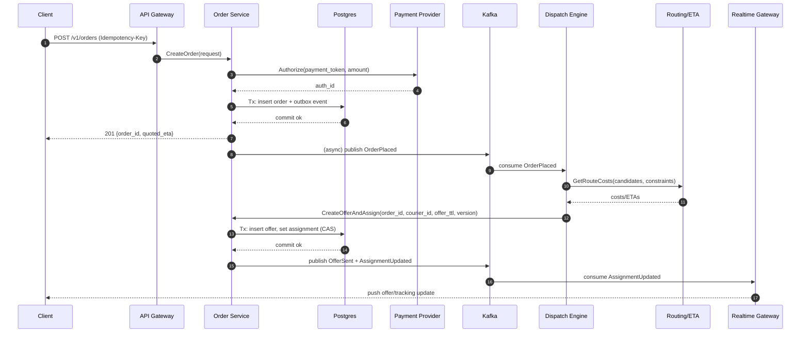
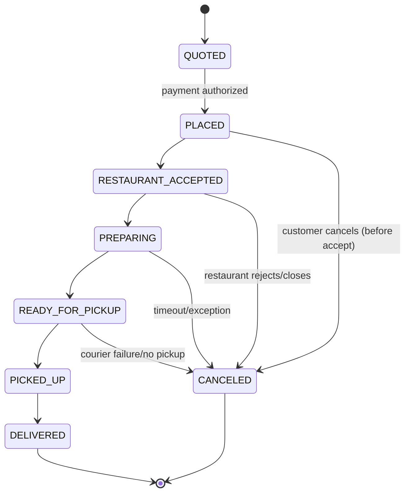

## Overview

Food delivery logistics is a real-time coordination problem across a three-sided marketplace (customers, restaurants, couriers). Conditions change continuously: courier locations move, restaurants have variable prep times, and demand spikes are bursty. The core problem is making fast, high-quality assignment and routing decisions (which courier handles which order(s), and in what stop sequence) while meeting SLAs (ETA, freshness), minimizing cost (distance, idle time), and maintaining fairness and reliability at very high event rates (location updates).

A production-ready design benefits from separating:
- **Transaction plane (correctness)**: orders, payments, refunds, and canonical state transitions (strong consistency, clear invariants).
- **Optimization plane (speed + adaptivity)**: dispatch, batching, ETA/routing, and re-optimization (event-driven, bounded staleness tolerated).

The optimization plane continuously computes decisions from near-real-time signals and applies them through **idempotent** state transitions. This avoids blocking checkout while still reacting quickly to volatility.

---

## Requirements

### Functional Requirements
- **Order lifecycle**: quote fee/ETA, create order, authorize/capture payment, cancel, refund, complete.
- **Restaurant workflow**: accept/reject, prep-time updates, “ready for pickup” events.
- **Courier workflow**: online/offline, heartbeat, location streaming, receive offers (single/batched), accept/reject, pickup/deliver confirmation.
- **Dispatch & batching**: assign orders to couriers, optionally batch 2–3 orders per trip under constraints (max detour, max food wait, time windows).
- **Routing & ETA**: compute stop sequence (pickup(s) → dropoff(s)), continuously update ETA using traffic and prep signals.
- **Realtime tracking**: push courier location/status/ETA to customer and restaurant.
- **Exceptions**: courier rejects/cancels, restaurant delays/closes, customer cancels, no-shows; re-dispatch with minimal disruption.
- **Auditability**: immutable event history for support, dispute resolution, and model improvement.

### Non-Functional Requirements

#### Scale (Concrete Targets)
Assume a global product with regional (metro) dispatch ownership.

- **Users**: 10M MAU, 1M DAU
- **Orders**:
  - Global peak: **2,000 orders/sec** (e.g., dinner peaks across time zones)
  - Large metro peak: **50k orders/hour ≈ 14 orders/sec**
- **Couriers**:
  - 200k online globally at peak
  - Location updates: **1 Hz typical**, bursty to 2–3 Hz during navigation changes
  - Ingestion peak budget: **300k location events/sec** (headroom for bursts + retries)
- **Writes (non-location domain events)**:
  - Order/offer/status changes: **50k events/sec peak** globally (offers, accepts, state transitions)
- **Read patterns**:
  - Tracking reads mostly via realtime; fallback polling: **<10%** of active sessions

#### Latency (P99)
- **Quote + place order**: P99 **< 300ms** for platform processing (excluding external payment provider latency)
- **Dispatch decision** (order eligible → offer created): P99 **< 1s** within a metro
- **Realtime tracking update** (location received → pushed update): P99 **< 2s**
- **ETA freshness**: bounded staleness **≤ 5s** in normal operation

#### Availability (SLOs)
- **Checkout (order placement + payment)**: **99.99%**
- **Dispatch pipeline (offer creation)**: **99.95%**
- **Realtime tracking**: **99.95%** (degrades to polling if needed)

#### Consistency Model
- **Strong consistency** for order/payment state transitions and uniqueness invariants (e.g., “at most one active assignment per order”).
- **Eventual consistency** (bounded staleness) for courier locations, ETAs, heatmaps, and ranking signals.
- **User-perceived exactly-once** for checkout and accept flows via idempotency + state machine constraints (not literal exactly-once delivery).

#### Durability / Data Loss
- **Orders/payments**: RPO ~ **0** for committed transactions (durable WAL + replication).
- **Location telemetry**: tolerate limited loss under overload (e.g., **≤1–2%** during transient network or backpressure) while keeping “latest known location” accurate.

### Constraints & Assumptions
- Multi-region deployment; **dispatch is regional (per metro)** to minimize latency and localize state.
- External maps/traffic providers may be rate-limited; must cache and degrade gracefully.
- Team can operate Kafka-like messaging and Redis-like caches; prefer standard, well-known components.
- PCI scope minimized: payment tokens handled via payment processor; PII encrypted at rest; access audited.

---

## Architecture

### High-Level Diagram (Planes + Data Stores)

```mermaid
flowchart TB
  %% Clients
  C[Customer App] --> G[API Gateway]
  R[Restaurant App/Tablet] --> G
  U[Courier App] --> G

  %% Transaction plane
  subgraph TP[Transaction Plane (Strong Consistency)]
    G --> OS[Order Service]
    G --> RSvc[Restaurant Service]
    G --> CSvc[Courier Service]
    OS --> PG[(Postgres)]
    OS --> OB[(Outbox Table)]
    PS[Payment Provider] <--> OS
  end

  %% Event bus
  OB --> PUB[Outbox Publisher]
  PUB --> K[(Kafka / Event Bus)]

  %% Optimization plane
  subgraph OP[Optimization Plane (Real-Time Optimization)]
    K --> LS[Location Ingest]
    LS --> K
    K --> DE[Dispatch Engine]
    DE --> RED[(Redis Cluster)]
    DE --> RT[Routing/ETA Service]
    RT --> MAPS[Maps/Traffic API]
    DE --> OS
  end

  %% Realtime delivery
  subgraph RP[Realtime Plane]
    K --> RG[Realtime Gateway]
    RG --> C
    RG --> R
    RG --> U
    PN[APNs/FCM] <--> RG
  end
```

### Key Architectural Principles
- **Outbox pattern**: emit events transactionally with DB commits; publisher retries until published.
- **Event-driven optimization**: dispatch consumes signals and computes decisions without blocking order placement.
- **Idempotent application of decisions**: dispatch writes via Order Service with compare-and-swap semantics to avoid races.
- **Bounded optimization**: strict time budgets; degrade gracefully to heuristics under load.

---

## Core Workflows

### Order Placement → Dispatch → Offer



### Order State Machine (Canonical)



---

## Components

### API Gateway
- AuthN/AuthZ, rate limits, request shaping, regional routing (geo + account region), idempotency-key normalization, and request logging.
- Prefer **regional affinity** (client connects to nearest metro region) to keep offer/tracking latency low.

### Order Service (Canonical Correctness)
**Responsibilities**
- Order lifecycle, fees, promotions, payments (authorize/capture/refund), refunds/chargebacks hooks, and invariants.
- Owns canonical assignment state (which courier/batch is active) and offer lifecycle.

**Key design choices**
- **Strict state machine** with DB-enforced constraints.
- **Idempotent endpoints**: `Idempotency-Key` for create-like actions; natural idempotency for accept/reject via `(offer_id, version)`.
- **Outbox** for reliable event emission.
- **CAS updates** for assignment: update only if `assignment_version` matches expected.

**Data integrity invariants (examples)**
- At most one `ACTIVE` delivery per `order_id`.
- An offer acceptance is valid only if `offer.status = SENT` and `expires_at > now()` and `version` matches.

### Restaurant Service
- Restaurant availability/hours, menu/versioning (if needed), accept/reject events, prep-time updates.
- Can be merged into Order Service for early-stage systems; split when ownership/scaling demands.

### Courier Service
- Courier identity, onboarding, online/offline status, device tokens, capability flags (vehicle type, insulated bag), compliance flags.
- Issues short-lived auth tokens for courier channels (WebSocket topics, offer streams).

### Location Ingest Service
**Responsibilities**
- High-QPS ingestion of courier telemetry, validation (bounds, jitter), normalization, and publication to bus.
- Maintains “latest known location” and “couriers by cell” membership in Redis.

**Design choices**
- **Lossy under overload**: keep newest per courier per 1–2 seconds; drop older queued updates.
- **Geospatial bucketing** using H3/S2 cells; update membership with TTL to evict silent couriers.

### Dispatch Engine (Assignment + Batching)
**Responsibilities**
- Match eligible orders to couriers, create offers, re-dispatch on failures, and manage batching windows.
- Produces decisions with bounded compute time and fairness constraints.

**Algorithmic approach (practical online dispatch)**
1. **Candidate generation (fast)**:
   - Lookup nearby couriers via H3 cells + radius expansion.
   - Filter by constraints: vehicle type, max distance to pickup, current capacity, last-seen freshness, acceptance rate.
   - Cap candidates (e.g., top **50** by rough score).
2. **Scoring & feasibility (bounded)**:
   - Compute travel-time estimates (cached legs) to pickup/dropoff.
   - Apply constraints: max detour, pickup SLA, freshness window, batching compatibility.
3. **Selection**:
   - Choose best candidate using weighted score: ETA, cost, fairness, reliability.
   - Create offer as a **lease** (TTL 20–30s). If expired or rejected, iterate next candidates.
4. **Re-optimization**:
   - On prep delays, courier drift, new high-priority orders: re-score, possibly reassign if still unpicked and policy allows.

**Fairness / anti-gaming**
- Introduce a bounded “fairness term” to avoid starving new couriers or overloading top performers.
- Detect and penalize suspicious patterns (e.g., frequent go-online near hotspots only when surge).

### Routing/ETA Service
**Responsibilities**
- Route costs (travel-time matrix) and stop sequencing for single and batched routes.
- ETA updates driven by location and prep events.

**Design choices**
- Cache route legs `(cellA, cellB, time_bucket)` TTL 60–180s.
- Use incremental recomputation for remaining legs (avoid full recompute on every tick).
- Graceful degradation: if maps API unavailable, fallback to historical speeds + straight-line correction.

### Realtime Gateway
**Responsibilities**
- Fanout updates via WebSockets; fallback to push notifications (APNs/FCM) and polling.
- Provides ordered streams per channel (order/courier) with sequence numbers.

**Delivery semantics**
- At-least-once delivery; clients de-duplicate using `seq`.
- When disconnected, clients can resync via `GET /tracking` + `since_seq`.

---

## Data Model

### Postgres (Canonical)

**Recommended tables (minimal but production-oriented)**
- `orders`
  - `order_id (PK)`, `customer_id`, `restaurant_id`, `region_id`
  - `status`, `created_at`, `updated_at`
  - `subtotal_cents`, `delivery_fee_cents`, `currency`
  - `dropoff_lat`, `dropoff_lng`
  - `quoted_eta_seconds`, `sla_deadline_ts`
  - `idempotency_key` (unique per customer scope), `assignment_version` (int)
- `order_items`
  - `order_id (FK)`, `sku`, `qty`, `price_cents`
- `deliveries`
  - `delivery_id (PK)`, `order_id (FK unique where active)`, `courier_id (nullable)`
  - `batch_id (nullable)`, `status`, `assigned_at`, `picked_up_at`, `delivered_at`
- `offers`
  - `offer_id (PK)`, `order_id (FK)`, `courier_id`, `batch_id (nullable)`
  - `status` (`SENT|ACCEPTED|REJECTED|EXPIRED|CANCELED`)
  - `expires_at`, `created_at`, `version`
  - Unique constraint to prevent duplicate active offers per `(order_id)` if desired (policy-dependent)
- `batches`
  - `batch_id (PK)`, `region_id`, `status`
- `batch_stops`
  - `batch_id (FK)`, `stop_index`, `stop_type` (`PICKUP|DROPOFF`)
  - `order_id`, `lat`, `lng`, `eta_ts`
- `payments`
  - `payment_id (PK)`, `order_id (FK)`, `provider`, `provider_auth_id`, `provider_capture_id`
  - `status`, `amount_cents`, `currency`, `created_at`
- `outbox_events`
  - `event_id (PK)`, `aggregate_type`, `aggregate_id`
  - `event_type`, `payload_json`, `created_at`, `published_at`
  - Index on `(published_at NULLS FIRST, created_at)` for efficient publishing

**Indexes / constraints (examples)**
- `orders(region_id, created_at)` for regional queries.
- `offers(courier_id, status, created_at)` to debug courier experience.
- Partial uniqueness: only one active assignment per order (implementation depends on delivery model).

### Redis (Ephemeral / Hot State)
- `courier:last_location:{courier_id} -> {lat,lng,ts,heading,speed_mps}`
- `cell:couriers:{h3_cell} -> set(courier_id)` with per-member TTL pattern (or periodic refresh strategy)
- `dispatch:offer_lease:{offer_id} -> ttl`
- `dispatch:courier_state:{courier_id} -> {online,last_seen,capacity,active_batch_id,...}`

### Kafka (Event Stream)
Topics (versioned schemas; Protobuf/Avro + registry recommended):
- `orders.events.v1` (OrderPlaced, OrderCanceled, StatusChanged)
- `restaurants.events.v1` (Accepted, Rejected, PrepTimeUpdated, ReadyForPickup)
- `couriers.location.v1` (LocationUpdated, Heartbeat)
- `dispatch.events.v1` (OfferSent, OfferAccepted, OfferExpired, AssignmentUpdated)
- `eta.updates.v1` (EtaUpdated)

**Partitioning guidance**
- Location topic: partition by `region_id` and `courier_id` (composite key) to preserve per-courier ordering.
- Order/dispatch topics: partition by `region_id` and `order_id` to keep per-order ordering within a region.

---

## API Design

### External (REST)

#### Create Order
`POST /v1/orders`  
Headers: `Idempotency-Key: <uuid>`  
Request:
```json
{
  "restaurant_id": "r_123",
  "items": [{"sku":"burger","qty":1}],
  "dropoff": {"lat": 37.78, "lng": -122.41},
  "payment_token": "tok_xxx"
}
```
Response `201`:
```json
{
  "order_id": "o_456",
  "status": "PLACED",
  "delivery_fee_cents": 399,
  "quoted_eta_seconds": 2100
}
```
Errors:
- `409` idempotency conflict (same key, different payload)
- `402` payment failed
- `422` out of service area / restaurant closed

#### Restaurant Accept / Reject
`POST /v1/restaurants/{restaurant_id}/orders/{order_id}:accept`
```json
{"estimated_prep_seconds": 900}
```
`POST /v1/restaurants/{restaurant_id}/orders/{order_id}:reject`
```json
{"reason": "OUT_OF_STOCK"}
```

#### Courier Location Update
`POST /v1/couriers/{courier_id}/location`  
Response: `202 Accepted`  
Request:
```json
{"lat":37.78,"lng":-122.41,"ts":"2025-12-17T12:00:00Z","heading":120,"speed_mps":8.2}
```
Notes:
- Rate-limited per courier; clients should coalesce updates on poor networks.
- Server may downsample; latest location is prioritized.

#### Courier Offer Actions
`POST /v1/couriers/{courier_id}/offers/{offer_id}:accept`
```json
{"version": 3}
```
`POST /v1/couriers/{courier_id}/offers/{offer_id}:reject`
```json
{"version": 3, "reason": "TOO_FAR"}
```
Semantics:
- Idempotent by `(offer_id, version)`; returns `409` on stale version.

#### Order Tracking (Fallback to Polling)
`GET /v1/orders/{order_id}/tracking`  
- Cacheable for a few seconds (`Cache-Control: private, max-age=3`) and supports `ETag`.
- Response includes `seq` to support client de-duplication/resync:
```json
{
  "order_id": "o_456",
  "status": "PICKED_UP",
  "eta_seconds": 540,
  "courier": {"lat": 37.781, "lng": -122.409, "ts": "2025-12-17T12:22:10Z"},
  "seq": 184
}
```

### Internal (gRPC)

#### RoutingService.GetRouteCosts
Inputs: courier location(s), pickup/dropoff points, constraints (max detour, time windows), time bucket  
Outputs: bounded travel-time matrix + feasible sequences + ETA deltas

#### DispatchService.ApplyDecision (via Order Service)
Prefer a transactional API owned by the canonical service:
- `CreateOfferAndAssign(order_id, courier_id, offer_ttl, expected_assignment_version)`
- Returns conflict if assignment_version has advanced.

### Error Handling
- Typed error codes: `INVALID_ARGUMENT`, `FAILED_PRECONDITION`, `RESOURCE_EXHAUSTED`, `NOT_FOUND`, `ALREADY_EXISTS`.
- Every state-changing endpoint supports idempotency (key or natural idempotency).

---

## Scaling & Performance

### Back-of-the-Envelope Capacity Planning
- **Location ingest** at 300k events/sec:
  - Small payloads (e.g., 100–300 bytes) → ~30–90 MB/s raw ingress plus overhead.
  - Requires careful batching, compression, and partition scaling.
- **Dispatch compute**:
  - If 2,000 orders/sec peak globally and dispatch is regional, per-metro peaks are smaller (e.g., 10–50 orders/sec).
  - With candidate cap 50 and a 50–150ms compute budget, dispatch must be heavily optimized and parallelized per region.

### Bottlenecks and Mitigations
- **Location ingestion**:
  - Partitioned Kafka topics, stateless ingest autoscaling, coalescing newest-per-courier.
  - Backpressure: bounded queues; shed telemetry before impacting checkout.
- **Dispatch spikes**:
  - Candidate caps, bounded optimization time, degrade batching first, then degrade to greedy assignment.
  - Precompute hotspot cell couriers; maintain in Redis for O(1) candidate fetch.
- **Maps dependency**:
  - Aggressive caching of route legs; asynchronous refresh.
  - Fallback to historical speeds and simple distance heuristics.

### Horizontal Scaling Strategy
- **API layer**: stateless scale-out; regional routing by user geo + region_id.
- **Kafka**: scale partitions by topic; ensure enough partitions per region to parallelize consumers.
- **Dispatch Engine**: shard by `region_id` and optionally by H3 cell ranges; consumer partition ownership keeps local state hot.
- **Postgres**:
  - Primary per region (active/standby), read replicas for support/analytics queries.
  - Consider partitioning large tables by `region_id` and time for retention and performance.
- **Redis**: clustered; key design with region prefixes/hash tags to reduce cross-slot operations.

### Caching Strategy
- **Route legs cache**: `(cellA, cellB, time_bucket)` TTL 60–180s.
- **Active courier sets**: `cell:couriers:*` with TTL-based eviction for silent clients.
- **Tracking**: WebSockets preferred; polling endpoints allow short TTL caching.

Correctness-critical data (payments, order state, assignments) is never solely cache-backed.

---

## Consistency, Concurrency, and Correctness

### Exactly-Once User Experience (Practical)
- **Idempotency keys** for `POST /orders` prevent double orders on retries.
- **Outbox** ensures each committed order produces an event eventually.
- **CAS assignment** via `assignment_version` prevents double assignment even under concurrent dispatchers.

### Ordering Guarantees
- Per-order ordering is maintained by:
  - Kafka partitioning by `order_id` (within region), and
  - Canonical state machine in Postgres (reject out-of-order transitions).

### Handling Races
Common races (and defenses):
- Two dispatch workers attempt to assign the same order → DB CAS fails for one.
- Courier accepts after offer expired → accept rejected by `expires_at` + status check.
- Restaurant rejects after courier assigned → policy-driven cancellation + re-dispatch, with clear audit events.

---

## Trade-offs & Alternatives

### Key Trade-offs
1. **Event-driven optimization plane**
   - Gain: isolates high-QPS telemetry and complex dispatch from checkout reliability and latency.
   - Cost: eventual consistency; more operational complexity (topics, consumers, replay).
2. **Heuristics + bounded optimization**
   - Gain: predictable P99 under strict time budgets; robust under volatile inputs.
   - Cost: not globally optimal; needs tuning and offline evaluation.
3. **Regional sharding**
   - Gain: low latency, smaller state, limited blast radius, simpler fairness/local policies.
   - Cost: cross-region pooling is harder; regional capacity planning complexity.
4. **Redis hot state**
   - Gain: sub-second candidate lookup and offer leases.
   - Cost: requires careful fallback and operational maturity; risk of stale data.

### Alternatives (When to Consider)
- **Pure greedy nearest-courier**: acceptable for MVP or low density; performs poorly at scale with batching and fairness.
- **Centralized global dispatcher**: simpler conceptual model; high latency and large incident blast radius.
- **Client-driven dispatch (“courier chooses”)**: reduces server compute; invites gaming, inconsistent SLAs, and weak auditability.
- **Precomputed travel-time graph (own maps)**: reduces third-party dependency; heavy investment and ongoing cost.

---

## Failure Modes & Mitigations

### Failure Scenarios (At Least 3)

1. **Kafka lag or partition outage in a region**
   - Impact: delayed dispatch decisions, stale ETAs.
   - Detection: consumer lag metrics, “order unassigned age” SLO, topic under-replication.
   - Mitigation:
     - Regional isolation (topics/clusters by region or strong partitioning).
     - Auto-scale consumers; prioritize critical topics (orders/dispatch) over telemetry.
     - Emergency mode: synchronous “minimal dispatch” reading from DB + Redis for newly placed orders only (no batching).

2. **Redis degradation/unavailability**
   - Impact: candidate lookup slows; dispatch latency increases; leases unavailable.
   - Detection: Redis error rate/latency, dispatch compute time, cache miss spikes.
   - Mitigation:
     - Fallback candidate generation from last-known courier snapshots in memory + periodic refresh from DB.
     - Shed batching first; assign single orders; reduce candidate radius/cap.
     - Circuit breaker around Redis-dependent paths.

3. **Maps/traffic provider outage or throttling**
   - Impact: ETA quality degrades; routing may be suboptimal; batching constraints harder.
   - Detection: provider error rates, increased fallback usage, cache hit drop.
   - Mitigation:
     - Use cached legs and historical speed models.
     - Degrade batching: tighten max detour; avoid multi-pickup sequences requiring precise costs.
     - Queue and retry non-urgent recomputations asynchronously.

4. **Double assignment / inconsistent state due to retries**
   - Impact: two couriers show up; direct cost + trust loss.
   - Detection: invariant checks (one active delivery per order), anomaly alerts, audit queries.
   - Mitigation:
     - DB constraints + CAS with `assignment_version`.
     - Offers as leases with explicit statuses; accept validates status + expiry + version.

5. **Courier app silent but marked online**
   - Impact: bad assignments, missed pickups, inaccurate ETAs.
   - Detection: heartbeat staleness metrics, location last-seen age distribution.
   - Mitigation:
     - TTL eviction from active sets; downgrade/disable courier if stale.
     - Require periodic heartbeat; re-auth on reconnection.

### Disaster Recovery
- Targets: **RTO 15 minutes per region**, **RPO ≤ 1 minute** for transactional data.
- Postgres: streaming replication + PITR; regular restore drills.
- Kafka: replication factor appropriate for SLA; retention 7–14 days for replay/audit.
- Redis: treated as reconstructible; rebuild from Kafka replay + snapshots of “online couriers”.

---

## Operations

### Monitoring & Alerting (SLO-Driven)
Core SLOs:
- Checkout success rate and P99 latency
- Dispatch decision latency P50/P99; unassigned-age histogram
- Offer acceptance/reject/expire rates; time-to-accept distribution
- ETA accuracy (predicted vs actual), SLA miss rate, cancellation rate (by reason)

Infrastructure signals:
- Kafka consumer lag, ISR/under-replication, broker disk
- Postgres replication lag, lock contention, slow queries
- Redis latency, evictions, memory fragmentation
- Maps provider quota, error bursts, fallback rate
- WebSocket connected clients, message backlog, push notification failures

### Deployment & Rollout
- Canary + feature flags for dispatch/routing algorithms and scoring weights.
- Shadow mode for new optimizers (compute but do not apply); compare offline.
- Backward-compatible event schemas (versioning + registry); safe consumers that ignore unknown fields.

### Runbooks (Examples)
- “Kafka lag rising”: scale consumers, verify partitions, reduce telemetry throughput (sampling), pause non-critical consumers.
- “Redis partial outage”: enable dispatch degraded mode (single-order only), reduce candidate radius, increase TTLs cautiously.
- “Maps outage”: force fallback ETA mode, disable batching features that depend on accurate travel-time matrices.

### Data Retention & Privacy
- Orders/payments/audit events: retain per compliance needs (often years).
- Location history: retain minimally (e.g., 7–30 days) with strict access control; aggregate for analytics.
- Encrypt PII at rest; field-level encryption for sensitive fields; audit access.

---

## References & Further Reading
- Google OR-Tools (Vehicle Routing Problem): https://developers.google.com/optimization
- Uber Engineering (dispatch/marketplace systems): https://www.uber.com/blog/engineering/
- DoorDash Engineering (dispatch/logistics): https://doordash.engineering/
- H3 Geospatial Indexing: https://h3geo.org/
- Designing Data-Intensive Applications (Kleppmann): event streams, consistency, state machines
- Kafka patterns: Outbox, consumer lag, schema evolution (Avro/Protobuf + schema registry)