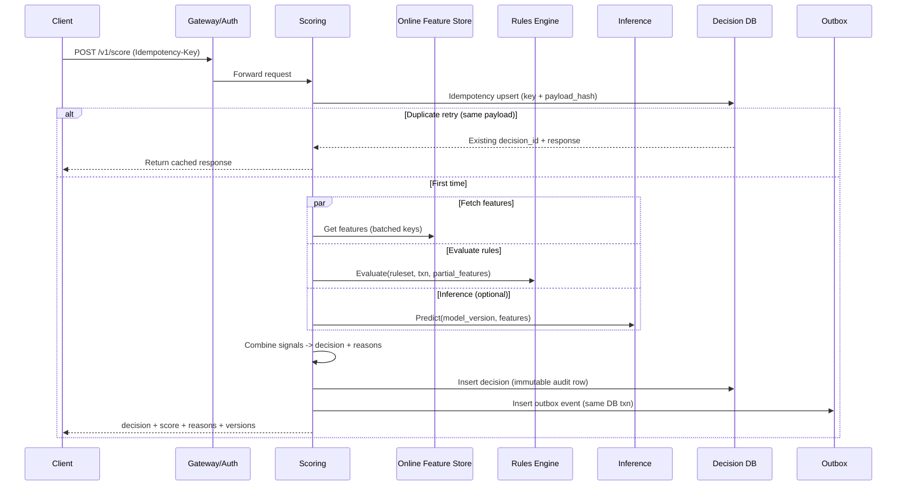
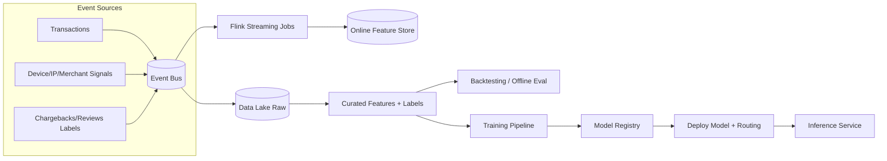

# Fraud Detection Pipeline

## Overview

A real-time fraud detection pipeline scores card and account-to-account transactions within milliseconds using a hybrid of deterministic rules and probabilistic machine learning (ML). The core challenge is producing high-quality decisions under tight latency budgets while ingesting high-throughput event streams, joining against rapidly changing behavioral signals, and remaining resilient to partial outages (feature sources, model servers, stream backlogs).

A production-ready design separates:
- **Online decisioning (fast path):** synchronous scoring with strict timeouts and graceful degradation.
- **Feature computation and learning (async paths):** streaming aggregation and offline training/backtesting that improve quality without destabilizing real-time performance.

This document focuses on an interview-ready, realistic architecture that prioritizes **tail latency**, **auditability**, **safe rollouts**, and **operational resilience**.

---

## Requirements

### Functional Requirements
- Score every transaction in real time and return:
  - `decision` ∈ `ALLOW | CHALLENGE | DENY`
  - `risk_score` ∈ `[0, 1]`
  - human/actionable `reason_codes`
- Support a **versioned rules engine**:
  - authoring, unit tests, backtests, staged rollout, audit trail, instant rollback
- Compute **near-real-time features**:
  - velocity (spend/count), device reputation, merchant risk, geo anomalies, graph signals
- Perform **online ML inference**:
  - model versioning, shadow evaluation, A/B experiments, fast rollback
- Persist **auditable decision records**:
  - decision, score, reasons, rules/model versions, feature schema/version, feature digest
- Provide **case management hooks**:
  - queue suspicious events, analyst annotations, disposition outcomes, exports
- Ingest post-transaction outcomes as labels:
  - chargebacks, confirmed fraud, manual review outcomes
- Provide monitoring and alerting:
  - latency, availability, dependency health, drift, feature freshness, rollout safety

### Non-Functional Requirements (SLOs)
- **Traffic**
  - Steady: **5,000 TPS**
  - Burst: **50,000 TPS** (5–10 minutes)
  - Daily events: **1–3B/day** (transactions + signals)
- **Latency (end-to-end, client → decision)**
  - P50 **< 30ms**
  - P99 **< 120ms**
  - Suggested internal budgets (P99):
    - gateway/auth: 5ms
    - feature fetch: 20–30ms (including cache misses)
    - rules eval: 5ms
    - inference: 20ms
    - decision persistence (async-safe): 10–20ms
- **Availability**
  - Scoring API: **99.99%** monthly (multi-AZ per region)
  - Feature freshness (streaming): **99.9%** for “core” features (velocity/device), best-effort for long-tail
- **Durability / Audit**
  - Decision record durable: **RPO ≤ 1 minute**, **RTO ≤ 30 minutes**
  - No silent loss of scored decisions/events (use outbox/replayable logs)
- **Consistency**
  - **Strong consistency (per region)** for idempotency and decision persistence
  - **Eventual consistency** for derived features/labels and cross-region replication
- **Security & Compliance**
  - Minimize PCI scope: store only **tokenized PAN**; never log raw PAN
  - PII encrypted at rest, strict RBAC/ABAC, audited access
  - Deterministic, explainable outputs for disputes and regulator/partner audits

### Capacity & Sizing Estimates (Concrete)
Assumptions (tunable, used for back-of-the-envelope sizing):
- Average scoring request payload: **1–2 KB**
- Average feature vector fetched online: **5–20 KB** (e.g., 150–400 features with compact encoding)
- Decision record (audit): **1–3 KB** (including reason codes, digests, versions)
- Event bus overhead per scored event: **1–3 KB**

Implications:
- Burst ingress at 50k TPS:
  - inbound bandwidth ~ **50–100 MB/s**
  - scored event egress ~ **50–150 MB/s**
- Decision store write rate:
  - steady ~5k writes/s, burst ~50k writes/s (often batched/async via outbox)

### Constraints & Assumptions
- Multi-region (2 regions), multi-AZ per region.
- **Region-affine scoring:** a transaction is scored in its ingress region; cross-region calls are avoided on the online path.
- Third-party risk providers are unreliable/slow; online scoring must not hard-depend on them.
- Team size 6–10 engineers: prefer managed components; require safe iteration for rules/models.

---

## Architecture

### Design Principles
- **Hard latency budgets** with per-dependency timeouts and circuit breakers.
- **Fail-safe behavior is policy-driven:** per-tenant config for fail-open vs fail-closed when dependencies degrade.
- **Audit-first:** persist what was decided, why, and with which versions.
- **Control plane vs data plane separation:** rule/model management must not impact online scoring stability.
- **Replayable events:** asynchronous systems must recover via replay, not ad-hoc fixes.

### High-Level Diagram

```mermaid
flowchart TB
  %% Data plane (online)
  subgraph Online[Online Decisioning (Data Plane)]
    C[Client / Payment Processor] --> WAF[WAF + DDoS]
    WAF --> GW[API Gateway]
    GW --> AUTH[AuthN/Z + Rate Limits]
    AUTH --> SCORE[Scoring Service]

    SCORE --> RULES[Rules Engine\n(in-proc/sidecar)]
    SCORE --> OFS[(Online Feature Store\nRedis + KV)]
    SCORE --> INF[Inference Service\n(gRPC)]
    SCORE --> LEDGER[(Decision Store)]
    SCORE --> OUTBOX[(Outbox Table)]
  end

  %% Async backbone
  subgraph Async[Async Backbone]
    OUTBOX --> PUB[Outbox Publisher]
    PUB --> BUS[(Event Bus\nKafka/Pulsar)]

    BUS --> STREAM[Streaming Features\nFlink]
    STREAM --> OFS

    BUS --> LAKE[(Data Lake\nIceberg/Delta)]
    LAKE --> TRAIN[Training + Backtesting]
    TRAIN --> REG[Model Registry]
    REG --> ART[(Artifact Store)]
    ART --> INF
  end

  %% Control plane
  subgraph Control[Control Plane]
    RULEUI[Rules UI/API] --> RULEDB[(Rules Metadata DB)]
    RULEDB --> BUNDLE[(Signed Rules Bundles)]
    BUNDLE --> SCORE
    EXP[Experiment/Routing Config] --> SCORE
  end

  %% Ops
  subgraph Ops[Observability & Ops]
    SCORE --> O11Y[Logs/Metrics/Traces]
    INF --> O11Y
    STREAM --> O11Y
    OFS --> O11Y
  end
```

### Online Request Lifecycle (Fast Path)



### Feature & Learning Lifecycle (Async Paths)



---

## Components

### API Gateway + Auth + Rate Limiting
**Responsibilities**
- Authentication/authorization (mTLS for internal, OAuth/JWT for external partners)
- Rate limiting and abuse protection
- Request normalization and schema validation

**Key decisions**
- Validate payload early to prevent downstream work on malformed inputs.
- Enforce per-tenant quotas and burst controls (token bucket).

**Typical tech**
- Managed gateway + Envoy; WAF; centralized policy (OPA/Cedar) for admin endpoints.

---

### Scoring Service
**Responsibilities**
- Orchestrate feature fetch, rules evaluation, ML inference, decisioning, and response composition.
- Enforce budgets, retries (limited), and degradation.
- Emit auditable events via outbox.

**Key design decisions**
- **Strict latency budget** with dependency timeouts and hedging only where safe.
- **Idempotency** to prevent duplicate decisions/charges:
  - Unique key `(tenant_id, transaction_id)` plus `Idempotency-Key`
  - Store `payload_hash` and the serialized response for safe replay
- **Deterministic decisioning**:
  - Same inputs + same versions → same output (critical for disputes)

**Scaling**
- Stateless horizontal scaling, autoscale on concurrency + tail latency.
- Keep hot config (rules bundle, routing) in memory with safe hot-reload.

---

### Rules Engine
**Responsibilities**
- Deterministic policy checks: thresholds, allow/deny lists, step-up triggers, compliance rules.
- Produce explainable outputs (`reason_codes`, matched rule IDs).

**Key design decisions**
- Rules are **versioned and signed** artifacts, evaluated locally (in-process or sidecar) to minimize latency.
- Rollout stages:
  - `DRAFT` → `SHADOW` (log only) → `CANARY` (enforce small %) → `ACTIVE` → `ROLLED_BACK`

**Tech choices**
- CEL or OPA/Rego (with careful performance profiling); store metadata in Postgres; bundles in object storage/CDN.

---

### Online Feature Store
**Responsibilities**
- Serve low-latency feature vectors for entities: account, card, device, merchant, IP, payee.

**Key design decisions**
- Separate:
  - **Hot, mutable features** (velocity counters, recent behavior): Redis Cluster
  - **Warm, durable features** (reputation, stable aggregates): DynamoDB/Cassandra-class KV
- Versioning:
  - `feature_schema_version` in every score request/decision record
  - Store features under versioned keys to avoid semantic drift during rollouts

**Operational details**
- Batched multi-get reads (avoid N+1 fetch).
- Track missing-feature rate; define “core” features that must exist vs optional enrichments.

---

### Model Inference Service
**Responsibilities**
- Serve fraud probability models (and optional secondary models) with versioning and routing.

**Key design decisions**
- Prefer **fast models** for online scoring:
  - GBDT/LightGBM or distilled neural nets with bounded compute
- **Strict schema contract** for features:
  - Validate feature presence/types; defaulting rules must be explicit and versioned
- Rollout:
  - Shadow evaluation and A/B with per-request assignment and logging of predictions

**Tech choices**
- Triton/TF Serving/TorchServe; gRPC; model artifacts pulled from a registry/artifact store; aggressive warm-up.

---

### Event Bus
**Responsibilities**
- Decouple online scoring from streaming computation and offline analytics.
- Provide replay for recovery and backfills.

**Key design decisions**
- Use schemas (Protobuf/Avro) with compatibility guarantees.
- Partitioning strategy:
  - For feature computation: key by `account_id`/`card_id` to co-locate state
  - For audit/events: key by `transaction_id` for ordering per transaction (optional)

**Typical topics**
- `txn.ingested.v1`, `txn.scored.v1`, `signals.device.v1`, `labels.chargeback.v1`, `cases.events.v1`

---

### Streaming Feature Pipeline
**Responsibilities**
- Consume streams and compute aggregates (velocity, reputations, anomaly signals) written to the online store and lake.

**Correctness model**
- Use **event time + watermarks** with bounded lateness (e.g., 5 minutes).
- Exactly-once is feasible only for certain sinks (e.g., Kafka transactional sinks). For Redis/KV sinks:
  - Use **at-least-once** + **idempotent upserts** (monotonic `updated_at`, deterministic window keys)
  - Periodic reconciliation jobs for critical aggregates

**Tech choices**
- Kafka/Pulsar + Flink; RocksDB state; schema registry; checkpointing tuned to meet freshness.

---

### Data Lake + Offline Analytics
**Responsibilities**
- Immutable raw event storage and curated datasets for training, backtesting, and audits.

**Key design decisions**
- Iceberg/Delta tables partitioned by `event_date` and `tenant_id`.
- Preserve lineage:
  - model version ↔ training dataset snapshot ↔ code/config ↔ feature schema

---

### Training, Backtesting, and Model Registry
**Responsibilities**
- Build training datasets, train models, run offline evaluation, publish models with metadata.

**Key design decisions**
- A model cannot be promoted without:
  - offline metric gates (AUC/PR, calibration, segment performance)
  - backtest against historical traffic (including rule interactions)
  - online shadow comparison stability window

**Registry metadata**
- `model_version`, feature schema, training window, evaluation metrics, responsible owner, rollback pointer.

---

### Case Management (Optional but Common)
**Responsibilities**
- Queue suspicious transactions, support analyst workflows, capture outcomes for labels.

**Key design decisions**
- Separate case UI/service from scoring to prevent UI load from impacting latency SLOs.
- Outcomes flow back via `labels.*` topics.

---

## Data Model

### Decision Store (Postgres / CockroachDB)
A relational store is used for strong per-region consistency on idempotency and immutable audit records.

**Tables (illustrative)**

- `idempotency_keys`
  - `tenant_id` (string)
  - `transaction_id` (string)
  - `idempotency_key` (string)
  - `payload_hash` (bytes/string)
  - `decision_id` (UUID)
  - `response_json` (jsonb) — optional, to return exact prior response
  - `created_at` (timestamp)
  - **Unique**: `(tenant_id, transaction_id, idempotency_key)`

- `decisions`
  - `decision_id` (UUID, PK)
  - `tenant_id` (string)
  - `transaction_id` (string)
  - `created_at` (timestamp)
  - `decision` (enum: ALLOW/CHALLENGE/DENY)
  - `risk_score` (float)
  - `reason_codes` (jsonb array)
  - `rules_version` (string)
  - `model_version` (string, nullable when rules-only)
  - `feature_schema_version` (string)
  - `features_digest` (string) — hash of canonicalized feature vector
  - `latency_ms` (int)
  - `degradation_flags` (jsonb) — e.g. `{"inference_timeout":true}`
  - Indexes: `(tenant_id, transaction_id)`, `(created_at)`

- `outbox_events`
  - `event_id` (UUID, PK)
  - `event_type` (string) — e.g. `txn.scored.v1`
  - `aggregate_key` (string) — e.g. `transaction_id`
  - `payload` (jsonb/protobuf bytes)
  - `created_at` (timestamp)
  - `published_at` (timestamp, nullable)

- `rulesets`
  - `rules_version` (string, PK)
  - `status` (enum: DRAFT/SHADOW/CANARY/ACTIVE/ROLLED_BACK)
  - `bundle_uri` (string)
  - `created_by` (string)
  - `created_at` (timestamp)
  - `change_summary` (text)

### Online Feature Store
**Keying**
- Warm features (KV):
  - Key: `entity:{type}:{id}:schema:{feature_schema_version}`
  - Value: compact map/struct with `updated_at` per feature group
- Hot counters (Redis):
  - `cnt:{entity_type}:{entity_id}:{window}` → integer
  - `amt:{entity_type}:{entity_id}:{window}` → integer (minor units)

**TTL guidance**
- Velocity windows: align TTL with window + buffer (e.g., 24h window → TTL 30h)
- Reputation: 30–180 days depending on policy
- Device/IP risk: shorter TTL if signals are volatile

### Event Schemas (Conceptual)
- `txn.ingested.v1`: raw request + normalized fields + ingestion metadata
- `txn.scored.v1`: decision + versions + digests + latency + degradation flags
- `signals.*.v1`: device/IP/merchant signals with event time
- `labels.*.v1`: outcomes with source and timestamp
- `cases.events.v1`: case lifecycle transitions

---

## API Design

### Online Scoring

**POST `/v1/score`**
- Headers:
  - `Idempotency-Key: <uuid>`
- Request body:
  ```json
  {
    "tenant_id": "acme-pay",
    "transaction_id": "txn_123",
    "timestamp_ms": 1730000000000,
    "amount": {"currency":"USD","value":1299},
    "payment_method": {"type":"card","token":"tok_x"},
    "merchant_id": "m_456",
    "account_id": "a_789",
    "device_id": "d_abc",
    "ip": "203.0.113.1",
    "metadata": {"channel":"web"}
  }
  ```
- Response `200`:
  ```json
  {
    "decision_id": "dec_1",
    "decision": "CHALLENGE",
    "risk_score": 0.87,
    "reason_codes": ["VELOCITY_HIGH","DEVICE_NEW","GEO_ANOMALY"],
    "rules_version": "rules_2025_01_01",
    "model_version": "fraud_xgb_v42",
    "feature_schema_version": "fs_17",
    "ttl_ms": 300000
  }
  ```

**Error handling**
- `400` invalid payload (schema/required fields)
- `401/403` auth failures
- `409` idempotency conflict (same key, different payload hash)
- `429` rate limited
- `503` scoring unavailable (only when tenant policy requires fail-closed and no safe fallback exists)

**Idempotency semantics**
- If `(tenant_id, transaction_id, Idempotency-Key)` repeats with identical `payload_hash`, return the prior response (including `decision_id`) without re-scoring.

---

### Decision Lookup

**GET `/v1/decisions/{decision_id}`**
- Returns stored decision, versions, reasons, degradation flags, and audit metadata (PII minimized).

---

### Feedback / Labels

**POST `/v1/labels`**
- Request:
  ```json
  {
    "tenant_id":"acme-pay",
    "transaction_id":"txn_123",
    "label":"FRAUD_CONFIRMED",
    "source":"chargeback",
    "occurred_at_ms":1730500000000
  }
  ```
- Idempotency: unique on `(tenant_id, transaction_id, label, source)`.

---

### Rules Management (Admin / Control Plane)

**POST `/v1/rulesets`**
- Creates a new ruleset version with metadata and bundle upload reference.

**POST `/v1/rulesets/{version}/backtest`**
- Runs backtest against a selected historical window and dataset snapshot.

**POST `/v1/rulesets/{version}/rollout`**
- Body:
  ```json
  { "stage": "CANARY", "traffic_percent": 5 }
  ```

**POST `/v1/rulesets/{version}/rollback`**
- Rolls back to the last known good active version.

**Security**
- Strong auth (SSO + RBAC), full audit trail, signed bundles, and immutable change history.

---

## Scaling & Performance

### Latency Budgeting (How to Hit P99 < 120ms)
- Enforce per-dependency timeouts and stop work when the budget is exhausted:
  - feature store: 20–30ms total (batched)
  - inference: 20ms
  - total compute (rules + glue): 5–10ms
- Prefer fewer, higher-quality features over wide fan-out to many systems.
- Keep rules evaluation local and models warmed.

### Throughput Scaling
- **Scoring service**
  - Stateless; scale on concurrent in-flight requests and tail latency.
  - Use load shedding when downstream dependencies saturate.
- **Event bus**
  - Partition count sized for burst throughput and consumer parallelism.
  - Separate topics by SLA (e.g., `txn.scored.v1` high priority; enrichment topics lower).
- **Streaming**
  - Parallelism aligned to partitions; monitor watermark delay and checkpoint duration.
  - Plan for hot keys (popular merchants/devices) with salting and hierarchical aggregation.
- **Feature store**
  - Redis Cluster for hot counters; careful memory sizing and eviction policies.
  - Durable KV partitioned by entity hash; multi-AZ replication.

### Caching Strategy
- In-process:
  - rules bundle, routing config (push invalidation + periodic refresh)
- Redis:
  - hot counters, short-lived “recent activity” features
- Micro-cache for retries/bursts:
  - 1–5s cache on `(tenant_id, transaction_id)` or `(account_id, device_id)` where safe
- Avoid stale semantics:
  - schema/version keys ensure new rules/models interpret features consistently.

### Backpressure & Overload Control
- If inference saturates:
  - limit concurrency, shed optional models, fall back to rules-only or embedded backup model
- If feature store degrades:
  - proceed with partial feature vectors and mark degradation flags
- If decision DB is stressed:
  - preserve correctness by prioritizing idempotency + decision writes; queue outbox publishing separately

---

## Trade-offs & Alternatives

### Key Trade-offs
1. **Precomputed features vs on-the-fly joins**
   - Chosen: precompute/maintain features for predictable latency
   - Cost: some features are slightly stale; added streaming complexity
2. **Hybrid rules + ML vs ML-only**
   - Chosen: rules for policy/guardrails + ML for patterns
   - Cost: two mechanisms to tune; need careful interaction testing
3. **Region-affine scoring vs global synchronous features**
   - Chosen: keep online path in-region to hit tail latency SLOs
   - Cost: cross-region features are eventually consistent; mitigated by async replication and robust local features
4. **At-least-once streaming to KV vs strict exactly-once**
   - Chosen: idempotent upserts + reconciliation for KV sinks
   - Cost: additional correctness engineering and monitoring
5. **Embedding rules engine vs remote rules service**
   - Chosen: local evaluation for micro-latency and resilience
   - Cost: bundle distribution and hot-reload complexity

### Alternatives (When They Make Sense)
- **Query OLAP/graph DB at score time**
  - Viable for lower TPS or higher latency budgets; risky for P99 under burst traffic
- **Monolithic fraud platform service**
  - Faster initial build, but harder to scale independently and riskier deployments
- **Strongly consistent global feature store**
  - Useful if decisions require global invariants; typically expensive/complex and unnecessary for most fraud features

---

## Failure Modes & Mitigations

### 1) Online Feature Store Degraded
- **Impact:** missing/stale features, higher error rates, latency spikes
- **Detection:** feature read P99, error rate, missing-feature rate, Redis eviction spikes
- **Mitigation:**
  - strict timeouts + partial feature vectors
  - conservative decision policy when critical features missing
  - fall back to last-known-good cached features (short TTL)
  - circuit-break optional enrichments

### 2) Inference Service Outage or Tail Latency Spike
- **Impact:** cannot compute ML score within budget
- **Detection:** gRPC timeouts, saturation, model load failures
- **Mitigation:**
  - rules-only mode (policy thresholds + heuristics)
  - optional embedded “backup” lightweight model in scoring
  - cap concurrency; warm pools; rapid routing rollback

### 3) Event Bus Outage / Partition Unavailability
- **Impact:** feature freshness degrades; async labels delayed; reduced learning velocity
- **Detection:** producer errors, consumer lag, under-replicated partitions
- **Mitigation:**
  - outbox ensures scored decisions are not lost
  - bounded local buffers for non-critical signals
  - prioritize `txn.scored.v1` durability; replay on recovery

### 4) Decision DB Degraded
- **Impact:** cannot guarantee idempotency/audit; correctness risk
- **Detection:** write latency, connection pool exhaustion, replication lag
- **Mitigation:**
  - tenant-specific fail-open/closed policy
  - protect DB with admission control and backpressure
  - multi-AZ with fast failover; partition by tenant where needed

### 5) Duplicate / Out-of-Order Events in Streaming
- **Impact:** inflated counters and incorrect velocity features
- **Detection:** dedup rate anomalies, counter sanity checks, reconciliation deltas
- **Mitigation:**
  - idempotent event IDs; windowed dedup; monotonic updates
  - periodic batch reconciliation for critical aggregates

### 6) Bad Rules Rollout (False Positives Spike)
- **Impact:** revenue loss, user friction, support load
- **Detection:** decision distribution shifts, challenge/deny spikes per segment, SLO alerts
- **Mitigation:**
  - canary + automatic rollback gates
  - shadow evaluation and backtesting as mandatory preconditions
  - per-tenant override and emergency allow-listing

### 7) Model Drift / Data Quality Regression
- **Impact:** systematically worse decisions
- **Detection:** feature distribution monitoring (PSI), calibration drift, shadow model comparisons, label-based KPIs
- **Mitigation:**
  - auto-disable model version, revert routing
  - schema validation + contracts; safe defaults
  - block promotion without stable online shadow window

### 8) Third-Party Risk Provider Latency/Failure
- **Impact:** tail latency risk if called inline
- **Mitigation:**
  - never hard-depend on third parties in the online path
  - use async enrichment for offline features and analyst tooling

### Disaster Recovery
- **Targets**
  - Scoring: **RTO 30 minutes**
  - Decision/audit events: **RPO ≤ 1 minute**
  - Derived features: **RPO 15 minutes**
- **Strategy**
  - Multi-AZ per region; warm standby in second region
  - PITR for decision DB; versioned artifacts in object storage
  - Replay event bus for rebuilding features and backfills

---

## Operational Considerations

### Monitoring & Alerting (Examples)
- **Scoring**
  - request rate, P50/P99 latency, error rate
  - timeouts per dependency, degradation flags rate
  - decision distribution per tenant/segment
- **Feature store**
  - read latency, error rate, hit ratio, missing-feature rate
  - replication lag, Redis evictions
- **Inference**
  - model load success, P99 latency, saturation, version skew
- **Streaming**
  - consumer lag, watermark delay, checkpoint duration, state size
- **Quality**
  - chargeback rate, approval rate, manual-review overturn rate
  - drift metrics (PSI), calibration, shadow model deltas

**Alert thresholds (illustrative)**
- scoring P99 > 120ms for 5m
- inference errors > 1% for 5m
- missing core features > 2% for 10m
- watermark delay > 10m for 15m
- deny/challenge rate change > 3σ vs baseline for 10m (per tenant)

### Deployment & Rollouts
- Scoring service: canary by tenant and traffic %, automatic rollback on SLO breach.
- Rules: signed bundles, shadow evaluation, canary enforcement, one-click rollback.
- Models: immutable version IDs, staged routing, promotion gates, instant rollback.

### Security & Compliance
- PII encryption at rest + in transit; key management via KMS/HSM.
- Strict access controls for admin APIs; audited operations.
- Tokenization to reduce PCI footprint; never log sensitive fields.
- Separate control-plane credentials/permissions from data-plane.

### Runbooks (Minimum Set)
- Inference outage: switch routing to rules-only / backup model; verify decision distribution.
- Feature store degradation: enable conservative mode; monitor missing-feature rate and latency.
- Bad rules/model rollout: rollback; validate via shadow metrics and post-incident review.
- Kafka lag: scale consumers; isolate high-SLA topics; verify checkpoint health.

---

## References & Further Reading
- Kafka semantics (delivery guarantees): https://kafka.apache.org/documentation/#semantics
- Flink fault tolerance & checkpointing: https://nightlies.apache.org/flink/flink-docs-stable/docs/learn-flink/fault_tolerance/
- Google “Rules of Machine Learning”: https://developers.google.com/machine-learning/guides/rules-of-ml
- OPA policy engine: https://www.openpolicyagent.org/docs/latest/
- Feature store concepts (Feast): https://docs.feast.dev/
- Real-world inspiration: Stripe Radar (hybrid rules + ML approach)