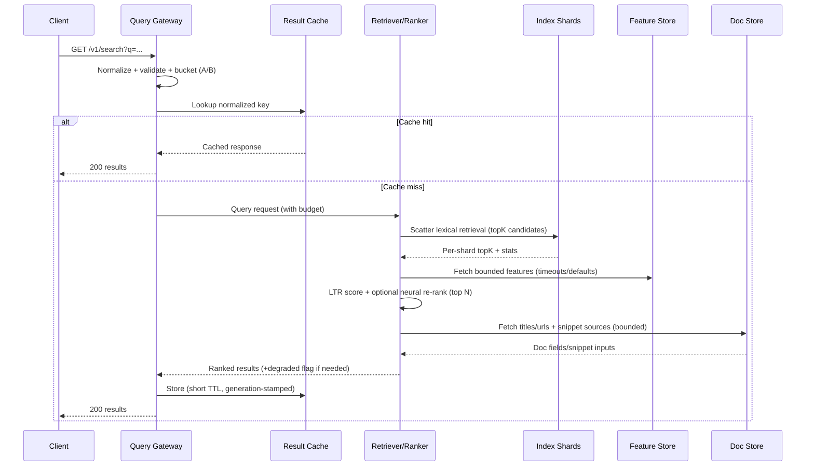
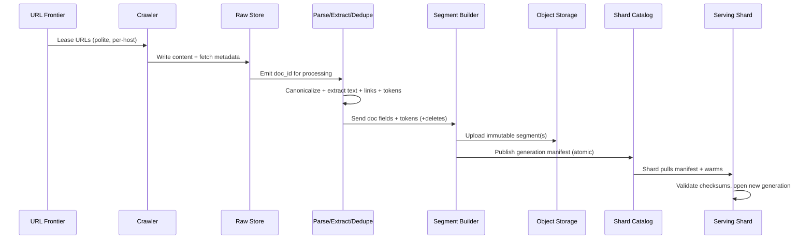

## Overview

A general-purpose search engine is two tightly-coupled systems:

1. **Indexing**: continuously turns a huge, noisy, and adversarial corpus into a queryable representation (crawl → extract → dedupe → tokenize → build segments → publish).
2. **Serving**: answers queries under strict latency and availability SLOs (retrieve candidates → rank → generate snippets → return results).

The hard parts are not only scale (tens of billions of documents, petabytes of content, hundreds of thousands of queries per second), but also **freshness**, **spam resistance**, **safe serving under partial failures**, and **operational correctness** (atomic index publishing, rollbacks, experimentation, and model lifecycle).

This design separates:
- **Write-heavy ingestion** (throughput + correctness + backpressure)
- **Offline computation** (link analysis, quality/spam, embeddings, click models)
- **Low-latency online serving** (lexical retrieval + learning-to-rank + optional neural re-rank)

## Requirements

### Functional Requirements
- Crawl and refresh documents at scale with politeness (`robots.txt`, per-host rate limits, crawl-delay, and adaptive scheduling).
- Extract canonical content from heterogeneous formats (HTML, PDF, feeds), normalize, and deduplicate (exact and near-duplicate).
- Tokenize language-aware text and build an inverted index with positions (phrase queries) and field awareness (title/body/anchors).
- Support incremental updates (adds/updates/deletes), with atomic publishing and fast rollback.
- Serve search with top-K results, snippets/highlights, safe-search filtering, and operators (`site:`, quotes, time filters).
- Provide autocomplete/suggestions driven by query logs and corpus statistics.
- Provide observability and controls: pause domains, force recrawls, backfill, reindex with schema/versioning.
- Support experimentation (A/B buckets) and controlled rollouts of ranking models and schema versions.

### Non-Functional Requirements (SLOs and Scale)

#### Scale (illustrative, production-grade targets)
- **Corpus**: 50B documents stored; raw fetched content ~5 PB compressed in object storage.
- **Change rate**: 0.5–1% documents updated/day (250M–500M docs/day).
- **Crawl throughput**: 100K–300K fetches/sec sustained (higher during backfills).
- **Query load**: 50K QPS average, 200K QPS peak (global).
- **Index footprint**:
  - **Extracted text** is typically much smaller than raw content (HTML boilerplate removed; binaries excluded).
  - **Inverted index + doc values** often lands around **2–6× extracted text** depending on fields, positions, and compression.
  - Plan for **multiple tiers** (hot/head vs warm/tail) and **replication** (2–3×) to meet latency/availability.

#### Latency (server-side, excluding client RTT)
- **Search**: P50 ≤ 60 ms, P95 ≤ 150 ms, P99 ≤ 300 ms (per region).
- **Autocomplete**: P99 ≤ 50 ms.
- **Timeouts**: enforce per-stage budgets and return partial/degraded results when necessary.

#### Availability & Reliability
- **Query serving**: 99.99% per region; multi-region failover with automated traffic steering.
- **Indexing pipeline**: 99.9% (can lag; must not publish corrupt data).
- **Durability**:
  - Raw content + index segments stored in replicated object storage.
  - Control-plane metadata replicated strongly; target **RPO ≤ 5 minutes** for ingestion metadata.

#### Consistency Model
- **Serving reads**: consistent within a shard generation; cross-shard updates are **eventually consistent** during rolling publishes.
- **Freshness**: eventual (minutes to hours) depending on crawl schedule and pipeline lag.
- **Configs/feature flags**: strongly consistent (small, critical state).

#### Security/Compliance
- Respect `robots.txt`, legal removals, and retention constraints for raw content and logs.
- Prevent abuse (query floods, scraper clients) and protect user privacy (log minimization, access controls).

### Glossary (quick definitions)
- **Inverted index**: maps terms → posting lists of documents containing them.
- **BM25**: classic lexical relevance scoring based on term frequency and document length.
- **LTR (Learning to Rank)**: ML model combining features (text match, link signals, freshness, etc.) into a score.
- **WAND / Block-Max WAND**: top-K retrieval algorithms that skip work by using score upper bounds.
- **Immutable segments**: index files written once; updates produce new segments plus merges.

## Architecture

### High-Level System Diagram

```mermaid
flowchart TB
  %% Clients
  U[Users] -->|HTTPS| EDGE[Edge / Anycast LB]

  %% Online serving
  subgraph ONLINE[Online Serving (per region)]
    QG[Query Gateway]
    RC[(Result Cache)]
    RANK[Retriever + Ranker]
    subgraph IDX[Search Cluster]
      SH1[Index Shard Replica]
      SH2[Index Shard Replica]
      SHN[Index Shard Replica]
    end
    DS[(Doc/Metadata Store)]
    FS[(Feature Store)]
    SG[Suggest Service]
  end

  %% Offline / ingestion
  subgraph INGEST[Indexing & Offline]
    FR[URL Frontier]
    CR[Crawler Fetchers]
    RAW[(Raw Content Store)]
    PARSE[Parse + Extract + Dedupe]
    SB[Segment Builder / Indexer]
    CAT[(Shard Catalog / Control Plane)]
    OBJ[(Object Storage: Segments)]
    OFF[Offline Signals: Link/Spam/Embeddings]
  end

  %% Serving path
  EDGE --> QG
  QG --> RC
  QG --> SG
  QG --> RANK
  RANK -->|scatter-gather| SH1
  RANK -->|scatter-gather| SH2
  RANK -->|scatter-gather| SHN
  RANK --> FS
  RANK --> DS
  RC --> QG

  %% Ingestion path
  FR --> CR
  CR --> RAW
  RAW --> PARSE
  PARSE --> SB
  OFF --> FS
  PARSE --> OFF
  SB --> OBJ
  SB --> CAT
  CAT --> SH1
  CAT --> SH2
  CAT --> SHN
```

### Query Serving Flow (online)



### Indexing Flow (crawl → publish)



## Components

### 1) Crawler & URL Frontier
**Responsibilities**
- Discover URLs (links, sitemaps, feeds), prioritize, and schedule recrawls.
- Enforce politeness: per-host queues, adaptive rate limits, and `robots.txt` caching.

**Key design choices**
- **Frontier as durable priority queues** with per-host tokens:
  - A scheduling loop selects eligible hosts (respecting `next_fetch_at`) and leases URLs to fetchers.
  - Use **host-level backoff** on errors/latency spikes (protects sites and avoids wasting bandwidth).
- **Trap and explosion controls**:
  - Canonicalize URLs (normalize params, remove session IDs, normalize case where safe).
  - Limit depth, enforce URL pattern rules, and detect low-diversity fetches per host.

**Tech options**
- Frontier storage: RocksDB for local partitions, or Cassandra/Scylla for wide-column durability.
- Hot scheduling cache: Redis (optional) for fast host eligibility checks.
- Fetchers: Go/Rust async HTTP, strict decompression limits, per-response size caps, and MIME sniffing.

### 2) Parse / Extract / Normalize / Dedupe
**Responsibilities**
- Convert raw bytes into canonical documents: title, main text, language, structured metadata, and out-links.

**Key design choices**
- **Versioned parsing**: store `parse_version` so you can reprocess without refetching.
- **Dedup layers**:
  - Exact: content hash (`sha256`) and canonical URL.
  - Near-dup: SimHash/MinHash over extracted text to collapse templates and scraped mirrors.
- **Safety and resource limits**:
  - Per-doc CPU timeouts (PDF parsing can be expensive).
  - Per-format isolation (HTML/PDF/Office) to prevent noisy neighbor incidents.

### 3) Indexer / Segment Builder
**Responsibilities**
- Build immutable segments (postings + doc values), merge/compact, and publish new shard generations.

**Key design choices**
- **Immutable segments + atomic publish**:
  - Segment files are written once, uploaded to object storage, then referenced by a **generation manifest**.
  - Serving shards switch generations atomically after validation (checksums, schema compatibility).
- **Deletes/updates**:
  - Apply updates as new versions (new segments + delete bitsets/tombstones) and rely on merges for cleanup.
  - Keep recent generations for rollback.

**Tech options**
- Lucene-compatible formats (custom or via Lucene-based engines) are a pragmatic choice for postings/compression maturity.
- Catalog/control plane: strongly consistent store (e.g., etcd/Spanner-like) for shard generation manifests.

### 4) Serving Shards (Index Nodes)
**Responsibilities**
- Answer retrieval requests: term lookups, top-K scoring with early termination, and doc-value reads.

**Key design choices**
- **Early termination**: WAND/Block-Max WAND, impact-ordered postings, and query-dependent score upper bounds.
- **Tiered storage**:
  - Hot/head segments on local NVMe for low latency.
  - Warm/tail segments on cheaper storage, queried only when needed (see scaling section).

### 5) Ranker (Online) + Signals (Offline)
**Online responsibilities**
- Candidate retrieval + feature assembly + ranking within strict budgets.

**Offline responsibilities**
- Compute long-lived signals: link graph metrics, host/domain quality, spam classifiers, embeddings, click models.

**Key design choices**
- **Two-stage (or three-stage) ranking**:
  1. Lexical retrieval (BM25 + field boosts) to produce candidates.
  2. Lightweight LTR (GBDT) for relevance/quality.
  3. Optional neural re-rank for top N (bounded and skipped under load).
- **Feature isolation**:
  - Online ranker only reads a bounded feature set with timeouts and defaults.
  - Offline pipelines write versioned features; maintain online/offline skew checks.

### 6) Query Gateway + Suggest
**Responsibilities**
- Normalize and validate requests, apply safe-search policy, run experiments, cache, and route.

**Key design choices**
- **Normalization for cacheability**: consistent tokenization, whitespace normalization, and operator parsing.
- **Stable experimentation**: deterministic bucketing by user/session and experiment ID; audit logs for rollbacks.
- Suggest:
  - Low-latency structure (FST/trie) refreshed from query logs and corpus stats.
  - Aggressive caching and per-prefix rate limiting.

### 7) Control Plane
**Responsibilities**
- Shard membership, generation manifests, rollout coordination, and emergency controls (pause domains, block terms, rollback generations).

**Key design choices**
- Strong consistency, small surface area, strict authz, and explicit change auditing.
- Separation from data plane: serving continues when control plane is temporarily unavailable.

## Data Model

### Core Entities

**URL Frontier (KV / wide-column)**
- `url_key` (PK; normalized URL hash)
- `url`
- `host_key`
- `priority`
- `next_fetch_at`
- `etag` (optional)
- `last_modified` (optional)
- `fetch_fail_count`
- `status` (`queued|leased|fetched|blocked|dead`)
- `robots_group` (which user-agent policy applied)

**Raw Document Metadata (DB) + Raw Content (object storage)**
- `doc_id` (PK)
- `canonical_url`
- `content_blob_uri`
- `content_type`
- `fetched_at`
- `content_sha256`
- `http_status`
- `robots_policy` (`allowed|disallowed|noindex|nofollow`)
- `parse_version`
- `crawl_source` (`discovery|sitemap|feed|manual`)

**Parsed Document (doc/column store)**
- `doc_id` (PK)
- `title`
- `main_text`
- `lang`
- `out_links` (array)
- `structured_data` (JSON)
- `is_duplicate_of` (nullable doc_id)
- `canonical_url`
- `content_fingerprint` (for near-dup)

**Serving Index (per shard generation)**
- Term dictionary: `term -> (df, pointers, impact stats)`
- Postings: compressed `(doc_id_delta, tf, positions?, field_mask, payloads?)`
- Doc values: `doc_id -> {url, title, length, timestamps, quality, spam, vector_ref, safety_labels}`

**Signals / Feature Store**
- `doc_id` (PK)
- `pagerank`
- `host_quality`
- `freshness_score`
- `spam_score`
- `embedding_ref` (or inline for small vectors)
- `safety_labels`
- `feature_version`

### Index Publishing Metadata (Catalog)
- `shard_id` (PK)
- `generation` (monotonic int)
- `manifest_uri`
- `schema_version`
- `created_at`
- `state` (`publishing|active|rolled_back`)
- `checksum` / `signature`

## API Design

### Search API (REST)

**GET** `/v1/search?q={query}&limit=10&lang=en&safe=on&time=all&pageToken={opaque}`

Response (200):
```json
{
  "requestId": "uuid",
  "query": "system design atlas",
  "normalizedQuery": "system design atlas",
  "degraded": false,
  "results": [
    {
      "docId": "d_123",
      "url": "https://example.com",
      "title": "Example",
      "snippet": "…highlighted text…",
      "score": 12.34
    }
  ],
  "nextPageToken": "opaque"
}
```

Notes
- `limit` should be capped (e.g., 50) to control fanout/cost.
- `pageToken` should encode the last result boundary (e.g., score/docId) and the experiment bucket to keep pagination stable.

Errors
- `400`: invalid operator, unsupported filters, or oversized query.
- `401/403`: auth failures (if applicable).
- `429`: rate-limited.
- `503`: serving degraded; return partial results if possible with `degraded: true`.

Idempotency
- Search requests are naturally idempotent; use `requestId` for tracing and log dedupe.

### Suggest API

**GET** `/v1/suggest?prefix=sys%20des&limit=8&lang=en`

Response (200):
```json
{
  "prefix": "sys des",
  "suggestions": ["system design", "system design interview", "system design atlas"]
}
```

### Control Plane (internal)

**POST** `/internal/index/publish`
- Request: `{ "shardId": 17, "generation": 1042, "schemaVersion": 5, "manifestUri": "...", "checksum": "..." }`
- Idempotent by `(shardId, generation)`; rejects older generations.

**POST** `/internal/crawl/pause-domain`
- Request: `{ "domain": "example.com", "reason": "legal_takedown|trap|incident", "ttlSeconds": 86400 }`

**POST** `/internal/serving/rollback`
- Request: `{ "shardId": 17, "toGeneration": 1041, "reason": "corruption|relevance_regression" }`

## Scaling & Performance

### Capacity/Sizing (back-of-the-envelope)
- 50B documents is too large for a single homogeneous tier with full fanout for every query. A practical design uses **tiers**:
  - **Head index**: high-quality and/or frequently visited content + recent content (e.g., 1–5B docs). Fully optimized for latency.
  - **Tail index**: the long tail (remaining docs), queried conditionally (only if head results are insufficient).
- Sharding example:
  - If one shard holds ~50M docs, then 50B docs implies ~1000 shards per tier (before replication).
  - With 3 replicas, serving capacity scales by adding replica sets; ingestion publishes once per shard generation.

### Latency Budgeting (typical per-request, server-side)
- Gateway normalization + cache lookup: 2–5 ms
- Scatter to shards (in-parallel): 20–80 ms (dominant; depends on fanout and tier)
- Feature fetch + LTR: 5–30 ms (bounded)
- Optional neural re-rank: 10–80 ms (top N only; often skipped)
- Snippet assembly: 5–20 ms (cached where possible)

### Fanout Control Techniques
- **Tiered retrieval**: query head first; only query tail if needed.
- **Early termination**: WAND/Block-Max WAND reduces work within each shard for top-K.
- **Adaptive timeouts**: per-shard deadlines; drop slow replicas and mark degraded when needed.
- **Caching**:
  - Result cache at gateway for hot queries (TTL 1–10 minutes, generation-stamped).
  - Shard memory caches for term dictionaries, hot postings blocks, and doc values.
  - Snippet cache keyed by `(doc_id, generation, highlight_params)`.

### Ingestion Backpressure
- Queue-based pipeline with explicit lag monitoring.
- If indexer falls behind:
  - Slow crawler leases (reduce fetch rate), prioritize recrawls for important hosts, and shed low-priority URLs.
  - Protect serving by isolating ingestion compute/IO budgets from serving nodes.

## Trade-offs & Alternatives

### Key Trade-offs (chosen design)
1. **DocID sharding (chosen)** vs **term sharding**
   - Pros: simpler updates/deletes, simpler ops and shard ownership, mature segment lifecycle.
   - Cons: higher query fanout; mitigated with tiering, caching, and early termination.

2. **Two/three-stage ranking (chosen)** vs **end-to-end neural retrieval**
   - Pros: predictable latency/cost, debuggable, easier experimentation and safety controls.
   - Cons: may miss purely semantic matches; mitigations include hybrid features, embeddings for re-rank, and optional semantic candidate generation on a bounded subset.

3. **Immutable segments + merges (chosen)** vs **fully mutable index**
   - Pros: high serving performance, crash safety, easy rollback by generation.
   - Cons: write amplification and merge complexity; mitigated by tiered merge policies and IO budgeting.

4. **Tiered head/tail index (chosen)** vs **single uniform index**
   - Pros: keeps typical queries fast while still supporting full recall when needed.
   - Cons: more complexity in retrieval strategy and evaluation; requires careful guardrails to avoid “tail starvation.”

### Alternatives to mention in interviews
- **Managed search (OpenSearch/Elasticsearch)**: faster initial delivery; less control at extreme scale and harder to implement custom publishing/tiers precisely.
- **Term-partitioned index**: can reduce fanout but complicates updates and suffers from hot-term skew.
- **Vector-first hybrid search**: strong semantic retrieval but expensive at web scale; requires dedicated vector infra and careful recall/precision evaluation.

## Failure Modes & Mitigations

### Failure Scenarios
1. **Serving shard replica failure**
   - Impact: higher latency or partial results.
   - Detection: elevated RPC errors, health checks, tail latency alarms.
   - Mitigation: retry other replicas, per-shard deadlines, return `degraded: true`, auto-replace replicas.

2. **Bad/corrupt index generation published**
   - Impact: serving errors or relevance drop.
   - Detection: checksum/signature failures, canary alarms, query error spikes, relevance guardrails.
   - Mitigation: atomic rollback to previous generation, keep last N generations, block publish on validation.

3. **Crawl trap / frontier explosion**
   - Impact: wasted crawl budget, pipeline lag, storage pressure.
   - Detection: abnormal URL growth per host, low content diversity, repeated patterns.
   - Mitigation: trap classifiers, per-host caps, URL rules, domain quarantine, manual tooling.

4. **Feature store lag / missing features**
   - Impact: ranking regression.
   - Detection: missing-rate metrics, offline/online skew monitors.
   - Mitigation: defaults/fallback model, strict timeouts, replay features from logs, decouple serving from offline batch cadence.

5. **Multi-region network partition**
   - Impact: region isolated from control plane or feature store.
   - Detection: cross-region RPC failures, increased timeout rate.
   - Mitigation: regional autonomy (serve from last known good generations), local feature caches, degrade gracefully, restore via reconciliation.

6. **Traffic spike / query flood**
   - Impact: cache stampede, shard overload, rising tail latency.
   - Detection: QPS anomalies, cache miss spikes, saturation signals (CPU, IO, queue depths).
   - Mitigation: rate limiting, circuit breakers, request hedging with caps, serve cached/stale results where safe, shed optional stages (neural re-rank).

### Disaster Recovery
- **Serving**: RTO 15 minutes (traffic steering), RPO ~0 for active index generations (replicated).
- **Indexing**: RTO 4 hours, RPO ≤ 5 minutes for control metadata; raw content and segments durable in object storage.
- **Backups**: continuous catalog backups, periodic feature store snapshots, immutable segment retention with lifecycle policies.

## Operations

### SLIs/SLOs to Track
- Serving: availability, P50/P95/P99 latency, error rates, degraded/partial rate, cache hit rate, fanout, per-shard tail latency.
- Indexing: crawl success rate, bytes/sec, per-host politeness violations (should be near-zero), pipeline lag, DLQ rate, publish success rate, merge backlog.
- Ranking quality: guardrail metrics (CTR proxies, abandonment), human eval samples, safety violations, spam leak rate, offline/online feature skew.

### Deployment & Rollouts
- Gateways/rankers: blue/green with canaries (1–5%), automated rollback on SLO violations.
- Models: registry + version pinning per experiment; shadow evaluations before enabling; strict latency budgets and fail-open defaults.
- Index schema: versioned fields; build new generations in parallel; atomic publish; keep rollback window.

### Operational Tooling
- Domain controls: pause/quarantine, forced recrawl, robots override for legal takedowns (audited).
- Debugging: per-request trace with shard timings, top features, and ranking explanations (sampled).
- Data hygiene: retention policies for raw content and logs; access controls; PII minimization for query logs.

## References & Further Reading
- Brin & Page: “The Anatomy of a Large-Scale Hypertextual Web Search Engine”
- PageRank and link analysis literature (incl. spam-resistant variants)
- Apache Lucene: segment design, postings formats, doc values
- Top-K retrieval: WAND, Block-Max WAND, MaxScore
- Learning-to-rank: LightGBM/XGBoost ranking objectives and evaluation metrics (NDCG, MRR)
- Operational principles: graceful degradation, canarying, and atomic publish/rollback patterns