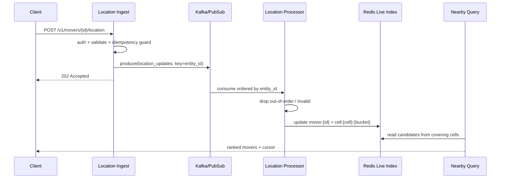
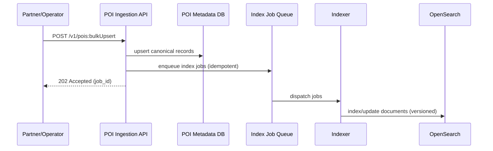

## Overview

Geospatial nearby search powers “what’s near me?” experiences for discovery (restaurants, events) and real-time marketplaces (drivers, couriers). The core challenge is balancing **low-latency reads** (nearby queries) with **high-frequency writes** (location updates), while keeping results fresh, accurate across cell boundaries, and resilient to hotspots (dense downtown areas) and skewed geographic distributions.

A production-ready design typically separates:
- **Static-ish entities (POIs)**: stored in a durable geo-capable search index optimized for filtering/ranking and flexible queries.
- **Dynamic movers (drivers/couriers)**: stored in a low-latency **derived “current state”** store optimized for rapid updates and TTL-based freshness.

Nearby queries use a **cell-based spatial index** (Geohash/Quadtree; H3/S2 are common alternatives) to bound candidate retrieval, followed by **exact distance** computation and ranking.

---

## Requirements

### Functional Requirements
- Nearby POI search within a radius (e.g., 500m–50km) with filters: category, rating, open-now, price, tags.
- Nearby movers search with frequent location updates (e.g., every 1–5s) returning “currently nearby” movers.
- Support circular radius queries and viewport (bounding box) queries.
- Deterministic pagination (stable ordering + cursor).
- Idempotency for client retries (especially location updates).
- Bulk ingestion/upsert for POIs (partner feeds), soft deletes, and reindexing support.
- Privacy controls: avoid exposing exact mover location; support rounding/jitter/aggregation as required.

### Non-Functional Requirements (Targets)
**Scale (illustrative, global):**
- POIs: 50M total; active/read-heavy distribution by region.
- POI ingestion: peak 1k writes/s (bulk + incremental updates).
- Movers: 500k concurrent peak; 1–5s updates → peak ~200k updates/s global (e.g., 50k/s in a large region during events).
- Queries: 50k QPS global peak (combined POI + movers), bursty.

**Latency (regional, steady state):**
- Nearby query API: P50 ≤ 60ms, P95 ≤ 150ms, P99 ≤ 250ms (excluding client network).
- Location update acknowledgment: P99 ≤ 120ms (accepted/persisted to the stream).
- Freshness goal for movers: median < 2s; worst-case < 5s under normal conditions.

**Availability:**
- Query API: 99.99% (multi-AZ).
- Ingestion pipeline: 99.9% (graceful degradation allowed).

**Consistency:**
- Movers: eventual consistency with per-entity monotonicity (ignore out-of-order updates).
- POIs: read-after-write for operator tools; eventual consistency for end-user search (seconds acceptable).

**Durability / Recovery:**
- POIs: durable (RPO ~ 0 with WAL/replication + backups).
- Movers current state: derived/ephemeral; RPO up to ~10s acceptable if reconstructed from stream.

### Constraints & Assumptions
- Multi-region active-active, clients routed to nearest region; cross-region replication is asynchronous.
- GDPR/CCPA: minimize retention of precise location traces; support deletion/obfuscation.
- Prefer managed services where possible; keep operational complexity bounded.
- Within-region service-to-service network is reliable/low-latency; design for partial AZ failures.

---

## Architecture

### High-Level Diagram

```mermaid
flowchart TB
  C[Mobile / Web Client] -->|HTTPS| EDGE[Edge: CDN + WAF + Rate Limit]
  EDGE --> API[API Gateway]

  API --> QS[Nearby Query Service]
  API --> LIS[Location Ingest Service]

  LIS -->|produce (partition by entity_id)| BUS[(Event Bus: Kafka/PubSub)]
  BUS --> LP[Location Processor\n(dedupe, ordering, normalization)]
  LP --> LIVE[(Live Geo Index: Redis Cluster)]
  LP --> METRICS[(Metrics/Logs/Tracing)]
  LP --> ANALYTICS[(Analytics Sink\n(aggregated))]

  QS --> LIVE
  QS --> SEARCH[(POI Geo Index: OpenSearch)]
  QS --> POIDB[(POI Metadata DB)]
  QS --> RCACHE[(Short-TTL Response Cache)]
  QS --> METRICS
```

### Why This Split Works
- **Write amplification control**: mover updates are too frequent for a search engine without heavy merge/refresh pressure; Redis can absorb rapid upserts.
- **Query flexibility**: POI filtering/faceting/ranking is a natural fit for a search index.
- **Resilience**: the live index is derived state (rebuildable); the stream decouples ingestion from downstream consumers.

---

## Core Concepts

### Spatial Indexing Strategy (Cells → Candidates → Exact Distance)
1. Convert query center (or viewport) into a set of **covering cells** at an appropriate precision.
2. Fetch candidates from those cells (and necessary neighbors for edge coverage).
3. Compute exact distance (Haversine or equirectangular approximation for small radii).
4. Apply filters and ranking; return deterministic pagination.

**Precision selection (rule of thumb):**
- Choose a cell size such that each query touches a small bounded number of cells (e.g., 9–49) while keeping average candidates per cell manageable.
- In dense areas, allow *finer* precision or sub-bucketing to reduce hot-key pressure.

### Movers vs POIs
- Movers require:
  - per-entity monotonicity
  - TTL-based freshness
  - hotspot handling (many movers in one area)
- POIs require:
  - durable storage
  - flexible filters/facets
  - stable ranking and pagination

---

## Components

### Edge / API Gateway
**Responsibilities**
- AuthN/AuthZ, request validation, rate limiting, regional affinity, request shaping.
- Separate quotas for:
  - location updates (writes)
  - nearby searches (reads)

**Key practices**
- Geo-route to nearest region; include a region hint token to reduce cross-region bouncing.
- Enforce payload size and frequency limits; reject obviously invalid coordinates early.

---

### Location Ingest Service
**Responsibilities**
- Accept location updates, validate, enforce auth, apply idempotency, and publish to the stream.

**Design decisions**
- **Ack after durable enqueue**: return `202 Accepted` once the update is persisted to Kafka/PubSub (or a managed equivalent). Visibility in Redis is handled asynchronously by the processor.
- **Monotonicity**: maintain last accepted `(seq, ts_ms)` per mover; ignore out-of-order updates.

**Validation checks (typical)**
- lat/lon bounds; timestamp sanity (not too far in future/past).
- plausibility (optional): speed/teleport checks; quarantine suspicious movers.
- auth binding: ensure `mover_id` matches the authenticated principal.

---

### Event Bus (Kafka/PubSub)
**Responsibilities**
- Decouple ingestion from processing; provide backpressure and replay for rebuilds.

**Recommended configuration**
- Partition by `entity_id` to preserve per-entity ordering.
- Multi-AZ replication; producer acks configured for durability.
- Retention tuned for privacy:
  - raw location topic: short retention (e.g., 1–24h) + access controls
  - aggregated analytics: separate pipeline with longer retention

---

### Location Processor (Single Writer to Live Index)
**Responsibilities**
- Consume location updates, apply dedupe/ordering, normalize, write to Redis live index.
- Emit observability events and (optionally) aggregated analytics.

**Key decision**
- **Single-writer principle** to Redis (processor only) avoids dual-write inconsistencies between ingest and processor.

---

### Live Geo Index (Movers)
**Goal**
- Fast “currently nearby” lookup with bounded fanout and graceful handling of stale data.

**Recommended structure (Redis Cluster)**
- Per mover state:
  - `mover:{entity_id}` (HASH): `lat`, `lon`, `ts_ms`, `seq`, `cell_id`, `bucket`
  - `EXPIRE` (e.g., 60s) to enforce freshness
- Per cell membership:
  - `cell:{cell_id}:{bucket}` (ZSET): member=`entity_id`, score=`ts_ms`

**Update algorithm (processor)**
1. Load last state for `entity_id` (or keep an in-memory LRU to reduce reads).
2. If `(seq, ts_ms)` is not newer → drop.
3. Compute new `cell_id` and `bucket`.
4. If cell/bucket changed → `ZREM old_cell_key entity_id`.
5. `ZADD new_cell_key ts_ms entity_id`.
6. `HSET mover:{id} ...` + `EXPIRE mover:{id} 60`.
7. Periodically prune per-cell ZSETs: `ZREMRANGEBYSCORE cell:* -inf (now - TTL - slack)`.

**Why ZSET over SET**
- Enables bounded reads (e.g., fetch only the most recent N per cell) and efficient stale pruning.

**Hotspot mitigation**
- Sub-bucket hot cells: `bucket = hash(entity_id) % B` to spread write/read load.
- Adaptive precision: smaller cells in dense areas (or enforce per-cell candidate caps).

---

### POI Geo Index (Static Places)
**Responsibilities**
- Geo filtering + attribute filters + faceting + coarse ranking.

**OpenSearch mapping guidance**
- Use `geo_point` for `location`.
- Keep the index lean: fields required for filtering/sorting/facets; fetch rich metadata from the DB.

**Indexing approach**
- Write POI canonical data to the metadata DB first, then asynchronously update OpenSearch (at-least-once) with idempotent document updates.
- Use versioning (`updated_at` or a monotonic version) to avoid older updates overwriting newer ones.

---

### POI Metadata DB
**Responsibilities**
- Source of truth for POI details, photos references, full hours rules, soft-deletes, ownership, audit.

**Common choices**
- DynamoDB / Cassandra (high scale, predictable latency) or Postgres (strong relational constraints).
- Use secondary indexes sparingly; prefer key-value access by `poi_id`.

---

### Nearby Query Service
**Responsibilities**
- Compute covering cells, fetch candidates from live index and/or POI index, compute exact distances, apply filters, rank, and paginate deterministically.

**Key techniques**
- Bounded fanout: cap number of cells and per-cell candidates.
- Oversample then filter: fetch top-K candidates, then apply expensive filters (e.g., open-now from hours rules).
- Tail-latency controls: timeouts, hedged reads, partial responses where acceptable.

---

## Data Model

### Movers (Live Index)
**Entity**
- `MoverLocation(entity_id, lat, lon, ts_ms, seq, accuracy_m, heading_deg, speed_mps)`

**Redis keys**
- `mover:{entity_id}` (HASH, TTL 60s)
- `cell:{cell_id}:{bucket}` (ZSET, score=ts_ms, member=entity_id)

**Invariants**
- For each `entity_id`, accepted updates are monotonic by `(seq, ts_ms)`.
- A mover appears in at most one current `cell:*` key (best-effort; repaired by periodic cleanup).

---

### POIs
**OpenSearch document (example)**
- `poi_id` (keyword)
- `name` (text + keyword)
- `location` (geo_point)
- `categories` (keyword[])
- `rating` (float)
- `price_level` (byte)
- `region_id` (keyword)
- `updated_at` (date)
- Optional denormalizations: `is_active`, `popularity`, `quality_score`

**Metadata DB record (example)**
- `poi_id` (PK)
- `name`, `address`, `phone`
- `hours_rules` (structured)
- `attributes`, `photos_ref`
- `created_at`, `updated_at`, `deleted_at` (soft delete)

---

## Data Flows

### Movers: Update → Visible in Nearby Search



### POIs: Bulk Upsert → Searchable



---

## API Design

### Location Update (Movers)
`POST /v1/movers/{mover_id}/location`

Request:
```json
{
  "lat": 37.775,
  "lon": -122.418,
  "ts_ms": 1734390000123,
  "seq": 88421,
  "accuracy_m": 8,
  "heading_deg": 120,
  "speed_mps": 7.2
}
```

Response:
- `202 Accepted`
```json
{ "status": "accepted", "effective_ts_ms": 1734390000123 }
```

Errors:
- `400` invalid payload/coordinates
- `401/403` auth/authz
- `409` monotonicity violation (optional; many systems accept and no-op)
- `429` rate limit
- `503` transient

Idempotency & ordering:
- Prefer monotonic `seq` per mover (server-enforced).
- If clients cannot provide `seq`, accept `ts_ms` with a tolerance window and reject obviously stale updates, but expect more edge cases.

---

### Nearby Movers Search
`GET /v1/movers/nearby?lat={lat}&lon={lon}&radius_m={r}&limit={n}&cursor={token}`

Response:
```json
{
  "results": [
    { "mover_id": "d123", "distance_m": 120, "eta_s": 45, "last_update_age_s": 2 }
  ],
  "next_cursor": "eyJzb3J0X2tleSI6Wy4uLl19"
}
```

Notes:
- Enforce server-side caps: e.g., `radius_m <= 20000`, `limit <= 100`.
- For privacy, do not return exact coordinates by default; return distance/ETA and optionally a coarse cell or jittered point.

---

### Nearby POI Search
`GET /v1/pois/nearby?lat={lat}&lon={lon}&radius_m={r}&categories=coffee&open_now=true&limit=20&cursor={token}`

Response:
```json
{
  "results": [
    { "poi_id": "p9", "name": "Atlas Cafe", "distance_m": 240, "rating": 4.6, "price_level": 2 }
  ],
  "facets": { "categories": [{ "k": "coffee", "count": 120 }] },
  "next_cursor": "eyJzb3J0X2tleSI6Wy4uLl19"
}
```

Implementation detail:
- If `open_now=true` depends on complex hours rules, oversample from OpenSearch (e.g., fetch 200) and filter in the query service using `hours_rules` from metadata.

---

### Bulk POI Upsert (Operator/Partner)
`POST /v1/pois:bulkUpsert`

- Authenticated and scoped (partner/account).
- Asynchronous indexing; return `job_id` with per-item errors for validation failures.

---

## Scaling & Performance

### Capacity & Sizing (Order-of-Magnitude)
**Movers live index**
- 500k concurrent movers globally; assume 100k in a large region at peak.
- Memory roughness (Redis overhead included): ~200–500 bytes per mover for `mover:{id}` + ZSET membership.
- Plan per large region: ~50–100MB for movers + headroom; provision 3–5× for spikes, ZSET churn, fragmentation, and operational safety.

**Event bus throughput**
- 200k updates/s global.
- If each event is ~200B–500B after serialization, that’s ~40–100MB/s total ingress; feasible with partitioning and multi-AZ replication.

### Hot Cells (Downtown Problem)
Symptoms:
- A single cell key receives disproportionate updates and query reads.

Mitigations:
- Adaptive precision: smaller cells in high density areas.
- Sub-bucketing: `cell:{cell_id}:{bucket}` where `bucket ∈ [0..B-1]`.
- Candidate caps: fetch only top recent N per bucket; compute exact distance on the union.
- Fairness: avoid returning 100 movers from one hotspot cell when neighbors are also relevant (merge across cells before ranking).

### Query Fanout Control
- Bound number of covering cells (e.g., max 49) and candidates per cell/bucket.
- Use pipelining/multi-key reads to Redis; keep timeouts tight (e.g., 10–30ms budget for Redis).
- Apply “budget-aware” execution: if Redis is slow, return partial results with a degradation flag (product-dependent).

### Caching Strategy
- Short-TTL response cache for popular POI queries keyed by `(region_id, rounded_lat, rounded_lon, radius, filters)` (e.g., 10–60s).
- POI metadata cache by `poi_id` (minutes-hours) with event-driven invalidation (`poi_updated`) + TTL as a safety net.
- Stampede protection (single-flight) for hot cache keys.

### Partitioning Strategy
- Primary partition: `region_id` (geo-fenced regions or top-level cells).
- Within region:
  - movers: `cell_id` and `bucket` distribute Redis keys
  - stream: `entity_id` preserves ordering

---

## Trade-offs & Alternatives

### Trade-offs (Explicit)
1. **Redis live index for movers**
   - Pros: extremely fast updates/reads, TTL freshness, low query latency.
   - Cons: derived state, requires pruning/repair logic, careful hotspot handling.

2. **Single-writer (processor) to Redis**
   - Pros: avoids dual-write inconsistencies and “split brain” state between ingest and processing.
   - Cons: adds visibility latency equal to stream + consumer processing; requires tight lag SLOs.

3. **Two-store model for POIs (search index + metadata DB)**
   - Pros: best-in-class geo search + facets with durable canonical storage.
   - Cons: eventual consistency between DB and index; requires backfill/reindex tooling.

4. **Oversample-then-filter for complex predicates (e.g., open-now)**
   - Pros: keeps search index lean and avoids expensive scripts.
   - Cons: may reduce recall if oversample size is too small; must tune by density.

### Alternatives
- **All-in OpenSearch (POIs + movers)**: simpler, but high-frequency mover updates cause refresh/merge pressure and tail latency spikes.
- **PostGIS / Spanner geo indexes**: rich queries and stronger consistency, but sustaining ~200k updates/s and low-latency radius queries can be cost/throughput challenging.
- **H3/S2 instead of Geohash/Quadtree**: often better cell geometry and neighbor enumeration; usually a drop-in replacement at the “cell_id” abstraction boundary.

---

## Failure Modes & Resilience

### Failure Scenarios (Examples)

1. **Redis shard/node outage**
- Impact: missing movers for affected keys; partial results.
- Detection: Redis error rate, increased timeouts, candidate-count drop.
- Mitigation: multi-AZ Redis, client retry with jitter, partial-response degradation, fast replacement; rebuild by replaying recent stream window.

2. **Kafka/PubSub lag or processor backlog**
- Impact: movers appear stale; freshness SLO violated.
- Detection: consumer lag, increased `last_update_age_s`, queue depth.
- Mitigation: autoscale consumers, prioritize newest updates per entity, backpressure ingest (429 for extreme), TTL prevents indefinitely stale results.

3. **Hotspot event surge (regional QPS spike)**
- Impact: tail latency spikes, throttling, cache stampedes.
- Detection: regional saturation, P99 alarms, cache miss surge.
- Mitigation: autoscaling, short-TTL caching + single-flight, enforce radius/limit caps, load shedding for abusive clients.

4. **Out-of-order/spoofed updates**
- Impact: incorrect placement, potential fraud/security issues.
- Detection: anomaly detection (teleport/speed), auth failures, unusual update patterns.
- Mitigation: strong auth binding, monotonic `seq`, plausibility checks, quarantine + manual review tooling.

### Disaster Recovery (Typical Targets)
- Regional RTO: ≤ 15 minutes for query APIs; ≤ 60 minutes for full rebuild/backfill.
- RPO:
  - POIs: ~0 with replicated DB + backups/snapshots.
  - Movers: up to ~10s (derived state rebuilt from stream).

Rebuild strategy:
- Recreate Redis live index by replaying a bounded window (e.g., last 5–10 minutes) of location updates, then resume tail consumption.

---

## Operations

### SLOs (Example)
- **Nearby Query**: 99.99% availability; P99 ≤ 250ms (regional).
- **Mover Freshness**: 99% of results have `last_update_age_s ≤ 5`.
- **Ingest Acceptance**: 99.9% availability; P99 ack ≤ 120ms.

### Monitoring & Alerting
Key metrics:
- Query: QPS, P50/P95/P99, error rate, timeout rate, candidate counts (per cell), cache hit ratio.
- Movers freshness: distribution of `last_update_age_s`, dropped updates (out-of-order), dedupe rate.
- Stream: consumer lag, partition skew, rebalance frequency.
- Redis: ops/sec, latency, memory, evictions, hot keys, replication health.
- OpenSearch: query latency, CPU/heap, refresh/merge pressure, rejected requests, snapshot status.

Example alerts:
- Query P99 > 250ms for 5m (regional)
- 5xx > 1% for 2m
- Consumer lag > 30s for 5m
- Redis p99 op latency > 5ms for 5m or memory > 80%

### Deployment & Change Management
- Canary + progressive rollout per region.
- Backward-compatible API evolution; versioned schemas.
- OpenSearch zero-downtime reindex via index aliases and staged backfills.
- Feature flags for ranking changes; shadow reads for new cell precision strategies.

### Privacy & Security Controls
- Minimize retention of precise location events; restrict access (least privilege) and audit usage.
- Default API responses avoid exact mover coordinates; apply rounding/jitter or aggregation by product policy.
- Support data deletion workflows (GDPR/CCPA) across event retention, caches, and derived stores.
- Use TLS everywhere; consider mTLS service-to-service; enforce token binding to mover identity.

---

## References & Further Reading
- Geohash: https://en.wikipedia.org/wiki/Geohash
- OpenSearch geo queries: https://opensearch.org/docs/latest/query-dsl/geo-and-xy/geodistance/
- Elasticsearch geo queries (conceptually similar): https://www.elastic.co/guide/en/elasticsearch/reference/current/geo-queries.html
- Redis GEO commands (alternative approach): https://redis.io/commands/?group=geo
- Uber H3 (alternative cell system): https://h3geo.org/
- Google S2 Geometry (alternative): https://s2geometry.io/
- “The Log” (event streaming patterns): https://engineering.linkedin.com/distributed-systems/log-what-every-software-engineer-should-know-about-real-time-datas-unifying