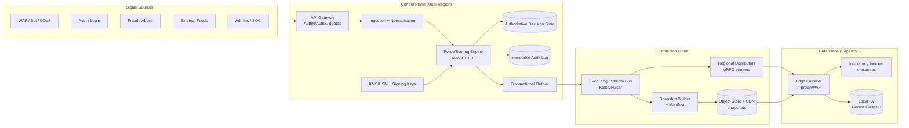
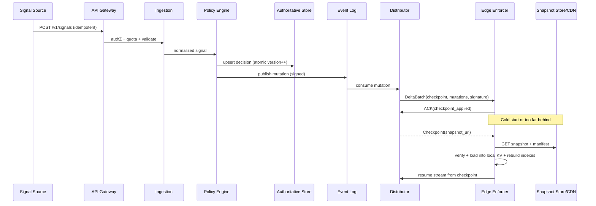

## Overview

A global blacklisting system ingests abuse signals (IPs, CIDRs, domains) from many sources and propagates **enforcement decisions** to every region/edge within seconds. The hard part isn’t “storing a list” but distributing **high‑churn security state** globally with low latency, high availability, and strong safeguards against **false positives** and **poisoning**—while keeping the request-path check extremely fast (sub-millisecond, typically microseconds) at very high request rates.

This design splits the system into:
- **Control plane**: ingestion, normalization, scoring/policy, overrides, audit, publishing.
- **Distribution plane**: streaming + snapshots that move decisions globally.
- **Data plane**: edge enforcement that is **local-first** and never blocks on a remote lookup.

Edges continuously maintain a signed, versioned local ruleset (in-memory indexes backed by a local KV) and enforce even during control-plane outages. Updates ship as **deltas** with periodic **snapshots** for fast recovery and bounded catch-up time.

Comparable real-world systems: CDN/WAF deny lists (Cloudflare/Akamai/Fastly), Google Safe Browsing–style feed distribution patterns, and large-scale configuration distribution systems.

### Goals
- Enforce block/challenge/rate-limit/monitor decisions at the edge with **no network dependency** on the hot path.
- Propagate new decisions globally within seconds with a measurable SLA and safe rollout controls.
- Provide strong auditability and explainability (“why is this blocked?”) with immutable history.
- Minimize false positives through policy guardrails, canaries, and fast rollback/kill-switch.

### Non-goals (initial version)
- Real-time per-request “central reputation lookup” in the data plane.
- Deep content inspection / DLP; this system focuses on indicator-based enforcement.
- Perfect attribution (signals are probabilistic; decisions must be bounded and reversible).

---

## Requirements

### Functional Requirements
- Ingest abuse signals from internal systems (WAF, auth/login, fraud) and external feeds (threat intel, partners).
- Support indicator types: IPv4/IPv6, CIDR ranges, domains, wildcard domains (e.g., `*.example.com`), optional URL/path patterns.
- Attach metadata: source, confidence, reason codes, first_seen/last_seen, TTL/expiry, scope (global/region/product/tenant), and provenance.
- Compute enforcement actions: **BLOCK**, **CHALLENGE**, **RATE_LIMIT**, **MONITOR**.
- Support **overrides**: allowlist/suppressions with higher precedence than blacklist.
- Propagate updates globally within seconds and expose a measurable propagation SLA/SLI.
- Provide query/audit APIs: effective decision, contributors, history, and “who/what changed it”.
- Provide admin tooling: bulk import/export, emergency kill-switch, staged rollout, appeal workflow.
- Ensure correct expiry (automatic unblocking) and safe deletion semantics.

### Non-Functional Requirements (Concrete Targets)
#### Scale (target design point)
- **Data plane traffic**: 10M requests/sec globally.
- **Edge decision path**: 99%+ of checks fully local (no per-request network call).
- **Control plane ingest**: 5K signals/sec steady; spikes to 100K/sec during major attacks.
- **Active decisions** (illustrative; depends heavily on aggregation policy):
  - IP/CIDR decisions: up to 10M–50M (prefer aggregation to prefixes/ranges where possible).
  - Domain decisions: up to 1M–5M.
- **Audit retention**: 12 months (immutable); decision state retained as long as needed + history.

#### Latency
- **Propagation SLO (connected edges)**: P50 < 1s, P99 < 5s from “publish accepted” to “enforced on 99% of connected edges in healthy regions”.
- **Edge evaluation**: P99 < 200µs incremental overhead for indicator check (in-process, warm cache).
- **Cold start recovery**: edge returns to latest snapshot + deltas within 1–5 minutes depending on state size and bandwidth.

#### Availability & Reliability
- **Control plane APIs**: 99.9% monthly.
- **Data plane enforcement**: 99.99% monthly (continues enforcing last-known-good state during control-plane outages).
- **Distribution**: tolerate regional failures; edges fall back to last-known-good and resync on recovery.

#### Consistency
- **Publish/override writes**: strongly consistent for a given indicator’s decision (single-writer per indicator; monotonic versions).
- **Global convergence**: eventual consistency with bounded staleness (seconds) for connected edges.
- **Monotonicity**: edges must never roll back to older versions/checkpoints.

#### Durability
- **Accepted signals and published decisions**: no loss once acknowledged (RPO ≈ 0 for accepted events).
- **Audit trail**: immutable, tamper-evident, and queryable for 12 months.

### Constraints & Assumptions
- Multi-region deployment (≥3 regions) plus edge PoPs; edges may be intermittently connected.
- Security-sensitive: updates must be authenticated, authorized, and tamper-evident (signed).
- Budget favors predictable infra: avoid per-request external lookups; edge runs on commodity instances.
- IP addresses are sensitive data in many regimes; apply data minimization and strict retention for raw signals.

---

## Architecture

### High-Level Diagram

### Request Path (fast path)
1. Edge receives a request.
2. Edge evaluates indicators locally (IP/CIDR/domain match) against the in-memory indexes.
3. Edge applies the action (block/challenge/rate-limit/monitor) without contacting the control plane.

### Publish Path (control path, seconds)
1. Signals are ingested, normalized, and deduped.
2. Policy engine computes/updates the effective decision with TTL and rollout constraints.
3. Decision is written to the authoritative store and emitted through an outbox to the stream bus.
4. Distributors push signed delta batches; edges ACK checkpoints.
5. Snapshot builder periodically produces signed snapshots for fast bootstrap.

---

## Components

## Ingestion Service
**Responsibilities**
- Authenticate sources, enforce per-source quotas/rate limits, validate schema.
- Normalize indicators (punycode, case-folding, CIDR canonicalization, IPv6 normalization).
- Idempotency and dedupe (reduce repeated identical submissions).

**Key points**
- Enforce strict canonicalization to avoid semantic duplicates (`EXAMPLE.com` vs `example.com`, equivalent CIDRs, IPv6 formatting).
- Separate “raw signal acceptance” from “decision publish” so you can record signals even if policy evaluation is backpressured.

## Policy/Scoring Engine
**Responsibilities**
- Convert signals into effective decisions (action, TTL, scope, rollout cohort).
- Apply guardrails: allowlist precedence, suppression, multi-source corroboration, confidence thresholds.
- Produce explainability links: contributors, policy version, reasons.

**Key points**
- **Single-writer per indicator**: route evaluation for `hash(type + canonical_value)` to a single home shard/region to avoid split-brain.
- Use bounded TTLs and caps per source to limit blast radius.
- Prefer aggregation for IPs (merge to prefixes/ranges) when safe to reduce state size and update churn.

## Authoritative Decision Store
**Responsibilities**
- Store the latest effective decision per indicator (strong consistency for updates).
- Store override rules (allow/suppress) with precedence.
- Support audit queries (“effective decision”, “history”, “who changed”).

**Suggested implementation**
- Postgres for admin/override metadata + history pointers, plus a scalable KV (DynamoDB/Cassandra/FoundationDB/etc.) for high-cardinality indicator state if needed.
- Treat the stream bus as the propagation source of truth; DB is for correctness/audit and rebuild.

## Event Log (Streaming Backbone)
**Responsibilities**
- Durable, ordered distribution of decision mutations.
- Replay for recovery; retention to cover typical edge outage windows.

**Key points**
- Partition by `indicator_key = hash(type + canonical_value)` for per-indicator ordering.
- Use at-least-once delivery; downstream consumers must be idempotent.
- Keep a compacted “latest state” topic and an append-only “history” topic if you want both fast snapshot rebuild and full audit.

## Snapshot Builder + Object Store
**Responsibilities**
- Periodically produce a signed snapshot (or per-type snapshots) plus a manifest describing versions/checkpoints.
- Serve snapshots via object storage + CDN to handle thundering herds and large state transfers.

**Key points**
- Snapshot cadence: e.g., every 1–5 minutes for large fleets; also on demand for emergency rollback points.
- Snapshots must be self-describing: schema version, key id, checkpoint id, min/max versions, hashes.

## Regional Distributors
**Responsibilities**
- Maintain edge connections (gRPC streaming), batch and compress deltas, handle backpressure.
- Provide signed checkpointing and propagation SLIs via edge ACKs.

**Key points**
- Distributors scale primarily by concurrent connections + outbound bandwidth.
- Prefer “push deltas” for steady-state; use “pull snapshot + resume deltas” for cold starts or lagging edges.

## Edge Enforcers (Data Plane)
**Responsibilities**
- Perform ultra-fast indicator matching and apply enforcement actions.
- Maintain monotonic state (never roll back); persist locally for fast restart.

**Indexes (typical)**
- **IP/CIDR**: compressed Patricia/radix trie for IPv4 and IPv6 (or separate tables), optimized for no allocations on hot path.
- **Domains/wildcards**: reversed-suffix trie (store `com.example`), support `*.example.com` by matching suffix nodes.
- **Exact keys**: hash map for exact IPs/domains when appropriate.

---

## Algorithms & Semantics

### Normalization (must be deterministic)
- Domains: lower-case, IDNA/punycode, strip trailing dot, validate label length.
- IPs: canonical text form; IPv4-mapped IPv6 handled explicitly.
- CIDRs: canonical network address + prefix length; reject invalid masks.

### Precedence Rules (deterministic and explainable)
1. **ALLOW** override (highest precedence)
2. **SUPPRESS** (ignore blacklist decision for scope/tenant)
3. Effective blacklist decision (BLOCK/CHALLENGE/RATE_LIMIT/MONITOR)
4. Default: allow

Within a scope hierarchy, evaluate most-specific first (e.g., `PRODUCT` > `REGION` > `GLOBAL`) with well-defined tie-breaking.

### Versioning & Monotonicity
- Maintain a **per-indicator monotonic version** (int64) updated atomically by the single-writer policy shard.
- Every mutation includes `(indicator_key, version, emitted_at, policy_version)`.
- Edges apply a mutation only if `version > local_version` for that indicator and if checkpoint signatures verify.

### Expiry
- Decisions carry `expires_at`.
- To avoid relying solely on edge clocks:
  - Prefer emitting explicit **EXPIRE** mutations from the control plane (scheduled sweeper/stream processor).
  - Edges also locally honor `expires_at` as a safety net, with conservative grace windows and NTP monitoring.

### Delivery Guarantees
- Stream bus + distributor delivery is **at-least-once**.
- Edge apply is idempotent (version check) and monotonic (no rollback).

---

## Data Model

### Authoritative Decision (logical)
- `indicator_id` (UUID)
- `type` (IP, CIDR, DOMAIN, WILDCARD_DOMAIN)
- `value_canonical` (string)
- `scope` (GLOBAL, REGION, PRODUCT, TENANT)
- `action` (BLOCK, CHALLENGE, RATE_LIMIT, MONITOR)
- `confidence` (0..1)
- `reason_code` (string)
- `sources` (list or aggregated metadata)
- `first_seen_at`, `last_seen_at`
- `expires_at`
- `status` (ACTIVE, SUPPRESSED, EXPIRED)
- `version` (int64, per-indicator)
- `policy_version` (string)
- `updated_by` (principal id)
- `rollout` (e.g., cohort id / percentage / canary set)

### Mutation Event (published)
- `event_id` (UUID)
- `indicator_key` (bytes/string; hash of type+value)
- `op` (UPSERT, DELETE, SUPPRESS, UNSUPPRESS, EXPIRE)
- `type`, `value_canonical`, `scope`
- `action`, `expires_at`, `version`, `policy_version`
- `emitted_at`
- `key_id` (signing key identifier)
- `signature` (over canonical serialized payload)

### Snapshot Manifest (served to edges)
- `snapshot_id`
- `created_at`
- `checkpoint_id`
- `schema_version`
- `key_id`, `signature`
- `artifacts` (URIs per type/scope, sizes, hashes)
- `resume_from` (stream offsets / checkpoint token)

---

## Data Flow

---

## API Design

### Submit Abuse Signal (Control Plane)
- `POST /v1/signals`
- Headers:
  - `Idempotency-Key: <string>`
- Request (JSON):
  - `type`: `"IP"|"CIDR"|"DOMAIN"|"WILDCARD_DOMAIN"`
  - `value`: string
  - `source`: string
  - `confidence`: number (0..1)
  - `reason_code`: string
  - `scope`: `"GLOBAL"|"REGION"|"PRODUCT"|"TENANT"`
  - `scope_id`: string (required for PRODUCT/TENANT; optional for REGION)
  - `ttl_seconds`: integer (optional; capped per source)
- Response:
  - `signal_id`: string
  - `accepted`: boolean
  - `normalized_value`: string
  - `effective_action`: string
  - `effective_expires_at`: string (RFC3339)
  - `decision_version`: integer (if decision updated)

Errors: `400` invalid, `401/403` auth, `409` idempotency conflict, `429` rate limited.

### Admin Overrides (Allow/Suppress)
- `POST /v1/overrides`
- Request:
  - `type`, `value`
  - `override_type`: `"ALLOW"|"SUPPRESS"`
  - `scope`, `scope_id`
  - `ttl_seconds`
  - `reason`, `ticket_ref`
- Response:
  - `override_id`
  - `effective_version`

Operational guardrail (recommended): require MFA + dual approval for high-blast-radius scopes (GLOBAL) and log to immutable audit.

### Query Effective Decision (Audit/Explainability)
- `GET /v1/indicators/{type}/{value}?scope=...&scope_id=...`
- Response:
  - `normalized_value`
  - `effective_status`, `effective_action`, `expires_at`, `version`
  - `precedence_path` (what matched: allow/suppress/blacklist + scope)
  - `contributors` (sources + counts + last_seen)
  - `history` (last N mutations with timestamps and actor)

### Edge Sync (Distributor ↔ Edge)
- gRPC: `Subscribe(edge_id, region, last_checkpoint_token)`
- Server streams:
  - `DeltaBatch { checkpoint_id, mutations[], key_id, signature }`
  - periodic `Checkpoint { checkpoint_id, snapshot_uri, min_version }`

If an edge is behind retention, distributor instructs snapshot download; edge verifies signatures and resumes from the new checkpoint.

---

## Scaling & Performance

### Capacity Planning (Back-of-the-Envelope)
- **Propagation bandwidth**: if peak publish is 50K mutations/sec and each mutation is ~200–600 bytes on the wire after batching/compression, that’s ~10–30 MB/s aggregate out of a region before fanout; distributors must handle outbound fanout to edges (often the dominant cost).
- **State size at edge**: tens of millions of indicators can be multiple GB depending on representation.
  - Mitigations: scope partitioning (edges subscribe only to relevant tenants/products), prefix aggregation for IPs, and compact in-memory structures.

### Bottlenecks & Mitigations
- **Distributor fan-out saturation**
  - shard distributor pools, compress (zstd), batch deltas, enforce backpressure, use CDN snapshots for bulk transfer.
- **Policy write spikes**
  - async evaluation pipeline, prioritize high-trust sources, shed low-confidence signals, batch DB writes, use outbox to decouple DB commit from publish.
- **Matcher CPU and memory**
  - optimized tries/maps, avoid allocations, use NUMA-aware memory layouts where needed, and precompile wildcard domain match structures.

### Partitioning & Ordering
- Stable key: `indicator_key = hash(type + value_canonical + scope + scope_id)` (include scope to avoid cross-scope contention and clarify ordering).
- Ensure per-key ordering in the stream bus so edges apply deterministic monotonic updates.

### Propagation SLI/SLO (make it measurable)
- Emit `publish_time` in every checkpoint and require edges to ACK `checkpoint_id`.
- Compute SLI: `edge_ack_time - publish_time` (P50/P95/P99) by region and by cohort.
- Alert on: P99 > 5s (steady state), or >1% edges >60s behind.

---

## Trade-offs & Alternatives

### Key Trade-offs
1. **Edge-local evaluation + streaming distribution**
   - Gain: microsecond checks, resilient during partitions, no hot-path dependency.
   - Cost: complex distribution, state management, and memory footprint at the edge.
2. **Event log + snapshots (eventual global consistency)**
   - Gain: scalable propagation and replayability; bounded staleness in seconds.
   - Cost: not globally strongly consistent at all times; must design for monotonic convergence.
3. **Effective decisions (policy output) vs raw signals**
   - Gain: poisoning resistance, guardrails, explainability, consistent TTL/action semantics.
   - Cost: policy engine complexity; must maintain policy versions and contributor linkage.

### Alternatives
- **Central KV lookup per request**: simpler state, but too slow/fragile/costly at 10M RPS and fails under partitions.
- **DNS-based distribution (RPZ)**: excellent for domain blocking at resolver layer, but limited for HTTP-layer actions/metadata and can have slower convergence depending on caches.
- **Peer-to-peer/gossip between edges**: reduces central fanout but increases security risk and complicates auditability and rollout controls.

---

## Failure Modes & Mitigations

### Failure Scenarios
1. **Stream bus outage or replication lag in a region**
   - Impact: no new updates in that region; edges enforce last-known-good.
   - Detection: consumer lag, missing checkpoints, propagation SLI breach.
   - Mitigation: multi-region replication, automated failover, snapshot bootstrap after recovery.
2. **Distributor overload / crash**
   - Impact: edges lag; reconnect storms.
   - Detection: connection churn, queue depth, ACK lag, CPU saturation.
   - Mitigation: autoscale, jittered reconnect, backpressure, prioritize high-severity actions, CDN-backed snapshots.
3. **Poisoned feed causes mass false positives**
   - Impact: user-facing outage / widespread blocking.
   - Detection: anomaly detection on block rates, error spikes, canary cohort divergence.
   - Mitigation: staged rollout (canary PoPs/tenants), multi-source corroboration, confidence thresholds, rapid rollback to last-known-good checkpoint, emergency feed kill-switch, allowlist escalation workflow.
4. **Clock skew at edge breaks TTL behavior**
   - Impact: blocks persist too long or expire early.
   - Detection: NTP drift metrics; discrepancies between expected and observed expiry.
   - Mitigation: explicit EXPIRE events, conservative grace windows, strict time sync and alerts.
5. **Key compromise / signature verification failures**
   - Impact: potential malicious updates or inability to apply updates.
   - Detection: signature failures, key-usage anomalies, KMS audit alerts.
   - Mitigation: short-lived signing keys + rotation, key revocation lists, dual-signing during rotation, emergency “freeze to last-known-good” mode.

### Disaster Recovery
- **RPO/RTO targets**
  - Stream bus (accepted publishes): RPO ≈ 0, RTO 30–60 minutes (depending on platform).
  - Authoritative store: RPO < 5 minutes, RTO 1–2 hours (implementation dependent).
- **Backups**
  - Continuous backups for authoritative store; WORM storage for audit logs; snapshot artifacts stored cross-region.
- **Failover**
  - Promote control-plane leader shards, redirect ingestion routing, distributors switch to alternate bus endpoints, edges reconnect to nearest healthy distributor/CDN.

---

## Operations

### Monitoring & Alerting
- Propagation: `publish→edge_ack` latency (P50/P95/P99) per region/cohort; % edges behind thresholds.
- Stream bus: partition lag, ISR/replication health, throughput, retention headroom.
- Distributor: active connections, outbound Mbps, queue depth, reconnect rate, snapshot failures.
- Edge: index load time, local KV corruption rate, signature failures, decision-check latency (P99).
- Safety: global block/challenge/rate-limit rates, top reasons/sources, sudden deltas vs baseline.

Suggested pages:
- P99 propagation > 5s for 5 minutes (page).
- Any region with >1% edges > 60s behind (page).
- 5× global block rate increase without corresponding attack telemetry (page + auto-freeze canary).

### Deployment & Rollback
- Control plane: canary/blue-green; backward-compatible schemas; outbox ensures publish correctness.
- Edge: staged rollout by PoP cohort; ability to pin to a known-good checkpoint.
- Rollback primitives:
  - publish a previous snapshot/manifest as the “current” pointer
  - disable a source/feed (kill-switch)
  - apply emergency allowlist overrides with short TTL and audit trail

### Security & Compliance
- mTLS between edge↔distributor and service↔service; least-privilege IAM for publishers.
- Signed deltas/snapshots with `key_id` and rotation plan; store signatures and manifests immutably.
- Data minimization: restrict raw signal retention; hash or tokenize where possible; strict access controls for IPs.
- Immutable audit logs: append-only + WORM object storage; include actor, policy version, and justification.

---

## References & Further Reading
- Kafka documentation (replication, consumer groups): https://kafka.apache.org/documentation/
- Apache Pulsar geo-replication: https://pulsar.apache.org/docs/
- Patricia/radix tries for prefix matching (routing-table techniques): general networking literature and implementations
- Safe rollout patterns (canary, staged config, blast-radius controls): SRE practices and incident postmortems
- Google Zanzibar (auditability and consistency framing): https://research.google/pubs/pub48190/
- DNS Response Policy Zones (RPZ) background: ISC BIND RPZ documentation