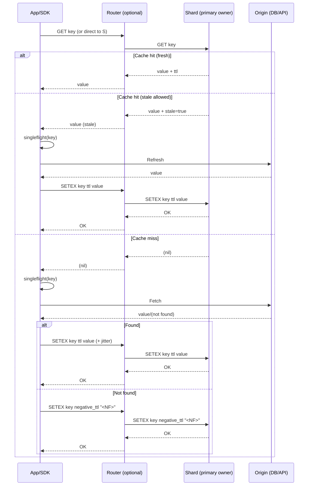

## Overview

A global Redis-like cache must deliver predictable single-digit millisecond latency at very high QPS while surviving node churn, uneven key distributions (hot keys), multi-tenant noisy neighbors, and partial failures. Unlike a database, a cache may drop data, but it must fail *safely*: prevent cascading misses, shield backends from stampedes, and keep tail latency controlled during rebalances and failovers.

This design separates the **data plane** (fast key operations on shard nodes) from the **control plane** (membership, placement, quotas, rebalancing, upgrades). For global deployments, it uses **independent regional clusters** for latency, with **opt-in asynchronous replication / warmup** for workloads that benefit from cross-region cache sharing. Herd prevention is treated as a first-class requirement via TTL jitter, request coalescing, stale-while-revalidate, negative caching, and adaptive admission/eviction.

---

## Requirements

### Functional Requirements
- **Core commands (subset of Redis semantics)**: `GET`, `MGET`, `SET`, `SETEX`, `DEL`, `INCR/DECR`, `EXPIRE`, `TTL`, `SCAN` (plus `PTTL` as a common extension).
- **Cluster awareness**:
  - Sharding with consistent hashing (slot map) and automatic slot → node assignment.
  - Client routing (`MOVED`/`ASK`-style redirection) and topology change propagation.
- **Multi-tenancy**:
  - Namespaces/tenants with quotas (memory, QPS, bandwidth), rate limits, and optional per-namespace encryption-in-transit enforcement.
  - Isolation controls: per-tenant connection caps, CPU/memory fairness, and protections against hot-key abuse.
- **TTL & expiry**:
  - Efficient expiry (lazy + active sampling) with bounded drift for `TTL`/`PTTL`.
  - Default TTL policy (recommended) with max TTL enforcement per namespace.
- **Herd prevention**:
  - Client-side request coalescing (singleflight).
  - Optional shard-side miss coalescing (bounded).
  - Stale-while-revalidate and negative caching policies.
  - Safe lock primitive (`LOCK`/`UNLOCK` extension) for critical sections.
- **Observability**:
  - Per-command latency (P50/P95/P99), hit/miss/stale-served rates, evictions, memory fragmentation, replication lag, hot-key detection.
- **Admin capabilities**:
  - Create/update namespaces, set policies, drain nodes, rebalance slots, controlled failover, and safe rolling upgrades.

### Non-Functional Requirements (Targets)
#### Scale (per large region unless noted)
- **Clients / connections**: up to 50M daily active clients globally; **≤ 200k concurrent connections per region** (prefer fan-in via router tier for very large fleets).
- **Peak traffic**: **~2M QPS reads**, **~300k QPS writes**.
- **Key volume**: up to **5B keys globally**, **~500M active keys per region**.
- **Item sizes**:
  - Median value: **200B**
  - P99 value: **10KB**
  - Max value: **1MB** (discouraged; enforced per namespace)
- **Key sizes**: assume median **40B** key bytes (including namespace prefixing) with a hard limit (e.g., 1KB).

#### Latency (intra-region)
Targets assume direct SDK-to-shard routing; add ~0.5–2ms if a router tier is on-path (depends on hop count, L7 processing, and TLS).
- **`GET` (cache hit)**: P50 **1–2ms**, P99 **8–12ms**
- **`SET` (ack = primary commit)**: P50 **2–3ms**, P99 **10–15ms**
- **`SET` (ack = primary + 1 replica)** *(optional mode)*: P50 **3–5ms**, P99 **15–25ms**

#### Cross-region (optional replication)
- **Replication lag**: typical **< 2s**, P99 **< 10s** (async; best-effort under backpressure)

#### Availability / Reliability
- **Regional read availability**: **99.99%** (allow degraded reads from replica/stale)
- **Regional write availability**: **99.9%** (higher with extra replicas + fast failover)
- **Global “some region serves reads”**: **99.999%** with DNS/GLB failover (application must tolerate higher latency and possibly colder caches)

#### Consistency
- **Within a region**:
  - Default: **read-your-writes best-effort** when reading from the primary; replicas may be stale.
  - Optional: **read-from-primary** (strongest within a shard group) vs **read-from-replica** (lower load / higher staleness).
- **Across regions**: **eventual consistency** for replicated namespaces/keys; default is *regional independence*.

#### Durability
- Cache data is **ephemeral** (loss tolerated).
- Control-plane metadata/config is **durable** (RPO ~ 0).
- Optional “semi-durable cache” tier can use AOF/RDB-like persistence with explicit performance trade-offs.

### Constraints & Assumptions
- 3 AZs per region; Kubernetes or VM-based autoscaling.
- Small platform team (6–10 engineers): prioritize operability and safe defaults.
- Budget-sensitive: avoid synchronous cross-region quorums in the hot path.
- Security: encryption in transit, at-rest encryption for metadata, audit logs for admin actions.
- “Redis-like” semantics for core ops; advanced features (Lua scripts, transactions, full data types) are out of scope initially.

---

## Architecture

### Design Principles
- **Data plane stays fast and boring**: stable routing, minimal coordination, predictable latency.
- **Control plane is authoritative**: desired state in a durable store, reconcile loops, explicit rollouts.
- **Failure containment**: backpressure, rate limits, circuit breakers, and herd controls to protect origins.
- **Regional first**: serve from the closest region; replicate globally only when it helps.

### High-Level Topology

```mermaid
graph TB
  %% Global entry
  C[Client SDKs / Services] --> GLB[Global DNS / GLB]
  GLB --> R1LB[Regional LB (Region A)]
  GLB --> R2LB[Regional LB (Region B)]

  %% Region A
  subgraph R1[Region A]
    R1LB --> RT1[Optional Router Tier]
    RT1 --> SG1P[(Shard Group 1 Primary)]
    RT1 --> SG1R[(Shard Group 1 Replica)]
    RT1 --> SG2P[(Shard Group 2 Primary)]
    RT1 --> SG2R[(Shard Group 2 Replica)]

    CP1[Control Plane] --> CS1[(Config Store)]
    CP1 --> MS1[Membership / Health]
    CP1 --> RT1
    CP1 --> SG1P
    CP1 --> SG2P
  end

  %% Region B
  subgraph R2[Region B]
    R2LB --> RT2[Optional Router Tier]
    RT2 --> SGb1P[(Shard Group Primary)]
    RT2 --> SGb1R[(Shard Group Replica)]
    CP2[Control Plane] --> CS2[(Config Store)]
  end

  %% Async replication (opt-in)
  SG1P --> RL1[Replication Log/Stream]
  RL1 --> RL2[Cross-Region Replication]
  RL2 --> SGb1P
```

**How requests route**
- Preferred: **cluster-aware SDK** routes directly to the owning shard group (fewer hops, lower latency).
- Optional: a **router/proxy tier** routes for “dumb” clients and centralizes auth/quotas.

**How shards are placed**
- Shards are grouped as **primary + replica** across different AZs (zone-aware).
- A shard group owns a subset of **slots** (e.g., 16,384 slots), assigned by the control plane.

---

## Components

### Client SDK (Cluster-Aware)
**Responsibilities**
- Maintain slot → shard map, route requests, pool connections, handle redirects (`MOVED`/`ASK`), retries with backoff, and timeouts.
- Provide herd prevention primitives close to callers (lowest latency, best backend protection).

**Key decisions**
- Slot map (e.g., **16,384 slots**) with:
  - periodic refresh (poll) and push invalidation (watch) where supported,
  - jittered refresh to avoid synchronized thundering herds on metadata.
- Client-side **singleflight** for expensive cache fills.
- Optional **stale-while-revalidate** semantics implemented by the application or SDK helpers (policy-driven, not implicit for all reads).

**Notes**
- SDK retries must be conservative: retrying a slow shard can amplify load; use per-command retry budgets and circuit breakers.

### Router Tier (Optional)
**Responsibilities**
- Terminate TLS, authenticate, apply quotas/rate limits, route to shard owners, and provide protocol compatibility for simpler clients.

**Key decisions**
- Stateless; local cache of slot map updated via watches.
- Supports scatter-gather for `MGET` across slots, with per-subrequest timeouts and partial failure semantics.
- Optional **hedged reads** only for *idempotent* operations and only within strict budgets (hedging can worsen overload if misused).

### Cache Shard Nodes (Data Plane)
**Responsibilities**
- In-memory storage, TTL expiry, eviction, replication, and command execution.

**Data structures and performance**
- Hash table keyed by `(namespace_id, key_bytes)` with per-namespace accounting.
- Memory management tuned for low fragmentation (slab/arena or jemalloc with size classes).
- Multi-threading model is implementation-dependent:
  - either sharded worker threads (partitioned keyspace),
  - or single-threaded per shard process (more isolation, higher operational cost).

**TTL & expiry**
- Hybrid approach:
  - **Lazy expiry** on access (fast path)
  - **Active sampling** to prevent unbounded growth of expired keys
- TTL jitter is applied at write time when policy requires it.

**Replication within a region**
- Primary replicates to one (or more) replicas in another AZ.
- Acks:
  - default: **ack after primary commit** (best latency)
  - optional: **ack after 1 replica** (better availability under primary loss, higher latency)

**Hot keys**
- Detect top-K keys per shard via approximate counters (e.g., count-min sketch + heap).
- Mitigation options (policy-driven):
  - per-key rate limiting,
  - miss coalescing,
  - key-level read replication (serve from multiple nodes),
  - application-guided micro-sharding (e.g., `key:{bucket}`).

**Herd prevention (server-side safety net)**
- Optional bounded inflight map for miss coalescing:
  - prevents shard-level stampedes when many clients miss simultaneously,
  - requires strict caps to avoid memory/CPU DoS.

### Control Plane
**Responsibilities**
- Membership, placement, slot assignment, rebalancing, safe failover, and rolling upgrades.
- Enforce guardrails: max move rate, anti-affinity, and safe default policies.

**Key decisions**
- Desired state stored durably; controllers reconcile actual state (Kubernetes-style).
- Promotions/failovers require **fencing via epochs/leases** to prevent split-brain.
- Data plane continues operating on last-known config during control-plane outages.

### Durable Config Store
Stores authoritative state for:
- namespaces and policies,
- slot assignments and epochs,
- node inventory and capacity,
- audit logs for admin actions.

Typical choices: etcd/Consul for coordination + Postgres for history/audit (or Postgres alone with careful HA + watch semantics).

### Replication / Warmup Service (Optional Global Feature)
**Responsibilities**
- Asynchronously replicate opt-in namespaces/keys across regions.
- Support pre-warming (bulk load) and continuous updates.

**Key decisions**
- Replication is **best-effort** and **backpressured**; it must not degrade regional cache latency.
- Use idempotent writes with a version (e.g., `(region_id, logical_ts)` or monotonic per-key version where feasible).
- Avoid replicating volatile keys by default (sessions, counters) unless explicitly configured.

---

## Data Model

### In-Memory Entry Layout (Conceptual)
- Key:
  - `namespace_id: u32`
  - `key_bytes: bytes`
- Entry:
  - `value_bytes: bytes`
  - `value_type: enum` (start with `string`, `int`)
  - `expire_at_ms: i64` (0 = no expiry)
  - `last_access_ms: i64` (LRU)
  - `freq: u16` (LFU)
  - `size_bytes: u32`
  - `version: u64` (optional; used for replication/replay safety and debugging)

### Control-Plane Schema (Example)
- `namespaces(namespace_id, name, created_at, max_memory_bytes, eviction_policy, default_ttl_ms, max_ttl_ms, replication_mode)`
- `nodes(node_id, region, az, status, capacity_cpu, capacity_mem, last_heartbeat_at)`
- `slot_assignment(slot_id, primary_node_id, replica_node_ids, epoch, updated_at)`
- `audit_log(event_id, actor, action, resource, request_id, created_at)`

### Slotting and Routing
- Slot assignment: `slot = hash(namespace_id || key_bytes) % 16384`
- Slot ownership:
  - `(primary, replicas[], epoch)`
- Routing behavior:
  - stale map: shard returns `-MOVED slot host:port epoch` to force refresh
  - migrating slot (optional): `-ASK` semantics during handoff windows

---

## Data Flow

### Read Hit / Miss with Stale-While-Revalidate



Key points:
- **Singleflight** prevents many concurrent origin fetches from one process.
- **Negative caching** limits cache penetration for missing keys.
- **Stale-while-revalidate** reduces tail latency and stampedes during refresh windows.

---

## API Design

### Data Plane Protocol
- RESP2/RESP3-compatible wire protocol for ecosystem interoperability.
- Cluster semantics via redirections and optional metadata attributes.

#### Core Commands (Examples)
- `GET {namespace}:{key}`
  - Returns bulk string or `(nil)`
  - Errors: `-MOVED slot host:port epoch`, `-TRYAGAIN`, `-NOAUTH`, `-BUSY`
  - Idempotent: yes
- `MGET k1 k2 ...`
  - If routed through router/SDK: scatter-gather; return array of values/nils in request order.
  - If sent to a shard directly: either fail with `-CROSSSLOT` (Redis-style) or return `-MOVED` for each key (extension); prefer router/SDK handling.
- `SET key value [NX|XX] [EX seconds|PX ms]`
  - Returns `OK` or `(nil)` for conditional failure
  - Not strictly idempotent; retries must be bounded. Optional extension: `SET ... IDEMPOTENCY <token>` for safe client retries.
- `SETEX key seconds value`
- `DEL key [key...]`
- `INCR key` / `DECR key`
  - Atomic on the primary owner of the key.
- `EXPIRE key seconds`, `TTL key`, `PTTL key`
- Extensions (optional):
  - `LOCK key token PX ms`
  - `UNLOCK key token` (token required)

#### Error Semantics (Operationally Important)
- `-MOVED`: client must update slot map and retry.
- `-TRYAGAIN`: transient overload or migration; retry with backoff and jitter.
- `-BUSY`: server-side coalescing/locks saturated; do not hammer retries.

### Admin API (gRPC/REST)
- `POST /v1/namespaces`
  - `{ name, maxMemoryBytes, evictionPolicy, defaultTtlMs, maxTtlMs, replicationMode, maxValueBytes }`
- `PATCH /v1/namespaces/{id}`
  - Update quotas/policies with validation and staged rollout.
- `POST /v1/clusters/{id}/rebalance`
  - `{ strategy: "min-move"|"even-slots", maxConcurrentMoves, maxMoveQps }`
- `POST /v1/nodes/{id}/drain`
  - Drains slots off node with bounded migration rate.
- `POST /v1/shards/{slot}/failover`
  - Controlled promotion (requires epoch/lease checks).
- All mutating calls:
  - Require idempotency keys (`Idempotency-Key`) and emit audit logs.
  - Return `409` on epoch mismatch / conflicting updates, `429` on rate limits, `503` on degraded cluster.

---

## Consistency & Replication Model

### Within a Region
- **Primary-owner writes**:
  - A key is written to the primary shard that owns its slot.
  - Replica replication is asynchronous by default; optional “wait for replica ack” mode exists for higher safety.
- **Reads**:
  - Default: read from primary for strongest per-key behavior.
  - Optional: read from replica for load shedding; may violate read-your-writes and return stale values.
- **Failure behavior**:
  - On primary failure, a replica can be promoted if the control plane can fence the old primary (epoch/lease).

### Across Regions (Optional)
- Replication is **asynchronous** and **opt-in** per namespace.
- Conflicts:
  - Best practice: treat one region as the “writer” (single-writer) for replicated namespaces.
  - If multi-writer is required, define conflict resolution (e.g., last-write-wins with a well-defined clock) and accept anomalies.

---

## Scaling & Performance

### Capacity Planning (Back-of-the-Envelope)
Assume per region:
- Active keys: **500M**
- Median value: **200B**
- Median key bytes: **40B**
- Overhead per entry (hash table, pointers, metadata): **~80–200B** (implementation-dependent)

Estimated median memory per key ≈ 40B (key) + 200B (value) + 120B (overhead) = **~360B**
- Total primary dataset ≈ 500M × 360B ≈ **180GB**
- With 1 replica (2 copies) ≈ **360GB** total RAM across shard nodes (plus headroom)

Operational headroom:
- Run at **≤ 70–80%** memory to avoid eviction storms and fragmentation spikes.
- Provisioning target ≈ **450–550GB** aggregate RAM per region for this workload.

Example node sizing (illustrative):
- 32 vCPU / 128GB RAM nodes
- Need ~4–6 primary nodes worth of RAM for dataset, but for QPS and headroom typically **10–20 primaries** + replicas (depends on implementation throughput and tail-latency goals).

### QPS Scaling
- Scale reads horizontally by:
  - adding shard groups (more primaries),
  - optionally allowing replica reads for read-heavy namespaces.
- Writes scale with shard count (each key has a single primary owner).

### Connections and Fan-In
- Very high connection counts (200k+) can pressure shard nodes (file descriptors, TLS handshakes, CPU).
- Mitigations:
  - SDK connection pooling and multiplexing (where protocol allows).
  - Router tier for fan-in and centralized TLS termination.
  - Per-tenant connection limits and backpressure (fail fast vs queue).

### Rebalancing Without Meltdown
- Rate-limit slot moves (bytes/sec, keys/sec, concurrent moves).
- During moves:
  - temporary forwarding (`ASK`-style) or dual-read windows to prevent spikes.
  - optional pre-warming for moved slots (sample hot keys first).
- Measure success by: `MOVED` rate, tail latency, miss-rate delta, origin QPS delta.

### Admission, Eviction, and Cost Control
- Admission policies:
  - reject too-large values by default (per-namespace `maxValueBytes`),
  - optionally “do-not-cache” for low-hit items (adaptive admission).
- Eviction policies per namespace:
  - LRU for general-purpose,
  - LFU for skewed workloads,
  - TTL-only for time-based data,
  - no-eviction for strict behavior (must enforce quotas to avoid OOM).
- Apply TTL jitter (±5–15%) to smooth expiry cliffs.

### Hot-Key Mitigation Playbook
- Detect: top-K QPS keys, event-loop lag, CPU hotspots, per-key latency.
- Respond:
  - coalesce misses,
  - serve stale while refreshing,
  - rate-limit abusive keys/tenants,
  - replicate hot reads (if safe),
  - recommend application micro-sharding.

---

## Trade-offs & Alternatives

### Key Trade-offs
1. **Regional clusters + async cross-region replication**
   - Pros: best latency, isolation by region, strong availability under regional turbulence.
   - Cons: no strong global consistency; cross-region warmness is best-effort.
2. **Client-aware routing (preferred) vs proxy-only routing**
   - Pros: fewer hops, lower cost/latency, scales with client fleet.
   - Cons: higher SDK complexity and rollout coordination across languages.
3. **Server-side herd controls (optional)**
   - Pros: protects origins even when clients misbehave or can’t implement singleflight.
   - Cons: risk of shard-side state/DoS; must be bounded and carefully tuned.
4. **Ack-on-primary vs ack-after-replica**
   - Pros (primary-only): lower latency, higher throughput.
   - Pros (wait replica): better behavior on primary loss.
   - Cons: higher tail latency and sensitivity to AZ-level jitter.

### Alternatives
- **Use Redis Cluster as-is**
  - Fastest time-to-market; weaker multi-tenancy/isolation and limited built-in global replication semantics without additional systems.
- **Proxy-centric architecture (all traffic through routers)**
  - Simpler clients; higher cost, an additional hop, and a larger blast radius if routers overload.
- **Multi-region quorum / strong consistency**
  - Stronger semantics; usually unacceptable tail latency and reduced partition tolerance for typical cache workloads.
- **CDN/edge KV for some use cases**
  - Great for globally distributed read-mostly data; limited command set and different operational semantics.

---

## Failure Modes & Mitigations

### 1) Primary Shard Crash
- **Impact**: keys in affected slots unavailable for writes; reads may degrade or fail depending on replica-read policy.
- **Detection**: TCP failures, missed heartbeats, replica lag anomalies, elevated `MOVED`/retry rates.
- **Mitigation**:
  - Promote replica via control plane with epoch fencing.
  - Update slot map; clients retry with backoff + jitter.
  - If promotion unsafe, serve stale-from-replica (optional) while blocking writes.

### 2) AZ Network Partition (Split-Brain Risk)
- **Impact**: risk of dual primaries if failover is uncoordinated; inconsistent writes.
- **Detection**: membership quorum loss, asymmetric reachability, sudden divergence in replication streams.
- **Mitigation**:
  - Require control-plane quorum + lease to promote.
  - Fence old primary with epochs; losing side becomes read-only or unavailable for those slots.

### 3) Hot Key / Tenant Causes CPU Saturation
- **Impact**: tail latency spikes, timeouts, cascading retries.
- **Detection**: event-loop lag, per-key top-K, per-tenant CPU/QPS outliers.
- **Mitigation**:
  - Enforce per-tenant rate limits and request shedding.
  - Enable bounded shard-side coalescing and/or serve stale while refreshing.
  - Recommend micro-sharding or replicate hot reads (policy-driven).

### 4) Thundering Herd on Expiry (Cache Avalanche)
- **Impact**: origin overload, correlated timeouts, widespread latency regression.
- **Detection**: synchronized miss spikes, origin QPS surge, elevated lock contention, increased stale-served rate.
- **Mitigation**:
  - TTL jitter, stale-while-revalidate, negative caching, singleflight.
  - Probabilistic early refresh (refresh slightly before expiry based on observed fill latency).

### 5) Control Plane Outage
- **Impact**: no new rebalances/drains; data plane should keep serving.
- **Detection**: control-plane health alerts, watch failures, inability to commit config changes.
- **Mitigation**:
  - Data plane runs on last-known config.
  - Disable non-essential actions (rebalance, new failovers) until CP restored.
  - Restore CP from HA config store; audit any missed operations.

### Disaster Recovery
- **RTO/RPO**
  - Data plane: RTO minutes (rebuild cache), RPO not applicable for pure cache.
  - Metadata: RTO **< 30 minutes**, RPO ~ 0 (multi-AZ durable store).
- **Backups**
  - Control-plane DB: periodic snapshots + WAL archiving.
  - Config store: snapshots and tested restore procedure.
- **Regional failover**
  - DNS/GLB shifts clients to healthy region.
  - Replicated namespaces warm faster; otherwise cold-start with strict herd controls and conservative timeouts.

---

## Operations

### SLOs (Example)
- **Regional `GET` hit**: P99 < 12ms, availability 99.99%
- **Regional `SET` (primary ack)**: P99 < 15ms, availability 99.9%
- **Error budget policy**: aggressive rollback on sustained P99 regressions or elevated `TRYAGAIN/BUSY` rates

### Monitoring & Alerting
Key metrics:
- Latency P50/P95/P99 per command, per shard, per tenant.
- Hit/miss/stale-served rates by namespace; origin fetch rate (if instrumented).
- Evictions/sec, expired keys/sec, memory used, fragmentation/allocator stats.
- Replication lag, failover count, slot-move progress, `MOVED`/redirect rates.
- Hot keys/top tenants by CPU/memory/QPS; connection counts and TLS handshake rates.

Example alerts:
- `GET P99 > 15ms` for 5 minutes (regional)
- Hit rate drop > 20% vs baseline (per namespace)
- Memory > 90% for 10 minutes or eviction rate > 5× baseline
- Replication lag P99 > 10s for replicated namespaces
- Retry rate or `TRYAGAIN/BUSY` exceeds threshold (overload indicator)

### Deployment & Upgrade Strategy
- Rollouts: canary shards 1% → 10% → 50% → 100% with automated rollback.
- Maintenance:
  - drain node (migrate slots) before restart,
  - rate-limit migrations and pre-warm hot keys when possible.
- Compatibility:
  - versioned protocol extensions; feature flags for new behaviors (stale serving, hedging, replica reads).

### Security & Compliance
- TLS everywhere; mTLS service-to-service where feasible.
- AuthN/AuthZ: per-tenant credentials, least privilege, and audit logging for admin actions.
- Secrets management via platform tooling (KMS/Vault).
- Protect data plane:
  - per-tenant quotas and rate limits,
  - strict value/key size limits,
  - request timeouts and circuit breakers to avoid retry storms.

### Runbook Highlights
- **Hot shard**: identify top keys/tenants → rate limit → enable coalescing/stale → scale out → rebalance.
- **Failover**: verify fencing/epoch → promote replica → confirm slot map propagation → monitor `MOVED` and latency.
- **Origin overload**: increase negative caching/stale window → reduce retries/timeouts → throttle fills.

---

## References & Further Reading
- Redis Cluster and hash slots: https://redis.io/docs/latest/operate/oss_and_stack/management/scaling/
- Cache stampede background: https://en.wikipedia.org/wiki/Cache_stampede
- Facebook Memcached (operational lessons at scale): https://www.usenix.org/conference/nsdi13/technical-sessions/presentation/nishtala
- Consistent hashing & Dynamo paper context: https://www.allthingsdistributed.com/2007/10/amazons_dynamo.html
- Kafka as a replication log: https://kafka.apache.org/documentation/