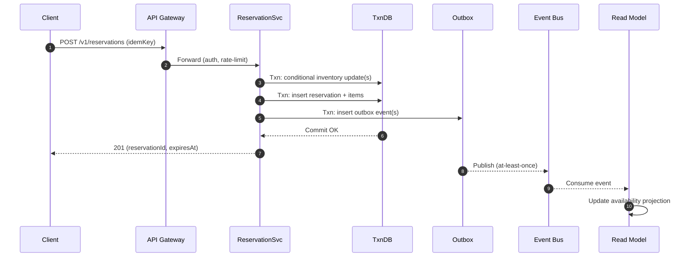
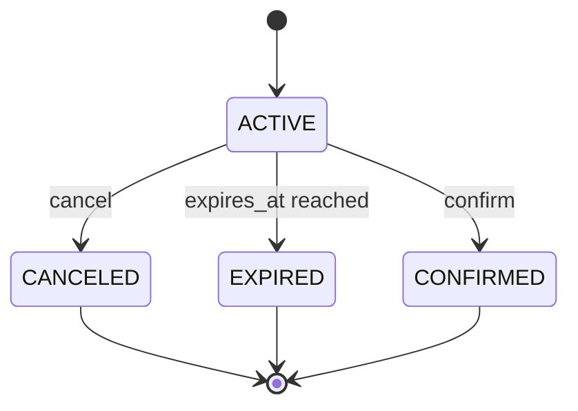

## Overview

A high-traffic product launch stresses the hardest part of commerce systems: maintaining a single source of truth for stock under extreme concurrency. “Zero overselling” means every reserve/checkout must be strongly consistent, while “hold in carts for 10 minutes” means inventory is temporarily removed from availability and must be reliably released on expiry—even during failures, retries, and partial outages.

The core idea is to model **reservations as first-class entities** and enforce the invariant:

`reserved_qty + sold_qty <= total_qty`

using **atomic conditional updates inside a strongly consistent transactional datastore**. Reads (browse/search) can be served from caches and eventually consistent projections, but **writes (reserve/confirm/cancel/expire)** must cross a single **consistency boundary** that:
- serializes contention per SKU (or SKU+pool),
- provides idempotency, and
- fails closed (prefer “cannot reserve right now” over oversell).

This design uses a transactional, horizontally scalable database (e.g., Spanner/CockroachDB) for correctness, plus caching and event-driven projections for read scale and operational visibility.

---

## Requirements

### Functional Requirements
- Create a **10-minute reservation** for one or more SKUs when a user adds items to cart.
- Prevent oversell: any combination of reserve/confirm/cancel/expire must **never** violate `reserved + sold <= total`.
- Allow users to **view** reservations, **cancel** them, and optionally **extend** holds (policy-driven).
- Convert an active reservation into a **confirmed purchase** exactly once.
- Automatically **expire** reservations at 10 minutes and return inventory to availability.
- Provide **near-real-time availability** for product pages (eventual consistency acceptable).
- Support **idempotent retries** for reserve/confirm/cancel (mobile networks, timeouts, client retries).
- Provide admin/system APIs to **adjust stock** (restocks, corrections, recalls) with auditability.

### Non-Functional Requirements (Targets)
**Scale (peak, global)**
- Browse/read availability: **200k QPS**
- Reservation writes: **20k QPS**
- Checkout confirms: **5k QPS**
- SKU catalog: **~1M SKUs**; hot SKUs: **top ~100** extremely contended
- Reservations created: **50–200M/day** during launch window

**Latency (end-to-end)**
- Browse availability: **P50 20ms, P99 80ms** (cache/projection)
- Reserve: **P50 60ms, P99 200ms** (single-region writes or multi-region with leader locality)
- Confirm checkout: **P50 80ms, P99 250ms**

**Availability / SLOs**
- Reserve/confirm/cancel: **99.99%** (degrade by rejecting writes rather than overselling)
- Browse: **99.95%+**

**Consistency**
- Strong: reserve/confirm/cancel/expire operations and inventory counters
- Eventual: browse projections, analytics, monitoring aggregates

**Durability**
- Transactional source-of-truth DB: **RPO ~0**
- Projections/read models: rebuildable (**RPO minutes acceptable**)

### Constraints & Assumptions
- Holds last exactly **10 minutes** (extension, if offered, must be explicitly bounded and rate-limited).
- Users should be routed to the closest region for reads; writes may be routed to a “home region” per SKU/pool.
- PII handled separately; inventory system stores minimal user identifiers (or opaque subject IDs).
- Multi-item cart reservations:
  - Prefer **single transaction** if DB supports it at required scale.
  - Otherwise use a **saga** (reserve items sequentially + compensating cancels) with clear UX (“some items unavailable”).

### Capacity Sanity Check (Why the Numbers Work)
At **200M reservations/day**, average create rate is ~**2.3k/s**, but flash-sales drive peaks (e.g., **20k/s**) for a limited window. The architecture is designed around **hot-key contention** (top SKUs) rather than average throughput.

---

## Architecture

### Key Principles
- **Single consistency boundary** for all state transitions that affect sellable inventory.
- **Fail closed** on ambiguity (timeouts, partitions, uncertain commits).
- **Idempotency everywhere**: clients and internal consumers must tolerate retries.
- **At-least-once events** with **outbox** to avoid “DB committed but no event published”.
- **Derived read models** are never authoritative for reservation decisions.

### High-Level Diagram

```mermaid
graph TB
  C[Client] --> CDN[CDN / Edge Cache]
  CDN --> GW[API Gateway / Edge]
  GW --> RS[Reservation Service]

  RS --> DB[(Transactional DB)]
  RS --> RDX[(Redis: read-through caches)]
  RS --> OUT[Transactional Outbox]

  OUT --> BUS[Event Bus (Kafka/PubSub)]
  BUS --> RM[Availability Read Model Builder]
  RM --> AV[(Read Store: Redis/Key-Value/Elastic)]

  AV --> GW

  EX[Expiry Service] --> DB
  EX --> OUT
```

### Data Flow (Write Path vs Read Path)

**Write path (authoritative):** Client → Reservation Service → Transactional DB (with atomic checks) → Outbox → Bus  
**Read path (fast):** Client → Edge → Read store (eventually consistent) with short TTL fallbacks



---

## Components

### API Gateway / Edge
**Responsibilities**
- Authentication/authorization (user and service tokens)
- Rate limiting and abuse protection (per-IP/per-user/per-SKU where possible)
- Request routing (including SKU home-region routing)
- Response shaping and caching for browse endpoints

**Notes**
- Enforce a consistent **Idempotency-Key** contract and maximum payload size.
- Prefer routing reservation writes to the region that owns the SKU’s pool/leader to reduce tail latency.

### Reservation Service (Consistency Boundary)
**Responsibilities**
- Reserve/cancel/confirm/expire transitions with strict invariants
- Idempotency and retry handling
- Emits events (via outbox) for projections and downstream systems

**Key Design Decisions**
- All inventory-affecting transitions happen in **one DB transaction**:
  - reserve: increment `reserved_qty`, create reservation rows
  - confirm: decrement `reserved_qty`, increment `sold_qty`, mark reservation confirmed, create/attach order record
  - cancel/expire: decrement `reserved_qty`, mark reservation terminal
- Idempotency is enforced with:
  - unique `(client_id, idempotency_key)` for each operation type, and
  - request hash verification to detect “same key, different payload”.

**Backpressure**
- When hot SKUs cause high abort/retry rates, shed load explicitly:
  - return `429` with `Retry-After` or `503` with a short cooldown,
  - optionally queue per-SKU within the service for smoothing (bounded queues only).

### Transactional Inventory Store (Source of Truth)
**Responsibilities**
- Strongly consistent counters and reservation state
- Multi-row transactional updates for multi-item reservations
- Uniqueness constraints for exactly-once confirm

**Technology Options**
- **Spanner/CockroachDB** for horizontal scale + serializable transactions
- **PostgreSQL** (single region) can work if scale/availability targets are lower and hot-key contention is manageable

**Isolation**
- Use **serializable** semantics (or equivalent). In systems like CockroachDB, expect transaction retries; the service must implement retry loops with bounded attempts.

### Expiry Service
**Responsibilities**
- Marks reservations `EXPIRED` once `expires_at <= now` and releases reserved quantity
- Guarantees idempotency and correctness even if delayed

**Implementation Notes**
- Use DB time (`CURRENT_TIMESTAMP`) for comparisons to avoid clock skew issues.
- Process expirations in small batches ordered by `expires_at` (index required).
- Opportunistic cleanup: reserve/confirm/cancel paths should treat expired reservations as expired (and can trigger release) to reduce dependency on background workers.

### Event Bus + Projection Pipeline
**Responsibilities**
- Publish inventory/reservation events for:
  - availability read model,
  - analytics/monitoring,
  - downstream order/fulfillment (if needed)

**Reliability**
- Use a **transactional outbox** table to ensure events are not lost when DB commits succeed.
- Consumers must be idempotent (at-least-once delivery).

### Availability Read Model (Derived)
**Responsibilities**
- Fast “available now” responses for browse/search
- Can be stale; never authorizes reservations

**Storage Options**
- Redis Cluster for low-latency counts
- Key-value store for global replication
- Elasticsearch only for search/faceting (do not use as authoritative counts)

---

## Data Model

### Reservation State Machine
Terminal states: `CANCELED`, `EXPIRED`, `CONFIRMED`



### Storage Schema (Logical)

**inventory**
- `sku_id` (PK part)
- `pool_id` (PK part) — e.g., `global` or `us-east`, `eu-west`
- `total_qty` (int64)
- `reserved_qty` (int64)
- `sold_qty` (int64)
- `version` (int64) — optional if using explicit OCC
- `updated_at` (timestamp)

Invariant (enforced by transaction logic): `reserved_qty + sold_qty <= total_qty`

**reservations**
- `reservation_id` (PK, ULID/UUID)
- `user_id` (string/uuid/opaque subject ID)
- `status` (enum: ACTIVE, CANCELED, EXPIRED, CONFIRMED)
- `expires_at` (timestamp)
- `created_at` (timestamp)
- `updated_at` (timestamp)

**reservation_items**
- `reservation_id` (PK part)
- `sku_id` (PK part)
- `pool_id`
- `qty` (int32)

**idempotency_keys**
- `client_id` (PK part)
- `idempotency_key` (PK part)
- `operation` (PK part) — `reserve|confirm|cancel`
- `request_hash` (bytes/string)
- `response_blob` (bytes/json) — optional for fast replay
- `created_at` (timestamp)
- TTL/retention: e.g., **24–72 hours** depending on retry patterns

**orders** (may live in Order Service; shown for exactly-once confirm)
- `order_id` (PK)
- `reservation_id` (unique)
- `status` (PLACED, PAID, FAILED)
- `created_at`

**outbox**
- `event_id` (PK)
- `event_type`
- `aggregate_key` (e.g., sku_id)
- `payload`
- `created_at`
- `published_at` (nullable)

### Transaction Patterns (Conceptual)

**Reserve (per SKU row)**
- Check `available = total_qty - reserved_qty - sold_qty >= requested_qty`
- If true: increment `reserved_qty` and insert reservation rows atomically
- If false: abort and return `409 INSUFFICIENT_INVENTORY`

**Confirm**
- Verify reservation is `ACTIVE` and `now < expires_at`
- Decrement reserved, increment sold
- Mark reservation `CONFIRMED`
- Insert order with `UNIQUE(reservation_id)` to enforce exactly-once

**Cancel / Expire**
- If reservation is `ACTIVE`: decrement reserved and mark terminal
- If already terminal: no-op (idempotent)

---

## API

### Conventions
- All write endpoints accept:
  - `Idempotency-Key` (required)
  - `X-Client-Id` (required; stable per app install/session)
- Error model uses a stable `code` and optional `details` for per-SKU failures.
- Authorization:
  - user endpoints require user auth and ownership checks,
  - admin endpoints require privileged scopes and full audit logging.

### Create Reservation
`POST /v1/reservations`

Headers:
- `Idempotency-Key: <uuid>`
- `X-Client-Id: <app-install-or-web-session-id>`

Request:
```json
{
  "userId": "u_123",
  "items": [
    { "skuId": "sku_abc", "qty": 1 },
    { "skuId": "sku_xyz", "qty": 2 }
  ],
  "poolHint": "auto"
}
```

Response `201`:
```json
{
  "reservationId": "r_01J...",
  "status": "ACTIVE",
  "expiresAt": "2025-12-17T12:34:56Z",
  "items": [
    { "skuId": "sku_abc", "qty": 1, "poolId": "us-east" },
    { "skuId": "sku_xyz", "qty": 2, "poolId": "us-east" }
  ]
}
```

Errors:
- `409` with code `INSUFFICIENT_INVENTORY` (include which SKU failed and requested/available)
- `409` with code `IDEMPOTENCY_KEY_REPLAY_MISMATCH` (same key, different payload)
- `429` with code `RATE_LIMITED`
- `503` with code `TEMPORARILY_UNAVAILABLE` (fail closed)

Example error:
```json
{
  "code": "INSUFFICIENT_INVENTORY",
  "message": "Not enough inventory for one or more items",
  "details": [
    { "skuId": "sku_xyz", "requestedQty": 2, "availableQty": 0 }
  ]
}
```

Idempotency:
- Same `(X-Client-Id, Idempotency-Key, operation)` returns the original response if `request_hash` matches.

### Get Reservation
`GET /v1/reservations/{reservationId}`

Response `200` returns status, items, and expiry.

### Cancel Reservation
`POST /v1/reservations/{reservationId}/cancel`

- Idempotent: if already `CANCELED/EXPIRED/CONFIRMED`, return `200` with current status.

### Confirm Reservation (Checkout Gate)
`POST /v1/reservations/{reservationId}/confirm`

- Returns `409` with code `RESERVATION_EXPIRED` if `now >= expiresAt`
- Exactly-once confirm enforced by:
  - idempotency keys for API retries, and
  - `UNIQUE(reservation_id)` in `orders` (or equivalent) for server-side safety.

---

## Scaling

### Primary Bottlenecks
**1) Hot SKU write contention**
- A single inventory row per SKU can become a hot key.
- Mitigations (choose based on product constraints):
  - **Pools (recommended):** split inventory into `(sku_id, pool_id)` to spread writes; rebalance `total_qty` across pools.
  - **Home region per SKU:** route all writes for a SKU to one region/leader for predictable tail latency.
  - **Leasing (advanced):** acquire short-lived “token batches” (e.g., 50 units for 30s) from DB; reserve locally from the lease. On crash, lease expires and capacity returns. This reduces DB write QPS at the cost of more complex correctness reasoning and potential short-term underutilization.

**2) Expiry storms**
- Many holds expiring simultaneously can spike writes.
- Mitigations:
  - Add small creation-time jitter (e.g., **±10s**) while preserving “10 minutes” UX expectations.
  - Use indexed `expires_at` scans with bounded batches and parallel workers per shard.

**3) Transaction retries under serializable isolation**
- Some DBs (notably CockroachDB) may abort/retry transactions under contention.
- Mitigations:
  - implement bounded retries with exponential backoff + jitter,
  - apply per-SKU backpressure to reduce thrash,
  - consider pools/leasing for the hottest SKUs.

### Horizontal Scaling Plan
- **Edge/API:** global anycast + regional autoscaling; cache browse responses with TTL (1–2s) + `stale-while-revalidate`.
- **Reservation Service:** stateless scale-out; consistent hashing on `(sku_id, pool_id)` for cache locality and backpressure.
- **DB:** partition by `sku_id` (and `pool_id`); align leaders with write traffic; add nodes for throughput.
- **Read model:** shard by `sku_id`; replicate globally; treat as disposable.

### Caching Strategy
- Cache availability summaries (`available = total - reserved - sold`) in the read model with TTL **1–5s**.
- Cache product pages at the edge with TTL **1–2s** and `stale-while-revalidate`.
- Never cache “authorization to reserve” decisions pre-commit; only cache post-commit results keyed by `reservation_id` if needed.

### Reconciliation
- Run periodic reconciliation jobs:
  - compare read-model availability to DB truth for sampled SKUs,
  - rebuild projections from event log + DB snapshots if drift is detected.

---

## Trade-offs

### Trade-offs Made
1) **Transactional DB for reserve/confirm**
- **Pros:** correctness (no oversell), simpler invariants, auditable source of truth
- **Cons:** higher latency/cost than cache-based counters; hot-key contention requires careful design
- **Why:** “zero oversell” is a correctness requirement; the system must fail closed.

2) **Derived read model for browse**
- **Pros:** very high read QPS at low latency, isolates DB from browse traffic
- **Cons:** can be stale; requires projection pipeline + reconciliation
- **Why:** reads dominate; it’s acceptable for UI to be slightly stale as long as reserve is authoritative.

3) **Pools / home-region routing**
- **Pros:** reduces contention and tail latency; scales hot SKUs
- **Cons:** operational complexity (rebalancing stock across pools), possible short-term “stranding” (stock in a pool that isn’t seeing demand)
- **Why:** flash sales make single-row global writes impractical for the hottest SKUs.

### Alternatives (When to Choose Them)
- **Redis atomic counters (Lua) + async persistence:** ultra-low latency; risky for durability and correctness under failover/split-brain; viable only if occasional oversell is acceptable.
- **DynamoDB conditional writes:** great for single-region strong consistency; global requires per-SKU single-writer routing (home region), otherwise expect complex conflict handling.
- **Per-SKU serialized queue (Kafka) as the write path:** smooths contention and guarantees ordering; adds queueing latency and complicates “instant reserve” UX.

---

## Failure Modes

### Failure Scenarios & Mitigations

1) **Duplicate client retries (timeouts)**
- **Impact:** potential double reservation/confirm without idempotency
- **Mitigation:** unique `(client_id, idempotency_key, operation)` + request hash; return stored response on replay
- **Operational signal:** idempotency replays, mismatch rate, and client timeout rates

2) **Expiry service lag/outage**
- **Impact:** inventory stays reserved longer than intended, reducing conversion
- **Mitigations:**
  - multiple expiry workers with shard partitioning,
  - opportunistic expiration in confirm/cancel/read paths,
  - alerts on `expiry_lag_seconds`
- **Fail-safe:** treat `now >= expires_at` as expired even if not yet processed by the worker

3) **DB region outage / network partition**
- **Impact:** cannot safely reserve/confirm; risk of uncertain commits
- **Mitigations:**
  - fail closed for reserve/confirm on uncertainty (return `503`),
  - serve browse from read model,
  - use multi-region DB failover if available; route writes to the new leader/home region
- **Runbook:** ensure operators understand “unknown commit” handling and idempotent retries

4) **Outbox publish failure / bus outage**
- **Impact:** stale read model, missing downstream signals
- **Mitigations:**
  - outbox ensures events are eventually published,
  - consumers are idempotent,
  - read model TTL + periodic reconciliation from DB
- **Operational signal:** outbox backlog, publish latency, consumer lag

5) **Stock decrease below reserved+sold (admin correction/recall)**
- **Impact:** invariant pressure; future reserves must stop; existing holds may need cancellation
- **Mitigation policy options (choose explicitly):**
  - freeze new reservations and allow existing holds to expire naturally,
  - proactively cancel lowest-priority reservations (with user notification) to restore feasibility,
  - block checkout for impacted reservations (worst UX; sometimes required for recalls)
- **Audit:** all adjustments recorded and reviewable

### Disaster Recovery
- **RTO/RPO:** RTO **30 minutes**; RPO **~0** for transactional DB, **minutes** for projections
- **Backups:** continuous backups + daily full snapshots; point-in-time restore tested quarterly
- **Failover:** promote secondary region (if supported), re-point write traffic via global load balancer, rebuild read model from event log + DB snapshot

---

## Operations

### Observability
Key metrics:
- API: `reserve_success_rate`, `reserve_latency_ms_p50/p99`, `confirm_success_rate`, `cancel_rate`
- DB: commit latency, abort/retry counts, lock/contended key indicators
- Expiry: `expiry_lag_seconds`, expired processed/sec, backlog size
- Correctness: `invariant_violation_count` (should be **0**), negative available counts, double-confirm attempts
- Hot spots: per-SKU QPS, per-SKU abort rate, pool utilization distribution

Alerts (example thresholds):
- Reserve P99 > **300ms** for **5m**
- Expiry lag > **60s** for **5m**
- Any invariant violation > **0** (page immediately)
- DB error rate > **1%** for **1m**
- Outbox backlog age > **60s** for **5m** (projection staleness risk)

### Deployment & Change Management
- Canary the Reservation Service by region and SKU subset; watch abort/latency and error codes before ramp.
- Use backward-compatible schema migrations:
  - add columns/tables → deploy dual-write/read → backfill → enforce constraints
- Keep idempotency behavior stable across versions to avoid retry storms during rollbacks.

### Security & Privacy
- Store only minimal user identifiers (or opaque subject IDs); no payment/PII in inventory service.
- Enforce strict authorization: user can only view/cancel/confirm their own reservations.
- Protect admin adjustments with least-privilege scopes, approval workflows, and immutable audit logs.
- Rate limit by IP/user and apply bot mitigation for flash-sale endpoints.

### Data Retention
- Reservations: retain terminal reservations for **7–30 days** (analytics/CS), then archive.
- Idempotency keys: retain **24–72 hours** (enough for retries).
- Outbox/events: retain on the bus long enough to rebuild projections (commonly **3–7 days**, longer if affordable).

### Testing & Validation (What to Prove)
- Concurrency tests: many parallel reserves on same SKU never oversell.
- Idempotency tests: duplicate reserve/confirm/cancel return same result.
- Expiry correctness: holds released after expiry even under worker delay.
- Chaos/failure injection: DB timeouts, consumer lag, partial outages; system fails closed without invariant breaks.

---

## References & Further Reading
- Google Spanner: transactions, TrueTime, multi-region leader locality
- CockroachDB: serializable isolation, transaction retries, multi-region tables
- DynamoDB: conditional writes and single-writer global patterns
- Transactional Outbox pattern (reliable event publication)
- Jepsen analyses of distributed databases (failure semantics and edge cases)
- Redis: atomic counters/Lua and failure modes (why it’s risky as source of truth)