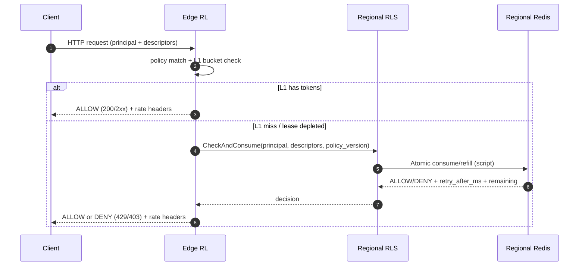
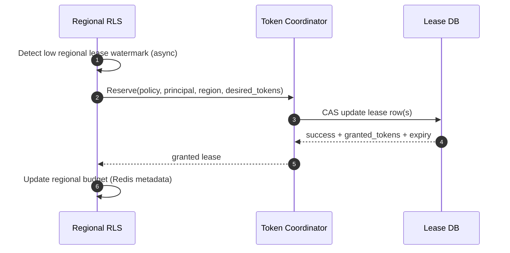

## Overview

A **global rate limiter** enforces per-principal quotas (API key / user ID / IP / CIDR) across many geographic regions while keeping request-path latency low at the edge. The central tension is:

- **Correctness**: don’t exceed contractual or safety limits
- **Performance/availability**: don’t add cross-region RTTs to every request
- **Operability**: handle hot keys, uneven traffic, partial failures, and fast-changing policies

A production-grade approach treats “global rate limiting” as **bounded-consistency enforcement**: decisions are made locally using **regional token leases** issued by a global authority. This avoids per-request cross-region calls while bounding overshoot during partitions and degraded modes.

---

## Requirements

### Functional Requirements
- Enforce limits by principal:
  - `API_KEY`, `USER_ID`, `IP`, `CIDR` (with configurable precedence, e.g., `API_KEY` first, then `IP`)
- Support policy types:
  - **Throughput**: requests/second, requests/minute (token bucket or GCRA)
  - **Burst**: allow short bursts up to a configured cap
  - **Concurrency**: max in-flight requests (semaphore-style)
- Support multi-dimensional rules (a “descriptor set”), e.g.:
  - endpoint/method, customer tier, product, region overrides, and emergency blocks
- Deterministic outcomes per evaluation:
  - `ALLOW` or `DENY`, `retry_after_ms`, and standard rate limit response headers
- Administrative APIs:
  - CRUD policies, principal overrides, disable/enable keys, emergency blocklists
  - staged rollout modes: `SHADOW` → `ENFORCE` with canaries and rollback
- Observability:
  - allow/deny counts, top offenders, hot keys, rule history, and debugging traces
- Batch evaluation:
  - evaluate multiple descriptors per request (gateway integration)

### Non-Functional Requirements

#### Scale (Targets)
- Footprint: **30+ regions**, **300+ edge POPs**
- Global peak decision volume: **5M decisions/sec** (steady 1–2M/sec)
- Principals: **up to 100M** (long tail + hot keys)
- Active policies: **~1M**, updates **~10K/day** (bursty during incidents)

Reality check (why feasible):
- If **95–99%** of decisions are served from **edge L1**, regional systems see a small fraction of global QPS.
- Hot keys are the dominating factor; the design must explicitly optimize for them.

#### Latency (Request Path)
- Edge L1 decision: **P50 0.2 ms**, **P99 ≤ 1 ms**
- Edge → regional (same region) refill: **P99 5–10 ms** (rare)
- Cross-region coordination: **never on critical path**; lease maintenance is out-of-band with **P99 150–300 ms** acceptable

#### Availability / Isolation
- Request-path decisioning: **99.99%** per region (regional isolation)
- Control plane (policy CRUD/publish): **99.9%**
- Blast radius principle: a single region failure should not cause global outage

#### Consistency Model
- **Strong** for policy publication/versioning (no split-brain rules)
- **Bounded eventual** for global quotas:
  - small overshoot is acceptable and explicitly bounded by outstanding leases
  - during partitions, enforcement degrades in a controlled way

#### Durability
- Policy data: **RPO ≤ 1 minute**, **RTO ≤ 15 minutes**
- Buckets/counters: **ephemeral is acceptable**, but restarts must not cause widespread false-deny

### Constraints & Assumptions
- Deployed behind an API gateway / edge proxy (e.g., Envoy/Nginx/Cloud LB)
- Inter-region networking has high latency and occasional partitions
- Prefer stateless edge components + regional data stores
- Minimize PII; IPs may be truncated/hashed; configurable retention for analytics (e.g., 7–30 days)
- Small platform team: operational simplicity is a first-class goal

---

## Architecture

### Key Concepts (Terminology)
- **Principal**: the identity being limited (API key, user ID, IP, CIDR)
- **Descriptor set**: the dimensions for a decision (e.g., `endpoint=/v1/payments`, `method=POST`, `tier=premium`)
- **Policy snapshot**: an immutable, versioned policy bundle consumed by data-plane components
- **Lease**: a time-bounded grant of tokens to a region for `(policy_id, principal, descriptor_hash)` (or a coarser key if desired)

### High-Level Component Diagram

```mermaid
graph TB
  subgraph CL[Client Layer]
    C[Clients / SDKs]
  end

  subgraph EL[Edge Layer (per POP)]
    GW[API Gateway / Edge Proxy]
    RL[Rate Limiter Filter / Library]
    L1[(L1 In-Memory Buckets)]
  end

  subgraph RLAYER[Regional Layer (per Region)]
    RLS[Regional Rate Limit Service]
    RKV[(Regional KV: Redis/KeyDB Cluster)]
    SUB[Policy Subscriber + Snapshot Cache]
  end

  subgraph CP[Global Control Plane]
    PS[Policy Service]
    PDB[(Policy DB: Postgres/Spanner)]
    BUS[Pub/Sub or Kafka]
    TC[Token Lease Coordinator]
    LDB[(Lease State DB: Spanner/FDB/DynamoDB+CAS)]
  end

  subgraph OBS[Observability]
    MET[Metrics/Tracing]
    LOG[Decision Logs Stream]
    ANA[(Analytics Store)]
  end

  C --> GW --> RL --> L1
  RL -->|cold start / lease depleted| RLS --> RKV
  PS --> PDB
  PS --> BUS
  BUS --> RL
  BUS --> SUB
  SUB --> RLS
  RLS -->|out-of-band lease reserve| TC --> LDB
  RL --> MET
  RLS --> MET
  RL --> LOG --> ANA
```

### Request/Data Flow (Critical Path)



### Lease Maintenance Flow (Not on Request Path)



---

## Components

### Edge Rate Limiter (Gateway Filter / Library)
**Responsibilities**
- Match policy(ies) for the request descriptor set
- Make fast ALLOW/DENY decisions from L1 buckets when possible
- Attach:
  - `retry_after_ms`
  - `RateLimit-*` response headers (RFC 9333) for client friendliness
- Emit minimal telemetry; avoid per-request logging overhead

**Key Decisions**
- **Token bucket or GCRA** over fixed windows:
  - reduces boundary spikes and is easier to reason about
- **Two-tier state**:
  - L1 (per-process) for ultra-low latency
  - regional shared state for refill and convergence

**Hot-key protections (edge)**
- **Single-flight** refill per key (collapse many misses into one regional call)
- **Local burst cushion** (small per-key buffer) to absorb microbursts without hammering Redis/RLS
- **Backpressure** for abusive keys (limit refill concurrency per key)

---

### Regional Rate Limit Service (RLS)
**Responsibilities**
- Provide regional decisioning when edge L1 is missing/empty
- Perform atomic consume/refill in regional KV
- Maintain (async) regional budgets/leases for “global” policies
- Implement idempotency/deduplication for gateway retries

**Why a service instead of direct Redis from edge**
- centralizes scripts, policies, and safety controls
- reduces client complexity across many gateway types
- provides a place for adaptive lease sizing and hot-key shaping

**Regional KV choice**
- Redis/KeyDB cluster with replication and failover
- atomic consume via script/function to avoid race conditions

---

### Token Lease Coordinator (Global)
**Responsibilities**
- Allocate global quotas into **regional leases** so regions can decide locally
- Enforce invariants for global limits (bounded overshoot)
- Rebalance when traffic shifts (regions become hot/cold)

**Lease model (practical defaults)**
- Lease TTL: **10–60s**
- Desired lease size:
  - hot keys: larger leases (e.g., 1–5 seconds worth) to reduce coordinator churn
  - cold keys: small leases (e.g., 10–100 tokens) to reduce overshoot and wasted grants
- Hard safety cap: maximum outstanding tokens per principal/policy across all regions

**Bounded overshoot intuition**
- If the coordinator ensures `sum(outstanding_leases) ≤ global_limit_per_window + buffer`,
  then worst-case overshoot is bounded by outstanding leases plus in-flight requests during partitions.

---

### Policy Service (Control Plane)
**Responsibilities**
- CRUD policies and principal overrides
- Validate configs (syntax + semantic validation + safety limits)
- Publish immutable, versioned snapshots
- Rollout management: shadow/canary/full, fast rollback

**Distribution**
- **Push** via pub/sub for speed
- **Pull** periodic snapshot fetch for resilience to missed events
- Data-plane caches are always usable with last-known-good snapshot

---

### Telemetry & Analytics
**Goals**
- Debugging and forensics (why was this request denied?)
- Capacity planning and abuse detection
- Confidence during rollout (shadow vs enforce)

**Practical logging approach**
- Always record denial samples at high rate (often 100%)
- Sample allow decisions aggressively (e.g., 0.01–1%) and aggregate at edge/region
- Separate “security signals” pipeline (blocklists, anomalies) from general analytics

---

## Algorithms & Semantics

### Token Bucket (Throughput + Burst)
- Parameters: `rate` (tokens/sec), `burst` (max tokens)
- Each request consumes `cost` tokens (usually 1; can vary by endpoint)
- `retry_after_ms` is computed from deficit:
  - `retry_after = ceil((cost - available_tokens) / rate)`

**Pros**: intuitive burst control  
**Cons**: requires storing tokens + last_refill time

### GCRA (Smoother Rate)
- Models a “theoretical arrival time” (TAT)
- Often yields smoother pacing and simple arithmetic

**Pros**: stable pacing; good for per-second limits  
**Cons**: less intuitive burst tuning than token bucket (but supported)

### Concurrency Limits
- Use a semaphore per principal/dimension:
  - increment on request start, decrement on completion
- Requires reliable completion signals; gateways should emit completion even on errors/timeouts

**Common choice**: enforce concurrency regionally (not globally) unless absolutely required.

---

## Data Model

### Policy Storage (Strong Consistency)

**Tables (logical)**
- `policies`
  - `policy_id` (UUID, PK)
  - `name`
  - `scope_type` (`API_KEY|USER|IP|CIDR|CUSTOM`)
  - `matchers` (structured rules for descriptors; avoid regex-only systems)
  - `algorithm` (`TOKEN_BUCKET|GCRA|CONCURRENCY`)
  - `rate` (tokens/sec) and/or `period_ms` + `limit`
  - `burst`
  - `cost_rules` (optional: cost by endpoint/method)
  - `mode` (`ENFORCE|SHADOW|DISABLED`)
  - `priority` (tie-breaker)
  - `created_at`, `updated_at`

- `policy_versions`
  - `policy_id` + `version` (PK)
  - `snapshot_blob` (protobuf/JSON)
  - `published_at`, `published_by`
  - `checksum` (integrity, cache validation)

- `principal_overrides`
  - `principal_id` (hashed)
  - `policy_id`
  - `override_fields` (rate/burst/mode/expiry)
  - `expires_at`

**Snapshot rule**
- Data plane consumes snapshots only; no request-path DB reads.

### Lease State (Global Authority)

- `token_leases`
  - `lease_key` (PK: hash(policy_id + principal_id + region + descriptor_hash))
  - `policy_id`, `principal_id`, `region`, `descriptor_hash`
  - `granted_tokens_total`
  - `consumed_tokens_total`
  - `lease_expires_at_ms`
  - `version` (CAS)

**Invariant**
- Coordinator uses CAS to prevent double-grant and to maintain outstanding token bounds.

### Regional KV (Ephemeral)

**Bucket key**
- `bucket:{policy_id}:{principal_hash}:{descriptor_hash}`

**Value**
- `tokens` (float/int)
- `last_refill_ms` (int64; use monotonic clock source where possible)
- `policy_version` (int)
- `idempotency_cache` (separate keys; see below)

### Idempotency / Deduplication (Regional)
To avoid double-consumption on gateway retries:
- Key: `dedupe:{request_id}:{policy_id}:{principal_hash}:{descriptor_hash}`
- Value: decision + token delta
- TTL: **5–30 seconds** (must exceed typical retry window)

---

## API Design

### Decision API (gRPC Recommended)

**Service**
- `RateLimitService.Check`

**Request fields**
- `request_id` (required; UUID)
- `principal` (oneof: api_key_hash/user_id_hash/ip_hash/cidr_hash)
- `region` (string)
- `descriptors` (repeated key/value; canonicalized ordering)
- `policy_snapshot_version` (optional; helps detect stale data plane)

**Response fields**
- `decision` (`ALLOW|DENY`)
- `retry_after_ms` (0 if allow)
- `policy_id_applied`
- `policy_version`
- `headers` (map)

**Standard HTTP headers (recommended)**
- `Retry-After` (seconds; for 429 compatibility)
- `RateLimit-Limit`, `RateLimit-Remaining`, `RateLimit-Reset` (RFC 9333)
- Optional: `RateLimit-Policy` (human-readable policy summary)

### Policy APIs (REST, Control Plane)
- `POST /v1/policies`
- `PUT /v1/policies/{policy_id}` (creates new draft version)
- `POST /v1/policies/{policy_id}:publish?version=...`
- `POST /v1/policies/{policy_id}:rollback?version=...`
- `GET /v1/snapshots/{snapshot_id}` (immutable)
- `POST /v1/overrides` (principal override with expiry)
- `POST /v1/emergency:block` (fast blocklist path with audit)

### Internal Lease API (Coordinator)
- `TokenCoordinator.Reserve(policy_id, principal_id, region, descriptor_hash, desired_tokens, min_tokens, now_ms)`
- Coordinator returns `(granted_tokens, lease_expires_at_ms, version)`

---

## Scaling & Performance

### Capacity Planning (Back-of-the-Envelope)
- Global peak: **5M decisions/sec**
- Assume **98%** edge L1 hit rate:
  - Regional path: **100K decisions/sec** total
  - Per region (30 regions) average: **~3.3K/sec** (peaks much higher)
- A single hot principal can be **100K–1M QPS** globally:
  - must be handled with:
    - larger leases
    - per-key single-flight
    - per-key concurrency limits on refills

### Bottlenecks & Mitigations
- **Hot principals → Redis hot shards**
  - adaptive lease sizing (bigger leases for hot keys)
  - use hash tags / stable hashing to keep per-key locality predictable
  - consider per-hot-key “microsharding” only if necessary (complexity trade-off)
- **Coordinator churn during restarts**
  - jitter lease renewals
  - warm-start: keep small pre-grants per region for common tiers
  - exponential backoff + request coalescing for lease reserves
- **Policy update storms**
  - snapshots are immutable and cached
  - pub/sub only delivers pointers; bulk snapshot download is CDN-backed

### Caching Strategy
- **Policy cache**
  - edge + RLS keep latest snapshot in memory
  - pub/sub invalidation + periodic pull (e.g., every 60s)
- **Bucket cache (L1)**
  - TTL: 5–30s; size cap (e.g., 100K–1M entries per instance depending on memory)
  - store only hot keys; long tail falls back to RLS
- **Negative caching**
  - cache “no policy matched” briefly (e.g., 1–5s) to reduce repeated matcher work

### Consistency and Overshoot Controls
- Lease TTL small (10–60s)
- Cap outstanding tokens per principal/policy (global safety belt)
- Conservative defaults for cold keys; expand leases only when sustained demand is observed
- Post-incident reconciliation is analytic (not request-path): quantify overshoot per tenant and tune caps

---

## Trade-offs & Alternatives

### Key Trade-offs
1. **Token leasing for global limits**
   - Gain: no per-request cross-region calls; low latency; regional isolation
   - Cost: bounded overshoot during partitions; more complex coordinator logic
2. **Redis/KeyDB ephemeral state**
   - Gain: high throughput, low latency, atomic scripts
   - Cost: counters are not durable; requires careful fail-open/closed choices
3. **Snapshot-based policy distribution**
   - Gain: no request-path DB dependency; easy rollback; consistent policy bundles
   - Cost: extra machinery (pub/sub + snapshot store + cache invalidation)

### Alternatives (When to Use)
- **Single global strongly-consistent counter**
  - Use when limits must be exact and QPS is low, or clients are single-region
  - Expect higher latency and lower availability under regional failures
- **CRDT-based counters**
  - Use when you accept larger overshoot and want to avoid a central coordinator
  - Added complexity and convergence behavior can be difficult to explain/operate
- **Edge-only local limits**
  - Use for “best-effort fairness” but not contractual global quotas
  - Tenants can exceed limits by spreading traffic across regions

---

## Failure Modes & Mitigations

### Failure Scenarios (Examples)
1. **Regional Redis degradation or shard failure**
   - Impact: increased regional denies/timeouts; elevated tail latency
   - Mitigation: replicas + failover, circuit breakers, degrade to L1-only for a short window, protect hot keys with local cushion

2. **Token Coordinator unavailable**
   - Impact: leases can’t be renewed; global policies eventually become stricter (deny more) or looser (if fail-open)
   - Mitigation: use existing leases until expiry; configurable emergency regional budget (bounded); aggressive alerting and autoscaling

3. **Cross-region partition / isolated region**
   - Impact: isolated region keeps spending its remaining leases; global overshoot risk increases but is bounded
   - Mitigation: short lease TTLs, conservative outstanding caps, prioritize renewals when connectivity returns

4. **Bad policy publish (misconfiguration)**
   - Impact: widespread throttling or unthrottled abuse
   - Mitigation: validation, shadow mode, canary rollout, one-click rollback to prior snapshot, guardrails (max deny % per tenant during rollout)

5. **Clock skew (subtle but common)**
   - Impact: incorrect refill timing → false-deny or false-allow
   - Mitigation: use monotonic clocks for interval math; treat wall clock only as metadata; enforce NTP; detect skew via metrics

### Disaster Recovery
- Control plane:
  - RTO **≤ 15 minutes**, RPO **≤ 1 minute** (replication + PITR backups)
- Data plane:
  - continues regionally using last-known policies and remaining leases
- Backups:
  - Policy DB: continuous WAL + daily snapshots + PITR
  - Lease DB: PITR if supported; otherwise leases are reconstructible (ephemeral) but bounded by caps

---

## Operations

### SLOs (Suggested)
- Edge decision latency: P99 **≤ 1 ms**
- Regional refill latency (when used): P99 **≤ 10 ms**
- Decision availability (per region): **99.99%**
- Policy publish propagation:
  - P99 **≤ 30s** to all regions (push + pull)

### Monitoring & Alerting
Key metrics:
- `rl_decisions_total{region,policy_id,decision}`
- `rl_latency_ms_bucket{component=edge|rls}`
- `rl_l1_hit_ratio{region}`
- `redis_script_latency_ms`, `redis_errors_total`, `redis_evictions_total`
- `lease_reserve_latency_ms`, `lease_reserve_failures_total`
- `policy_snapshot_staleness_seconds{region}`

Alerts (examples):
- Edge P99 > 2 ms for 5 minutes (page if sustained)
- Deny rate spike > 3× baseline per tenant/policy
- Redis error rate > 1% or failover events
- Lease reserve failures > 0.5% for 5 minutes
- Policy snapshot staleness > 120s in any region

### Deployment & Rollouts
- Data plane (edge/RLS): rolling deploy with canaries per region
- Lua/scripts: versioned; RLS supports N and N-1 script versions during rollout
- Policy changes:
  - `SHADOW` first (log would-deny), then canary tenants, then full rollout
  - rollback by switching “latest snapshot pointer”

### Fail-open vs Fail-closed (Per Policy)
- Default **fail-open** for general user traffic to preserve availability
- Default **fail-closed** for:
  - authentication endpoints
  - abuse-prone operations (e.g., signup, password reset, card testing vectors)
- Enforce explicit policy ownership and review for fail-closed rules (blast radius risk)

---

## References & Further Reading
- Envoy Global Rate Limiting: https://www.envoyproxy.io/docs/envoy/latest/intro/arch_overview/other_features/global_rate_limiting
- RateLimit response headers (RFC 9333): https://www.rfc-editor.org/rfc/rfc9333
- Token Bucket: https://en.wikipedia.org/wiki/Token_bucket
- GCRA: https://en.wikipedia.org/wiki/Generic_cell_rate_algorithm
- Redis rate limiting patterns: https://redis.io/docs/latest/develop/use/patterns/rate-limiting/
- Google SRE Workbook (overload control): https://sre.google/workbook/
- Cloudflare Rate Limiting (real-world edge constraints): https://developers.cloudflare.com/waf/rate-limiting/