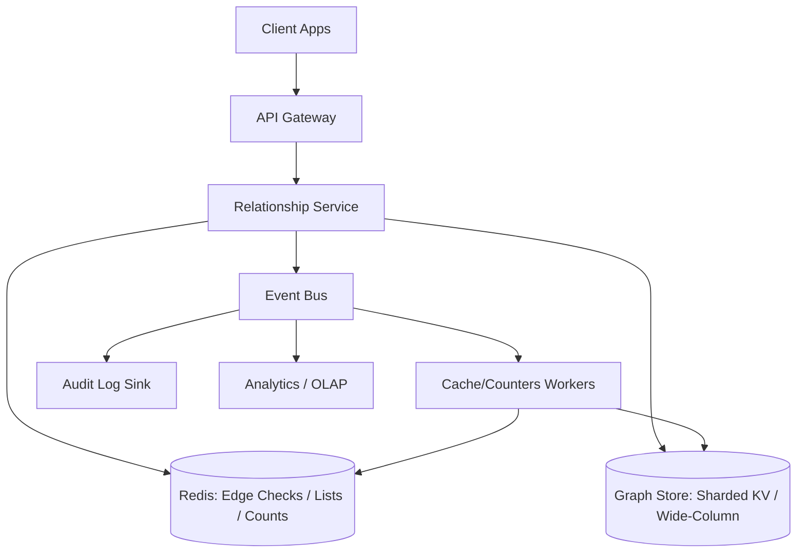
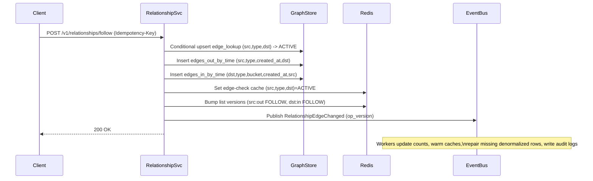

## Overview

A Relationship Service powers core social features—follow, friend, block, mute—and answers “who is connected to whom?” at extremely high read volume with tight latency. The data model is conceptually simple (edges between users), but production complexity comes from:

- **Skew**: a tiny fraction of users (“celebrities”) dominate reads/writes.
- **Fan-out**: follower lists can be millions long.
- **UX expectations**: follow/unfollow/block should “feel instant,” at least for the acting user.
- **Operational reality**: caching is mandatory, but stale caches create inconsistent product behavior.

This design focuses on **adjacency-list queries** (lists + direct edge checks), not arbitrary graph traversal. The graph is stored in a horizontally sharded KV / wide-column store with **denormalized tables** optimized for the dominant access patterns: outgoing lists, incoming lists, and direct edge lookup. We use **versioned caching** and **event-driven cache updates** to meet latency goals and protect hot partitions.

---

## Requirements

### Functional Requirements

- Directed edges:
  - `follow` / `unfollow`
  - `block` / `unblock`
  - `mute` / `unmute`
- Bi-directional edges:
  - friend request, accept/decline, remove friend
- Queries:
  - Outgoing adjacency: who a user follows (cursor pagination, stable ordering)
  - Incoming adjacency: a user’s followers (cursor pagination, stable ordering)
  - Pending friend requests (incoming and outgoing)
  - Direct checks: does A follow B? are A and B friends? is A blocked by B?
  - Batch checks: (viewer, many targets) for feed/profile rendering
  - Counts: followers/following/friends with bounded staleness
- Safety/moderation:
  - blocks prevent follow/friend actions and restrict visibility per product rules
- Compliance:
  - immutable audit log of edge mutations
  - GDPR deletion (user removal)

### Non-Functional Requirements (Targets)

| Category | Target |
|---|---|
| Users | 50M DAU, 300M MAU |
| Total edges | ~50B (follow + auxiliary) |
| Growth | 50–200M new edges/day (net) |
| Read QPS | 150k avg, 500k peak |
| Write QPS | 10k avg, 50k peak (bursty) |
| Relationship check latency | P50 5ms, P99 30ms (regional) |
| List first page latency | P50 20ms, P99 120ms (regional) |
| Availability | Reads 99.99%, Writes 99.9% |
| Durability | RPO ≈ 0 for acknowledged writes (multi-AZ) |
| Consistency | Read-your-writes for actor (best-effort, seconds), eventual for others; counts eventual (seconds–minutes) |

**Notes on realism**
- The latency targets assume **regional serving** with Redis hits for the majority of checks and first-page lists. Cross-region reads will be higher; multi-region is addressed under “Operations”.

### Constraints & Assumptions

- Hot-path queries are **single-hop adjacency lookups** and **edge existence checks**.
- Pagination must be stable and deterministic (typically by `created_at` then `other_user_id`).
- Skew is expected; design must handle “celebrity partitions”.
- Edge mutations must be idempotent (clients retry).
- Deletes must be safe at scale (avoid pathological tombstone behavior).

---

## Architecture



### Request Paths (High Level)

- **Reads (check/list)**: Relationship Service → Redis (hit) → return; on miss → Graph Store → return + populate cache.
- **Writes (follow/block/friend)**:
  1. Validate rules (authz, block semantics, rate limits).
  2. Perform store writes (idempotent, conditional where needed).
  3. Publish mutation event (for cache/counters/audit).
  4. Update/bump cache versions for fast “read-your-writes” experience.

---

## Components

### API Gateway

**Responsibilities**
- AuthN/AuthZ (JWT/OIDC), request validation, routing
- Rate limiting (per-user/per-IP/per-device)
- Idempotency enforcement plumbing (pass-through headers)
- Abuse protections (bot detection, anomaly limits)

**Key decisions**
- Mutation endpoints require `Idempotency-Key` and are safe to retry.
- Separate rate limits for:
  - edge mutations (tight)
  - relationship checks (moderate)
  - list endpoints (moderate + pagination throttles)

### Relationship Service

**Responsibilities**
- Business rules: block semantics, friend workflow state machine
- Read APIs (lists/checks/batch checks)
- Write APIs (follow/unfollow/block/mute/friend transitions)
- Emits mutation events with ordering guarantees where needed

**Key decisions**
- **Direct edge lookup is authoritative for “check”** responses.
- Lists are built from adjacency tables and may be temporarily inconsistent with checks under partial failure; repaired asynchronously.
- “Read-your-writes” is achieved by:
  - writing the edge-check cache and bumping list versions on mutation, and/or
  - short-lived session-level “recent mutations” cache for the acting user.

### Cache Layer (Redis)

**Responsibilities**
- Low-latency responses for:
  - edge checks (`(src, type, dst)`)
  - first pages of adjacency lists for hot users
  - derived counts (bounded staleness)

**Key decisions**
- **Versioned keys** per `(user_id, direction, edge_type)`:
  - List key pattern: `list:{user}:{dir}:{type}:v{ver}:{cursor}:{limit}`
  - On mutation, bump relevant versions (actor outgoing, target incoming).
- Use **negative caching** for edge checks to reduce store load.
- Prevent stampedes using:
  - request coalescing (singleflight)
  - soft TTL + background refresh
  - TTL jitter

### Graph Store

**Responsibilities**
- Durable source of truth for edges and adjacency lists
- High write throughput and predictable latency for key-based reads

**Technology options**
- Managed: **DynamoDB** (conditional writes; Streams for events; multi-AZ by default)
- Self-managed: **ScyllaDB/Cassandra** (wide-column adjacency modeling; careful compaction/tombstones)
- HBase is viable but typically higher ops burden.

**Key decisions**
- Denormalize into minimal tables aligned with queries:
  - edge lookup (checks/idempotency)
  - outgoing-by-time
  - incoming-by-time (with optional hot-user bucketing)
- Avoid cross-partition transactions; accept eventual consistency across tables and repair using the event log.

### Event Bus + Workers

**Responsibilities**
- Cache updates/invalidation, derived counters, audit logs, analytics feeds
- Repair of missing/partial denormalized writes

**Key decisions**
- At-least-once delivery; consumers are idempotent.
- Partitioning strategy depends on the ordering requirement:
  - For follow/unfollow correctness on a given `(src, type, dst)` edge, ordering can be ensured by partitioning on a stable edge key (e.g., `hash(src|type|dst)`).
  - For per-user derived views (counts), partition by `user_id`.

---

## Data Model

### Concepts and Edge Types

Treat every relationship as a typed edge with a lifecycle:

- `FOLLOW`: directed, states `{ACTIVE, REMOVED}`
- `BLOCK`: directed, `{ACTIVE, REMOVED}`; blocks prevent follow/friend actions per policy
- `MUTE`: directed, `{ACTIVE, REMOVED}` (often only used by downstream consumers)
- `FRIEND_REQUEST`: directed, `{PENDING, REMOVED}`
- `FRIEND`: symmetric, represented as **two directed edges** (`A→B` and `B→A`) with `{ACTIVE, REMOVED}`

A single “direct edge lookup” table is the canonical place to answer “does this edge exist now?”

### Storage Schema (Wide-Column Example)

> DynamoDB maps naturally: `(PK, SK)` with conditional writes and GSIs as needed. The key idea is the same: **model for access patterns**, not normalization.

#### 1) Direct Edge Lookup (authoritative check + idempotency support)

- `edge_lookup`
  - Partition key: `(src_user_id, edge_type)`
  - Clustering key: `dst_user_id`
  - Attributes:
    - `state` (`ACTIVE|PENDING|REMOVED`)
    - `created_at`, `updated_at`
    - `op_version` (monotonic per edge; used for ordering/idempotency)
    - `metadata` (optional)

**Queries**
- Check: “does A follow B?” → point read on `(src=A, type=FOLLOW, dst=B)`
- Batch check: many `dst` → multi-get / batch reads

**Writes**
- Follow: conditional upsert to prevent duplicates (store-dependent mechanism)
- Unfollow: state transition + version bump

#### 2) Outgoing Adjacency List (paginate by time)

- `edges_out_by_time`
  - Partition key: `(src_user_id, edge_type)`
  - Clustering key (DESC): `(created_at, dst_user_id)`
  - Attributes: `state`, `updated_at`

**Query**
- List who A follows ordered by creation time.

#### 3) Incoming Adjacency List (paginate by time, supports hot-user bucketing)

- `edges_in_by_time`
  - Partition key: `(dst_user_id, edge_type, bucket)` where `bucket` is usually `0`
  - Clustering key (DESC): `(created_at, src_user_id)`
  - Attributes: `state`, `updated_at`

**Hot user bucketing**
- For “celebrity” users, set `bucket = hash(src_user_id) % N` (e.g., N=32 or 128).
- Reads query multiple buckets in parallel and merge results; cache the merged first pages.

#### 4) Derived Counts (eventually consistent)

- `edge_counts`
  - Partition key: `user_id`
  - Attributes:
    - `followers_count`, `following_count`, `friends_count`
    - `updated_at`
    - `version` (monotonic)

Maintained asynchronously from the event stream; corrected via periodic reconciliation.

### Pagination Cursor

Use an opaque cursor that encodes the last seen sort key:

- For non-bucketed lists: `(created_at, other_user_id)`
- For bucketed incoming lists: either
  - a “global” cursor that encodes per-bucket positions, or
  - a simpler approach: only bucket + merge for the **first K pages** (cached), and fall back to per-bucket pagination for deep pages (product-dependent).

---

## Data Flow



---

## API

### Conventions

- REST + JSON externally; gRPC internally optional.
- Acting user (`source_user_id`) is derived from auth context; do not trust client-provided source IDs.
- Cursor pagination with `limit` and opaque `cursor`.
- Idempotency via `Idempotency-Key` on all mutation endpoints.
- Stable error taxonomy: `INVALID_ARGUMENT`, `NOT_FOUND`, `CONFLICT`, `RATE_LIMITED`, `PRECONDITION_FAILED`, `INTERNAL`.

### Endpoints

#### Follow / Unfollow

- `POST /v1/relationships/follow`
  - Request:
    ```json
    { "target_user_id": "u456" }
    ```
  - Response:
    ```json
    { "state": "ACTIVE", "created_at": "2025-12-17T10:00:00Z" }
    ```

- `DELETE /v1/relationships/follow/{target_user_id}`
  - Response:
    ```json
    { "state": "REMOVED", "updated_at": "2025-12-17T10:05:00Z" }
    ```

**Rule checks (examples)**
- If either direction has an active `BLOCK`, return `PRECONDITION_FAILED`.
- Enforce per-user mutation rate limits and per-target anti-spam limits.

#### Friend Requests / Friends

- `POST /v1/relationships/friends/requests`
  - Request: `{ "target_user_id": "u456" }`
  - Response: `{ "state": "PENDING" }`

- `POST /v1/relationships/friends/requests/{requester_user_id}/accept`
  - Response: `{ "state": "ACTIVE" }`

Implementation detail: acceptance writes `FRIEND` edges in both directions and removes/marks the `FRIEND_REQUEST`.

#### Lists

- `GET /v1/users/{user_id}/following?limit=50&cursor=...`
- `GET /v1/users/{user_id}/followers?limit=50&cursor=...`
- `GET /v1/users/{user_id}/friends?limit=50&cursor=...`
- `GET /v1/users/{user_id}/friends/requests/incoming?limit=50&cursor=...`

Response shape:
```json
{
  "items": [{ "user_id": "u456", "created_at": "2025-12-17T10:00:00Z" }],
  "next_cursor": "opaque..."
}
```

#### Checks (single + batch)

- `GET /v1/relationships/check?target_user_id=u456&type=FOLLOW`
  - Response: `{ "state": "ACTIVE" }`

- `POST /v1/relationships/check:batch`
  - Request:
    ```json
    { "targets": ["u1", "u2", "u3"], "type": "FOLLOW" }
    ```
  - Response:
    ```json
    { "results": [{ "target_user_id": "u1", "state": "ACTIVE" }] }
    ```

Practical limits: cap batch size (e.g., 500) and use pipelined Redis + batched store reads.

#### Block / Mute

- `POST /v1/relationships/block` `{ "target_user_id": "u456" }`
- `DELETE /v1/relationships/block/{target_user_id}`
- `POST /v1/relationships/mute` `{ "target_user_id": "u456" }`
- `DELETE /v1/relationships/mute/{target_user_id}`

---

## Scaling & Performance

### Capacity Model (Order-of-Magnitude)

At peak writes of **50k QPS**, a follow typically causes:
- Graph store writes: `edge_lookup` + out-list + in-list ⇒ ~3 writes/op
- Cache writes: edge-check cache + version bumps ⇒ 2–3 ops/op (small)
- Event publish: 1/op

So peak sustained store write rate is roughly **150k writes/sec** plus replication overhead. This is feasible with DynamoDB at sufficient capacity or with a properly sized Scylla/Cassandra cluster (and careful modeling), but it drives many design choices (avoid extra secondary indexes, keep payloads small, avoid synchronous fan-out).

At peak reads of **500k QPS**, the system must keep the vast majority of reads in Redis, especially for:
- edge checks (used per-item in feeds/profile UIs)
- first-page followers/following for hot users

### Hot Partitions (“Celebrity Problem”)

**Symptoms**
- Incoming list for a single `dst_user_id` becomes a hotspot.
- Store throttling/timeouts cause cascading latency.

**Mitigations**
- Cache first pages aggressively (and pre-warm on spikes).
- Bucket incoming partitions for hot users (`bucket = hash(src) % N`).
- Add endpoint-level protections:
  - per-user pagination rate limits
  - smaller default limits under load
  - load shedding for deep pagination

### Caching Strategy

**What to cache**
- Edge checks `(src,type,dst)`:
  - TTL 5–30 minutes, include negative caching
  - L1 (in-process) for very hot keys (seconds)
- First 1–3 pages of lists for hot users:
  - TTL 30–120 seconds
- Counts:
  - TTL 30–300 seconds (eventually consistent)

**Invalidation**
- Versioned list keys; bump versions on relevant mutations.
- Prefer bumping versions over deleting many keys (no key scans).

### Store Partitioning and Indexing

- Partition outgoing lists by `(src_user_id, edge_type)`; scales naturally.
- Partition incoming lists by `(dst_user_id, edge_type)`; bucket only for hot users.
- Keep direct edge checks in `edge_lookup` to avoid list scans.

### Consistency Model (Applied)

- **Edge checks**: authoritative from `edge_lookup`. Cache is updated synchronously on mutation to support actor read-your-writes.
- **Lists**: may lag by seconds during partial failures; repaired asynchronously. UX is generally tolerant, especially for non-acting users.
- **Counts**: derived from event stream; bounded staleness (seconds–minutes).

---

## Trade-offs & Alternatives

### Key Trade-offs

- **Adjacency lists + denormalized indexes**
  - Pros: fast checks and pagination; predictable scaling
  - Cons: write amplification and storage overhead; repair logic required

- **Eventual consistency across denormalized tables**
  - Pros: avoids cross-partition transactions; high availability
  - Cons: temporary inconsistencies (list vs check) under partial failure

- **Heavy caching with versioned invalidation**
  - Pros: meets p99 latency and protects hot partitions
  - Cons: operational complexity (stampedes, cache coherence, hot-key management)

### Alternatives

- **Graph databases (Neo4j/JanusGraph)**: strong for traversals; often harder to operate at ultra-high QPS adjacency reads with extreme hotspots.
- **Single-table KV without denormalization**: simpler writes; makes pagination and reverse lookups expensive or index-heavy.
- **Synchronous multi-region active-active**: improves global latency; increases conflict complexity (ordering, idempotency, friend acceptance). Often start single-region active with multi-region DR, then evolve.

---

## Failure Modes

### Scenarios and Mitigations

1) **Redis outage / partition**
- Impact: higher store load, elevated latency, potential throttling
- Mitigation: circuit breakers + fallback to store; temporarily reduce list `limit`; autoscale store; stagger TTLs to avoid synchronized repopulation

2) **Hot user overloads incoming partitions**
- Impact: follower list timeouts and store throttling; cascading p99 latency
- Mitigation: hot-user bucketing; cache merged first pages; pre-warm; endpoint-level pagination throttles

3) **Partial denormalized write (lookup updated, one list missing)**
- Impact: check and list disagree
- Mitigation: treat `edge_lookup` as authoritative for checks; use event-driven repair to backfill missing rows; periodic reconciliation jobs

4) **Event bus lag / consumer outage**
- Impact: stale caches/counts; delayed repairs/audit delivery
- Mitigation: TTL-based cache expiry as safety net; prioritize cache/version bump stream; scale consumers; DLQ with replay tooling

5) **Duplicate/out-of-order mutations (retries, distributed systems)**
- Impact: flapping states, incorrect counts
- Mitigation: idempotency keys + edge `op_version`; consumers apply “last version wins” per edge; counters computed from ordered events or reconciled periodically

### Disaster Recovery Targets

- **RPO**: ≈ 0 for acknowledged writes within a region (multi-AZ replication); cross-region depends on replication mode.
- **RTO**: 30 minutes (regional) with automated traffic failover and runbooks.
- Backups: daily full + hourly incremental snapshots (or managed PITR), stored in separate account/region.
- Redis recovery: rebuild from store + cache warmers; accept temporary higher latency.

---

## Operations

### Observability (SLOs and Metrics)

**SLO examples**
- Relationship check availability: 99.99% monthly
- Relationship check latency: P99 ≤ 30ms (regional)
- List first page latency: P99 ≤ 120ms (regional)

**Key metrics**
- API: QPS, latency (p50/p95/p99), errors by endpoint and status
- Cache: hit ratio, p99, evictions, memory fragmentation, hot keys
- Store: p99 latency, throttling/overload signals, partition hotness, replica health
- Eventing: consumer lag, retry/DLQ rate, end-to-end mutation-to-cache freshness

### Deployment and Safety

- Progressive delivery: canary (1%→10%→50%→100%) with automated rollback on SLO regression.
- Schema evolution:
  - add new tables/fields backward-compatibly
  - dual-write/dual-read during migrations
  - remove old paths after verification
- Runbooks:
  - hot-key incident response (identify, bucket, cache warm, throttle)
  - Redis outage response
  - store throttling response
  - event lag response

### Security, Abuse, and Privacy

- Strict authz: acting user from token; admin-only endpoints for moderation.
- Rate limits + anomaly detection for follow storms and scraping.
- Audit log: immutable append-only mutation events retained per compliance requirements.
- GDPR deletion:
  - immediately mark user as deleted (deny reads/writes, hide profile)
  - delete user-owned partitions (outgoing, lookup-by-src) directly
  - use the user’s incoming partitions to enumerate and asynchronously scrub references from other users’ outgoing/lookup rows

### Multi-Region Considerations (Practical Path)

- Start with single-region active + multi-region DR for simplicity.
- If global low-latency is required:
  - serve reads locally from replicated data (eventual)
  - route writes to a “home region” per user (reduces conflicts), or implement conflict resolution using per-edge versions
  - keep correctness-critical checks (block/friend acceptance) consistent with clearly defined semantics under replication lag

---

## References & Further Reading

- Meta TAO (read-heavy social graph + caching): https://www.usenix.org/conference/atc13/technical-sessions/presentation/bronson
- Twitter GraphJet (graph processing + serving patterns): https://blog.twitter.com/engineering/en_us/a/2016/graphjet-a-real-time-graph-processing-engine
- DynamoDB NoSQL design (adjacency modeling concepts): https://docs.aws.amazon.com/amazondynamodb/latest/developerguide/bp-general-nosql-design.html
- Cassandra data modeling and pagination: https://cassandra.apache.org/doc/latest/cassandra/data_modeling/data_modeling_refining.html