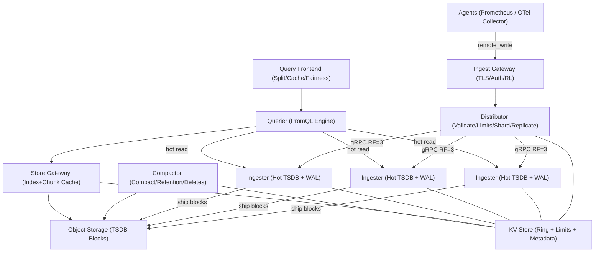
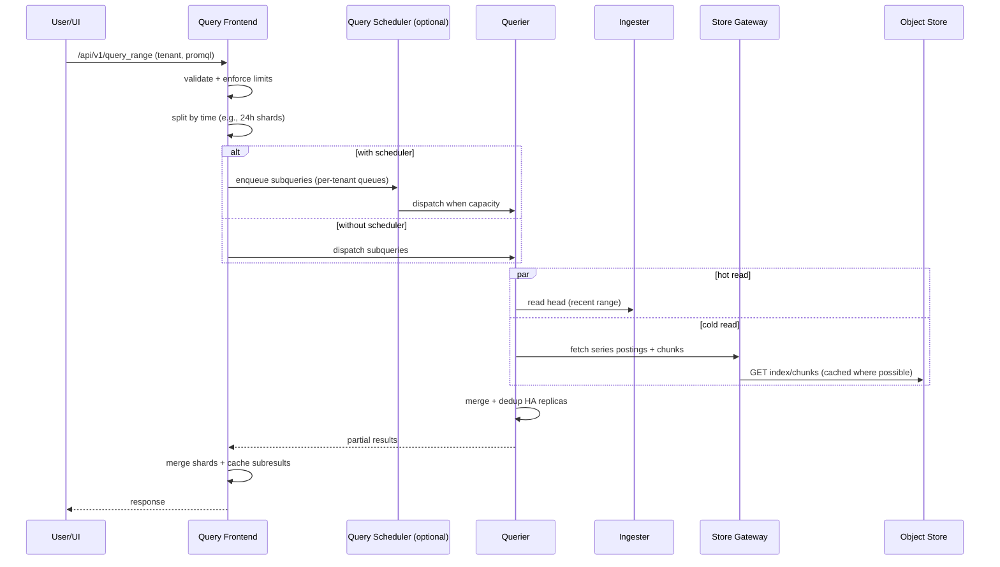

## Overview

A high-cardinality metrics pipeline (Prometheus/Cortex/Mimir-like) ingests tens of millions of samples per second across many tenants, while serving low-latency PromQL queries over “hot” recent data and cost-efficient “cold” historical data stored for months to years.

The hard parts are:

- **Cardinality explosions** (labels like `user_id`, `pod_uid`, `trace_id`) driving unbounded memory, index bloat, query fanout, and unpredictable cost.
- **Multi-tenant fairness** under noisy neighbors (one tenant can saturate ingest or queries).
- **Durable, scalable storage** where recent data is written frequently (append-heavy) but old data should be cheap, immutable, and cache-friendly.
- **Partial failures** (node/AZ outages, object-store degradation, KV/ring issues) without losing acknowledged data or cascading outages.

This design uses a proven pattern:

- **Write path**: stateless edge + distributor(s) with **validation/limits**, sharding via a **consistent-hash ring**, replication to stateful **ingesters** that persist via **WAL**.
- **Storage**: ingesters periodically cut immutable TSDB **blocks** and upload them to **object storage**.
- **Read path**: **query frontend** for splitting/caching/fairness; **queriers** fan out to ingesters (hot) and **store gateways** (cold), with query-time **deduplication** for HA scrapers.
- **Control plane**: per-tenant limits/config, ring membership, and block metadata coordination via a highly available KV.

## Requirements

### Functional Requirements

- Ingest metrics via **Prometheus `remote_write`**; optionally accept **OTLP** through an OpenTelemetry Collector that translates to `remote_write`.
- Serve **Prometheus-compatible PromQL APIs**: instant queries, range queries, label APIs.
- Support **multi-tenancy**: authentication/authorization, per-tenant limits, per-tenant retention, and tenant lifecycle management.
- Support **long-term retention** (e.g., 13 months) using block compaction, retention enforcement, and deletion via tombstones.
- Support **HA remote_write deduplication** (two scrapers sending the same targets) at query time.
- Provide **recording rules** and **alerting rules** evaluation at scale.
- Provide **cardinality visibility** (top-N series/label contributors) and **cardinality enforcement** (reject/drop/roll up).
- Support **administrative ops**: bounded backfills, deletes, tenant disable/quarantine, and configuration rollouts.

### Non-Functional Requirements

#### Scale (Example Target)

These numbers are intentionally “big-cloud” and require strong per-tenant isolation and automation.

- **Tenants**: up to **50k** (long tail + a few very large tenants).
- **Active series (fleet-wide)**: **120M typical**, **200M peak**.
- **Ingest rate**: **20M samples/sec sustained**, **40M samples/sec peak**.
- **Retention**: **13 months** for standard tiers; higher tiers via per-tenant config.

Quick sanity checks:

- With a **15s** effective sample interval, **200M series** implies ~`200M / 15 ≈ 13.3M samples/sec`. Peaks to 40M/s typically come from bursty workloads, shorter intervals, rule results, or uneven tenant distribution.
- A practical “north star” is sizing ingesters by **active series** (memory) and **samples/sec** (CPU + WAL I/O). Concrete sizing is in **Scaling & Performance**.

#### Latency (SLO Targets)

- **Ingest acknowledgment latency** (gateway response, excluding client batching):
  - P50 **≤ 50ms**, P99 **≤ 250ms**
- **Instant query (primarily last 2h, cacheable selectors)**:
  - P50 **≤ 200ms**, P99 **≤ 2s**
- **Range query (7d, 15s step) with splitting + caching**:
  - P50 **≤ 1.5s**, P99 **≤ 8s**
- **Label APIs** (high risk for fanout):
  - P50 **≤ 500ms**, P99 **≤ 5s** with strict limits and mandatory time bounds

#### Availability / Durability

- **API availability (ingest/query)**: **99.95%** monthly.
- **Historical queries during object-store incidents**: **99.9%** best-effort (hot data still available from ingesters; cold data may degrade).
- **Durability / RPO**:
  - For **acknowledged writes**: **RPO ~0** when using **quorum replication with WAL fsync before ack**.
  - Cross-AZ is handled by replication; cross-region DR depends on object-store replication + config backup (see **Disaster Recovery**).
- **RTO**:
  - Regional restore target: **≤ 30 minutes** (warm standby + pre-provisioned infra + object-store replication).

### Constraints & Assumptions

- Write traffic is bursty and tenant-skewed (a few tenants dominate volume).
- No PII in labels; enforce via validation/policy. If compliance requires: encrypt at rest, audit logs, and controlled egress.
- Clients use compression and batching (`snappy` + protobuf for remote_write).
- Ingestion is **at-least-once** (clients retry); duplicates must be tolerated.
- Storage cost favors object storage over always-on SSD fleets; compute scales elastically.

## Architecture

### High-Level Diagram

### Query Data Flow (Hot + Cold + Dedup)

## Components

### Ingest Gateway

**Responsibilities**
- Terminate TLS, authenticate tenant identity (mTLS/JWT/API key), and apply coarse rate limiting/load shedding.
- Normalize headers (`X-Scope-OrgID` or equivalent) and route to distributors.

**Key design points**
- Enforce auth at the edge so internal services can assume a trusted identity.
- Use fast, deterministic rejection on overload (HTTP `429` / `503`) to protect stateful components.

**Implementation notes**
- Envoy or NGINX with external auth, plus per-tenant rate limiting (local token buckets; global RL via Redis/Envoy global RL only if required).

### Distributor

**Responsibilities**
- Validate incoming samples and label sets.
- Enforce per-tenant limits (ingest rate, active series, new series rate, max label count/length).
- Shard series to ingesters using a consistent-hash ring.
- Replicate writes with **RF=3** (zone-aware) and manage backpressure.

**Write acknowledgment (important for durability)**
- **Ack after quorum**: return success only after **2 of 3** ingesters confirm **WAL append + fsync** (or equivalent durability point).
- This provides **RPO ~0 for acknowledged writes** even if one ingester dies immediately after ack.

**Cardinality controls (first line of defense)**
- Hard limits:
  - max labels per series (e.g., 30–60)
  - max label name/value length (e.g., 128/2048)
  - max active series per tenant
  - max new series/sec per tenant
  - max samples/sec per tenant
- Policy controls:
  - denylist risky label keys (`user_id`, `email`, `trace_id`, `pod_uid`) unless explicitly allowlisted.
  - optionally apply **label normalization** (drop empty labels, enforce allowed charset).
- Overload behavior:
  - Prefer rejecting **new series** first (stabilizes memory).
  - If necessary, reject entire tenant with clear error codes to limit blast radius.

**Isolation**
- Use **shuffle sharding** (each tenant maps to a subset of ingesters/queriers) to reduce noisy-neighbor impact and speed up recovery.

### Ingester (Hot TSDB)

**Responsibilities**
- Maintain the TSDB “head” for owned series (in-memory + local chunks).
- Persist writes via **WAL** and checkpoints for recovery.
- Periodically cut **immutable blocks** (commonly 2h ranges) and upload to object storage.
- Serve low-latency reads for recent ranges and rule evaluations.

**Key design points**
- WAL on local SSD/NVMe; ensure fsync behavior matches durability requirements.
- Controlled ring membership changes (join/leave/drain) to avoid reshuffling storms.
- Zone-aware replication to tolerate a node/AZ loss without losing acknowledged data.

**Operational guardrails**
- Limit out-of-order sample windows (e.g., allow small clock skew; reject extreme out-of-order to protect compaction and query correctness).
- Enforce per-tenant “head” bounds (active series, chunks, and memory pressure triggers).

### Store Gateway (Historical Read Path)

**Responsibilities**
- Serve reads over immutable blocks stored in object storage.
- Cache block indexes/postings and optionally chunks to reduce object-store calls and tail latency.

**Key design points**
- Cache hierarchy:
  - **Index/postings cache** (in-memory + disk): long-lived, high leverage.
  - **Chunk cache** (optional memcached/redis): helps with repeated dashboard queries.
- Shard responsibility across store gateways by block ID/time to scale linearly.
- Circuit-breaker and retry budgets to prevent cascading failures when object storage is slow.

### Query Frontend / Scheduler / Querier

**Responsibilities**
- Provide Prometheus-compatible APIs.
- Enforce query limits and fairness; protect the system from expensive queries.
- Split large range queries and cache subresults.
- Execute PromQL and merge/deduplicate results.

**Key design points**
- Query splitting: split by time (e.g., 6h–24h) and parallelize.
- Fairness:
  - per-tenant queues + max concurrency
  - global max in-flight work
  - request prioritization (interactive dashboards > background label APIs > ad-hoc heavy queries)
- Deduplication:
  - Use external labels (e.g., `cluster`, `replica`) to deduplicate HA replicas at query time.
  - Prefer deterministic behavior: same input + same data returns same output.

### Compactor

**Responsibilities**
- Compact smaller blocks into larger blocks for efficiency and faster queries.
- Apply retention policies and delete tombstoned data by rewriting blocks.
- Maintain block metadata and detect partial uploads/corruption.

**Key design points**
- Single-writer per tenant (or per tenant shard) to avoid conflicting mutations.
- Track and alert on compaction backlog; compaction is often the “silent” SLO killer for long-range queries.

### Ruler (Rules Evaluation)

**Responsibilities**
- Evaluate recording and alerting rules per tenant.
- Write recording rule results back into the pipeline via remote_write.
- Integrate with Alertmanager for notifications.

**Key design points**
- Treat rules as “production workloads”: rules can cause query storms and write amplification.
- Enforce per-tenant rule limits (max groups, evaluation interval floors, max query cost per rule).

## Data Model

### Core Concepts

- **Sample**: `(timestamp, value)` for a time series.
- **Series**: a metric name + label set (labels define cardinality).
- **Fingerprint**: stable hash of label set used for sharding (must be consistent across components).
- **Head**: mutable recent data in ingesters.
- **Block**: immutable, time-bounded TSDB segment stored in object storage.

### Storage Layout (Object Storage)

Per-tenant prefix (often `/<tenant>/`), per-block ULID:

- `/<tenant>/blocks/<ulid>/meta.json`
  - `minTime`, `maxTime`, `stats` (series/samples), compaction level, source labels, version.
- `/<tenant>/blocks/<ulid>/index`
  - symbol table, postings lists (`label=value → series IDs`), series entries pointing to chunks.
- `/<tenant>/blocks/<ulid>/chunks/<segment>`
  - compressed chunk segments.
- `/<tenant>/blocks/<ulid>/tombstones`
  - delete selectors and time intervals.

### Control-Plane Data (KV Store)

- Ring membership (ingesters/store gateways):
  - tokens, zone, heartbeat, readiness state.
- Per-tenant limits/config:
  - ingest/query limits, retention, label allow/deny policies, rule configs pointers.
- Optional block metadata coordination:
  - used to accelerate block discovery and coordinate compaction/sharding.

## API

### Authentication / Tenant Identity

- Tenant identity must be established at the gateway (JWT claim, mTLS SAN, or API key) and forwarded internally as `X-Scope-OrgID` (or equivalent).
- Authorization model should support: tenant isolation, admin access, and read-only access tiers.

### Ingestion API (Prometheus remote_write)

**POST `/api/v1/push`** (common Cortex/Mimir pattern)  
Optionally also support **POST `/api/v1/write`** as an alias.

- Headers:
  - `X-Scope-OrgID: <tenant>`
  - `Content-Encoding: snappy`
  - `Content-Type: application/x-protobuf`
- Body:
  - `prometheus.remote.WriteRequest` (protobuf, snappy-compressed)
- Responses:
  - `200 OK`: accepted (quorum durable)
  - `400 Bad Request`: invalid protobuf, invalid labels, timestamps out of bounds
  - `401/403`: authn/authz failure
  - `429 Too Many Requests`: per-tenant ingest/cardinality limits exceeded
  - `503 Service Unavailable`: overload, ring unhealthy, insufficient quorum

**Idempotency and duplicates**
- Clients retry; ingestion is **at-least-once**.
- Ingester should de-duplicate identical samples by `(series, timestamp)` within a bounded window (implementation-dependent).
- HA scrapes are deduplicated at query time using external labels; do not attempt global exactly-once.

### Query APIs (Prometheus-compatible)

**GET `/api/v1/query`**
- Params: `query`, optional `time`
- Limits: max samples scanned, max series returned, max query time, max lookback.
- Errors: `bad_data`, `execution`, `timeout`, `canceled`.

**GET `/api/v1/query_range`**
- Params: `query`, `start`, `end`, `step`, optional `timeout`
- Frontend may split internally; response is merged deterministically.

**GET `/api/v1/series`**
- Params: `match[]`, `start`, `end`
- Must enforce strict limits:
  - mandatory time bounds
  - max matchers
  - max returned series
  - max bytes scanned

**GET `/api/v1/labels`**, **GET `/api/v1/label/{name}/values`**
- Require time bounds by default (or enforce a small default window).
- Cache responses carefully; these endpoints can be expensive on high cardinality.

### Error Contract

- JSON payload with:
  - `status`, `errorType`, `error`, optional `warnings`
- Include `Retry-After` on `429` where practical.
- Prefer “fast fail” for obviously expensive requests (e.g., missing time bounds on label APIs).

## Scaling & Performance

### Capacity Planning (Back-of-the-Envelope)

**Inputs (example)**
- Peak ingest: **40M samples/sec**
- Active series: **200M**
- Replication factor: **RF=3**, quorum ack **2/3**
- Block range: **2h**

**Ingester sizing heuristics**
- **Memory** is dominated by active series in the head. A reasonable planning range is **~2–6 KB per active series** depending on label sizes, head chunk state, and implementation.
  - Example: `200M series × 3 KB ≈ 600 GB` memory across ingesters (head only; excludes OS cache and overhead).
- **CPU/WAL I/O** scale with samples/sec.
  - Example: if an ingester comfortably handles **200–400k samples/sec** at acceptable WAL fsync latency, then `40M / 300k ≈ 134` ingesters at peak (plus headroom).
- **Practical starting point** for this scale:
  - **150–250 ingesters** across 3 AZs, each ~`16–32 vCPU`, `64–128 GB RAM`, `1–2 TB NVMe` for WAL + cache, depending on label sizes and workload.

**Distributor sizing**
- Distributors are stateless but CPU-heavy on validation + hashing.
- Size by peak remote_write RPS and total samples/sec; plan for burst absorption and tenant skew.

**Store gateway sizing**
- Size primarily by:
  - cache capacity (RAM + disk)
  - object-store request rate limits
  - concurrency for parallel chunk fetches
- Shard blocks across gateways and scale linearly.

### Bottlenecks and Mitigations

- **Active series memory (ingesters)**
  - Mitigate with:
    - per-tenant active series limits + new series rate limits
    - reject-new-series-on-pressure mode
    - shuffle sharding to contain a tenant’s blast radius
- **Query fanout (PromQL selectors)**
  - Mitigate with:
    - query splitting + caching
    - max series/bytes scanned limits
    - mandatory time bounds for label APIs
    - promote expensive dashboards to recording rules
- **Object store tail latency / throttling**
  - Mitigate with:
    - aggressive index/postings caching
    - chunk cache for hot dashboards
    - compaction to reduce index/chunk seeks
    - circuit breakers + retry budgets + request hedging (carefully)

### Horizontal Scaling

- Stateless services (gateway/distributor/query-frontend/querier/scheduler): scale by replicas behind L7 load balancers.
- Stateful services:
  - ingesters: scale by adding nodes + ring rebalancing; zone-aware replication; controlled rollouts.
  - store gateways: scale by block sharding and increasing cache capacity.
  - compactor: scale by tenant sharding (single-writer per shard).

### Caching Strategy

- **Query result cache** (frontend):
  - Keyed by `(tenant, query, start, end, step, engine-version)`
  - TTL: **5–30 minutes** depending on workload
  - Avoid caching very recent ranges (e.g., last 5–15 minutes) or cache with short TTL to reduce staleness surprises.
- **Index/postings cache** (store gateway):
  - TTL: hours; LRU/ARC eviction
  - Warm popular tenants/blocks proactively if needed.
- **Chunk cache** (optional):
  - Memcached/Redis with TTL aligned to block immutability (days/weeks), bounded by cost.
- **Invalidation**
  - Immutable blocks simplify caching; only hot “head” data changes frequently.

## Trade-offs & Alternatives

### Key Trade-offs

- **Object storage + immutable blocks**
  - Pros: cheap, durable, easy cache semantics, scalable retention.
  - Cons: higher tail latency than local disks; requires store gateways and robust caching; depends on object-store reliability.
- **Quorum replicated, at-least-once ingestion**
  - Pros: simple client behavior, robust under retries and partial failures, RPO ~0 for acknowledged writes.
  - Cons: duplicates possible; higher write amplification; careful WAL/fsync tuning required.
- **Strict cardinality enforcement**
  - Pros: predictable cost and stable SLOs; prevents platform-wide incidents.
  - Cons: teams may lose “debug” dimensions; requires education and alternative observability patterns (logs/traces, exemplars).
- **Query-time HA deduplication**
  - Pros: simpler ingestion; avoids coordination between scrapers.
  - Cons: queries do more work; requires consistent external labels and correct dedup configuration.

### Alternatives

- **Single-node Prometheus + remote storage**
  - Works for small, single-tenant setups; breaks down on multi-tenant isolation, HA, and high-cardinality cost control.
- **Kafka-first ingestion pipeline**
  - Useful for replay/backfill and multiple downstream consumers, but adds operational overhead and can increase end-to-end latency/cost.
- **OLAP store for metrics (e.g., ClickHouse)**
  - Excellent for analytics; harder to match PromQL semantics and high-ingest time-series write patterns as the primary store. Often best as a complementary path for long-range analytics.

## Failure Modes & Mitigations

### Failure Scenarios

1) **Ingester node crash**
- Impact: reduced replication; hot reads may partially fail; possible data loss only if quorum durability isn’t met.
- Detection: ring heartbeat missing; increased distributor quorum failures; WAL replay events.
- Mitigation:
  - RF=3 with zone-aware replication
  - quorum ack after WAL fsync
  - controlled rollouts with drain/leave
  - automatic resharding with bounded churn

2) **AZ outage**
- Impact: 1/3 capacity loss (or more); ingest may continue if quorum can be achieved across remaining AZs; query capacity reduced.
- Detection: multi-service error spikes localized to AZ; ring shows zone down.
- Mitigation:
  - zone-aware placement + RF=3
  - load-shed non-critical tenants first (tiered limits)
  - pre-provision headroom in remaining AZs

3) **KV/ring store outage or high latency**
- Impact: inability to join/leave; routing instability if ring cannot be read; rollout operations stall.
- Detection: KV request errors/latency; ring convergence alerts.
- Mitigation:
  - HA etcd/Consul (odd quorum, spread across AZs)
  - cached ring reads with TTL; freeze ring changes during outage
  - separate KV clusters for ring vs tenant config (blast-radius reduction)

4) **Object store partial outage / throttling**
- Impact: historical queries slow/fail; block shipping/compaction backlog grows; increased tail latency.
- Detection: store gateway object-store 5xx/429s; increased GET latency; compactor backlog.
- Mitigation:
  - serve recent data from ingesters
  - index/chunk caching + circuit breakers
  - retry budgets with jitter; avoid thundering herds
  - multi-region object-store replication for DR

5) **Cardinality explosion (bad deploy adds high-card label)**
- Impact: ingester memory pressure/OOM, query fanout, cost spike; platform-wide instability without isolation.
- Detection: spikes in `new_series/sec`, `active_series`, rejected samples; top-N label reports.
- Mitigation:
  - denylist/allowlist policies
  - enforce max new series/sec and active series
  - automatic reject-new-series mode under pressure
  - tenant quarantine + rollback playbook + postmortem guardrail (CI checks for label policies)

6) **Query storm (dashboards, wide selectors, label APIs)**
- Impact: querier saturation; cache churn; tail latency spikes for all tenants.
- Detection: per-tenant queue depth; timeouts; CPU saturation; cache miss spikes.
- Mitigation:
  - query frontend fairness + per-tenant concurrency caps
  - enforce time bounds and max bytes scanned
  - require recording rules for expensive dashboards
  - rate-limit label APIs aggressively

### Disaster Recovery

- **Data**: object storage is the source of truth for historical blocks; WAL + replication protect recent acknowledged data.
- **Backups**
  - Object store: versioning + lifecycle policies; cross-region replication for DR.
  - Config: periodic backups of tenant configs, rule definitions, and limit policies.
  - KV store: snapshots and tested restore procedures.
- **Failover**
  - Warm standby in secondary region with pre-provisioned capacity.
  - Restore KV/config, bring up gateways/distributors/queriers/store gateways/compactor.
  - Gradually enable writes per tenant with conservative limits until stable.

## Operations

### SLOs, SLIs, and Alerts (Examples)

**Ingest**
- SLIs: request success rate, ack latency, quorum failure rate, rejected samples by reason, WAL fsync latency.
- Alerts:
  - `P99 ingest ack latency > 500ms for 5m`
  - `quorum_write_failures > 0.1% for 5m`
  - `tenant_rejections_rate spikes` (with top tenants)

**Query**
- SLIs: latency (P50/P99), error rate, queue depth, bytes scanned, cache hit rate, timeouts.
- Alerts:
  - `P99 query latency > 8s for 10m`
  - `frontend queue depth growing for 10m`
  - `cache hit rate drops > X%` (indicates churn or config regression)

**Storage**
- SLIs: block upload lag, compaction backlog age, object-store 5xx/429 rate, store-gateway cache evictions.
- Alerts:
  - `compaction backlog age > 6h`
  - `object store 5xx > 1% for 10m`
  - `block upload failures sustained`

### Runbooks (Minimum Set)

- Cardinality incident: identify top contributors, quarantine tenant, apply label denylist, rollback guidance.
- Object store degradation: enable stricter query limits, prioritize hot reads, reduce concurrency, validate cache health.
- KV outage: freeze ring changes, fail open on cached ring reads, halt deployments affecting stateful components.
- Ingester memory pressure: activate reject-new-series, drain impacted tenant shards, scale out ingesters.

### Deployment Strategy

- Stateless services (gateway/distributor/query-frontend/querier/scheduler):
  - rolling deploy with canaries and auto-rollback on SLO burn.
- Stateful ingesters:
  - zone-by-zone rollout; remove from ring, drain, deploy, rejoin
  - enforce max unavailable to preserve quorum
- Store gateways/compactors:
  - canary and watch object-store request rates, cache performance, and query tail latency
- Format/schema changes:
  - versioned readers; avoid dual-write unless unavoidable; use compactor-driven migration when needed.

### Security & Compliance

- Tenant isolation:
  - enforce tenant identity at gateway
  - strict authorization checks for admin APIs (deletes, limits, rule changes)
- Data protection:
  - encrypt at rest (object store + disks), encrypt in transit (mTLS internally if required)
  - audit logs for admin actions and deletes
- Label hygiene:
  - enforce “no PII in labels” via denylist + regex validation
  - provide guidance and automated detection to teams

## References & Further Reading

- Prometheus TSDB storage: https://prometheus.io/docs/prometheus/latest/storage/
- Grafana Mimir architecture: https://grafana.com/docs/mimir/latest/
- Cortex architecture and components: https://cortexmetrics.io/docs/
- Thanos (object storage + query/store gateway patterns): https://thanos.io/
- Monarch paper (planet-scale TSDB concepts): https://research.google/pubs/pub50652/
- VictoriaMetrics trade-offs: https://victoriametrics.com/
- OpenTelemetry Collector: https://opentelemetry.io/docs/collector/