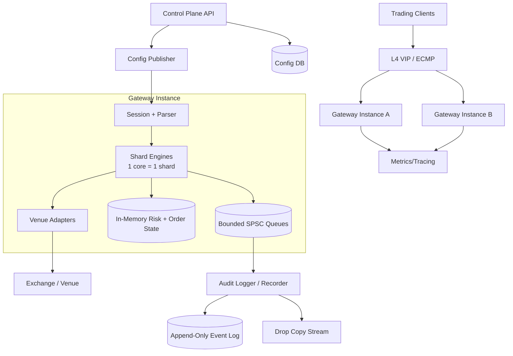
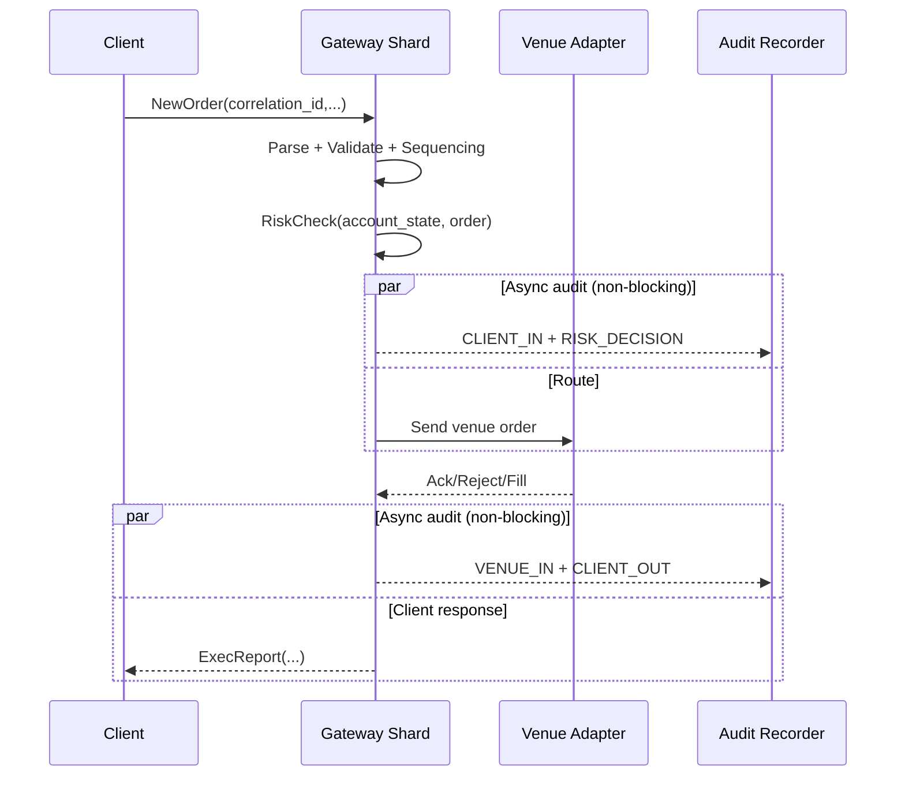

## Overview

A high-frequency trading (HFT) order entry gateway sits on the critical path between trading clients and exchange matching engines. The goal is not just low average latency, but **predictable tail latency** (jitter control) while enforcing strict **pre-trade risk controls** (credit, positions, fat-finger limits) and producing an **auditable, tamper-evident trail** suitable for regulatory reconstruction.

The core architectural idea is to separate the system into:

- A **deterministic fast path**: parse → validate → risk check → route, entirely in-process, with bounded memory and minimal cross-core coordination.
- A **non-blocking slow path**: audit persistence, drop-copy distribution, metrics/analytics, and control-plane workflows that must not introduce backpressure into trading.

This document describes a production-ready design that is interview-friendly while reflecting real-world constraints (stateful sessions, exchange protocols, durability, and operational discipline).

---

## Requirements

### Functional Requirements

- Accept order entry over low-latency protocols:
  - FIX 4.2/4.4 over TCP (interoperability).
  - Optional binary framed protocol (lower CPU/jitter, simpler parsing).
- Per-session authentication, sequencing, and heartbeats.
- Inline **pre-trade risk checks** for each order:
  - Credit/notional, quantity, price collars, max open orders, rate limits.
  - Optional per-instrument and per-venue constraints.
- Deterministic behavior:
  - Strict per-session sequencing.
  - Well-defined overload prioritization (e.g., cancels > replaces > new orders) without breaking per-order correctness.
- Route to one or more venues with venue-specific adapters (FIX/OUCH/binary).
- Support order lifecycle: new, cancel, replace/modify, status/query.
- Emit:
  - **Drop copy** (near-real-time copy of order/exec flow).
  - **Immutable audit log** of inbound/outbound messages and risk decisions.
- Administrative controls:
  - Limits and session provisioning.
  - Kill-switch (per-account and global).
  - Trading halts and venue disables.
- Observability:
  - Latency histograms, reject reasons, disconnects, queue depths, health endpoints.

### Non-Functional Requirements (Targets)

#### Scale (per colo)

- Concurrent client sessions: 1,000–5,000 (stateful TCP sessions; most traffic typically concentrated in tens to hundreds of active sessions).
- Burst traffic: up to 500k messages/sec for short intervals (1–10s).
- Sustained traffic: 100k messages/sec.
- Accepted order throughput to venues: up to 25k–75k orders/sec (depends on venue session fan-out and client mix; cancels often dominate bursts).
- Reference data: 50k–500k instruments.
- Risk state: 10k–100k accounts with hot set typically much smaller (cache locality matters more than raw size).

#### Latency (gateway internal, *first byte received → first byte written to venue socket*, excluding venue RTT)

Latency is highly dependent on protocol and networking mode; set **separate SLOs**:

- **Binary protocol + kernel-bypass/busy-poll** (best case):
  - P50 ≤ 10 µs
  - P99 ≤ 50 µs
  - P99.9 ≤ 150 µs at configured peak load
- **FIX over TCP (tuned kernel, epoll + busy-poll)**:
  - P50 ≤ 25 µs
  - P99 ≤ 150 µs
  - P99.9 ≤ 400 µs at configured peak load

These targets are achievable with CPU pinning, bounded allocation, and avoiding cross-core contention. “Microseconds” is realistic; “single-digit microseconds for FIX parsing and full risk + routing under heavy load” is typically not.

#### Availability & Safety

- 99.99% during trading hours (planned maintenance outside market hours).
- Fail-closed behavior:
  - Prefer deterministic rejects over unbounded queuing.
  - Preserve cancel capability during overload wherever possible.
- No single shared dependency on the fast path (no synchronous DB, no remote RPC).

#### Consistency

- **Linearizable per-account risk state** within a shard (single-writer).
- Deterministic per-session sequencing (no reordering across a session).
- Eventual consistency for dashboards, analytics, and historical reporting.

#### Durability & Auditability

- Audit trail is reconstructable for all messages exchanged with venues and clients.
- Regulatory-grade timestamps with quality markers (PTP/PHC health).
- RPO expectations depend on what is considered “accepted”:
  - **RPO=0 for messages observed on the wire** can be achieved via independent packet capture / drop-copy recorder.
  - Structured event logs in the gateway are best-effort unless you add synchronous replication (which increases tail latency).

### Constraints & Assumptions

- Colocated deployment in exchange data centers; on-box jitter dominates internal latency.
- External SaaS connectivity may be restricted; assume colo-friendly/on-prem components.
- Time synchronization: PTP (IEEE 1588) with NIC hardware timestamping (PHC).
- Specialized hardware may be available (low-latency NICs, PTP Grandmaster, optional FPGA), but the design remains software-first.

---

## Architecture

### Principles

- **Single-writer shards** for determinism and linearizable local state.
- **Bounded resources** everywhere: fixed-size queues/pools and explicit overload policies.
- **No synchronous I/O** on the fast path (disk, remote RPC, centralized DB).
- **Explicit state machines** for sessions and venue connectivity.
- **Audit independence**: compliance capture should not rely on the trading process staying alive.

### High-Level Component Diagram



### Sharding Model (Deterministic Fast Path)

```mermaid
flowchart LR
  subgraph Host[One Gateway Host]
    direction LR
    L4[L4 Session Affinity] --> S[Session]
    S --> H[Shard Hash(account_id/session_id)]
    H --> E0[Shard 0<br/>Core 0]
    H --> E1[Shard 1<br/>Core 1]
    H --> E2[Shard 2<br/>Core 2]
    H --> EN[Shard N<br/>Core N]
  end
```

- Each shard is a single-threaded event loop pinned to a core.
- All mutable per-account state (limits consumption, open orders, idempotency cache) lives on that shard.
- Cross-shard interactions are avoided; where necessary (rare), use one-way message passing with bounded queues.

---

## Components

### 1) Order Gateway (Fast Path Engine)

**Responsibilities**
- Session handling, message parsing, validation.
- Per-session sequencing and idempotency.
- Inline risk checks.
- Routing decisions and venue adapter interaction.

**Key Design Decisions**
- Single-threaded shard engines with:
  - Preallocated object pools and fixed-size ring buffers.
  - Hot/cold struct layouts and cache-line alignment for hot state.
- Deterministic overload policy:
  - Maintain strict per-session ordering.
  - Under overload, prefer processing cancels/replaces already in the session stream, but avoid “skipping ahead” in a way that breaks sequence-based correctness.

**Implementation Notes**
- Prefer Rust or C++ for predictable latency; Java can work only with stringent allocation discipline and demonstrated jitter bounds.
- Prefer parsing that minimizes branchiness (e.g., SBE for binary, or a highly optimized FIX parser with precomputed tag tables).

---

### 2) Inline Risk Engine (Pre-Trade)

**Responsibilities**
- Evaluate risk checks per order with deterministic reject reasons:
  - Credit/notional caps, qty limits, max open orders, max order rate, price collars.
  - Optional instrument allow/deny lists and venue restrictions.
- Maintain per-account consumption state (e.g., open order count, notional-at-risk).

**Consistency Model**
- Linearizable per-account within a shard: a single writer updates risk state at the same point it decides to send/reject.

**Design Details**
- Two-tier limits:
  - Static config (limits, symbol scopes, rate limit parameters).
  - Dynamic consumption (open orders, outstanding notional, throttling counters).
- Conservative approach for cross-venue/netting complexity:
  - Real-time checks enforce conservative bounds locally.
  - Asynchronous reconciliation computes firm-wide exposure and can tighten limits via control-plane updates.

---

### 3) Venue Adapters (Exchange Connectivity)

**Responsibilities**
- Maintain venue sessions (logon, heartbeats, sequence numbers).
- Encode/decode venue messages and enforce venue constraints.
- Handle acks/rejects/fills and map to client execution reports.

**Key Design Decisions**
- Explicit state machines and deterministic timeouts (no blocking I/O).
- Session fan-out per venue:
  - Multiple order-entry sessions to increase throughput and reduce head-of-line blocking.
- Optional “cancel lane”:
  - Prioritize cancels by allocating dedicated venue sessions/queues (if venue semantics allow).

**Networking Options**
- Tuned kernel networking with busy-poll and IRQ affinity (simpler ops).
- Kernel-bypass (DPDK/AF_XDP/Onload) for lower jitter (higher complexity).

---

### 4) Audit & Drop Copy

**Responsibilities**
- Capture:
  - Inbound client messages (raw bytes).
  - Normalized order intents and risk decisions.
  - Outbound venue messages.
  - Inbound venue responses (acks/fills/rejects).
- Provide replay capability for post-trade reconstruction and debugging.
- Provide drop-copy feeds for compliance and downstream systems.

**Production-Grade Audit Strategy**
Use a layered approach:

1. **Independent wire capture / recorder (best for RPO=0 on the wire)**  
   - SPAN/TAP or dedicated capture NIC/host records all ingress/egress packets.
   - Lowest impact on trading latency; strongest “what actually happened” record.
2. **Structured append-only event log (best for replay and analysis)**  
   - Gateway emits normalized events asynchronously through bounded SPSC queues.
   - Log records include sequence numbers and clock-quality metadata.

**Backpressure Policy**
- If audit queues are near saturation:
  - Reject *new* orders with `BUSY_AUDIT_BACKPRESSURE`.
  - Continue to process cancels/replaces (risk-reducing) when safe.
  - Shed non-critical telemetry before shedding audit.

---

### 5) Control Plane

**Responsibilities**
- AuthN/AuthZ for administrators (mTLS, RBAC).
- Source-of-truth configuration management:
  - Accounts, sessions, risk limits, venue enablement.
- Distribute versioned config snapshots + deltas to gateways.
- Kill-switch and trading halt mechanisms.

**Safety Properties**
- Fail-closed:
  - If config is missing/invalid/out-of-date beyond a configured bound, reject trading for affected accounts.
- Deterministic application:
  - Gateways apply config updates at shard boundaries and track version per shard.

---

### 6) Observability

**Responsibilities**
- Low-overhead metrics (histograms/counters) and tracing hooks.
- Per-stage latency measurement using monotonic clocks; optional PHC/NIC timestamps when available.
- High-cardinality tags are constrained (avoid per-order labels in Prometheus).

---

## Data Model

### Authoritative Config Store (Not on Fast Path)

A relational DB (e.g., Postgres) is appropriate for operational tooling and auditability.

- `accounts(account_id PK, status, base_currency, created_at, updated_at)`
- `sessions(session_id PK, account_id FK, protocol, api_key_id, source_ip_cidr, enabled, created_at, updated_at)`
- `risk_limits(account_id PK, max_notional, max_order_qty, max_open_orders, max_orders_per_sec, price_collar_bps, instrument_scope, version, updated_at)`
- `venue_routes(account_id, symbol_pattern, venue_id, priority, enabled, version, updated_at)`
- `venues(venue_id PK, protocol, session_params_json, enabled, updated_at)`
- `admin_audit(id PK, actor, action, target, before_json, after_json, ts)`

Gateways consume this data as **signed, versioned snapshots** plus deltas.

### In-Memory State (Per Shard)

Hot-path structures (cache-conscious, bounded):

- `SessionState`: seq tracking, auth state, heartbeat timers, idempotency cache index.
- `AccountRiskState`: open orders count, notional-at-risk, throttle counters, last config version.
- `OrderState`: mapping from `ClOrdID`/internal order id to venue order id, leaves, status (bounded by max open orders).
- `IdempotencyCache`: fixed-size ring + hash index for recent `correlation_id` → prior outcome.

### Event Log Schema (Append-Only; Schema-on-Read)

- `EventHeader`
  - `ts_mono` (monotonic timestamp for ordering)
  - `ts_phc` (optional NIC/PHC timestamp)
  - `clock_quality` (PTP locked/holdover/free-run + offset)
  - `gateway_instance_id`, `shard_id`
  - `session_id`, `account_id`
  - `seq_in` (per session input sequence)
  - `seq_shard` (per-shard monotonic sequence)
  - `correlation_id` (client idempotency key)
  - `event_type` (CLIENT_IN, RISK_DECISION, VENUE_OUT, VENUE_IN, CLIENT_OUT, CONTROL_APPLIED)
- `EventPayload`
  - Raw bytes (original message) and/or normalized fields.

### Data Flow (Order Lifecycle)



---

## API

### Trading API (Low-Latency)

**Supported protocols**
- FIX 4.2/4.4 over TCP for compatibility.
- Optional binary protocol (recommended for lowest jitter).

**Core message types**
- Session:
  - `Logon`, `Logout`, heartbeat/test-request.
- Orders:
  - `NewOrder(correlation_id, cl_ord_id, symbol, side, qty, price, tif, venue_hint?)`
  - `Cancel(correlation_id, orig_cl_ord_id)`
  - `Replace(correlation_id, orig_cl_ord_id, new_qty?, new_price?)`
- Reports:
  - `ExecReport(order_id, status, filled_qty, leaves_qty, avg_px, reason_code?)`

**Deterministic error codes**
- `INVALID_MESSAGE`, `INVALID_SYMBOL`, `SESSION_DISABLED`, `UNAUTHORIZED_IP`
- `DUPLICATE_CORRELATION_ID` (returns prior outcome)
- `RISK_LIMIT_BREACH` (with subcode: NOTIONAL/QTY/PRICE_COLLAR/OPEN_ORDERS)
- `THROTTLED`
- `BUSY_AUDIT_BACKPRESSURE`, `BUSY_INTERNAL_QUEUE`

**Idempotency**
- Require `correlation_id` (or FIX `ClOrdID`) unique per session within a retention window (e.g., last 1–5 minutes or last N=1e6 ids).
- On duplicate, return the prior decision and order identifiers deterministically.

**Ordering guarantees**
- Per-session strict ordering; the gateway rejects messages with unexpected sequence (or requests resend per FIX semantics).
- If clients need higher availability, allow multiple sessions per account; risk state remains consistent within the shard keyed by `account_id`.

### Admin / Control API (mTLS + RBAC)

Representative endpoints:

- `PUT /v1/limits/{account_id}` (optimistic concurrency with `version`)
- `POST /v1/sessions/{session_id}/disable`
- `POST /v1/kill-switch` (scope: global/account/venue)
- `POST /v1/venues/{venue_id}/disable`
- `GET /v1/health`
- `GET /v1/metrics`
- `GET /v1/latency` (rolling histograms and queue depths)

Security requirements:
- mTLS client certs, least-privilege roles, full admin audit log, and approval workflow for high-impact actions (kill-switch, limit increases).

---

## Scaling

### Capacity Planning (Example)

Assume a gateway host with 32 physical cores (no SMT), pinned:

- 1–2 cores: networking/IO threads (depending on bypass mode).
- 24–28 shard cores: session + risk + routing.
- 2–4 cores: venue adapters (or venue adapters can be co-located with shards if design allows).
- Remaining cores: audit writer, telemetry, control-plane subscriber.

At 100k msgs/sec sustained and 24 shards: ~4.2k msgs/sec per shard on average. Bursts at 500k msgs/sec: ~20.8k msgs/sec per shard, which is feasible if parsing and risk checks remain O(1) and allocations are avoided.

### Bottlenecks & Mitigations

- **CPU cache misses / branch mispredicts**
  - Hot/cold splitting, cache-line alignment, avoid pointer chasing, stable branch patterns.
- **Cross-core contention**
  - Single-writer shards; avoid shared counters; aggregate metrics off-core.
- **Kernel/network jitter**
  - IRQ affinity, busy-poll, CPU isolation; consider kernel-bypass where justified.
- **Head-of-line blocking**
  - Session fan-out; dedicated queues per session; avoid global locks.
- **Backpressure**
  - Bounded queues and explicit reject policies; never unbounded buffering.

### Horizontal Scaling

- L4 session affinity to keep a client session on one gateway instance.
- Shard by `account_id` for consistent risk state; optionally include `session_id` for spread, but avoid splitting an account’s risk state across instances unless you implement cross-instance coordination (not recommended for microsecond targets).
- Multiple gateway instances per colo for capacity and failover; clients must support reconnect and sequence resync.

### Latency Budget (Binary Best Case)

Typical internal budget (illustrative, not guaranteed):

- Parse/validate: 2–6 µs
- Risk checks: 2–8 µs
- Route + encode: 1–5 µs
- Enqueue to venue socket: 1–5 µs

Tail latency is dominated by OS scheduling, cache misses, and occasional venue adapter stalls; operational tuning matters as much as code.

---

## Trade-offs

### Key Trade-offs Made

- **Inline risk state (chosen)** vs centralized risk service  
  - Inline avoids network hops and tail latency spikes; costs operational complexity (sharding, state management) and requires careful consistency boundaries.
- **Asynchronous structured audit (chosen)** vs synchronous durability on the fast path  
  - Async keeps latency predictable; to meet strict RPO, pair with independent wire capture or add synchronous in-colo replication (higher complexity and tail latency).
- **Kernel-bypass (optional)** vs tuned kernel networking  
  - Bypass reduces jitter and improves tails, but increases operational burden (drivers, hugepages, memory pinning, packet steering).

### Alternative Approaches

- **FPGA-based gateway/risk**: lowest jitter, but high cost and slow iteration; observability and correctness proofs are harder.
- **Stateless gateways + centralized risk**: simpler scaling and uniform policy, but adds network latency and failure coupling.
- **Kafka as the primary audit log**: great ecosystem integration; typically worse predictability at microsecond tails; better as downstream sink fed by a local recorder/log.

---

## Failure Modes

### Failure Scenarios & Mitigations

1) **Venue session disconnect / sequence desync**
- Impact: cannot route new orders; cancels may fail; risk of stale open orders.
- Detection: heartbeat timeout, TCP reset, protocol-level logout, sequence gaps.
- Mitigation: deterministic reconnect state machine; switch to secondary session; “cancel-on-disconnect” when supported; disable routing and reject new orders with clear reason; alert immediately.

2) **Audit recorder saturation / disk issues**
- Impact: loss of structured audit trail; compliance exposure if not independently captured.
- Detection: queue depth thresholds, write latency spikes, dropped-event counters.
- Mitigation: reject new orders when audit backpressure triggers; continue cancels where safe; fail over to a standby recorder; rely on independent wire capture as the ultimate source of truth.

3) **Risk config mismatch or state corruption**
- Impact: unsafe trading or incorrect rejects.
- Detection: config version checks, invariants (non-negative counters, bounded open orders), replay validation.
- Mitigation: fail-closed for affected accounts; quarantine shard; roll back config; replay from audit log to rebuild state and verify.

4) **Clock drift / timestamp integrity loss (PTP issues)**
- Impact: poor audit timestamps, regulatory risk, broken ordering analyses.
- Detection: PTP offset alarms, PHC drift metrics, clock-quality state.
- Mitigation: redundant Grandmasters; holdover mode; tag events with clock-quality; if beyond threshold, halt trading or mark gateway as degraded per policy.

5) **Host performance regression (page faults, noisy neighbor, thermal throttling)**
- Impact: tail latency spikes and missed trades.
- Detection: P99.9 alarms, major page faults, LLC miss rate, CPU frequency metrics.
- Mitigation: hugepages, `mlockall`, CPU isolation, NUMA pinning, disable frequency scaling/turbo per policy, warm-up procedures, canary + auto-withdraw on SLO breach.

### Disaster Recovery (DR)

- In-colo failover (instance failure):
  - RTO: 30–120 seconds (client reconnect + sequence resync).
  - Strategy: N+1 gateway instances behind VIP; clients reconnect; gateways rebuild hot state from recent snapshots + audit replay.
- Remote DR:
  - RTO: 5–15 minutes (depends on venue connectivity, compliance sign-off, and client routing changes).
  - Strategy: replicate config DB and structured logs; do not assume remote DR can continue trading without venue sessions and operational readiness.

---

## Operations

### Deployment & Rollout

- Blue/green or canary:
  - Admit a small set of sessions first; enforce warm-up; monitor P99/P99.9 and reject reasons.
- Startup safety checks:
  - Verify CPU pinning/NUMA, hugepages, clock sync health, config signature/version, venue connectivity.
  - Refuse to start in unsafe configuration (fail-closed).
- Rollback:
  - Shift L4 weights back; keep config schema backward-compatible and versioned.

### Monitoring & Alerting

Key metrics:
- Latency histograms per stage: parse, risk, route, venue adapter enqueue, venue RTT.
- Rejects by reason/subcode; throttle activations; overload rejections.
- Queue depths: per-shard ingress, audit queues, venue egress queues.
- Venue health: session up/down, reconnect counts, sequence gaps.
- Host health: CPU frequency, IRQ imbalance, page faults, packet drops, NIC errors.
- Time sync: PTP offset, PHC lock state, clock-quality.

Example alerts:
- P99.9 internal latency above SLO for 30s.
- Audit queue > 70% capacity or any dropped audit events.
- Venue session down > 1s during market hours.
- PTP offset > 100 µs (warn), > 500 µs (critical; policy-dependent).

### Security & Compliance

- Trading plane:
  - Strict session auth, source IP allowlists, per-session keys, replay protection, deterministic disconnect policies.
- Control plane:
  - mTLS + RBAC, admin audit trail, MFA at the edge (where supported), approval workflows for sensitive actions.
- Audit integrity:
  - Append-only logs with hash chaining and periodic signing; WORM storage for long-term retention where required.
- Data handling:
  - Clear retention policies; encryption at rest for config DB and stored logs; minimize PII.

### Testing & Verification

- Determinism and correctness:
  - Replay harness: feed recorded sessions/events and verify identical outcomes across builds.
- Performance:
  - Microbenchmarks for parsing and risk checks.
  - End-to-end load tests with representative mixes (cancel-heavy bursts).
- Failure injection:
  - Venue disconnects, audit disk stalls, config corruption, clock drift simulation (in non-prod).

---

## References & Further Reading

- Martin Thompson talks on low-latency systems and mechanical sympathy (Aeron ecosystem).
- LMAX Disruptor pattern (ring buffers, single-writer design).
- Aeron + SBE (Simple Binary Encoding) for low-latency messaging.
- Linux latency tuning: CPU isolation, IRQ affinity, busy-polling, hugepages, NUMA pinning.
- PTP / IEEE 1588 and NIC hardware timestamping (`SO_TIMESTAMPING`, PHC).
- Chronicle Queue / Aeron Archive patterns for append-only persistence and replay.