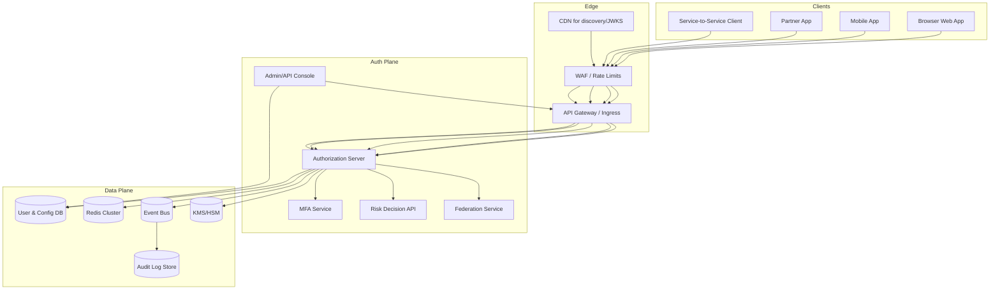
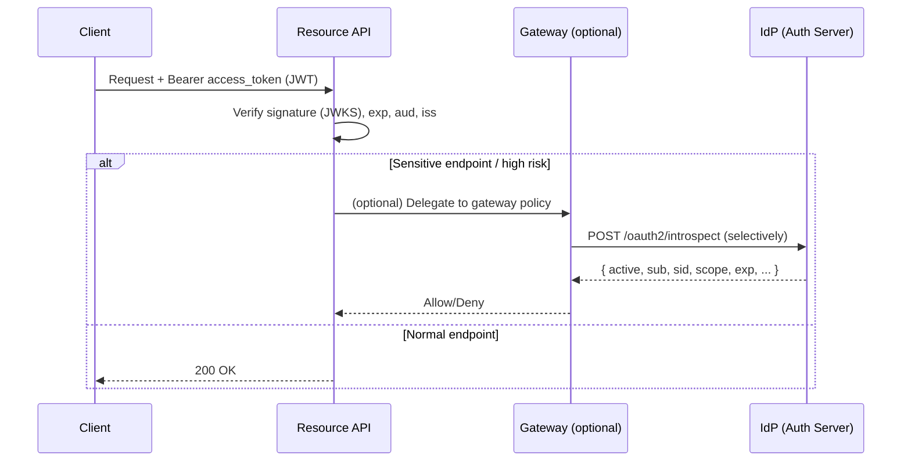
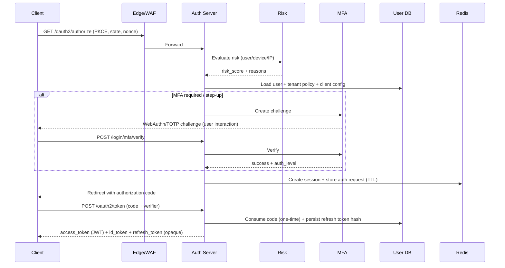

## Overview

A centralized Identity Provider (IdP) is on the critical path for interactive logins and many machine-to-machine flows. Done well, it enables secure, low-latency authentication and authorization across many applications without requiring an IdP round-trip on every API call.

This design describes a production-grade OAuth 2.1 / OpenID Connect (OIDC) Authorization Server for a multi-tenant (B2B) environment with:
- Browser/mobile SSO (Authorization Code + PKCE)
- Service-to-service OAuth (Client Credentials with strong client authentication)
- Policy-driven MFA (WebAuthn/TOTP with step-up)
- Federation (upstream SAML 2.0 and OIDC)
- Short-lived, edge-verifiable access tokens with practical revocation controls
- Auditable security posture with resilient operations

**Core idea**: treat authentication as a policy decision over *identity + session + device + risk*, while making authorization tokens short-lived and verifiable locally (JWT), using selective introspection and session-level revocation to balance availability and security.

## Requirements

### Functional Requirements
- OIDC SSO for browser/mobile:
  - Authorization Code + PKCE
  - ID Token issuance, `/userinfo`, OIDC discovery and JWKS
  - Support `prompt=login`, `max_age`, `acr_values` for step-up semantics
- OAuth for service-to-service:
  - Client Credentials
  - Strong client authentication: `private_key_jwt`, `tls_client_auth` (mTLS), optional `client_secret_basic` for legacy
- MFA:
  - WebAuthn/FIDO2 (preferred, phishing-resistant)
  - TOTP, backup codes
  - SMS/voice only as gated fallback (high-risk, low assurance)
- Session management:
  - List sessions, revoke per-session, revoke all
  - Refresh token rotation + reuse detection
  - Optional OIDC logout (front-channel/back-channel) for first-party apps
- Device inventory and risk:
  - Maintain device records, signals, and explainable risk decisions
  - Use signals (new device, IP/ASN reputation, geo-velocity, device posture) to drive adaptive MFA
- Federation:
  - Upstream SAML 2.0 and OIDC IdPs, per-tenant configuration
  - JIT provisioning and account linking with explicit policies
- Administration:
  - Client registration (redirect URIs, grants, scopes, auth methods)
  - Tenant policies (MFA rules, session lifetime, federation rules)
- Auditing:
  - Append-only audit trail of auth events and admin actions with retention controls

### Non-Functional Requirements (Targets)
- **Scale (steady-state)**
  - 10M MAU, 500K DAU
  - Peak interactive authorization requests (GET `/oauth2/authorize`): 5k QPS (bursty)
  - Peak token issuance (POST `/oauth2/token`):
    - `authorization_code` exchanges: 2k QPS
    - `refresh_token` grants: 20k QPS (mobile-heavy + short access token TTL)
    - `client_credentials` grants: 5k QPS
  - Introspection (only for select gateways/APIs): 5k QPS
  - Stored objects (order of magnitude):
    - 10M users
    - 30M devices
    - 50M active sessions
    - Audit events: 0.5–5B/year (depends heavily on token issuance + admin actions)
- **Latency (server-side, excluding human MFA time)**
  - GET `/oauth2/authorize` decision P99: 200ms
  - POST `/oauth2/token` P99:
    - `authorization_code`: 150ms
    - `refresh_token`: 120ms
    - `client_credentials`: 100ms
  - POST `/oauth2/introspect` P99: 80ms (within-region)
  - Discovery/JWKS P99: 50ms (CDN/edge cached; origin should be fast)
- **Availability**
  - 99.99% for OIDC discovery, JWKS, `/oauth2/authorize`, `/oauth2/token`
  - 99.9% acceptable for admin console and reporting
- **Consistency**
  - Strong (or linearizable per principal/tenant): password changes, MFA enrollment/disablement, revocations, refresh rotation, client config changes
  - Eventual: risk signals ingestion, analytics, reporting, long-tail audit exports
- **Durability**
  - RPO ≤ 5 minutes for identity/config/session metadata
  - Audit logs: no acknowledged loss (durable append semantics)

### Constraints & Assumptions
- Multi-tenant (B2B) with per-tenant policies, branding, and federation configurations
- Baseline compliance: SOC 2 controls, GDPR/CCPA data handling, encryption at rest/in transit, audit retention
- Deployed across at least 2 AZs per region; global traffic management for regional failover
- mTLS supported for internal service-to-service and optional external OAuth client auth
- Network edge provides WAF, DDoS protection, and request rate limiting

## Architecture

### High-Level Component Diagram

### Token Validation Pattern (Most Requests Avoid IdP)

**Why this matters**: if every API call required introspection, the IdP would be a hard dependency for the entire product’s availability and cost profile. Short-lived JWTs plus session-level revocation and selective introspection provide a practical middle ground.

## Components

### Authorization Server (OAuth2/OIDC Core)
**Responsibilities**
- OAuth 2.1/OIDC endpoints: authorization, token, revocation, introspection (restricted), userinfo, discovery, JWKS
- Authentication and session creation
- Policy evaluation (MFA, step-up, device/risk gating)
- Token issuance and refresh rotation
- Consent (if supporting third-party apps)

**Key design decisions**
- **Authorization Code + PKCE** for all public clients; disallow Implicit and Resource Owner Password flows
- **Short-lived access tokens** (5–10 minutes) and **rotating refresh tokens**
- Use **PAR** (Pushed Authorization Requests) for high-security clients to reduce request parameter leakage and tampering
- Enforce strict redirect URI matching; prefer exact-match (no wildcards) for confidential clients

**Implementation notes**
- `authorization_code` is one-time use; store hashed code + PKCE challenge with short TTL
- Token endpoint operations requiring atomicity:
  - refresh rotation and reuse detection
  - code consumption
- Use structured, versioned claims in JWTs; include `sid` (session ID) and `jti` (token ID) when helpful

### Session & Token Store (Logical Subsystem)
**Responsibilities**
- Session metadata (auth level, last seen, device binding, revocation)
- Refresh token family tracking (rotation lineage)
- Rate-limit counters and login attempt throttling

**Practical revocation model**
- Access tokens are JWTs with short TTL; immediate revocation is not guaranteed for already-issued access tokens
- Enforce near-real-time revocation via:
  - session-level `revoked_at` checked during refresh and during selective introspection
  - optional gateway checks for sensitive APIs
  - short access token TTL and step-up for high-risk operations

**Refresh rotation + reuse detection**
- Store only a **hash** of the refresh token (e.g., HMAC-SHA-256 with a server-side pepper in KMS/HSM), never raw values
- On refresh:
  - validate presented token hash
  - atomically mark it as used/revoked
  - issue a new token in the same family
- If an already-used refresh token is presented:
  - revoke the entire family + associated session (defense against theft/replay)

### MFA Service
**Responsibilities**
- Enroll/verify factors
- WebAuthn ceremonies (registration + assertion)
- Challenge issuance and verification
- Backup code issuance and consumption

**Key design decisions**
- Prefer **WebAuthn** for phishing resistance; TOTP as secondary
- SMS/voice only as fallback with strict policy gating (risk, tenant configuration, throttling)
- Store only verifier material:
  - WebAuthn public keys + metadata
  - backup codes hashed (Argon2id/Bcrypt) and one-time
  - TOTP secrets envelope-encrypted using KMS

### Risk Decision Service (Device Trust / Adaptive Policies)
**Responsibilities**
- Synchronous “decision API” used in login/step-up flows (low latency)
- Asynchronous ingestion/aggregation of signals (high volume)

**Key design decisions**
- Keep the login path deterministic and explainable:
  - return `risk_score` and `reasons[]`
  - drive policy like “require phishing-resistant MFA if score ≥ X”
- Separate ingestion from decision:
  - ingestion can be eventually consistent
  - decision API reads latest aggregated features

### Federation Service (SAML/OIDC Upstream)
**Responsibilities**
- Integrate upstream enterprise IdPs per tenant
- Validate assertions/tokens, map claims, JIT provisioning, and linking
- Protect against replay and misconfiguration

**Key design decisions**
- Normalize external identities into a stable internal principal
- Strong validation: issuer/audience checks, signature validation, time bounds, replay protection
- Treat federation configuration as security-sensitive:
  - changes are audited, can be approval-gated, and have safe rollout (test mode)

## Data Model

### Core Tables (Relational Example)

**tenants**
- `tenant_id` (UUID, PK)
- `name`
- `created_at`, `updated_at`
- `policy_json` (jsonb) *(session lifetime, MFA requirements, allowed IdPs, etc.)*

**users**
- `user_id` (UUID, PK)
- `tenant_id` (UUID, indexed)
- `email` (string, unique per tenant)
- `status` (active/locked/deleted)
- `password_hash` (nullable; Argon2id parameters versioned)
- `created_at`, `updated_at`
- `last_login_at`

**clients**
- `client_id` (string, PK)
- `tenant_id` (UUID, indexed)
- `client_type` (public/confidential)
- `redirect_uris` (jsonb)
- `grant_types` (jsonb)
- `scopes` (jsonb)
- `token_endpoint_auth_method` (mtls/private_key_jwt/client_secret_basic)
- `jwks_uri` / `jwks` (jsonb)
- `created_at`, `updated_at`

**sessions**
- `session_id` (UUID, PK)
- `tenant_id` (UUID, indexed)
- `user_id` (UUID, indexed)
- `device_id` (UUID, indexed, nullable)
- `created_at`, `last_seen_at`
- `revoked_at` (nullable, indexed)
- `auth_level` (pwd/mfa/phishing_resistant)
- `ip_hash`, `ua_hash` (privacy-preserving)

**refresh_tokens**
- `token_id` (UUID, PK)
- `token_hash` (bytes, unique) *(hash of presented token; never store raw)*
- `session_id` (UUID, indexed)
- `tenant_id` (UUID, indexed)
- `user_id` (UUID, indexed)
- `family_id` (UUID, indexed)
- `rotated_from` (UUID, nullable)
- `expires_at`, `revoked_at` (nullable)
- `created_at`

**authorization_codes** *(short-lived, one-time)*
- `code_id` (UUID, PK)
- `code_hash` (bytes, unique)
- `tenant_id`, `client_id`, `user_id`
- `redirect_uri`
- `code_challenge`, `code_challenge_method`
- `nonce` (nullable)
- `expires_at`
- `consumed_at` (nullable)

**devices**
- `device_id` (UUID, PK)
- `tenant_id` (UUID, indexed)
- `user_id` (UUID, indexed)
- `device_fingerprint_hash` (string, indexed)
- `platform` (ios/android/web/desktop)
- `trusted` (bool)
- `risk_score` (int)
- `first_seen_at`, `last_seen_at`

**mfa_factors**
- `factor_id` (UUID, PK)
- `tenant_id` (UUID, indexed)
- `user_id` (UUID, indexed)
- `type` (webauthn/totp/sms)
- `webauthn_public_key` (nullable)
- `totp_secret_enc` (nullable; envelope encrypted)
- `phone_enc` (nullable)
- `created_at`, `last_used_at`

**external_identities**
- `binding_id` (UUID, PK)
- `tenant_id` (UUID, indexed)
- `user_id` (UUID, indexed)
- `provider_type` (saml/oidc)
- `provider_id` (string) *(per-tenant configured IdP key)*
- `subject` (string) *(NameID/sub)*
- `created_at`

**audit_events** (append-only)
- `event_id` (UUID, PK)
- `tenant_id` (UUID, indexed)
- `actor_user_id` (nullable)
- `target_user_id` (nullable)
- `type`
- `ip`, `ua`, `metadata` (jsonb)
- `created_at` *(partition by time)*

### Primary Login Flow (OIDC + Adaptive MFA)

## API

### OIDC Discovery
- `GET /.well-known/openid-configuration`
- `GET /oauth2/jwks`

### Authorization Endpoint
- `GET /oauth2/authorize`
  - Required: `response_type=code`, `client_id`, `redirect_uri`, `scope`, `state`, `code_challenge`, `code_challenge_method=S256`
  - Recommended: `nonce` (OIDC), `prompt`, `max_age`, `acr_values`
  - Security:
    - Validate `redirect_uri` exactly against registered URIs
    - Bind `state` to browser session; store authorization request server-side (Redis TTL)
    - Require PKCE for public clients; allow for confidential clients as defense-in-depth
  - Optional hardening:
    - PAR: `POST /oauth2/par` and then pass `request_uri` to `/authorize`
    - JAR: JWT-secured request objects for integrity

### Token Endpoint
- `POST /oauth2/token`
  - Grants:
    - `authorization_code` (PKCE)
    - `refresh_token` (rotation + reuse detection)
    - `client_credentials`
  - Response (standard):
    - `access_token` (JWT), `expires_in`, `token_type=bearer`
    - `id_token` (when OIDC scope + appropriate grant)
    - `refresh_token` (opaque, rotating; only when applicable)
  - Idempotency:
    - Codes are one-time by definition (do not rely on retries returning the same tokens)
    - Support `Idempotency-Key` for operational retries on `client_credentials` (optional) and internal admin flows
  - Errors:
    - RFC 6749/6750 compatible error codes
    - Avoid leaking sensitive details in `error_description`

### Revocation
- `POST /oauth2/revoke` (RFC 7009)
  - Accept refresh tokens (authoritative) and access tokens (best-effort; primarily useful if access tokens are opaque for some clients)

### Introspection (Restricted)
- `POST /oauth2/introspect` (RFC 7662)
  - Only for confidential clients/gateways
  - Strong auth required (mTLS or private_key_jwt)
  - Rate-limited and never used by browsers

### UserInfo
- `GET /userinfo`
  - Return claims based on granted scopes and tenant policy

### Session Management (First-Party/Admin)
- `GET /v1/sessions?user_id=...`
- `POST /v1/sessions/{session_id}/revoke`
- `POST /v1/users/{user_id}/revoke_all_sessions`
  - Publish revocation events for downstream caches/gateways
  - Always enforce revocation at the session/refresh layer even if the event bus is delayed

### MFA
- `POST /v1/mfa/challenge` → `{ challenge_id, type, expires_at }`
- `POST /v1/mfa/verify` with `{ challenge_id, response }` → `{ success, auth_level }`

## Scaling

### Capacity & Sizing Notes (Concrete Numbers)
- **Access token TTL**: 10 minutes (typical)
- **Refresh cadence assumption**: mobile refreshes ~every 30–60 minutes depending on app lifecycle; 20k QPS peak implies bursty reconnects + many devices
- **Session storage**:
  - If 50M active sessions with ~1KB metadata each → ~50GB logical (before replication/overhead)
  - Keep only hot indices in Redis; durable metadata in DB; expire aggressively
- **JWKS traffic**:
  - With correct caching (15–60 min), origin load should be tiny; serve JWKS via CDN for resilience

### Bottlenecks and Mitigations
- **Credential verification** (Argon2id) and WebAuthn verification are CPU-heavy
  - Mitigate: autoscale on CPU, isolate crypto worker pool, strict throttling per user/IP/tenant, progressive challenges before password entry
- **Atomic refresh rotation**
  - Mitigate: keep refresh token validation in a strongly consistent store (DB or Redis with careful Lua/transactions); avoid cross-store races
- **KMS/HSM latency**
  - Mitigate: cache active signing keys in memory; use KMS only for key creation/rotation and decrypting wrapped secrets
- **Federation variability**
  - Mitigate: cache metadata, apply per-tenant rate limits, isolate upstream calls, use circuit breakers, provide clear admin diagnostics

### Scaling Strategy by Layer
- **Edge/WAF/CDN**
  - Anycast/global entry + regional backends
  - Per-tenant/per-client quotas; bot protection on login pages; strict limits on token/introspection endpoints
- **Authorization Server**
  - Stateless horizontally scaled
  - No sticky sessions required; store auth request/session artifacts in Redis
- **Redis**
  - Cluster mode with replicas; keys partitioned by `tenant_id:user_id`
  - Use it for:
    - auth request state (TTL minutes)
    - rate limiting counters
    - short-lived session indices / revocation caches
- **Primary DB**
  - Start with HA Postgres (multi-AZ) + read replicas
  - Partition/cluster audit tables by time (and optionally tenant)
  - If true multi-region active-active is required for auth writes, consider globally consistent databases (Spanner/CockroachDB) and carefully scope strong consistency to per-tenant/per-user operations
- **Event Bus & Audit**
  - Kafka (or equivalent) for event fanout
  - Durable audit sink (e.g., append-only storage with retention/WORM controls) for compliance-grade logging

### Caching
- **JWKS**: cache by `kid`; rotate with overlap; publish keys via CDN
- **Client config / tenant policy**: cache 30–120s with explicit invalidation on admin changes
- **Risk decisions**: cache 60–300s per `(tenant,user,device,ip_bucket)` to smooth retries while still reacting to new signals

## Trade-offs

### Trade-offs Made
1. **JWT access tokens by default**
   - Benefit: APIs validate locally; avoids IdP dependency on every request; lower latency/cost
   - Cost: immediate revocation of already-issued access tokens is not guaranteed
   - Mitigation: short TTL + session/refresh enforcement + selective introspection for sensitive endpoints
2. **Rotating refresh tokens with reuse detection**
   - Benefit: strong protection against stolen refresh tokens and replay
   - Cost: stateful, requires atomic rotation and careful race handling
   - Mitigation: keep refresh logic centralized and strongly consistent; instrument reuse events as high-severity signals
3. **Separate risk and MFA services**
   - Benefit: independent scaling and iteration; smaller blast radius for complex integrations
   - Cost: extra hops and operational overhead
   - Mitigation: keep synchronous decision API fast; cache; use timeouts and fail-safe policies (generally fail-closed for risky actions)

### Alternative Approaches
- **Opaque access tokens + mandatory introspection**
  - Pros: immediate revocation and centralized policy enforcement
  - Cons: IdP becomes a dependency for all API traffic; outages and scaling costs are amplified
- **Stateless “session tokens” only**
  - Pros: fewer stores, simpler infra
  - Cons: weak revocation/step-up, harder anomaly detection, reduced audit fidelity
- **Monolith for auth + MFA + risk**
  - Pros: fewer moving parts early on
  - Cons: scaling isolation suffers; security-critical integrations slow down releases; large blast radius

## Failure Modes

### Failure Scenarios (Examples)
1. **Primary DB unavailable**
   - Impact: new logins/token issuance degraded or down; existing JWTs continue until expiry
   - Mitigation:
     - multi-AZ failover, read replicas
     - cache client/policy aggressively
     - keep discovery/JWKS available via CDN even during partial outages
     - fail closed for new sessions and token issuance when strong correctness cannot be ensured
2. **Redis outage**
   - Impact: login state, rate limits, and session indices impaired; risk of abuse if rate limiting degrades
   - Mitigation:
     - multi-AZ Redis with replicas and client-side timeouts
     - conservative fail-closed on suspicious flows
     - local in-process emergency throttles (per-instance) to limit blast radius
     - degrade: allow only already-authenticated token validation (JWT) while suspending new session creation if needed
3. **Event bus lag/outage**
   - Impact: delayed audit pipelines, delayed revocation propagation to downstream caches
   - Mitigation:
     - enforce revocation at the source of truth (session/refresh store) regardless of bus
     - persist audit events durably (DB append) and backfill to bus
     - alert on consumer lag and ingestion delay
4. **Signing key compromise**
   - Impact: forged tokens; critical security incident
   - Mitigation:
     - HSM-backed keys; strict IAM and key access monitoring
     - rapid key rotation; publish a `kid` denylist to gateways
     - shorten TTLs temporarily; revoke sessions; incident runbooks and forensics
5. **Clock skew**
   - Impact: `nbf`/`iat` validation failures or premature expiry
   - Mitigation:
     - enforce NTP; monitor skew
     - allow small leeway (30–60s) in validators and issuer

### Disaster Recovery
- Targets: RTO 15 minutes, RPO 5 minutes (audit: no acknowledged loss)
- Strategy:
  - continuous WAL shipping + snapshots; encrypted backups; monthly restore drills
  - global traffic manager fails over to healthy region
  - ensure signing keys are available in the failover region (multi-region KMS/HSM or controlled recovery procedure)

## Operations

### SLOs and Error Budgets
- Token and authorization endpoints: 99.99% monthly availability
- P99 latency SLOs:
  - `/oauth2/token` (refresh): 120ms
  - `/oauth2/token` (auth code): 150ms
  - `/oauth2/introspect`: 80ms (restricted usage)
- Define error budget policies:
  - freeze risky changes when burning budget (especially auth flows, MFA, federation)

### Observability
- Metrics:
  - success/error rates by endpoint, tenant, client, grant type
  - MFA challenge/verify funnels; WebAuthn vs TOTP usage; fallback rate (SMS)
  - refresh reuse detections (high severity)
  - rate-limit triggers and WAF blocks
  - DB/Redis/KMS latency and error rates
  - federation failures by tenant/IdP
- Tracing:
  - end-to-end traces across edge → auth → risk/MFA/federation → stores
- Logging:
  - structured logs with request IDs, tenant/client identifiers (avoid storing secrets)
  - security events shipped to SIEM

### Deployment and Change Management
- Canary or blue/green per region with synthetic probes:
  - authorize → login → token → userinfo
  - refresh rotation correctness probe
- Backward-compatible validation:
  - overlap signing keys; do not remove keys until consumers have refreshed JWKS
- Config safety:
  - validate tenant policies and federation configs via “test mode”
  - audit and optionally require approval for high-impact admin actions

### Security Operations
- Rate-limiting and abuse controls:
  - per-IP, per-user, per-tenant, per-client
  - credential stuffing protections (WAF + progressive friction)
- Secrets handling:
  - no raw refresh tokens stored
  - encrypt TOTP secrets and sensitive PII with envelope encryption
- Regular exercises:
  - key rotation drills
  - incident response tabletop (token forgery, IdP outage, federation misconfig)

## References & Further Reading
- OAuth 2.1 (work in progress): https://datatracker.ietf.org/doc/draft-ietf-oauth-v2-1/
- OAuth 2.0 Security Best Current Practice: https://oauth.net/2/security-best-practice/
- OpenID Connect Core 1.0: https://openid.net/specs/openid-connect-core-1_0.html
- RFC 7009 (Token Revocation): https://www.rfc-editor.org/rfc/rfc7009
- RFC 7662 (Token Introspection): https://www.rfc-editor.org/rfc/rfc7662
- RFC 8705 (OAuth 2.0 mTLS client authentication): https://www.rfc-editor.org/rfc/rfc8705
- RFC 9126 (Pushed Authorization Requests - PAR): https://www.rfc-editor.org/rfc/rfc9126
- WebAuthn Level 2: https://www.w3.org/TR/webauthn-2/
- OWASP ASVS: https://owasp.org/www-project-application-security-verification-standard/