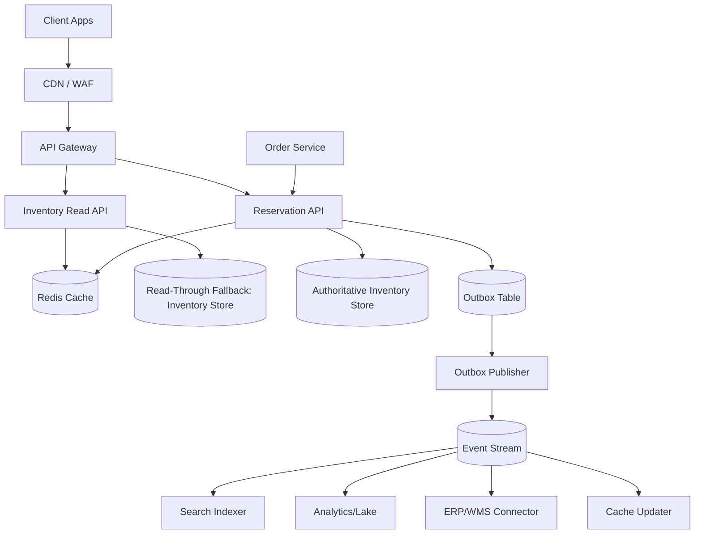
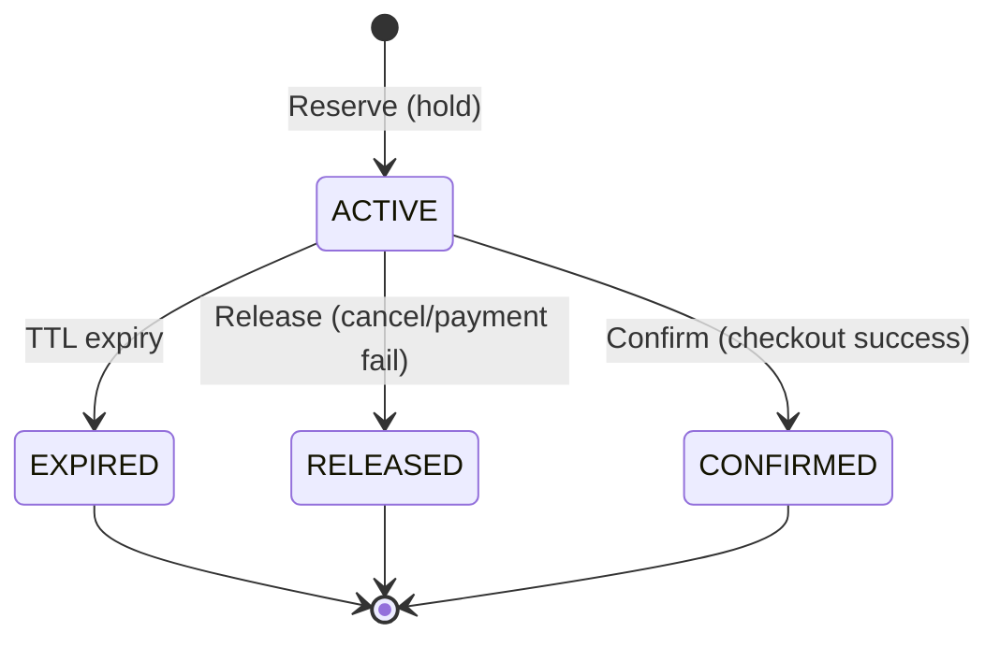

# Inventory Management System

## Overview

An inventory system for limited stock is deceptively hard because “available” is a fast-moving derived value influenced by purchases, cancellations, restocks, returns, shrinkage, and time-bound holds. The system must prevent oversells (hard correctness), while still serving extremely high read traffic (browse, search, PDP) with low latency and graceful degradation when dependencies fail.

The core design is to split:
- **Read-optimized availability** (fast, cached, may be slightly stale), from
- **Write-authoritative reservations/allocations** (strongly consistent, enforces invariants)

Browse paths can use cached/derived availability, but **checkout uses a strongly consistent reservation path** that atomically enforces invariants (no negative availability) and supports **expiring holds**. Inventory transitions are modeled as a **state machine** with idempotent APIs and event-driven propagation to downstream systems.

---

## Requirements

### Functional Requirements
- Show available quantity per `SKU` and `location` (warehouse/store) for browse/search/PDP.
- Create a **reservation (hold)** for `SKU/location/qty` with TTL (e.g., 15 minutes).
- Convert an active reservation into a **confirmed allocation** on successful checkout.
- Release reservations on cancellation, payment failure, or expiration (automatic and manual).
- Prevent oversell under concurrency (multiple users racing for last units).
- Support inventory adjustments (restock, shrinkage, returns) with auditable reasons.
- Provide fallback behaviors when inventory is unknown/unavailable (e.g., “check at checkout” or conservative “out of stock”).
- Publish inventory and reservation events for downstream consumers (search, analytics, replenishment, notifications, ERP/WMS).

### Non-Functional Requirements (SLO Targets)
- **Scale (peak)**:
  - Catalog: 20M SKUs (global)
  - Locations: ~200
  - Active `sku_location` pairs: ~50M (not all SKUs stocked everywhere)
  - Browse reads: 100k QPS peak (availability lookups)
  - Checkout writes: 10k QPS peak (reserve/confirm/release)
  - Flash sale hot key: up to 5k reservation attempts/sec for a single `sku_location`
- **Latency**:
  - Availability read (cache hit): P50 10ms, P99 50ms
  - Reservation create/confirm/release (authoritative): P50 40ms, P99 150ms
- **Availability**:
  - Read APIs: 99.99% monthly
  - Reservation APIs: 99.95% monthly
- **Consistency**:
  - Strong consistency for reservation/confirm/release for a single `sku_location` in the authoritative store
  - Eventual consistency for search, analytics, and cached browse availability
- **Durability**:
  - No lost **confirmed allocations**
  - Within-region: multi-AZ, **RPO ~0**
  - Cross-region DR: async replication acceptable, **RPO ≤ 1 minute**, **RTO ≤ 30 minutes**

### Constraints & Assumptions
- Inventory is tracked per `SKU + location` (warehouse/store). Global inventory is derived.
- Payment is handled by a separate Order/Payment system. Inventory confirms only after payment authorization (or after a tightly time-bounded “soft confirm” if the business accepts that risk).
- Single-writer region per `location` (home region), multi-AZ deployment. Cross-region failover is supported, but not active-active for the same `location`.
- Prefer managed services where possible (Redis, DynamoDB/Spanner, Kafka/PubSub/Kinesis).

---

## Architecture

### High-Level Diagram



### Key Principles
- **Correctness boundary**: only the Reservation API mutates authoritative counters; it enforces invariants atomically.
- **Read scalability**: reads are served from cache with small staleness; the DB is protected with coalescing and circuit breakers.
- **Decoupling**: all downstream propagation is via an event stream using the **transactional outbox** pattern to avoid dual-write issues.
- **Idempotency everywhere**: retries must be safe for all mutating operations.

### Inventory State Machine



---

## Components

### Inventory Read API
**Responsibility**: Serve availability for browse/search/PDP with low latency and controlled staleness.

**Design**:
- Cache-first reads with TTL 1–5 seconds, jittered.
- **Stale-while-revalidate**: serve slightly stale values while a single request refreshes.
- Return a **confidence** field (`fresh|stale|unknown`) so clients can apply UX fallbacks.

**Scaling & Protection**:
- Horizontal scaling behind L7 load balancer.
- Request coalescing per `sku_location` to prevent stampedes.
- Circuit breaker to protect the authoritative store; fallback to `unknown` if needed.

### Reservation API (Authoritative Write Path)
**Responsibility**: Create/release/confirm holds with strong correctness; enforce “no oversell” invariants.

**Design**:
- Single-`sku_location` atomicity:
  - Use conditional updates / transactions on the authoritative store.
  - Keep each reservation mutation within one logical partition/key-range whenever possible.
- Strict timeouts and bounded retries.
- Mandatory idempotency on all write endpoints.

**Hot-Key Strategy** (flash sales):
- Per-key rate limiting (token bucket) and request shedding.
- Optional “queue mode” for extreme events (serialize writes per hot key).
- Optional “striped counters” only if contention is consistently pathological (adds complexity; see Trade-offs).

### Authoritative Inventory Store
**Responsibility**: Source of truth for on-hand/reserved/allocated counters and reservation records.

**Recommended baseline**:
- **DynamoDB** (or equivalent) using conditional writes / transactions, keyed by `location_id#sku_id`.
- **Spanner** is a strong alternative when you need multi-row transactions and SQL, at higher cost.
- **Postgres** can work at smaller scale with partitioning and careful locking, but hot keys remain a challenge.

**Core invariant**:
- `reserved + allocated <= on_hand`
- `available_to_promise = on_hand - reserved - allocated` (optionally minus `safety_stock` if the business requires it)

### Expiration & Reconciliation
**Responsibility**: Ensure holds expire promptly and counters remain correct over time.

**Design**:
- Do not rely solely on TTL deletion semantics (many systems apply TTL asynchronously and not at the exact deadline).
- Run a **sweeper** (e.g., every 30–60 seconds) that:
  - Finds expired `ACTIVE` reservations (by `expires_at` index)
  - Transitions them to `EXPIRED`
  - Decrements `reserved` accordingly
  - Emits events via outbox
- Run a periodic **reconciler** (off-peak) to detect and repair drift:
  - Recompute `reserved` from `ACTIVE` reservations for a sample or for all keys
  - Alert on discrepancies and auto-heal within guardrails

### Event Stream + Outbox
**Responsibility**: Reliably publish inventory changes to downstream consumers without slowing checkout.

**Design**:
- **Transactional outbox**: write inventory mutation + outbox event in the same transaction.
- **At-least-once** delivery with idempotent consumers:
  - Use `event_id` dedupe
  - Use `version` per `sku_location` to ignore older/out-of-order updates

---

## Data Model

### Tables

**Table: `inventory_balance`** (authoritative per `sku_location`)
- `location_id` (PK part)
- `sku_id` (PK part)
- `on_hand` (int, >= 0)
- `reserved` (int, >= 0)
- `allocated` (int, >= 0)
- `version` (bigint, monotonic per `sku_location`)
- `updated_at` (timestamp)

**Table: `reservation`**
- `reservation_id` (PK, ULID/UUID)
- `location_id`, `sku_id`
- `qty` (int, > 0)
- `status` (`ACTIVE|CONFIRMED|RELEASED|EXPIRED`)
- `expires_at` (timestamp)
- `order_id` (string, nullable)
- `idempotency_key` (string, required)
- `idempotency_scope` (string, e.g., `merchant_id:order_id:endpoint`)
- `created_at`, `updated_at`

**Index: `reservation_by_expiry`**
- Partition key: `location_id` (or shard key)
- Sort key: `expires_at`
- Filter: `status = ACTIVE` (or encode status in key)

**Table: `inventory_outbox`**
- `event_id` (PK)
- `event_type` (`RESERVED|RELEASED|CONFIRMED|ADJUSTED|EXPIRED`)
- `location_id`, `sku_id`
- `delta_on_hand`, `delta_reserved`, `delta_allocated` (signed ints)
- `new_version` (bigint)
- `payload` (json)
- `created_at`
- `published_at` (nullable)

### Event Contract (example)
All events include:
- `event_id` (unique)
- `event_type`
- `occurred_at`
- `location_id`, `sku_id`
- `new_version`
- `deltas` and/or `new_balance` (choose one; deltas are smaller, snapshots simplify consumers)

Consumers should process:
- **Idempotently** (ignore duplicate `event_id`)
- **Monotonically** per `sku_location` (ignore events with `new_version <= last_seen_version`)

---

## API Design

### Conventions
- All write endpoints require `Idempotency-Key` (UUID/ULID) and return the same result for retries within the idempotency window.
- Error responses use a stable machine-readable `code`.
- Server timestamps determine expiry; clients do not supply absolute expiration times.

---

### Read API

`GET /v1/availability?sku_id={sku_id}&location_id={location_id}`

**Response**
```json
{
  "sku_id": "SKU123",
  "location_id": "WH1",
  "available": 42,
  "as_of": "2025-12-17T10:00:00Z",
  "confidence": "fresh",
  "version": 912381
}
```

**Notes**
- `available` is derived: `on_hand - reserved - allocated`.
- If dependencies are unhealthy, return `confidence: "unknown"` and `available: null` (configurable), rather than timing out the UI path.

---

### Reservation APIs (Authoritative)

#### Create reservation
`POST /v1/reservations`  
Headers: `Idempotency-Key: <uuid>`

**Request**
```json
{
  "sku_id": "SKU123",
  "location_id": "WH1",
  "qty": 2,
  "ttl_seconds": 900,
  "order_id": "ORD999"
}
```

**Response (201)**
```json
{
  "reservation_id": "01J...ULID",
  "status": "ACTIVE",
  "expires_at": "2025-12-17T10:15:00Z"
}
```

**Errors**
- `409 INSUFFICIENT_STOCK` (optionally include a coarse `available_hint` if safe)
- `400 INVALID_QTY` / `400 INVALID_TTL`
- `404 UNKNOWN_SKU_LOCATION`
- `429 HOT_KEY_THROTTLED`
- `503 INVENTORY_UNAVAILABLE`

**Idempotency**
- The same `(idempotency_scope, idempotency_key)` must return the same `reservation_id` and response body.
- Enforce uniqueness at the store level (conditional insert).

#### Confirm reservation
`POST /v1/reservations/{reservation_id}/confirm`  
Headers: `Idempotency-Key: <uuid>`

**Semantics**
- `ACTIVE -> CONFIRMED`
- Atomically moves `qty` from `reserved` to `allocated`

**Errors**
- `410 EXPIRED`
- `409 INVALID_STATE` (e.g., already released)
- `404 NOT_FOUND`

#### Release reservation
`DELETE /v1/reservations/{reservation_id}`  
Headers: `Idempotency-Key: <uuid>`

**Semantics**
- `ACTIVE -> RELEASED`
- Atomically decrements `reserved` by `qty`

**Errors**
- `409 INVALID_STATE` (e.g., already confirmed)
- `404 NOT_FOUND`

#### Bulk reserve (optional, recommended for multi-item carts)
`POST /v1/reservations:bulk`  
Headers: `Idempotency-Key: <uuid>`

**Request**
```json
{
  "order_id": "ORD999",
  "ttl_seconds": 900,
  "items": [
    { "sku_id": "SKU123", "location_id": "WH1", "qty": 1 },
    { "sku_id": "SKU777", "location_id": "WH1", "qty": 2 }
  ]
}
```

**Response (200)**
- Returns per-item results.
- By default this is **best-effort** (no cross-SKU atomicity). If an item fails, previously created holds can be released by the caller or by a compensating endpoint.

---

### Adjustment API (Internal/Admin)

`POST /v1/inventory/adjustments`  
Headers: `Idempotency-Key: <uuid>`

**Request**
```json
{
  "sku_id": "SKU123",
  "location_id": "WH1",
  "delta_on_hand": 50,
  "reason": "RESTOCK",
  "reference": "ASN-7781"
}
```

**Rules**
- Must not violate `reserved + allocated <= on_hand` after applying the delta.
- Adjustments emit `ADJUSTED` events with full audit context.

---

## Data Flow

### Reserve → Confirm (Checkout)

```mermaid
sequenceDiagram
  autonumber
  participant C as Client
  participant O as OrderSvc
  participant I as ReservationAPI
  participant D as AuthInventoryStore
  participant X as Outbox
  participant P as Publisher
  participant S as EventStream

  C->>O: Create order (cart)
  O->>I: POST /reservations (Idempotency-Key)
  I->>D: Txn: conditional update inventory_balance; insert reservation
  I->>X: Txn: insert outbox event (RESERVED)
  D-->>I: Commit OK
  I-->>O: 201 reservation_id, expires_at

  O->>O: Authorize payment
  O->>I: POST /reservations/{id}/confirm (Idempotency-Key)
  I->>D: Txn: reservation ACTIVE? move reserved->allocated; status CONFIRMED
  I->>X: Txn: insert outbox event (CONFIRMED)
  D-->>I: Commit OK
  I-->>O: 200 confirmed

  P->>X: Poll/stream outbox
  P->>S: Publish events (at-least-once)
```

### Expiration (Sweeper)

```mermaid
sequenceDiagram
  autonumber
  participant W as Sweeper
  participant D as AuthInventoryStore
  participant X as Outbox

  W->>D: Query ACTIVE reservations where expires_at <= now
  W->>D: Txn: mark EXPIRED; decrement reserved
  W->>X: Txn: insert outbox event (EXPIRED)
  D-->>W: Commit OK
```

---

## Scaling & Performance

### Capacity & Hotspot Reality Check
- The critical write hotspot is **per `sku_location`**. Even with a horizontally scalable DB, a single hot key can dominate tail latency due to conditional update contention.
- Reads are cheap if the cache hit rate is high (target **> 95%**). Protect the DB from bursty read amplification.

### Caching Strategy
- Cache `availability` for browse with TTL 1–5 seconds.
- Include `version` to help detect staleness and debug propagation.
- **Never** use cache for the final checkout decision; all reservations/confirmations hit the authoritative store.
- Invalidation:
  - Write-through on successful writes for the affected key (best-effort).
  - Event-driven updates for broader convergence (search/index/cache refresh).

### Hot SKU Mitigations
- **Per-key throttling**: return `429 HOT_KEY_THROTTLED` quickly rather than causing global tail-latency collapse.
- **Queue mode** (operational switch): serialize writes for a small set of known hot keys during flash sales.
- **Striped counters** (advanced): split a single `sku_location` into N stripes; reserve against stripes to reduce contention. This complicates correctness and reconciliation and is usually a last resort.

### Data Partitioning
- Primary key: `location_id#sku_id` (or equivalent composite) to keep single-key mutations atomic.
- Event stream partition key: the same `location_id#sku_id` to preserve per-key ordering.

---

## Trade-offs & Alternatives

### Key Trade-offs Made
- **Strong consistency for reservations**
  - Cost: higher write latency and hot-key contention under extreme demand
  - Benefit: hard prevention of oversell for limited stock
- **Cached availability for browse**
  - Cost: occasionally stale “available” numbers in UI
  - Benefit: supports massive read QPS without overloading the authoritative store
- **Event-driven propagation via outbox**
  - Cost: operational complexity (outbox, publisher, consumer lag, DLQs)
  - Benefit: avoids dual writes, decouples checkout from downstream systems, and scales independently
- **Single-writer per location**
  - Cost: cross-region active-active is not supported for the same location
  - Benefit: simpler correctness model and predictable latency; DR remains achievable

### Alternative Approaches
- **Active-active multi-region writes**
  - Requires global strong consistency per key (Spanner-like) or per-SKU leader routing; higher complexity and cost.
- **Optimistic oversell + reconciliation**
  - Acceptable for backorder-friendly businesses; violates strict limited-stock promises.
- **Queue-per-SKU as the default**
  - Great for flash sales; adds baseline latency and operational burden. Best used as a targeted, temporary mode.

---

## Failure Modes & Mitigations

### Inventory store partial outage / elevated latency
- **Impact**: reservation/confirm/release fail; checkout impacted; browse may degrade to stale/unknown
- **Detection**: error rate, P99 latency, success rate by endpoint, saturation metrics
- **Mitigation**: circuit breakers; fail fast; multi-AZ failover; switch UI to “check at checkout” or conservative “out of stock”

### Expiration delayed (TTL not precise, sweeper lag)
- **Impact**: inventory held longer than intended; reduced conversion
- **Detection**: count of `ACTIVE` reservations past `expires_at`; sweeper lag; reserved-to-active mismatch
- **Mitigation**: dedicated sweeper; alert on lag; cap maximum TTL; reconciler to repair drift

### Duplicate requests / retries / client timeouts
- **Impact**: potential double-reserve/double-confirm if not handled
- **Detection**: idempotency dedupe hits; duplicate event IDs; unusual repeat patterns per client
- **Mitigation**: mandatory idempotency keys; conditional insert for `(scope,key)`; return stored result

### Outbox publisher or stream degradation
- **Impact**: downstream staleness (search, analytics, cache updater); authoritative correctness unaffected
- **Detection**: outbox backlog age; publish latency; consumer lag
- **Mitigation**: scale publisher; DLQ poison messages; replay from outbox; consumer idempotency + backfills

### Hot-key contention drives tail latency
- **Impact**: poor checkout UX for popular items; cascading timeouts
- **Detection**: per-key conflict/abort rate; 429 rate; P99 by key
- **Mitigation**: per-key throttling; queue mode for hot keys; reduce client retry storms; consider striped counters

### Clock skew / inconsistent time sources
- **Impact**: premature or late expirations, confusing client behavior
- **Detection**: sweeper anomalies, negative TTL observations, inconsistent `expires_at` distribution
- **Mitigation**: server-authoritative time; monotonic clock for TTL computations; NTP enforcement; avoid client-provided timestamps

---

## Operations

### SLIs/SLOs
- **Read API**: availability success rate, cache hit rate, P99 latency, unknown-confidence rate
- **Reservation API**: success rate (excluding `INSUFFICIENT_STOCK`), P99 latency, conflict rate, throttling rate
- **Correctness**: invariant violation count (should be zero), reconciler drift metrics

### Monitoring & Alerting (minimum set)
- Reservation success rate < 99% over 5m (excluding insufficient stock)
- P99 reservation latency > 300ms over 10m
- Conditional-write conflict/abort rate spikes (by key)
- Expired-but-`ACTIVE` reservations > threshold or sweeper lag > 2 minutes
- Cache hit rate < 90% or unknown-confidence rate spike
- Outbox backlog age > 5 minutes; stream consumer lag > threshold

### Deployment & Schema Evolution
- Canary or blue/green for Reservation API with automatic rollback on latency/conflict regressions.
- Expand/contract migrations; backward-compatible event schemas with versioning.
- Feature flags:
  - enable/disable queue mode for hot keys
  - switch browse fallback behavior (`unknown` vs conservative `0`)

### Disaster Recovery
- **RTO/RPO**: RTO ≤ 30 minutes, RPO ≤ 1 minute (cross-region async)
- **Backups**: continuous PITR + daily full; retain 30–90 days
- **Failover**: promote DR store; switch routing for affected locations; resume outbox publishing and consumer checkpoints; run reconciliation after failover

### Security & Access Control
- AuthN/Z for internal/admin endpoints (mTLS + service identity, least privilege).
- Rate limiting and abuse protection at API gateway and per hot key.
- Audit logs for adjustments and admin actions; immutable event retention for investigations.

---

## References & Further Reading
- Transactional outbox: https://microservices.io/patterns/data/transactional-outbox.html
- Idempotency keys (payments patterns): https://stripe.com/docs/idempotency
- DynamoDB conditional writes & transactions: https://docs.aws.amazon.com/amazondynamodb/latest/developerguide/Expressions.ConditionExpressions.html
- Designing Data-Intensive Applications (consistency, transactions): https://dataintensive.net/
- Sagas (distributed transactions): https://microservices.io/patterns/data/saga.html