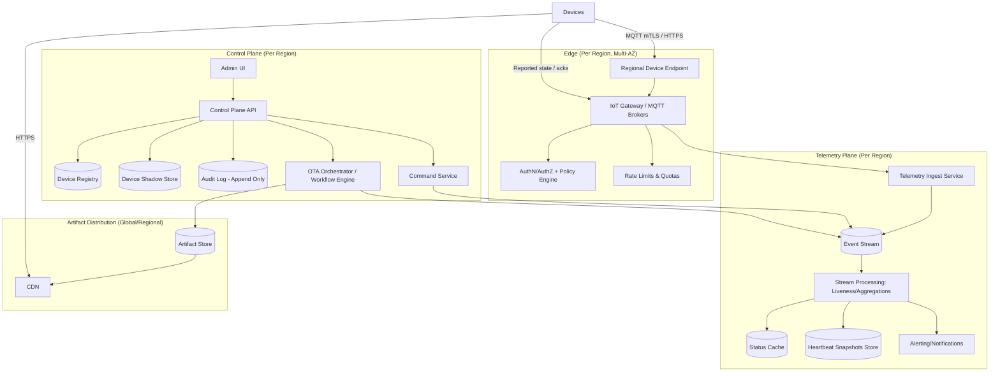
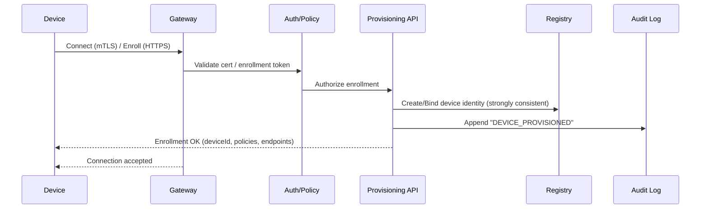
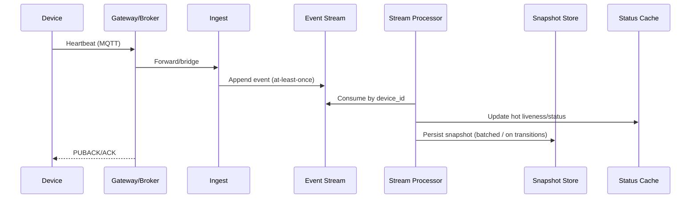

## Overview

An IoT device management platform onboards and authenticates millions of heterogeneous devices, tracks fleet health, and performs safe over-the-air (OTA) updates without bricking devices or saturating networks. Devices are often constrained (CPU/RAM/storage/power), intermittently connected, behind NAT, and on unreliable links. The backend must still provide strong security guarantees, auditability, and operational control.

The core architectural idea is to separate:

- **Control plane**: provisioning, identity, authorization, desired configuration, command/OTA orchestration, audit.
- **Data/telemetry plane**: heartbeats/metrics ingestion, stream processing, online/offline inference, aggregation.

Device interactions are modeled as **asynchronous, idempotent, at-least-once workflows**. OTA is a staged pipeline (targeting → distribution → install → verify → rollback) with progressive rollout and automated guardrails.

---

## Requirements

### Functional Requirements

- **Provisioning & identity**
  - Secure device onboarding (factory or field) with unique device identity (certs/keys), ownership assignment, and lifecycle management.
  - Certificate rotation and device revocation/quarantine.

- **Registry & inventory**
  - Device registry with metadata (model, capabilities, tags, location), lifecycle state (active/retired/quarantined), and firmware/config versions.
  - Fleet segmentation: groups/tags, dynamic queries, and strong tenant isolation (multi-tenant).

- **Device shadow (desired vs reported)**
  - Desired configuration/state updates from operators.
  - Reliable delivery semantics for online devices; eventual delivery for offline devices with retry/backoff.
  - Device acknowledgements and conflict handling (versioning).

- **Telemetry & health**
  - Heartbeats with last-seen and liveness status (online/offline/unknown).
  - Alerting hooks (webhooks, paging integrations) and basic anomaly detection.

- **Command & control**
  - Commands (reboot, diagnostics) with auditing, TTL/expiry, rate limits, and acknowledgements.

- **OTA updates**
  - Artifact management (upload, manifest, signing, compatibility rules).
  - Campaigns: targeting cohorts, staged rollout, pause/abort, automated rollback, per-device job tracking.

- **Operator experience**
  - Admin APIs and UI, exports, and immutable audit logs.

### Non-Functional Requirements (Concrete Targets)

#### Scale

Assume:
- **Fleet size**: 10 million devices (multi-tenant).
- **Heartbeat cadence**: 1 / 60s average per device.
- **Average steady-state ingest**: 10,000,000 / 60 ≈ **166,667 heartbeats/sec**.
- **Peak burst factor**: 3× (reconnect storms after outages, clock alignment) ⇒ **~500,000 heartbeats/sec** for short intervals.
- **Concurrent connections**: 30–70% online at any time ⇒ **3–7 million MQTT sessions** (regionally distributed).
- **OTA campaign size**: up to **2 million devices** per campaign.
- **Firmware artifacts**: up to **10,000 versions**, **1–200 MB** each (typical 10–50 MB).

Assume payload sizes (order-of-magnitude):
- Heartbeat message: 200–800 bytes (headers + metadata + minimal metrics).
- Command/control messages: 0.5–4 KB typical.
- Shadow docs: cap at 8–32 KB (enforce server-side limits; large configs via external blobs).

#### Latency

- **Heartbeat ingest ack**: P99 **< 200 ms** (device → gateway ack).
- **Control plane APIs**: P99 **< 500 ms** (excluding long-running exports).
- **Command delivery**:
  - If device online with active MQTT session: median **< 2 s**, P99 **< 10 s**.
  - If offline: delivered on next reconnect (bounded by device reconnect policy).

- **OTA rollout**: depends on artifact size and bandwidth; campaign system must support controlled pacing (devices/minute) and error-rate-based halting within **1–2 minutes** of signal.

#### Availability & Durability

- **Telemetry plane availability**: **99.99%** (regional; global is best-effort across regions).
- **Control plane availability**: **99.9%** (degraded mode allowed: read-only or limited writes during incidents).
- **Firmware artifacts durability**: **11 nines** (object storage durability); availability is service-dependent (plan for retries/fallback).
- **Registry & audit**: **RPO ≤ 5 minutes**, **RTO ≤ 60 minutes** for control plane; telemetry plane RTO **≤ 15 minutes** (heartbeats are transient).

#### Consistency

- **Strong consistency** required for:
  - Identity/provisioning records, certificate bindings, revocation/quarantine decisions, RBAC checks.
  - OTA campaign state transitions (start/pause/abort) and safety policy evaluation.
- **Eventual consistency** acceptable for:
  - Online/offline status, aggregated fleet views, analytics, dashboards.

### Constraints & Assumptions

- Primary device protocol: **MQTT over mTLS (TLS 1.2+)**; fallback **HTTPS** for constrained networks.
- Each device ideally has a **hardware root of trust / secure element** for private keys; otherwise a hardened bootloader with protected flash.
- Multi-region deployment; devices connect to the nearest region (latency + blast-radius reduction).
- Design is portable; managed services preferred where available.
- Compliance: auditability and secure key management; supports SOC2/ISO27001 patterns via standard controls.

---

## High-Level Architecture



Key properties:
- **Gateway/brokers** terminate device connections and enforce topic-level authorization and quotas.
- **Event stream** is the primary scaling mechanism for high-QPS telemetry and fan-out workflows (commands/OTA jobs).
- **Device registry + shadow** are sources of truth for identity and desired state; telemetry-derived status is computed asynchronously.
- **OTA artifacts** are delivered via **CDN/object storage** with short-lived signed URLs, avoiding backend bandwidth bottlenecks.

---

## Core Workflows (Educational View)

### 1) Provisioning (Factory or Field)

Goals: bind a device to a tenant, establish credentials, and ensure only legitimate firmware runs.

Recommended approaches:
- **Factory provisioning**: device ships with a unique keypair in secure element + manufacturer certificate chain; first connect performs attestation and tenant assignment.
- **Field provisioning**: device generates keypair on first boot, uses an onboarding token / QR code / short-lived enrollment credential.



### 2) Heartbeats & Liveness

- Devices send periodic heartbeats (QoS 0 or QoS 1 depending on reliability needs).
- Liveness is computed by stream processors using a time window per device.
- Offline transitions are **derived**, not directly written per heartbeat.

Typical policy:
- Online if last heartbeat within `T_online = 2 * heartbeat_interval` (e.g., 120s).
- Offline if no heartbeat within `T_offline = 5 * heartbeat_interval` (e.g., 300s) to avoid flapping.
- Unknown for newly provisioned devices until first heartbeat or explicit activation.

### 3) Command Delivery

- Commands are created in the control plane with TTL and an idempotency key.
- If device is online, broker delivers immediately; otherwise command is queued (or stored) for delivery on next reconnect (depending on broker features and policy).
- Device acknowledgements update command state asynchronously.

### 4) OTA Campaign

- Operator creates an artifact (signed manifest + binary).
- Campaign expands a target cohort into per-device jobs, paced with guardrails.
- Devices pull from CDN; control plane never proxies the binary.

```mermaid
sequenceDiagram
  participant Op as Operator
  participant Api as Control API
  participant Ota as OTA Orchestrator
  participant Es as Event Stream
  participant Sh as Shadow Store
  participant Dev as Device
  participant Cdn as CDN/Object Store

  Op->>Api: Create campaign (target + rollout + safety)
  Api->>Ota: Start workflow
  Ota->>Es: Emit per-device OTA jobs (paced)
  Ota->>Sh: Set desired_version for cohort (batched)
  Dev->>Sh: Fetch desired state (on connect / periodic)
  Dev->>Cdn: Download artifact (signed URL)
  Dev->>Api: Report install/verify status (MQTT/HTTPS)
  Api->>Es: Append OTA result event
  Ota->>Es: Consume results; adjust rollout / pause / rollback
```

---

## Component Deep-Dive

### IoT Gateway / MQTT Brokers

**Responsibilities**
- Terminate MQTT/HTTPS connections.
- Enforce **mTLS**, topic-level ACLs, quotas, and connection limits.
- Route messages to telemetry ingest and command/shadow topics.

**Key design decisions**
- Prefer MQTT with long-lived sessions for low latency command delivery and efficient heartbeats.
- Use **Last Will and Testament (LWT)** as a signal, but do not treat it as authoritative (disconnects can be noisy); liveness remains stream-derived.

**Scaling**
- Horizontal broker clustering across multiple AZs per region.
- Shard by `device_id` for session affinity; autoscale on connection count, CPU, and publish rate.
- Plan for reconnect storms: enforce exponential backoff recommendations and server-side rate limits.

**Technology options**
- Managed: AWS IoT Core / Azure IoT Hub equivalents (fastest path).
- Self-managed: EMQX/HiveMQ/VerneMQ with L4 load balancer + consistent hashing.

### AuthN/AuthZ + Policy Engine

**Responsibilities**
- Map certificate → device identity → tenant.
- Evaluate publish/subscribe ACLs (topics), command permissions, and operator RBAC.

**Notes**
- Keep authorization decisions **strongly consistent**: if a device is revoked/quarantined, it should be blocked immediately in that region.
- Cache mappings at the gateway with short TTL (e.g., 60–300s) plus immediate invalidation on revocation events when feasible.

### Device Registry

**Responsibilities**
- Source of truth for identity, lifecycle state, metadata, and high-level relationships (tenant/device).
- Stores immutable identity attributes separately from mutable operational data to reduce contention.

**Storage choices**
- KV store for device keyed access at high scale (DynamoDB/Cassandra).
- Optional relational store for tenants, RBAC, billing, and complex queries (Postgres).
- Use a search index (OpenSearch) for flexible fleet queries (tags, attributes), updated asynchronously.

### Device Shadow (Desired/Reported State)

**Responsibilities**
- Store desired config/version and reported state.
- Support optimistic concurrency (shadow version) and partial updates.

**Key patterns**
- **Versioned writes**: `If-Match: shadow_version` (or conditional writes) to avoid lost updates.
- **Size limits** and schema validation for config payloads; large configs stored as external blobs with references.
- **Delivery semantics**: for MQTT, desired state can be published with retained messages per device/topic (depending on broker); still treat delivery as at-least-once.

### Telemetry Ingest & Stream Processing

**Responsibilities**
- Ingest heartbeats at very high QPS and append to an event stream.
- Compute:
  - liveness transitions,
  - per-device snapshots (last_seen, region, basic stats),
  - fleet aggregates (online counts per model/tenant),
  - alert triggers.

**Why stream-first**
- Writing every heartbeat to the registry would create prohibitive write amplification and hot partitions at 100k–500k events/sec.

**Implementation notes**
- Partition by `device_id` for ordered per-device processing.
- Store short-lived state in embedded state stores (e.g., RocksDB in Flink/Kafka Streams) with checkpoints.
- Persist snapshots with batching (e.g., every N seconds or on state transition).

### Command Service

**Responsibilities**
- Create commands with TTL, deduplication keys, and audit trails.
- Fan out to devices (online immediate, offline via durable storage/queue).
- Process acknowledgements and expose command status.

### OTA Orchestrator / Workflow Engine

**Responsibilities**
- Validate artifact compatibility (model, hardware revision, minimum bootloader).
- Expand target cohort into jobs and pace rollout.
- Enforce safety policies and automatically pause/rollback.
- Maintain campaign/job state and metrics.

**Safety guardrails (recommended defaults)**
- Canary: 0.5–2% (or 1–5k devices) per model/region.
- Automated pause if:
  - install failure rate > 2% in canary window, or
  - device “drop-off” (heartbeat loss) increases > X baseline, or
  - crash-loop signal detected (rapid connect/disconnect).
- Rollback strategy: revert to last-known-good version with explicit compatibility checks.

### Artifact Store + CDN

**Responsibilities**
- Store immutable firmware binaries and manifests.
- Deliver at scale without routing bytes through control plane.

**Security**
- Firmware is signed; devices verify signature before install.
- Use short-lived signed URLs (5–15 minutes) tied to device/tenant/campaign when needed.
- Prefer regional buckets + regional CDNs for predictable performance and reduced egress.

---

## Data Model

The data model separates strong-consistency identity decisions from high-volume telemetry and workflow state.

### Tables / Collections (Illustrative)

**DeviceIdentity (strong consistency)**
- Key: `tenant_id` (PK), `device_id` (SK)
- Fields: `model`, `hw_revision`, `manufacturing_batch`, `cert_fingerprint`, `lifecycle_state`, `created_at`, `revoked_at?`
- Access patterns:
  - Lookup by `(tenant_id, device_id)` for authz and UI.
  - Optional GSI: `cert_fingerprint -> (tenant_id, device_id)` for gateway mapping.

**DeviceShadow (desired/reported)**
- Key: `tenant_id` (PK), `device_id` (SK)
- Fields: `shadow_version` (monotonic), `desired_config`, `desired_version`, `reported_state`, `reported_version`, `updated_at`
- Notes: enforce max document size; validate JSON schema by model.

**HeartbeatSnapshot (durable snapshot)**
- Key: `tenant_id` (PK), `device_id` (SK)
- Fields: `last_seen_at`, `status`, `last_region`, `last_ip?`, `battery?`, `signal?`, `updated_at`
- Written by stream processor (batched or on transitions).

**Telemetry Events (append-only)**
- Stored in event stream + optional long-term storage (data lake) for analytics.
- Retention in stream: 24–72 hours typical; long-term storage via sink connector if needed.

**FirmwareArtifact**
- Key: `artifact_id` (PK)
- Fields: `model`, `hw_revision_constraints`, `version`, `sha256`, `size_bytes`, `manifest_uri`, `binary_uri`, `created_at`, `signing_key_id`
- Immutability: artifacts are content-addressed where possible.

**OtaCampaign**
- Key: `tenant_id` (PK), `campaign_id` (SK)
- Fields: `artifact_id`, `target_query`, `target_snapshot_id`, `rollout_plan`, `safety_policy`, `status`, `created_by`, `created_at`

**OtaJob (per device)**
- Key: `tenant_id` (PK), `campaign_id#device_id` (SK) (or composite PK/SK)
- Fields: `state`, `attempt`, `last_error`, `updated_at`, `device_report?`
- Storage sizing: 2M jobs/campaign × (a few hundred bytes) ⇒ plan for tens of GB across active campaigns.

**Command**
- Key: `tenant_id` (PK), `device_id#command_id` (SK)
- Fields: `command_type`, `payload`, `ttl`, `state`, `idempotency_key`, `created_at`, `acked_at?`

**AuditLog (append-only, immutable)**
- Key: `tenant_id` (PK), `timestamp#event_id` (SK)
- Fields: `actor`, `action`, `resource`, `metadata`
- Send to WORM-capable storage or immutability controls.

### Telemetry Data Flow



---

## API Design

Assume:
- Control plane: REST/JSON over HTTPS.
- Device plane: MQTT topics (and limited HTTPS fallback).
- Authentication:
  - Operators: OIDC/SAML → JWT access tokens.
  - Devices: mTLS client certs (or token-based enrollment only).

### Control Plane (REST)

Common conventions:
- Pagination: `?pageSize=&pageToken=`.
- Filtering: `?model=&tag=&status=`.
- Idempotency: `Idempotency-Key` required for mutating endpoints; server stores key → response mapping with TTL (e.g., 24h).
- Errors: `application/problem+json` with stable `code`.

#### Devices

- `POST /v1/tenants/{tenantId}/devices`
  - Body:
    ```json
    { "deviceId": "d-123", "model": "thermostat-v2", "certFingerprint": "sha256:...", "tags": { "site": "nyc-1" } }
    ```
  - Returns `201`:
    ```json
    { "deviceId": "d-123", "lifecycleState": "active", "createdAt": "2026-01-01T00:00:00Z" }
    ```

- `GET /v1/tenants/{tenantId}/devices/{deviceId}`
  - Returns `200`:
    ```json
    { "identity": { "deviceId": "d-123", "model": "thermostat-v2", "lifecycleState": "active" },
      "shadow": { "desiredVersion": "1.2.3", "reportedVersion": "1.2.2", "shadowVersion": 42 },
      "heartbeat": { "status": "online", "lastSeenAt": "2026-01-01T00:00:10Z", "lastRegion": "us-east-1" } }
    ```

- `PATCH /v1/tenants/{tenantId}/devices/{deviceId}/shadow`
  - Headers: `If-Match: 42` (optional but recommended)
  - Body:
    ```json
    { "desiredConfig": { "logLevel": "info" }, "desiredVersion": "1.2.3" }
    ```
  - Returns `200`:
    ```json
    { "shadowVersion": 43 }
    ```

#### Firmware Artifacts

- `POST /v1/tenants/{tenantId}/firmware/artifacts`
  - Body:
    ```json
    { "model": "thermostat-v2", "version": "1.2.3", "sha256": "...", "sizeBytes": 52428800 }
    ```
  - Returns `200`:
    ```json
    { "artifactId": "a-456", "upload": { "type": "multipart", "url": "https://...", "expiresAt": "..." } }
    ```
  - Server-side:
    - verifies `sha256` after upload,
    - signs a manifest (metadata + hash + compatibility constraints),
    - stores artifact immutably.

#### OTA Campaigns

- `POST /v1/tenants/{tenantId}/ota/campaigns`
  - Body:
    ```json
    {
      "artifactId": "a-456",
      "targetQuery": { "tags": { "site": "nyc-1" }, "models": ["thermostat-v2"] },
      "rolloutPlan": { "canaryPercent": 1, "ramp": [{"percent":10,"afterMinutes":30},{"percent":50,"afterMinutes":120},{"percent":100,"afterMinutes":360}] },
      "safetyPolicy": { "pauseOnInstallFailureRate": 0.02, "pauseWindowMinutes": 10 }
    }
    ```
  - Returns `201`:
    ```json
    { "campaignId": "c-789", "status": "draft" }
    ```

- `POST /v1/tenants/{tenantId}/ota/campaigns/{campaignId}:start`
- `POST /v1/tenants/{tenantId}/ota/campaigns/{campaignId}:pause`
- `POST /v1/tenants/{tenantId}/ota/campaigns/{campaignId}:abort`

- `GET /v1/tenants/{tenantId}/ota/campaigns/{campaignId}`
  - Returns progress, stage stats, error rates, and current safety decisions.

#### Commands

- `POST /v1/tenants/{tenantId}/devices/{deviceId}/commands`
  - Body:
    ```json
    { "type": "reboot", "ttlSeconds": 300, "payload": { "reason": "operator-request" } }
    ```
  - Returns `202`:
    ```json
    { "commandId": "cmd-123", "state": "queued" }
    ```

### Device Plane (MQTT)

Topic patterns (tenant-scoped):
- Heartbeat publish: `tenants/{tenantId}/devices/{deviceId}/telemetry/heartbeat`
- Desired state subscribe: `tenants/{tenantId}/devices/{deviceId}/shadow/desired`
- Reported state publish: `tenants/{tenantId}/devices/{deviceId}/shadow/reported`
- Command subscribe: `tenants/{tenantId}/devices/{deviceId}/commands`
- Command ack publish: `tenants/{tenantId}/devices/{deviceId}/commands/ack`
- OTA status publish: `tenants/{tenantId}/devices/{deviceId}/ota/status`

Delivery guidance:
- Heartbeats: QoS 0 is often sufficient; use QoS 1 if loss materially impacts liveness/alerts.
- Commands/desired updates: QoS 1; include `message_id` and require device-side idempotency.
- Always include `timestamp` and `seq` (monotonic per device) where possible to support dedupe and debugging.

Authorization:
- Enforce topic-level ACLs bound to `(tenant_id, device_id)` from the device certificate mapping.
- Prevent cross-device publishes/subscribes by construction.

---

## Scaling & Performance

### Capacity Planning Highlights

- **Broker connections**: plan brokers primarily by concurrent sessions and TLS CPU.
  - Example: if one broker node supports 200k–500k concurrent sessions (workload-dependent), 3–7M sessions requires ~10–35 nodes per region (plus headroom and AZ replication).
- **Telemetry ingest**: design for **500k heartbeats/sec** peak.
  - Use stateless ingest workers behind a load balancer.
  - Avoid per-heartbeat DB writes; append to stream.
- **Event stream partitions**:
  - Choose partitions to allow consumer parallelism (e.g., 1k–5k partitions regionally), bounded by operational overhead.
  - Partition key: `hash(device_id)` to preserve order per device for liveness logic.
- **Snapshot writes**:
  - Write on transitions (online↔offline) and/or periodic compaction (e.g., every 5–15 minutes), not every heartbeat.

### Hotspots & Mitigations

- **Reconnect storms**: rate-limit connects/auth; recommend device exponential backoff + jitter; optionally implement admission control.
- **Hot tenants / noisy neighbors**: per-tenant quotas, separate topic namespaces, dedicated partitions or broker pools for large tenants.
- **Targeting queries at campaign start**: snapshot targets at start to make campaign reproducible and to avoid query drift mid-rollout.
- **OTA bandwidth**: CDN + regional caching; explicit pacing by region/model; avoid synchronized downloads (randomized start times).

### Caching Strategy

- Gateway cache: `cert_fingerprint -> (tenant_id, device_id, lifecycle_state)` TTL 60–300s, invalidated on revocation events.
- Shadow hot cache (optional): cache desired state for fast reconnect path; treat cache as a performance layer, not source of truth.
- Artifact metadata cache: manifests, compatibility info; signed URLs remain short-lived.

---

## Consistency Model (What Must Be Strong vs Eventual)

- **Strong**
  - Provisioning binds: device identity ↔ certificate ↔ tenant.
  - Lifecycle state changes: active/retired/quarantined and revocation enforcement.
  - Operator authorization decisions and audit log append.
  - Campaign state transitions (start/pause/abort) and safety-policy evaluation inputs.

- **Eventual**
  - Online/offline status (derived from telemetry).
  - Aggregated dashboards and analytics.
  - Search indexes for tags/attributes (asynchronous updates acceptable).

Implementation patterns:
- **Conditional writes / CAS** for shadow updates to avoid lost updates.
- **At-least-once events** in stream processing; all consumers must be idempotent.
- **Deduplication** via `(device_id, seq)` or message IDs where device provides it; otherwise use time-windowed dedupe best-effort.

---

## Security (Production-Grade Defaults)

- **Mutual TLS** for device connections; per-device certs (no shared secrets across fleet).
- **Key storage**: secure element/TPM when possible; otherwise protected flash with defense-in-depth.
- **Secure boot + signed firmware**: device verifies vendor signature before executing; OTA requires signed manifests.
- **Revocation**:
  - Immediate enforcement via registry/policy checks at gateway.
  - Maintain CRLs/OCSP strategy appropriate to device constraints; support “soft revoke” (quarantine) and “hard revoke”.
- **Least privilege**:
  - Devices can only publish/subscribe to their own topics.
  - Operators scoped by tenant and roles; sensitive operations (revocation, signing key changes) require elevated roles and MFA.
- **Signing keys**:
  - Managed KMS/HSM; rotate keys; keep key IDs in artifact metadata; support multiple valid keys for transition.
- **Supply chain hygiene**:
  - Artifact immutability, SBOM support, malware scanning, and provenance (who built/signed what, when).

---

## Trade-offs & Alternatives

### Key Trade-offs

1) **Stream-based heartbeat processing**
- Chosen: append events → compute liveness/snapshots asynchronously.
- Trade-off: “last seen” is eventually consistent (seconds to minutes depending on lag).
- Why: avoids prohibitive DB write load at 100k–500k events/sec.

2) **Direct-to-CDN OTA downloads**
- Chosen: devices download from CDN/object storage with signed URLs.
- Trade-off: less centralized visibility into byte traffic; relies on CDN logs/metrics.
- Why: scales bandwidth cheaply and prevents control plane saturation.

3) **At-least-once messaging + idempotent consumers**
- Chosen: accept duplicates and design handlers to be idempotent.
- Trade-off: added complexity (dedupe keys, versioning, careful state transitions).
- Why: exactly-once is costly and fragile across heterogeneous devices and networks.

4) **Derived liveness (window-based) vs “true presence”**
- Chosen: liveness is inferred from time windows and signals (heartbeats, disconnect events).
- Trade-off: cannot guarantee perfect real-time truth during partitions/outages.
- Why: devices are intermittent; the operational question is “actionable status,” not perfect truth.

### Alternative Approaches

- **Managed IoT platforms**: fastest to ship and robust, but vendor lock-in and less control over data paths and custom policies.
- **Pure HTTPS polling**: simpler for restricted networks, but inefficient for frequent heartbeats and low-latency commands; higher device and backend overhead.
- **Monolithic control + telemetry DB writes**: simpler initially, but becomes a bottleneck and cost driver at scale; harder to evolve independently.

---

## Failure Modes & Mitigations

### 1) Gateway/Broker Outage (Regional or AZ)

- Impact: devices cannot connect or experience disconnect storms.
- Detection: connection count drop, elevated handshake failures, broker health checks, SLO burn.
- Mitigation:
  - Multi-AZ broker clusters; connection draining on deploys.
  - Regional failover endpoints (DNS steering) for capable devices.
  - Device backoff + jitter; admission control to protect recovery.

### 2) Reconnect Storm After Outage

- Impact: thundering herd saturates brokers/auth services; cascading failures.
- Detection: surge in connect attempts, auth latency spikes, CPU saturation.
- Mitigation:
  - Rate-limit new connections; prioritize already-authenticated session resumes.
  - Stagger device reconnect via recommended backoff policies and randomized timers.
  - Separate “auth/policy” capacity from ingest path; cache cert mappings.

### 3) Stream Backlog / Processor Lag

- Impact: delayed offline detection, delayed OTA metrics/guardrails.
- Detection: consumer lag, end-to-end processing latency, checkpoint delays.
- Mitigation:
  - Autoscale consumers; increase partitions (within operational limits).
  - Shed non-critical telemetry first; keep liveness and OTA result topics prioritized.
  - Fallback: compute “last seen” from gateway counters for coarse dashboards during incidents.

### 4) Bad Firmware Release / Compatibility Bug

- Impact: install failures, boot loops, bricked devices, mass disconnects.
- Detection: elevated install failure rate, increased disconnect/heartbeat loss, device crash telemetry.
- Mitigation:
  - Canary + staged rollout; automated pause thresholds.
  - Require compatibility constraints (model/hw/bootloader), signed manifests, and secure boot.
  - Rollback to last-known-good; maintain rescue mode and A/B partitions when hardware supports it.

### 5) Credential Compromise (Device Key Leak)

- Impact: impersonation, unauthorized publish/subscribe, noisy fleet amplification.
- Detection: anomaly detection (impossible travel), unusual publish rates, topic access violations.
- Mitigation:
  - Per-device certs; rapid quarantine/revocation; rotate credentials.
  - Quotas at gateway; blast-radius limits per tenant/device.
  - Optional attestation to detect cloned devices.

### 6) Control Plane Database Partial Outage / Hot Partition

- Impact: provisioning failures, campaign start failures, shadow updates failing.
- Detection: elevated 5xx, increased DB latency/throttling, hot key metrics.
- Mitigation:
  - Partition by `(tenant_id, device_id)`; avoid global secondary indexes on hot attributes.
  - Backpressure and retries with jitter; degrade UI to read-only.
  - Queue write intents (commands/campaign ops) and reconcile when DB recovers.

### 7) KMS/HSM or Signing Service Degradation

- Impact: cannot sign artifacts/URLs; OTA creation and downloads fail.
- Detection: signing latency/error spikes, increased 5xx from signing endpoints.
- Mitigation:
  - Cache signed URL templates only where safe; keep URLs short-lived.
  - Pre-sign batches for active campaigns (bounded by TTL) to reduce dependence.
  - Multi-AZ KMS, strict timeouts, and clear operator messaging.

### Disaster Recovery

- Control plane: RTO ≤ 60 minutes, RPO ≤ 5 minutes (PITR + cross-region replication).
- Telemetry: RTO ≤ 15 minutes, RPO best-effort (telemetry is ephemeral; prioritize service restoration).
- Audit logs: append to immutable storage; periodic exports and verification.

---

## Operations

### Observability (Golden Signals)

- Gateway/brokers: active sessions, connect rate, auth failures, publish/subscribe rates, throttling, TLS handshake latency.
- Telemetry pipeline: ingest QPS, stream throughput, consumer lag, processing latency, snapshot write rates.
- Control plane: API latency/error rate, DB throttling, cache hit ratios, queue depths.
- OTA: download success rate (from CDN logs), install/verify rates, per-model/per-region error rates, auto-pause events.

### SLOs & Alerting (Example)

- Heartbeat ack P99 < 200ms; page on sustained breach + error budget burn.
- Stream lag > 60s for liveness/OTA topics: page.
- OTA canary install failure rate > 2% over 10 minutes: auto-pause + page.
- Auth failures spike: security alert (rate + uniqueness-based thresholds).

### Deployment & Change Management

- Control plane: canary/blue-green with backward-compatible schema migrations.
- Stream processors: safe rollouts with checkpoints; idempotent consumers for reprocessing.
- Gateway: rolling upgrades with connection draining; strict protocol compatibility testing.
- Feature flags: global freeze switch for new OTA campaigns; per-tenant rollout of policy changes.

### Runbooks (Minimum Set)

- Reconnect storm handling (rate limits, admission control, capacity scaling).
- Stream lag remediation (scale consumers, shed load, prioritize topics).
- OTA incident response (pause/abort/rollback, artifact quarantine).
- Credential compromise response (revoke/quarantine, rotate keys, audit review).

---

## References & Further Reading

- Eclipse hawkBit (OTA server): https://www.eclipse.org/hawkbit/
- AWS IoT Device Management & Jobs (reference patterns): https://docs.aws.amazon.com/iot/
- Temporal (workflow orchestration): https://temporal.io/
- Kafka documentation (stream processing & log): https://kafka.apache.org/documentation/
- ARM Platform Security Architecture (secure boot and device security concepts): https://www.arm.com/architecture/security-features/platform-security-architecture