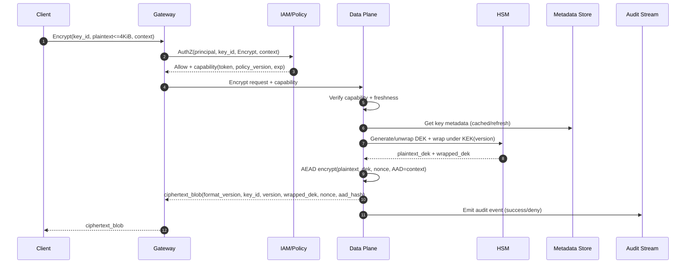
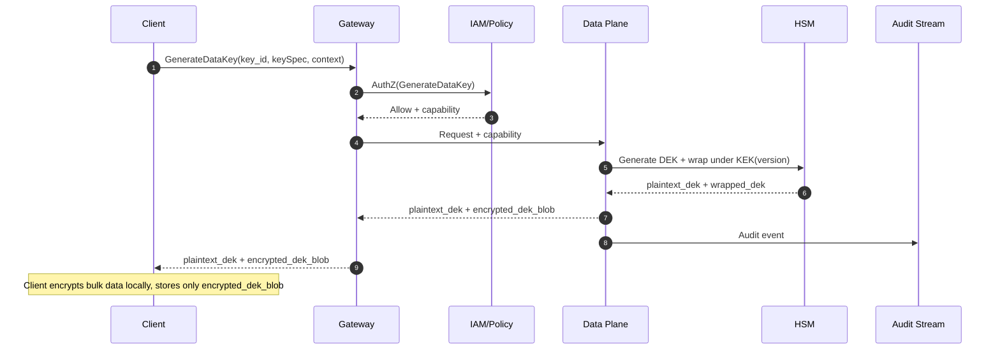

## Overview

A Key Management System (KMS) is a centralized service for creating, protecting, and using cryptographic keys with strong access control and auditability. The hard problems are not the cryptographic primitives—they’re enforcing least privilege at high QPS, proving who used which key (and why), rotating keys without breaking existing data, and meeting availability/latency SLOs while keeping key material protected (ideally hardware-backed).

A production KMS typically separates:
- **Control plane**: key lifecycle, policy, rotation, deletion workflows (strong consistency).
- **Data plane**: low-latency cryptographic APIs at high QPS (cache-heavy, horizontally scalable).
- **Audit plane**: tamper-evident, durable, queryable records of every admin and key-usage action.

The core pattern is **envelope encryption**:
- The KMS protects **Key Encryption Keys (KEKs)** (a.k.a. master keys) in an HSM (non-exportable).
- Applications encrypt bulk data using **Data Encryption Keys (DEKs)**.
- The KMS wraps/unwraps DEKs under KEKs; apps store only encrypted DEKs (and discard plaintext DEKs quickly).

This minimizes HSM load, reduces blast radius, supports rotation/versioning, and makes “who used which key and when” auditable.

## Goals and Non-Goals

### Goals
- Centralized, policy-controlled key usage for many tenants/services.
- HSM-backed protection for KEKs and asymmetric private keys.
- Strong auditing and operational safety (disable/delete windows, break-glass).
- Interview-ready clarity: explicit numbers, trade-offs, and failure modes.

### Non-Goals
- General-purpose secrets management (passwords, API tokens). (A vault can complement KMS.)
- End-to-end encryption where the server never sees plaintext (client-side KMS + BYOK can approximate this but changes the product).
- Supporting every crypto algorithm under the sun (start with a small, safe set).

## Requirements

### Functional Requirements
- **Key lifecycle**: create, describe, list, tag, alias, enable/disable, schedule/cancel deletion, rotate.
- **Crypto operations**:
  - Symmetric: `Encrypt`, `Decrypt`, `GenerateDataKey`, `ReEncrypt` (optional but common).
  - Asymmetric: `Sign`, `Verify`, `GetPublicKey`.
- **Versioning**: encrypt with latest version; decrypt/verify with any enabled version; cryptographic outputs identify key+version.
- **Authorization**: IAM + per-key resource policy (RBAC/ABAC), per-tenant isolation, optional short-lived grants for delegation.
- **Encryption context (AAD)**: bind ciphertext to `{tenant_id, service, env, …}` to prevent substitution across tenants/services.
- **Audit**: tamper-evident log for all admin actions and all key-usage requests (success and denied).
- **HSM integration**: non-exportable KEKs/private keys; controlled key generation and destruction.
- **Safe state transitions**: `ENABLED`, `DISABLED`, `PENDING_DELETION` with recovery windows.

### Non-Functional Requirements (Concrete Targets)

#### Scale
- **Crypto QPS (per region)**: 50k steady-state, burst to 200k for short peaks (minutes).
- **Keys**: 5M keys total; up to 50M versions (rotation and asymmetric versions).
- **Audit volume**: up to 1B events/day global (≈11.6k/sec average, plan for 10× peak ingest).

#### Latency (Data Plane, in-region)
Assuming clients call a regional endpoint and the KMS does one IAM check + metadata lookup (cached) + HSM operation:
- `Encrypt/Decrypt` (small payloads, ≤4 KiB): **P50 15–25 ms**, **P99 ≤ 90 ms**
- `GenerateDataKey`: **P50 20–35 ms**, **P99 ≤ 120 ms**
- `Sign` (RSA-PSS / ECDSA / Ed25519): **P50 25–60 ms**, **P99 ≤ 200 ms** (algorithm and HSM-dependent)

Control plane:
- `CreateKey/Rotate/PolicyUpdate`: **P99 0.5–2 s** (includes persistence + background orchestration)

#### Availability
- **Data plane**: 99.99% per region (multi-AZ, no single points of failure).
- **Control plane**: 99.9% per region.
- **Audit ingestion**: at-least-once into durable log; end-to-end delivery into WORM store within **≤60s** at P99 under normal conditions.

#### Consistency
- **Strong consistency** for lifecycle and policy writes per key (linearizable per key).
- **Bounded staleness** for usage enforcement via cache invalidation and versioning:
  - Policy/state changes reflected in data plane within **≤5s in-region** (target), **≤30s cross-region** (typical).
  - On uncertainty, **fail closed** for sensitive operations (decrypt/sign), configurable for encrypt.

#### Durability & Key Safety
- **Key metadata**: no loss (multi-AZ storage, PITR).
- **HSM key objects**: protected against loss via vendor-supported secure replication/backup and tested restore procedures.
- **Audit logs**: immutable storage (WORM/retention locks), verifiable integrity (hash chaining/signatures).

### Constraints & Assumptions
- Multi-tenant: strict logical isolation (tenant_id boundary everywhere), plus quota enforcement.
- HSMs are available (FIPS 140-2/140-3 Level 3 equivalent).
- Clients call KMS over TLS (optionally mTLS). No outbound calls from KMS into customer networks.
- Compliance: SOC2 and commonly PCI/HIPAA-adjacent requirements (access logging, dual control, retention, separation of duties).
- Team size ~6–10 engineers: prefer proven building blocks (Postgres/DynamoDB, Redis, Kafka/PubSub, HSM appliances).

## Architecture

### High-Level Diagram

```mermaid
graph TB
  %% Entry
  Client[Clients / SDKs] -->|TLS/mTLS| GW[API Gateway / Edge]
  GW --> WAF[WAF + Rate Limits]
  WAF --> Auth[AuthN + AuthZ<br/>(IAM + Policies)]

  %% Planes
  Auth --> DP[Data Plane<br/>Crypto APIs]
  Auth --> CP[Control Plane<br/>Lifecycle APIs]

  %% Metadata + cache
  CP --> Meta[(Key Metadata Store)]
  CP --> Pub[Change Events<br/>(Pub/Sub)]
  Pub --> DP
  DP --> Cache[(Local + Redis Cache)]
  DP --> Meta

  %% HSM
  DP --> HSM[HSM Cluster<br/>KEKs + Private Keys]

  %% Audit
  GW --> Audit[Audit Producer]
  DP --> Audit
  CP --> Audit
  Audit --> Stream[Durable Log Stream]
  Stream --> Worm[(WORM Audit Store)]
  Stream --> SIEM[Security Analytics / SIEM]
```

### Key Ideas
- **Plane separation**: control plane handles writes/workflows; data plane focuses on tight SLOs for crypto operations.
- **Metadata as the source of truth**: key state, versions, policy, and deletion schedule live in a strongly consistent store.
- **Push-based invalidation**: control plane publishes key changes; data plane refreshes caches quickly to meet policy propagation targets.
- **HSM is the trust anchor**: KEKs/private keys are generated and stored inside HSM; the service never persists plaintext KEKs.

### Multi-Region Model (Practical and Safe)
- **Per-key “home region” for writes**: policy updates, rotations, and deletions are serialized by a per-key lease/epoch to avoid split-brain.
- **Read/crypto in every region**: data plane serves crypto operations regionally using replicated metadata plus local HSMs containing the needed key versions.
- **Replication**:
  - Metadata replicated asynchronously cross-region with monotonically increasing `policy_version` and `current_version`.
  - HSM key objects replicated using vendor-supported secure replication/backup (never exporting plaintext key material).

This avoids multi-writer conflicts while still allowing low-latency crypto near callers.

## Components

### API Gateway / Edge
**Responsibilities**
- TLS/mTLS termination, request validation, WAF, throttling, routing.
- Idempotency for side-effecting requests (`CreateKey`, `RotateKey`, `ScheduleDeletion`).
- Request shaping (max payload sizes, content-type constraints, base64 decode limits).

**Key decisions**
- Enforce per-tenant quotas at the edge to protect HSM capacity.
- Use globally unique `request_id` and propagate it through services for auditing.

**Typical tech**
- Envoy/NGINX + managed L7 LB/API gateway; OIDC/JWT validation; mTLS for service-to-service.

### AuthN/AuthZ (IAM + Policy Engine)
**Responsibilities**
- Authenticate principal identity (service accounts, users).
- Evaluate identity policies + per-key resource policies + ABAC conditions (including encryption context).
- Optionally mint **capability tokens** (short-lived, signed) embedding `{principal, key_id, allowed_ops, policy_version, exp}`.

**Key decisions**
- To meet latency targets, data plane should not do a heavyweight policy evaluation for every call:
  - **Option A (common)**: gateway calls IAM; data plane verifies a signed capability token (fast).
  - **Revocation**: keep TTL small (e.g., 1–5s) and push invalidations on policy/state changes; fail closed if token policy version is behind.

### Control Plane (Lifecycle)
**Responsibilities**
- `CreateKey`, `RotateKey`, policy updates, state transitions, deletion scheduling and cancellation.
- Background orchestration: rotation jobs, deletion execution, replication checks.

**Key decisions**
- **Per-key linearizability**: use optimistic concurrency (`etag`/`version`) plus a per-key write lease to serialize mutations.
- **Rotation**: create a new key version, update `current_version`, keep old versions enabled for decrypt/verify until retired by policy.

**Typical tech**
- Stateless service + workers; Postgres (with HA) or DynamoDB (strong reads for key state); queue for workflows.

### Data Plane (Crypto APIs)
**Responsibilities**
- `Encrypt/Decrypt/GenerateDataKey/ReEncrypt/Sign/Verify` with tight latency SLOs.
- Fetch key metadata from cache; consult HSM for wrap/unwrap or private-key ops; perform bulk crypto in software where appropriate.

**Key decisions**
- **Payload limits**: limit `Encrypt/Decrypt` plaintext sizes (e.g., ≤4 KiB) to keep tail latency predictable and encourage envelope encryption.
- **Ciphertext self-description**: ciphertext blob includes `{key_id, key_version, alg, nonce, aad_hash, format_version}`.
- **Fail-closed policy**: if key state/policy is unknown or stale beyond bounds, deny decrypt/sign.

**Typical tech**
- Go/Rust/Java; local in-memory cache + Redis; gRPC internally for efficiency.

### HSM Cluster
**Responsibilities**
- Generate and store KEKs and asymmetric private keys (non-exportable).
- Perform unwrap/wrap (key management) and signing operations.

**Key decisions**
- Keep N+1 capacity per AZ and route based on health and queue depth.
- Separate partitions/pools for high-cost operations (signing) vs wrap/unwrap if supported.

**Typical tech**
- Vendor appliances or cloud HSM; PKCS#11/JCE; HSM admin roles under dual control.

### Metadata Store
**Responsibilities**
- Store key definitions, versions, policy documents, aliases, tags, deletion schedules.
- Provide strongly consistent reads for control plane; bounded reads for data plane (with invalidation).

**Key decisions**
- Partitioning by `tenant_id` (and/or `key_id`) to scale and limit blast radius.
- Protect against hot partitions (aliases, popular keys) via careful indexing and caching.

### Audit Pipeline (Compliance-Critical)
**Responsibilities**
- Produce audit events for every admin and key usage call (including denied).
- Durable, tamper-evident storage and integrity verification.

**Key decisions**
- At-least-once delivery with `event_id` de-duplication downstream.
- Integrity: hash chain per tenant and periodic signing/anchoring (e.g., sign every N events).

## Data Model

### Core Entities

**`keys`**
- `key_id` (UUID, PK)
- `tenant_id` (string, index)
- `alias` (string, unique per tenant, nullable)
- `type` (`SYMMETRIC` | `ASYMMETRIC`)
- `algorithm` (`AES_256_GCM` | `RSA_3072` | `EC_P256` | `ED25519`)
- `purpose` (`ENCRYPT_DECRYPT` | `SIGN_VERIFY`)
- `state` (`ENABLED` | `DISABLED` | `PENDING_DELETION`)
- `policy` (jsonb) + `policy_version` (int)
- `current_version` (int)
- `home_region` (string)
- `write_epoch` (int64) — bumps on failover/lease changes
- `created_at`, `updated_at`
- `deletion_scheduled_at` (timestamp, nullable)
- `deletion_window_days` (int, nullable)

**`key_versions`**
- `key_id` (FK)
- `version` (int)
- `hsm_key_handle` (string) — reference/label, not key material
- `state` (`ACTIVE` | `RETIRED`)
- `created_at`
- PK: (`key_id`, `version`)

**`grants`** (optional, for delegated access without editing key policy)
- `grant_id` (UUID, PK)
- `tenant_id`, `key_id`
- `grantee_principal` (string)
- `operations` (set)
- `constraints` (jsonb) — encryption context constraints, IP ranges, expiry
- `created_at`, `expires_at`, `revoked_at` (nullable)

**`idempotency_keys`** (for control-plane safety)
- `tenant_id`, `idempotency_key` (PK)
- `request_hash`, `response_blob`, `created_at`, `expires_at`

### Ciphertext and Encrypted-DEK Formats (Versioned)

**Ciphertext blob** (returned by `Encrypt`)
- `format_version`: int
- `key_id`: UUID
- `key_version`: int
- `algorithm`: enum
- `nonce`: bytes
- `aad_hash`: bytes (hash of canonicalized encryption context)
- `encrypted_data_key`: bytes (DEK wrapped under KEK/key_version)
- `ciphertext`: bytes
- `auth_tag`: bytes (for AEAD modes)

**Encrypted data key blob** (returned by `GenerateDataKey`)
- `format_version`
- `key_id`, `key_version`, `algorithm`
- `aad_hash`
- `wrapped_dek`: bytes

Notes:
- The **encryption context** is not secret but must be canonicalized (sorted keys, stable encoding) before hashing.
- Decrypt requires the caller to provide the same context; mismatch results in a hard failure.

## Data Flows

### Encrypt (Small Payload) Flow



### GenerateDataKey (Large Payload) Flow (Recommended)



## API Design

Base path: `/v1` (REST) and/or `kms.v1` (gRPC). All requests require authentication (OIDC/JWT and/or mTLS). Authorization combines IAM identity policy + key resource policy + ABAC conditions (including encryption context).

### Conventions
- **Idempotency**: required for side-effecting control-plane operations via `Idempotency-Key`.
- **Resource naming**: `keyId` is stable; `alias` is mutable and unique per tenant.
- **Limits**:
  - `Encrypt/Decrypt` plaintext limit: **4 KiB** (configurable).
  - `encryptionContext`: e.g., max 20 keys, max 2 KiB encoded.
- **Error model**:
  - `400` invalid input/format
  - `401` unauthenticated
  - `403` unauthorized / policy denies
  - `409` invalid key state (disabled, pending deletion) or optimistic concurrency conflict
  - `422` encryption context mismatch
  - `429` throttled/quota exceeded
  - `503` transient dependency failure (HSM/DB); safe to retry with backoff where idempotent

### Create Key
`POST /v1/keys`
```json
{
  "tenantId": "t_123",
  "alias": "payments-prod",
  "type": "SYMMETRIC",
  "algorithm": "AES_256_GCM",
  "purpose": "ENCRYPT_DECRYPT",
  "policy": { "statements": [] },
  "deletionWindowDays": 30
}
```

Response:
```json
{
  "keyId": "9c0f9a6e-3e6a-4d88-9ee2-2d7f6bff5a3a",
  "state": "ENABLED",
  "currentVersion": 1,
  "policyVersion": 1
}
```

### Describe Key
`GET /v1/keys/{keyId}`

### Encrypt / Decrypt
`POST /v1/crypto:encrypt`
```json
{
  "keyId": "9c0f9a6e-3e6a-4d88-9ee2-2d7f6bff5a3a",
  "plaintextB64": "SGVsbG8=",
  "encryptionContext": { "tenant_id": "t_123", "service": "payments", "env": "prod" }
}
```

Response:
```json
{
  "ciphertextBlobB64": "BASE64(...)",
  "keyId": "9c0f9a6e-3e6a-4d88-9ee2-2d7f6bff5a3a",
  "version": 3,
  "algorithm": "AES_256_GCM",
  "contextHashB64": "BASE64(...)"
}
```

`POST /v1/crypto:decrypt`
```json
{
  "ciphertextBlobB64": "BASE64(...)",
  "encryptionContext": { "tenant_id": "t_123", "service": "payments", "env": "prod" }
}
```

Response:
```json
{
  "plaintextB64": "SGVsbG8=",
  "keyId": "9c0f9a6e-3e6a-4d88-9ee2-2d7f6bff5a3a",
  "version": 3
}
```

### Generate Data Key
`POST /v1/crypto:generateDataKey`
```json
{
  "keyId": "9c0f9a6e-3e6a-4d88-9ee2-2d7f6bff5a3a",
  "keySpec": "AES_256",
  "encryptionContext": { "tenant_id": "t_123", "service": "blobstore", "env": "prod" }
}
```

Response:
```json
{
  "plaintextKeyB64": "BASE64(32-bytes)",
  "encryptedKeyBlobB64": "BASE64(...)",
  "keyId": "9c0f9a6e-3e6a-4d88-9ee2-2d7f6bff5a3a",
  "version": 3
}
```

### ReEncrypt (Optional but Useful)
`POST /v1/crypto:reEncrypt`
- Input: ciphertext/encrypted-DEK + old context + new keyId (optional) + new context
- Output: rewrapped encrypted-DEK/ciphertext without revealing plaintext (when possible)

### Sign / Verify / GetPublicKey
`POST /v1/crypto:sign`
```json
{
  "keyId": "9c0f9a6e-3e6a-4d88-9ee2-2d7f6bff5a3a",
  "messageB64": "BASE64(...)",
  "signingAlgorithm": "RSA_PSS_SHA256"
}
```

`POST /v1/crypto:verify`
```json
{
  "keyId": "9c0f9a6e-3e6a-4d88-9ee2-2d7f6bff5a3a",
  "messageB64": "BASE64(...)",
  "signatureB64": "BASE64(...)",
  "signingAlgorithm": "RSA_PSS_SHA256"
}
```

`GET /v1/keys/{keyId}/publicKey?version=2`

### Rotation and Key State
- `POST /v1/keys/{keyId}:rotate` (idempotency required)
- `POST /v1/keys/{keyId}:disable`
- `POST /v1/keys/{keyId}:enable`
- `POST /v1/keys/{keyId}:scheduleDeletion` with `windowDays` (e.g., 7–30)
- `POST /v1/keys/{keyId}:cancelDeletion`

## Scaling and Performance

### Where the Cost Is
- **HSM throughput and tail latency**: wrap/unwrap and especially signing are bounded by hardware.
- **Hot keys**: a few keys can dominate traffic; cache locality matters, but HSM still does the expensive step.
- **Authorization**: policy evaluation can be expensive if done on every request.
- **Audit**: audit volume can exceed control-plane volume by orders of magnitude.

### Key Strategies
- **Envelope encryption** as the default: encourage `GenerateDataKey` and local encryption for large payloads.
- **Strict payload limits** for `Encrypt/Decrypt`: keep KMS from becoming a bulk crypto service.
- **Capability tokens**: IAM computes policy; data plane verifies a signed token quickly.
- **Caching**:
  - Key metadata and policy snapshots: TTL 5–30s with push invalidation.
  - Public keys: cache minutes–hours (immutable per version).
  - Disabled/pending-deletion status: very short TTL (1–5s) plus push invalidation.
- **Quotas and fairness**:
  - Per-tenant QPS limits and concurrency limits for HSM-backed calls.
  - Separate pools/priority for latency-sensitive production traffic vs batch jobs.

### Capacity Planning (Back-of-the-Envelope)
- If 200k QPS peak involves HSM wrap/unwrap per request, HSM fleet sizing dominates:
  - Example: if one HSM sustains 2k unwrap/sec at acceptable P99, peak needs ~100 HSM-equivalents **plus** N+1 and AZ redundancy.
- Reduce HSM pressure by shifting bulk usage to `GenerateDataKey` and local encryption, and by actively policing misuse of `Encrypt` for large data.

## Consistency Model and Cache Invalidation

- Control plane writes are serialized per key and bump `policy_version` and/or `current_version`.
- Control plane emits a change event `{key_id, policy_version, state, current_version, write_epoch}`.
- Data plane maintains:
  - a local cache (in-memory) for hottest keys,
  - an optional shared cache (Redis) to reduce metadata-store load.
- Data plane rejects usage when:
  - key is `DISABLED` or `PENDING_DELETION`,
  - capability token is expired or has an older `policy_version` than the cached/store value,
  - replication epoch indicates a leader change and freshness cannot be ensured (fail closed).

## Security and Compliance

### Threat Model (Representative)
- External attacker calling APIs directly (credential stuffing, abuse, DoS).
- Malicious tenant trying to decrypt another tenant’s data (substitution attacks).
- Compromised service identity within a tenant (credential theft).
- Malicious or careless operator (insider risk).
- Supply-chain/host compromise of the data plane.

### Key Controls
- **Strong identity and transport**: TLS everywhere, mTLS for service-to-service, short-lived credentials.
- **Least privilege**: per-key policies, ABAC conditions, and optional grants with narrow constraints.
- **Encryption context (AAD)**: prevents ciphertext/encrypted-DEK reuse across tenants/services/environments.
- **HSM-backed non-exportable keys**: KEKs/private keys never leave HSM as plaintext.
- **Separation of duties**: distinct roles for HSM admins, KMS operators, and auditors; dual control for sensitive HSM operations.
- **Audit integrity**: WORM retention locks + hash chaining + periodic signing; immutable retention aligned to compliance needs.
- **Operational hardening**: restricted admin paths, break-glass procedures, mandatory MFA, and change management on policy edits.

## Trade-offs and Alternatives

### Trade-offs Made
- **Envelope encryption + wrapped DEKs**
  - Pros: scalable, cost-effective, minimizes HSM work for large payloads.
  - Cons: clients must handle local crypto correctly; encrypted DEK blobs become part of the storage format.
- **Split control plane vs data plane**
  - Pros: independent scaling; data plane stays fast and resilient under admin churn.
  - Cons: cache invalidation and propagation complexity; two operational surfaces.
- **Capability tokens for authorization**
  - Pros: low latency; reduces IAM load under high QPS.
  - Cons: requires tight TTL + revocation strategy; more complex than “call IAM every time”.

### Alternative Approaches
- **Monolithic service**: simpler initially, but harder to protect latency SLOs and isolate failures under mixed workloads.
- **Client-managed keys (BYOK everywhere)**: reduces central dependency but weakens centralized audit/control and increases leakage risk.
- **Per-application HSM**: strong isolation but high cost and operational burden; tends to fragment security posture.

## Failure Modes and Mitigations

### 1) HSM Node Outage or Elevated Latency
- **Impact**: higher P99, increased `503`s for decrypt/sign.
- **Detection**: HSM queue depth, error codes, P99 by operation, AZ-level health.
- **Mitigations**: health-based routing, N+1 capacity per AZ, per-tenant load shedding, isolate signing pool, exponential backoff and retry guidance.

### 2) Metadata Store Partial Outage / Replication Lag
- **Impact**: stale policy/state could allow unintended access if mishandled; or deny legitimate traffic.
- **Detection**: store error rate, replication lag, cache divergence, policy propagation latency SLO.
- **Mitigations**: fail closed for decrypt/sign when freshness cannot be guaranteed, strong reads for control plane, push invalidation, bounded TTLs.

### 3) Compromised Service Credentials
- **Impact**: attacker can use allowed decrypt/sign operations until revoked.
- **Detection**: anomaly detection (new IP/ASN, unusual QPS, time-of-day), per-tenant behavioral baselines, denied→allowed transitions.
- **Mitigations**: short-lived tokens, rapid policy updates + invalidation, step-up auth for sensitive keys, per-tenant quotas, “break-glass disable key”.

### 4) Audit Pipeline Backlog or Failure
- **Impact**: delayed compliance visibility; potential audit gaps if events are lost.
- **Detection**: stream lag, consumer lag, end-to-end audit delivery SLO, WORM write failures.
- **Mitigations**: durable ingestion (append-only log), local buffering, backpressure, alert/runbooks; configurable “strict mode” to fail sensitive ops if audit cannot be durably enqueued.

### 5) Control Plane Split-Brain During Regional Failover
- **Impact**: conflicting rotations/policy versions, inconsistent enforcement.
- **Detection**: lease/epoch conflicts, monotonic version violations, cross-region reconciliation alarms.
- **Mitigations**: per-key write lease with fencing tokens (`write_epoch`), single home region for writes, explicit failover runbook that bumps epochs and pauses rotations until stable.

## Disaster Recovery

- **Targets**:
  - Data plane RTO: **15 minutes** (regional).
  - Metadata RPO: **0** (multi-AZ + synchronous replication in-region).
  - Audit RPO: **≤5 minutes** (durable log with cross-AZ replication).
- **Backups**:
  - Metadata: PITR + daily snapshots; regular restore drills.
  - HSM: vendor-supported secure key backup/replication under quorum control; periodic restore tests into a sterile environment.
- **Failover**:
  - In-region: automatic AZ failover.
  - Cross-region: traffic manager/DNS; promote home region for affected keys via controlled epoch bump.

## Operations

### Monitoring and Alerting (Suggested SLO-Driven)
- Data plane: QPS, P50/P99 latency by op, `4xx/5xx` rates, HSM latency, cache hit rates, token verification failures, throttles.
- HSM: ops/sec by type, session pool utilization, queue depth, error codes, health per device, capacity headroom.
- Control plane: job lag (rotation/deletion), policy propagation latency, metadata write conflicts, replication health.
- Audit: enqueue success, lag, WORM write success, integrity verification failures.

Alert examples:
- Data plane P99 > SLO for 5 minutes.
- HSM unhealthy capacity below N required per AZ.
- Policy propagation P99 > 5s in-region.
- Audit lag > 60s (warn) / > 5m (page).
- Integrity verification failure (page immediately).

### Deployment and Change Management
- Canary deployments by tenant or traffic percentage; automated rollback on SLO regression.
- Backward-compatible ciphertext formats (versioned) and schema migrations.
- Feature flags for new algorithms, stricter enforcement modes, and audit strictness.

### Operational Runbooks (Minimum Set)
- HSM device replacement and key replication validation.
- Emergency key disable (“break glass”) and verification of enforcement.
- Cross-region failover and write-epoch fencing.
- Audit backlog recovery and integrity verification.

## References and Further Reading
- NIST SP 800-57 (Key Management)
- NIST SP 800-38D (GCM)
- AWS KMS concepts (envelope encryption, key policies, grants): https://docs.aws.amazon.com/kms/
- Google Cloud KMS / Cloud HSM: https://cloud.google.com/kms/docs
- HashiCorp Vault Transit (KMS-like patterns): https://developer.hashicorp.com/vault/docs/secrets/transit
- PKCS#11 overview: https://www.oasis-open.org/committees/pkcs11/