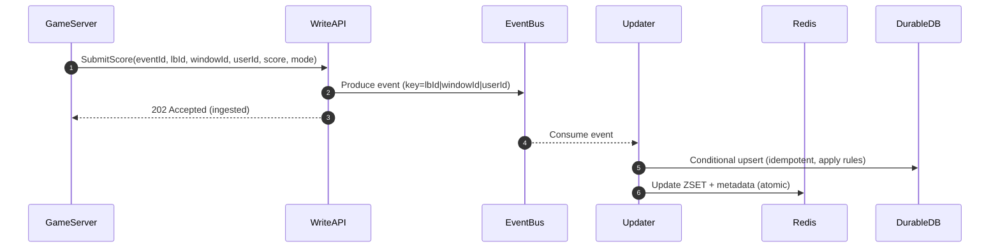

## Overview

A leaderboard system maintains ranked lists of players based on scores that change frequently. The core challenge is serving low-latency reads (top N, “around me”, rank lookup) at large scale while ingesting a high volume of score updates across multiple leaderboard variants (global/region/mode) and time windows (daily/weekly/seasonal). Ranking is order-dependent, so the design relies on specialized indexing (sorted sets) and careful consistency and tie-breaking rules.

A production-grade approach separates concerns:
1. **Write ingestion** that authenticates, validates, rate-limits, and durably records score updates.
2. **Asynchronous rank materialization** that updates a read-optimized ranking store.
3. **Window management** that rolls leaderboards over on schedule, snapshots results, and preserves history.

The most common implementation keeps *active windows* in an in-memory ranking store (e.g., Redis Sorted Sets) and continuously persists authoritative state to a durable store (e.g., DynamoDB/Cassandra) plus immutable snapshots in object storage for closed windows.

---

## Requirements

### Functional Requirements
- Update a player’s score for one or more leaderboards (e.g., global, region, game mode).
- Fetch top N players for a leaderboard and time window (daily/weekly/season/“all-time”).
- Fetch a player’s rank and score, and “players around me” (±K positions).
- Support pagination for top lists.
- Support tie-breaking rules (e.g., higher score wins; ties broken deterministically).
- Support anti-cheat/validation hooks (rate limits, sanity checks, server-authoritative updates).
- Support automatic window rollover (daily/weekly) and historical querying for closed windows.
- Optionally support near-real-time client updates (polling and/or push).

### Non-Functional Requirements (Targets)
- **Scale**
  - 50M MAU, 5M DAU
  - Peak **200k score updates/sec** globally (across all leaderboards/windows)
  - Peak **300k read QPS** globally (top N / around-me / rank)
  - Largest active leaderboard/window cardinality: **up to 10M users**
  - Regions: **3–6** (geo-routed)
- **Latency (regional)**
  - Reads: **P50 20ms**, **P99 120ms** (top/rank/around-me)
  - Writes (ingestion ack): **P50 15ms**, **P99 80ms**
  - “Time to reflect update” (ingested → visible in reads): **P99 ≤ 3s** for hot boards
- **Availability**
  - Reads: **99.99%**
  - Writes: **99.9%** (degraded modes allowed)
- **Consistency**
  - Leaderboard rank/position: **eventual consistency** (seconds) acceptable
  - Auth, identity, entitlements: **strong consistency**
  - Updates must be **idempotent** and **deterministically applied**
- **Durability**
  - Active windows: **RPO ≤ 1 minute**, **RTO ≤ 30 minutes** (regional)
  - Closed windows: durable snapshots with **no post-close loss**

### Constraints & Assumptions
- Game servers are authoritative for score submissions (clients cannot write scores directly).
- Most leaderboards use **“max”** or **“set”** semantics (best score / latest score). **“increment”** is optional and requires stronger dedupe guarantees.
- Minimal PII in leaderboard core. Display name/avatar come from a separate profile service.
- “Global” leaderboards can be regionalized for latency and operational isolation; cross-region convergence is eventually consistent.

---

## Architecture

### High-Level Components

```mermaid
flowchart LR
  subgraph Region["Single Region (x3–6)"]
    C[Client] --> E[Edge / API Gateway]
    GS[Game Server] -->|mTLS| E

    E --> RAPI[Leaderboard Read API]
    E --> WAPI[Leaderboard Write API]

    WAPI --> K[(Event Bus)]
    K --> U[Rank Updater Workers]

    RAPI --> RDS[(Ranking Store: Redis ZSET)]
    U --> RDS
    U --> DDB[(Durable Store)]
    WM[Window Manager] --> RDS
    WM --> DDB
  end

  DDB --> OS[(Object Storage Snapshots)]
  K <--> XREG[Cross-Region Replication\n(MirrorMaker / Pulsar GeoRep)]
```

**Key idea:** writes are acknowledged when **durably recorded** (event bus), while rank updates happen asynchronously via workers that update **Redis (read path)** and a **durable per-user state store**. Window management drives rollover and snapshotting.

### Read/Write Data Flows



Reads are served from Redis (with optional small-TTL edge caching); closed windows are served from object storage snapshots (or a queryable analytics store) to reduce load on hot infrastructure.

---

## Core Design Decisions

### 1) Authoritative Update Semantics
To keep correctness tractable at high throughput:
- Prefer **`mode=max`** (keep best score only) or **`mode=set`** (latest absolute score).
- Support **`mode=increment`** only if you can guarantee *exactly-once per increment* via strong dedupe (e.g., per-match unique IDs retained for a sufficient TTL) or if increments are computed server-side into an absolute score and sent as `set`.

### 2) Eventual Consistency with Durable Ingestion
- Writes are acknowledged when persisted to the event bus (fast, resilient).
- Ranks become visible after asynchronous processing (seconds-level target).
- Redis is treated as the **serving store** for active windows; durable state is the **system of record** for correctness and recovery.

### 3) Partitioning Strategy: Partition by Leaderboard/Window, Not by User
Accurate rank queries (global rank, around-me) are simplest when each leaderboard window is a single sorted set. To scale horizontally:
- **Distribute leaderboard windows across many Redis primaries** (consistent hashing by `lbId|windowId`).
- Use **dedicated capacity** for extremely hot leaderboards (e.g., “global daily”).
- Only introduce *intra-leaderboard sharding* for extreme cases, and accept added complexity (see Alternatives).

---

## Component Deep-Dive

### Edge / API Gateway
**Responsibilities**
- AuthN/AuthZ (client reads via JWT/OAuth; server writes via mTLS and service identity).
- Rate limiting (per user, per IP, per game server identity).
- Request shaping, WAF rules, and geo-routing.

**Notes**
- Enforce “server-authoritative writes”: clients never call write endpoints.
- Implement “circuit breakers” for downstream dependencies to protect Redis and the event bus.

---

### Leaderboard Write API
**Responsibilities**
- Validate request (signature/identity, leaderboard existence, window validity, bounds).
- Enforce idempotency contract (requires `eventId`).
- Produce to event bus and return ingestion acknowledgment.

**Idempotency**
- `eventId` must be unique per score action and stable on retries.
- Write API should be stateless; idempotency is enforced downstream by conditional state updates (and optionally a short-lived dedupe cache).

---

### Event Bus (Kafka / Pulsar)
**Responsibilities**
- Durable log for score updates (replay/backfill, buffering spikes).
- Ordering guarantee **per user per leaderboard window**.

**Partitioning**
- Key events by `lbId|windowId|userId` so all updates for the same user and window are ordered.

**Topics (typical)**
- `score-events` (append-only, retention ≥ active window + grace period, e.g., 8–14 days)
- Optional `score-state` (log-compacted by `lbId|windowId|userId`) to accelerate rebuilds without replaying full event history

---

### Rank Updater Workers
**Responsibilities**
- Consume events, apply update rules, and persist results to:
  - Durable store (authoritative per-user state)
  - Redis (serving index)
- Provide backpressure control and prioritize hot boards.

**Correctness**
- Apply a deterministic rule: update only if the incoming event is “better” (for `max`) or “newer” (for `set`) than current state.
- For `increment`, apply only once per unique increment ID (strong dedupe required).

**Atomicity**
- Use a small transaction boundary:
  - Durable store conditional write first (decides accepted/rejected).
  - Redis update second (serving index). If Redis fails, the system self-heals via retry/replay and periodic reconciliation.

---

### Ranking Store (Redis)
**Responsibilities**
- Low-latency ranked reads for active windows:
  - Top N
  - Rank of user
  - Around-me window

**Data structures**
- ZSET per `lbId|windowId`: member=`userId`, score=`score` (numeric)
- HASH per `lbId|windowId|userId`: metadata (updatedAt, tie-break fields, lastEventId)

**Tie-breaking**
- Redis ZSET sorts by score, and for equal scores by member lexicographically. If “earliest timestamp wins” is required, keep tie metadata in the HASH and apply tie-breaking in the service for tied entries (typically rare for large score spaces).
- If you must enforce timestamp tie-breaking in Redis ordering, you can encode a small fractional tie-break into the ZSET score **only if** your score range is bounded such that floating-point precision remains safe. Redis scores are IEEE-754 doubles; keep total magnitude well below `2^53` for integer-like precision.

---

### Durable Store (DynamoDB / Cassandra)
**Responsibilities**
- Authoritative per-user per-leaderboard-window state.
- Idempotency enforcement via conditional updates.
- Recovery/reconciliation source of truth.

**Recommended access pattern**
- Primary key should efficiently read/update the current state for a user on a leaderboard window:
  - Partition key: `lbId#windowId`
  - Sort key: `userId`
  - Attributes: `score`, `updatedAt`, `lastEventId`, `mode`, optional `version`

This layout supports:
- Fast conditional updates (single key)
- Efficient per-leaderboard scanning for recovery tooling (bounded by board/window)

---

### Window Manager
**Responsibilities**
- Create and close windows (daily/weekly/seasonal), with a defined grace period for late events.
- Freeze closed windows (no further updates) and trigger snapshot export.
- Apply TTL/retention policies.

**Window lifecycle**
- `active` → `closing` (grace period, e.g., 2–5 minutes) → `closed` (immutable)

---

### Snapshots / History Store (Object Storage)
**Responsibilities**
- Immutable historical leaderboards for cheap storage and analytics.
- Serve closed-window reads without loading Redis.

**Format**
- Store top-K (e.g., top 10k) for fast client queries, and optionally a full export for analytics:
  - `snapshots/{lbId}/{windowId}/topK.parquet`
  - `snapshots/{lbId}/{windowId}/full-*.parquet` (optional)
  - `snapshots/{lbId}/{windowId}/meta.json`

---

## Data Model

### Redis (Active Windows)
- ZSET: `lb:{lbId}:{windowId}:z`
  - member: `userId`
  - score: `score` (double; treated as integer where possible)
- HASH: `lb:{lbId}:{windowId}:u:{userId}`
  - `score` (int64)
  - `updatedAt` (unix ms)
  - `lastEventId` (string)
  - `tie` (optional int64; e.g., update time or server sequence)

**Common operations**
- Top N: `ZREVRANGE ... WITHSCORES` (descending score)
- Rank: `ZREVRANK userId` (0-based; add 1 for human rank)
- Around-me: `ZREVRANK` + `ZREVRANGE start end`

### Durable Store (Authoritative)
Table: `leaderboard_user_state`
- `pk`: `lbId#windowId`
- `sk`: `userId`
- `score` (int64)
- `updatedAt` (timestamp)
- `lastEventId` (string)
- `mode` (enum: max|set|increment)
- `version` (int64, optional)

Table: `leaderboard_window_meta`
- `pk`: `lbId`
- `sk`: `windowId`
- `status` (active|closing|closed)
- `startAt`, `endAt`, `closeAt`
- `snapshotUri` (string, nullable)

### Event Schema (Bus)
Event key: `lbId|windowId|userId`

Example payload:
```json
{
  "eventId": "uuid",
  "lbId": "global",
  "windowId": "2025-12-17",
  "userId": "u9",
  "mode": "max",
  "score": 12345,
  "eventTimeMs": 1734400000000,
  "source": { "gameServerId": "gs-12", "matchId": "m-991" }
}
```

---

## API Design

### Read APIs (REST)

**Get top N**
- `GET /v1/leaderboards/{lbId}/windows/{windowId}/top?limit=100&cursor=...`
- Notes:
  - `limit` max (e.g., 200) to cap payload and tail latency
  - Cursor can be `(lastScore,lastUserId)` for stable pagination
- Response:
```json
{
  "lbId": "global",
  "windowId": "2025-12-17",
  "items": [
    { "userId": "u1", "rank": 1, "score": 9912, "updatedAt": 1734400000000 }
  ],
  "nextCursor": "..."
}
```

**Get user rank**
- `GET /v1/leaderboards/{lbId}/windows/{windowId}/users/{userId}`
- Response:
```json
{ "userId": "u9", "rank": 120392, "score": 102, "percentile": 97.6, "updatedAt": 1734400000000 }
```
- Percentile: `100 * (1 - (rank-1)/(cardinality-1))` when cardinality > 1.

**Around me**
- `GET /v1/leaderboards/{lbId}/windows/{windowId}/users/{userId}/around?above=25&below=25`
- Returns neighbors including the user with absolute ranks.

**Errors (read)**
- `404` unknown leaderboard/window
- `429` rate-limited
- `503` degraded (serve stale edge cache if available)

### Write API (Server-Authoritative)
**Submit score**
- `POST /v1/scores`
- Request:
```json
{
  "eventId": "uuid",
  "userId": "u9",
  "lbId": "global",
  "windowId": "2025-12-17",
  "mode": "max",
  "score": 12345
}
```
- Response: `202 Accepted`
```json
{ "eventId": "uuid", "ingestedAtMs": 1734400001234 }
```

**Idempotency contract**
- Same `eventId` must be safe to retry.
- Duplicate `eventId` should return `202` (or `200`) with no additional side effects.

**Validation**
- Enforce bounds (e.g., score in `[0, 10_000_000]`) and per-user update rate limits.
- Enforce window status (`active` or `closing` only).

---

## Consistency, Ordering, and Correctness

### Consistency Model
- **Read-after-write** is not guaranteed immediately; ranks update asynchronously.
- Target “time to reflect update” is enforced via consumer lag SLOs and autoscaling.

### Ordering Guarantees
- Event bus ordering is guaranteed **per `(lbId, windowId, userId)`** via message keying.
- For `max`: order does not matter if you always keep the maximum score (and deterministic tie-break).
- For `set`: define “newer wins” via `eventTimeMs` (or server sequence) and ignore stale writes.
- For `increment`: requires exactly-once per increment ID or a dedupe store; otherwise totals can drift.

### Tie-Breaking
Common deterministic options:
1. Higher score wins; ties by **earlier achieved time** (`updatedAt` ascending).
2. Higher score wins; ties by **stable identifier** (`userId` lex) for simplicity.
3. Higher score wins; ties by **server sequence** for strict ordering.

Pick one and apply consistently in both active reads and snapshot exports.

---

## Scaling & Performance

### Capacity Notes (Order-of-Magnitude)
- **Event bus throughput**: 200k events/s × ~200–500B payload ≈ 40–100MB/s ingress (before replication); plan partitions to keep per-partition throughput manageable.
- **Redis memory (active windows)**: ZSET entry overhead is significant; for 10M members, plan on **multiple GB** per hot leaderboard window plus metadata. Allocate dedicated primaries for the hottest boards and aggressively expire old windows.
- **Read payloads dominate bandwidth**: caching (edge + client) is critical for top lists.

### Scaling Strategies
- **API layer**: stateless autoscaling; isolate read and write deployments to avoid noisy neighbors.
- **Event bus**: increase partitions, multi-AZ replication, and separate topics for hot vs cold traffic if needed.
- **Redis placement**:
  - Distribute by `lbId|windowId` across many primaries.
  - Dedicated shard(s) for the hottest leaderboards.
  - Read replicas for scaling reads; write remains on primary.
- **Durable store**: provision for write-heavy conditional updates; partition by `lbId#windowId` to avoid hot partitions (large boards can be spread by adding a controlled suffix, e.g., `lbId#windowId#bucket`, only if you can tolerate more complex recovery).

### Hot Leaderboard Mitigations
- **Edge caching** for `GET top` with TTL 1–5s (absorbs spikes and reduces Redis fanout).
- **Top-K cache**: maintain a small materialized top-K list for extremely hot boards (K=1k–10k), updated by workers, to make `GET top` O(K) reads.
- **Load shedding**: cap `limit`, rate-limit “around-me” endpoints, and degrade to approximate percentile under extreme load.

---

## Trade-offs & Alternatives

### Key Trade-offs
- **Asynchronous rank updates (eventual consistency)**
  - Pro: high write throughput, resilience to spikes, replay/backfill
  - Con: rank may lag ingestion; requires strong observability on lag
- **Redis Sorted Sets for active windows**
  - Pro: simple, low-latency rank/top queries
  - Con: memory-heavy; single leaderboard window is a hot data structure that needs careful capacity planning
- **Partitioning by leaderboard/window (not user)**
  - Pro: accurate rank and around-me queries are straightforward
  - Con: very hot leaderboards may need dedicated hardware or advanced sharding patterns

### Alternative Approaches
- **Intra-leaderboard sharding + merge**
  - Shard a single leaderboard across multiple ZSETs (e.g., by user hash) and periodically merge into a global top-K.
  - Works well for “top N” but makes exact global rank/around-me more complex (often approximate).
- **Streaming state store (Flink/Samza + RocksDB)**
  - Strong for windowing, replay, and analytics; can materialize leaderboards into serving stores.
  - Higher operational complexity than Redis-based approach.
- **Search/analytics engine for historical queries**
  - Store closed windows in ClickHouse/BigQuery/Elasticsearch for flexible querying.
  - Better for analytics than for hot-path leaderboard reads.

---

## Failure Modes & Mitigations

### Redis Degradation/Outage
- **Impact**: read path degraded; active window ranks unavailable or stale
- **Mitigations**
  - Multi-AZ Redis with replicas and automatic failover
  - Serve stale from edge cache for top lists (seconds-level TTL)
  - Rebuild active windows via replay from bus and/or scan durable store plus snapshot bootstrap

### Event Bus Partial Unavailability
- **Impact**: write ingestion fails or backs up; ranks stop updating
- **Mitigations**
  - Replication factor 3, `min.insync.replicas` configured, multi-AZ
  - Backpressure: reject writes with `503` when producing fails
  - Optional “degraded writes” mode: persist to durable store first and enqueue later (adds complexity; use only if required)

### Consumer Lag Spike
- **Impact**: ranks stale by seconds/minutes; violates “time to reflect update” SLO
- **Mitigations**
  - Autoscale consumers; isolate hot leaderboards into dedicated consumer groups
  - Batch Redis writes with pipelines/Lua
  - Prioritize hot boards; shed low-priority boards during incidents

### Duplicate / Replayed Events
- **Impact**: incorrect scores (especially for increment)
- **Mitigations**
  - Conditional updates in durable store (lastEventId, updatedAt monotonicity, or sequence checks)
  - For increment: maintain dedupe IDs (matchId/actionId) with TTL in a dedicated store

### Window Rollover Bugs (late writes after close)
- **Impact**: inconsistent “closed” results vs active view, snapshot mismatch
- **Mitigations**
  - Explicit window states with grace period (`closing`)
  - Reject writes to `closed` windows
  - Snapshot only after the window is fully closed and consumers have caught up (or snapshot from durable store with a defined watermark)

---

## Disaster Recovery & Multi-Region

### Multi-Region Strategy
- Reads: served from the nearest region; closed windows can be served from globally replicated object storage/CDN.
- Writes: routed to the nearest region; replicate event streams cross-region for recovery and eventual convergence.

### RPO / RTO Targets
- Active windows: **RPO ≤ 1 minute**, **RTO ≤ 30 minutes** per region
- Closed windows: **RPO = 0** after snapshot is finalized

### Recovery Playbook (Active Window)
1. Restore service health (Redis failover or replace shard).
2. Bootstrap from latest snapshot/checkpoint if available.
3. Replay event bus from the last checkpoint (or consume compacted `score-state`) to rebuild Redis.
4. Reconcile counts and spot-check correctness (top-K consistency vs durable store).

---

## Operations

### Observability
**Golden signals**
- API: QPS, P50/P95/P99 latency, 4xx/5xx, saturation
- Bus: produce errors, partition ISR health, consumer lag (seconds), backlog size
- Redis: ops/sec, command latency, replication lag, memory, evictions
- Correctness: “time to reflect update” histogram, rejected/duplicate event rates, anomaly detection signals

**Suggested alerts**
- P99 read latency > 150ms for 5 minutes
- Consumer lag P99 > 3 seconds for hot boards (or > 30s for cold boards)
- Redis evictions > 0 sustained
- Write ingestion error rate > 1% for 5 minutes

### Deployment & Schema Evolution
- Canary release (5% → 25% → 100%) with automatic rollback on SLO regression.
- Version event schemas (Protobuf/Avro) with compatibility rules.
- Make durable store changes additive; backfill asynchronously if needed.

### Data Retention & Privacy
- Active windows in Redis: TTL based on retention policy (e.g., keep 7–30 days active for fast access).
- Closed windows: snapshots retained per product requirements; consider storing only user IDs and resolving PII via profile service at read time.
- Account deletion: remove user entries from active windows; for immutable snapshots, document policy (e.g., tombstone mapping at read time).

---

## References & Further Reading
- Redis Sorted Sets: https://redis.io/docs/latest/develop/data-types/sorted-sets/
- Kafka semantics and idempotent processing: https://kafka.apache.org/documentation/
- DynamoDB design patterns: https://docs.aws.amazon.com/amazondynamodb/latest/developerguide/bp-general-nosql-design.html
- “The Log” (Jay Kreps): https://engineering.linkedin.com/distributed-systems/log-what-every-software-engineer-should-know-about-real-time-datas-unifying
- Practical patterns: “materialized views” via streams, cache-aside vs serving-store, and windowing/rollover in event-driven systems