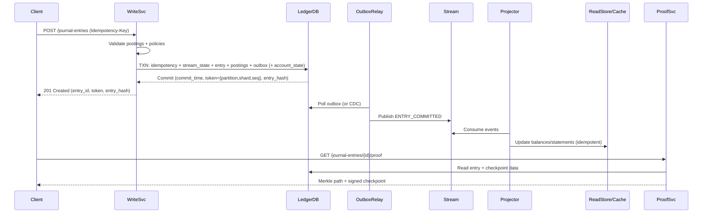

## Overview

A banking ledger is the system of record for money movement. The hard part isn’t “storing transactions”, but guaranteeing **correct accounting (double-entry)**, **immutability**, and **audit-grade integrity** under concurrency, failures, insider risk, and regulatory scrutiny—while still serving low-latency balance reads and high-throughput writes.

This design models the ledger as an **append-only journal** of **journal entries**. Each journal entry contains one or more **postings** (debit/credit lines) and must be balanced **per currency**. Everything else—balances, statements, limits, analytics—is derived from this immutable source via **projections**.

To make the ledger tamper-evident:
- Each ledger stream is append-only and ordered via a per-partition sequence.
- Entries are linked with a **hash chain** (per ordered stream).
- We periodically build **Merkle tree checkpoints** over entry hashes and **sign** checkpoint roots using KMS/HSM keys.
- Clients/auditors can verify an entry’s inclusion and detect modification/removal/reordering without trusting the database.

Key insight: separate (1) the immutable accounting journal (strong consistency + integrity) from (2) scalable read models (materialized views, caches), and synchronize them with a **transactional outbox** (or CDC) to avoid dual-write races.

## Requirements

### Functional Requirements
- Create an immutable, append-only **journal entry** containing one or more postings.
- Enforce **double-entry accounting**: total debits == total credits **per currency** for each journal entry.
- Support **idempotent writes** (safe retries; no duplicate financial effects).
- Retrieve journal entries and postings by ID, account, time range, and correlation/reference IDs.
- Provide fast **current balance** and **available balance** reads per account.
- Support **reversals/corrections** via compensating entries (no mutation of history).
- Provide **cryptographic proofs** of inclusion and tamper-evidence (hash chain + signed Merkle checkpoint).
- Stream committed ledger events to downstream consumers reliably (statements, risk, AML, warehouse).

### Non-Functional Requirements (Targets)
- **Scale**
  - Peak writes: 2,500 journal entries/sec (≈10,000 postings/sec)
  - Peak reads: 50,000 QPS (balances + recent statements)
  - Accounts: up to 50M; ledgers/tenants: up to 10k
  - Retention: 7–10 years online + archive
  - Data growth: order-of-magnitude **~5–10 TB/month** (row + index + replication dependent)
- **Latency** (single-region write quorum, multi-AZ)
  - Write commit: P50 40ms, P99 200ms
  - Balance read: P50 5ms (cache), P99 50ms (DB/read store)
  - Proof generation: P99 300ms (CPU + storage reads)
- **Availability**
  - Reads: 99.99%
  - Writes: 99.95% (quorum/consensus required)
- **Consistency**
  - **Strong** for journal writes, idempotency, and write-side enforcement (no negative available balance if required).
  - **Eventual** for derived read models and analytics, with a mechanism to achieve read-your-writes when needed.
- **Durability**
  - RPO ~ 0 for acknowledged writes (no acknowledged write loss).
  - Cryptographic evidence persists with the ledger.

### Constraints & Assumptions
- Regulated environment: immutable audit trail, least-privilege access, full traceability, key management, retention controls.
- Multi-tenant: tenant/ledger isolation (logical; optionally physical for large tenants).
- Network access may be restricted; external anchoring is optional.

## Architecture

```mermaid
flowchart TB
  subgraph Edge["Edge"]
    C[Clients]
    G[API Gateway / L7 LB]
    A[AuthN/AuthZ + Rate Limits]
    C --> G --> A
  end

  subgraph Core["Core Services"]
    W[Ledger Write Service]
    Q[Query / Balance Service]
    P[Proof Service]
    R[Outbox Relay]
    X[Projection Workers]
  end

  subgraph Data["Data Plane"]
    L[(Ledger DB\n(Strongly Consistent ACID))]
    O[(Outbox Table)]
    S[(Event Stream)]
    RS[(Read Store)]
    RC[(Redis / Cache)]
    K[(KMS/HSM)]
  end

  A --> W
  A --> Q
  A --> P

  W --> L
  W --> O

  O --> R --> S
  S --> X --> RS
  Q --> RC
  Q --> RS
  Q --> L

  P --> L
  P --> K
```

### Core Ideas
- **Ledger DB** is the source of truth: append-only journal + minimal write-side state required for enforcement (e.g., preventing negative available balance).
- **Read Store/Cache** serves high-QPS reads and supports rich query patterns (statements, search).
- **Outbox + Stream** provides reliable event propagation without dual-write bugs.
- **Proof Service** provides audit-grade verification artifacts (Merkle inclusion proofs + signed checkpoints).

## Component Deep-Dive

### Ledger Write Service
**Responsibilities**
- Validate journal entries and enforce invariants.
- Implement idempotency.
- Compute/store cryptographic linkage fields (hash chain inputs).
- Commit journal entries atomically with postings (and optionally small write-side state).

**Write-time invariants**
- Balanced postings per currency.
- Currency/account constraints (e.g., account currency matches posting currency, account status ACTIVE).
- Optional policy checks (e.g., “no negative available balance”).
- Canonical serialization for hashing (stable field ordering, explicit defaults).

**Idempotency model**
- Client supplies `Idempotency-Key` scoped to `(ledger_id)`.
- Server stores `(ledger_id, idempotency_key) -> entry_id, request_hash, response_payload`.
- On retry: if hashes match, return the original success response; else return a conflict.

**Scaling**
- Stateless horizontal scaling behind L7.
- Partition-aware routing by `ledger_id` (and optional `shard_id`) to reduce hot ranges and improve cache locality.
- Backpressure: return `503` with `Retry-After` when DB retries/latency exceed thresholds.

---

### Ledger Database (Immutable Journal + Write-Side State)
**Responsibilities**
- Store append-only journal entries and postings with strong consistency.
- Provide authoritative reads for audits and correctness fallbacks.
- Maintain minimal mutable state needed for enforcement (optional but common in payments systems).

**Technology choices**
- Preferred: strongly consistent distributed SQL (e.g., Spanner, CockroachDB, YugabyteDB).
- Alternative: single-region Aurora/Postgres with careful HA + read replicas (may cap write scale).

**Append-only enforcement**
- Application role has `INSERT` only on journal tables; no `UPDATE/DELETE`.
- Admin maintenance uses separate roles with break-glass controls and full audit logging.
- Integrity verifier jobs detect any mutation via cryptographic mismatches.

**Ordering & concurrency**
- Define an ordered stream per `(ledger_id, partition_id, shard_id)`:
  - `partition_id`: time bucket (e.g., UTC day).
  - `shard_id`: small integer (e.g., 0–15) chosen by `hash(entry_id)` to allow concurrent writes.
  - `seq`: strictly increasing sequence within that stream.
- Each stream has its own hash chain and checkpoints. This avoids a single global counter for hot ledgers while keeping a verifiable order.

---

### Integrity & Proof Service
**Responsibilities**
- Build signed checkpoints (Merkle roots) over committed entries.
- Generate inclusion proofs for a given `entry_id`.
- Provide verification guidance (what to hash, how to validate signatures, what constitutes tampering).

**Design**
- **Entry hash** covers canonical fields + postings’ hashes + ordering metadata (`partition_id`, `shard_id`, `seq`, `prev_entry_hash`).
- **Hash chain** links each entry to the previous entry in the same ordered stream.
- **Merkle checkpoint** built over `entry_hash` leaves in `seq` order for each `(ledger_id, partition_id, shard_id, window)`; checkpoint root is signed by KMS/HSM.
- Checkpoints are immutable and independently auditable (store in WORM/append-only storage as well as DB).

**Key management**
- Use per-environment keys; optionally per-tenant keys for strict isolation.
- Rotation: keep `signing_key_id` in checkpoint metadata; verify against historical keys.

---

### Projection Workers + Read Store + Cache
**Responsibilities**
- Consume ledger events and update derived views: balances, statements, search indexes, analytics.
- Provide high-QPS reads with predictable latency.

**Processing semantics**
- Exactly-once is hard across distributed systems; target **effectively-once**:
  - Idempotent updates keyed by `(ledger_id, entry_id)` or `(ledger_id, partition_id, shard_id, seq)`.
  - Track per-consumer progress via high-water marks.
  - Use dedupe tables when needed for side effects.

**Read-your-writes**
- Writer returns a `consistency_token` (e.g., `{partition_id, shard_id, seq}`).
- Query endpoints accept `min_token`; if projections/caches are behind, the service either:
  - waits briefly (bounded), or
  - falls back to the Ledger DB / write-side state for correctness.

## Data Model

### Schema (Conceptual)

**accounts** (mostly static)
- `account_id` (PK, UUID)
- `ledger_id`
- `currency` (ISO-4217)
- `status` (ACTIVE|FROZEN|CLOSED)
- `policy` (JSON: overdraft, limits)
- `created_at`

**journal_entries** (append-only)
- `entry_id` (PK, ULID/UUIDv7 recommended for locality)
- `ledger_id`
- `client_request_id` (idempotency key; unique per ledger)
- `effective_time` (business time / value date)
- `commit_time` (DB commit timestamp)
- `description`
- `metadata` (JSON)
- `partition_id` (e.g., `YYYYMMDD`)
- `shard_id` (small int)
- `seq` (monotonic within `(ledger_id, partition_id, shard_id)`)
- `prev_entry_hash` (bytes)
- `entry_hash` (bytes)

**postings** (append-only)
- `posting_id` (PK)
- `entry_id` (FK)
- `ledger_id`
- `account_id`
- `currency`
- `direction` (DEBIT|CREDIT)
- `amount_minor` (int64; minor units; never float)
- `instrument` (optional)
- `posting_hash` (bytes)

**idempotency_keys**
- `ledger_id`
- `client_request_id` (PK within ledger)
- `request_hash` (bytes)
- `entry_id`
- `response_payload` (JSON/Proto)
- `created_at`

**ledger_stream_state** (mutable control plane; one row per ordered stream)
- `ledger_id`, `partition_id`, `shard_id` (PK)
- `last_seq`
- `last_entry_hash`
- `updated_at`

**account_state** (optional write-side state; mutable)
- `ledger_id`, `account_id` (PK)
- `currency`
- `posted_balance_minor`
- `available_balance_minor`
- `last_applied_token` (or `last_seq` per stream, if single-stream-per-account)
- `updated_at`

**holds** (optional; for “available balance” semantics)
- `hold_id` (PK)
- `ledger_id`
- `account_id`
- `currency`
- `amount_minor`
- `status` (ACTIVE|RELEASED|CAPTURED|EXPIRED)
- `created_at`, `updated_at`
- `reference_id` (e.g., auth id)

**ledger_checkpoints** (append-only)
- `ledger_id`
- `partition_id`
- `shard_id`
- `window_start`, `window_end`
- `entry_seq_start`, `entry_seq_end`
- `merkle_root` (bytes)
- `root_signature` (bytes)
- `signing_key_id` (string)
- `created_at`

**outbox** (mutable)
- `event_id` (PK)
- `ledger_id`
- `entry_id`
- `type` (ENTRY_COMMITTED)
- `payload` (JSON/Proto)
- `created_at`
- `published_at` (nullable)

**read model – account_positions** (derived; mutable; can differ from `account_state`)
- `ledger_id`, `account_id` (PK)
- `currency`
- `posted_balance_minor`
- `available_balance_minor`
- `last_applied_token`
- `updated_at`

### Constraints & Guardrails
- `amount_minor > 0`
- `direction IN (DEBIT, CREDIT)`
- `(ledger_id, client_request_id)` unique (idempotency)
- `postings.ledger_id == journal_entries.ledger_id` (enforced via FK + composite keys)
- Prevent cross-ledger postings (composite FKs to `accounts(ledger_id, account_id)`)

### Write Transaction (Atomic)
A single DB transaction typically performs:
1. Validate idempotency key (insert into `idempotency_keys` if new).
2. Allocate `(partition_id, shard_id, seq)` by updating `ledger_stream_state` row.
3. Compute `entry_hash` using canonical data + `prev_entry_hash`.
4. Insert into `journal_entries` and `postings`.
5. Optionally update `account_state` to enforce constraints (e.g., prevent negative available balance).
6. Insert into `outbox`.

This keeps correctness checks strongly consistent without relying on eventually consistent projections.

## Data Flow



## API Design

### Create Journal Entry
`POST /v1/ledgers/{ledger_id}/journal-entries`

Headers:
- `Idempotency-Key: <uuid>` (required; unique per `ledger_id`)
- `X-Request-Signature: <optional>` (client-signed request; optional)

Request:
```json
{
  "effective_time": "2025-12-17T10:00:00Z",
  "description": "Transfer",
  "postings": [
    {"account_id": "A", "currency": "USD", "direction": "DEBIT", "amount_minor": 1000},
    {"account_id": "B", "currency": "USD", "direction": "CREDIT", "amount_minor": 1000}
  ],
  "metadata": {"correlation_id": "abc-123"}
}
```

Response `201`:
```json
{
  "entry_id": "01J…",
  "ledger_id": "…",
  "commit_time": "2025-12-17T10:00:01.123Z",
  "consistency_token": {"partition_id": "20251217", "shard_id": 3, "seq": 981273},
  "entry_hash": "base64…"
}
```

Errors:
- `400 INVALID_ENTRY` (unbalanced, invalid currency, negative/overflow amount, closed account)
- `409 IDEMPOTENCY_CONFLICT` (same key, different request hash)
- `422 POLICY_VIOLATION` (e.g., insufficient available balance)
- `429 RATE_LIMITED`
- `503 DB_UNAVAILABLE` (retryable; return `Retry-After`)

Idempotency behavior:
- If the same `Idempotency-Key` is retried with the same payload hash: return the original `201` payload.
- If the key is reused with a different payload hash: return `409`.

---

### Get Journal Entry
`GET /v1/ledgers/{ledger_id}/journal-entries/{entry_id}`

Returns:
- Entry fields, postings, ordering fields (`partition_id`, `shard_id`, `seq`), and cryptographic fields (`prev_entry_hash`, `entry_hash`).

---

### List Journal Entries (by account / time range)
`GET /v1/ledgers/{ledger_id}/accounts/{account_id}/journal-entries?from=...&to=...&limit=...&cursor=...`

Notes:
- Paginate by `(commit_time, entry_id)` (stable ordering) or by `(partition_id, shard_id, seq)` if you need strict stream order.
- Prefer a read store for interactive queries; fall back to Ledger DB for audits/backfills.

---

### Get Account Balance
`GET /v1/ledgers/{ledger_id}/accounts/{account_id}/balance?as_of=...&min_token=...`

Behavior:
- If `as_of` omitted: return current balance from cache/read model fast path.
- If `min_token` provided and the projection is behind: wait briefly or fallback to Ledger DB / `account_state`.
- If `as_of` provided: serve via time-partitioned projections (preferred) or ledger scan (audit-only; slower).

---

### Get Cryptographic Proof
`GET /v1/ledgers/{ledger_id}/journal-entries/{entry_id}/proof`

Response:
```json
{
  "entry_hash": "base64…",
  "stream": {"partition_id": "20251217", "shard_id": 3, "seq": 981273},
  "merkle_root": "base64…",
  "merkle_path": ["base64…", "base64…"],
  "checkpoint": {
    "window_start": "2025-12-17T10:00:00Z",
    "window_end": "2025-12-17T11:00:00Z",
    "root_signature": "base64…",
    "signing_key_id": "kms://…"
  }
}
```

Verification steps (client/auditor):
1. Recompute `posting_hash` and `entry_hash` from canonical fields.
2. Verify hash-chain link: `entry.prev_entry_hash` matches the prior entry in the same stream (or verify chain segments from checkpoints).
3. Verify Merkle inclusion: `entry_hash` + `merkle_path` => `merkle_root`.
4. Verify `root_signature` against `signing_key_id`.

## Scaling & Performance

### Capacity Notes
- At 10,000 postings/sec sustained, monthly volume can reach tens of billions of rows; plan for:
  - aggressive partitioning (by time + ledger),
  - indexing discipline (avoid wide secondary indexes on hot tables),
  - tiered storage/archival (cold partitions to cheaper storage),
  - periodic compaction and verification jobs.

### Bottlenecks & Mitigations
- **Hot ledger / hot stream**
  - Problem: contention on `ledger_stream_state` and stream ordering.
  - Mitigation: shard streams (`shard_id`), keep shard count configurable per tenant, and isolate very large tenants to dedicated clusters.
- **High-QPS balance reads**
  - Mitigation: cache `(ledger_id, account_id)` balances with versioning via `last_applied_token`; short TTL as a safety net.
- **Large statement scans**
  - Mitigation: statement projections (e.g., per-account daily tables), pagination, and pre-aggregations.
- **Distributed SQL transaction retries**
  - Mitigation: keep transactions small (entry + postings + minimal state), avoid cross-ledger transactions, and use partition-aware routing.

### Horizontal Scaling
- **API layer / services**: stateless autoscaling.
- **Ledger DB**: partition/range by `(ledger_id, partition_id)`; time-based partitions; isolate large tenants.
- **Stream + projectors**: partition by `(ledger_id, partition_id, shard_id)`; scale consumers by partition count.
- **Proof service**: cache recent proofs and checkpoints; parallelize checkpoint building across shards and windows.

### Caching Strategy
- Cache:
  - Current balances and account status (versioned by `last_applied_token`).
  - Recent journal entry lookups (short TTL).
- Invalidation:
  - On projection update, publish `BALANCE_UPDATED(ledger_id, account_id, last_applied_token)` for targeted cache refresh.
- Correctness:
  - Use `min_token` on reads that must be read-your-writes (e.g., immediately after posting).

## Trade-offs & Alternatives

### Trade-offs Made
- **Strongly consistent DB for journal writes**
  - Pros: simple invariant enforcement, atomic multi-row writes, straightforward audits.
  - Cons: higher cost and operational complexity than eventually consistent stores; multi-region writes can increase latency.
- **Sharded ordered streams (partition+shard) vs single global sequence**
  - Pros: avoids global contention; scales hot tenants; still provides verifiable per-stream ordering.
  - Cons: no single total order across all entries unless you add an additional sequencing layer.
- **Write-side state (`account_state`) for policy enforcement**
  - Pros: prevents negative available balance with strong correctness; avoids “read model lag” affecting authorization.
  - Cons: introduces mutable state to operate and reconcile (must be rebuildable/verified against the journal).

### Alternative Approaches
- **Managed verifiable ledgers (AWS QLDB / Azure Confidential Ledger)**
  - Pros: built-in verification primitives, reduced custom crypto work.
  - Cons: vendor constraints, query limitations, integration complexity for projections, portability concerns.
- **Kafka/event log as the source of truth**
  - Pros: extremely high throughput; simple append-only semantics.
  - Cons: enforcing strict accounting invariants and idempotency under failures is harder without a transactional store.
- **Single Postgres + logical replication**
  - Pros: simplest stack; strong constraints; excellent SQL ergonomics.
  - Cons: vertical write scaling limits; multi-region HA and write quorum semantics are harder.

## Failure Modes & Mitigations

### Scenarios
- **Client retries after timeout (duplicate submission)**
  - Impact: double posting (catastrophic).
  - Mitigation: idempotency keys with request-hash binding; unique constraint; return original response on match.
- **DB commit succeeds, event publish fails (dual-write race)**
  - Impact: projections lag; balances stale.
  - Mitigation: transactional outbox + retrying relay; idempotent consumers; lag-based fallback using `min_token`.
- **Projection bug produces wrong balances**
  - Impact: incorrect UI/decisions; journal remains correct.
  - Mitigation: reconciliation jobs (projection vs recompute), versioned projectors, rebuild from journal, canary rollouts.
- **Insider modifies ledger rows**
  - Impact: silent corruption without verification.
  - Mitigation: append-only permissions, WORM backups, continuous integrity verification, signed checkpoints, separation of duties, audited break-glass.
- **KMS/HSM outage prevents checkpoint signing**
  - Impact: proof freshness degrades; ledger writes can still proceed.
  - Mitigation: decouple checkpointing from writes; alert on checkpoint lag; buffer unsigned checkpoints and sign when KMS recovers; support key failover where allowed.
- **Distributed DB range/leader outage**
  - Impact: elevated latency or write unavailability for impacted ranges.
  - Mitigation: multi-AZ quorum, automatic failover, client retries with jitter, overload protection and admission control.

### Disaster Recovery
- **RTO/RPO targets**: RTO 30–60 minutes; RPO ~ 0 for acknowledged writes.
- **Backups**: continuous PITR + daily full; immutable/WORM storage; regular restore drills.
- **Failover**: multi-AZ within region; optional warm standby cross-region with async replication; promote with runbook and checkpoint reconciliation.
- **Integrity after restore**: rerun verifier over restored partitions; validate checkpoint signatures and Merkle roots.

## Operations

### SLOs & Alerting
- SLOs
  - `write_commit_latency_p99 <= 200ms` (single-region quorum)
  - `balance_read_latency_p99 <= 50ms` (cache/read store)
  - `outbox_to_projection_lag_p99 <= 5s` (tenant-dependent)
  - `checkpoint_freshness <= 1h` (or tighter per compliance)
- Key metrics
  - Write path: `commit_latency`, `txn_retries`, `write_error_rate`, `idempotency_conflicts`, `policy_violation_rate`
  - Stream/projection: `outbox_lag`, `consumer_lag`, `apply_latency`, `dedupe_hit_rate`, `reconciliation_mismatch_count`
  - Integrity: `checkpoint_job_success`, `checkpoint_lag`, `merkle_proof_failures`, `hash_chain_gap_detected`
- Paging alerts
  - Any integrity mismatch
  - Sustained DB error spikes or extreme retry rates
  - Checkpoint lag beyond threshold for regulated tenants

### Deployment & Migration
- Backward-compatible changes first (additive schema; tolerant readers).
- Writer and projector changes coordinated behind feature flags.
- Rollback strategy
  - Writer: safe if API compatibility preserved and idempotency semantics unchanged.
  - Projector: roll back by redeploy + rebuild from journal; keep projector versions isolated by consumer group when needed.

### Compliance & Security
- Encrypt in transit and at rest; strict IAM boundaries by tenant.
- Database access via short-lived credentials; full audit logs on admin actions.
- Separate duties: ops cannot sign checkpoints; key access is tightly controlled.
- Data retention: partition lifecycle policies (hot → warm → archive), legal holds, and deletion policies where permitted by regulation.

## References & Further Reading
- AWS QLDB: https://docs.aws.amazon.com/qldb/
- Certificate Transparency (Merkle trees, append-only logs): https://certificate.transparency.dev/
- Transactional Outbox pattern: https://microservices.io/patterns/data/transactional-outbox.html
- Google Spanner TrueTime & consistency: https://research.google/pubs/pub39966/
- CockroachDB serializable transactions: https://www.cockroachlabs.com/docs/stable/transaction-isolation.html
- Double-entry bookkeeping: https://en.wikipedia.org/wiki/Double-entry_bookkeeping