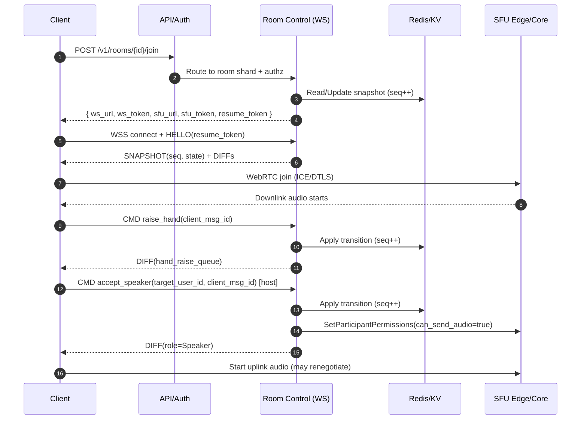

## Overview

Live audio rooms (Clubhouse / Twitter Spaces) combine two distinct problem domains:

1. **Media plane**: ultra-low-latency, loss-tolerant audio transport at massive fan-out (NAT traversal, jitter, packet loss, congestion control, regional routing).
2. **Control plane**: strongly ordered, real-time “room state” (roles, hand-raises, mutes, kicks, locks) with deterministic moderation outcomes under concurrency.

The core design is to **split the system into two planes**:

- **Control plane (authoritative)**: owns room state, moderation decisions, sequencing, and client state synchronization.
- **Media plane (performance-critical)**: delivers audio using **WebRTC + SFU** (Selective Forwarding Unit) for interactive speakers, and optionally **server-side mixing / broadcast track** for large listener audiences to reduce bandwidth and client complexity.

This document describes a production-ready architecture with concrete scale/latency targets, operational guardrails, failure handling, and interview-relevant trade-offs.

---

## Requirements

### Functional Requirements

- Create/schedule rooms; start/end rooms; visibility (public / followers / invite-only).
- Join as listener; request to speak (“raise hand”); invite/promote/demote speakers.
- Host/co-host moderation:
  - mute/unmute speakers (client-initiated and server-enforced),
  - remove users,
  - lock room, restrict speaking, approve/deny requests,
  - ban/block with audit trail.
- Real-time room state:
  - roles (host/co-host/speaker/listener),
  - hand-raise queue ordering,
  - speaking indicators / audio levels,
  - participant counts and (optionally) participant lists.
- Low-latency audio:
  - speaker uplink to SFU,
  - listener downlink from edge SFU (or broadcast mix).
- Abuse controls:
  - rate limits, spam prevention, ban evasion friction (device/account signals),
  - reporting and moderation tooling.
- Optional but common:
  - recording + replay, captions/transcription, analytics.

### Non-Functional Requirements (Targets)

#### Scale (Example Sizing)

- Users: **10M MAU**, **1M DAU**
- Peak concurrency:
  - **200K concurrent listeners**
  - **20K concurrent rooms**
  - typical room: 2–5 speakers, 50–2K listeners
  - peak “mega room”: **20 speakers**, **100K listeners**
- Control plane:
  - **50K QPS** (joins/leaves/commands at peak)
  - **200K WS messages/sec bursts** (state diffs, acks, presence)
- Media plane:
  - Opus mono 24–48 kbps payload (variable bitrate) per downlink
  - Upstream per speaker: ~24–48 kbps payload
  - **Bandwidth reality check** (mega room, broadcast mix):
    - 100K listeners × 32 kbps ≈ **3.2 Gbps payload**
    - add RTP/SRTP/UDP/IP overhead + redundancy + retransmits → often **1.3–2.0×**
    - plan **5–7 Gbps egress** from the serving edge cluster for a single mega room (spread across many SFUs/PoPs)

#### Latency

- Join → first audio:
  - **P50 800 ms**, **P99 2.5 s**
- Speaker → listener audio (same region / nearby edge):
  - **P50 150–200 ms**, **P99 400–600 ms**
- Control events (mute/kick/role change delivered to clients):
  - **P50 80 ms**, **P99 250 ms**
- Note: global cross-region conversations will be higher. The design therefore **pins a live room to a primary region** and uses edge SFUs for downlink close to listeners.

#### Availability

- Control plane: **99.99% monthly** (SLO)
- Media plane: **99.95% monthly** (SLO)
- Recording/replay (if enabled): **99.9%** acceptable separately from live session availability.

#### Consistency

- **Strong ordering per room** for role/moderation transitions.
- **At-least-once delivery** of events with **idempotency** and **sequencing**.
- **Eventual consistency** for discovery, counts, analytics, trending feeds.

#### Durability / Recovery

- Room metadata & moderation audit:
  - **RPO ≤ 1 minute**, **RTO ≤ 15 minutes**
- Live audio:
  - ephemeral (no durability) unless recording enabled
- Recording assets:
  - durable object storage with lifecycle/retention policies.

### Constraints & Assumptions

- Team: 8–12 engineers, multi-region cloud deployment.
- Mobile-first clients; must tolerate cellular networks and frequent reconnects.
- GDPR/CCPA compliance; recording requires consent + retention controls.
- Network access to install packages is restricted in this environment; vendor choices are illustrative.

---

## Architecture

### High-Level Design

- Clients use:
  - **REST** for discovery and lifecycle endpoints (create/join/leave, feeds).
  - **WebSocket** for real-time room state and commands (raise hand, mute, role changes).
  - **WebRTC** (ICE/DTLS/SRTP) for audio transport to SFU edges.
- The **Room Control** service is authoritative per room and serializes state transitions (single-writer per room).
- The **SFU plane** handles real-time audio forwarding and fan-out, optionally producing a **broadcast mix** for large listener audiences.
- The **event log** (Kafka/Pulsar) provides auditability and enables rebuilding state after failover.

### Architecture Diagram

```mermaid
graph TD
  %% Clients
  C[Clients<br/>iOS / Android / Web] -->|HTTPS| EDGE[Edge LB / CDN / WAF]
  C -->|WSS| EDGE
  C -->|WebRTC ICE/DTLS/SRTP| SFU_EDGE[SFU Edge (PoPs)]

  %% Control Plane
  EDGE --> API[API Gateway]
  API --> AUTH[Auth / Token Service]
  API --> DISC[Discovery / Feeds]
  API --> ROOMJOIN[Join Service]

  ROOMJOIN --> ROOMCTRL[Room Control (WS + State Machine)]
  ROOMCTRL --> REDIS[(Redis / Key-Value<br/>Room Snapshots)]
  ROOMCTRL --> PG[(PostgreSQL<br/>Metadata)]
  ROOMCTRL --> BUS[(Event Bus<br/>Kafka/Pulsar)]

  %% Media Plane
  ROOMCTRL -->|control gRPC| SFU_CORE[Core SFU (Room Anchor)]
  SFU_CORE <--> MIX[Optional Mixer<br/>(Broadcast Track)]
  SFU_CORE -->|cascade| SFU_EDGE
  SFU_EDGE -->|downlink| C

  %% Optional Recording/Analytics
  SFU_CORE --> REC[Recording Ingest (Optional)]
  REC --> OBJ[(Object Store)]
  BUS --> ANALYTICS[Stream Processing / OLAP]
  ANALYTICS --> DISC
```

### Media Topology (Cascaded SFU)

- **Core SFU** (room anchor): receives speaker uplinks; can be colocated with mixer/recording.
- **Edge SFUs**: replicate a small number of tracks (e.g., 1 broadcast mix + optional speaker tracks) near listeners to minimize RTT and egress concentration.
- Room pinning: a room is anchored to a region; edges can exist globally for downlink.

---

## Key Workflows

### 1) Join Room (Listener)

1. Client calls `POST /v1/rooms/{room_id}/join`.
2. Control plane returns:
   - `ws_url`, `ws_token`, `resume_token`
   - best `sfu_edge` endpoint and `sfu_token` (room-scoped, short-lived)
3. Client connects WS, receives initial snapshot (`seq`) and incremental diffs.
4. Client establishes WebRTC to SFU edge; receives broadcast track (and optionally additional tracks).

### 2) Raise Hand → Become Speaker

- Client sends WS command `raise_hand`.
- Host accepts with `accept_speaker`.
- Room Control updates state machine, emits ordered event, and calls SFU permissions API to allow uplink.
- Client transitions WebRTC to send audio (may require renegotiation depending on SFU).

### 3) Moderation (Mute / Kick)

- Moderator action is applied by Room Control (authoritative).
- Control plane:
  - broadcasts state update to clients,
  - enforces on media plane via SFU permissions (server-enforced mute/kick).

---

## Components

### Edge (LB / CDN / WAF)

**Responsibilities**
- TLS termination, DDoS/WAF protections, routing to nearest region/PoP.
- Separate routing policies for:
  - REST traffic (API),
  - WebSocket upgrades (sticky where needed),
  - SFU endpoints (WebRTC).

**Notes**
- WebRTC often benefits from proximity; SFU edges should be close to users.
- WebSocket connections are long-lived; plan capacity by concurrent connections, not just QPS.

---

### API Gateway + Auth / Token Service

**Responsibilities**
- AuthN/AuthZ, request validation, rate limiting, issuing scoped tokens.
- Mint different tokens for:
  - **WS control plane** (`ws_token`)
  - **WebRTC media plane** (`sfu_token`) with room + role + expiry + permissions claims

**Key Decisions**
- Short-lived tokens (e.g., 5–15 minutes) + refresh via REST/WS.
- Room-scoped media tokens reduce blast radius if leaked.

---

### Room Control (Authoritative Room State + WebSocket)

**Responsibilities**
- Own the room state machine:
  - membership, roles, hand-raise queue, locks, server-enforced mutes, bans
- Serialize all transitions per room (total order).
- Broadcast state updates to clients (diffs) with strict sequencing.
- Orchestrate SFU permissions and room assignment.

**Correctness Model**
- **Single-writer per room** achieved via shard ownership + leases:
  - consistent hash `room_id` → shard
  - leader election / lease mechanism (etcd/Consul/ZooKeeper)
- All commands are processed as:
  - validate authorization + current state
  - apply transition
  - increment `seq`
  - persist snapshot + emit event
  - broadcast diff

**WebSocket Scaling**
- In large rooms, avoid sending full participant lists:
  - send counts + small “stage roster” (hosts/speakers + last N recent speakers)
  - lazy-load full roster via paginated REST if needed

**Backpressure / Load Shedding**
- Coalesce noisy updates (e.g., speaking indicators) into ticks (e.g., 100 ms).
- If overloaded: degrade presence fidelity (counts only), slow tick rate, disable non-critical events.

---

### State Storage (Redis / Key-Value)

**Responsibilities**
- Fast snapshots to support:
  - reconnect/resume,
  - shard failover,
  - join burst handling.

**Design**
- `room:{room_id}:snapshot` (serialized state + `seq`)
- `room:{room_id}:dedupe` (recent `client_msg_id` set with TTL)
- TTL-based cleanup for ended rooms.

**Important**
- Redis is an accelerator, not the sole source of truth for audit. Moderation actions must also be written to an immutable log / DB.

---

### Metadata Store (PostgreSQL)

**Responsibilities**
- Room/user metadata, scheduling, visibility, bans, durable audit references.
- Discovery queries (with caching and/or derived feeds).

**Notes**
- Reads for discovery often dominate. Use read replicas or precomputed feeds.

---

### Event Bus (Kafka / Pulsar)

**Responsibilities**
- Immutable ordered event stream per room (partition key = `room_id`):
  - supports audit, analytics, replay/rebuild after failover
- At-least-once delivery; consumers must be idempotent.

**Why it matters**
- Separates the authoritative state machine from downstream systems (feeds, moderation review, analytics) and prevents tight coupling.

---

### SFU Edge (WebRTC Media Plane)

**Responsibilities**
- ICE/DTLS/SRTP termination.
- Forwarding RTP from speakers to listeners (or broadcast track).
- Congestion control support (GCC/transport-cc) and packet loss handling (NACK/PLI where applicable).
- Room routing / cascading.

**Key Decisions**
- **SFU (not mesh)**: avoids O(N²) uplink and CPU explosion on clients.
- **Cascaded SFU** for mega rooms:
  - reduces long-haul egress,
  - keeps latency reasonable by pushing downlink near users.

**TURN**
- Operate TURN (coturn) for restrictive NATs; capacity plan for worst-case relay usage.

---

### Mixer (Optional: Broadcast Track)

**Responsibilities**
- Combine multiple speaker tracks into a single mixed track for listeners.
- Apply level normalization, limiter/ducking, and optionally noise suppression.
- Emit audio-level metadata for UI (who is speaking).

**When to use**
- Particularly valuable when listener scale is huge:
  - reduces number of tracks replicated across cascaded SFUs,
  - simplifies client playback and saves bandwidth.

**Latency**
- Mixing adds buffering; keep it small (e.g., 10–20 ms frame-based) to stay within target.

---

### Recording + Replay (Optional)

**Approach**
- Record at the room anchor (core SFU/mixer) to avoid client-side capture.
- Store segments (e.g., 2–6 seconds) and a manifest in object storage.

**Consent / Compliance**
- Explicit consent surfaces in UX; immutable audit log of consent changes.
- Region-aware storage and retention policies (GDPR/CCPA).

---

## Data Model

### PostgreSQL (Metadata)

- `users(user_id, handle, created_at, status, region_home, ...)`
- `rooms(room_id, creator_id, title, description, visibility, status, region, created_at, scheduled_at, started_at, ended_at, recording_enabled, ...)`
- `room_participants(room_id, user_id, role, joined_at, left_at, last_seen_at, UNIQUE(room_id, user_id))`
- `room_bans(room_id, user_id, banned_until, reason, created_at, actor_id)`
- `moderation_actions(action_id, room_id, actor_id, target_id, action_type, reason, created_at, idempotency_key, seq)`
- `room_recordings(room_id, status, consent_version, created_at, ended_at, object_manifest_key)`

### Redis / KV (Hot State)

- `room:{room_id}:snapshot` → `{ seq, state }` (TTL; updated each transition or periodically)
- `room:{room_id}:dedupe:{user_id}` → recent `client_msg_id` set (TTL ~10 minutes)
- `room:{room_id}:presence_counts` → cached counts by role (approx)

### Event Bus (Ordered per room)

Topic/stream `room-events` partitioned by `room_id`, events include:

- `ROOM_CREATED`, `ROOM_STARTED`, `ROOM_ENDED`
- `USER_JOINED`, `USER_LEFT`
- `HAND_RAISED`, `HAND_CLEARED`
- `ROLE_CHANGED`
- `MUTE_ENFORCED`, `KICKED`, `BANNED`
- `RECORDING_STARTED`, `RECORDING_STOPPED`

Each event includes:
- `room_id`, `seq`, `ts`, `actor_id`, `target_id` (if relevant), `payload`, `idempotency_key`.

---

## Data Flow Diagrams

### Join + Promote to Speaker



---

## API Design

### REST (Discovery + Lifecycle)

- `POST /v1/rooms`
  - Req: `{ "title": "...", "visibility": "public|followers|invite", "recording_enabled": false, "scheduled_at": null }`
  - Resp: `{ "room_id": "r_123", "region": "us-east-1" }`

- `POST /v1/rooms/{room_id}/join`
  - Headers: `Idempotency-Key: <uuid>`
  - Resp:
    ```json
    {
      "ws_url": "wss://.../rooms/r_123",
      "ws_token": "...",
      "sfu_url": "wss://sfu-edge.../r_123",
      "sfu_token": "...",
      "resume_token": "...",
      "server_time_ms": 1730000000000
    }
    ```

- `POST /v1/rooms/{room_id}/leave`
- `GET /v1/rooms?feed=trending|following&cursor=...`
- `GET /v1/rooms/{room_id}`

**Error Semantics**
- `401/403`: auth/role violations
- `404`: room not found
- `409`: invalid state transition (includes current `seq` for resync)
- `429`: rate limited (with `Retry-After`)
- `503`: overloaded (client should retry with exponential backoff + jitter)

### WebSocket (Room State + Commands)

**Protocol Properties**
- Server assigns authoritative ordering via `seq`.
- Client commands are idempotent via `(room_id, user_id, client_msg_id)`.
- Client must handle:
  - missed diffs,
  - out-of-order delivery (rare but possible on reconnect),
  - resync requests.

**Client → Server**
```json
{ "type": "raise_hand", "room_id": "r_123", "client_msg_id": "c_1" }
```
```json
{ "type": "accept_speaker", "room_id": "r_123", "target_user_id": "u_9", "client_msg_id": "c_2" }
```
```json
{ "type": "mute", "room_id": "r_123", "target_user_id": "u_9", "client_msg_id": "c_3" }
```

**Server → Client**
```json
{ "type": "snapshot", "room_id": "r_123", "seq": 1020, "state": { "...": "..." } }
```
```json
{ "type": "state_diff", "room_id": "r_123", "seq": 1021, "diff": { "...": "..." } }
```
```json
{ "type": "command_ack", "client_msg_id": "c_3", "seq": 1022 }
```
```json
{ "type": "error", "client_msg_id": "c_2", "code": "ROLE_DENIED", "message": "Only hosts can accept speakers" }
```
```json
{ "type": "sfu_update", "action": "ICE_RESTART", "sfu_url": "...", "token": "..." }
```

**Resync**
- If client sees a gap in `seq`, it requests:
  - `{"type":"resync_request","room_id":"r_123","last_seq":1010}`
- Server responds with:
  - a compact diff replay window, or a full `snapshot`.

### Internal SFU Control API (gRPC)

- `SetParticipantPermissions(room_id, user_id, can_send_audio, can_receive_audio)`
- `MoveListenerToEdge(room_id, user_id, edge_sfu_id)`
- `StartMixer(room_id)` / `StopMixer(room_id)`
- `TerminateParticipant(room_id, user_id, reason)` (server-enforced kick)

---

## Scaling & Performance

### Control Plane Hotspots

**WebSocket fan-out**
- Mega rooms can produce high update rates (speaking indicators, joins/leaves).
- Techniques:
  - send **diffs**, not full state
  - **coalesce** speaking indicators (e.g., 100 ms tick)
  - limit roster updates; send counts + stage roster
  - compress WS frames (careful with CPU) or use compact binary encoding if needed

**Shard hotspots (celebrity rooms)**
- Single-writer per room is correct but can concentrate load.
- Keep the room controller lightweight:
  - avoid heavy DB work in the hot path
  - push media complexity to SFU/mixer
  - isolate mega rooms onto dedicated instances via scheduling overrides

### Media Plane Bottlenecks

**Egress bandwidth**
- This is usually the dominant cost.
- Mitigations:
  - cascaded SFUs
  - broadcast mix track for listeners
  - regional edges close to listeners
  - optional “overflow mode”: degrade listeners to a slightly higher latency broadcast pipeline (e.g., LL-HLS) only when necessary (explicit product trade-off)

**TURN relay cost**
- Relay traffic can spike in restrictive networks.
- Mitigations:
  - prioritize direct ICE candidates
  - deploy TURN close to users
  - monitor relay rate and allocate budget

### Capacity Planning (Rules of Thumb)

- SFU sizing is usually constrained by **network** before CPU for audio-only, but encryption/DTLS and per-connection overhead still matter.
- Plan per SFU node capacity by:
  - max concurrent connections (file descriptors, memory)
  - max egress Gbps
  - RTCP/NACK overhead
- Keep headroom (e.g., 30–40%) for bursts and failover.

---

## Trade-offs & Alternatives

### Trade-offs (Chosen Design)

1. **Single-writer room state (ordered state machine)**
   - Pros: deterministic moderation, simple mental model, linearizable per-room decisions
   - Cons: shard failover complexity; hot-room pressure on one controller instance
   - Why: correctness for moderation is non-negotiable in real-time social audio

2. **WebRTC + SFU for real-time**
   - Pros: sub-500 ms achievable; built-in congestion control; works on mobile/web
   - Cons: operational complexity (ICE/TURN), more moving parts than HTTP streaming
   - Why: conversational feel requires near-interactive latency and resilience to loss

3. **Broadcast mix (server-side mixing) for large audiences**
   - Pros: reduces track replication and bandwidth; simpler clients; scales to mega rooms
   - Cons: less flexibility (per-user mixes); mixer complexity; potential added latency
   - Why: listener fan-out dominates; mixing is an effective cost/scale lever

4. **Room pinned to a region (with edge downlink)**
   - Pros: predictable latency and simpler ordering; avoids multi-region consensus per room
   - Cons: speakers far from region may have higher latency
   - Why: avoids hard distributed consistency problems while still leveraging global edges

### Alternative Approaches

- **LL-HLS / CMAF chunked for listeners**
  - Pros: CDN-scale fan-out, often cheaper per GB at extreme scale
  - Cons: 1–3s latency typical; weaker interactivity; separate pipeline from speakers
  - Good fit: “broadcast-first” products or overflow mode

- **MCU (full server mixing per participant)**
  - Pros: simplest client; consistent output
  - Cons: CPU-heavy at scale; less flexible for multi-region fan-out
  - Good fit: smaller-scale rooms or when client simplicity dominates

- **CRDT-based distributed room state**
  - Pros: higher availability during partitions
  - Cons: moderation semantics (kicks/mutes/ordering) become ambiguous; hard to explain/debug
  - Good fit: collaborative apps where conflicts are acceptable; not ideal for moderation-heavy rooms

---

## Failure Modes & Resilience

### Failure Scenarios (Minimum Set)

1. **Room Control instance crashes (owner shard loss)**
   - Impact: WS disconnect; commands temporarily unavailable
   - Detection: lease expiration, WS disconnect spike
   - Mitigation:
     - re-acquire shard lease on another instance
     - rebuild from Redis snapshot + recent bus events
     - clients reconnect with `resume_token` and resync via `seq`

2. **SFU node failure mid-room**
   - Impact: audio drop for participants on that SFU edge
   - Detection: SFU heartbeat loss; RTCP timeouts; ICE failures
   - Mitigation:
     - instruct clients to ICE-restart to a backup edge
     - keep warm capacity; drain nodes before deploys
     - for mega rooms: multiple edges active; only a subset impacted

3. **Redis/KV degradation**
   - Impact: joins/resync slow; controller failover takes longer
   - Detection: Redis latency/error SLO breach
   - Mitigation:
     - controller maintains in-memory authoritative state while healthy
     - circuit breakers; reduced snapshot frequency
     - degrade to full snapshot from controller memory on reconnect
     - Redis cluster failover / read-only mode if needed

4. **Event bus lag / partition unavailability**
   - Impact: audit/analytics delayed; failover rebuild may be slower
   - Detection: consumer lag alerts; produce errors
   - Mitigation:
     - control plane remains authoritative without waiting for consumers
     - buffer events locally with backpressure limits
     - fall back to DB audit writes for critical actions if bus unavailable (explicit bounded mode)

5. **Malicious participant spams noise / abuse**
   - Impact: poor UX; churn; trust/safety incident
   - Detection: reports, anomaly detection (audio levels), rapid join/leave patterns
   - Mitigation:
     - server-enforced mute (SFU permissions) and instant kick
     - rate limits on hand raises / joins
     - device/account risk scoring; temporary locks; escalation tooling
     - audit log for appeals and investigations

### Disaster Recovery

- Control plane: **RTO 15 minutes**, **RPO 1 minute**
- Media sessions: not guaranteed to survive region loss (rooms end; hosts can restart)
- Backups:
  - Postgres PITR + daily snapshots
  - cross-region replication for audit/event topics (where feasible)
  - object store versioning + lifecycle for recordings

---

## Operations

### SLOs and SLIs

- **Join success rate** (SLI): successful join and audio start within 3s
- **Join latency** (SLI): time from `join` response to first audio frame
- **Control command latency** (SLI): WS command → state_diff delivered
- **ICE success rate** (SLI): % sessions establishing media without TURN relay; track relay rate separately
- **Audio quality** (SLIs): RTT, jitter, packet loss, concealment time

### Monitoring & Alerting (Examples)

**Control plane**
- WS concurrent connections, connect success rate, reconnect loops
- Command P95/P99, invalid transition rates, dedupe hit rate
- Shard ownership churn, hot room detection
- Redis latency/errors, Postgres saturation, event bus produce errors

**Media plane**
- SFU CPU/memory, egress Gbps, per-room fan-out
- ICE failures, TURN relay percentage, DTLS handshake errors
- Packet loss P95, jitter P95, audio concealment P95
- Mixer CPU and queue depth (if used)

### Deployment Strategy

- Control plane: progressive delivery per region (1% → 10% → 50% → 100%), backward-compatible WS protocol
- SFU plane: capacity draining
  - stop assigning new rooms to a node
  - wait for active rooms to end (or migrate listeners if supported)
  - roll and validate health before reintroducing
- Feature flags for:
  - mixing enablement thresholds,
  - new moderation actions,
  - overflow/degraded modes.

### Runbooks (What Oncall Needs)

- “High join failures”: check auth, room control health, Redis latency, SFU capacity, TURN health.
- “Mega room overload”: isolate room, enable broadcast mix, attach more edges, increase coalescing tick, reduce roster fidelity.
- “Elevated TURN relay”: regional NAT issues; verify TURN pool and routing; expand capacity near impacted region.

### Security & Privacy

- TLS everywhere; SRTP for media.
- Token hygiene:
  - short-lived room-scoped tokens
  - key rotation; audience restrictions; replay protections where possible
- Principle of least privilege for internal gRPC calls (mTLS + service identity).
- Recording consent:
  - explicit UX; immutable audit
  - retention policies and deletion workflows

---

## References & Further Reading

- WebRTC overview: https://webrtc.org/
- RTP/RTCP: RFC 3550
- WebRTC congestion control (GCC/transport-cc): IETF drafts and WebRTC docs
- SFU implementations to study: Jitsi Videobridge, Janus, mediasoup, LiveKit
- TURN (coturn): https://github.com/coturn/coturn
- Stream processing patterns: partitioning by key, idempotent consumers, at-least-once semantics
- Large-scale media topologies: cascaded SFUs, edge media servers, broadcast mixes (industry conference talks from Jitsi/LiveKit/Agora/Twilio ecosystems)