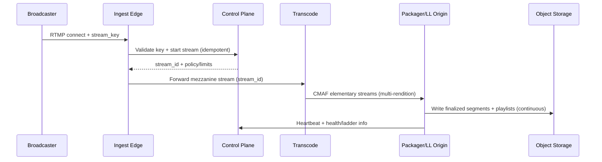
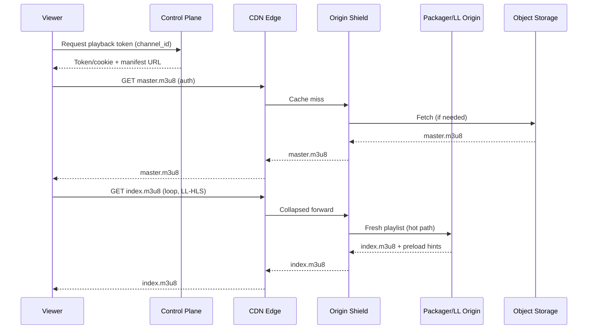
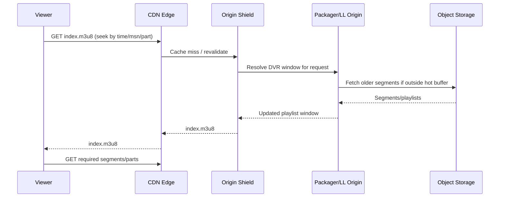

# Live Video Streaming (Twitch-like)

## Overview

A Twitch-like platform is a **multi-stage, near-real-time media pipeline**:

1. **Ingest** a single high-quality live feed from a broadcaster (unreliable networks, variable bitrate).
2. **Transcode** into multiple adaptive-bitrate (ABR) renditions.
3. **Package** into streaming formats (HLS/DASH), ideally **Low-Latency HLS (LL-HLS)**.
4. **Deliver globally** at multi-Tbps scale using a CDN.
5. Support **DVR** (rewind/resume) by turning a live feed into a time-addressable media timeline.

A production-ready mental model is to split the system into:

- **Data plane (hot path):** ingest → transcode → package/origin → CDN → player
- **Control plane:** stream lifecycle, authentication/authorization, entitlements, discovery, tokens, analytics

This separation keeps the media path fast and resilient while allowing the control plane to evolve independently.

---

## Requirements

### Functional Requirements

- **RTMP(S) ingest** with stream keys (broadcaster-friendly).
- **ABR playback** via HLS and optionally DASH (master + rendition manifests).
- **Low latency** using LL-HLS (and optionally low-latency DASH) with CMAF/fMP4.
- **Transcoding ladder** with multiple resolutions/bitrates plus audio-only.
- **DVR playback**: rewind within a retention window (e.g., 2 hours) and return to live.
- **Stream lifecycle**: go-live/ended state, health, viewer counts, notifications.
- **Entitlements**: public/private/subscriber-only, geo/device restrictions, optional DRM.
- **VOD export (optional)**: persist full stream for later playback.

### Non-Functional Requirements (Targets)

#### Scale (Illustrative, Interview-Friendly)

These numbers are intentionally aggressive but internally consistent; adjust to your interviewer/company context.

- **Concurrent broadcasters (peak):** 20,000 (spiky events may exceed; design to burst)
- **Concurrent viewers (peak):** 5,000,000
- **DAU:** 50,000,000

**Ingest bandwidth**
- Assume **~4 Mbps** average ingest (1080p30-ish, varies widely).
- Peak ingest ≈ `20,000 * 4 Mbps = 80 Gbps` (plus overhead, TLS).

**Transcode output bandwidth (into origin/CDN)**
- Average ladder egress per viewer is dominated by viewer bitrate, not broadcaster ingest.
- The platform should minimize **origin egress** via CDN caching and origin shielding.

**Control-plane traffic**
- Token issuance: if tokens expire every 120s and all 5M viewers refresh, worst-case ≈ `~42k QPS`.
- Discovery + status + notifications typically lower than media traffic but must be burst-tolerant.

**Manifest traffic (LL-HLS)**
- Naively: each viewer polls frequently (sub-second to ~1s).
- In practice: **CDN collapses fan-out**; origin sees roughly **O(streams * renditions)**, not O(viewers).

#### Latency

- **Startup (join) time:** P50 < 1.5s, P99 < 4s (to first rendered frame)
- **Glass-to-glass (live edge to viewer):** P50 2–3s, P99 < 7s (LL-HLS tuned)
- **DVR seek:** P50 < 700ms, P99 < 2s (manifest/window resolution + cache hit)

Notes:
- Sub-2s glass-to-glass is achievable in practice but depends on encoder GOP, partial segment duration, player tuning, and CDN behavior.
- “Startup time” is often the KPI users feel most; optimize for it first.

#### Availability & Durability

- **Playback SLO:** 99.99% monthly at the CDN edge (excluding client/network failures)
- **Ingest SLO:** 99.9% monthly (transient broadcaster uplink issues are expected)
- **Media durability:** segments for DVR/VOD stored in object storage (11 9s durability typical)
- **DVR data loss tolerance:** target **≤ 2 seconds** lost per stream during transient failures (best-effort)

#### Consistency Model

- **Strong (transactional):** stream entitlement checks, token issuance, stream state transitions (LIVE/ENDED)
- **Eventual:** viewer counts, analytics, recommendations, notifications

### Constraints & Assumptions

- Deploy in a major cloud with **multi-AZ** per region and optional **multi-region**.
- CDN is a managed global CDN supporting origin shielding and token auth/signed URLs/cookies.
- Prefer managed components where they reduce operational burden.
- Compliance: GDPR; DMCA workflows; optional DRM for premium content.
- Cost: CDN dominates egress; keep origin egress low (shielding + caching + versioned paths).

---

## Architecture

### High-Level Diagram

```mermaid
flowchart LR
  B[Broadcaster<br/>RTMP(S)] --> IE[Ingest Edge POP<br/>RTMP terminate + auth + health]
  IE -->|mezzanine stream| TR[Transcode Cluster<br/>CPU/GPU workers]
  TR --> PKG[Packager / LL Origin<br/>CMAF + LL-HLS/DASH]
  PKG --> OS[(Object Storage<br/>DVR/VOD segments)]
  PKG --> SH[Origin Shield Cache<br/>regional]
  OS --> SH
  SH --> CDN[Global CDN<br/>token auth + caching]
  CDN --> V[Viewer Player<br/>Web/Mobile/TV]

  V --> CP[Control Plane API<br/>auth + discovery + tokens]
  IE <--> CP
  PKG --> MET[Metrics/Logs/Tracing]
  IE --> MET
  TR --> MET
  CP --> DB[(Metadata DB<br/>Postgres)]
  CP --> RD[(Redis<br/>presence/session)]
  CP --> Q[Event Bus<br/>analytics/notifications]
  Q --> AN[Analytics Pipeline]
  Q --> NF[Notifications]
```

### Key Design Choices (Why This Works)

- **Regional anchoring:** a stream is “owned” by one region for ingest/transcode/package; viewers are served globally via CDN.
- **Chunked transfer for low latency:** package **CMAF segments** and serve them progressively as LL-HLS parts; write finalized segments to durable storage for DVR/VOD.
- **CDN fan-out with origin shielding:** origin sees stream-level load, not viewer-level load.
- **Control plane isolated from media:** entitlement checks and tokens are fast and cacheable; media delivery stays simple.

---

## Components

### 1) RTMP Ingest Edge

**Responsibilities**
- Accept RTMP(S) connections and authenticate **stream keys**.
- Enforce basic ingest policy (max bitrate, keyframe interval guidance, codecs).
- Maintain connection state and publish **heartbeats** to the control plane.
- Forward the mezzanine stream to transcoding (internal protocol such as SRT, RIST, or gRPC/RTP within the region).

**Implementation Notes**
- Keep ingest nodes **stateless** beyond live connection state.
- Use **geo-nearest ingest** via Anycast/DNS steering.
- Support rapid reconnects; treat uplink instability as normal.

**Common Pitfall**
- Doing heavy “business logic” on ingest nodes; keep them lean to avoid cascading failures.

---

### 2) Stream Coordinator (Control Plane)

**Responsibilities**
- Stream lifecycle state machine: `CREATED → LIVE → RECOVERING → ENDED`.
- Validate stream keys, enforce one active stream per channel.
- Issue short-lived playback tokens and compute manifest URLs.
- Maintain stream metadata (title/category, retention policy, restrictions).
- Emit events for analytics and notifications.

**Design**
- Postgres for transactional correctness (stream state, entitlements).
- Redis for ephemeral presence, per-stream hot metadata, and fast lookups.

---

### 3) Transcoding Cluster

**Responsibilities**
- Decode mezzanine input; encode ABR ladder renditions.
- Ensure **GOP alignment** across renditions to enable smooth ABR switching.
- Output CMAF-compatible elementary streams to the packager.

**Scaling Model**
- Schedule work **per stream** to preserve predictable latency and isolation.
- Prefer GPU acceleration at scale; fall back to CPU for low tiers or overflow.

**Graceful Degradation**
- Under resource pressure, drop expensive renditions first (e.g., 1080p60 → 1080p30 → 720p).
- Preserve audio-only and a baseline video rendition to keep the stream watchable.

---

### 4) Packager + Low-Latency Origin

**Responsibilities**
- Generate:
  - HLS master manifest
  - rendition playlists with LL-HLS tags (parts, preload hints)
  - (optional) DASH MPD from the same CMAF assets
- Maintain a rolling DVR window (e.g., last 2 hours).
- Publish finalized segments to durable storage for DVR/VOD.
- Serve **fresh manifests and in-progress parts** with minimal latency.

**Important Production Detail**
Object storage is excellent for durable finalized segments, but writing a new object for every 200ms “part” is often too expensive at scale. A common production approach:

- **Serve parts from the packager/origin shield cache (memory/disk)** as they are produced.
- **Write finalized segments** (e.g., 2s CMAF) to object storage asynchronously/continuously.
- This preserves LL-HLS latency while keeping object-store request rates manageable.

---

### 5) Storage & Indexing (DVR/VOD)

**Responsibilities**
- Store immutable media objects (CMAF init + media segments).
- Apply lifecycle policies:
  - DVR window retention (e.g., delete after 2 hours)
  - VOD retention (longer)
- Optional: store periodic DVR “index snapshots” to accelerate time-based seeks.

**DVR Mapping**
- Use `EXT-X-PROGRAM-DATE-TIME` in HLS playlists so clients can map wall-clock time to segment sequence.
- Provide origin support for resolving “start time” queries into the correct playlist window when needed.

---

### 6) CDN + Media Authorization

**Responsibilities**
- Cache and deliver manifests and segments globally.
- Enforce access control via:
  - signed URLs (query signatures), or
  - signed cookies scoped to `live/{stream_id}/*`, or
  - CDN-native JWT validation at the edge

**Caching Strategy**
- **Segments:** cacheable for minutes-hours once finalized.
- **Manifests:** short TTL, but rely on `ETag`, `stale-while-revalidate`, and **collapsed forwarding** at the shield to prevent origin overload.

---

## Data Model

### Relational Schema (Postgres)

Core tables (illustrative):

- `channels`
  - `channel_id (pk)`, `owner_user_id`, `title`, `category`, `created_at`, `updated_at`
- `streams`
  - `stream_id (pk)`, `channel_id (idx)`, `state`, `region`, `started_at`, `ended_at`
  - `dvr_retention_seconds`, `record_vod (bool)`, `mezzanine_profile`
- `active_streams` (or a unique partial index on `streams`)
  - Enforce **at most one LIVE/RECOVERING stream per channel**
- `stream_keys`
  - `key_id (pk)`, `channel_id (idx)`, `key_hash`, `created_at`, `revoked_at`
- `entitlements`
  - `entitlement_id (pk)`, `channel_id (idx)`, `policy_json`, `updated_at`

### Redis (Ephemeral)

- `live_stream:{channel_id}` → `{stream_id, ingest_endpoint, region, last_heartbeat_ms, ladder_profile}`
- `viewer_session:{session_id}` → `{channel_id, stream_id, expires_at}` (optional; avoid if cookies suffice)

### Object Storage Layout (Immutable)

Use **hashed prefixes** to distribute load:

- Init:
  - `live/{h}/{stream_id}/{rendition}/init.mp4`
- Segments (finalized CMAF, e.g., 2s):
  - `live/{h}/{stream_id}/{rendition}/date={YYYY-MM-DD}/hour={HH}/seg_{sequence}.m4s`
- Manifests:
  - `live/{h}/{stream_id}/master.m3u8`
  - `live/{h}/{stream_id}/{rendition}/index.m3u8`
  - `live/{h}/{stream_id}/manifest.mpd` (optional)
- Optional DVR index snapshot:
  - `live/{h}/{stream_id}/dvr_index_{epoch_minute}.json`

Where `{h}` is a small hash prefix (e.g., first 2 bytes of `sha256(stream_id)`).

---

## Data Flow

### Publishing (Broadcaster Goes Live)



### Playback (Viewer Joins Live)



### DVR Seek



---

## API Design

### Authentication Model

- **Broadcaster ingest auth:** stream key (rotatable) validated at ingest edge via control plane.
- **Viewer playback auth:** short-lived token via control plane, enforced at CDN edge.
- Prefer **signed cookies** per stream path to avoid per-request query signatures and to reduce URL leakage.

### Control Plane (REST)

**Start stream (called by ingest edge)**
- `POST /v1/streams:start`
- Headers: `Idempotency-Key: <uuid>`
- Request:
  ```json
  {
    "channel_id": "ch_123",
    "ingest_region": "us-east-1",
    "mezzanine": { "codec": "h264", "audio": "aac" },
    "dvr_retention_seconds": 7200,
    "record_vod": true
  }
  ```
- Response:
  ```json
  {
    "stream_id": "st_456",
    "state": "LIVE",
    "policy": { "max_bitrate_kbps": 8000, "min_keyframe_interval_ms": 1000 }
  }
  ```

**Issue playback token/cookie**
- `POST /v1/playback:token`
- Request:
  ```json
  {
    "channel_id": "ch_123",
    "client_capabilities": { "llhls": true, "drm": false }
  }
  ```
- Response:
  ```json
  {
    "token_expires_in_seconds": 120,
    "manifest_url": "https://cdn.example.com/live/st_456/master.m3u8",
    "set_cookie": "MEDIA=...; Max-Age=120; Secure; HttpOnly; SameSite=None"
  }
  ```

**Stream status**
- `GET /v1/channels/{channel_id}/live`
- Response:
  ```json
  {
    "is_live": true,
    "stream_id": "st_456",
    "started_at": "2025-12-17T12:00:00Z",
    "region": "us-east-1"
  }
  ```

### Media Path Authorization & Error Semantics

- **403:** token invalid/expired/insufficient entitlement
- **404:** segment not yet available (common during live edge; clients retry)
- **410:** requested segment is outside DVR retention window

Control-plane errors should be structured:
```json
{
  "error": {
    "code": "CAPACITY_EXCEEDED",
    "message": "Try again later",
    "retry_after_ms": 5000
  }
}
```

### Idempotency

- Any operation that creates/changes state (`/v1/streams:start`, entitlement updates) must accept `Idempotency-Key`.
- Segment/object writes are idempotent by deterministic keys (sequence/time-based).

---

## Scaling & Performance

### Capacity Planning (What Actually Bottlenecks)

1. **Transcoding compute (CPU/GPU)** is the dominant cost and capacity limiter.
   - Mitigate with GPU acceleration, ladder tuning, per-stream prioritization, admission control.

2. **Manifest request rate (LL-HLS polling)** can be enormous at the edge.
   - Make it a CDN problem:
     - short TTL + `ETag`
     - origin shield with collapsed forwarding
     - keep playlists small (rolling window)

3. **Origin/object-store request rate** can spike with cache misses.
   - Use hashed prefixes, multi-bucket strategy if needed, origin shielding, and avoid per-part object writes.

4. **Ingest instability** (uplink loss, bitrate swings) causes rebuffering and ABR oscillation.
   - Use jitter buffers, encoder recommendations, and health-based degradation.

### Horizontal Scaling

- **Ingest:** add POPs; autoscale on concurrent RTMP connections and throughput; isolate failure domains by region/POP.
- **Transcode/packager:** autoscale by active stream count and latency SLOs; partition by `stream_id`.
- **Control plane:** stateless replicas; Postgres with read replicas (careful: stream state writes remain primary); Redis cluster.

### Caching Strategy

- **Segments (finalized):**
  - `Cache-Control: public, max-age=3600, immutable`
- **Manifests:**
  - `Cache-Control: public, max-age=1, stale-while-revalidate=5`
  - `ETag` + `If-None-Match` to reduce bytes
- **Origin shield:**
  - Aggressively collapse concurrent requests per stream (single-flight).
- **Invalidation:**
  - Prefer versioned paths and short TTLs over purges (avoid purge storms).

### Multi-Region Strategy (Pragmatic)

- **Default:** stream anchored in one region for ingest/transcode/package.
- **Control plane:** active-active across regions with global traffic management.
- **Media DR options:**
  - **Warm standby region** for transcode capacity (for major events).
  - **Cross-region replication** for finalized segments/manifests (RPO depends on cost).
  - **Failover ingest**: DNS/Anycast reroute; broadcaster reconnects; stream enters RECOVERING.

---

## Trade-offs & Alternatives

### Key Trade-offs

- **LL-HLS (chosen) vs classic HLS (6s segments)**
  - Pros: lower latency, better for interactive live content
  - Cons: higher request rate, stricter packaging/player requirements, more sensitivity to CDN behavior

- **Object storage as durable source-of-truth (chosen)**
  - Pros: durability, simple retention policies, easy VOD export, good for DR
  - Cons: request-rate economics and latency; requires shielding and careful write patterns

- **JWT/cookie auth at CDN edge (chosen)**
  - Pros: avoids per-request origin auth checks, scales with CDN
  - Cons: revocation is hard; mitigated with short TTLs and key rotation

### Alternatives (When You’d Pick Them)

- **WebRTC end-to-end**
  - Best for sub-500ms latency (auctions, live collaboration)
  - Harder for DVR/VOD, global scale, NAT traversal, and cost predictability

- **Managed media services (MediaLive/MediaPackage equivalents)**
  - Faster time-to-market, fewer sharp edges
  - Higher cost and less control over ladder, LL tuning, and custom DVR semantics

- **Peer-assisted delivery (P2P)**
  - Can reduce CDN egress
  - Operational complexity, QoS variance, privacy/security concerns

---

## Failure Modes & Mitigations

### Failure Scenarios (At Least 3, Production-Relevant)

1) **Ingest POP outage**
- Impact: broadcasters disconnect; viewers stall or see stream end
- Detect: RTMP disconnect spike, heartbeat loss, POP health checks
- Mitigate: Anycast/DNS failover; broadcaster auto-reconnect; state → `RECOVERING` for 30–60s before ending

2) **Transcode saturation / GPU exhaustion**
- Impact: increased latency, missing renditions, stalls
- Detect: queue lag, encode time, dropped frames, rising startup delay
- Mitigate: degrade ladder, prioritize baseline+audio, burst to overflow region, admission control for new streams

3) **Packager/manifest regression**
- Impact: widespread playback failure
- Detect: synthetic probes, manifest validation, player error spike
- Mitigate: canary deploy, instant rollback, per-stream feature flags, “last-known-good” manifest fallback

4) **CDN misconfiguration / cache fragmentation**
- Impact: origin overload, buffering
- Detect: hit ratio drop, shield/origin RPS spike
- Mitigate: origin shield, conservative headers, emergency rate limits, pre-warm for scheduled events

5) **Object storage regional outage**
- Impact: DVR breaks; new segments may be unavailable
- Detect: elevated 5xx/timeouts from storage SDK, shield errors
- Mitigate: serve from hot buffer where possible; fail over to secondary bucket/region for critical streams; accept bounded DVR loss (RPO)

6) **Token leakage / replay**
- Impact: unauthorized viewing, geo bypass
- Detect: anomaly detection (token reuse across IP/geo), entitlement audit logs
- Mitigate: short TTL, bind tokens to coarse client attributes (geo/ASN/device class), rotate signing keys, prefer cookies over URLs

### Disaster Recovery (Example Targets)

- **RTO:** 15 minutes for playback restoration, 30 minutes for ingest capacity restoration
- **RPO:** 0–60 seconds for DVR segments (depends on replication strategy); near-zero for metadata (multi-AZ)

Backups:
- Postgres: continuous WAL + daily snapshots; verified restore tests
- Object storage: versioning + lifecycle + selective cross-region replication

---

## Operations

### SLOs, SLIs, and Alerting

**Playback SLIs**
- Startup time, rebuffer ratio, fatal error rate
- CDN hit ratio, shield/origin RPS, 4xx/5xx rates

**Ingest SLIs**
- Active sessions, reconnect rate, ingest accept errors, bitrate variance, keyframe interval compliance

**Transcode/packager SLIs**
- Chunk/segment publish latency, encode latency, dropped frames, ladder health, GPU utilization vs backlog

**Suggested alerts**
- Player fatal error rate > 0.5% for 5 minutes
- CDN hit ratio drops > 15 points sustained
- P99 segment availability delay > 2s for 10 minutes
- Transcode backlog rising with GPU > 90% sustained

### Deployment & Change Safety

- **Control plane:** canary (1–5%) + automated rollback on SLO burn
- **Data plane:** canary by stream cohort; keep backward-compatible manifest formats
- **CDN config:** staged rollout + validation; synthetic playback against staging and canary POPs
- **Feature flags:** per-stream LL-HLS enablement and ladder profiles

### Security, Abuse, and Compliance

- Stream key hygiene: hash at rest, rotate/revoke, detect brute force, rate limit validation.
- DDoS: leverage CDN/WAF for control plane; protect origin/shield with strict allowlists and rate limits.
- Privacy: minimize PII in logs; GDPR delete workflows; audit access to entitlement changes.
- DMCA/moderation: event hooks for takedown; rapid entitlement flips; invalidate/expire tokens.

### Cost Controls

- Ladder tuning by content type (gaming vs talk shows), device capability, and audience size.
- Use origin shielding aggressively; prevent cache fragmentation (normalize query params, prefer cookies).
- Lifecycle policies for DVR segments; avoid retaining unnecessary high-bitrate renditions for VOD unless needed.

---

## References & Further Reading

- Apple Low-Latency HLS: https://developer.apple.com/streaming/
- CMAF (ISO/IEC 23000-19) and fMP4: https://www.w3.org/TR/mse-byte-stream-format-isobmff/
- DASH-IF Low Latency: https://dashif.org/docs/
- Shaka Packager: https://github.com/shaka-project/shaka-packager
- FFmpeg documentation: https://ffmpeg.org/documentation.html
- Netflix Open Connect (CDN design intuition): https://openconnect.netflix.com/