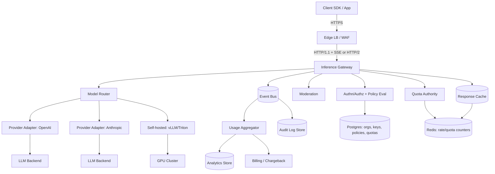
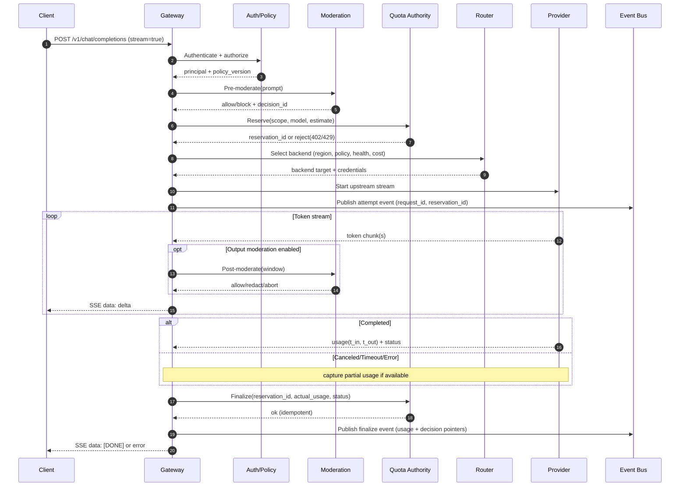

## Overview

An LLM Inference Gateway is the production “front door” for language model usage. It authenticates clients, enforces rate limits and spend quotas, applies safety controls, and proxies requests to one or more model backends while supporting low-latency token streaming.

The hard parts are:

1. **Correct quota enforcement under concurrency**: streaming, client retries, provider retries, and partial failures can easily lead to double-charging or budget overshoot.
2. **Safety without breaking UX**: moderation must work with streaming output, policy differences by tenant, and false positives while keeping time-to-first-token (TTFT) low.
3. **Predictable latency and cost across heterogeneous backends**: multiple providers and self-hosted models have different performance, error modes, and pricing.

A production-ready design separates the system into three planes:

- **Hot path (data plane)**: auth → policy → quota reservation → routing → streaming proxy
- **State plane**: quota ledger/config, idempotency records, cache, policy store
- **Telemetry/finance plane**: immutable usage events → aggregation → billing/chargeback

This keeps the streaming proxy horizontally scalable and stateless while making quota enforcement and billing auditable, replayable, and recoverable.

---

## Requirements

### Functional Requirements

- Authenticate requests via API keys and/or OAuth; map to `org/project/user` identities.
- Provide OpenAI-compatible `/v1/chat/completions` with **SSE streaming** and cancellation propagation.
- Enforce **rate limits** (RPM/TPM) and **budgets** (daily/monthly USD and/or tokens) per org/project/user/model.
- Apply **moderation** on prompts and optionally on generated output with configurable outcomes: `block`, `redact`, `warn`, `allow`.
- Support **prompt/response caching** (exact-match) and optional prefix/KV reuse for self-hosted inference.
- Route across providers/models with health checks, circuit breakers, fallbacks, and progressive rollout.
- Emit detailed **audit and usage telemetry** (request IDs, policy version, quota decisions) for disputes and compliance.

### Non-Functional Requirements

#### Scale (Target: Large SaaS Gateway)

- **Peak**: 10,000 RPS across all inference endpoints (mix of streaming and non-streaming).
- **Streaming**: 10,000 concurrent SSE connections.
- **Tokens**: 50B tokens/day total (≈ 579k tokens/s average across the day).
- **Tenancy**: 10,000 orgs; 100,000 active API keys; up to 1,000 projects/org (long tail).
- **Eventing**: ~2–5× hot-path RPS in internal events (attempt, finalize, moderation, routing, errors).

These numbers are intentionally high to force design decisions (state separation, backpressure, multi-region strategy) while still being plausible for a major platform.

#### Latency (Gateway Overhead, Excluding Model Compute)

- **Non-streaming**: gateway overhead P50 ≤ 30ms, P99 ≤ 150ms.
- **Streaming**:
  - **TTFT overhead** P50 ≤ 60ms, P99 ≤ 250ms.
  - **Token relay overhead** ≤ 5–10ms per hop under load.
- **Budget**: hot-path dependencies must be engineered for single-digit millisecond medians (in-region).

#### Availability & Durability

- **Gateway API SLO**: 99.99% monthly availability (multi-AZ).
- **Graceful degradation**: request serving should continue under telemetry impairments; quotas/moderation may be tenant-configurable fail-open/closed.
- **Usage event durability**: RPO ≤ 60s for billing (events must be durably staged quickly even if aggregation is delayed).
- **Retention**:
  - Request logs (metadata, redacted payload pointers): 30 days
  - Audit logs (who/what/why for policy/quota decisions): 1 year
  - Usage aggregates: 13 months (billing + trend)

#### Consistency

- **Quota enforcement**: strongly consistent *within a quota authority* (e.g., per-org home region), with **bounded drift** during partial outages.
- **Usage dashboards/analytics**: eventual consistency (minutes acceptable).
- **Caching**: eventual, best-effort.

### Constraints & Assumptions

- Network egress to external providers is allowed; some tenants require **data residency** and region pinning.
- Operable by a **6–10 engineer** team with standard SRE tooling.
- Compliance posture: SOC2-style auditability, encryption in transit/at rest, PII minimization, configurable retention.
- Prefer managed building blocks: managed Postgres, Redis, and a Kafka-compatible log pipeline.

---

## Architecture

### High-Level Architecture (Planes + Key Dependencies)



### Request Lifecycle (Streaming)

Key invariant: **quota is reserved before upstream execution** and **finalized exactly once** (or expired safely).



---

## Components

### Inference Gateway (Streaming Proxy)

**Responsibilities**
- Terminate client connections (HTTP + SSE), validate requests, and enforce the hot-path ordering.
- Proxy streaming tokens with backpressure, client cancellation, and upstream cancellation.
- Emit structured audit/usage events with stable IDs for reconciliation.

**Key design points**
- **Stateless**: no per-request durable state in the gateway process (except short-lived in-memory buffers).
- **Backpressure**: if the client is slow, apply buffering limits and propagate flow control upstream where possible.
- **Cancellation**: close upstream stream promptly on client disconnect; ensure finalization and billing correctness.

**Technology**
- Go or Rust for high-throughput networking and efficient streaming.
- Envoy/NGINX at edge for TLS, WAF, and connection limiting.

### Authn/Authz + Policy Evaluation

**Responsibilities**
- Validate API keys/OAuth tokens; map to `org_id/project_id/user_id`.
- Resolve tenant policy (moderation mode, allowed models, residency rules, caching policy, fail-open/closed).

**Implementation notes**
- API keys stored as hashes; support key rotation and scoped permissions.
- Policy reads are **cacheable** with short TTL and explicit versioning (`policy_version`).

### Quota Authority (Rate Limits + Spend Quotas)

**Responsibilities**
- Enforce RPM/TPM and USD/token budgets with low latency.
- Provide **reservation + finalize** and a durable audit trail.

**Correctness model**
- Reserve an estimate before upstream work.
- Finalize exactly once using idempotency on `(reservation_id, finalize_seq)` or `(request_id, stage)` keys.
- If finalize is missed (gateway crash), expire reservations and reconcile using usage events.

**Implementation**
- **Redis** for atomic counters and reservations (Lua scripts or Redis functions).
- **Postgres** for quota configs and an auditable ledger pointer model (not every token update needs a synchronous SQL write).

**Bounded drift**
- If Redis is impaired: tenant-configurable fail-closed or fail-open with explicit limits (e.g., “allow up to +$1 or +2,000 tokens per org during outages”).

### Moderation Service

**Responsibilities**
- Pre-moderate prompts; optionally post-moderate generated output.
- Enforce tenant policy with explainable decision records.

**Streaming considerations**
- Post-moderation operates on a **sliding window** (e.g., last 512–2,048 chars) and can:
  - redact in-flight content (high complexity; careful UX)
  - abort the stream and return a policy error
  - allow but mark with warnings

**Failure behavior**
- Tenant-configurable fail-open/closed; always record moderation outcome (or timeout) in audit events.

### Response Cache (Exact-Match)

**Responsibilities**
- Reduce latency and cost for repeated deterministic requests.

**Safety rules**
- Default to caching only when:
  - tenant enables it
  - request is deterministic enough (`temperature=0` or explicit `cache=true`)
  - prompts/responses are not flagged as sensitive (PII/high-risk categories)
- Cache key includes `policy_version` to prevent cross-policy leakage.

**Stampede control**
- Single-flight locks + soft TTL with background refresh to prevent thundering herds.

### Model Router + Provider Adapters

**Responsibilities**
- Choose backend based on: allowed models, region pinning, provider health, latency/cost targets, and rollout strategy.
- Normalize request/response shapes and streaming semantics.
- Manage retries safely without double-billing.

**Tail latency**
- Use circuit breakers and adaptive routing first.
- Hedged requests only for **idempotent, non-streaming** calls and only when provider terms and billing semantics are compatible.

### Telemetry / Finance Plane

**Responsibilities**
- Ingest immutable events (attempt/finalize/moderation/routing/error).
- Aggregate into OLAP for dashboards, alerts, and billing.
- Support replay/backfill from the event log.

**Reliability**
- At-least-once event delivery with consumer-side deduplication using `event_id`.
- Partition by `org_id` for per-tenant ordering where helpful.

---

## Data Model

### Postgres (Configuration + Control Metadata)

- `orgs(org_id pk, name, home_region, created_at)`
- `projects(project_id pk, org_id fk, name, created_at)`
- `api_keys(key_id pk, project_id fk, key_hash, status, scopes, created_at, last_used_at)`
- `policies(policy_id pk, org_id fk, policy_version, moderation_mode, blocked_categories, pii_rules, cache_policy, updated_at)`
- `quota_configs(quota_id pk, scope_type, scope_id, period, max_usd, max_tokens, rpm, tpm, updated_at)`
- `idempotency_keys(project_id, idem_key, request_hash, response_ref, status, expires_at)` (for `stream=false`)

### Redis (Hot-Path Counters + Reservations + Cache)

- `rl:req:{scope}:{minute}` → request counters
- `rl:tok:{scope}:{minute}` → token counters
- `quota:{scope}:{period}:{bucket}` → spend/token usage
- `resv:{reservation_id}` → reservation record (scope, estimate, expiry, status)
- `cache:resp:{hash}` → cached response blob + metadata
- `lock:cache:{hash}` → single-flight lock

### Usage Event Schema (Event Bus)

Core fields (minimum viable for billing + audits):

- `event_id` (uuid)
- `event_type` (`attempt` | `finalize` | `moderation` | `route` | `error`)
- `request_id` (uuid, stable across retries if idempotent)
- `org_id`, `project_id`, `user_id` (optional)
- `model_requested`, `model_served`, `provider`
- `policy_version`, `moderation_decision_id` (optional)
- `reservation_id` (for quota correlation)
- `tokens_in`, `tokens_out`, `usd` (finalize)
- `status` (`ok` | `canceled` | `timeout` | `error` | `blocked`)
- `timestamps` (start, ttft, end), `region`, `az`

---

## API Design

### Authentication

- `Authorization: Bearer <api_key>`
- `Idempotency-Key: <uuid>` supported for non-streaming requests.

### OpenAI-Compatible Endpoint

`POST /v1/chat/completions`

**Request (subset)**
```json
{
  "model": "gpt-4.1-mini",
  "messages": [{"role":"user","content":"..."}],
  "stream": true,
  "temperature": 0,
  "max_tokens": 512,
  "user": "user_123",
  "metadata": {"project":"abc"}
}
```

**Streaming response**
- `Content-Type: text/event-stream`
- `data: {...delta...}`
- Terminal event: `data: [DONE]`

**Non-streaming response**
- JSON completion with `usage` and a stable `request_id`.

### Errors

- `400` invalid parameters
- `401` invalid or missing credentials
- `403` blocked by policy/moderation
- `402` quota exceeded (budget)
- `429` rate limited (RPM/TPM)
- `503` provider unavailable / circuit open
- `504` upstream timeout

Error body includes:
- `request_id`, `code`, `message`, `retry_after_ms` (when applicable)

### Idempotency Semantics

- `stream=false`: strong idempotency using `Idempotency-Key` → stored response (TTL up to 24h). Prevents double-billing on retries.
- `stream=true`: best-effort. Streaming streams are not generally resumable without storing partial outputs; if resuming is required, offer it as an opt-in feature with clear cost/complexity trade-offs.

### Internal APIs (Operational)

- `GET /internal/health`
- `GET /internal/metrics` (Prometheus)
- `POST /internal/policies/test` (dry-run: moderation + quota estimate + routing decision)
- `POST /internal/cache/purge` (scoped purge; admin-only)

---

## Scaling & Performance

### Capacity Planning (Order-of-Magnitude)

- **Tokens/day**: 50B → ~579k tokens/s average.
- If average completion is ~800 tokens total (in+out), that’s ~724 requests/s average.
- Peak RPS (10k) accounts for diurnal peaks, bursts, small requests, and multi-tenant concurrency.

### Hot-Path Latency Budget (In-Region)

Target P50/P99 gateway overhead:

- Auth/policy (cached): ~1–3ms / ~10ms
- Quota reserve (Redis): ~2–5ms / ~20ms
- Pre-moderation: ~5–20ms / ~80ms (depends on model/rules)
- Routing decision: ~1–3ms / ~10ms
- Total (excluding network to provider): ~15–35ms / ~120–200ms

### Streaming Efficiency

- Use efficient I/O primitives and avoid per-token allocations.
- Batch SSE flushes (e.g., 20–50ms) to reduce syscall overhead while keeping UX responsive.
- Enforce per-connection memory caps and output buffer limits.

### Multi-Region Strategy

- Route clients to nearest region, but enforce **quota authority** in the org’s **home region** (or a designated quota cluster) to maintain strong-ish enforcement.
- Provider routing respects:
  - tenant residency requirements (must remain in-region)
  - provider-specific regional endpoints
- Failover options:
  - active-active gateway, active-passive quota authority (simpler, stronger enforcement)
  - globally consistent store (stronger global correctness, higher latency/complexity)

---

## Trade-offs & Alternatives

### Trade-offs (Explicit)

1. **Redis-based quota authority vs global consensus**
   - Chosen: Redis atomicity + regional authority for low latency.
   - Cost: cross-region strict consistency is hard; bounded drift needed during partial failures.

2. **Two-phase moderation (prompt + optional output) vs prompt-only**
   - Chosen: two-phase to mitigate harmful output mid-stream.
   - Cost: buffering/latency overhead and tricky UX on mid-stream aborts.

3. **Exact-match caching vs semantic caching**
   - Chosen: exact-match for correctness and explainability.
   - Cost: lower hit rate than embeddings-based reuse; semantic caching increases risk of wrong answers and policy leakage.

4. **At-least-once telemetry vs synchronous billing writes**
   - Chosen: append-only events for durability and replay.
   - Cost: requires dedupe and reconciliation logic; dashboards are eventually consistent.

### Alternatives

- **Monolithic gateway** (auth/quota/moderation embedded): simpler deployment, but harder to scale independently and higher blast radius.
- **Fully event-sourced quota ledger** with strict reconciliation: strongest auditability, but hot-path becomes more complex/latency-sensitive.
- **Streaming resume** (store partial outputs): improves UX, but requires durable partial storage, stronger privacy controls, and careful billing semantics.

---

## Failure Modes & Resilience

### Failure Scenarios (Examples)

1. **Provider outage / elevated 5xx**
   - Impact: request failures, increased latency, incomplete streams
   - Detection: per-provider error rate + latency SLO burn, circuit breaker opens
   - Mitigation: fallback provider/model, regional reroute, shed non-critical traffic, return `503` with `Retry-After`

2. **Redis/quota authority partial outage**
   - Impact: inability to reserve/finalize; false rejects or overspend risk
   - Detection: Redis p99 latency, timeout rate, reserve/finalize error counters
   - Mitigation: tenant-configurable fail-open/closed; bounded drift; reduce concurrency per org; reconciliation from finalize events

3. **Moderation degradation or false-positive spike**
   - Impact: unsafe content passes (fail-open) or legitimate traffic blocked (fail-closed)
   - Detection: moderation timeout rate; sudden block-rate change by tenant/model; review sampling
   - Mitigation: rules-only fallback; degrade outcome from block → warn for low-risk tenants; strict mode for high-risk tenants

4. **Cache stampede on popular prompt**
   - Impact: cost spike and provider overload
   - Detection: high miss rate + repeated identical keys; elevated provider QPS
   - Mitigation: single-flight locks; soft TTL; request coalescing; per-tenant cache quotas

5. **Event bus backlog / consumer lag**
   - Impact: delayed billing/alerts; RPO risk if staging is not durable
   - Detection: consumer lag metrics; publish error rates
   - Mitigation: scale partitions/consumers; prioritize finalize events; local disk buffering (bounded) for publish retries

### Disaster Recovery

- **RTO**: 30 minutes for gateway region-level outage (global LB failover).
- **RPO**:
  - usage events: ≤ 60s (must be durably staged)
  - configs/policies: ≤ 5 minutes (DB replication + backups)
- **Backups**: daily Postgres snapshots + WAL archiving; event bus replicated across AZs; Redis is not the source of truth.
- **Failover**: global LB to secondary region; quotas either remain in home region (preferred) or temporarily allow bounded drift in secondary.

---

## Security & Privacy

- Encrypt in transit (TLS) and at rest for all stores.
- Store API keys only as hashes; support rotation and scoped permissions.
- Minimize prompt/response retention by default:
  - allow tenants to disable storage entirely
  - store only redacted snippets or pointers where required
- Enforce least privilege for provider credentials and internal services (mTLS, short-lived tokens).
- Maintain an immutable audit trail for quota/policy decisions (`who`, `what`, `why`, `policy_version`).

---

## Operations

### Observability

Key metrics:

- Gateway: RPS, concurrent streams, TTFT, stream duration, 4xx/5xx, upstream latency, cancellations
- Quota: reserve/finalize latency, rejects by reason, drift usage, Redis p99 latency, finalize idempotency hits
- Moderation: decision latency, timeout rate, block/redact/warn rates, false-positive sampling outcomes
- Providers: per-provider latency and error rates, cost per token, circuit breaker state
- Eventing: publish errors, consumer lag, dedupe rate

Example alerts:

- Gateway 5xx > 0.5% for 5m
- TTFT p99 > 2s for 10m (separate from provider p99 to isolate gateway issues)
- Redis p99 > 20ms for 5m
- Provider error rate > 2% for 5m
- Event consumer lag > threshold (e.g., 10 minutes) for finalize events

### Deployment & Change Management

- Canary rollout (1% → 10% → 50% → 100%) with automated rollback on SLO burn.
- Versioned policies and configs; include `policy_version` in logs and cache keys.
- Safe schema migrations (expand/contract) for Postgres.

### Runbooks (Minimum Set)

- Provider outage (disable route, enable fallback, adjust timeouts)
- Quota drift reconciliation (identify window, replay finalize events, correct aggregates)
- Moderation degradation (toggle fail-open/closed per tenant, enable rules-only)
- Event bus lag (scale consumers, prioritize partitions, confirm publish durability)

---

## References & Further Reading

- OpenAI API compatibility patterns: https://platform.openai.com/docs/api-reference
- Server-Sent Events (SSE): https://html.spec.whatwg.org/multipage/server-sent-events.html
- Envoy rate limiting & circuit breaking: https://www.envoyproxy.io/docs
- Redis scripting for atomic operations: https://redis.io/docs/latest/develop/interact/programmability/eval-intro/
- vLLM (KV cache, high-throughput serving): https://docs.vllm.ai/
- NVIDIA Triton Inference Server: https://github.com/triton-inference-server/server
- Kafka concepts and consumer lag operations: https://kafka.apache.org/documentation/