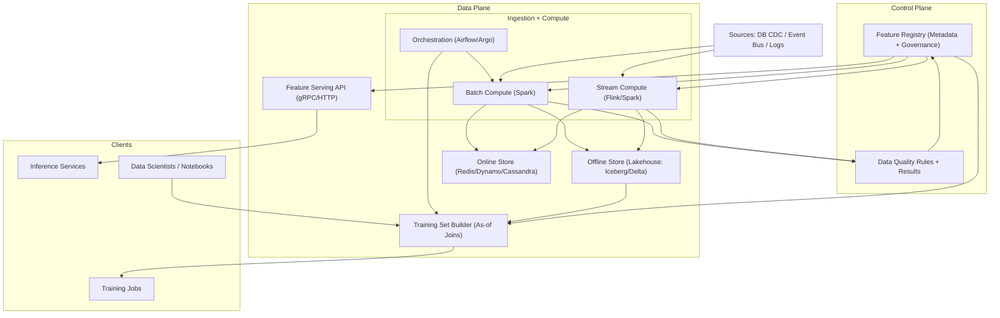
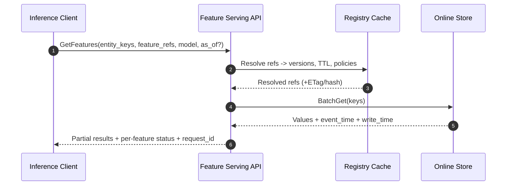
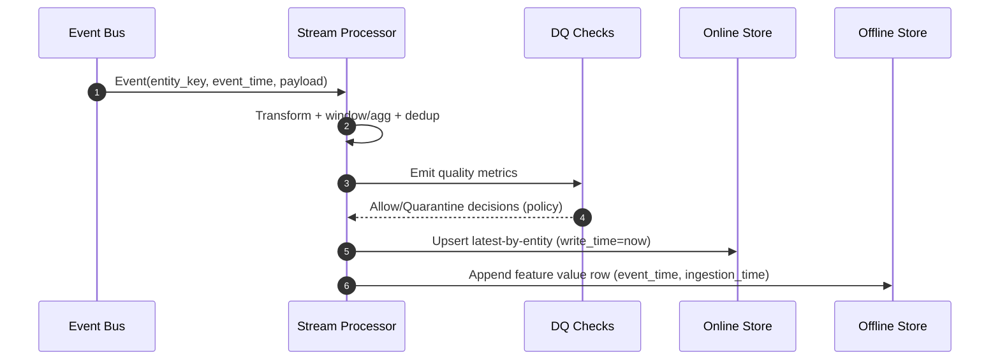

## Overview

A **feature store** is the system that defines, computes, validates, and serves ML features **consistently** across:
- **Offline (training/batch)**: large scans + joins, strict **point-in-time correctness** to prevent leakage, reproducible snapshots.
- **Online (inference/real-time)**: low-latency key lookups with freshness and availability SLOs.

The hard problems are correctness and operations—not storing key/value pairs:
- **Point-in-time correctness** (PIT): “What did we know at time _t_?” (avoid future leakage).
- **Late-arriving events** and **backfills**: updates must be deterministic and auditable.
- **Training-serving parity**: same definitions, same transforms, same defaults, same missing-value behavior.
- **Governance**: versioning, approvals, lineage, access controls, PII handling, and impact analysis.
- **Reliability**: online serving must degrade gracefully under partial failures and stale data.

This design treats features as **versioned, time-indexed data products**. Offline datasets are built via **as-of joins** over time-travelable storage; online serving uses **materialized latest-by-entity** views with explicit freshness semantics.

---

## Requirements

### Functional Requirements
- **Feature definitions**
  - Register feature views (entities, schema, descriptions, owners, SLA/freshness, TTL, aggregation windows).
  - Immutable **versioning** and lifecycle (draft → approved → published → deprecated).
  - Discovery (catalog), tags, documentation, and example queries.
- **Compute**
  - Batch computation from warehouse/lake sources; incremental recompute and historical backfills.
  - Stream computation from event bus; bounded-lateness handling and deduplication.
  - Deterministic transforms and consistent defaulting/missing semantics.
- **Serving**
  - Online `GetFeatures` by entity keys with predictable latency and partial results.
  - Offline dataset generation with **point-in-time correctness** and reproducibility (definition + data snapshot).
- **Governance & quality**
  - Lineage: source → transform → feature view → datasets/models.
  - Data quality checks: schema, null/range, freshness, coverage, drift; block/alert by policy.
  - Multi-tenant isolation, RBAC/ABAC, PII tagging, and audit logs.
- **Operability**
  - Backfill orchestration, replay, and safe rollouts (canary + rollback by pinning versions).

### Non-Functional Requirements (Targets)
- **Online serving**
  - QPS: **10k reads/s peak**, **1k reads/s sustained** (batch gets; typical 10–100 entities/request for batch inference).
  - Latency (in-region): **P50 ≤ 10 ms**, **P99 ≤ 50 ms** for a warmed cache/store.
  - Availability: **99.99%** (multi-AZ).
- **Ingestion / compute**
  - Baseline ingestion: **1B feature rows/day** average (≈11.6k rows/s), with **10× burst** tolerance.
  - “Large org” scale: **10B rows/day** is achievable with dedicated stream/batch clusters and strict partitioning, but increases ops/cost.
  - Freshness: streaming feature materialization lag **< 2 minutes** for “real-time” views.
- **Offline training**
  - Build: **1 TB** training join target **< 1 hour** on a right-sized Spark cluster (e.g., 200–500 vCPU, tuned shuffle + partition alignment).
  - Reproducibility: dataset artifact must include feature definition versions and lakehouse snapshot IDs.
- **Consistency**
  - Online: **eventual consistency** with bounded staleness by per-view freshness SLO.
  - Offline: **point-in-time correct** (no future leakage) and reproducible (immutable versions + time travel).
- **Durability**
  - Offline: **RPO ≈ 0** (object store durability + table metadata snapshots + metadata DB PITR).
  - Online: **RPO ≤ freshness window** (rebuildable from offline + stream replay).

### Constraints & Assumptions
- Events include stable entity keys and event timestamps; ingestion enforces/repairs bounded clock skew (e.g., **≤ 5s** after correction).
- Single region, multi-AZ by default; optional multi-region DR.
- Compliance: encryption in transit/at rest, PII tagging, least-privilege access, audit logs retained **≥ 1 year**.

---

## Architecture

### Control Plane vs Data Plane
- **Control plane**: registry, approvals, lineage, policy, and metadata APIs.
- **Data plane**: compute pipelines, offline store, online store, and serving API.

### High-Level Diagram



### Key Architectural Invariants
- **Immutability for correctness**: feature definition versions are immutable once published.
- **Time semantics are explicit**: every computed value has `event_time` and `ingestion_time`.
- **One authoritative offline history**: online values are derivations/materializations and must be rebuildable.
- **Parity by construction**: the same compute spec (SQL/UDFs) drives offline and online outputs, differing only in execution engine.

---

## Components

### 1) Feature Registry (Catalog + Governance)
**Responsibilities**
- Store feature definitions, versions, ownership, documentation, and policies.
- Enforce lifecycle: draft → review/approval → publish → deprecate.
- Provide lineage pointers and impact analysis (which datasets/models depend on which versions).

**Design**
- Immutable versions: `feature_view_name:v12` (or semver) with a stable “alias” (`latest`, `prod`) resolved at request time.
- Store compute spec as declarative config:
  - Batch SQL (warehouse/lake) + referenced UDF artifacts
  - Stream spec (source topics, keys, windows, allowed lateness, dedup keys)
- Publish generates an immutable **definition snapshot** (hash + artifact) used by training jobs and serving.

**Suggested tech**
- Postgres for metadata + PITR.
- Git-backed definition repository + PR reviews (optional but common in mature orgs).
- Internal UI for discovery and docs (optional).

---

### 2) Ingestion + Feature Compute (Stream + Batch)

#### Streaming compute (real-time feature views)
**Responsibilities**
- Consume events, apply deterministic transforms, update online materializations, and append to offline history.
- Handle late/out-of-order data with watermarks and bounded lateness.

**Correctness**
- Use event-time processing with watermark `W` and allowed lateness `L` (e.g., 2–10 minutes depending on source).
- Deduplicate by `(entity_key, event_time, dedup_id)` where available.
- Emit `feature_value` records with both `event_time` and `ingestion_time`.

#### Batch compute (incremental + backfills)
**Responsibilities**
- Build features from large sources (warehouse/lake), schedule recomputes, and run historical backfills.
- Backfills write a new offline snapshot and (optionally) re-materialize online values.

**Operational rules**
- Backfills are explicit jobs tied to definition versions and source snapshot IDs.
- Online re-materialization is rate-limited to protect serving SLOs.

**Suggested tech**
- Stream: Kafka + Flink (or Spark Structured Streaming).
- Batch: Spark on a lakehouse (Iceberg/Delta/Hudi).
- Orchestration: Airflow/Argo with retries, SLAs, and backfill queues.

---

### 3) Offline Store (Training/Analytics)
**Responsibilities**
- Durable, time-travelable history of feature values and dataset artifacts.
- Support large scans and joins with partition pruning and clustering.

**Design**
- Lakehouse table format with snapshot isolation and time travel.
- Partition primarily by `event_date`; optionally bucket/cluster by `entity_key_hash` to reduce shuffle for joins.
- Manage small files with compaction and optimized writers.

**Suggested tech**
- Object store (S3/GCS) + Iceberg/Delta + Parquet.
- Engines: Spark for pipelines; Trino for ad-hoc exploration.

---

### 4) Online Store + Serving
**Responsibilities**
- Fast retrieval of the latest valid feature values per entity (and optionally as-of a given time within a limited window).
- Enforce TTL, freshness, and model-specific defaults; return partial results instead of failing whole requests.

**Design**
- Store **latest-by-entity** materialization (wide row) keyed by `(entity_type, entity_key)`:
  - per-feature: value + `event_time` + `write_time` + status
  - per-view: `definition_version`, `freshness_watermark`, optional checksum
- Prefer batch gets and pipelining; cap response size and enforce feature allowlists.

**Suggested tech**
- Redis Cluster for ultra-low latency; DynamoDB/Cassandra for larger scale/durability trade-offs.
- Serving: gRPC for internal low-latency; REST for external integrations.

---

### 5) Training Set Builder (Point-in-Time Correctness)
**Responsibilities**
- Build offline training datasets that are:
  - **point-in-time correct** (no future leakage),
  - **reproducible** (pinned versions + pinned snapshots),
  - **auditable** (full lineage).

**As-of join rule**
For each label row `(entity_key, label_time)` and feature rows `(entity_key, event_time, ingestion_time)`:
- Select rows where `event_time <= label_time`
- Choose the maximum `event_time`; if tied, choose maximum `ingestion_time`
- Enforce TTL: `label_time - event_time <= ttl`
- Apply deterministic defaulting if missing/expired/denied

**Suggested tech**
- Spark with a reusable as-of join library and standardized templates.
- Dataset artifacts written back to the lakehouse with metadata (definition snapshot IDs, source snapshot IDs, build code hash).

---

### 6) Data Quality, Validation, and Lineage
**Responsibilities**
- Validate computed features (schema, null/range, freshness, coverage).
- Track lineage and support reconciliation (online vs offline latest-by-entity).

**Design**
- DQ rules stored with the feature view version; results stored as time series.
- Policy-driven actions:
  - warn-only (dev)
  - block publish (prod)
  - quarantine features (serve defaults + status)

---

## Data Model

### Registry (Metadata DB)
A minimal normalized model (fields abbreviated):

- `feature_view`
  - `id (uuid)`, `name`, `version`, `status` (`DRAFT|PUBLISHED|DEPRECATED`)
  - `entities` (jsonb), `schema` (jsonb), `ttl_seconds`
  - `freshness_slo_seconds`, `allowed_lateness_seconds`
  - `compute_spec` (jsonb), `owner`, `tags` (jsonb)
  - `pii_classification` (jsonb), `access_policy` (jsonb)
  - `definition_hash`, `created_at`, `published_at`, `deprecated_at`

- `dataset_artifact`
  - `id`, `uri`, `created_by`, `created_at`
  - `label_source_ref` (table + snapshot), `feature_view_refs` (name+version+hash)
  - `code_hash` (builder version), `metrics` (join coverage, missingness)

### Offline feature values (Lakehouse)
Store typed columns where possible (better compression and queryability). One common pattern:

- `offline_feature_values`
  - `entity_type` (string)
  - `entity_key` (string)
  - `feature_view_name` (string)
  - `feature_view_version` (int)
  - `feature_name` (string)
  - `event_time` (timestamp)
  - `ingestion_time` (timestamp)
  - `value_*` (typed columns, e.g., `value_double`, `value_string`, `value_bool`, `value_json`)
  - `source_ref` (string; e.g., topic+offset or table snapshot)
  - Partition: `event_date` (date)
  - Optional clustering/bucketing: `entity_key_hash`

### Online materialization (KV / wide-row)
Key: `entity_type:entity_key`

Value (conceptual):
- `features`: map `feature_ref -> {value, event_time, write_time, status}`
- `view_versions`: map `feature_view_name -> version`
- `entity_write_time`: last update time (for freshness/debugging)

Status examples: `OK | MISSING | STALE | EXPIRED | DENIED | ERROR`

---

## Data Flow

### Online inference read path



### Streaming compute + materialization



---

## API Design

### Online Serving API (gRPC recommended)

**Semantics**
- Default behavior returns **latest valid** values; optional `asOfTime` is supported only if the online store retains limited history (otherwise return `ERROR/UNSUPPORTED` and rely on offline for historical).
- Partial failures do not fail the entire response unless policy requires it.

**HTTP example**
- `POST /v1/features:get`

Request:
```json
{
  "entityType": "user",
  "entityKeys": ["u1", "u2"],
  "features": ["user_age:v12", "user_country:v3"],
  "requestContext": {"model": "ranker_v7"},
  "asOfTime": "2025-12-17T10:00:00Z"
}
```

Response:
```json
{
  "results": [
    {
      "entityKey": "u1",
      "featureValues": {
        "user_age:v12": {"value": 34, "eventTime": "2025-12-17T09:58:10Z", "status": "OK"},
        "user_country:v3": {"value": "PL", "eventTime": "2025-12-10T12:00:00Z", "status": "STALE"}
      }
    }
  ],
  "requestId": "9b0d6b7c-3b2f-4c0a-9c32-3c0fd6b8d3a1"
}
```

**Operational details**
- Timeouts: client deadline **20–50ms**; server enforces per-call budget and uses batch gets.
- Limits: max entities/request, max features/entity, max response bytes (protect tail latency).
- AuthZ: feature-level allowlist by tenant/model; return `DENIED` per feature.

---

### Registry API
- `POST /v1/registry/feature-views` (create draft)
- `POST /v1/registry/feature-views/{name}/publish` (publish new immutable version)
- `GET /v1/registry/feature-views/{name}?version=12`
- `GET /v1/registry/feature-views/{name}/versions`
- Idempotency: `Idempotency-Key` for creates/publishes.

---

### Offline Training API
- `POST /v1/training-datasets` (submit build)
  - inputs: label source reference (table + snapshot), feature refs (pinned or “resolve at submit”), join keys, label time column, output location
- response: dataset artifact URI + definition snapshot IDs + build metrics (coverage, missingness)

---

## Scaling & Performance

### Capacity planning (rules of thumb)
- **Online read amplification**
  - A request for `N_entities × M_features` should be served as **O(N_entities)** online store operations using wide rows or batched multi-get (avoid per-feature fetches).
- **Online value size**
  - If average per-feature payload is ~30–80 bytes compressed/encoded and you store 200 features/entity, budget **10–30 KB/entity** including metadata.
- **Ingestion throughput**
  - 1B rows/day ≈ 11.6k rows/s average; design for **100k rows/s** bursts with partitioned topics and processor parallelism.
- **Offline storage growth**
  - Budget using compressed Parquet sizes; if 1B rows/day at ~40–120 bytes/row compressed, expect **40–120 GB/day** plus compaction overhead and snapshots.

### Bottlenecks and mitigations
- **Hot keys / hot shards (online)**
  - Mitigate with consistent hashing, shard-aware batching, request coalescing, and small serving-tier cache (tens to hundreds of ms).
- **Tail latency**
  - Enforce strict timeouts, circuit breakers, and partial responses; cap work per request.
- **Offline as-of join shuffle**
  - Align partitions by `event_date` and `entity_key_hash`, pre-sort within partitions, and use a standardized as-of join implementation.
- **Small files (lakehouse)**
  - Compact by partition, tune file sizes (e.g., 128–512MB), and use optimized writers.

### Caching strategy
- Serving-tier cache: **50–200ms TTL** for ultra-hot bursts; only cache successful `OK` values to reduce inconsistency risk.
- Registry cache: cache resolved definitions by `(name, version)` for minutes; invalidate on publish events; use ETags/definition hashes.
- Do not rely on offline engine caching for correctness; treat as best-effort performance only.

---

## Correctness, Consistency, and Parity

### Time semantics
- **Event time**: when the signal occurred in the real world.
- **Ingestion time**: when the platform observed and processed it.
- **Processing time**: when a system executed the compute step (not used for correctness).

### Late data policy
- Streaming views define `allowed_lateness_seconds`. Data later than that:
  - is still written to offline history for training correctness,
  - may trigger a backfill or online re-materialization depending on policy (cost vs benefit).

### Training-serving parity
- Same compute spec drives both paths; differences are only execution engine mechanics.
- Version pinning:
  - Training datasets pin `feature_view_version` + lakehouse snapshot ID.
  - Serving pins feature view versions per model via config (roll forward/back by changing pins).

---

## Trade-offs & Alternatives

### Trade-offs made
- **Separate offline lakehouse and online KV**
  - Pros: right storage for each workload; offline time travel; online low latency.
  - Cons: duplication, more ops, reconciliation required.
- **Event-time + ingestion-time with as-of joins**
  - Pros: prevents leakage, deterministic late-data handling, auditable.
  - Cons: more complex compute and debugging; requires careful windowing/watermarks.
- **Immutable versioning**
  - Pros: reproducibility, safe rollout/rollback, clear lineage.
  - Cons: operational overhead (more versions), requires good tooling for discovery and cleanup.

### Alternatives
- **On-demand feature computation at inference**
  - Simple storage, but latency and dependency fragility usually violate inference SLOs.
- **Single OLAP system for offline+online (e.g., Pinot/Druid)**
  - Works for some lookup patterns, but time travel and strict PIT reproducibility are harder; point lookups can be costly at P99.
- **Managed feature store vendor**
  - Faster time-to-value; trade-offs include cost and lock-in; still requires correct event-time modeling and governance.

---

## Failure Modes & Mitigations

### Failure scenarios (examples)
1) **Online store outage / partition**
- Impact: inference degraded/fails; increased tail latency.
- Detection: elevated error rate, p99 latency, store health checks, timeouts.
- Mitigation: multi-AZ, strict timeouts + circuit breakers, partial responses + defaults, last-known-good serving-tier cache, rebuild from offline + stream replay.

2) **Materialization lag / stream backlog**
- Impact: stale features; model quality drop.
- Detection: consumer lag, watermark delay, freshness SLO violations per feature view.
- Mitigation: autoscale processors, backpressure tuning, isolate heavy views, degrade stale features to defaults with `STALE` status.

3) **Data leakage due to incorrect join**
- Impact: inflated offline metrics; poor production performance.
- Detection: automated invariants (enforce `feature.event_time <= label_time`), unit tests on join library, dataset audits, canary training runs.
- Mitigation: centralized as-of join library, mandatory reviews for builder changes, reproducible snapshots, leakage check gates in CI.

4) **Backfill introduces divergence**
- Impact: online/offline mismatch; silent training-serving skew.
- Detection: reconciliation jobs comparing online latest-by-entity vs offline computed latest; alerts on drift thresholds.
- Mitigation: policy-driven online re-materialization after backfills; version pinning; staged rollout of corrected versions.

5) **Metadata DB/registry outage**
- Impact: cannot publish/resolve; serving may fail if it hard-depends on registry.
- Detection: registry API errors, elevated cache misses.
- Mitigation: serving uses cached immutable definitions by version; allow “pinned-only mode” for inference; multi-AZ DB + read replicas + PITR.

### Disaster recovery (guidance)
- RTO: online serving **≤ 1 hour** (single region); offline recompute **≤ 24 hours**.
- RPO: offline **≈ 0**; online **≤ freshness window** (e.g., 2 minutes) with stream replay.
- Backups: metadata DB PITR; export registry definition snapshots to immutable object storage; rely on lakehouse snapshots + object store durability.

---

## Operations

### SLOs and dashboards
- Serving SLOs: availability, p50/p99 latency, error rate, percent partial responses, per-feature missing/stale/denied rates.
- Data freshness: per-view `event_time` watermark vs now; per-view lag distribution.
- Pipeline health: stream lag, batch job duration, retry counts, backfill queue depth.
- Data quality: schema failures, null/range violations, coverage (% labels with non-missing features), drift metrics (PSI/KL) with thresholds.

### Release and rollout
- Definitions: publish new versions; canary by pinning a subset of models; roll forward by updating pins; rollback by reverting pins.
- Serving: canary/blue-green with automatic rollback on SLO regression.
- Pipelines: shadow compute and diff outputs before switching materialization.

### Security and compliance
- AuthN: service-to-service identity (mTLS/OIDC).
- AuthZ: tenant + model-based policies; feature-level permissions; row/column-level controls for PII.
- Encryption: TLS in transit; KMS-managed keys at rest; secrets in a vault.
- Auditing: immutable logs for publishes, access, and dataset builds (retain ≥ 1 year).

### Cost controls
- Tier features by freshness/criticality; only a subset needs real-time materialization.
- Use TTLs and feature retirement to cap online memory and offline growth.
- Compact offline tables and prune deprecated versions with policy (never delete artifacts needed for regulated reproducibility).

---

## References & Further Reading
- Feast (open-source feature store): https://feast.dev/
- Uber Michelangelo (feature store concepts, lineage): https://eng.uber.com/michelangelo-machine-learning-platform/
- Tecton (real-time feature pipelines concepts): https://www.tecton.ai/blog/
- Apache Iceberg: https://iceberg.apache.org/
- Delta Lake: https://delta.io/
- Flink event-time & watermarks: https://nightlies.apache.org/flink/
- Point-in-time correctness and leakage: search “as-of join”, “event time vs processing time”, and “training-serving skew”