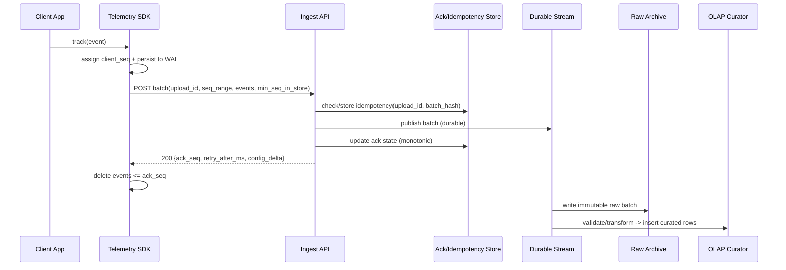

## Overview

Uploading telemetry from mobile devices seems straightforward (“send events to a server”), but production constraints make it tricky:

- **Battery/data cost**: cellular radios have “tail energy”; frequent small uploads drain battery.
- **Intermittent connectivity**: offline, captive portals, roaming, flaky networks.
- **OS background limits**: iOS/Android restrict background execution; uploads must be opportunistic.
- **Backend scale and correctness**: retries must not double-count; ingestion must be durable; analytics must remain flexible.

The core idea is to treat telemetry as **opportunistic, batched, and idempotent**:

- **On-device**: persist events to a local write-ahead log (WAL), upload in adaptive batches only under favorable conditions (network available, not low-power, optionally Wi‑Fi/charging).
- **Server-side**: acknowledge quickly **after durable enqueue** (stream/queue), using **upload idempotency + per-device sequence acks** so retries don’t inflate volume.
- **Downstream**: write immutable raw logs for replay and a curated OLAP dataset for fast queries.

This keeps the mobile request path short (lower radio-on time) while preserving durable ingestion and scalable analytics.

## Goals and Non-Goals

### Goals
- Reliable telemetry ingestion under mobile constraints with predictable battery/data usage.
- At-least-once delivery to the server with **idempotent ingestion** (no double-count from retries).
- Near-real-time analytics (minutes) with a robust replayable raw pipeline.
- Multi-tenant isolation, quotas, and privacy controls suitable for production.

### Non-Goals
- Exactly-once analytics for all event types across all failure modes (achievable for some metrics with extra dedupe/cost).
- Real-time streaming semantics (sub-second end-to-end) for all devices (mobile background limits make this unrealistic).

## Requirements

### Functional Requirements
- Capture client events with metadata (timestamp, app/app version, device/network context) and persist locally until uploaded.
- Upload events in **batches** with compression; optional application-layer encryption for sensitive tenants.
- Support intermittent connectivity with safe retries across app restarts and OS-killed jobs.
- Provide **idempotent ingestion** so duplicate uploads (retries/timeouts) do not double-count.
- Support server-driven **dynamic config**: sampling, max batch size, upload conditions, backoff rules.
- Support **backpressure**: server throttles; clients adapt without burning battery.
- Provide delivery feedback (acknowledged sequence) so local storage can be reclaimed safely.
- Enforce privacy controls: minimize PII, tenant isolation, opt-out/consent, and deletion requests where applicable.

### Non-Functional Requirements (Concrete Targets)
- **Scale**
  - 50M DAU
  - ~500 events/device/day ⇒ **25B events/day**
  - Average event payload after encoding+compression: **~150–300 bytes/event** (varies by type)
  - Data volume: **~4–8 TB/day compressed** (excluding replication), plus overhead for raw/curated copies
  - Upload batch size target: **200–1000 events** or **256KB–1MB compressed**, whichever comes first
  - Upload request rate (ballpark):
    - If 500 events/device/day and 500 events/batch ⇒ ~1 upload/device/day ⇒ **~580 req/s avg**
    - With smaller batches and diurnal peaks, plan for **~5k–20k req/s peak** (regionally distributed)
- **Latency (Ingest API)**
  - Goal: fast ack to minimize radio tail
  - **P50 < 200ms**, **P99 < 1s** server processing time in-region (excluding client-side DNS/TLS variability)
- **Analytics Freshness**
  - Hot path dashboards: **< 5 minutes** end-to-end (ingest → OLAP queryable)
  - Cold/backfill: hours acceptable via raw replay
- **Availability**
  - Ingest API: **99.99%** monthly (allows throttling/degraded modes during incidents)
- **Durability**
  - Client: 0 loss for persisted events (bounded by local quota; beyond quota, apply explicit drop policies)
  - Server: once acked, events survive single-node and single-AZ failures; multi-region RPO/RTO defined in DR
- **Consistency**
  - **Strong** for per-device ack/idempotency decisions *within a region*
  - **Eventual** for analytics and cross-region aggregation

### Constraints & Assumptions
- OS background execution limits (Android Doze/App Standby; iOS BGTask/Background URLSession).
- Connectivity cost controls (Wi‑Fi only, low-data mode) must be respected.
- Multi-tenant system with per-tenant quotas and isolation.
- Compliance (GDPR/CCPA): minimize PII; support deletion requests; encrypt in transit and at rest.
- Prefer mature building blocks: HTTP/2 or HTTP/3, Kafka/PubSub/Event Hubs, ClickHouse/BigQuery/Snowflake.

## Capacity Planning (Back-of-the-Envelope)

Assume **25B events/day** and **200 bytes/event compressed on average**:

- Daily ingress data: 25B * 200B ≈ **5 TB/day**
- Average sustained throughput: 5 TB/day ≈ **58 MB/s**
- Peak throughput (10×): **~580 MB/s** (aggregate across regions)
- Kafka (or equivalent) sizing considerations:
  - Replication factor 3 ⇒ network/storage write amplification ~3×
  - Retention 7 days for raw batches ⇒ **~35 TB** compressed (before replication), plus headroom
  - Partition count: choose based on peak throughput and consumer parallelism (often **hundreds to low thousands**; start with **~500–1500** for large deployments)

These numbers are intentionally approximate; validate with real event schemas and compression ratios early.

## High-Level Architecture

```mermaid
graph TB
  subgraph Client["Client (Mobile)"]
    App["App"]
    SDK["Telemetry SDK"]
    WAL[(Local WAL / SQLite)]
    App --> SDK --> WAL
  end

  subgraph Edge["Edge"]
    DNS["Geo DNS / Anycast"]
    WAF["WAF + DDoS + Rate Limit"]
  end

  subgraph Ingest["Ingest Region"]
    LB["L7 Load Balancer"]
    API["Ingest API (stateless)"]
    IDStore[(Ack/Idempotency Store)]
    Stream["Durable Stream/Queue"]
    LB --> API
    API --> IDStore
    API --> Stream
  end

  subgraph Pipelines["Downstream Pipelines"]
    RawSink["Raw Archive Writer"]
    Curate["Curator/Validator"]
    DLQ["Dead-Letter Queue"]
    Stream --> RawSink
    Stream --> Curate
    Curate --> DLQ
  end

  subgraph Storage["Storage & Analytics"]
    Obj[(Object Store: Raw)]
    OLAP[(OLAP: ClickHouse/BigQuery)]
    CfgDB[(Config DB)]
    RawSink --> Obj
    Curate --> OLAP
  end

  subgraph Control["Control Plane"]
    ConfigAPI["Config API"]
    ConfigAPI --> CfgDB
  end

  DNS --> WAF --> LB
  SDK --> DNS
  SDK -->|POST batches| WAF
  SDK -->|GET config (rare)| ConfigAPI
```

Key separation: the ingest path is optimized for fast validation and **durable enqueue**, while downstream consumers handle heavier transformations and analytics writes.

## Core Concepts (Interview-Critical)

### Delivery Semantics
- **Client → Server**: at-least-once (retries happen).
- **Server ingestion**: idempotent at the batch level via `upload_id` and validated content hash.
- **Client cleanup**: driven by `ack_seq` (highest safely acknowledged sequence), allowing safe deletion of local WAL entries.

### Identifiers
- `tenant_id`: derived from auth token/credentials (do not trust only headers).
- `device_install_id`: random UUID generated on app install (avoid hardware IDs).
- `device_epoch`: increments when local state is reset (app reinstall, user “reset telemetry”, WAL corruption).
- `client_seq`: monotonically increasing sequence assigned when persisting each event (per install/epoch).
- `upload_id`: UUID for a specific batch attempt; reused on retries of the *exact same* batch.
- `batch_hash`: SHA-256 of the uncompressed batch (or canonical serialized form) to detect idempotency conflicts.

### Backpressure
Server may return `retry_after_ms` and/or `429 Retry-After`. Clients must:
- Exponentially back off with jitter
- Increase batching (within limits) to reduce request overhead
- Apply stronger sampling / drop low-priority events when local quota is under pressure

## Component Deep-Dive

### Telemetry SDK (Mobile)

**Responsibilities**
- Capture events and metadata; enforce privacy rules (redaction/consent).
- Persist to a local WAL.
- Schedule uploads under OS constraints and user/tenant policies.
- Batch, compress, and upload with idempotency/retry logic.

**Key Design Decisions**
- **Local WAL with monotonic `client_seq`**:
  - SQLite (WAL mode) or append-only file log with periodic compaction.
  - `client_seq` assigned at persistence time to avoid gaps due to crashes.
- **Adaptive batching**:
  - Upload when `(batch_bytes ≥ threshold) OR (oldest_event_age ≥ max_delay)` and conditions allow.
  - Coalesce work to reduce radio wakeups.
- **Quota + drop policy**:
  - Enforce `max_local_bytes` (e.g., **50–200MB**).
  - Drop by priority and age; record counters (dropped_by_reason) to understand impact.

**Technology Choices**
- SQLite (WAL mode), Protobuf, zstd (preferred) or gzip (fallback).
- Android: WorkManager/JobScheduler with constraints (network type, charging, idle).
- iOS: BGTaskScheduler + Background URLSession for larger transfers; fallback to short background tasks where allowed.

**Practical Mobile Optimizations**
- Keep uploads in a single job using one HTTP/2 connection where possible.
- Use TLS session resumption; keep request/response small (ack + config delta only).
- Avoid “upload storms” on app open: randomize initial delay and respect server `retry_after_ms`.

### Ingest API (Sync Endpoint)

**Responsibilities**
- Authenticate and authorize (tenant isolation, quotas).
- Validate payload size, schema, and sequence semantics.
- Enforce throttling/backpressure.
- Ensure idempotent ingestion and compute `ack_seq`.
- **Durably enqueue** the batch and respond quickly.

**Key Design Decisions**
- **Ack-after-durable-enqueue**:
  - For Kafka: produce with `acks=all` and `min.insync.replicas >= 2`.
  - Only respond `200` once the publish is confirmed.
- **Idempotency at batch granularity**:
  - Key: `(tenant_id, device_install_id, device_epoch, upload_id)`.
  - Store response (`ack_seq`, seq range, `batch_hash`) and replay it on retry.
  - If same key but different hash/range ⇒ `409 Conflict` (client must rebase).
- **Sequence-based cleanup**:
  - Maintain a per-device “ack state” to compute highest contiguous ack.
  - Handle local drops via explicit client signals (see API).

**Technology Choices**
- Stateless service (Go/Java/Rust) behind L7 LB/WAF.
- HTTP/2 (or HTTP/3 where supported) + Protobuf payloads.
- Ack/idempotency state store:
  - Options: DynamoDB/Spanner/Cockroach/Postgres (with careful keying and TTL), plus an optional Redis cache for hot keys.
  - Keep writes small and bounded: one row per upload id + one row per device state.

**Abuse/Hardening**
- Enforce max compressed and max decompressed sizes (prevent decompression bombs).
- Reject oversized batches early (before full decompression when possible).
- Rate-limit per tenant/device; protect with WAF rules and anomaly detection.

### Durable Stream / Queue

**Responsibilities**
- Buffer bursts; decouple ingest from storage/analytics.
- Preserve ordering where needed (at least per device for simpler downstream handling).
- Provide replay capability for backfills and schema evolution.

**Key Design Decisions**
- Partition key: `hash(tenant_id, device_install_id)` to keep per-device order.
- Retention:
  - Short retention in the stream (e.g., **3–7 days**) for replay.
  - Long-term retention in object storage (raw) based on policy.

**Technology Choices**
- Kafka (self-managed/MSK), Pub/Sub, or Event Hubs.
- Prefer a system with strong durability guarantees and good operational tooling.

### Storage & Analytics

**Responsibilities**
- Store immutable raw batches for replay and audit.
- Produce curated, query-optimized datasets for dashboards and investigations.
- Support retention and deletion workflows.

**Key Design Decisions**
- **Dual-path**:
  - Raw immutable: object storage (`tenant/date/hour/...`) in a stable format (e.g., protobuf/avro + compression).
  - Curated: OLAP tables with normalized dimensions and common query accelerations (rollups/materialized views).
- **Schema evolution**:
  - Version event envelopes; keep old versions readable via registry and conversion in the curator.

**Technology Choices**
- Object store: S3/GCS/Azure Blob.
- OLAP: ClickHouse (low-latency self-hosted) or BigQuery/Snowflake (managed).
- Schema registry (for envelope versions and validation rules).

### Config Service

**Responsibilities**
- Serve upload policy, sampling rules, and kill switches.
- Support per-tenant overrides and staged rollouts.

**Key Design Decisions**
- Fetch config on startup and periodically (e.g., daily), but primarily **piggyback config deltas** on upload responses.
- Signed configs with `config_version` to prevent rollback confusion and support offline behavior.
- Server-side clamps: never allow configs that violate SDK hard safety limits (e.g., minimum interval).

**Technology Choices**
- REST API backed by Postgres/DynamoDB; edge caching with short TTL (5–15 minutes).
- Rollout controls: percentage-based, tenant-based, and app-version-based targeting.

## Data Model

### On-Device (SQLite Example)
- `events`
  - `client_seq` (INTEGER PRIMARY KEY, monotonic)
  - `event_id` (BLOB(16) UUID)
  - `ts_ms` (INTEGER)
  - `type` (TEXT)
  - `payload_pb` (BLOB)
  - `priority` (INTEGER)
  - `size_bytes` (INTEGER)
- `device_state`
  - `device_install_id` (TEXT)
  - `device_epoch` (INTEGER)
  - `last_acked_seq` (INTEGER)
  - `config_version` (TEXT)
  - `next_allowed_upload_ts_ms` (INTEGER)
- `drop_counters` (optional)
  - `reason` (TEXT) — e.g., `quota`, `privacy`, `sampling`
  - `count` (INTEGER)

### Server-Side Ingest State (Recommended)
**Per-device ack state**
- Key: `(tenant_id, device_install_id, device_epoch)`
- Fields:
  - `ack_seq` (INT64) — highest contiguous acked sequence
  - `updated_at` (TIMESTAMP)
  - Optional: `last_seen_client_time_ms`, `last_ingest_region`

**Per-upload idempotency**
- Key: `(tenant_id, device_install_id, device_epoch, upload_id)`
- Fields:
  - `first_seq`, `last_seq` (INT64)
  - `batch_hash` (BYTES)
  - `ack_seq_returned` (INT64)
  - `received_at` (TIMESTAMP)
  - TTL: **7–14 days** (long enough to cover retry windows)

### Raw (Object Store)
- `.../tenant_id=.../date=YYYY-MM-DD/hour=HH/partition=.../*.pb.zst`
- Store an envelope including `(tenant_id, device_install_id, device_epoch, upload_id, first_seq, last_seq, ingest_ts, sdk_version, batch_bytes, batch_hash, events[])`.

### Curated OLAP (Example)
- `telemetry_events_vN`
  - `event_date` (DATE)
  - `tenant_id` (STRING)
  - `device_id_hash` (BYTES) — hashed/pseudonymous
  - `event_type` (STRING)
  - `ts_ms` (INT64)
  - `ingest_ts` (TIMESTAMP)
  - Common dimensions: `app_version`, `os`, `net_type`, `country` (as allowed)
  - `payload` (JSON/nested) or exploded typed columns for common fields
- Partition: `event_date`; cluster/sort by `tenant_id`, `event_type`, `ts_ms`.

## API Design

Principles:
- Keep client payload compact (Protobuf + compression).
- Keep server response tiny (ack + retry + config delta).
- Make retries safe (idempotency key + hash).

### POST `/v1/telemetry/batches`

**Authentication**
- `Authorization: Bearer <token>` (JWT/OAuth) or mTLS for managed devices.
- `tenant_id` is derived from the token/credential; headers may be present for routing but must be validated.

**Headers**
- `Content-Type: application/x-protobuf`
- `Content-Encoding: zstd|gzip`
- `Idempotency-Key: <upload_id>`
- `X-Device-Install-Id: <uuid>`
- `X-Device-Epoch: <int>`
- `X-SDK-Version: <semver>`
- `X-Batch-SHA256: <base64>` (optional but recommended)

**Request (Protobuf sketch)**
- `upload_id` (string)
- `device_install_id` (string)
- `device_epoch` (int32)
- `first_seq` (int64)
- `last_seq` (int64)
- `min_seq_in_store` (int64) — lowest seq still present locally (supports local drops)
- `client_time_ms` (int64)
- `events[]`:
  - `seq` (int64)
  - `event_id` (bytes16)
  - `ts_ms` (int64)
  - `type` (string)
  - `payload` (bytes)
  - `attrs` (map<string,string>) — small, bounded keys/values

**Response (JSON or Protobuf)**
- `ack_seq` (int64) — highest contiguous seq the server considers safely accepted
- `received_upload_id` (string)
- `retry_after_ms` (int64) — 0 means normal
- `config_delta` (optional) — includes `config_version` and updated knobs

**Server Semantics**
- The server:
  - Validates `(tenant_id, device_install_id, device_epoch)` identity and quotas
  - Verifies `batch_hash` (if provided) for idempotency conflict detection
  - Publishes batch to the durable stream
  - Updates per-device ack state:
    - `ack_seq` advances monotonically
    - May advance to at least `min_seq_in_store - 1` if the client reports older events are no longer present (so the client isn’t stuck forever)

**Errors**
- `400 Bad Request`: invalid schema, missing required headers, invalid seq range, unsupported encoding/version.
- `401/403`: auth/tenant mismatch.
- `409 Conflict`: same `upload_id` with different hash or different seq range/content.
- `413 Payload Too Large`: batch too large (compressed or decompressed).
- `429 Too Many Requests`: throttled; respect `Retry-After`.
- `503 Service Unavailable`: cannot durably enqueue; include `Retry-After`.

### GET `/v1/telemetry/config` (Rare Path)
Prefer piggybacking config on upload responses to avoid extra radio wakeups.

**Response**
- `config_version`
- `max_batch_bytes_compressed` (e.g., 256KB–1MB)
- `max_batch_events` (e.g., 200–1000)
- `max_delay_ms` (e.g., 5–15 minutes for non-critical)
- `min_upload_interval_ms` (hard safety clamp in SDK)
- `wifi_only` (bool)
- `daily_data_budget_bytes` (soft limit)
- `sampling_rules` (by `event_type`, `priority`, app_version targeting)
- `kill_switch` (bool) — disables non-critical telemetry

## Data Flow



## Scaling & Performance

### Client-Side Bottlenecks
- **Radio tail energy**: many small uploads dominate battery.
  - Mitigations: batching thresholds, condition-based scheduling, piggyback config, avoid extra DNS/TLS handshakes.
- **Local storage pressure**:
  - Mitigations: quotas, priority-based dropping, stronger sampling under pressure, compress on disk if needed.

### Server-Side Bottlenecks
- **Decompression + parsing CPU**:
  - Mitigations: cap batch sizes, streaming decode, pre-validate headers, autoscale, isolate heavy parsing.
- **Hot partitions (noisy devices/tenants)**:
  - Mitigations: enforce per-tenant/device QPS and bytes quotas; partition by `(tenant_id, device_install_id)`.
- **Consumer lag / OLAP slowness**:
  - Mitigations: scale consumers, apply backpressure; degrade to “raw-only” writes if curated path is unhealthy (while keeping raw replay intact).

### Partitioning Strategy
- Stream partition key: `hash(tenant_id, device_install_id)` for per-device ordering and stable distribution.
- OLAP partitioning: `event_date`; clustering by `tenant_id`, `event_type`, and time.

### Caching Strategy
- **Token/JWKS caching** for auth verification.
- **Idempotency hot cache** (optional Redis) for recent `upload_id` lookups; authoritative store remains durable.
- **Config caching** at edge and SDK; use `config_version` monotonicity.

## Consistency, Ordering, and Idempotency (Correctness Model)

- **Ordering**: preserve per-device sequence order by partitioning on device id; do not rely on global ordering.
- **Idempotency**:
  - Batch retries reuse the same `upload_id`.
  - Server stores `upload_id → (batch_hash, ack_seq_returned)` and replays the same response.
  - Conflicting replays return `409` to force client rebase.
- **Ack computation**:
  - `ack_seq` is the highest contiguous seq accepted (or advanced via `min_seq_in_store` when the client has dropped older data).
  - `ack_seq` must be monotonic per `(tenant, install, epoch)` to prevent client deletion bugs.
- **Multi-region note**:
  - Prefer regional affinity so a given device usually talks to one region.
  - During failover to another region, duplicates are possible unless ack/idempotency state is shared cross-region; treat this as a trade-off (see below) and choose based on tenant requirements.

## Trade-offs & Alternatives

### Trade-offs Made
- **Ack after durable enqueue (chosen)** vs. ack after OLAP write
  - Sacrifice: ack does not imply “queryable in OLAP”
  - Benefit: lower client radio-on time and better isolation from downstream failures
- **Batch-level idempotency (chosen)** vs. per-event dedupe by default
  - Sacrifice: conflicting client behavior (changing batch contents under same `upload_id`) must be handled explicitly (`409`)
  - Benefit: dramatically lower server state and CPU at high scale
- **Regional ack state (often chosen)** vs. globally consistent ack state
  - Sacrifice: cross-region failover may increase duplicates unless extra dedupe is enabled
  - Benefit: lower latency and simpler high-throughput operations

### Alternatives
- **Always-on streaming (MQTT/WebSocket)**
  - Pros: lower per-event latency
  - Cons: worse battery and fragile under mobile background limits; more connection management complexity
- **HTTP/3 (QUIC) instead of HTTP/2**
  - Pros: improved performance on lossy networks, faster connection establishment
  - Cons: ecosystem complexity; not universally available in all stacks
- **Per-event dedupe keyed by `event_id`**
  - Pros: strongest protection against duplicates across many failure modes
  - Cons: expensive state at 25B/day; often reserved for critical event types only

## Failure Modes & Mitigations

### 1) Device Offline / Captive Portal
- Impact: delayed uploads; WAL growth; possible quota drops.
- Mitigations: exponential backoff with jitter; upload only on validated connectivity; quota enforcement with priority drops; surface “dropped counts” telemetry.

### 2) Throttling / Regional Overload
- Impact: retry storms, battery drain, rising costs.
- Mitigations: `429`/`Retry-After`, `retry_after_ms` hints; client increases batching and reduces frequency; server enforces per-tenant rate limits; config kill switch.

### 3) Duplicate Uploads (Timeouts, Retries, App Restarts)
- Impact: double-counting and cost inflation if not controlled.
- Mitigations: idempotency keys + batch hash; replay same ack on retry; `409` on conflict; optional downstream dedupe for critical metrics.

### 4) Queue/Stream Partial Outage
- Impact: cannot durably enqueue, so ingest must not ack.
- Mitigations: fail closed on ack; return `503 Retry-After`; optionally shed non-critical tenants first; maintain clear SLO-based load shedding policies.

### 5) Bad Config Rollout (Too Frequent Uploads)
- Impact: battery drain and sudden traffic spikes.
- Mitigations: staged rollout; app-version targeting; kill switch; SDK hard clamps (min interval, max bytes/day); monitor `config_version` correlated spikes.

## Disaster Recovery & Multi-Region

### Recommended Posture
- **Active-active ingestion** in 2+ regions with per-device regional affinity.
- Queue replication across AZs (RF=3).
- Optional cross-region mirroring for critical tenants (costly but reduces RPO under region loss).

### Targets (Example)
- Ingest API: RTO **< 1 hour**
- Ack/idempotency store: RPO **< 5 minutes** (depending on replication)
- Raw data after ack: target **~0** loss for single-AZ failure; region failure depends on whether stream/state is mirrored

### Failover Approach
- Normal: devices upload to their “home region” from config/DNS.
- Failover: DNS/anycast shifts traffic; SDK tolerates temporary errors and backs off.
- If ack state is not shared globally: accept that failover can create duplicates; mitigate in analytics for critical metrics with selective dedupe.

## Security & Privacy

- **PII minimization**: avoid collecting direct identifiers; prefer coarse-grained attributes; redact on-device.
- **Pseudonymous identifiers**: `device_install_id` random; avoid hardware IDs; hash before OLAP where feasible.
- **Encryption**: TLS in transit; encryption at rest for queues, object store, OLAP; optional app-layer encryption for sensitive payloads.
- **Tenant isolation**: tenant identity from auth token; enforce quotas and limits per tenant.
- **Deletion requests (GDPR/CCPA)**:
  - Prefer designs where raw telemetry contains no direct PII.
  - If user-linked deletion is required, store a minimal mapping (pseudonymous user id → device ids/time range) and support delete jobs against OLAP and raw partitions, or use per-tenant/per-user envelope encryption to enable crypto-shredding.

## Operations

### SLOs and Error Budgets (Example)
- Ingest availability: **99.99%** monthly
- Ingest latency: P99 **< 1s**
- Queue consumer freshness: curated OLAP lag **< 5 minutes** (hot path)

### Monitoring & Alerting
- Ingest: QPS, P50/P95/P99 latency, 4xx/5xx, auth failures, decompression CPU, bytes in/out, `429` rates.
- State store: write/read latency, throttles, hot keys, TTL cleanup health.
- Queue: produce/consume rate, consumer lag, under-replicated partitions/ISR health.
- Pipelines: DLQ rate, schema validation failures, OLAP insert latency/errors.
- Client quality (sampled): upload interval distribution, retries, bytes/day/device, WAL size, dropped counts, ack gap.

### Load Shedding & Degraded Modes
- Prefer shedding **non-critical** telemetry first (by tenant policy and event priority).
- During OLAP degradation, keep ingest + raw archive healthy; replay curated later from raw.

### Deployment Strategy
- Canary + gradual rollout per region/tenant.
- Backward-compatible Protobuf evolution:
  - Add optional fields freely
  - Avoid renaming/removing fields
  - Support N-2 client payload versions on ingest
- Rollback:
  - Config rollback via `config_version`
  - Server rollback via safe deploy practices and schema compatibility

## References & Further Reading
- Android background execution: https://developer.android.com/topic/performance/background-optimization
- iOS Background Tasks / Background URLSession: https://developer.apple.com/documentation/backgroundtasks
- Kafka documentation: https://kafka.apache.org/documentation/
- The Tail at Scale (latency): https://research.google/pubs/pub40801/
- Protobuf schema evolution (proto3): https://protobuf.dev/programming-guides/proto3/
- Zstandard compression: https://facebook.github.io/zstd/