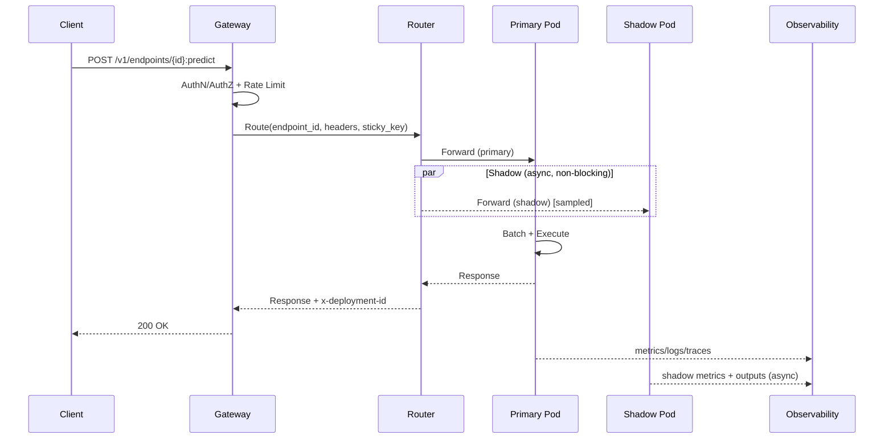
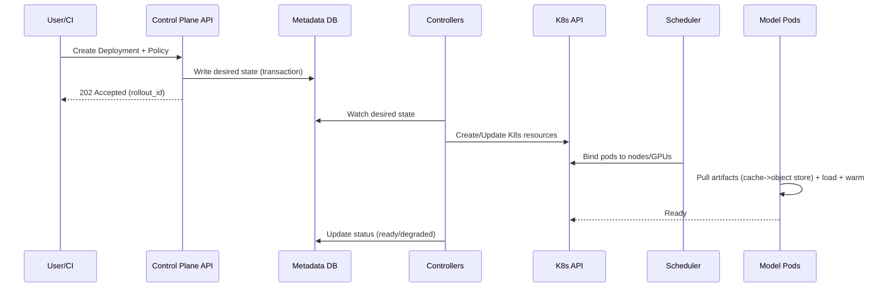

## Overview

A model serving platform reliably hosts **thousands of heterogeneous ML models** (CPU classifiers, GPU embedding models, and multi-GPU LLMs) while meeting strict **tail-latency SLOs**, controlling **GPU cost**, and enabling **safe rollouts** (canary, blue/green, shadow). “Inference” is not a single workload: models vary dramatically in **memory footprint**, **load time**, **batching characteristics**, **hardware constraints** (GPU type/MIG), and **runtime dependencies**—so naive scheduling and autoscaling can waste GPUs or trigger cascading latency failures.

This design separates the system into:

- A **strongly consistent control plane**: model registry metadata, deployment intent, traffic policy, authZ, quotas, and rollout state.
- A **high-performance data plane**: routing, load shedding, batching, and execution, operating from a cached view of control-plane state.

Cold starts are treated as first-class: we reduce them via **prewarmed capacity**, **node-local artifact caches**, and **load-budgeted rollouts** (controlling concurrent loads per node/GPU) instead of hoping autoscaling hides them.

---

## Requirements

### Functional Requirements
- Register and version models (artifacts + metadata), with immutable versions and provenance.
- Create and manage deployments (replicas, resources, runtime, env, secrets).
- Route inference traffic to endpoints with weighted splits (A/B, canary) and **shadow** duplication.
- GPU-aware scheduling: place replicas on compatible accelerators (type, memory, MIG) with quotas, priorities, and (optional) preemption.
- Autoscale deployments based on QPS/latency/queue depth/GPU utilization, including scale-to-zero for rarely used models.
- Reduce cold-start latency with warm pools, artifact caching, and preloading policies.
- Observability: per-model latency/error/throughput, GPU metrics, and shadow comparison reports.
- Multi-tenant isolation: authN/authZ, per-tenant quotas, audit logs, and cost/usage metering.

### Non-Functional Requirements (Targets)
#### Scale (Concrete)
- Model catalog: **5,000–20,000** model versions.
- Active endpoints: **~1,000**.
- Traffic:
  - “Small/medium” models: **50k QPS avg**, **200k QPS peak**.
  - LLM endpoints: **~500 QPS** aggregate peak (typically fewer endpoints, higher cost per request).
- Concurrency: **10k** concurrent clients.
- Artifacts: **10–50 TB** total weights; individual artifacts **50 MB–200 GB** (LLMs / sharded weights).

#### Latency (SLOs)
- Small/medium warmed inference (non-streaming):
  - **P50: 20–50 ms**, **P99: 150–250 ms** (includes routing + network + runtime)
- LLM streaming (warmed):
  - **Time-to-first-token (TTFT)**: **P50 300–800 ms**, **P99 1.5–3.0 s** (model-size dependent)
  - **Steady-state throughput**: target **20–150 tok/s** per replica depending on model/GPU and prompt/output sizes
- Cold start (first successful request after scale-from-zero / new rollout):
  - Small models: **<3 s** target (node cache hit), **<10 s** acceptable (cache miss)
  - Large models: **<20–90 s** depending on artifact size, sharding, and GPU availability (optimize to “ready-to-serve”, not “pod scheduled”)

#### Availability
- Data plane (routing + warmed inference): **99.99%** per region.
- Control plane APIs: **99.9%** (deployment operations tolerate retries; inference must not depend on CP).

#### Consistency
- **Strong**: model registry metadata, deployment intent, traffic policy, authZ decisions, quota configuration.
- **Eventual**: metrics aggregation, shadow analysis, usage/billing rollups, dashboards.

#### Durability
- Artifacts: **11 9s** (object storage).
- Metadata RPO: **≤ 1 minute**; RTO: **≤ 30 minutes** (regional failover).
- Inference logs: optional; tenant-configurable retention; PII redaction support.

### Constraints & Assumptions
- Kubernetes-based deployment (cloud or on-prem) with NVIDIA GPUs; optional MIG enabled.
- Operate a small set of core services: control plane, router/gateway, scheduler, telemetry.
- Compliance: encryption in transit/at rest, auditability, tenant isolation; optional PII handling controls.
- Cost pressure: GPU utilization is a key KPI; platform supports quotas, priorities, and (optional) preemption.

### Out of Scope (Explicit)
- Model training pipelines (covered by separate MLOps systems).
- Feature store implementation (can integrate, but not required).
- Full experiment tracking beyond version provenance metadata.

---

## High-Level Architecture

```mermaid
graph TD
  %% External
  C[Clients] --> LB[Edge LB / API Gateway]

  %% Data plane
  subgraph DP[Data Plane (Latency-Critical)]
    LB --> GW[Inference Gateway<br/>AuthN/AuthZ, Rate Limits]
    GW --> RT[Model Router<br/>Split/Sticky/Shadow]
    RT -->|primary| MP[Model Pods<br/>Triton / vLLM / TGI]
    RT -.->|shadow async| SMP[Shadow Model Pods]
    MP --> RC[(Optional Result Cache)]
    MP --> MET[Metrics/Logs/Traces]
  end

  %% Control plane
  subgraph CP[Control Plane (Strong Consistency)]
    API[Control Plane API<br/>Models/Deployments/Policies] --> DB[(Metadata DB<br/>Postgres)]
    API --> OBJ[(Artifact Store<br/>S3/GCS/MinIO)]
    API --> POL[Policy Engine<br/>OPA/Rego]
    CTRL[Reconcilers/Controllers] --> K8S[Kubernetes API]
    SCH[GPU Scheduler / Placement<br/>Extender or Controller] --> K8S
    API --> BUS[(Event Bus<br/>Kafka/PubSub)]
  end

  %% Cross-plane links
  GW -->|token keys/policies cache| API
  RT -->|watch policies/endpoints| API
  MP -->|pull weights| OBJ
  MP -->|node-local cache| NC[(Node NVMe Cache)]
  MET --> OBS[Observability Stack<br/>Prometheus/Tempo/Loki]
```

**Key property**: the data plane routes and serves using a **locally cached, last-known-good** routing table. Control plane outages should not break warmed inference.

---

## Core Concepts

### Model, Version, Deployment, Endpoint
- **Model**: a named logical artifact (e.g., `fraud_detector`).
- **Model Version**: immutable, content-addressed artifact + runtime + signature + requirements.
- **Deployment**: a runnable configuration of a model version (resources, autoscaling, warm minimum, placement constraints).
- **Endpoint**: a stable client-facing address that routes to one or more deployments via a traffic policy.

### Rollout Patterns
- **Canary**: weighted split with automated rollback on SLO regression.
- **Blue/Green**: switch between two isolated stacks for risky runtime changes.
- **Shadow**: duplicate a sampled copy of production traffic to a candidate deployment asynchronously; never impacts primary latency.

---

## Component Deep-Dive

### Control Plane API
**Responsibility**: Source of truth for models, versions, endpoints, deployments, traffic policies, quotas, and rollout state.

**Key Design Decisions**
- Strongly consistent metadata store (Postgres) + K8s-style reconciliation (desired → actual) to avoid snowflake state.
- Traffic policies are **versioned** and updated with optimistic concurrency (ETags / `If-Match`) for safe rollbacks.
- Policy evaluation (authZ, quotas, routing constraints) uses a policy engine (OPA) with cached decisions where safe.

**Implementation Notes**
- Store only pointers and digests for artifacts; avoid moving multi-GB blobs through control plane.
- Expose read-only watch/stream endpoints (SSE/gRPC streams) for routers to receive incremental updates.

**Scaling**
- Stateless API replicas behind L7.
- Read-heavy caching for common GET/LIST (Redis) with careful TTLs; writes always go to DB.

---

### Inference Gateway
**Responsibility**: AuthN/authZ enforcement, request normalization (JSON/Protobuf), admission control, tenant quotas, rate limiting, request tracing.

**Key Design Decisions**
- Protect the fleet using **multi-level admission control**:
  - Tenant-level RPS and concurrency limits.
  - Endpoint-level limits and max-inflight.
  - Optional global “brownout” mode when capacity is constrained.
- Keep overhead low: target **<1 ms P50** processing in steady state.

**Scaling**
- Stateless, horizontally scalable; autoscale on CPU and RPS.
- Use mTLS internally; validate JWT/OIDC tokens and attach tenant identity to request context.

---

### Model Router (Data Plane Control)
**Responsibility**: Low-latency endpoint resolution, weighted splits, sticky routing, shadow duplication, backend selection, and runtime hints (batching class, max deadline).

**Key Design Decisions**
- Maintain an in-memory routing table updated via **push/watch** (no DB hits on request path).
- Shadow is implemented as an **asynchronous fork** with independent timeouts; it never blocks primary responses.
- For sticky routing (sessions), use consistent hashing on `(endpoint_id, sticky_key)` when required.

**Scaling**
- Stateless; scale with RPS.
- For hot endpoints, optionally shard routing by endpoint ID (or run dedicated router pool per tenant).

---

### GPU Scheduler / Placement
**Responsibility**: Place model replicas on nodes/GPUs respecting constraints (GPU type, memory, MIG profile, topology), while maximizing utilization and enforcing fairness.

**Key Design Decisions**
- Separate “what to run” (deployment intent) from “where to run” (placement).
- Bin-pack with constraints:
  - GPU memory (including fragmentation), compute capability, MIG profiles.
  - Optional topology awareness (NVLink) for tensor-parallel LLMs.
  - Anti-affinity across zones/nodes for correlated failures.
- Use **disruption budgets** to limit churn during consolidation/rebalancing.

**Implementation Options**
- Kubernetes scheduler extender or custom controller (e.g., using node labels + extended resources + device plugin signals).
- Integrate with quota systems (Kueue/Volcano) for fair sharing and priority.

**Degraded Mode**
- If ideal GPU is unavailable, optionally place on “compatible but suboptimal” GPUs when policy allows (with explicit annotation and alerting).

---

### Model Pods (Runtime)
**Responsibility**: Execute inference (CPU/GPU), manage model loading, batching, and runtime optimizations (TensorRT, ONNX Runtime, Triton, vLLM/TGI).

**Key Design Decisions**
- Standardize runtimes:
  - **Triton** for classical models (ONNX/TensorRT/TF/PyTorch backends).
  - **vLLM/TGI** for LLMs (continuous batching, KV cache management).
- Treat loading as a controlled phase:
  - Per-node/GPU **load budgets** (max concurrent loads) to avoid IO storms.
  - Readiness gates only open traffic when model is fully loaded and warmed (optional warm-up queries).

**Performance Features**
- Dynamic batching for throughput; max batching delay bounded by request deadlines.
- Support model parallelism for large models (tensor parallel, pipeline parallel where applicable).

---

### Artifact Store & Node Cache
**Responsibility**: Durable storage and efficient distribution of model artifacts.

**Key Design Decisions**
- Store artifacts content-addressed (digest) to ensure immutability and safe caching.
- Maintain node-local NVMe cache to avoid repeated multi-GB downloads during scaling.
- Validate artifacts on load (checksum) and enforce signed provenance where required.

---

### Observability & Analytics
**Responsibility**: Metrics, logs, traces, and offline analyses (shadow diffs, cost attribution).

**Key Design Decisions**
- Emit golden signals per endpoint/deployment:
  - latency, errors, RPS, saturation (GPU util/mem), queue depth
- Shadow analysis pipeline is out-of-band:
  - compare outputs (domain-specific diff), latency distributions, and error rates

---

## Data Model

### Logical Schema (Control Plane)

**tenants**
- `tenant_id` (UUID, PK)
- `name` (string, unique)
- `created_at`

**models**
- `model_id` (UUID, PK)
- `tenant_id` (UUID, index)
- `name` (string, unique per tenant)
- `task_type` (enum: classification, embedding, llm, ...)
- `created_at`, `updated_at`

**model_versions**
- `version_id` (UUID, PK)
- `model_id` (UUID, FK)
- `artifact_uri` (string; object store URI)
- `artifact_digest` (string; sha256/sha512)
- `runtime` (enum: triton, onnx, vllm, tgi, custom)
- `signature` (json: inputs/outputs, dtypes, shapes)
- `requirements` (json: min_gpu_mem_gb, gpu_type_allowlist, mig_profile, topology)
- `created_by`, `created_at`

**endpoints**
- `endpoint_id` (UUID, PK)
- `tenant_id` (UUID, index)
- `name` (string)
- `auth_policy_id` (UUID)
- `created_at`

**deployments**
- `deployment_id` (UUID, PK)
- `endpoint_id` (UUID, index)
- `version_id` (UUID)
- `resources` (json: cpu, mem, gpu_count, gpu_type, mig_profile)
- `min_warm_replicas` (int)
- `max_replicas` (int)
- `autoscaling_policy` (json: target_qps, target_gpu_util, max_queue_ms, scale_to_zero_idle_s)
- `rollout_policy` (json: max_unavailable, max_surge, load_budget_per_node)
- `status` (enum: pending, ready, degraded, failed)
- `created_at`, `updated_at`

**traffic_policies**
- `policy_id` (UUID, PK)
- `endpoint_id` (UUID, index)
- `primary_rules` (json: weights by deployment_id)
- `shadow_rules` (json: sample_rate, shadow_deployment_id, timeout_ms, headers)
- `sticky_key` (string nullable)
- `version` (int)
- `updated_at`

**quotas**
- `tenant_id` (UUID, PK)
- `max_gpu` (int)
- `max_qps` (int)
- `max_endpoints` (int)
- `priority_class` (string)
- `updated_at`

**audit_log** (append-only)
- `ts`, `tenant_id`, `actor`, `action`, `resource_type`, `resource_id`, `diff` (json)

### Analytics / Metering (Eventual)
**usage_samples** (append-only)
- `ts_bucket` (time)
- `tenant_id`, `endpoint_id`, `deployment_id`
- `requests`, `errors`, `gpu_ms`, `cpu_ms`, `egress_bytes`

---

## Request & Control Flows

### Inference (Primary + Shadow)



### Deploy / Rollout (Desired → Actual)



---

## API Design

### Conventions
- JSON for control plane; inference supports JSON and Protobuf (preferred for performance).
- Idempotency:
  - Mutating operations: `Idempotency-Key` supported (required for deployments).
  - Inference: optional `x-request-id` for safe retries + optional response cache (only for deterministic workloads).

### Register Model Version
`POST /v1/models/{modelName}/versions`

Request:
```json
{
  "artifact_uri": "s3://ml-artifacts/tenantA/fraud/v17/model.tar.gz",
  "artifact_digest": "sha256:...",
  "runtime": "triton",
  "signature": { "inputs": [{"name":"x","dtype":"fp32","shape":[1,128]}], "outputs": [{"name":"y","dtype":"fp32","shape":[1,2]}] },
  "requirements": { "min_gpu_mem_gb": 8, "gpu_type_allowlist": ["A10","L4"], "mig_profile": null }
}
```

Response: `201 { "version_id": "...", "model_id": "..." }`

Errors: `400` invalid signature, `403` policy, `409` duplicate digest/name, `413` artifact policy violation.

---

### Create/Update Deployment
`PUT /v1/endpoints/{endpointId}/deployments/{deploymentId}`

Request:
```json
{
  "version_id": "uuid",
  "resources": { "cpu": "2", "mem": "4Gi", "gpu_count": 1, "gpu_type": "L4", "mig_profile": "1g.10gb" },
  "min_warm_replicas": 2,
  "max_replicas": 20,
  "autoscaling_policy": { "target_qps": 200, "target_gpu_util": 0.65, "max_queue_ms": 50, "scale_to_zero_idle_s": 1800 },
  "rollout_policy": { "max_unavailable": 0, "max_surge": 1, "load_budget_per_node": 1 }
}
```

Response: `202 { "deployment_id": "...", "status": "pending", "rollout_id": "..." }`

Errors: `409` incompatible runtime/resources, `422` quota exceeded, `503` insufficient capacity.

---

### Set Traffic Policy (Canary/Shadow)
`PUT /v1/endpoints/{endpointId}/traffic`

Headers: `If-Match: <policy_version>`

Request:
```json
{
  "primary_rules": { "dep_A": 0.95, "dep_B": 0.05 },
  "shadow_rules": { "shadow_deployment_id": "dep_B", "sample_rate": 0.02, "timeout_ms": 1500, "headers": { "x-shadow": "1" } },
  "sticky_key": "user_id"
}
```

Response: `200 { "policy_id": "...", "version": 42 }`

Errors: `400` bad weights, `409` unknown deployment, `412` version mismatch.

---

### Predict
`POST /v1/endpoints/{endpointId}:predict`

Request (JSON or Protobuf). Response headers include:
- `x-request-id`
- `x-deployment-id`
- `x-model-version-id`

Errors: `401/403`, `404`, `429`, `503` (no ready replicas), `504` (deadline exceeded).

---

## Scaling & Performance

### Capacity Planning (Back-of-the-Envelope)
Use Little’s Law: `concurrency ≈ QPS × latency`.

Example for small models:
- Peak: **200k QPS**
- Target service time (p50): **30 ms** ⇒ average concurrency ≈ `200k × 0.03 = 6,000` in-flight.
If a single replica can sustainably handle **2,000 QPS** at target latency, you need ~`200k/2k = 100` replicas plus headroom.

Example for LLMs:
- Throughput is typically **tokens/sec constrained**, not QPS.
- Capacity planning should be based on:
  - prompt+completion token distributions
  - TTFT SLO
  - max concurrent sequences per replica (KV cache + memory bound)

### Bottlenecks and Mitigations
- **Cold starts (download + load + warm)**:
  - Node-local NVMe cache, content-addressed artifacts, load budgets, prewarm pools.
- **GPU fragmentation**:
  - Constrain GPU SKU sprawl, use MIG profiles where appropriate, periodic consolidation with disruption budgets.
- **Tail latency under burst**:
  - Admission control, bounded queues, request deadlines, dynamic batching with max delay, request shedding.
- **Noisy neighbors**:
  - Separate node pools for LLMs vs classical models; per-tenant quotas; priority classes.

### Autoscaling Strategy
- Gateway/Router: scale on CPU/RPS; keep p99 routing overhead low.
- Model Pods:
  - scale on **queue depth + GPU utilization + request latency**
  - use scale-to-zero only when cold-start budgets are acceptable and warm pools exist
- Prefer **queue-based signals** (e.g., time-in-queue) over raw CPU for GPU workloads.

### Caching Strategy
- Artifact caching:
  - node-local content-addressed cache; verify digest; eviction via LRU + size budget
- Result caching (optional):
  - `(endpoint_id, version_id, input_hash)` keyed; tenant-configurable TTL; only for deterministic/approved endpoints
- Cache invalidation:
  - versioned routing makes invalidation safe: new versions naturally create new keys

---

## Consistency Model (Applied)
- Traffic policy updates are strongly consistent in the control plane but **propagate to routers asynchronously** via watch streams.
- Routers apply updates in-order (per endpoint) and keep a **last-known-good** snapshot to survive control plane outages.
- Acceptable staleness:
  - Routing updates: target **<1–5 seconds** propagation in steady state; routers expose “policy_version_in_use” metrics.
- Metrics/usage are eventual:
  - reconcile billing from append-only samples; tolerate delayed or duplicate events via idempotent aggregation.

---

## Security, Privacy, and Multi-Tenancy

### Isolation
- Per-tenant authZ on all control plane resources; deny-by-default.
- Optional dedicated node pools for high-sensitivity tenants (hard isolation).
- Resource quotas: GPUs, QPS, endpoints, and concurrency caps.

### Data Protection
- mTLS between gateway/router/pods; encrypt at rest for DB and object store.
- Artifact integrity: digest verification; optional signature verification (SLSA-style provenance).
- Inference logs:
  - configurable sampling; PII redaction hooks; per-tenant retention policies.

### Abuse Controls
- Rate limits and request size limits (especially for LLM prompts).
- WAF rules at edge; anomaly detection on traffic spikes per tenant.

---

## Trade-offs & Alternatives

### Key Trade-offs Made
- **Kubernetes-centric runtime**
  - Pros: portability, mature ecosystem (GPU Operator, autoscaling, controllers), operational familiarity.
  - Cons: some overhead vs bare-metal; GPU topology optimizations can be harder.
- **Strong control plane + fast cached data plane**
  - Pros: predictable tail latency; inference continues during CP incidents; fewer DB dependencies.
  - Cons: watch streams, cache coherency, and versioning add complexity.
- **Standardized runtimes (Triton + vLLM/TGI)**
  - Pros: fewer incident modes; better batching/utilization; consistent metrics.
  - Cons: less flexibility for bespoke servers; requires adaptation layer for edge cases.
- **Shadow as async fork**
  - Pros: protects latency SLOs; avoids coupling candidate health to primary.
  - Cons: harder to guarantee identical execution environment; comparisons must be best-effort.

### Alternatives
- **Fully managed serving (cloud-specific)**: faster to start; less control over GPU packing and multi-tenant policy; potential lock-in.
- **Serverless per-request inference (FaaS)**: simpler UX; typically poor GPU utilization and severe cold starts for large models.
- **Ray Serve primary orchestrator**: strong for Python workflows; introduces a second scheduling plane and can complicate strict multi-tenancy on K8s.
- **Monolithic “model mesh”**: simpler routing; can become an upgrade bottleneck and limit runtime diversity.

---

## Failure Modes & Mitigations

### Failure Scenarios (Examples)
1) **GPU node failure / ECC/XID errors**
- Impact: replica loss; localized 5xx/latency spikes.
- Detection: node health + DCGM metrics; pod evictions; repeated XID alerts.
- Mitigation: zone spreading; fast reschedule; min warm replicas; node quarantine; circuit-break unhealthy nodes.

2) **Thundering herd cold starts after traffic shift**
- Impact: elevated p99, timeouts, object-store saturation.
- Detection: cold-start counters; artifact download throughput; readiness delays.
- Mitigation: load-budgeted rollout controller; staged traffic ramp; prewarm before shifting; cache priming.

3) **Bad model version (crash/OOM/wrong outputs)**
- Impact: endpoint degradation or correctness issues.
- Detection: CrashLoopBackOff/OOMKilled; SLO regression; shadow diff alarms; domain-specific validation.
- Mitigation: canary + auto rollback; per-version kill switch; output validation gates; resource guardrails.

4) **Control plane outage**
- Impact: cannot deploy/change traffic; inference should continue.
- Detection: API errors, DB alerts, controller lag.
- Mitigation: routers use last-known-good policies; cached auth keys; reconcile resumes after recovery.

5) **Router overload**
- Impact: increased request latency/503.
- Detection: router CPU, queueing, timeouts, drop counters.
- Mitigation: scale out routers; push admission control to gateway; isolate hot endpoints; enable request shedding.

6) **Artifact store degradation / regional outage**
- Impact: cold starts fail; new rollouts stall; warmed traffic unaffected.
- Detection: increased artifact download errors; cache miss latency spikes.
- Mitigation: cross-region replication; prefer node cache; prewarm critical models; fall back to serving last loaded version where safe.

### Disaster Recovery
- Targets: **RTO 30 minutes**, **RPO 1 minute** for metadata; artifacts RPO ~0 with replicated object storage.
- Backups: continuous WAL archiving; daily snapshots; restore verification weekly.
- Failover:
  - Control plane warm-standby in secondary region.
  - Data plane can run active/active with regional endpoints; global traffic manager shifts DNS/LB.

---

## Operational Considerations

### Monitoring & Alerting (Minimum Set)
- Golden signals per endpoint/deployment:
  - RPS, error rate, p50/p95/p99 latency, queue time, saturation (GPU util/mem), ready replicas
- Cold-start KPIs:
  - cold-start count, time-to-ready, download time, load time, cache hit rate
- GPU health:
  - DCGM metrics, ECC, throttling, temperature, XID frequency
- Control plane:
  - DB replication lag, controller queue lag, watch stream disconnect rate, policy propagation delay

Example alerts:
- p99 latency > SLO for 5 minutes (per endpoint tier)
- 5xx > 1% for 2 minutes
- No ready replicas for an endpoint receiving traffic
- GPU util > 95% with rising queue depth (overload) or GPU util < 20% in expensive pools (waste)

### Deployment & Change Management
- Progressive delivery:
  - Canary: 1% → 5% → 25% → 50% with automated rollback
  - Shadow: sampled duplication + diff budgets; promotion gated on regressions
  - Blue/green: for runtime upgrades or ABI changes
- Schema migrations:
  - backward compatible; dual-read where needed; routers tolerate both policy versions

### Runbooks (What On-Call Needs)
- “Endpoint 503: no ready replicas” checklist (capacity, quota, rollout stuck, node health).
- “p99 spike” checklist (router saturation, queue growth, batching misconfig, GPU throttling).
- “Cold start explosion” checklist (artifact cache miss storm, object store errors, rollout budgets).

---

## References & Further Reading
- NVIDIA Triton Inference Server: https://github.com/triton-inference-server/server
- vLLM (continuous batching for LLMs): https://github.com/vllm-project/vllm
- Text Generation Inference (TGI): https://github.com/huggingface/text-generation-inference
- KServe (Kubernetes model serving): https://kserve.github.io/website/
- Kubernetes device plugins & GPU Operator: https://docs.nvidia.com/datacenter/cloud-native/gpu-operator/
- “The Tail at Scale” (latency engineering): https://research.google/pubs/pub40801/
- Borg/Omega scheduling concepts: https://research.google/pubs/pub43438/