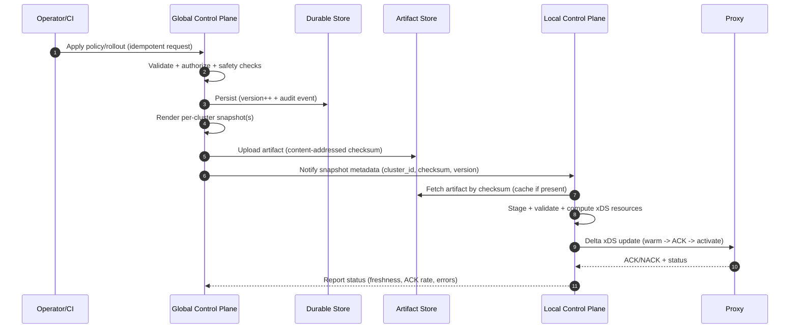

## Overview

A multi-cluster service mesh for hybrid cloud (on‑prem + multiple public clouds) provides a **uniform security model (mTLS + workload identity)**, **consistent traffic policy (routing, failover, progressive delivery)**, and **end-to-end observability** across clusters that do not share a flat network and may be intermittently partitioned.

The central design constraint is: **the data plane must keep making fast local decisions even if the WAN or global services are down**, while the control plane must safely distribute configuration, identities, and trust bundles at scale with strong auditability.

A production-ready approach is **global intent + local execution**:

- **Cluster-local control planes** perform latency-sensitive tasks (xDS serving, local service discovery, policy compilation, certificate/SVID retrieval via local agents, local status) and continue operating during partitions with **last-known-good** config.
- A **global control plane** owns “intent” (policies, federation rules, trust domain configuration, rollout orchestration) and distributes **versioned, immutable snapshots** to each cluster over a secure sync channel.

This model scales linearly with cluster count, tolerates partitions, supports gradual adoption, and keeps operational blast radius small.

---

## Requirements

### Functional Requirements

- **Identity + mTLS**
  - Issue and rotate workload certificates/SVIDs and enforce mTLS for in-mesh traffic.
  - Support multiple trust domains (e.g., per environment or business unit) and controlled federation.
- **Traffic management**
  - L7 routing (headers, paths), timeouts, retries, circuit breaking, outlier detection.
  - Locality-aware routing with health-based failover across clusters/regions.
- **Progressive delivery**
  - Canary/blue-green across services and across clusters with analysis gates and automatic rollback.
- **Service discovery & federation**
  - Explicit service export/import; prevent accidental global exposure.
  - Cross-cluster endpoint selection without distributing every endpoint to every cluster.
- **Authorization**
  - Zero-trust authz between services (RBAC/ABAC) and at mesh ingress/egress boundaries.
- **Observability**
  - Metrics (golden signals), traces, access logs with correlation IDs and tenant-aware access control.
- **Multi-tenancy**
  - Tenant scoping for policies and telemetry; audit trails for all changes.
- **Operator UX**
  - Management API/UI, status, rollout health, certificate health, debugging tools.

### Non-Functional Requirements (SLO Targets)

- **Scale (initial target, 12–18 months)**
  - 50 Kubernetes clusters (mix of on‑prem + managed cloud), ~10,000 nodes total
  - ~200,000 workloads (pods/VM workloads in mesh)
  - ~5,000–15,000 services total (order of magnitude; depends on org topology)
  - ~200,000–400,000 endpoints mesh-wide (≈ workloads; plus headroom for churn)
  - Peak deploy events: up to ~10,000 proxy config updates/min mesh-wide (spiky)
  - Data-plane: ~1,000,000 RPS aggregate mesh-wide (bursty), and 20,000–200,000 concurrent connections per large cluster
- **Latency**
  - Policy propagation (operator action → effective on most proxies):
    - P50: ≤ 10s, P99: ≤ 60s (global → local → proxy), with per-cluster observability of staleness
  - In-cluster request overhead attributable to mesh:
    - P50: < 2ms, P99: < 10ms (proxy processing + mTLS), assuming Envoy-class proxies and typical L7 filters
  - Cross-cluster: mesh overhead should be small relative to WAN; budget proxy+policy overhead < 5ms P99 on top of network
- **Availability**
  - Data plane: 99.99% (requests continue during control-plane outages)
  - Cluster-local control plane: 99.95% per cluster
  - Global intent layer: 99.9% (no impact to existing traffic on outage)
- **Consistency**
  - Traffic policy: eventual consistency acceptable (seconds to a minute) with **monotonic per-proxy config versions** and safe rollback
  - Identity/trust: **strongly controlled** changes (root/trust bundle) with staged rollout and explicit approvals; convergence measured and enforced
- **Durability**
  - Policies + audit logs: no data loss (multi-AZ durable storage)
  - Telemetry: best-effort with buffering; partial loss acceptable under overload

### Constraints & Assumptions

- No assumption of flat L3 connectivity between clusters; cross-cluster traffic may traverse gateways and NAT.
- Partitions happen (WAN, VPN, cloud interconnect); **each cluster must remain functional in isolation**.
- Small platform team (6–10 engineers): prefer proven components and standards (xDS, Envoy, SPIFFE, OpenTelemetry).
- Compliance: SOC2-like auditability; some environments enforce telemetry egress controls/data residency.

---

## Architecture

### High-Level System

```mermaid
flowchart TB
  subgraph ClusterA["Cluster A"]
    AWork["Workload A"]
    AProxy["Proxy (sidecar/ambient)"]
    ALCP["Local Control Plane (xDS + policy compiler)"]
    ASpireAgent["Identity Agent (SPIFFE/SVID)"]
    AOTel["OTel Collector (edge)"]
    AAPI["Kubernetes API"]
    AWork <--> AProxy
    AProxy <-->|xDS (ADS/Delta)| ALCP
    AProxy <-->|mTLS| AProxy
    AProxy -->|telemetry| AOTel
    ALCP <-->|watch| AAPI
    AWork -->|SVID request| ASpireAgent
    AProxy -->|SVID/mTLS keys| ASpireAgent
  end

  subgraph ClusterB["Cluster B"]
    BWork["Workload B"]
    BProxy["Proxy (sidecar/ambient)"]
    BLCP["Local Control Plane (xDS + policy compiler)"]
    BSpireAgent["Identity Agent (SPIFFE/SVID)"]
    BOTel["OTel Collector (edge)"]
    BAPI["Kubernetes API"]
    BWork <--> BProxy
    BProxy <-->|xDS (ADS/Delta)| BLCP
    BProxy -->|telemetry| BOTel
    BLCP <-->|watch| BAPI
    BWork -->|SVID request| BSpireAgent
    BProxy -->|SVID/mTLS keys| BSpireAgent
  end

  subgraph Global["Global (Multi-Region)"]
    GCP["Global Control Plane (intent + orchestration)"]
    Store[("Durable Store (Postgres/etcd)")]
    Obj["Artifact Store (Object Storage/CDN)"]
    Registry["Global Service Index (summaries)"]
    Trust["Trust Authority (Root/Intermediate via KMS/HSM/Vault)"]
    Telemetry["Telemetry Backend (Prometheus/Mimir, Tempo/Jaeger, Loki/ELK)"]
  end

  GCP <--> Store
  GCP --> Obj
  GCP <--> Registry
  GCP <--> Trust

  ALCP <-->|mTLS sync| GCP
  BLCP <-->|mTLS sync| GCP
  ALCP -->|fetch snapshot by checksum| Obj
  BLCP -->|fetch snapshot by checksum| Obj

  AOTel --> Telemetry
  BOTel --> Telemetry
```

### Control Plane vs Data Plane Responsibilities

- **Data plane (proxies)**
  - Enforces mTLS, routing, retries/timeouts, authz filters, telemetry emission.
  - Must keep operating with cached config even if xDS is unavailable.
- **Cluster-local control plane**
  - Converts global intent into xDS resources; watches local K8s for endpoints; maintains local health view.
  - Maintains **cache + last-known-good** snapshot and safe staged application.
- **Global control plane**
  - Validates intent, stores versions, orchestrates rollouts, manages federation rules and trust bundle lifecycle.
  - Publishes immutable per-cluster artifacts (snapshots) and metadata to local control planes.

---

## Components

### 1) Global Control Plane (Intent Layer)

**Responsibilities**
- API/UI for policies, rollouts, service export/import, trust bundle management
- Validation/admission (schema + safety checks + authorization)
- Snapshot rendering per cluster (and per tenant if needed)
- Rollout orchestration (step progression, analysis gates, automated rollback)
- Audit log emission and query

**Key design points**
- **Declarative intent → rendered snapshots**: local controllers don’t interpret high-level intent; they apply concrete artifacts.
- **Immutable artifacts**: snapshots are content-addressed (checksum) for cacheability and deterministic rollback.
- **Safety rails**:
  - Schema validation + semantic validation (e.g., retry budgets, forbidden wildcard exports)
  - “Two-person rule” for trust/root changes (break-glass path logged and time-bound)

**Typical implementation**
- Kubernetes-style API + controllers (Go) or standalone control plane with CRD integration
- Backing store: Postgres (strong auditing/querying) or etcd (if tightly K8s-native); both can work—pick based on org ops maturity
- Policy engine: OPA/Rego or CEL for admission checks and tenant scoping

### 2) Cluster-Local Control Plane (Execution Layer)

**Responsibilities**
- Serve xDS (ADS/Delta xDS) to proxies; keep connections local to the cluster
- Watch local endpoints (K8s Endpoints/EndpointSlice) and synthesize locality-aware routing
- Apply snapshots safely:
  - stage → validate → warm → activate
  - rollback by pointer switch to previous active snapshot

**Key design points**
- **Partition tolerant**: if global is down, local continues serving last-known-good.
- **Push debouncing**: avoid update storms during endpoint churn and deployments.
- **Blast radius control**: failures in one cluster shouldn’t destabilize others.

**Typical implementation**
- Istio-like model (pilot-equivalent) or bespoke xDS server
- Cache layer (in-memory + optional Redis) for computed artifacts and hot xDS resources
- Horizontal scaling: multiple replicas; proxies connect to a stable service VIP; shard by proxy ID if needed

### 3) Identity & PKI (SPIFFE/SPIRE-style)

**Responsibilities**
- Issue short-lived workload identities (SVIDs) bound to workload identity (service account/attestation)
- Distribute trust bundles for mTLS verification
- Support trust domain federation (explicit allow-lists)

**Key design points**
- **Short-lived leaf certs** (e.g., 4–24h): reduces blast radius and makes revocation less central.
- **Staged trust bundle updates**:
  - publish new root/intermediate alongside old
  - enforce dual-trust period
  - retire old after convergence is verified

**Typical implementation**
- SPIRE Server per cluster/region + SPIRE Agents on nodes
- Root/intermediate protected by KMS/HSM/Vault
- Bundle distribution via the same secure artifact channel or dedicated trust bundle API

### 4) Service Discovery & Federation

**Responsibilities**
- Explicit service export/import (Mesh/MCS-style)
- Cross-cluster routing decisions based on:
  - health and outlier detection
  - locality preference (same-zone/region first)
  - policy (failover order, allowed destinations)
- Avoid global endpoint explosion

**Key design points**
- **Summarize globally, resolve locally**:
  - global index stores per service: which clusters have it, health summary, priority
  - local cluster keeps full endpoint detail for its own workloads
- **Health stability**: use hysteresis/hold-down timers to avoid rapid oscillation during partial outages.

### 5) Observability Pipeline (OpenTelemetry)

**Responsibilities**
- Collect: proxy metrics/traces/logs (+ optional app telemetry)
- Process: sampling, aggregation, redaction, multi-tenant labeling
- Store/query: metrics/traces/logs with access controls and retention

**Key design points**
- **Protect the data plane**: bounded queues, backpressure, and drop policies that prioritize correctness over completeness under overload.
- **Cardinality control**: label allow-lists, exemplar-based debugging, tail sampling for traces.

---

## Data Model

### Core Resources (Logical Model)

- **Policy**
  - `TrafficPolicy`: routes, retries, timeouts, outlier detection, rate limiting, canary weights
  - `AuthPolicy`: identities allowed to call, per-method/path rules
  - `ServiceExport/Import`: explicit federation configuration
- **TrustBundle**
  - `trust_domain`, roots/intermediates, validity windows, rotation state
- **Rollout**
  - steps, analysis gates, current step, rollback reason, audit linkage
- **ClusterSnapshot**
  - `snapshot_id`, `cluster_id`, `source_version`, artifact checksum, state (`staged|active|rolled_back`)

### Suggested Storage Schema (Relational-friendly)

- `global_config(id, kind, scope_tenant, scope_namespace, scope_service, spec_json, version, etag, created_at, updated_at, created_by)`
- `cluster_snapshot(snapshot_id, cluster_id, source_version, checksum, created_at, state, activated_at, rolled_back_at)`
- `trust_bundle(trust_domain, bundle_pem, not_before, not_after, rotation_state, updated_at)`
- `audit_log(event_id, ts, actor, action, resource_kind, resource_id, before_json, after_json, result, reason)`

---

## Data Flow

### Policy → Snapshot → Proxy (Control Path)



### Request Path (Data Plane)


---

## API Design

### Principles

- **Idempotent writes**: `Idempotency-Key` and/or `If-Match` with `ETag`.
- **Versioned resources**: clients can perform safe read-modify-write and detect conflicts.
- **Safe-by-default**: deny wildcards, require explicit exports, require staged trust changes.

### Example: Traffic Policy (REST)

`PUT /v1/policies/traffic/{policyId}`

Request:

```json
{
  "scope": { "tenant": "payments", "namespace": "payments", "service": "checkout" },
  "rules": [
    {
      "match": { "headers": { "x-user-tier": "beta" } },
      "route": [
        { "destination": "checkout-v2", "weight": 10 },
        { "destination": "checkout-v1", "weight": 90 }
      ],
      "timeoutsMs": 2000,
      "retries": { "attempts": 2, "perTryTimeoutMs": 500 }
    }
  ]
}
```

Response:

```json
{ "version": 1842, "etag": "W/\"1842\"", "status": "staged" }
```

Errors: `400` (validation), `403` (authz), `409` (etag conflict), `429` (rate limit)

### Example: Rollout (REST)

`POST /v1/rollouts`

Request:

```json
{
  "tenant": "payments",
  "namespace": "payments",
  "service": "checkout",
  "strategy": "canary",
  "steps": [
    { "weight": 5, "pauseSec": 300 },
    { "weight": 25, "pauseSec": 600 },
    { "weight": 50, "pauseSec": 900 }
  ],
  "analysis": { "p99LatencyMs": 200, "errorRatePct": 0.5 }
}
```

Response: `202 Accepted`

```json
{ "rolloutId": "rl_01J9C2P9H2Y8B7K4Z0", "statusUrl": "/v1/rollouts/rl_01J9C2P9H2Y8B7K4Z0" }
```

### Example: Trust Bundle Rotation (Staged)

`POST /v1/trust/rotate`

Request:

```json
{
  "trustDomain": "corp",
  "mode": "staged",
  "notAfter": "2027-01-01T00:00:00Z",
  "requiresApprovals": 2
}
```

Response: `202 Accepted` with a plan object (stages + deadlines). Enforce:
- Two-person approval
- Dual-trust period
- Convergence checks (handshake success rate, remaining old-bundle proxies)

### Cluster Registration (Bootstrap)

`POST /v1/clusters/register`

- Bootstrap with short-lived token + one-time CSR
- Return: endpoints, pinned server certs/roots, and a short-lived client cert to establish mTLS sync
- Rotate cluster credentials periodically; revoke on cluster decommission

---

## Scaling & Performance

### Where Systems Usually Break

- **xDS fanout storms**
  - Cause: mass proxy reconnects during deployments, node churn, or LCP restarts
  - Mitigations: localize xDS per cluster, delta xDS, push debouncing, connection keepalive tuning, per-tenant update budgets
- **Endpoint churn**
  - Cause: autoscaling, rolling updates, flapping readiness
  - Mitigations: EndpointSlice watch, aggregation windows, health hysteresis, outlier detection, locality failover without global endpoint distribution
- **Snapshot size / distribution**
  - Cause: large policy sets and many routes/clusters
  - Mitigations: content-addressed artifacts, object storage + CDN, per-tenant/per-namespace partitioning, incremental policy compilation
- **Telemetry cost / overload**
  - Cause: high-cardinality labels, full-fidelity tracing
  - Mitigations: label allow-lists, tail sampling, per-tenant quotas, edge aggregation, bounded buffering with explicit drop strategy

### Practical Capacity Notes (Rules of Thumb)

- Expect **one long-lived xDS stream per proxy** to the local control plane; size LCP accordingly.
- Keep snapshots small by:
  - scoping policies to namespaces/tenants
  - generating only necessary routes/clusters per proxy identity where feasible
- Prefer **summaries globally** (service -> clusters + health) to avoid global endpoint explosion.

### Caching Strategy

- **Proxies**: last-known-good config; warm clusters/routes before activation; NACK with reasons.
- **Local CP**: cache artifacts by checksum; cache computed xDS resources; serve stale under global outage.
- **Artifact distribution**: object store/CDN; immutable artifacts; rollback is pointer switch.
- **Discovery**: local authoritative endpoint caches; global index with short TTL (10–30s) for summaries.

---

## Trade-offs & Alternatives

### Trade-offs (What We Choose and What We Give Up)

1) **Global intent + local execution**
- Gain: partition tolerance, low latency, reduced blast radius
- Cost: more moving parts (global + per-cluster controllers), eventual consistency across clusters

2) **Snapshot-based distribution (immutable artifacts)**
- Gain: deterministic rollback, auditability, cacheability, safer rollouts
- Cost: artifact generation/storage overhead; careful snapshot size management

3) **Short-lived SVIDs over central revocation**
- Gain: smaller blast radius, simpler steady-state security posture
- Cost: higher issuance/renewal load; must harden identity agent/server scalability

4) **Explicit export/import for federation**
- Gain: prevents accidental exposure and enforces least privilege
- Cost: more operator effort; needs good tooling to avoid friction

### Alternatives (When You Might Pick Them)

- **Single global xDS control plane**
  - Simpler topology, but fragile over WAN and risky during partitions; can work in a single-region, well-connected environment.
- **Fully decentralized (cluster-only, no global intent)**
  - High autonomy, but policy drift and inconsistent security posture are common; progressive delivery across clusters becomes manual.
- **Ambient mesh / node-level data plane**
  - Reduces sidecar overhead and operational burden, but may constrain L7 features and identity semantics depending on maturity; often a later optimization.

---

## Failure Modes & Mitigations

### Core Failure Scenarios (Minimum Set)

1) **Global control plane outage**
- Impact: no new rollouts/policy changes; existing traffic should continue
- Detection: global API health, reconcile lag, snapshot publish backlog
- Mitigation: local CP continues serving cached snapshots; operators can apply scoped emergency overrides (time-bound, audited)

2) **Cluster-local control plane degradation/outage**
- Impact: proxies cannot fetch updates; existing config continues until TTL/rotation edges
- Detection: xDS disconnect rate, config freshness SLO, NACK spikes
- Mitigation: 3+ replicas, fast restart, stable service VIP, last-known-good retention in proxies, circuit breakers on xDS push

3) **Trust bundle / PKI incident (bad rotation or compromise)**
- Impact: widespread mTLS failures or security breach
- Detection: handshake failure rate, cert anomaly alerts, unexpected trust domain changes
- Mitigation: staged rotations with dual-trust, explicit approvals, emergency rollback bundle, strict root key protection (KMS/HSM), break-glass process with aggressive auditing

4) **Network partition (cluster ↔ cluster or cluster ↔ global)**
- Impact: cross-cluster calls fail; failover may over-trigger; global intent may lag
- Detection: synthetic probes, cross-cluster SLO burn, elevated retries/timeouts
- Mitigation: locality-first routing, health-based failover with hysteresis, circuit breaking, separate control sync retries, avoid global dependencies in request path

5) **Telemetry pipeline overload**
- Impact: missing telemetry and potential proxy/resource pressure
- Detection: collector queue depth, drop counters, proxy CPU/memory
- Mitigation: bounded queues, backpressure, sampling, per-tenant quotas, drop low-priority signals first, protect proxy CPU via filter limits

### Disaster Recovery (DR)

- **Global intent store**
  - Target RPO: ≤ 5 minutes, RTO: ≤ 1 hour
  - Multi-AZ deployment, PITR backups, periodic restore drills
- **Artifact store**
  - Multi-region replication; artifacts are immutable (easier to cache and recover)
- **Telemetry**
  - Best-effort; define explicit retention and acceptable loss under overload
- **Runbooks**
  - “Stop the bleeding”: freeze rollouts, pin snapshots, disable federation changes, enable break-glass only with approvals

---

## Operations

### Day-2 Monitoring (Golden Signals + Control Plane Health)

- **xDS**
  - Connected proxies, reconnection rate, push latency, ACK/NACK rate, config freshness (P50/P99)
- **Identity**
  - SVID issuance/renewal rate, renewal failures, cert expiry histogram, handshake failure rate by trust domain
- **Traffic**
  - Request rate, error rate, latency (P50/P95/P99), saturation, retry volume, outlier ejections
- **Rollouts**
  - Step progression, analysis pass/fail, auto-rollback counts, time-to-safe (deploy duration)
- **Federation**
  - Export/import counts, cross-cluster failovers, health summary convergence time

### Alerting (Examples)

- xDS NACK rate > 1% for 5 minutes (page)
- Config freshness P99 > 10 minutes (page)
- SVID renewal failures > 0.5% for 10 minutes (page)
- Sudden cross-trust-domain handshake failures (page)
- Error-budget burn for tier-0 services (multi-window SLO alerts)

### Deployment & Change Management

- Canary upgrades for global and local control plane components with automatic rollback on SLO regression.
- Snapshot activation gates:
  - schema validation → stage → proxy warm → ACK threshold → activate
- Change control:
  - feature flags per cluster/tenant
  - approval workflows for trust changes and federation expansion
  - immutable audit logs for every policy and rollout mutation

### Security Operations

- Strict RBAC for management APIs; separate operator roles (policy admin vs trust admin).
- Break-glass access:
  - time-bound, approval-gated, fully audited
- Secrets hygiene:
  - root keys in KMS/HSM, short-lived intermediates, continuous rotation, least privilege access

---

## References & Further Reading

- Envoy xDS and ADS: https://www.envoyproxy.io/docs/envoy/latest/api-docs/xds_protocol
- SPIFFE/SPIRE (workload identity): https://spiffe.io/ and https://spiffe.io/spire/
- Istio multi-cluster patterns: https://istio.io/latest/docs/setup/install/multicluster/
- Kubernetes Multi-Cluster Services (MCS): https://kubernetes.io/docs/concepts/services-networking/multi-cluster-services/
- OpenTelemetry Collector: https://opentelemetry.io/docs/collector/
- Google SRE (SLOs, error budgets, incident response): https://sre.google/books/