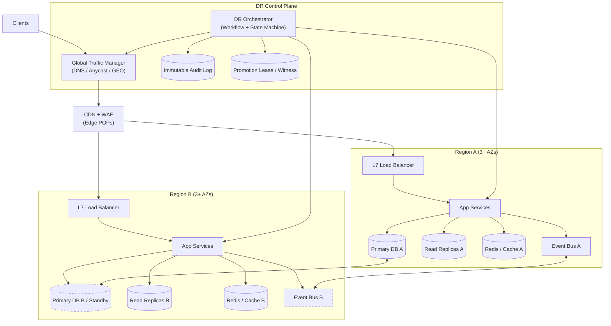
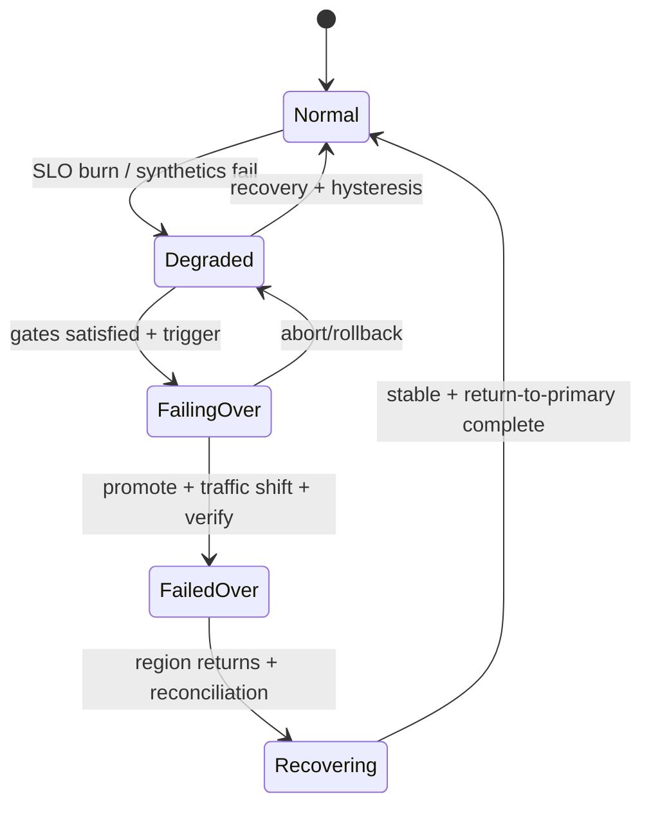
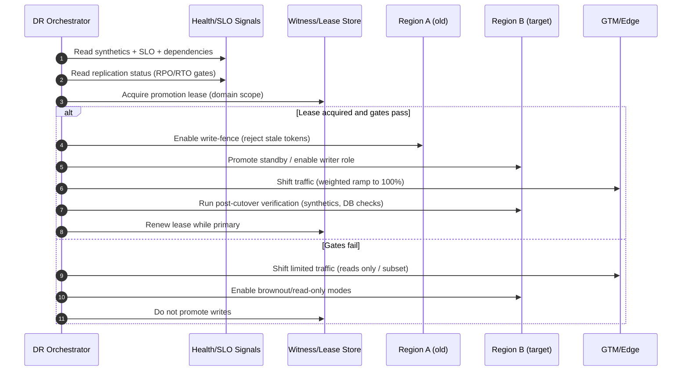

## Overview

Multi-region disaster recovery (DR) for a tier-1 service is the practice of restoring **service availability** within a target time (**RTO**) while bounding **data loss** (**RPO**) when an entire region (or its critical dependencies) becomes unavailable. The hard parts are rarely “how to flip traffic” and almost always:

- Making failover decisions with incomplete/contradictory signals (regional outages, partial partitions, dependency brownouts).
- Preventing **split-brain** (two regions accepting writes as “primary”).
- Ensuring failover doesn’t amplify the incident (failing over into a degraded region, or overloading standby capacity).
- Providing deterministic, auditable operations (repeatable cutovers, drills, and post-mortems).

The core idea: treat DR as a product with explicit targets per data class and endpoint, and implement failover as a **guarded, idempotent state machine** with safety gates (replication, fencing, dependency readiness). DNS/GTM is a **traffic distribution mechanism**, not an instantaneous switch; production-grade DR combines GTM, edge routing, write fencing, controlled promotion, and automated validation.

---

## Requirements

### Functional Requirements
- Route user traffic to the healthiest eligible region using health-checked global traffic management.
- Support **unplanned** regional failover (outage) and **planned** failover (maintenance/drills) via an explicit workflow.
- Replicate data across regions; continuously compute and expose:
  - replication lag and effective RPO
  - “safe-to-failover” signals per data tier
- Perform **dependency-aware** health evaluation (DB, cache, queues, third parties) to avoid failing over into a broken region.
- Support progressive traffic shifting (0%→10%→50%→100%) and automated rollback based on SLOs.
- Enforce **write fencing** so only one region can be primary for each write domain (global or per-tenant).
- Produce an immutable incident timeline (signals → decisions → actions → verification).
- Enable regular DR exercises (game days) with automated verification and fault injection.

### Non-Functional Requirements (Concrete Targets)
- **Scale**
  - Steady state: 50k QPS; peak: 200k QPS (flash events).
  - 20M DAU.
  - Primary DB logical size: ~10 TB; daily write volume sized to business domain (assume 1–3 TB/day of WAL/CDC at peak for a write-heavy service).
  - Telemetry: 5 TB/day logs/metrics/traces (budgeted for sampling/aggregation).
- **Latency**
  - Within-region API latency: P50 30–60 ms, P99 200–350 ms (end-to-end, excluding client network variability).
  - Cross-region replication is asynchronous for most workloads; **do not** promise cross-region write P99 < 500 ms for general writes unless using a globally consistent database (which changes trade-offs materially).
- **Availability**
  - SLO: 99.99% monthly for tier-1 endpoints (≈4.3 min/month error budget).
  - Stretch: 99.995% (≈2.2 min/month) requires excellent automation + multi-AZ hardening + disciplined change management.
- **Consistency**
  - Strong consistency within a region for critical writes.
  - Eventual consistency across regions by default.
  - For the smallest subset of critical invariants, optionally use synchronous/quorum mechanisms **only if** the latency and cost are acceptable.
- **RTO/RPO**
  - RTO: ≤ 5 minutes to restore **core read/write** traffic for unplanned regional outage; ≤ 15 minutes to return to “steady” (caches warmed, backlogs draining).
  - RPO (tiered):
    - Tier 0 (money/security/identity): 0–5 seconds preferred, ≤ 30 seconds maximum acknowledged loss (may require special handling).
    - Tier 1 (core user state): ≤ 30 seconds.
    - Tier 2 (analytics/telemetry/non-critical): ≤ 5–15 minutes.

### Constraints & Assumptions
- Two primary regions (A and B), each spanning ≥3 AZs; optional third “witness” region/service for quorum decisions.
- Capacity is duplicated for baseline operation, but not necessarily “2× peak everywhere.” The design must support controlled degradation (brownouts) during failover.
- Some tenants may be **data-residency pinned**; failover must respect policy (global failover is not always legal).
- Cross-region partitions are expected; the design must avoid split-brain and unsafe dual-primary behavior.
- DNS caching and resolver behavior means TTL is an *upper bound on freshness*, not a guarantee of cutover timing.

---

## Architecture

### Pattern Choice: Active-Active Serving + Single-Writer per Domain
This design serves traffic from both regions during normal operation (to reduce unused capacity) while maintaining a **single-writer** rule for each write domain (global or per-tenant/shard). Reads can be served locally; writes are accepted only by the current writer region for that domain.

Alternative patterns (active-passive, global-strong DB) are discussed later.

### High-Level Diagram

### Control-Plane vs Data-Plane Responsibilities
- **Data plane** (edge/LB/app/db/cache/bus): serves requests, emits health/telemetry, enforces write fencing, and executes promotion primitives.
- **Control plane** (orchestrator + witness/lease): decides failover actions, applies GTM changes, coordinates fencing/promotion, and validates outcomes.

A key safety rule: **GTM routing is never the source of truth for “who can write.”** Write authority must be enforced at the application/data layer via leases/fencing tokens.

---

## Components

### 1) Global Traffic Management (DNS/Anycast/GEO)
**Responsibilities**
- Steer clients to an eligible region based on health, policy (residency), and capacity.
- Support weighted shifts and automated rollback.

**Key decisions**
- Use health-checked routing (multi-vantage synthetic + regional SLO health), not only “is the LB up.”
- Keep TTL low (e.g., 30s) but design for **minutes** of partial propagation.
- Prefer edge-based steering (Anycast + L7 steering) for faster convergence where feasible; still keep DNS fallback.

**Implementation notes**
- Avoid flapping: require consecutive unhealthy windows before draining traffic (e.g., 3 of 4 30-second intervals).
- Use *policy routing* for pinned tenants: region eligibility is computed per tenant/group.

### 2) DR Orchestrator (Failover Controller)
**Responsibilities**
- Evaluate health and safety gates.
- Execute guarded workflows (fence → promote → shift traffic → verify).
- Provide auditability and a single operational interface for DR.

**Design**
- Implement failover as an explicit state machine with idempotent steps and retries (workflow engine recommended).

**Safety gates (minimum)**
- **Replication/RPO** within policy for the write domains being failed over.
- **Promotion lease** acquired via a witness/quorum mechanism (prevents dual-primary).
- **Dependency readiness** in target region (DB, cache, queues, critical third parties).
- **Capacity headroom** or enforced brownouts to keep within safe operating limits.

**Technology**
- A small hardened service (Go/Java) + durable store (Postgres) + workflow engine (Temporal/Cadence) + strong authn/authz.

### 3) Write Fencing & Promotion Lease (Split-Brain Prevention)
**Goal**: ensure only one region can accept writes for a given domain.

**Common approaches**
- **Lease-based fencing** (recommended):
  - A “lease” (with TTL) is stored in a quorum-backed system (witness region or highly available control store).
  - Writers must present a monotonically increasing fencing token; stale tokens are rejected.
- **DB-native fencing**:
  - Some managed DBs provide controlled promotion and write fencing primitives.
- **Per-tenant/shard leases**:
  - Enables partial failover for pinned tenants or sharded domains.

**Rule**: if the orchestrator cannot obtain the lease, it must not promote writes—even if GTM has shifted traffic.

### 4) Data Replication Layer (DB + Streams)
**Responsibilities**
- Replicate durable state and provide measurable, per-domain RPO.
- Enable promotion with minimal manual steps.

**DB replication**
- Postgres example:
  - Physical replication for standby promotion; logical replication/CDC for selected tables if needed.
  - Track apply lag (`seconds`) and backlog (`bytes`).
- If global strong consistency is required:
  - Use Spanner/CockroachDB with explicit multi-region configuration and accept higher tail latency/cost.

**Event streaming**
- Replicate topics across regions (MirrorMaker 2 / managed replication).
- Treat offsets as region-scoped; plan for consumer restart semantics during failover.

**Practical guidance**
- Partition by tenant/user ID for scalability and partial failover.
- Measure *effective RPO* as “time since last safely replicated commit,” not just lag counters.

### 5) Regional Serving Stack (Edge/LB/App)
**Responsibilities**
- Serve traffic locally with predictable behavior during failover and recovery.

**Key decisions**
- Stateless app tier; externalize state (DB/Redis).
- Provide **degradation modes**:
  - Read-only mode for selected endpoints
  - Brownout mode (disable expensive/optional features)
  - Queue-based buffering for non-critical writes (with clear durability semantics)

### 6) Observability & Health Evaluation
**Responsibilities**
- Detect real failures quickly (and avoid false failovers).
- Validate post-failover correctness.

**Signals used for decisions**
- Multi-POP synthetics (user-journey checks).
- Regional SLO metrics (error rate, latency, saturation).
- Dependency health (DB replication, queue backlog, third-party success rates).
- Control-plane reachability and witness/quorum status.

**Alerting strategy**
- Multi-window, multi-burn-rate SLO alerts to reduce flapping.
- Separate “page humans” thresholds from “automation trigger” thresholds (automation should be more conservative).

---

## Data Model

### Core Tables (Control Plane)

**`dr_config`**
- `service_id` (pk, text)
- `regions` (jsonb: priorities, eligibility rules, pinned tenants)
- `rto_seconds_target` (int)
- `rpo_policy` (jsonb: tiered thresholds, per-domain overrides)
- `gtm_provider` (text)
- `dns_ttl_seconds` (int)
- `failover_mode` (enum: `auto`, `guarded_auto`, `manual`)
- `safety_policies` (jsonb: gate thresholds, hysteresis, max_shift_step)

**`region_health`**
- `service_id` (text)
- `region` (text)
- `timestamp` (timestamptz)
- `synthetic_ok` (bool)
- `error_rate` (double precision)
- `p99_latency_ms` (int)
- `saturation` (jsonb: cpu/mem/queue)
- `dependency_status` (jsonb)
- `score` (int)
- Primary key recommendation: (`service_id`, `region`, `timestamp`)

**`replication_status`**
- `service_id` (text)
- `domain` (text: `global`, `tenant:123`, `shard:7`)
- `from_region` (text)
- `to_region` (text)
- `timestamp` (timestamptz)
- `apply_lag_seconds` (int)
- `backlog_bytes` (bigint)
- `estimated_rpo_seconds` (int)
- `safe_to_promote` (bool)

**`promotion_lease`**
- `domain` (pk, text)
- `holder_region` (text)
- `fencing_token` (bigint)
- `lease_expires_at` (timestamptz)
- `last_renewed_at` (timestamptz)

**`failover_run`**
- `run_id` (pk, uuid)
- `service_id` (text)
- `reason` (enum: `region_outage`, `degradation`, `planned`)
- `domain_scope` (jsonb: affected domains/tenants)
- `from_region` (text)
- `to_region` (text)
- `state` (enum)
- `started_at` / `ended_at` (timestamptz)
- `initiator` (text: user/service)
- `actions` (jsonb array: step, timestamps, outcome, error)

### Data Flow (Failover)

---

## API Design

### Authentication & Authorization (Required)
- Internal-only APIs protected by mTLS + OIDC/JWT.
- RBAC with explicit roles: `viewer`, `operator`, `approver`, `break_glass`.
- All write operations produce immutable audit events.

### Failover Control
**`POST /v1/dr/failover`**
- Headers:
  - `Idempotency-Key: <uuid>`
- Request body:
  - `serviceId` (string)
  - `toRegion` (string)
  - `mode` (`planned` | `unplanned`)
  - `domainScope` (object; optional: tenants/shards)
  - `allowDataLossSeconds` (int; optional, must be ≤ configured break-glass max)
  - `dryRun` (bool; optional)
- Responses:
  - `202 Accepted`: workflow started `{ runId, state }`
  - `409 Conflict`: failover already in progress
  - `412 Precondition Failed`: safety gates not met (returns blocking signals)
  - `403 Forbidden`: not authorized

### Traffic Shift
**`POST /v1/dr/traffic-shift`**
- Request:
  - `serviceId` (string)
  - `weights` (map region→int, sums to 100)
  - `ttlSeconds` (int)
- Response: applied config + estimated propagation window
- Errors:
  - `400`: invalid weights/policy violation
  - `503`: GTM provider unavailable (include retry guidance)

### Status & Telemetry
**`GET /v1/dr/status?serviceId=...`**
- Response includes:
  - current primary per domain
  - traffic weights
  - replication lag / estimated RPO
  - last failover run summary
  - current gates (pass/fail + reasons)

### Break-Glass Override
**`POST /v1/dr/override`**
- Requires `break_glass` role + justification string.
- Emits immutable audit event and forces an explicit “operator acknowledged risk” flag into the workflow state.

---

## Scaling & Performance

### Capacity Planning (Failover Reality)
Failover concentrates load into fewer regions. Plan for one of these explicit strategies:

- **Full-capacity standby**: each region can handle 100% peak (costly, simplest).
- **Shared active-active + controlled degradation** (common):
  - Normal: A=60%, B=40% (or 50/50).
  - Failover: surviving region aims for ≥70–100% of peak by combining:
    - pre-warmed baseline (e.g., 60–70% peak)
    - autoscaling/surge capacity for the remainder
    - brownouts that shed non-critical traffic to stay within safe saturation
- **Per-tenant failover**: only move affected tenants if residency/pinning allows.

### Bottlenecks & Mitigations
- **Traffic convergence**: DNS propagation is variable; mitigate with Anycast/edge steering and gradual weights.
- **Standby saturation**: mitigate via pre-warm, strict rate limits, brownouts, prioritized queues.
- **Replication catch-up**: mitigate with write throttling on non-critical domains, WAL/CDC prioritization, and partitioning.
- **Cold caches**: mitigate via cache warming, request coalescing, and stale-while-revalidate patterns for safe reads.
- **Backlogs (queues/streams)**: mitigate with burst consumers, idempotent handlers, and replay-safe processing.

### Caching Strategy
- **CDN**: static + safe GET responses, TTL 30–300s; invalidate via versioning.
- **Redis (regional)**: hot reads TTL 5–30 min; avoid synchronous cross-region replication.
- **Cache invalidation**: prefer versioned keys + event-driven invalidation; allow bounded staleness for non-critical reads.

---

## Trade-offs & Alternatives

### Key Trade-offs
1) **Async replication for most data**
- Chosen: lower write latency, simpler operations, fewer cross-region dependencies.
- Cost: bounded data loss on catastrophic regional loss.
- Mitigation: tiered RPO, promotion gates, and break-glass only with explicit risk acceptance.

2) **GTM/DNS/edge steering with guarded automation**
- Chosen: compatible with heterogeneous clients; provider-managed scale; supports progressive shifting.
- Cost: non-instant propagation and partial traffic split during cutover.
- Mitigation: combine edge steering + low TTL + conservative health checks and verification loops.

3) **Single-writer fencing (lease-based) instead of “hope GTM is enough”**
- Chosen: prevents split-brain even under partitions and stale DNS.
- Cost: additional control-plane dependency (witness/lease store) and operational complexity.
- Mitigation: keep the lease mechanism minimal, hardened, and independently monitored.

### Alternatives (When to Choose Them)
- **Active-passive**
  - Choose when costs allow and operational simplicity is paramount, or when workloads cannot tolerate replication conflict/reconciliation.
- **Global strongly consistent DB (Spanner/CockroachDB)**
  - Choose when global invariants must be enforced across regions without relying on async replication and gates.
  - Expect higher tail latency and cost; design carefully around quorum placement.
- **Client-side region selection**
  - Choose only for tightly controlled client fleets where you can enforce fast updates and consistent behavior.

---

## Failure Modes & Mitigations

### Failure Scenarios (At Least 3)
1) **Region A total outage**
- Impact: traffic to A fails; some writes may not have replicated.
- Detection: multi-POP synthetics + GTM health + cloud status + loss of inter-region heartbeats.
- Mitigation: acquire promotion lease → fence A (best-effort) → promote B → shift traffic → validate → brownout if capacity constrained.

2) **Cross-region network partition (A↔B broken)**
- Impact: split-brain risk; both regions may appear locally healthy.
- Detection: witness/quorum mismatch, replication stalls, heartbeat loss, asymmetric reachability.
- Mitigation: promotion lease ensures only one side can be writer; side without lease must reject writes (serve read-only where possible).

3) **Replication lag exceeds RPO**
- Impact: failing over would violate data-loss policy.
- Detection: `estimated_rpo_seconds` breaches tier thresholds; apply lag/backlog alarms.
- Mitigation: refuse write promotion; optionally shift read-only traffic; throttle non-critical writes; allow break-glass with explicit `allowDataLossSeconds`.

4) **False-positive health (flapping) triggers unsafe shifts**
- Impact: unnecessary failovers, cascading load, potential user impact.
- Detection: conflicting signals across POPs, short-lived spikes, high variance.
- Mitigation: hysteresis windows, multi-signal scoring, and staged traffic ramps with rollback on SLO regression.

5) **GTM provider outage/misconfiguration**
- Impact: inability to shift traffic or accidental blackholing.
- Detection: GTM API errors, config drift checks, health check anomalies.
- Mitigation: dual-provider DNS (or pre-provisioned emergency records), cached “break-glass” zone files, runbook to switch NS if necessary.

### DR Targets (Explicit)
- **RTO**
  - Unplanned: ≤ 5 minutes to restore core traffic, assuming target region is healthy and has baseline capacity.
  - Stabilization: ≤ 15 minutes for caches/backlogs to normalize.
- **RPO**
  - Tier 0/1: ≤ 30 seconds acknowledged-write loss maximum (prefer tighter for Tier 0).
  - Tier 2: ≤ 5–15 minutes.

### Backup & Restore (Last Resort, Not “Failover”)
- PITR enabled; full backups daily + continuous WAL/CDC archiving.
- Backups stored cross-region (and preferably cross-account).
- Automated restore tests weekly into isolated environments; track “restore readiness” as an SLO.

---

## Operations

### Runbooks (Minimum Set)
- Unplanned regional failover (automated + manual approval path).
- Planned failover and return-to-primary (with reconciliation checks).
- GTM/DNS provider failure and emergency steering.
- Replication lag incident (throttle plan, read-only mode enablement).
- Witness/lease store outage (safe-mode behavior; what automation must stop doing).

### Monitoring & Alerting
**Key metrics**
- Regional SLOs: availability, error rate, p99 latency, saturation.
- Synthetics: success rate and step-level timing across ≥3 POPs.
- Replication: apply lag (seconds), backlog (bytes), CDC pipeline health.
- Capacity: headroom %, autoscaling events, queue/stream lag.
- DR state: current primary per domain, lease holder + expiry, traffic weights, workflow state.

**Example thresholds**
- Page humans: SLO burn 14× over 5m or synthetics failing from ≥3 POPs for 2m.
- Block automation promotion: Tier 1 `estimated_rpo_seconds > 30` or lease unavailable.
- Warn: standby headroom < 30% during incident; queue lag growing > N minutes.

### Deployment Strategy (Reliability-Oriented)
- Progressive delivery per region (canary → 10% → 50% → 100%) with automated rollback on SLO regression.
- Regional isolation: do not deploy both regions simultaneously for tier-1 services without explicit approval.
- Configuration versioning and immutable artifacts; treat DR policies as code.

### DR Drills & Validation
- Monthly planned failover; quarterly “unplanned” simulation (fault injection).
- Automated verification checklist post-cutover:
  - synthetics pass (multi-POP)
  - write fencing enforced (stale token rejected)
  - replication resumes in reverse direction
  - critical business KPIs stable (orders/auth/session success)

### Security & Compliance
- Data residency enforced in routing policy and lease scope (per-tenant domains when required).
- Break-glass paths require MFA, justification, and immutable audit logging.
- Separate credentials per region; least privilege for GTM and promotion actions.

---

## References & Further Reading
- Google SRE Book: Disaster Recovery and managing risk in distributed systems.
- AWS Architecture Blog: Multi-region DR patterns and Route 53 routing/failover.
- Cloudflare Learning Center: DNS TTL and resolver caching behavior.
- Jepsen analyses: split-brain, consistency trade-offs, and failure semantics.
- Spanner/CockroachDB documentation: multi-region configuration and consistency models.