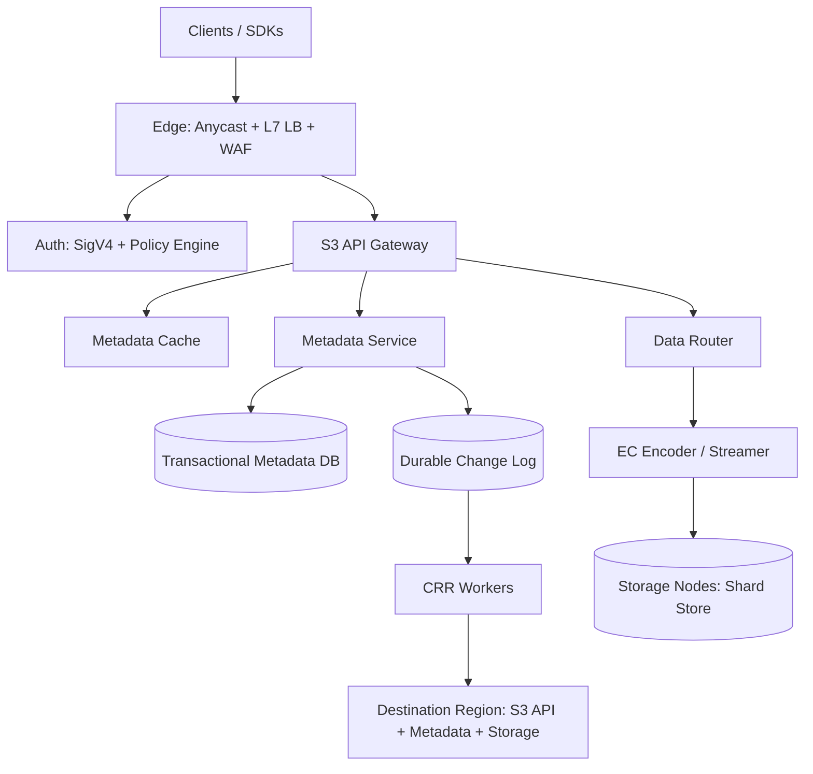
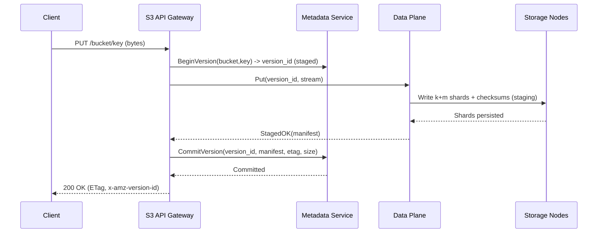
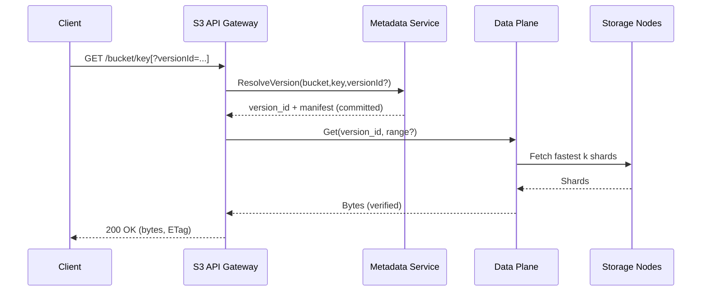

## Overview

This design describes a production-grade, **S3-compatible**, **multi-tenant** object storage service. The core challenge is not “storing bytes”, but implementing **S3 semantics** (auth, error codes, conditional requests, listings, versioning, multipart) with **high durability**, **predictable consistency**, and **tenant isolation** under skewed workloads (hot prefixes, small-object overhead, large-object throughput, and bursty traffic).

The key architectural principle is to separate:

- **Control/metadata plane**: strongly consistent object state and indexes (buckets, keys, versions, multipart state, lifecycle, policies).
- **Data plane**: cost-efficient, high-throughput blob storage (erasure-coded shards across failure domains) optimized for streaming reads/writes.

Within a region, the system provides **strong read-after-write consistency** for object mutations and subsequent reads/listings **after commit**. Cross-region replication (CRR) is **asynchronous** and driven by a durable **change log** keyed by immutable **version IDs**, providing **at-least-once delivery** with **idempotent application** (exactly-once *effect*).

## Requirements

### Functional Requirements

- **Tenancy**: create/manage tenants (accounts/projects), buckets, IAM-like policies; strong isolation for authZ, quotas, and billing.
- **S3-compatible APIs** (subset, extensible): `PUT/GET/HEAD/DELETE`, `ListObjectsV2`, multipart upload, range reads, conditional requests (`ETag`, `If-Match`, `If-None-Match`, `If-Modified-Since`), server-side copy (`x-amz-copy-source`) optionally.
- **Bucket versioning**: immutable versions per key, delete markers, retrieval by `versionId`.
- **Lifecycle management**: expiration of current/noncurrent versions, abort incomplete multipart uploads, transitions between storage classes, tag/prefix filters.
- **Storage durability**: erasure coding across AZs; online repair and scrubbing.
- **Cross-region replication (CRR)**: replicate selected buckets/prefixes/tags; preserve object metadata and version IDs; support backfill/inventory-based reconciliation.
- **Security**: TLS in transit; encryption at rest (SSE-S3) and optional tenant-managed keys (SSE-KMS); audit logs.
- **Operations**: per-tenant quotas, rate limiting, usage reporting, admin tooling, and safe deletes/GC.

### Non-Functional Requirements (Concrete Targets)

**Workload scale (design point per “large region”):**
- Objects: **2–5B objects** per large region (global up to **10B**).
- Data stored: **5–20PB** per large region (global up to **50PB**).
- Request rate: **50–150k req/s** per large region peak; **300k req/s** global peak.
- Ingest bandwidth: **10–30 Gb/s** sustained per large region; higher burst tolerated via buffering/backpressure.
- Object size distribution (assumption): median **256KB–1MB**, p95 **64MB**, occasional multi-GB objects.

**Latency SLOs (intra-region, warm path):**
- `GET` P50 **25ms**, P99 **150ms** (range reads may be lower; full-object reads depend on size).
- `PUT` single-part (≤64MB) P50 **60ms**, P99 **350ms** (includes EC encode + commit).
- `ListObjectsV2` for 1K keys page P50 **100ms**, P99 **700ms** (hot prefixes can be rate-limited).

**Availability:**
- Regional read availability: **99.99%** (steady state).
- Regional write availability: **99.9%** during single-AZ degradation (degraded mode; may reduce throughput and/or reject some writes).

**Consistency model:**
- **Within a region**: strong consistency for object mutations and subsequent `GET/HEAD/LIST` after commit completes.
- **Across regions**: eventual consistency via CRR; per-object-key ordering is best-effort, but *effects* are idempotent per `(bucket, key, versionId)`.

**Durability:**
- Within region: target **≥ 11 nines (99.999999999%)** annual durability for committed objects.
- RPO: **0** within region for committed versions; cross-region RPO depends on replication lag (target P99 **< 60s**).

### Constraints & Assumptions

- Multi-tenant isolation must prevent noisy neighbors (rate limits, quotas, fairness queues).
- Public access only through the S3 endpoint; all internal service-to-service traffic uses **mTLS**.
- Bucket naming: for an internal multi-tenant system, bucket names are unique **per tenant** by default; optional “global bucket namespace” mode can be supported with a global registry.

## Architecture

### High-Level Diagram

### Core Invariants

- **Visibility rule**: an object version becomes visible to reads/listings only after metadata is committed with `commit_state=committed`.
- **Immutability**: object versions are immutable; overwrites create new versions; deletes create delete markers (unless deleting a specific version).
- **Idempotency key**: replication and internal retries converge on `(bucket_id, key, version_id)` as the stable identity for “the same” version.

## Components

### Edge + AuthN/Z

**Responsibilities**
- DDoS/WAF, TLS termination (or pass-through), routing, request normalization.
- Authentication: AWS SigV4 compatible.
- Authorization: IAM-like policy evaluation (bucket policies + identity policies), including conditions (IP, time, prefix).

**Key decisions**
- Centralized policy engine with aggressive caching of compiled policies.
- Per-tenant enforcement: rate limits (RPS, bandwidth), concurrent request caps, and “hot prefix” throttling.

### S3 API Gateway

**Responsibilities**
- S3 REST surface: request parsing, headers/queries, XML responses, canonical error mapping.
- Orchestrates metadata + data plane steps (including multipart, copy, conditional requests).

**Key decisions**
- Stateless; stores no durable state locally.
- Uses bounded retries with request classification and circuit breakers.
- Emits structured audit events (who/what/when/result) for compliance.

**Typical implementation**
- Go/Rust service behind Envoy/NGINX; strict conformance tests against S3 semantics where feasible.

### Metadata Service (Strong Consistency)

**Responsibilities**
- Source of truth for buckets, keys, versions, listing index, multipart state, lifecycle/replication configs, quotas.

**Key decisions**
- Uses a transactional DB for correctness (serializable or strong per-key transactional semantics).
- Separate “latest pointer” from immutable version history to keep hot reads fast.
- Stores listing index in lexicographic order with pagination tokens.

**Technology options**
- **FoundationDB** (high correctness, strong transactions) or **CockroachDB/Yugabyte** (SQL + distributed transactions).
- Optional Redis/KeyDB for read-through caching of hot metadata and bucket configs.

### Data Plane (Router + EC Encoder + Storage Nodes)

**Responsibilities**
- Writes: stream bytes, compute checksums, erasure-code, place shards across failure domains.
- Reads: fetch k-of-(k+m) shards, reconstruct if needed, validate checksums, serve ranges efficiently.
- Background: scrubbing, repair, rebalancing.

**Key decisions**
- **Two-phase write**:
  1. **Stage shards** (durably written and checksummed).
  2. **Commit metadata** with shard manifest; only then is the version visible.
- Reads prefer “fastest k” shards (latency-aware selection); fall back to reconstruction.

**Storage node design (typical)**
- Local disks (HDD for capacity + optional SSD/NVMe for cache/journaling), XFS/ext4, shard files addressed by `(version_id, shard_id)`.
- Periodic scrub verifies shard checksum; repair pulls missing shards from peers.

**EC scheme**
- Example: RS **10+4** across **3 AZs** with placement constraints (e.g., distribute shards so any single AZ loss still leaves ≥10 shards).
- Small object optimization (recommended): replicate small objects (e.g., ≤64KB) 3x to reduce EC overhead and tail latency.

### Lifecycle, GC, and Inventory

**Responsibilities**
- Applies lifecycle rules (expire/transition), abort incomplete multipart uploads, delete unreferenced shards safely.
- Produces inventory reports (per bucket: objects, versions, sizes, last-modified), useful for billing, audits, and CRR reconciliation.

**Key decisions**
- Hybrid execution: event-driven tasks plus periodic scans for correctness.
- Deletion is a multi-step state machine with grace windows to avoid races with replication and delayed reads.

### Cross-Region Replication (CRR)

**Responsibilities**
- Consumes committed version events from change log; copies metadata and data to destination region.
- Tracks progress and lag; supports backfill and replay.

**Key decisions**
- **At-least-once** event delivery; destination apply is **idempotent** by `(bucket, key, versionId)`.
- Data copy can be implemented as:
  - “Fetch from source shards, re-encode locally” (simpler, matches local EC scheme), or
  - “Copy shards directly” (faster but requires compatible schemes and placement).

## Data Model

### Logical Schema (SQL-like)

- `tenants(tenant_id PK, name, status, created_at)`
- `buckets(bucket_id PK, tenant_id FK, name, region, versioning_state, created_at)`
- `objects_latest(bucket_id PK, key PK, latest_version_id, latest_is_delete_marker, etag, size, updated_at)`
- `object_versions(bucket_id, key, version_id PK, is_delete_marker, etag, size, content_type, user_metadata_json, tags_json, storage_class, encryption, commit_state, created_at)`
- `shard_manifests(version_id PK, scheme_k, scheme_m, shard_locations_json, shard_checksums_json, object_checksum, committed_at)`
- `multipart_uploads(upload_id PK, bucket_id, key, initiator, created_at, expires_at, state)`
- `multipart_parts(upload_id, part_number, etag, size, part_checksum, staged_ref, created_at)`
- `lifecycle_rules(bucket_id, rule_id, filter_prefix, filter_tags_json, actions_json, status, updated_at)`
- `replication_rules(bucket_id, rule_id, dest_region, filter_prefix, filter_tags_json, replicate_delete_markers, status, updated_at)`
- `change_log(event_id PK, bucket_id, key, version_id, event_type, ts, payload_json)`

### Listing Index

To support `ListObjectsV2(prefix, delimiter)` efficiently:

- Maintain an index ordered by `(bucket_id, key)` with pagination tokens containing the last seen key and a stable ordering tie-breaker.
- For very hot buckets/prefixes, optionally add a secondary partition key `(bucket_id, prefix_hash)` while preserving lexicographic ordering within prefix ranges.

## Data Flows

### PUT Object (Single-Part)

### GET Object (By Version or Latest)

### Multipart Upload (Commit)

- Parts are staged independently (each part is checksummed and stored).
- `CompleteMultipartUpload` assembles the final object by generating a new `version_id`, producing a final manifest, and committing metadata atomically.

## API Design

### External (S3-Compatible) Surface

- `PUT /{bucket}/{key}`: upload object
  - Supports: `Content-MD5`, `x-amz-meta-*`, SSE headers (`x-amz-server-side-encryption`, `x-amz-server-side-encryption-aws-kms-key-id`).
  - Response: `ETag`, `x-amz-version-id` when versioning enabled.
- `GET /{bucket}/{key}` and `GET ...?versionId=...`: fetch current or specific version; supports `Range` and conditional headers.
- `HEAD /{bucket}/{key}`: metadata-only lookup.
- `DELETE /{bucket}/{key}`:
  - If versioning enabled: creates a delete marker (new version).
  - With `versionId`: deletes a specific version (subject to policy).
- `GET /{bucket}?list-type=2&prefix=&delimiter=&continuation-token=`: strong listing after commit within region.
- Multipart:
  - `POST /{bucket}/{key}?uploads` -> `uploadId`
  - `PUT /{bucket}/{key}?partNumber=N&uploadId=...`
  - `POST /{bucket}/{key}?uploadId=...` (Complete)
  - `DELETE /{bucket}/{key}?uploadId=...` (Abort)

### Internal APIs (Example)

- `Metadata.BeginVersion(bucket_id, key, headers, request_context) -> version_id`
- `Metadata.CommitVersion(version_id, manifest, etag, size, checksum, metadata)`
- `Metadata.ResolveVersion(bucket_id, key, version_id?) -> manifest`
- `Metadata.ListObjects(bucket_id, prefix, delimiter, token, limit)`
- `DataPlane.Put(version_id, stream, checksums) -> manifest`
- `DataPlane.Get(version_id, range) -> stream`

### Error Mapping and Retries

- External responses follow S3-style XML error bodies and canonical codes (`NoSuchBucket`, `NoSuchKey`, `InvalidDigest`, `EntityTooLarge`, `AccessDenied`, `ServiceUnavailable`).
- Internal errors are classified as retryable vs non-retryable, with bounded retries and request hedging only for safe reads.

## Scaling & Performance

### Key Bottlenecks and Mitigations

- **Hot prefixes / hot keys**
  - Mitigate with per-prefix throttles, token-bucket fairness per tenant, and metadata partitioning that avoids single-range hotspots.
- **Small objects**
  - Use replication for very small objects; compress metadata; keep hot-path indexes compact; cache latest pointers.
- **Large objects**
  - Stream EC encoding; use backpressure; isolate ingest nodes; parallel shard writes; optimize for zero-copy I/O.
- **LIST at scale**
  - Strong consistency implies transactional index updates; control tail latency with tighter indexes, cache of bucket configs, and rate limiting for abusive scans.

### Partitioning Strategy (Practical)

- Metadata: shard by `tenant_id` and `bucket_id`; store `objects_latest` in hot partitions; `object_versions` in history partitions.
- Listing index: ordered by `(bucket_id, key)`; add secondary partitioning for extremely large buckets while preserving lexicographic iteration semantics.
- Storage placement: consistent-hash rings per placement group with constraints for AZ/rack diversity and disk capacity.

### Caching

- Metadata cache: bucket configs, policies, and `objects_latest` (TTL 30–300s) with invalidation via change log fanout.
- Read cache (optional): CDN for public objects; internal SSD cache for hot `(version_id, range)` segments.
- Version IDs are immutable cache keys; only “latest pointer” needs invalidation.

## Trade-offs & Alternatives

### Trade-offs (At Least 3)

- **Strong regional consistency vs higher write cost**
  - Strong `PUT/DELETE/LIST` correctness requires transactional metadata and careful indexing, increasing write amplification and tail latency.
- **Erasure coding vs simpler replication**
  - EC reduces storage cost dramatically at PB scale but increases CPU usage, repair complexity, and write tail latency.
- **Async CRR vs synchronous geo-commit**
  - Async replication keeps user latency low and avoids coupling regions, but cross-region reads can be stale and RPO depends on lag.
- **Lexicographic LIST semantics vs hotspot resilience**
  - Ordered indexes enable correct S3-style listings but can hotspot popular prefixes; mitigation requires throttling and careful partitioning.

### Alternatives

- **3x replication everywhere**: simpler and faster writes, simpler repairs; higher cost and lower usable capacity.
- **Eventually consistent metadata (Dynamo-style)**: higher availability under partitions; much harder to guarantee predictable listing/version semantics.
- **Inline cross-region commit**: stronger geo guarantees; very high tail latency and lower write availability due to region coupling.

## Failure Modes

### Scenarios (At Least 3)

- **Storage node loss during PUT**
  - Impact: insufficient shards staged, write cannot commit.
  - Mitigation: write to alternate nodes; commit metadata only after staging quorum; GC cleans orphaned staged shards.
- **Single AZ outage**
  - Impact: reads require reconstruction more often; writes may degrade or be temporarily rejected depending on placement constraints.
  - Mitigation: place shards across AZs so ≥k survive an AZ loss; enter degraded mode with stricter admission control and higher timeouts.
- **Metadata DB instability (leader change, partition, overload)**
  - Impact: commits and listings fail/slow; control plane degraded.
  - Mitigation: multi-node consensus with automatic failover; backpressure and per-tenant shedding; optional read-only degraded mode for reads by explicit `versionId` (policy-controlled).
- **Silent corruption / bit-rot**
  - Impact: wrong bytes returned without detection.
  - Mitigation: end-to-end checksums, shard checksums, periodic scrubbing, automatic repair from redundant shards; quarantine bad disks/nodes.
- **CRR backlog or destination throttling**
  - Impact: increased cross-region RPO and stale destination reads.
  - Mitigation: autoscale CRR workers, prioritize metadata-first replication, per-tenant replication bandwidth caps, alerting on lag and apply errors.

### Disaster Recovery (DR)

- In-region: RPO **0** for committed versions; RTO depends on infra automation (target **30–60 min** for major incidents).
- Cross-region: typical RPO target P99 **< 60s**; RTO **2–4 hours** to promote a replica region (DNS + config + traffic ramp).
- Backups: continuous metadata backups (PITR) + periodic snapshots; change log retention **7–30 days**; optional cold archive of shard data for compliance.

## Operations

### SLOs and Error Budgets

- Define SLOs per operation class (`GET`, `PUT`, `LIST`, multipart) and track:
  - availability, tail latency, durability/repair health, and customer-visible error rates.
- Use error budgets to gate risky deploys and schema changes.

### Observability

- Metrics:
  - API: RPS, P50/P95/P99 by operation, 4xx/5xx, auth failures, throttling.
  - Metadata: transaction latency, contention, slow queries, cache hit rate, replica health.
  - Storage: shard read/write latency, reconstruction rate, repair backlog, disk utilization, checksum failures.
  - CRR: lag seconds, backlog depth, apply retries/failures, per-tenant bandwidth.
- Tracing:
  - end-to-end traces for `PUT`/`GET` including metadata and shard RPCs.
- Logging:
  - audit logs with tenant identity, action, resource, decision, and outcome.

### Capacity Planning

- Track:
  - stored PB, object counts, version growth, EC overhead, repair traffic, hot cache size, and skew (top tenants/prefixes).
- Plan for repair bandwidth:
  - ensure enough headroom so repair completes quickly after failures without collapsing tail latency.

### Deployment and Schema Evolution

- Rolling deploy with canaries per AZ/region; feature flags for new headers/behaviors.
- Schema migrations via expand/contract; avoid breaking older readers.
- Compatibility testing against S3 semantics (golden tests for headers, error codes, conditional requests, and multipart flows).

### Security and Compliance

- mTLS internally; least-privilege service identities.
- KMS integration with envelope encryption; key rotation; per-tenant key policies.
- Secure deletion semantics documented (versioning + lifecycle); audit trails immutable and retained per policy.

## References & Further Reading

- AWS S3 API and semantics: https://docs.aws.amazon.com/AmazonS3/latest/userguide/Welcome.html
- Ceph RADOS Gateway (S3-compatible object storage): https://docs.ceph.com/en/latest/radosgw/
- MinIO erasure coding overview: https://min.io/docs/
- Reed–Solomon / erasure coding lessons (FAST): https://www.usenix.org/conference/fast12/lessons-learned-facebook
- Azure storage redundancy and LRC concepts: https://learn.microsoft.com/azure/storage/common/storage-redundancy