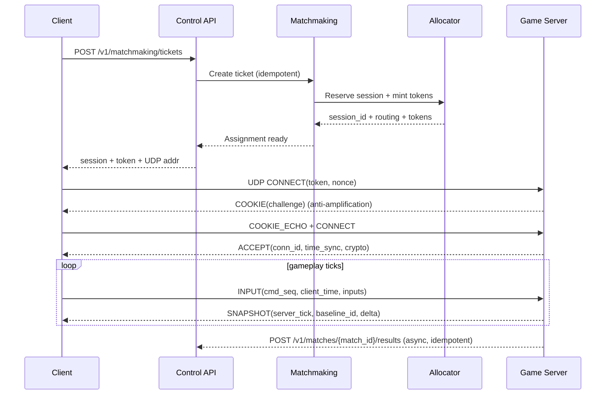

## Overview

A multiplayer game backend must synchronize fast-changing world state to many clients while resisting packet loss, jitter, NAT, and abuse. Low latency is critical for player experience, but “fast” networking can’t sacrifice fairness: competitive games require an authoritative source of truth for movement, hit validation, and outcomes.

This design uses:
- A **control plane** (HTTPS/gRPC): authentication, parties, matchmaking, server allocation, and post-match writes.
- A **data plane** (UDP): an authoritative simulation server with a fixed tick loop, **interest management**, **snapshot/delta replication**, and bounded **lag compensation** (server rewind) for hit validation.
- Optional **UDP edge/relay**: DDoS resistance, stable ingress, and NAT traversal help.

Key idea: keep reliable/authenticated operations in the control plane and keep high-rate state sync loss-tolerant in the data plane, while preserving fairness via server authority plus client prediction/reconciliation.

---

## Requirements

### Functional Requirements
- Players authenticate and manage profiles (MMR, ban state, region preferences).
- Players create/join parties and queue for matchmaking by region, mode, and party constraints.
- Matchmaking forms balanced matches (MMR + party size), selects a region, and allocates a game server.
- Clients connect to the allocated game server over UDP using a secure, short-lived connection token.
- Server runs an authoritative simulation at a fixed tick rate; clients send input commands.
- Server validates inputs (rate limits, movement constraints) and applies them deterministically to simulation state.
- Server broadcasts world state via snapshot/delta replication with interest management.
- Lag compensation (rewind) for hit validation with configurable fairness bounds.
- Match results and anti-cheat signals are persisted and available via APIs.
- Operators have live visibility (per-match health, latency, loss, join failures) and mitigation controls (drain, kick, requeue).

### Non-Functional Requirements (Targets)
These targets are realistic for a large, global game with regional isolation.

**Scale (example sizing)**
- **MAU**: 5M
- **Peak CCU**: 500k across all regions
- **Peak concurrent matches**: ~8k–12k (assuming 40–60 players/match average across modes)
- **Matchmaking ingestion**: up to 50k tickets/min peak (bursty), multi-region
- **Per game server network** (typical 64-player session):
  - Inbound inputs: ~2k–6k packets/sec (depends on input send rate and coalescing)
  - Outbound snapshots/events: ~1k–5k packets/sec (depends on tick, interest mgmt, MTU, and packetization)
  - Outbound bandwidth: commonly **5–20 Mbps** per 64-player session with interest management and delta compression (game-dependent)

**Latency**
- **Intra-region RTT** (client↔server): target P95 < 60 ms, P99 < 100 ms (varies by geography)
- **Input-to-simulation** (server receipt → applied tick): P99 < 25 ms (budgeted by tick + queueing)
- **State delivery** (server tick → client receives snapshot): P99 < 80 ms intra-region (network + pacing)
- **Matchmaking time**: P95 < 30 s (tunable by constraints); P99 < 90 s during peak

**Availability / SLOs**
- **Control plane** (auth/matchmaking/allocation APIs): 99.99% monthly availability
- **Join success**: ≥ 99.5% of players who receive an assignment connect successfully within 10 seconds
- **Match completion**: ≥ 99.0% of matches end normally (no server crash/forced termination)
- **Gameplay mid-match failover**: not supported (stateful); mitigate via fast requeue and outcome rules

**Consistency**
- **Within a match**: server is authoritative (strong consistency for simulation state as observed via the server timeline)
- **Profiles/leaderboards**: eventual consistency allowed; competitive/ranked writes must be monotonic and idempotent
- **Match results**: exactly-once effects at the business layer (via idempotency + result hash/versioning), even if transport is at-least-once

**Durability**
- Match results: RPO ≤ 1 minute (ranked), no silent loss of finalized outcomes
- Telemetry/replays: best-effort with explicit sampling/retention policies

### Constraints & Assumptions
- Dedicated server model (client-server), not P2P.
- Multi-region (≥ 3 regions) with regional matchmaking pools; cross-region play is opt-in and explicitly labeled.
- Game servers are stateful processes with orchestration (Kubernetes/Agones or VM fleets).
- Network realities: NAT, mobile/Wi-Fi loss and jitter, asymmetric routing, and ISP-level rate limiting.
- Compliance: minimize PII; encrypt tokens and sensitive telemetry; configurable retention (e.g., detailed telemetry 7–30 days, aggregates longer).

### Out of Scope (Commonly Added Later)
- Full client integrity/attestation (kernel anti-cheat, hardware attestation).
- Social graph, chat/voice, content delivery (patching/CDN).
- Cross-region mid-match migration/failover.

---

## Architecture

### High-Level Diagram

```mermaid
flowchart TB
  C[Game Client] -->|HTTPS| API[Control API Gateway]
  C -->|UDP| EDGE[UDP Edge / Relay<br/>(optional)]

  API --> AUTH[Auth Service]
  API --> PARTY[Party Service]
  API --> MM[Matchmaking Service]
  MM --> REDIS[(Redis / Queue Store)]

  MM --> ALLOC[Allocator / Session Directory]
  ALLOC --> REG[(Registry: etcd/Consul)]
  ALLOC --> ORCH[Orchestrator<br/>(Agones/K8s or VM ASG)]

  EDGE --> GS[Authoritative Game Server Fleet]
  C -->|UDP direct (optional)| GS

  GS -->|async| RES[Match Results Ingest]
  GS -->|async| TEL[Telemetry / Anti-cheat Ingest]

  RES --> DB[(Primary DB)]
  TEL --> BUS[(Event Bus)]
  BUS --> OLAP[(Analytics / OLAP)]
  TEL --> METRICS[(Metrics/Tracing)]
```

### Key Separation
- **Control plane**: authenticated, rate-limited, idempotent APIs; strong observability; easier to scale statelessly.
- **Data plane**: latency-sensitive UDP with custom packetization/reliability; optimized CPU and NIC usage; per-match state is ephemeral.

### Core Workflows



---

## Components

### Component Summary
- **API Gateway (Control)**: auth enforcement, rate limits, idempotency keys, request routing, versioning.
- **Auth Service**: identity/session tokens (OAuth/OpenID Connect or first-party), device/session management.
- **Party Service**: party membership, leadership, ready checks, mode constraints.
- **Matchmaking Service**: queueing + match formation, fairness vs queue time tuning, capacity-aware behavior.
- **Allocator / Session Directory**: server selection, reservations, connection token minting, server health/leases.
- **Game Server Fleet**: authoritative simulation, netcode, per-match lifecycle, backpressure controls.
- **UDP Edge/Relay (Optional)**: DDoS filtering, stable anycast ingress, NAT assistance, traffic shaping.
- **Results/Telemetry Pipelines**: async ingestion, durable writes, analytics and anti-cheat feature generation.
- **Operations Tooling**: dashboards, alerts, live match inspection, region drains, rollout controls.

### Matchmaking Service
**Responsibility**
- Ingest tickets (solo/party), maintain queues, form matches, and coordinate allocation.

**Design**
- Shard queues by `(region, mode, party_size_bucket)` to avoid hotspots.
- Use **expanding search**: widen MMR window over time; optionally relax secondary constraints (map, input device buckets) under high load.
- Separate **match formation** from **allocation** so a formed match can retry allocation without reshuffling fairness.

**Data Structures**
- Redis sorted sets or lists per shard for fast enqueue/dequeue.
- Optional “candidate sets” keyed by MMR buckets to reduce scanning.

**Failure/Backpressure**
- If capacity is low, slow intake via `429`/retry-after, or temporarily narrow ticket acceptance (e.g., ranked only).
- Emit explicit states: `queued`, `forming`, `allocating`, `matched`, `failed`.

### Allocator / Session Directory
**Responsibility**
- Select or start a game server, reserve slots, mint admission tokens, publish routing.

**Design**
- Backed by a strongly consistent registry (etcd/Consul) with **leases**:
  - Server heartbeats keep capacity records fresh.
  - Reservations have TTL and are garbage-collected if joins fail.
- Placement considers region/AZ, CPU headroom, NIC throughput, and anti-affinity to reduce correlated failures.

**Token-Based Admission**
- Short-lived (e.g., 30–120 seconds) token containing:
  - `session_id`, `player_id`, `server_id`, `expires_at`, `nonce`
  - Optional `build_id` (client version gate)
- Prefer PASETO (or JWT with strict algorithms) and include a server-side verification key rotation plan.

### Authoritative Game Server
**Responsibility**
- Own the truth: simulate, validate, and publish state.

**Tick Loop**
- Fixed tick rate (e.g., **60 Hz** competitive, **30 Hz** casual; separate from render).
- Ensure stable tick budgets:
  - Overrun handling: degrade snapshot frequency, drop non-critical events, or reduce interest radius before simulation slips.

**Input Validation**
- Per-connection rate limiting and sequence validation.
- Movement constraints and server-side collision checks (anti-speedhack).
- Reject obviously invalid commands; quarantine suspicious clients for extra scrutiny.

**Lag Compensation (Hit Rewind)**
- Store a bounded history buffer of relevant state (positions/hitboxes) for **~250–500 ms**.
- Rewind only up to a maximum (e.g., 200 ms for ranked) to balance fairness and “shot behind cover” artifacts.
- Use server time sync and clamp client timestamps (never trust client time directly).

### UDP Sync Engine (Netcode)
**Goals**
- Low overhead, no head-of-line blocking for state updates, resilience to loss/jitter.

**Packetization**
- Target MTU-safe payloads (commonly **≤ 1200 bytes**) to avoid fragmentation on typical paths.
- Coalesce small messages; split large state across multiple packets with reassembly bounds.

**Channels**
- **Unreliable**: snapshots/deltas (latest wins).
- **Reliable-ordered**: critical game events (round start, inventory changes).
- **Reliable-unordered** (optional): independent events where order doesn’t matter (e.g., telemetry markers).

**Reliability & Congestion**
- ACK + selective retransmit for reliable channels.
- Per-client pacing and send budgets (bytes/tick) to avoid bufferbloat and self-inflicted loss.
- Adaptive snapshot rate based on:
  - distance/visibility/importance (interest management)
  - client loss and bandwidth estimates

**Interest Management**
- Replication graph (spatial cells + team relevance + priority lanes).
- Entity prioritization: players/projectiles > interactive objects > cosmetics.

### Telemetry & Anti-Cheat Pipeline
**Responsibility**
- Ingest match/network metrics and server-authoritative signals; produce alerts and moderation features.

**Design**
- Never block the tick loop on telemetry:
  - async batching, bounded buffers, and drop policies for non-critical telemetry
- Feature store patterns:
  - raw events short retention, aggregated features longer retention

**Examples of Signals**
- Impossible acceleration/turn rates given server physics.
- Repeated “perfect” tracking patterns inconsistent with input device constraints.
- Abnormal packet timing (synthetic input bursts, replayed sequences).

---

## Data Model

### Storage Choices
- **SQL** (PostgreSQL/MySQL): players, bans, match metadata, ranked outcomes (stronger transactional guarantees).
- **Redis**: matchmaking queues and ephemeral ticket/session lookups (TTL).
- **Strongly consistent registry** (etcd/Consul): server heartbeats, capacity, reservations (lease-based).
- **OLAP** (ClickHouse/BigQuery): analytics and anti-cheat exploration at scale.

### Example Schemas (Illustrative)

**players** (SQL)
- `player_id` (UUID, PK)
- `created_at` (timestamp)
- `region_pref` (string)
- `mmr` (int)
- `ranked_status` (enum)
- `ban_state` (enum)
- `last_seen_at` (timestamp)

**match_tickets** (Redis + optional SQL audit, TTL)
- `ticket_id` (UUID)
- `party_id` (UUID, nullable)
- `player_ids` (array)
- `mode` (string)
- `region` (string)
- `mmr_mean` (int)
- `constraints` (json)
- `created_at` (timestamp)
- `expires_at` (timestamp)

**sessions** (registry + SQL mirror, TTL/lease)
- `session_id` (UUID)
- `region` (string)
- `mode` (string)
- `server_id` (string)
- `server_udp_addr` (ip:port)
- `state` (enum: reserved|active|ended)
- `created_at` (timestamp)
- `ends_at` (timestamp)

**connection_tokens** (stateless, short-lived)
- Claims: `token_id`, `session_id`, `player_id`, `server_id`, `build_id`, `expires_at`, `nonce`
- Signed/encrypted; verification keys rotated; replay protection via nonce + server-side short cache if needed

**match_results** (SQL for ranked, optionally dual-write to OLAP)
- `match_id` (UUID, PK)
- `session_id` (UUID)
- `region` (string)
- `mode` (string)
- `started_at` (timestamp)
- `ended_at` (timestamp)
- `players` (json: teams, stats, disconnects)
- `mmr_deltas` (json)
- `anti_cheat_flags` (json)
- `result_hash` (bytes)
- `finalized_at` (timestamp)

### Result Finalization (Idempotency Pattern)
- Server submits `match_id` + `result_hash`.
- DB transaction:
  - if `match_id` absent → insert and finalize
  - if present with same `result_hash` → return 200 (idempotent)
  - if present with different hash → return 409 and alert (integrity issue)

---

## API

### Control Plane Principles
- Versioned paths (`/v1/...`), strict auth, rate limits per account/device/IP.
- Idempotency for all “create” endpoints via `Idempotency-Key`.
- Explicit state machines for tickets and sessions to simplify clients and debugging.

### Create Matchmaking Ticket
- `POST /v1/matchmaking/tickets`
- Headers: `Authorization: Bearer ...`, `Idempotency-Key: <uuid>`
- Request:
  ```json
  {
    "mode": "ranked_5v5",
    "region": "us-east",
    "party_id": "optional-uuid",
    "players": [{"player_id":"uuid"}],
    "client_build": "1.12.3"
  }
  ```
- Response `202`:
  ```json
  { "ticket_id": "uuid", "expires_at": "2025-12-17T12:00:00Z" }
  ```
- Errors:
  - `401` unauthorized
  - `409` already queued (or idempotency replay with different payload)
  - `429` rate limited (`Retry-After`)

### Get Ticket State / Assignment
- `GET /v1/matchmaking/tickets/{ticket_id}`
- Response `200` (queued):
  ```json
  { "state":"queued", "position_estimate": 120, "eta_seconds": 25 }
  ```
- Response `200` (matched):
  ```json
  {
    "state":"matched",
    "session_id":"uuid",
    "server_udp_addr":"203.0.113.10:27015",
    "connection_token":"base64url..."
  }
  ```
- Response `410` if expired/canceled

### Cancel Ticket
- `DELETE /v1/matchmaking/tickets/{ticket_id}`
- Response `204` on success (idempotent)

### Report Match Results (Server → Control)
- `POST /v1/matches/{match_id}/results`
- Auth: mTLS or signed server identity (workload identity) with nonce/timestamp
- Idempotency: `match_id` + `result_hash`
- Response:
  - `200` accepted (new or duplicate)
  - `409` conflict (different hash already finalized)

### UDP Protocol (Data Plane)
**Handshake (anti-abuse + crypto bootstrap)**
- Client sends `CONNECT(token, client_nonce)`.
- Server replies `COOKIE(server_cookie)` if amplification risk or unknown client.
- Client echoes `COOKIE` to prove reachability.
- Server replies `ACCEPT(conn_id, server_time, key_id, crypto_params)`.

**Messages (illustrative)**
- `INPUT`: `(conn_id, cmd_seq, client_time, input_blob)`  
  - typically sent at 30–60 Hz; can be coalesced
- `SNAPSHOT`: `(server_tick, baseline_id, delta_blob)`  
  - unreliable; latest wins; delta against acknowledged baseline
- `EVENT`: reliable-ordered for critical events

**Error/Disconnect Reasons**
- version mismatch, token expired, auth fail, rate limit, protocol violation

---

## Scaling

### Capacity Planning (Rules of Thumb)
- **Per 64-player match bandwidth** (example):
  - Average snapshot payload per client: 300–800 bytes at 10–20 Hz (after quantization + delta)
  - Outbound per client: ~3–16 KB/s
  - Outbound per match: ~0.2–1.0 MB/s (~1.6–8 Mbps) plus overhead/events → plan **5–20 Mbps**
- **Fleet sizing**:
  - If peak concurrent matches are 10k and average 10 Mbps/match, aggregate egress is ~100 Gbps across the fleet (distributed by region/AZ).
- **CPU sizing**:
  - Primary drivers: simulation complexity + entity count + serialization.
  - Enforce tick budgets; measure P99 tick time and headroom on representative hardware.

### Bottlenecks & Mitigations
- **NIC egress (fanout)**: use interest management, delta compression, adaptive snapshot rates, and MTU-safe packing.
- **Tick overruns (CPU spikes)**: profiling, avoid O(N²), precompute/cull, split heavy systems, degrade non-critical work before simulation slips.
- **Matchmaking hotspots**: shard by region/mode/party, stateless workers, Redis clustering, and explicit backpressure under low capacity.
- **Loss/jitter**: client interpolation buffers (e.g., 50–120 ms), resend only reliable channels, pacing, and optional small FEC for tiny critical payloads (careful: can increase bandwidth).

### Horizontal Scaling Strategy
- **Control plane**: stateless services behind L7 LB; scale on QPS and queue depth.
- **Game servers**: scale on matches/CCU; pre-warm pools per region to reduce queue latency; multi-AZ placement.
- **Partitioning**:
  - Region first (hard boundary for latency), then mode, then skill buckets.
- **Caching**:
  - Redis for tickets and ephemeral session lookups; DB for durable truth.

---

## Trade-offs

### Trade-offs Made (and Why)
1. **Authoritative servers vs client authority**
   - Pros: strong anti-cheat baseline, consistent outcomes, simpler ranking integrity
   - Cons: higher infrastructure cost, more complex server engineering

2. **UDP + custom channels vs TCP**
   - Pros: avoids head-of-line blocking for state updates; supports loss-tolerant snapshots
   - Cons: you must implement reliability, ordering, pacing, and abuse resistance correctly

3. **Rewind-based lag compensation vs “no rewind”**
   - Pros: fairer hit registration for moderate latency players
   - Cons: can create “shot behind cover” perceptions; must clamp and tune carefully

4. **Direct UDP to server vs UDP edge/relay**
   - Pros (edge): DDoS resistance, stable ingress, better NAT success rates
   - Cons (edge): extra cost, additional hop/latency, operational complexity

### Alternatives
- **QUIC + DATAGRAM**:
  - Pros: standardized crypto, connection semantics, better NAT traversal story
  - Cons: ecosystem maturity varies; mapping partial reliability/priority semantics can be limiting; still need pacing strategy

- **Lockstep deterministic networking (RTS-style)**:
  - Pros: low bandwidth, deterministic replays
  - Cons: highly latency-sensitive; cheating prevention is hard without heavy constraints

- **Edge-authoritative simulation**:
  - Pros: closer to players in theory
  - Cons: expensive and operationally complex; hard to run heavy simulation and debugging at edge scale

---

## Failure Modes

### Failure Scenarios & Mitigations
1. **Game server crash mid-match**
   - Detection: heartbeat/lease expiry, disconnect storm, missing tick metrics
   - Mitigation: fast requeue with priority, autoscaler replaces instance, ranked outcome rules (e.g., safe loss/partial credit), postmortem via server logs/last snapshots if available

2. **Allocator assigns a dead or overloaded server**
   - Detection: join failure spike, reservation-to-activation drop, server lease validation failures
   - Mitigation: allocator verifies live lease + capacity at reservation time, quick retry allocation, quarantine unhealthy servers, strict TTL on reservations

3. **UDP flood / DDoS on a region**
   - Detection: elevated PPS, handshake failure rate, edge drops, ISP alerts
   - Mitigation: anycast/edge filtering, cookie challenges, per-IP/ASN rate limits, capacity shedding, temporarily disable direct-to-server ingress, steer new matches to healthier regions

4. **Clock/time sync issues break lag compensation**
   - Detection: abnormal rewind offsets, time residual metrics, hit dispute anomalies
   - Mitigation: server-time authority, periodic time sync packets, clamp client timestamps, fall back to receipt-time approximation, disable rewind if residuals exceed thresholds

5. **Results pipeline outage**
   - Detection: ingest lag, error rates, DB write failures
   - Mitigation: async buffering with bounded disk, retry with exponential backoff, dual-path writes for ranked (direct DB write with queue fallback), explicit “results pending” state and reconciliation job

### Disaster Recovery
- **Control plane**: multi-region failover for APIs; DNS/traffic manager routing; RTO 30 minutes, RPO 1 minute for core DBs.
- **Gameplay**: no cross-region mid-match DR; recover by draining impacted region and rerouting new matches; preserve ranking integrity via durable results writes.

---

## Operations

### Monitoring & Alerting (Examples)
**Game servers**
- Tick time P50/P95/P99, overrun %, queueing time, serialization time
- Per-client RTT/jitter/loss, out-of-order, retransmit rates (reliable channels)
- Snapshot sizes, send budgets, drop counts, disconnect reasons
- CPU, memory, NIC throughput, packet drops at OS level

**Control plane**
- Ticket ingest QPS, queue depth, match time percentiles by mode/region
- Allocation success rate, warm pool size, reservation TTL expiries
- Join success rate and time-to-connect distributions

**Suggested Paging Alerts**
- Tick overruns > 1% for 5 minutes (per build/region)
- Join success < 98% for 5 minutes (per region)
- Match completion < 99% for 15 minutes (per region)
- DDoS indicators: handshake failure spikes + PPS anomalies

### Deployment & Rollout
- **Control plane**: canary + progressive rollout; backward-compatible schema migrations; fast rollback via versioned deploys.
- **Game servers**:
  - Build/versioned images; gradual fleet rotation.
  - “Drain then terminate” to avoid killing active matches.
  - Multi-version support during rollout via build-gated tokens and compatible netcode schemas.

### Live Operations Playbooks
- Region drain (stop new allocations, let matches complete).
- Quarantine a build (reject tokens for `client_build` / server image).
- Increase warm pool / temporarily relax matchmaking constraints.
- Enable edge-only ingress during attack; tighten rate limits/cookie challenges.

---

## References & Further Reading
- Valve: “Source Multiplayer Networking” (snapshot interpolation, lag compensation)
- Gaffer On Games: “Fix Your Timestep”, “Client-Side Prediction and Server Reconciliation”, “Snapshot Interpolation”
- ENet (reliable UDP patterns): http://enet.bespin.org/
- Agones (Kubernetes game server orchestration): https://agones.dev/
- Open Match (matchmaking framework patterns): https://open-match.dev/
- Glenn Fiedler (netcode architecture and bandwidth/latency trade-offs): https://gafferongames.com/