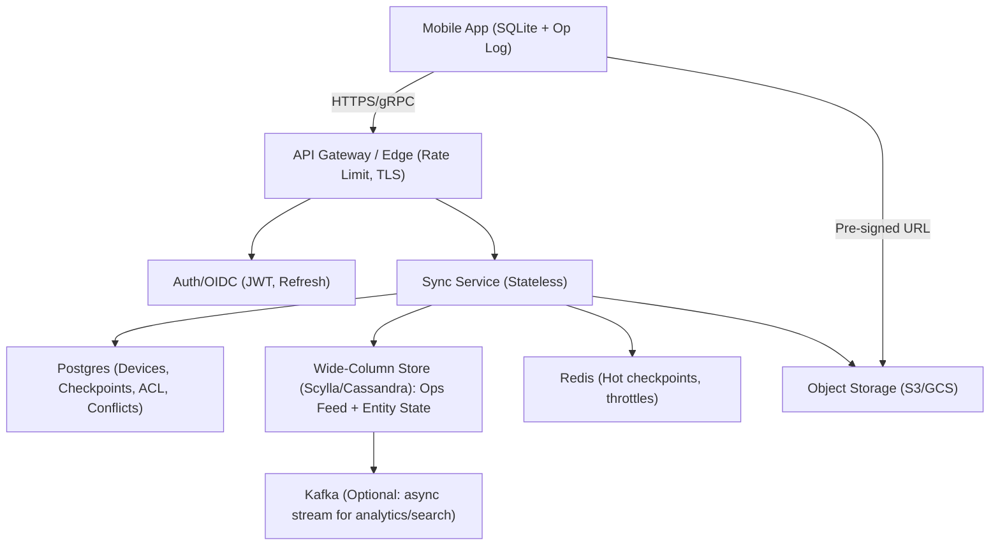
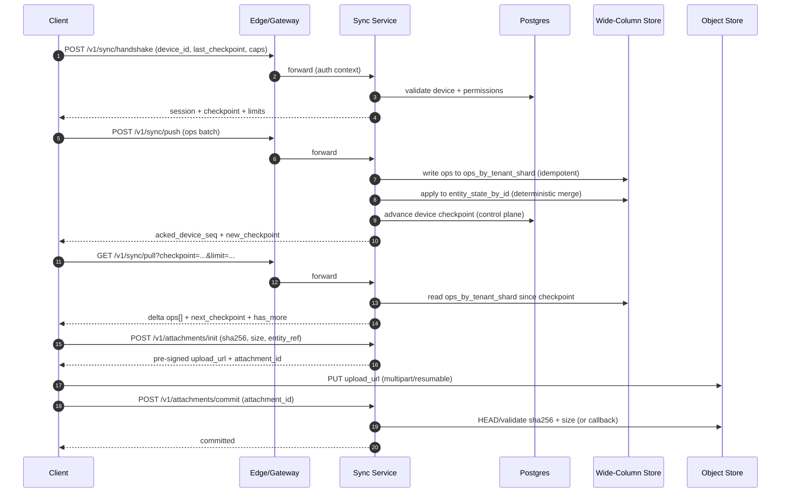

## Overview

Field-operations apps (inspections, deliveries, maintenance, incident response) must keep working when connectivity is unreliable or absent for days. Users expect the app to be fast and fully functional offline, yet data must reconcile correctly when devices reconnect—often with concurrent edits across devices, out-of-order delivery, retries, partial uploads, and evolving schemas.

This design treats sync as **replication of an operation log** (not “upload the whole state”). Each change is an operation with a stable identifier and causal metadata. The server durably persists operations, generates device-specific deltas using **server-issued checkpoints**, and applies deterministic merge rules to materialize current entity state. Conflicts are auto-merged when safe, otherwise routed to an explicit “needs review” workflow.

### Goals
- Local-first UX with full offline CRUD and deterministic eventual convergence.
- Bandwidth-efficient, resumable sync that handles long partitions and reconnect storms.
- Idempotent ingestion and replayable history for audit/debug/rebuild.
- Type-aware conflict handling (CRDTs where they help; semantic rules where they matter).

### Non-Goals
- Real-time collaborative editing (e.g., shared cursors) for rich text.
- Perfectly preventing offline access after membership revocation (requires key management / encrypted datasets; addressed as an option).

---

## Requirements

### Functional Requirements
- Offline CRUD for core entities (e.g., `WorkOrder`, `Asset`, `Inspection`, `FormResponse`) with local persistence.
- Two-way sync after reconnection: upload local operations and download remote operations since last checkpoint.
- Deterministic conflict handling: auto-merge when safe; flag conflicts requiring user review.
- Attachment sync (photos/videos/signatures) with resumable uploads and deduplication.
- Multi-device per user (phone + tablet) with eventual convergence across devices.
- Idempotent retries: repeated sync requests and duplicated deliveries must not create duplicates or corrupt state.
- Access control enforced on server (tenant/project/site/user scopes) and honored in deltas.
- Auditability: reconstruct who changed what, when, and from which device/app version.

### Non-Functional Requirements (Concrete Targets)

#### Scale (Illustrative but Realistic)
Assume 50K DAU field workers and 5M MAU viewers/admins.

- **Operations generated**:
  - Typical: 100 ops/device/day → ~5M ops/day
  - Heavy: 200 ops/device/day → ~10M ops/day
- **Reconnect storms**:
  - 10K devices reconnect over 10 minutes after shifts
  - If each pushes 1K ops backlog on average: 10M ops / 600s ≈ **16.7K ops/s** ingestion (ops/s, not requests/s)
- **Worst-case backlog** (rare tenant/event):
  - 1K devices offline for days with 50K ops/device → 50M ops ingest over hours; handled via throttling, progressive catch-up, and offline compaction.
- **Attachments**:
  - 2–10 GB/device/month; up to 200 MB per job; peak upload driven by direct-to-object-store (not Sync Service).

#### Latency & UX
- **Handshake** P50 50ms / P99 250ms (auth + metadata only).
- **Push batch** (e.g., 200–1,000 ops, compressed): P50 200ms / P99 1,200ms.
- **Pull batch** (e.g., up to 1,000 ops or 5 MB): P50 150ms / P99 900ms.
- **Time-to-catch-up**: <2 minutes for 10K ops on good LTE (achieved via batching + compression + parallel pull pages).
- **Offline reads/writes** on device: <20ms P50 for common operations.

#### Availability & Durability
- **Sync APIs**: 99.95% monthly availability (regional).
- **Auth/token validation**: 99.99% (highly cached and multi-AZ).
- **Durability**: RPO ≈ 0 for acknowledged operations; no lost acked ops under single-AZ failures.
- **RTO**: 1 hour for regional failover (configurable).

#### Consistency Model
- **Eventual consistency** for business entities across devices (convergence guaranteed under stable membership and eventual delivery).
- **Strong consistency** for authentication, device registration, and checkpoint issuance semantics (server is source of truth).
- **Per-entity causal merges** using dotted version vectors (DVV) / per-actor sequence and deterministic merge rules.

### Constraints & Assumptions
- Mobile clients use an embedded DB (SQLite) and maintain a durable local op log.
- Client wall clocks are untrusted; the protocol must not rely on client time for correctness.
- Compliance: PII in forms; encryption at rest/in transit; audit logs retained 1–7 years (configurable).
- Team can operate Kafka + a wide-column store (Cassandra/ScyllaDB) and a relational DB (Postgres).

---

## Architecture

### High-Level


### Key Ideas
- **Server-issued opaque checkpoints** allow efficient “give me everything after X” without trusting client clocks or exposing internal offsets.
- **Operation-based replication** scales better than snapshots when partitions are long and backlogs are large.
- **Idempotency by design**: operations carry stable IDs + actor sequencing so duplicates and retries are safe.
- **Attachments bypass Sync Service** via pre-signed URLs; the Sync Service only coordinates metadata and commit.

---

## Components

## Mobile Client (Offline Engine)

**Responsibilities**
- Local-first UX: all reads/writes operate on local materialized state.
- Durable **local op log** for retries, batching, and compaction.
- Background sync with exponential backoff, jitter, and OS-friendly scheduling.
- Conflict UI: show fields needing review, preserve user intent, enable resolution workflows.

**Key Decisions**
- Maintain a local **append-only op log** separate from entity tables to support retries and compaction.
- Use stable IDs generated client-side (`UUIDv7` or `ULID`) so references work offline immediately.
- Treat the server delta stream as an input log; apply idempotently to local state.

**Client Compaction**
- Once the server acks a contiguous range of local `device_seq`, the client can purge those ops from the local log.
- Periodically squash large local histories into a snapshot + tail ops to speed cold-start and reduce storage.

---

## API Gateway + Auth

**Responsibilities**
- AuthN/AuthZ, tenant routing, DDoS protection, rate limiting, request shaping.
- Device identity and session establishment (bind `device_id` to user/tenant).

**Key Decisions**
- Short-lived access tokens + refresh tokens; include `tenant_id`, `user_id`, and coarse scopes.
- Rate limits per device and per tenant; separate limits for `push` (write-heavy) vs `pull` (read-heavy).
- Prefer mTLS between edge and services where feasible.

---

## Sync Service

**Responsibilities**
- Handshake/capability negotiation, ingestion (push), delta generation (pull).
- Validate schemas, enforce authZ, classify conflicts, and issue checkpoints.
- Coordinate attachments (init/commit), but do not proxy blob traffic.

**Ingestion Semantics**
- At-least-once delivery from clients; server provides exactly-once *effects* via idempotent apply.
- Validate and reject malformed/unauthorized operations; never “partially apply” an op.

**Conflict Handling**
- Field-level merges where safe.
- For workflow-critical invariants (approvals, state machines), prefer **semantic rules** and explicit conflicts over blind LWW.

---

## Storage Layer

**Postgres (Metadata + Control Plane)**
- Devices, sessions, checkpoint issuance policies, conflict records, ACL boundaries.
- Transactional updates for device registration and checkpoint epoching.

**Wide-Column Store (Data Plane)**
- Time-ordered per-tenant/shard operation feed for efficient pull.
- Materialized current entity state for fast reads and conflict evaluation.
- Optional per-entity op history for debugging/audit (bounded retention).

**Kafka (Optional)**
- Async fan-out for search indexing, analytics, CDC, or downstream workflows.
- Not required in the critical path for sync correctness; treat as derived.

**Object Storage**
- Attachments, versioning, lifecycle policies, and malware scanning hooks.

---

## Data Model

### Operation Model (Logical)

Each operation is immutable and self-contained enough to be validated and replayed.

- `op_id`: `UUIDv7`
- `tenant_id`
- `actor_id`: typically `device_id` (recommended) to simplify causality and idempotency
- `device_id`, `device_seq`: monotonic per device, starts at 1
- `entity_type`, `entity_id`
- `base_version`: dotted version vector summary (what the editor observed)
- `server_hlc`: server-assigned hybrid logical clock at ingest (ordering aid; not the sole consistency mechanism)
- `patch`: JSON Merge Patch / JSON Patch + typed ops for CRDT fields
- `tombstone`: boolean (delete)
- `scope_tags`: stable authorization boundaries for filtering (e.g., `project_id`, `site_id`)
- `schema_version`: for validation and migrations
- `payload_hash`: to detect “same op_id but different payload” client bugs

### Checkpoints (Opaque, Signed)

A checkpoint is an opaque blob that encodes:
- `tenant_id`
- `epoch` (changes if shard count or format changes)
- Per-`shard_id` cursor: `(server_hlc, op_id)` watermark
- Optional: compression hints, min supported schema versions
- `sig`: HMAC signature to prevent tampering and cross-tenant substitution

### Suggested Storage Schema

#### Postgres (Metadata)
- `devices(tenant_id, device_id)` → `user_id, created_at, last_seen_at, app_version, status`
- `device_checkpoints(tenant_id, device_id)` → `checkpoint_blob, epoch, updated_at`
- `conflicts(tenant_id, conflict_id)` → `entity_type, entity_id, detected_at, status, summary, payload_json`
- `attachment_sessions(tenant_id, attachment_id)` → `sha256, size_bytes, status, uploader_device_id, entity_ref, created_at`

#### Wide-Column Store (Scylla/Cassandra)

1) `ops_by_tenant_shard`
- **Partition key**: `(tenant_id, shard_id)`
- **Clustering**: `server_hlc`, `op_id`
- **Columns**: `entity_type, entity_id, actor_id, device_id, device_seq, patch, tombstone, scope_tags, schema_version`

2) `entity_state_by_id`
- **Partition key**: `(tenant_id, entity_type, entity_id)`
- **Columns**: `state_json, dvv_summary, deleted, updated_server_hlc, updated_at`

3) (Optional) `ops_by_entity`
- **Partition key**: `(tenant_id, entity_type, entity_id)`
- **Clustering**: `server_hlc, op_id`
- **Columns**: `actor_id, device_id, device_seq, patch, payload_hash`

#### Object Storage
- `attachments/{tenant_id}/{sha256}/{filename}`
- Metadata: `content-type, size, uploader_device_id, created_at, malware_scan_status`

---

## Sync Flow

### Data Flow (Sequence)


### Ordering and Convergence (What Actually Ensures Correctness)
- **Causality**: `base_version` (DVV summary) encodes what the editor observed.
- **Idempotency**: `actor_id=device_id` and `(device_id, device_seq)` identify a unique causal “dot”; merges ignore duplicates.
- **Determinism**: merge rules are deterministic for a given set of ops; all replicas converge given eventual delivery.
- **HLC**: used to provide a stable, server-side ordering for feeds and for LWW tie-breaks, but not relied upon as the only correctness mechanism.

---

## API Design

### Protocol Choice
- Preferred: **gRPC** (client streaming or bidi streaming) for efficient batching and fewer handshakes.
- Fallback: **REST** for simplicity, debugging, and environments without gRPC.

### REST Endpoints

#### POST `/v1/sync/handshake`
Request:
```json
{
  "device_id": "dev_123",
  "app_version": "1.42.0",
  "capabilities": {
    "supports_zstd": true,
    "supports_crdt_sets": true,
    "max_batch_bytes": 5242880
  },
  "last_checkpoint": "opaque..."
}
```

Response:
```json
{
  "session_id": "sess_abc",
  "checkpoint": "opaque...",
  "limits": {
    "recommended_batch_ops": 500,
    "max_batch_ops": 2000,
    "max_batch_bytes": 5242880,
    "pull_page_ops": 1000
  },
  "server_hlc": "hlc:1734380000:123:node7"
}
```

#### POST `/v1/sync/push`
Headers:
- `Idempotency-Key: <uuid>` (per request, retained for e.g. 24h)

Request:
```json
{
  "session_id": "sess_abc",
  "device_id": "dev_123",
  "min_device_seq": 1201,
  "max_device_seq": 1700,
  "ops": [
    {
      "op_id": "018f5a1c-acde-7b2e-bf44-4f9a3b4c8d0f",
      "actor_id": "dev_123",
      "device_id": "dev_123",
      "device_seq": 1201,
      "entity_type": "WorkOrder",
      "entity_id": "01J0...ULID",
      "schema_version": 7,
      "base_version": {"dev_456": 88, "dev_123": 1200},
      "patch": {"status": "IN_PROGRESS"},
      "tombstone": false,
      "scope_tags": {"project_id": "p1", "site_id": "s9"},
      "payload_hash": "sha256:..."
    }
  ]
}
```

Response:
```json
{
  "acked_device_seq": 1700,
  "rejected_ops": [
    { "op_id": "018f...", "code": "PERMISSION_DENIED", "message": "No access to site s9" }
  ],
  "conflicts": [
    { "entity_type": "WorkOrder", "entity_id": "01J0...", "conflict_id": "c_991", "summary": "Status transition requires review" }
  ],
  "new_checkpoint": "opaque..."
}
```

#### GET `/v1/sync/pull?checkpoint=...&limit_ops=1000&max_bytes=5242880`
Response:
```json
{
  "ops": [ /* ops in tenant/shard order, filtered by authZ */ ],
  "next_checkpoint": "opaque...",
  "has_more": true
}
```

#### POST `/v1/attachments/init`
Request:
```json
{
  "sha256": "b1946ac92492d2347c6235b4d2611184",
  "size_bytes": 73400320,
  "content_type": "image/jpeg",
  "entity_ref": { "entity_type": "Inspection", "entity_id": "01J0..." }
}
```

Response:
```json
{
  "attachment_id": "att_01J0...",
  "upload_url": "https://object-store/...presigned...",
  "expires_at": "2025-12-17T10:15:00Z"
}
```

#### POST `/v1/attachments/commit`
Request:
```json
{ "attachment_id": "att_01J0..." }
```

Response:
```json
{ "status": "COMMITTED" }
```

### Error Handling
Use stable codes:
- `INVALID_ARGUMENT`, `UNAUTHENTICATED`, `PERMISSION_DENIED`, `RATE_LIMITED`
- `SCHEMA_INVALID`, `CHECKPOINT_EXPIRED`, `PAYLOAD_HASH_MISMATCH`, `ATTACHMENT_NOT_COMMITTED`

For `RATE_LIMITED`, return `Retry-After` and optional server hints (`recommended_batch_ops`).

### Schema Evolution
- Handshake advertises `min_supported_schema_version` and server-supported feature flags.
- Server validates ops against declared `schema_version` and can:
  - Accept and normalize to canonical form (preferred).
  - Reject with `SCHEMA_INVALID` and return the expected schema version.

---

## Conflict Resolution

### Merge Strategy by Field Type
- **CRDTs where appropriate**
  - Counters (increment/decrement), OR-Sets for tags, checklist items.
  - Idempotent via unique dots `(device_id, device_seq)` or per-field CRDT dot.
- **LWW for simple scalars**
  - Use `(server_hlc, op_id)` for tie-breaks; prefer deterministic ordering.
- **Semantic rules for workflows**
  - Example: status transitions must follow a state machine; conflicting transitions create a conflict record instead of silent overwrite.

### Conflict Records
When a merge cannot guarantee correctness:
- Persist a `conflicts` record with enough context to resolve.
- Return a conflict summary in `push` response.
- Clients show a “Needs review” UI and optionally block certain actions until resolved.

---

## Scaling & Performance

### Performance Levers
- **Batching**: 200–1,000 ops/request; cap bytes (e.g., 5 MB) to protect tail latency.
- **Compression**: zstd preferred; gzip fallback.
- **Backpressure**: `429` + `Retry-After`; adaptive server hints based on load.
- **Prioritize pulls**: allow small pull pages even when pushes are throttled to quickly surface remote updates.

### Reconnect Storm Strategy
- Token-bucket limits per device and per tenant on `push` and `pull` separately.
- “Progressive catch-up”:
  - First pull small pages to update user-visible state.
  - Then push in chunks; interleave pull pages to reduce conflicts and stale edits.

### Partitioning / Sharding
- Hard boundary: `tenant_id`.
- Within tenant: `shard_id = hash(entity_id) % N`.
- Checkpoint includes per-shard cursors; large tenants can use higher `N` and an `epoch` bump.

### Hot Partition Mitigation
- Feed table partitions by `(tenant_id, shard_id)` distribute load.
- For extremely hot entities, per-entity partitions remain bounded by entity size; use semantic throttles on pathological entities (e.g., repeated oscillating updates).

### Wide-Column Store Consistency
- Writes: `LOCAL_QUORUM` for ops and entity state to tolerate single-node loss without losing acked ops.
- Reads for pull: `LOCAL_QUORUM` (or `LOCAL_ONE` with read-repair trade-offs if acceptable); correctness still relies on eventual delivery but affects freshness.

### Checkpoint Retention and GC
- Keep op history for **30–90 days** (tenant-configurable).
- Create periodic server snapshots per entity type or project boundary to enable bounded resync.
- GC old ops after:
  - They are older than retention AND
  - A snapshot exists that is newer than the oldest supported checkpoint epoch.

---

## Trade-offs & Alternatives

### Key Trade-offs
1) **Op-based replication** vs **state snapshots**
- Cost: more metadata (checkpoints, causal summaries) and compaction complexity.
- Benefit: efficient deltas after long partitions, auditability, and predictable bandwidth.

2) **Selective CRDTs + semantic merges** vs **CRDT everywhere**
- Cost: per-entity/field merge rules and careful invariants.
- Benefit: avoids “CRDT correctness but business wrongness” for approvals, status transitions, and regulated workflows.

3) **Server-issued checkpoints** vs **client-managed clocks/vector clocks as cursors**
- Cost: server stores checkpoint format/epoching and retains history.
- Benefit: avoids client clock issues, supports internal evolution, and enables efficient per-shard paging.

4) **Derived Kafka stream** vs **Kafka in the write-critical path**
- Cost: downstream consumers may lag and are not authoritative for sync.
- Benefit: simpler correctness model and fewer operational coupling points during storms.

### Alternatives
- **Full CRDT document store (Automerge-style)**: great for collaborative docs; often too large for long-lived forms and harder to enforce strict workflow invariants.
- **Operational Transform (OT)**: strong for real-time text; complex for heterogeneous entity graphs and offline-first with long partitions.
- **Periodic full snapshot sync**: simplest; expensive under large datasets/backlogs and yields poor UX on limited bandwidth.
- **Per-user feeds only**: simplifies auth filtering but complicates shared project data and cross-user collaboration.

---

## Failure Modes & Mitigations

### 1) Client retries the same batch after timeout
- Impact: duplicate ingestion and double-apply risk.
- Detection: duplicate `(device_id, device_seq)` dots or repeated `Idempotency-Key`.
- Mitigation: idempotent merges by dot; request idempotency cache (24h) returns prior ack.

### 2) Checkpoint expired (history GC or epoch change)
- Impact: client cannot pull missing deltas.
- Detection: `CHECKPOINT_EXPIRED`.
- Mitigation: bounded resync:
  - Server returns a snapshot for relevant scopes (e.g., projects/sites assigned to the user) plus a new checkpoint.
  - Client replaces local materialized state for those scopes while preserving unacked local ops (then replays them).

### 3) Conflicting edits to workflow-critical fields (e.g., `APPROVED`)
- Impact: business inconsistency.
- Detection: semantic merge rules emit conflict.
- Mitigation: create conflict record, block final transition until resolved, notify affected clients.

### 4) Partial attachment upload (network drop mid-upload)
- Impact: entity references missing blobs.
- Detection: attachment session not committed / checksum mismatch.
- Mitigation: resumable multipart uploads; only allow entity to reference attachments in `COMMITTED` state; background retry.

### 5) Wide-column store quorum issues / node loss
- Impact: elevated latency or failed applies/pulls.
- Detection: read/write timeouts, quorum failures, error budget burn.
- Mitigation: circuit breakers; temporarily degrade to pull-only mode; shed load; automated repair/runbook and capacity headroom.

### 6) AuthZ changes (membership revocation) while offline
- Impact: client may retain previously synced data.
- Detection: membership change event; next handshake/pull sees reduced scopes.
- Mitigation options:
  - Soft: stop sending further deltas; send redaction tombstones for revoked scopes (best-effort).
  - Stronger: encrypt per-scope data with rotating keys; revocation rotates keys and prevents decryption on next sync.

---

## Operations

### Observability (SLO-Oriented)
Track:
- `push`/`pull` QPS, ops/s, bytes/s, error rate by code, P50/P95/P99 latency.
- Backlog: ops per session, time-to-catch-up distribution, checkpoint lag per tenant.
- Conflict rate by entity type/field; conflict resolution time.
- Store health: wide-column read/write timeouts, p99 by table, tombstone scans, compaction pressure.
- Attachment metrics: init/commit success rate, checksum mismatch rate, upload durations.

Alert examples:
- P99 `/v1/sync/push` > 2s for 10m (and error budget burn rate > threshold).
- `CHECKPOINT_EXPIRED` > 0.5% of sessions for 15m.
- Wide-column write timeouts > baseline + 3σ for 5m.
- Conflict rate spike > baseline + 3σ for a tenant/entity.

### Deployment & Compatibility
- Backward-compatible protocol evolution via handshake capabilities.
- Canary Sync Service (1–5% traffic) with dashboards on dedupe anomalies, conflict spikes, and checkpoint errors.
- Keep checkpoint decoders for the last N epochs; rotate only after client adoption.
- Feature-flag merge rule changes; allow “conflict-only” fallback for sensitive fields.

### Security & Compliance
- TLS everywhere; encrypt at rest (KMS-managed keys).
- Minimize PII in logs; store structured audit trails with retention policies.
- Validate attachments (size/type), scan for malware, and enforce tenant quotas.
- Sign checkpoints (HMAC) to prevent tampering and cross-tenant replay.

### Capacity Planning (Rules of Thumb)
- Plan ingestion capacity in **ops/s** rather than requests/s.
- Keep headroom (2–3×) for reconnect storms and incident recovery.
- Prefer adding shards (`N`) for large tenants over globally increasing partitions.

---

## References & Further Reading
- Dynamo: eventual consistency trade-offs and anti-entropy patterns
- Hybrid Logical Clocks: “Logical Physical Clocks and Consistent Snapshots…”
- CRDT primer: https://crdt.tech/
- CouchDB replication protocol (practical offline sync patterns)
- Firestore/Couchbase Mobile offline persistence patterns (client caching + eventual sync)
- “Designing Data-Intensive Applications” (logs, replication, conflict handling)