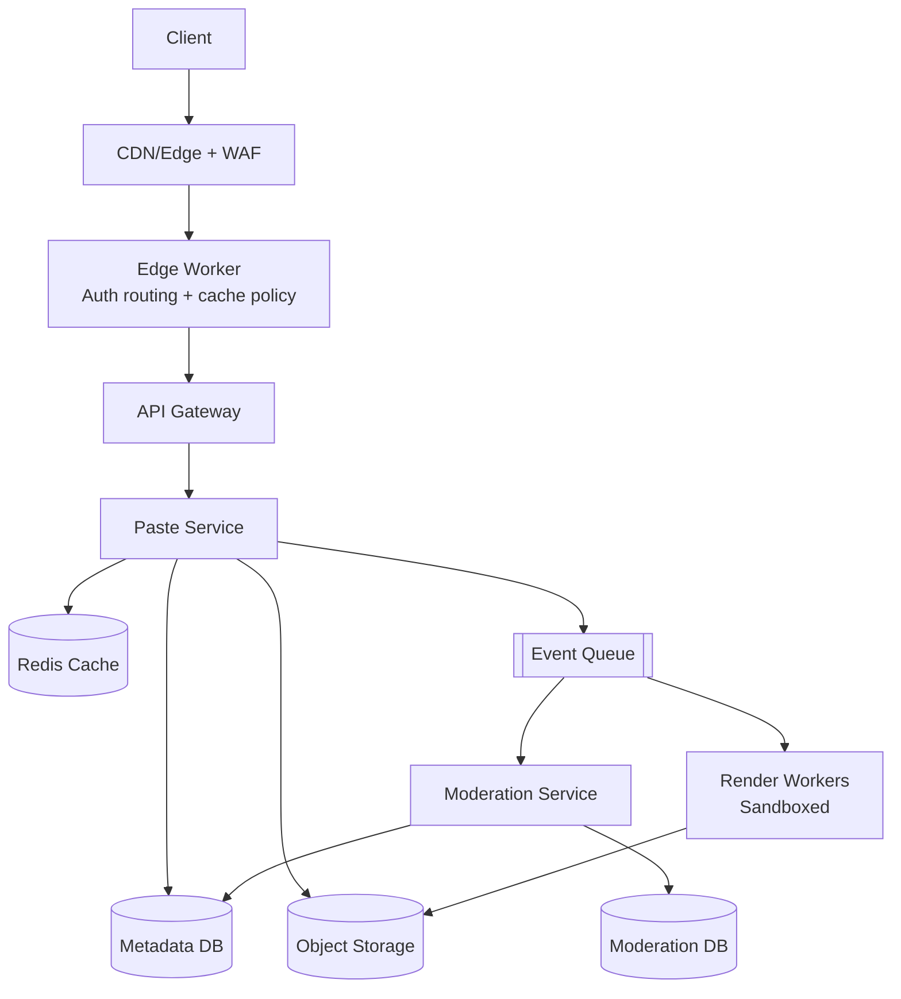
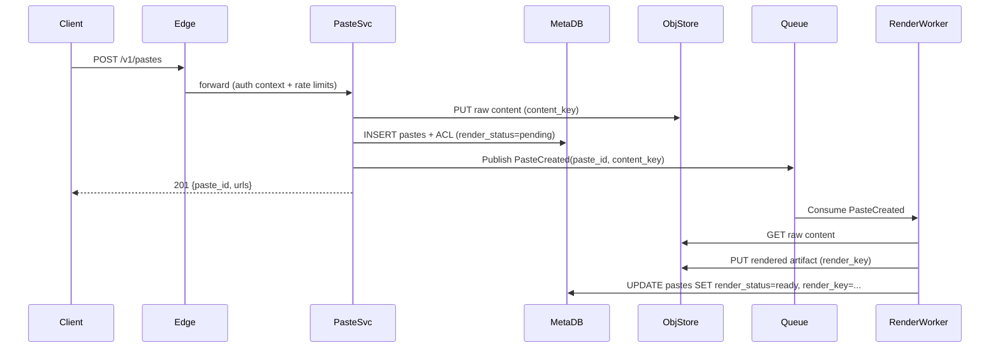

## Overview

A Pastebin-like service looks deceptively simple—store text and return a URL—but becomes a production system once you add fine-grained access control (ACLs), safe syntax highlighting, and abuse reporting with takedown workflows. The core challenges are:

1. Serving hot, mostly-read content at very low latency and low cost.
2. Enforcing authorization correctly across caches/CDNs (and not leaking private content).
3. Preventing the service from becoming a malware/phishing distribution channel while keeping moderation operationally tractable.

A robust design separates the **data plane** (fast delivery of paste content via CDN/cache/object storage) from the **control plane** (authorization, rate limits, moderation state, auditability). Paste **metadata + authorization** must be strongly consistent and quickly queryable; paste **content** can live in object storage and be cached aggressively when allowed.

Syntax highlighting is treated as an **asynchronous, sandboxed rendering pipeline**. The service should always be able to serve **raw text immediately**, and optionally upgrade to rendered HTML when ready.

---

## Requirements

### Functional Requirements
- Create a paste with TTL (e.g., 10 minutes to “never”), optional burn-after-read, and size limits.
- Retrieve a paste in raw text and rendered (syntax-highlighted) form.
- Support access modes:
  - `public`: indexable by users/search engines (optional).
  - `unlisted`: not indexed; accessible only via a guess-resistant URL.
  - `private`: requires authenticated ACL evaluation (and optionally an owner-generated share link).
- Manage ACLs per paste: owner, explicit allow list (users/groups), and optional share link (“capability token”).
- Support syntax selection (`language=auto|python|...`) and safe rendering (line numbers, copy-friendly).
- Report abuse (spam/phishing/malware/illegal content), track status, notify moderators.
- Moderator actions: quarantine (block reads), redact, delete, restore; maintain audit trail.
- Rate limiting and anti-abuse protections for create/read/report endpoints.

### Non-Functional Requirements (SLO/SLA Targets)
- **Scale (assumptions)**:
  - 20M MAU, 2M DAU
  - Peak reads: 50k QPS (GET raw/render)
  - Peak creates: 2k QPS
  - Average paste size: 8 KB (p95 64 KB, max 1 MB)
  - Storage footprint: ~0.5–1 PB over multiple years (depends heavily on TTL distribution and “never” retention)
- **Latency targets**:
  - Read (cache hit at edge): P50 30 ms, P99 150 ms
  - Read (origin): P50 120 ms, P99 400 ms
  - Create (write path): P50 150 ms, P99 600 ms
- **Availability**:
  - Reads: 99.99% (serve cached public/unlisted even during partial outages)
  - Writes: 99.9%
- **Consistency**:
  - Strong consistency for: paste visibility/quarantine/deletion, ACL changes, burn-after-read consumption, capability revocation.
  - Eventual consistency for: rendered artifacts, search indexes, analytics counters.
- **Durability**:
  - RPO ≤ 5 minutes for metadata (PITR + replicated DB)
  - Object storage provides high durability; expired pastes may be deleted permanently.

### Constraints & Assumptions
- Text-only pastes (no arbitrary binaries); max paste size 1 MB (configurable).
- Anonymous users allowed for `public`/`unlisted` create and read (with stricter limits); accounts required for `private` and persistent management.
- Small team constraint: prefer managed services (object storage, managed DB, managed queue).
- Compliance/Trust & Safety:
  - Retain moderation/audit logs for 1 year.
  - Support legal takedown workflows; optional region-based blocking.
  - “Unlisted” is not a security boundary; only `private` is.

---

## Architecture

### High-Level Diagram



### Request Routing Model (Why an Edge Worker)
CDNs are excellent at caching, but authorization and moderation state change frequently and must fail safe. An **edge worker** (e.g., Cloudflare Workers / Fastly Compute / Akamai EdgeWorkers) can:

- Apply strict cache policy per paste type (`public/unlisted` cacheable, `private` not cacheable).
- Enforce *fast-path* deny for quarantined/deleted/expired content.
- Avoid caching mistakes like serving a private response to another user due to missing `Vary`/cache-key configuration.

If edge compute is not available, you can still use a CDN with careful `Cache-Control`, `Vary`, and distinct hostnames/paths, but operational risk is higher.

---

## Components

### CDN + WAF + Edge Worker
**Responsibility**: TLS termination, coarse rate limiting, bot mitigation, cache policy enforcement, and safe routing.

**Key decisions**
- Cache only what is safe:
  - `public/unlisted`: cache raw and rendered responses (short TTL + stale-while-revalidate).
  - `private`: bypass CDN cache entirely (`Cache-Control: private, no-store`) and do not store at edge.
  - `burn_after_read`: bypass all shared caches.
- Prevent token leakage:
  - Prefer share links that do not rely on query params when possible (tokens in URLs leak via logs/referrers).
  - Always set `Referrer-Policy: no-referrer` on rendered pages and `X-Robots-Tag: noindex` on unlisted/private.
- Enforce request size limits at the edge.

**Technology**: Cloudflare/Akamai/Fastly + WAF and edge compute.

---

### Paste Service
**Responsibility**: Create/read/update/delete pastes; enforce ACLs; manage TTL and burn-after-read; generate IDs; integrate with moderation state.

**Key decisions**
- Split storage:
  - **Metadata + authorization state** in a strongly consistent DB (PostgreSQL/DynamoDB).
  - **Content** in object storage keyed by immutable object keys.
- Safer ID generation:
  - Use 96–128 bits of cryptographic randomness encoded as base62 (e.g., 16–22 chars) to make `unlisted` URLs guess-resistant.
  - Optionally support shorter IDs only for `public` content (still random) if you want “pretty URLs”.
- Read path policy:
  - For cacheable pastes, return stable `ETag`/`Last-Modified` and allow CDN caching.
  - For private/burn-after-read, require origin decision on every request.

**Technology**: Go/Java/Kotlin; PostgreSQL (or DynamoDB for pure key-value metadata); Redis for hot metadata and rate-limit counters.

---

### Auth + Groups
**Responsibility**: Authentication, token issuance/verification, and group membership lookup.

**Key decisions**
- Use short-lived access tokens (JWT or opaque) and support server-side revocation for sessions.
- Cache group memberships in Redis (e.g., 60s TTL) to avoid DB pressure on ACL checks.

**Technology**: Managed IdP (Cognito/Auth0) + internal group service, or Keycloak.

---

### Render Workers (Syntax Highlighting)
**Responsibility**: Compute sanitized rendered HTML from raw text + language hints.

**Key decisions**
- Render asynchronously and store output separately (`rendered.html`) to keep reads fast and isolate risk.
- Sandbox aggressively:
  - CPU/memory/time limits; no network; seccomp/gVisor/Firecracker.
  - Treat all input as hostile; limit line count/total tokens processed.
- Output safety:
  - Generate a minimal HTML subset and sanitize with an allowlist.
  - Serve with strict CSP (see Security section) and no inline script.

**Technology**: Chroma/Pygments/Tree-sitter; workers on Kubernetes/serverless with sandboxing.

---

### Moderation Service
**Responsibility**: Ingest abuse reports, run automated checks, manage quarantines/takedowns, maintain audit logs.

**Key decisions**
- “Quarantine first”:
  - A single metadata flag blocks all reads immediately (fail closed).
  - Deleting blobs can be asynchronous (lifecycle policies + background jobs).
- Immutable audit events for actions:
  - Store who did what and why; protect logs from tampering.

**Technology**: Separate service + PostgreSQL; queue consumers; optional integrations (URL scanners, threat intel).

---

## Data Model

### Metadata DB (PostgreSQL)
`pastes`
- `paste_id` (PK, base62)
- `owner_user_id` (nullable for anonymous)
- `visibility` (`public|unlisted|private`)
- `title` (nullable)
- `language` (e.g., `auto`, `python`)
- `content_key` (object storage key, immutable)
- `content_sha256`
- `size_bytes`
- `created_at`
- `expires_at` (nullable)
- `burn_after_read` (bool)
- `consumed_at` (nullable; set when burn-after-read consumed)
- `read_count` (bigint, optional; consider async/approx)
- `moderation_state` (`active|quarantined|redacted|deleted`)
- `deleted_at` (nullable)
- `render_status` (`pending|ready|failed`)
- `render_key` (nullable; object storage key for rendered artifact)
- `version` (int, optimistic concurrency)

`paste_acl_entries`
- `paste_id` (FK)
- `principal_type` (`user|group`)
- `principal_id`
- `permission` (`read|write|owner`)
- `created_at`
- PK: (`paste_id`, `principal_type`, `principal_id`, `permission`)

`capabilities` (optional; share links)
- `capability_id` (PK, UUID)
- `paste_id` (FK)
- `token_hash` (hash of secret token; never store raw)
- `permission` (`read`)
- `expires_at` (nullable)
- `revoked_at` (nullable)
- `created_at`
- `last_used_at` (nullable)

### Moderation DB
`abuse_reports`
- `report_id` (PK, UUID)
- `paste_id`
- `reporter_user_id` (nullable)
- `category` (`spam|phishing|malware|illegal|other`)
- `details` (text)
- `status` (`open|triaged|actioned|closed`)
- `created_at`, `updated_at`

`moderation_actions`
- `action_id` (PK, UUID)
- `paste_id`
- `moderator_user_id`
- `action` (`quarantine|redact|delete|restore`)
- `reason`
- `created_at`

### Object Storage Layout
- `pastes/{paste_id}/raw.v1.txt`
- `pastes/{paste_id}/rendered.v1.html` (optional)
- (Optional) `pastes/{paste_id}/artifact.json` for precomputed metadata (not authoritative)

### Data Flow (Create + Render)



---

## API

### Create Paste
`POST /v1/pastes`

Request:
```json
{
  "content": "string",
  "title": "string|null",
  "visibility": "public|unlisted|private",
  "language": "auto|python|javascript|...",
  "expires_in_seconds": 3600,
  "burn_after_read": false,
  "acl": {
    "allow_users": ["u123"],
    "allow_groups": ["g456"]
  }
}
```

Response `201`:
```json
{
  "paste_id": "2Gk9mQv8pZs3HcY1",
  "url": "https://paste.example/2Gk9mQv8pZs3HcY1",
  "raw_url": "https://paste.example/2Gk9mQv8pZs3HcY1/raw",
  "render_url": "https://paste.example/2Gk9mQv8pZs3HcY1/render"
}
```

Notes
- Enforce `Content-Length` and max size at the edge and service.
- Consider a two-step upload (pre-signed URL) only if you expect very large pastes; otherwise a single POST is simpler.

Errors: `400`, `401/403`, `413` (too large), `429`.

Idempotency:
- Support `Idempotency-Key` for authenticated clients; store `(user_id, key) -> paste_id` for 24h.

---

### Get Paste Metadata
`GET /v1/pastes/{paste_id}` (auth optional)

Response `200`:
```json
{
  "paste_id": "2Gk9mQv8pZs3HcY1",
  "visibility": "unlisted",
  "title": null,
  "language": "auto",
  "size_bytes": 1234,
  "created_at": "2025-01-01T00:00:00Z",
  "expires_at": null,
  "moderation_state": "active",
  "render_status": "pending"
}
```

Errors: `404` (not found/expired/deleted), `403` (exists but not authorized).

---

### Get Raw Content
`GET /v1/pastes/{paste_id}/raw`

Behavior
- Returns `text/plain; charset=utf-8`
- Cache policy:
  - `public/unlisted` (not burn-after-read): cacheable (`Cache-Control: public, max-age=300, stale-while-revalidate=600`) and `ETag`.
  - `private` or `burn_after_read`: `Cache-Control: private, no-store`.
- Burn-after-read semantics:
  - Implement as an atomic consume in the metadata DB (first authorized read sets `consumed_at`).
  - If delivery fails after consuming, the paste may still be considered consumed (documented behavior).

---

### Get Rendered Content
`GET /v1/pastes/{paste_id}/render`

Behavior
- Returns sanitized `text/html; charset=utf-8`
- If render not ready:
  - Return `302` to `/raw`, or `200` with a small placeholder HTML that embeds no user content.
- Security headers (minimum):
  - `Content-Security-Policy: default-src 'none'; style-src 'self'; img-src 'self' data:; base-uri 'none'; form-action 'none'`
  - `X-Content-Type-Options: nosniff`
  - `Referrer-Policy: no-referrer`

---

### Manage ACL (Owner Only)
`PUT /v1/pastes/{paste_id}/acl`

Request:
```json
{
  "allow_users": ["u123", "u999"],
  "allow_groups": ["g456"],
  "capability": { "enabled": true, "expires_in_seconds": 604800 }
}
```

Response `200`:
```json
{
  "paste_id": "2Gk9mQv8pZs3HcY1",
  "capability_token": "one-time-token-value-or-null",
  "capability_expires_at": "2025-01-08T00:00:00Z"
}
```

Notes
- Return the raw capability token only at creation/rotation time; store only a hash server-side.

---

### Report Abuse
`POST /v1/pastes/{paste_id}/abuse-reports`

Request:
```json
{ "category": "phishing", "details": "Looks like credential harvesting" }
```

Response `202`:
```json
{ "report_id": "f3f6d8d1-9ad7-4b8e-b05c-2d1c1f0d0e2a" }
```

Operational safeguards
- Heavily rate limit and dedupe by `(paste_id, reporter, time_window)`.
- For anonymous reporting, require higher friction (captcha / proof-of-work) under attack.

---

## Scaling & Performance

### Capacity Planning (Back-of-the-Envelope)
Assumptions:
- Peak reads: 50k QPS
- Average raw size: 8 KB
- If 95% served from edge, origin sees ~2.5k QPS
- Origin egress for misses: 2.5k * 8 KB ≈ 20 MB/s (plus headers), manageable

This is why the architecture prioritizes: **CDN cacheability for safe content**, **small metadata reads**, and **object storage offload**.

### Caching Strategy
**CDN**
- Cache `GET /raw` and `GET /render` for `public/unlisted` (not burn-after-read):
  - `Cache-Control: public, max-age=300, stale-while-revalidate=600`
  - Prefer `ETag` for efficient revalidation.
- Do not cache `private` responses:
  - `Cache-Control: private, no-store`
  - Avoid “vary by auth token” unless you have mature cache-key tooling; it’s easy to misconfigure and leak data.

**Redis**
- Cache paste metadata hot fields:
  - `paste:{id} -> visibility, expires_at, moderation_state, content_key, render_status, render_key, burn_after_read`
  - TTL 60–300s (shorter for frequently-updated state like moderation).
- Cache ACL evaluation results:
  - `acl:{paste_id}:{user_id} -> allow/deny`, TTL 30–60s
  - Invalidate on ACL updates via pub/sub or key versioning.

### Metadata DB Scaling
- Start with PostgreSQL:
  - Primary + read replicas for non-authoritative reads (e.g., metadata display).
  - Partitioning by hash of `paste_id` once tables grow large (improves vacuum/index locality).
- If workload becomes pure key-value with extreme scale, DynamoDB is a viable alternative, but ACL/group evaluation and reporting queries often push you back toward relational + secondary indexes.

### Renderer Throughput & Backpressure
- Use separate queues for rendering vs moderation to prevent head-of-line blocking.
- Enforce:
  - Max rendering concurrency per worker node
  - Queue lag alerts (e.g., >10 minutes)
  - Drop/skip rendering for expired/quarantined/deleted pastes

---

## Trade-offs & Alternatives

### Key Trade-offs
- **Object storage for content vs DB blobs**: cheaper and more scalable for reads, but introduces two-phase durability (DB + object store) and orphan cleanup concerns.
- **Async render vs render-on-read**: protects the read SLO and isolates risky parsing, but users may not see highlighting immediately.
- **ACLs + capability links**: improves sharing UX, but capability tokens behave like bearer credentials (must handle leakage, revocation, and audit).
- **Edge authorization vs origin-only**: edge checks reduce origin load and improve safety for quarantines, but increase complexity and require careful rollout/testing.

### Alternatives
- **Client-side highlighting**: simplest backend; inconsistent UX and still requires safe HTML templating if you render anything server-side.
- **Pre-signed object storage URLs for reads**: reduces origin bandwidth; complicates private access control, link revocation, and consistent moderation enforcement.
- **Single-table NoSQL everything**: can work, but audit/moderation workflows and ACL queries often become complicated without careful denormalization and secondary indexes.

---

## Failure Modes & Mitigations

### Failure Scenarios
- **Metadata DB outage**
  - Impact: private reads/writes fail; public/unlisted cached reads may continue from CDN.
  - Detection: elevated 5xx, DB health checks, connection pool saturation.
  - Mitigation: fail closed for private; serve stale cached public; promote replica; shed load; enable “read-only public mode.”

- **Object storage throttling/outage**
  - Impact: cache misses fail; edge hits continue.
  - Detection: increased origin latency/5xx from storage client.
  - Mitigation: increase CDN TTL temporarily; retries with jitter; optionally multi-region buckets + failover for hot content.

- **Cache misconfiguration leaks private data (highest severity)**
  - Impact: unauthorized disclosure.
  - Detection: automated cache-key tests/canaries; security review of `Cache-Control`/`Vary`; anomaly detection on access logs.
  - Mitigation: default `private, no-store` unless explicitly public; separate hostnames for private; edge worker policy; kill switch to disable caching globally.

- **Renderer compromise / XSS regression**
  - Impact: user data exposure/session theft risk.
  - Detection: CSP violation reports, canary renders, SAST/DAST, sandbox escape alerts.
  - Mitigation: strict HTML allowlist sanitization, strong CSP, isolate renderer, kill switch to serve raw only.

- **Abuse spike (spam/phishing)**
  - Impact: cost increase, reputational harm, upstream provider complaints.
  - Detection: create QPS anomalies, WAF blocks, report volume spikes.
  - Mitigation: tighten anonymous limits, CAPTCHA/PoW for suspicious traffic, temporarily disable `public` creates, quarantine by heuristic and require review.

### Disaster Recovery
- **RPO/RTO**: RPO ≤ 5 minutes for metadata; RTO ~1 hour for full write capability (reads can degrade gracefully via CDN).
- **Backups**: Postgres PITR + daily snapshots; moderation DB same; test restores monthly.
- **Failover**: Multi-AZ DB with automated failover; CDN multi-region; optionally replicate object storage for regional resilience.

---

## Operations

### Observability
- Metrics:
  - QPS, P50/P95/P99 latency by endpoint and visibility class
  - CDN hit ratio, origin offload %, Redis hit ratio
  - DB CPU/IO, slow queries, connection pool saturation
  - Queue lag, render success/fail rate, sandbox timeouts
  - Moderation actions/hour, quarantine latency (time-to-block)
- Logs/Tracing:
  - Correlation IDs end-to-end; structured logs with redaction (never log paste content or tokens).
- Alerts (examples):
  - Read P99 > 300 ms (5 min)
  - 5xx > 1% (2 min)
  - Render queue lag > 10 min
  - Quarantine latency > 60s (safety SLO)

### Security & Privacy
- Default safe headers:
  - `X-Content-Type-Options: nosniff`, `Referrer-Policy: no-referrer`
  - `X-Robots-Tag: noindex` for `unlisted/private`
- Rendered HTML:
  - Strict CSP; no inline JS; sanitize aggressively.
- Secrets and sensitive data:
  - Treat paste content as potentially sensitive; minimize retention in logs/analytics.
  - Encrypt at rest (managed) and in transit.
- Capability tokens:
  - Store only a hash; support revocation and expiration; rate limit token guessing; detect brute force.

### Deployment & Change Management
- Canary/blue-green for Paste Service and edge worker policy changes.
- Backward-compatible DB migrations:
  - Add columns/indexes first, deploy code, then enforce constraints.
- Feature flags:
  - Kill switch for rendered endpoint
  - Toggle stricter anonymous create limits during incidents

---

## References & Further Reading
- OWASP XSS Prevention Cheat Sheet: https://owasp.org/www-community/xss-prevention
- Content Security Policy (CSP): https://developer.mozilla.org/en-US/docs/Web/HTTP/CSP
- Cache-Control and caching semantics: https://developer.mozilla.org/en-US/docs/Web/HTTP/Headers/Cache-Control
- Pygments (syntax highlighting): https://pygments.org/
- Chroma (syntax highlighting): https://github.com/alecthomas/chroma
- Tree-sitter: https://tree-sitter.github.io/tree-sitter/
- Capability-based security: https://en.wikipedia.org/wiki/Capability-based_security