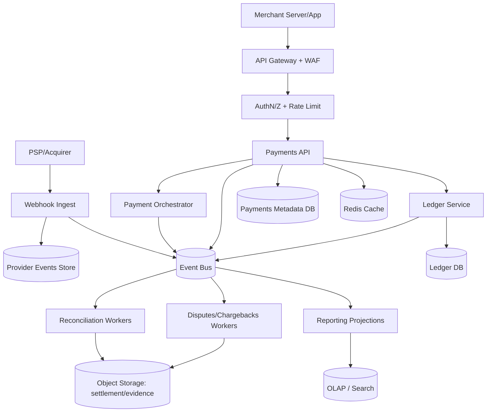
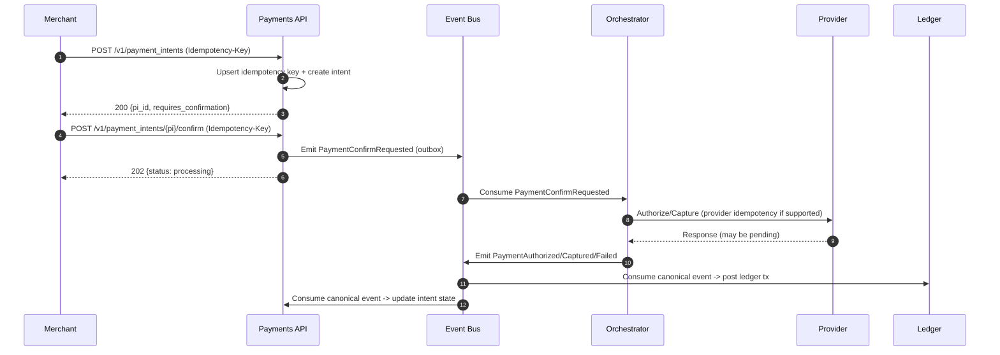
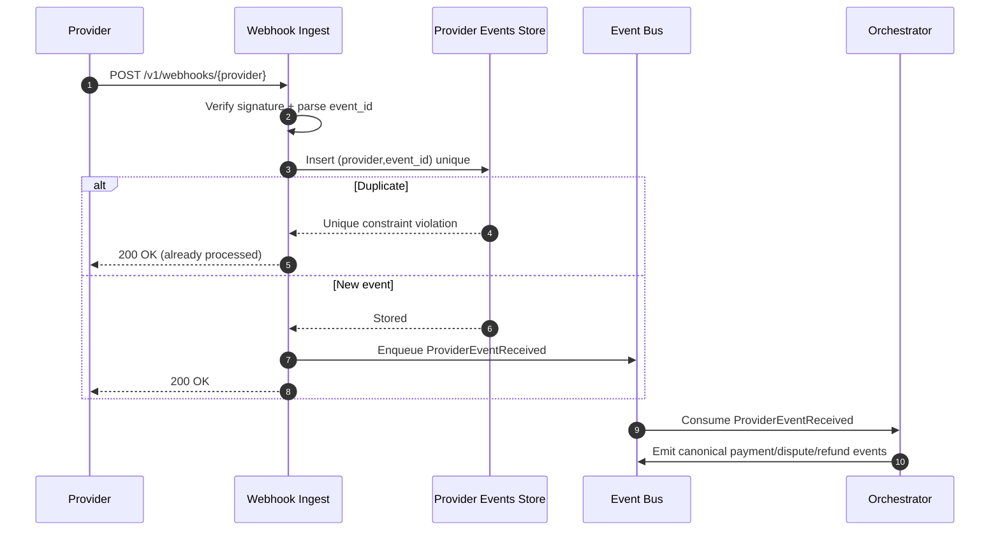

## Overview

A payment processing gateway sits on the critical path of revenue. It accepts payment intents from merchants, securely handles sensitive payment data, routes transactions to external processors/acquirers, and produces an auditable financial record. The hard parts are correctness under retries/timeouts (idempotency), financial integrity (double-entry ledger + reconciliation), and post-transaction lifecycle events (refunds, disputes/chargebacks, payouts)—all under strict security/compliance constraints (PCI DSS) and high availability expectations.

**Core design principle**: separate **payment orchestration** (talking to providers and managing async payment flows) from **financial truth** (an immutable, double-entry ledger). Connect them with durable events and deterministic state transitions so that APIs remain safe under at-least-once delivery and operator replays.

## Requirements

### Functional Requirements
- Create and manage `PaymentIntent` for `authorize`, `capture`, and `sale` flows (automatic or manual capture).
- Support multiple payment methods (cards, wallets) and multiple providers (PSPs/acquirers), including routing/failover rules.
- Enforce idempotency for all mutating operations: create/confirm/capture/refund/payout, safe under retries and client timeouts.
- Ingest provider webhooks/events with signature verification, deduplication, and correct handling of out-of-order delivery.
- Maintain a double-entry ledger for all money movements: payments, refunds, fees, disputes/chargebacks, chargeback fees, payouts, adjustments.
- Provide merchant-facing reporting APIs: transactions, balances (available/pending/reserved), settlements, exports.
- Provide operational tools: manual review/override with audited actions, controlled replays for failed workflows, and reconciliation exception management.
- Minimize PCI DSS scope: tokenize PAN; never store CVV; tightly control card data access.

### Non-Functional Requirements

#### Scale (Target + Rationale)
Assume **5M registered merchants**, with **200k–500k active** (daily). Traffic is highly spiky around global shopping peaks.

- **Transactions**: ~50M successful payments/day (avg ~580 TPS), plus failures/retries and non-payment ops (refunds, captures, disputes).
- **API peak**: 20k QPS across endpoints (create/confirm/refund/list), with hot-merchant skew.
- **Webhook peak**: 5k QPS (providers often batch-retry and burst during incidents).
- **Data growth** (order-of-magnitude):
  - If each payment produces ~1 intent row update stream + ~1–3 provider events + ~6–12 ledger entries, then at 50M/day this yields hundreds of millions of append rows/day.
  - Expect **1–5 TB/month** compressed across ledger + events + derived projections (highly dependent on row size and indexing strategy).

#### Latency Targets (User-Perceived)
- **Create intent (internal-only)**: P50 40ms, P99 200ms.
- **Confirm intent (gateway response, excluding provider)**: P50 60ms, P99 250ms.
- **End-to-end confirm (including provider)**: P50 400–800ms, P99 2–5s (provider/network-dependent; 3DS/SCA can be minutes and async).
- **Webhook ingestion acknowledgment** (durable write + enqueue): P99 200ms.

#### Availability & SLOs
- **Public API**: 99.99% monthly availability (≈4.3 minutes/month).
- **Webhook ingestion**: 99.99% monthly availability (ack after durable write).
- **Ledger posting path**: fail-closed for money movement; prefer backpressure/queuing over partial writes.

#### Consistency & Delivery Semantics
- **Strong consistency** for:
  - Idempotency key resolution (per merchant + key).
  - Ledger posting and balance-affecting transitions (per account partition).
- **Eventual consistency** for:
  - Reporting/search/analytics projections, exports, and dashboards.
- **At-least-once** delivery for internal events; ensure **exactly-once effects** via idempotency + unique constraints + deterministic state machines.

#### Durability & Retention
- Ledger entries: **RPO 0** (never acknowledge a financial mutation unless durably committed).
- Derived views: RPO ≤ 5 minutes (rebuildable from authoritative logs/ledger).
- Audit logs and financial records: retain **7+ years** (jurisdiction-dependent), with WORM controls where required.

### Constraints & Assumptions
- PCI DSS scope minimization via tokenization/vault; CVV never stored; PAN access restricted and logged.
- Small platform team (8–12 engineers) initially; avoid premature microservice sprawl while preserving clear boundaries.
- Multi-region for edge + reads + webhook ingestion; **single-writer per merchant/account partition** for ledger invariants.
- Compliance: PCI DSS + SOC2; GDPR/data residency supported via tenant partitioning, encryption, and data lifecycle controls.

## Architecture

### High-Level Diagram



### Key Ideas
- **Idempotency at the boundary**: every mutating request is safe to retry; the system returns the original response when replayed.
- **Provider interactions are async-first**: treat provider responses and webhooks as inputs to a state machine; avoid assuming synchronous finality.
- **Ledger is the system of record**: append-only, double-entry postings; balances are derived from entries and/or snapshots.
- **Outbox / transactional enqueue**: whenever a service changes durable state, it emits an event atomically so consumers can rebuild projections.

### Multi-Region Topology (Practical)
- Global edge (anycast/CDN/WAF) terminates TLS and routes to the closest region.
- **Merchant partition map** determines the “home” (primary) region for ledger writes per `(merchant_id, currency)` (or per merchant if single-currency).
- Webhooks are accepted in any region but forwarded (via event bus) to the merchant’s home region for ordered processing where required.

## Component Deep-Dive

### API Gateway / Auth / Rate Limiting
**Responsibility**: TLS termination, WAF, auth (OAuth2/JWT + merchant API keys), rate limiting, request normalization, and enforcement of idempotency headers for mutating routes.

**Key decisions**
- Rate limits at **merchant** and **IP** levels; separate burst vs sustained quotas.
- Maintain a clear boundary between external auth (merchant) and internal service auth (mTLS + workload identity).

**Typical tech**
- Envoy/NGINX + managed API gateway (Kong/Apigee) + WAF.
- Redis for distributed counters (with local in-process caching to reduce hot calls).

### Payments API
**Responsibility**: merchant-facing contract for `PaymentIntent` lifecycle and refunds; idempotency; state machine validation; synchronous creation of *authoritative intent metadata*.

**Key decisions**
- `PaymentIntent` is the primary external abstraction; provider transaction IDs are attributes, not identities.
- State machine enforces valid transitions and prevents “double capture” and invalid refunds.
- Use optimistic concurrency (`version`) for intent updates; guard critical transitions with idempotency keys.

**Typical tech**
- Stateless service (Go/Java/Kotlin) + Postgres/Spanner for metadata.
- Redis for hot reads (merchant config, idempotency cache) with safe fallbacks to DB.

### Payment Orchestrator
**Responsibility**: provider routing, adapters, retries/backoff, timeout handling, 3DS/SCA flows, and canonicalization of provider outcomes into internal events.

**Key decisions**
- Normalize provider outcomes into canonical events such as `PaymentAuthorized`, `PaymentCaptured`, `PaymentFailed`, `RefundSucceeded`, `DisputeOpened`.
- Keep provider-specific state and polling logic here (e.g., “pending” statuses).
- Use per-provider **concurrency limits** and circuit breakers to avoid cascading failures.

**Typical tech**
- Worker service consuming commands/events from the bus; HTTP clients with retries + jitter + circuit breakers.
- Secrets in KMS/HSM; request signing as required by providers.

### Webhook Ingest
**Responsibility**: fast, durable acceptance of provider events with signature verification and deduplication.

**Key decisions**
- Acknowledge (`2xx`) only after **durable storage** of the raw event (or its hash + payload pointer) and enqueue of a processing message.
- Deduplicate on `(provider, provider_event_id)` with a unique constraint; store payload hash to detect suspicious variance.

**Typical tech**
- Stateless ingest + Postgres/Spanner (or durable KV) for dedup keys + minimal metadata; payload stored encrypted if retained.

### Ledger Service
**Responsibility**: immutable double-entry postings, enforcing accounting invariants, and maintaining balance snapshots and posting idempotency.

**Key decisions**
- Append-only ledger entries; never update money-in-place.
- Serialize postings per **account partition** (e.g., `(merchant_id, currency)`), using DB transactions and constraints to ensure correctness.
- Separate *ledger finality* from *provider finality*: pending vs available balances are modeled explicitly (e.g., `pending_funds`, `available_funds`, `reserve` accounts).

**Typical tech**
- Postgres with partitioned tables + strong constraints, or Spanner for globally consistent writes.
- Optional OLAP sink for heavy reporting queries.

### Reconciliation
**Responsibility**: match internal events/ledger to provider settlement reports and bank statements; detect drift and drive exception workflows.

**Key decisions**
- Reconciliation is a first-class workflow: ingest → normalize → match → exceptions → resolve → close.
- Adjustments are explicit ledger transactions, never silent balance edits.

**Typical tech**
- Batch jobs + streaming consumers; object storage for settlement files; case management in Postgres.

### Disputes / Chargebacks
**Responsibility**: manage dispute lifecycle and evidence submission; post corresponding ledger movements (holds, withdrawals, returns, fees).

**Key decisions**
- Disputes create **new** ledger transactions; they do not mutate historical payment postings.
- Model realistic stages (notification, evidence due, representment, win/loss, reversal).

## Data Model

### Key Entities
- **Merchant**: configuration, risk settings, provider routing rules.
- **Customer**: merchant-scoped identity (avoid global PII joins where possible).
- **PaymentMethod**: tokenized reference (network token / provider token); last4/brand/expiry are non-sensitive metadata.
- **PaymentIntent**: desired payment action and lifecycle state; references provider attempts.
- **Refund**: separate resource; supports partial and multiple refunds up to captured amount.
- **ProviderEvent**: dedup key + raw payload pointer/hash; links to canonical events.
- **Dispute**: dispute workflow state + deadlines + evidence pointers.

### Relational Schema (Illustrative)
**Metadata DB (Postgres/Spanner)**
- `merchants(merchant_id, status, default_currency, config_json, created_at)`
- `customers(customer_id, merchant_id, email_hash, created_at)`
- `payment_methods(pm_id, merchant_id, customer_id, type, token, last4, brand, exp_month, exp_year, created_at)`
- `payment_intents(pi_id, merchant_id, amount, currency, status, capture_method, created_at, updated_at, version)`
- `payment_attempts(attempt_id, pi_id, provider, provider_ref, status, created_at, updated_at)`  
  - Unique: `(provider, provider_ref)` where available
- `refunds(refund_id, pi_id, merchant_id, amount, currency, status, provider_ref, created_at, updated_at)`
- `idempotency_keys(merchant_id, idem_key, request_hash, response_blob, status, created_at, expires_at)`  
  - Unique: `(merchant_id, idem_key)`
- `provider_events(provider, provider_event_id, received_at, payload_hash, raw_payload_ptr, canonical_event_id)`  
  - Unique: `(provider, provider_event_id)`
- `disputes(dispute_id, pi_id, merchant_id, provider_ref, stage, reason_code, status, due_by, created_at, updated_at)`

### Ledger Model (Append-Only)
**Core tables**
- `accounts(account_id, merchant_id, currency, type)`  
  Examples: `merchant_available`, `merchant_pending`, `platform_fees`, `provider_clearing`, `dispute_reserve`
- `ledger_transactions(ltx_id, merchant_id, currency, type, correlation_id, created_at)`  
  `correlation_id` ties together `pi_id`, `refund_id`, `dispute_id`, or settlement batch IDs.
- `ledger_entries(entry_id, ltx_id, account_id, direction, amount, created_at)`  
  Amounts are **integers in minor units** (e.g., cents) to avoid floating-point errors.

**Invariants**
- For every `ltx_id`: `sum(debits.amount) == sum(credits.amount)` (enforced by transaction-level checks).
- Ledger entries are immutable; reversals are new transactions with their own entries.
- Optional: `posting_idempotency(merchant_id, posting_key, ltx_id, created_at)` to guarantee exactly-once posting for a given business action.

**Balances**
- `balance_snapshots(account_id, as_of_entry_id, balance, updated_at)` for fast reads.
- Merchant-facing balance typically aggregates:
  - `available = merchant_available - reserve`
  - `pending = merchant_pending`
  - `reserved = dispute_reserve` (or similar)

### Event Model & Ordering
- Canonical internal events include:
  - `PaymentIntentCreated`, `PaymentAuthorized`, `PaymentCaptured`, `PaymentFailed`
  - `RefundCreated`, `RefundSucceeded`, `RefundFailed`
  - `DisputeOpened`, `DisputeWon`, `DisputeLost`
  - `SettlementIngested`, `SettlementMatched`, `AdjustmentPosted`
- Ordering guarantees are **partition-scoped** (e.g., by `merchant_id`), not global. Consumers must handle reordering and duplication.

## Data Flows

### Confirm (Sync + Async) Flow



### Webhook Ingestion Flow (Dedup + Canonicalize)



## API Design

### Conventions
- **Idempotency**: `Idempotency-Key` required for all POST/PUT/PATCH endpoints that mutate state.
  - Scope: `(merchant_id, Idempotency-Key)`
  - Store `request_hash` to prevent key reuse with different payloads (`409 idempotency_conflict`).
- **Request IDs**: include `request_id` in responses; log and propagate to downstream services.
- **Retries**:
  - Safe to retry on `5xx`, `429`, and selected `409/503` with backoff.
  - Use `202 Accepted` for operations that may complete asynchronously.
- **Money representation**: integers in minor units + ISO currency code.
- **Pagination**: cursor-based (`starting_after`, `ending_before`) for transaction listing.

### Core Resources (REST)

**Create PaymentIntent**
- `POST /v1/payment_intents`
- Request:
  ```json
  {
    "amount": 4999,
    "currency": "USD",
    "customer_id": "cus_123",
    "payment_method_id": "pm_123",
    "capture_method": "automatic",
    "metadata": { "order_id": "ord_987" }
  }
  ```
- Response:
  ```json
  {
    "id": "pi_123",
    "status": "requires_confirmation",
    "amount": 4999,
    "currency": "USD"
  }
  ```

**Confirm PaymentIntent**
- `POST /v1/payment_intents/{pi_id}/confirm`
- Response (async default):
  ```json
  {
    "id": "pi_123",
    "status": "processing",
    "next_action": null
  }
  ```
- If 3DS/SCA required:
  ```json
  {
    "id": "pi_123",
    "status": "requires_action",
    "next_action": { "type": "redirect", "url": "https://..." }
  }
  ```

**Capture (Manual Capture)**
- `POST /v1/payment_intents/{pi_id}/capture`
- Idempotent: repeated capture returns the same final state and identifiers.

**Create Refund**
- `POST /v1/refunds`
- Request:
  ```json
  { "payment_intent_id": "pi_123", "amount": 2000, "reason": "requested_by_customer" }
  ```

**Get Balance**
- `GET /v1/balance`
- Response shape should separate `available`, `pending`, and `reserved` amounts.

**List Transactions**
- `GET /v1/transactions?created_gte=...&limit=...`

**Webhook Endpoint**
- `POST /v1/webhooks/{provider}`
- Requirements:
  - Verify signature and timestamp (replay protection).
  - Dedup by `(provider, provider_event_id)` with a unique constraint.
  - Return `2xx` only after durable write + enqueue.

### Errors
- `400 invalid_request`
- `401 unauthorized`
- `403 forbidden`
- `409 idempotency_conflict` (same key, different request body)
- `409 conflict` (resource version conflict where applicable)
- `422 invalid_state_transition`
- `429 rate_limited`
- `502 provider_unavailable`
- `504 provider_timeout` (prefer `202 processing` when outcome is unknown but safe to resolve async)

## Scaling & Performance

### Capacity Planning Hot Spots
- **Provider dependency**: dominates end-to-end latency and drives retries; isolate with circuit breakers and bounded queues.
- **Ledger write contention**: strongest correctness constraints sit here; mitigate by careful partitioning and minimal synchronous postings.
- **Hot merchants**: skew can overload partitions; enforce per-merchant quotas and isolate via queueing.

### Partitioning Strategy
- **Event bus topics** partitioned by `merchant_id` (or `(merchant_id, currency)` where required) to preserve per-merchant ordering for stateful consumers.
- **Ledger DB** sharded/partitioned by `(merchant_id, currency)` with time-based partitions for large append tables.
- **Metadata DB** partitioned by `merchant_id` to reduce cross-tenant contention.

### Backpressure and Load Shedding
- Prefer returning `202 processing` over holding connections when provider latency is high.
- Protect providers and internal systems with:
  - per-provider concurrency limits
  - bounded work queues + dead-letter queues
  - adaptive timeouts and retry budgets
- Fail closed on ledger posting: if ledger is unavailable, accept requests only if they can be safely queued without ambiguity (otherwise return an error).

### Caching
- Redis for:
  - rate limiting counters
  - merchant configuration/routing rules
  - short-lived idempotency hot cache (DB remains the authority)
- Cache safe GETs with short TTL (1–5s) per merchant; use `ETag` for conditional requests.
- Invalidate derived caches via `BalanceUpdated` and `TransactionPosted` events.

## Trade-offs & Alternatives

### Key Trade-offs
1. **Strong ledger consistency (per partition)**  
   - Pros: prevents balance races; clean audit story; simpler reconciliation.  
   - Cons: constrained write parallelism; requires careful sharding and hot-merchant handling.

2. **Async-first confirmation (`202 processing`)**  
   - Pros: resilient to provider timeouts; reduces tail latency; simplifies retries.  
   - Cons: more complex client integration (polling/webhooks); requires clear “pending” semantics.

3. **Event bus + projections for reporting**  
   - Pros: decouples core path from analytics; rebuildable read models; scalable exports/search.  
   - Cons: operational overhead (consumer lag, schema evolution, replay safety).

4. **PCI scope minimization via tokenization/vault**  
   - Pros: smaller audit surface; reduced breach impact.  
   - Cons: additional dependency and failure mode; careful key management and access controls required.

### Alternative Approaches
- **Single monolith + single DB**: simpler initially, but provider/webhook/dispute complexity and deployment risk scale poorly.
- **Full event sourcing for all state**: excellent auditability and replay, but increases engineering complexity and demands maturity in schema evolution and projections.
- **Outsource system-of-record to a processor**: faster to launch, but weak control over reconciliation, dispute workflows, and vendor lock-in risk.

## Failure Modes & Resilience

### Failure Scenarios (Examples)
1. **Client retries `confirm` after timeout**  
   - Risk: double charge / inconsistent state.  
   - Mitigation: idempotency key + request hash; provider idempotency where supported; deterministic state transitions.

2. **Webhook duplication and reordering**  
   - Risk: illegal transitions or repeated ledger postings.  
   - Mitigation: dedup by `(provider,event_id)`; canonical event idempotency; state machine rejects invalid transitions; reconciler corrects drift.

3. **Provider outage / high latency**  
   - Risk: checkout failures and retries storm.  
   - Mitigation: circuit breakers, retry budgets, async confirmations, multi-provider routing, bounded queues.

4. **Ledger partition outage / failover**  
   - Risk: inability to post money movements.  
   - Mitigation: fail closed; queue safe operations; rapid failover; strong monitoring on replication lag and error spikes.

5. **Reconciliation drift (missing settlements, mismatched fees)**  
   - Risk: reporting inaccuracies, hidden losses.  
   - Mitigation: daily automated reconciliation with exception queues; explicit adjustment transactions; operational review tooling.

6. **Webhook secret compromise / forged events**  
   - Risk: fraudulent state transitions and postings.  
   - Mitigation: signature verification + replay protection; secret rotation; least privilege; anomaly detection; IP allowlists where feasible.

### Disaster Recovery
- **RPO/RTO**:
  - Ledger: RPO 0 for acknowledged postings; target RTO ≤ 30 minutes for write availability (depends on datastore).
  - APIs: RTO ≤ 30 minutes; reads can be served cross-region with degraded freshness if needed.
- **Backups**:
  - Continuous WAL/transaction log archiving; daily full backups; routine restore drills.
  - Object storage versioning + retention locks (WORM) for settlement/evidence/audit artifacts.
- **Failover**:
  - Active-active for stateless edge/API/ingest.
  - Single-writer per ledger partition; automated promotion with strict fencing to prevent split-brain.

## Operational Considerations

### Observability
**Golden signals**
- API: QPS, P50/P95/P99 latency, error rate by code, idempotency replay rate, `invalid_state_transition` count.
- Orchestrator: provider latency/error rates, circuit breaker state, queue depth, retry counts, time-in-state for “processing”.
- Webhook ingest: signature failures, dedup hit rate, enqueue latency.
- Ledger: posting latency, constraint violations, partition hotspots, replication lag, snapshot freshness.
- Reconciliation: unmatched totals, exception backlog, ingest failures.

**Alerting (examples)**
- API `5xx` > 1% for 5 minutes (page).
- Ledger posting failures > 0 sustained for 2 minutes (page).
- Provider timeout spikes + circuit breaker open (page).
- Webhook signature failures spike (page; investigate compromise/misconfig).
- Reconciliation unmatched totals beyond threshold (ticket/page based on magnitude).

### Deployment & Change Management
- Canary + feature flags for provider routing and state-machine changes.
- Versioned event schemas; backward-compatible consumers.
- DB migrations with expand/contract; avoid locking migrations on hot tables.
- Safe replay tooling with guardrails (idempotency keys, posting keys, dry-run mode).

### Security & Compliance
- PCI DSS: isolate card data in a vault; restrict scope; encrypt in transit and at rest; strong access controls and audit logs.
- Secrets management: KMS/HSM-backed keys; rotation; per-provider isolation.
- Data privacy: minimize PII; hash/ tokenize identifiers; enforce retention policies; support GDPR deletion where legally permissible (financial records often require retention; delete or anonymize non-financial PII).

## References & Further Reading
- PCI DSS v4.0: https://www.pcisecuritystandards.org/
- Stripe engineering blog (payments, idempotency concepts): https://stripe.com/blog
- Designing Data-Intensive Applications (transactions, logs, consistency): https://dataintensive.net/
- Transactional outbox pattern: https://microservices.io/patterns/data/transactional-outbox.html
- Double-entry bookkeeping: https://en.wikipedia.org/wiki/Double-entry_bookkeeping
- Payments settlement & reconciliation (industry overview): https://www.bis.org/cpmi/publ/d174.pdf