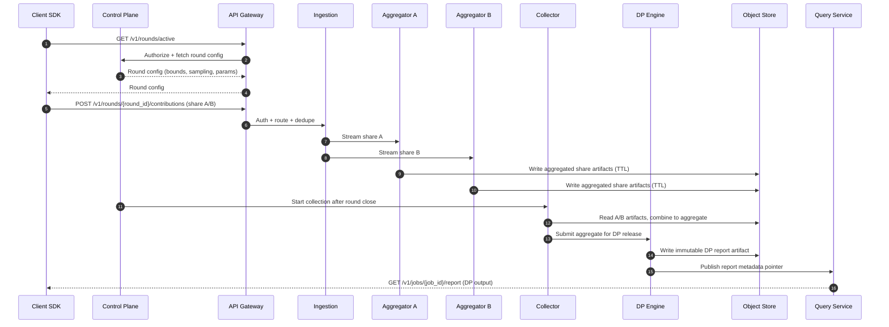
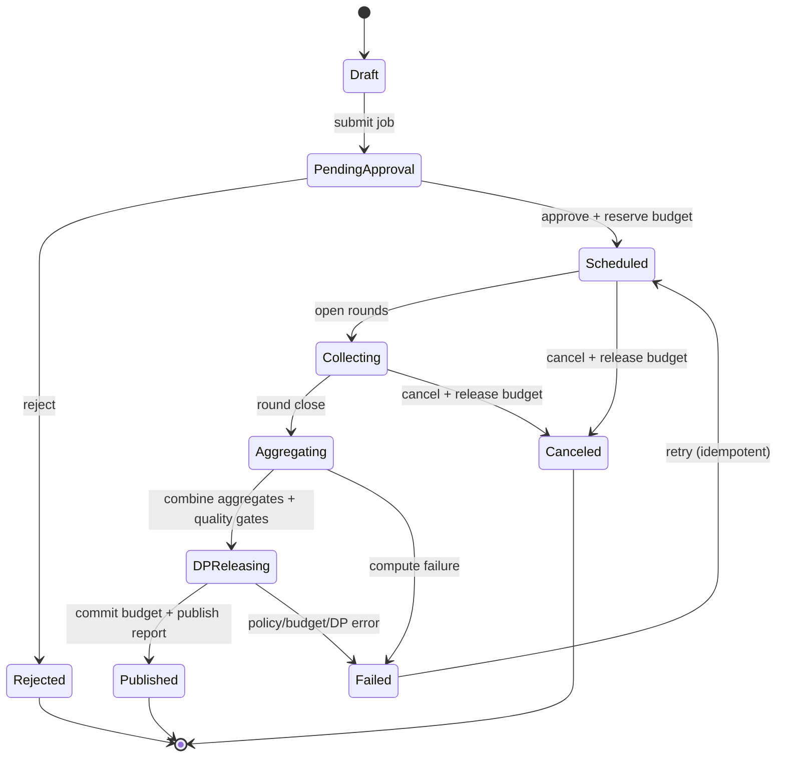

# Privacy-Preserving Analytics

## Overview

Privacy-preserving analytics computes useful aggregate statistics (counts, rates, histograms, top‑k, quantiles) while preventing access to raw, user-level data and limiting re-identification risk. A production-grade system must simultaneously address:

- **Privacy**: formal guarantees (differential privacy), strict contribution bounds, privacy budget enforcement, and auditable governance.
- **Security**: insider resistance (“no raw access”), cryptographic protections in transit and at rest, least privilege, and strong audit trails.
- **Reliability at scale**: intermittent clients, retries/duplicates, malicious inputs, and large fan-in.
- **Correctness**: deterministic job lifecycle, exactly-once budget debits, and reproducible releases.

This design combines:
1. **On-device pre-aggregation** with **contribution bounding** (clipping, per-user caps, per-window limits).
2. **Secure aggregation** using a **multi-aggregator** protocol (e.g., VDAF-style) so no single server learns individual contributions.
3. **Central differential privacy (DP)** applied to aggregated results with a **privacy budget ledger** and safe release policies (thresholding, post-processing, metadata).

### Goals
- Produce **DP-protected** analytics for internal stakeholders with strong governance.
- Ensure **no employee/operator** can query or export user-level events from this system by design.
- Provide **repeatable, reviewable** metric definitions and releases (policy-as-code + auditing).

### Non-goals
- Arbitrary ad-hoc SQL over raw events.
- User-level debugging or segmentation.
- Real-time per-event dashboards (this is primarily batch/near-batch with controlled release cadence).

---

## Requirements

### Functional Requirements
- Define metrics (counts, sums, means, histograms, quantiles, top‑k) over cohorts and time windows.
- Enforce **contribution bounds** (per user, per device, per window) and validate metric specifications before execution.
- Run **collection rounds** (sampling, assignment, start/end windows) and safely handle retries, duplicates, and late arrivals.
- Produce **DP reports** with explicit parameters `(ε, δ)`, mechanism details, clipping bounds, sampling rate, and quality metadata (participants, CI/error bounds where applicable).
- Enforce **privacy budgets** per tenant/team/product with composition accounting and **hard stops** when depleted.
- Provide **governance**: approvals for sensitive metrics, minimum cohort thresholds (`k`), and release policies.
- Support opt-out/deletion:
  - Stop future participation (client-side).
  - Ensure short retention for transient artifacts and enforceable deletion where applicable.
- Detect and mitigate abuse (poisoning, sybils, outliers) and provide operational monitoring.

### Non-Functional Requirements

#### Scale (target)
- MAU: **50M**, DAU: **10M**
- Active collection participation: **0.5–5%** of eligible clients per metric per round (configurable)
- Peak concurrent clients uploading: **200K**
- Peak ingestion: **50K requests/s** (global), typical payload **1–4 KB** compressed
- DP jobs: **5K/day**, report reads: **2K QPS** (mostly cached)

#### Latency and freshness
- Contribution upload (server-side P99 processing time, regional): **< 300 ms**
- Round duration: **15–60 min** (metric-dependent)
- Report generation:
  - Small jobs: **< 5 min** from round close
  - Large cohorts/heavy metrics: **< 60 min**
- Report fetch:
  - Cached P99: **< 100 ms**
  - Cold P99: **< 500 ms**

#### Availability and durability
- Ingestion SLO: **99.9%**
- Report read SLO: **99.9%**
- Control plane (job creation/approvals) SLO: **99.5%**
- RPO:
  - Metadata + budget ledger: **≤ 5 min**
  - Final reports: **effectively 0** (cross-region replication)
- Retention:
  - Per-round artifacts: **≤ 24h** (default), configurable shorter
  - Final DP reports + audit logs: per compliance tier (e.g., **180–365 days**)

### Constraints & Assumptions
- Clients are **partially trusted**; assume some are compromised (Byzantine) and some are sybils.
- Operators must not have programmatic access to raw user events within this system; outputs are **DP-only**.
- Compliance: GDPR/CCPA principles (data minimization, purpose limitation, retention limits, auditability).
- Client networks are unreliable; system must tolerate retries, duplicates, and partial participation.
- Privacy guarantee is defined over **user-level contributions** after bounding (adjacency: add/remove one user’s bounded contribution for the reporting window).

---

## Architecture

### High-Level Architecture (Control + Data Planes)

```mermaid
graph TB
  subgraph Client["Client"]
    SDK["App + Analytics SDK\n(local pre-aggregation + bounding)"]
  end

  subgraph Edge["Edge"]
    GW["API Gateway / Edge Auth\n(rate limits, WAF, TLS)"]
  end

  subgraph Control["Control Plane"]
    CP["Job + Policy Service\n(spec validation, approvals)"]
    BL["Privacy Budget Ledger\n(strong consistency)"]
    META[(Metadata DB)]
    CACHE[(Cache)]
  end

  subgraph Collection["Collection Plane"]
    ING["Collection Ingestion\n(dedupe, routing)"]
    AGGA["Secure Aggregator A\n(share store + verify)"]
    AGGB["Secure Aggregator B\n(share store + verify)"]
    Q[(Queue/Stream)]
  end

  subgraph Compute["Compute Plane"]
    COL["Collector / Aggregation Finalizer\n(combine aggregates)"]
    DP["DP Engine\n(thresholding, noise, post-process)"]
  end

  subgraph Storage["Storage"]
    OBJ[(Object Store\n(artifacts + reports))]
    WH[(Analytics Warehouse\n(DP outputs only))]
    KMS["KMS/HSM"]
    AUD[(Audit Log Store\n(WORM/immutable))]
  end

  SDK -->|Fetch rounds| GW
  SDK -->|Upload share| GW
  GW --> CP
  CP --> META
  CP --> BL
  CP --> CACHE
  GW --> ING
  ING --> Q
  Q --> AGGA
  Q --> AGGB
  AGGA --> OBJ
  AGGB --> OBJ
  COL --> OBJ
  COL --> DP
  DP --> OBJ
  DP --> WH
  CP --> AUD
  DP --> AUD
  BL --> AUD
  AGGA --> KMS
  AGGB --> KMS
  DP --> KMS
```

### Why two aggregators?
A practical secure aggregation deployment for mobile analytics is often **multi-aggregator**: the client secret-shares its bounded contribution into two (or more) shares, sending one share to each aggregator. Each aggregator alone learns nothing about the client value; only combined aggregates reveal sums. This reduces insider risk compared to single-server ingestion and avoids relying solely on access controls.

Common real-world patterns include **VDAF-style** aggregation (Verifiable Distributed Aggregation Functions), used in privacy-preserving measurement systems to provide input validity and robust aggregation without revealing per-client values to any single server.

### Consistency model
- **Strong consistency required**:
  - Privacy budget debits/credits (ledger)
  - Job state transitions and approvals
  - Report publication pointer (immutable content addressed)
- **Eventual consistency acceptable**:
  - Monitoring aggregates and operational dashboards
  - Cache propagation
  - Replication of immutable report artifacts

---

## Components

## 1) Client SDK (Federated Analytics)

**Responsibilities**
- Maintain local event summaries per metric/time window.
- Enforce contribution bounds *before* leaving the device.
- Produce secure-aggregation shares and protocol proofs (as required by the protocol).
- Respect opt-out/deletion flags and sampling decisions.

**Key design points**
- **Bounding** (examples):
  - Count metrics: max `1` per user per day (or per window)
  - Sum metrics: clip to `[0, C]` per user per window
  - Histograms: one bucket increment per user per window
- **Sampling**: deterministic per-round eligibility (to avoid repeated attempts) plus randomized participation for privacy amplification and load control.
- **Privacy hygiene**:
  - Use rotating device pseudonyms (scoped to app + time window) to reduce linkability.
  - Minimize payload metadata; do not include raw event identifiers or timestamps beyond coarse windows.

**Technology**
- Native SDKs (iOS/Android), optional Web.
- Crypto via platform libraries; protocol implementation via vetted libraries (e.g., Tink) where possible.

---

## 2) API Gateway / Edge

**Responsibilities**
- TLS termination, WAF, rate limiting, bot/sybil defenses.
- Client authentication (app tokens, optionally device attestation).
- Routing to control plane vs ingestion endpoints.

**Key design points**
- **Fail closed** on auth/policy violations.
- **Per-tenant** and **per-round** rate limits with client-side backoff guidance.
- **Regional affinity** to keep uploads local and reduce latency.

---

## 3) Control Plane (Jobs, Policy, Approvals)

**Responsibilities**
- Validate metric specs (supported queries, bounded domains, sensitivity).
- Create jobs, configure rounds (sampling rate, start/end, cohort selection).
- Enforce governance: approvals, minimum cohort size (`k`), restricted dimensions.
- Trigger collector/DP workflows after rounds close.

**Key design points**
- Policy-as-code: reject metrics without bounds; reject unconstrained string dimensions; require finite domains for histograms/top‑k.
- Prevent differencing attacks by limiting overlapping releases and enforcing budget + release cadence.

---

## 4) Privacy Budget Ledger (Strongly Consistent)

**Responsibilities**
- Track privacy spending per tenant/team/product and per report.
- Enforce composition and prevent overspend.

**Accounting approach**
- Use **Rényi DP (RDP)** or **zCDP** internally for composition; convert to `(ε, δ)` at release time.
- Default guidance for δ: choose δ tied to population size, e.g. **δ ≤ 1 / N²** for the protected population `N` (for `N=10M`, δ ≤ `1e-14`), or select a policy-approved bound (commonly `1e-9` to `1e-6` depending on threat model and legal requirements). The system should make δ a **policy decision**, not a per-job whim.

**Ledger semantics**
- **RESERVE**: hold budget for a pending job (idempotent).
- **COMMIT**: finalize spending when a report is published.
- **RELEASE**: return reserved budget if the job is canceled/expired.
- Exactly-once via transactional writes: job state transition and ledger entry in one transaction where supported; otherwise use a reservation token + idempotent commit.

---

## 5) Secure Aggregators (A/B)

**Responsibilities**
- Receive client shares (via ingestion/stream), validate protocol messages, and aggregate shares per `(round_id, metric_id)`.
- Persist only short-lived artifacts required for final collection and auditing.

**Key design points**
- **Separation of duties**: Aggregator A and B should have independent credentials, deployment pipelines, and access boundaries; collusion becomes the explicit trust assumption.
- **Input validity**: prefer protocols that support verifiable input encoding (to prevent malformed contributions that bypass bounds).
- **Dropout/retry handling**:
  - Dedupe on `(round_id, client_pseudonym)` to prevent double counting.
  - Late arrivals accepted until round close; after close return `410 Gone`.

---

## 6) Collector + DP Engine

**Collector responsibilities**
- Combine aggregator outputs into final aggregates per metric/round.
- Ensure minimum participation thresholds and quality checks before DP release.

**DP Engine responsibilities**
- Apply release policies:
  - Minimum `k` thresholding (e.g., `k ≥ 1,000` for most product analytics; higher for sensitive dimensions).
  - Noise addition (Laplace/Gaussian) calibrated to sensitivity and privacy accounting.
  - Post-processing (clamping to valid ranges, non-negativity, normalization).
- Emit immutable report artifacts and signed metadata.

**Mechanisms (examples)**
- Counts/histograms: discrete Laplace or Gaussian + post-process to non-negative; optionally consistency constraints (sum of buckets equals total).
- Means: DP sum and DP count (both noised) then divide; clamp to bounds.
- Quantiles/top‑k: bounded-domain algorithms (DP histogram + selection) or approximate sketches with conservative bounds; consider larger privacy cost.

---

## Data Model

### Core entities (relational)

**`tenants`**
- `tenant_id` (PK), `name`, `compliance_tier`, `created_at`

**`dp_policies`**
- `policy_id` (PK), `tenant_id` (FK)
- `budget_period` (e.g., monthly)
- `max_epsilon`, `max_delta`
- `accounting_model` (`RDP`, `zCDP`)
- `min_k_default`
- `allowed_mechanisms`
- `created_at`

**`metric_specs`**
- `metric_id` (PK), `tenant_id` (FK)
- `spec_json` (validated canonical form)
- `spec_hash` (for dedupe)
- `owner`, `created_at`, `status`

**`jobs`**
- `job_id` (PK), `tenant_id` (FK), `metric_id` (FK)
- `time_window_start`, `time_window_end`
- `requested_privacy` (canonical internal accounting form)
- `status` (ENUM)
- `created_by`, `created_at`, `approved_by`, `approved_at`

**`rounds`**
- `round_id` (PK), `job_id` (FK)
- `sampling_rate`, `region`, `start_at`, `end_at`, `status`

**`reports`**
- `report_id` (PK), `job_id` (FK)
- `artifact_uri`, `artifact_checksum`
- `privacy_spent` (accounting record reference)
- `generated_at`, `quality_metadata_json` (participants, dropouts, clipping stats)

### Privacy ledger (append-only)

**`privacy_ledger_entries`**
- `entry_id` (PK), `tenant_id`, `job_id`
- `action` (`RESERVE`, `COMMIT`, `RELEASE`)
- `accounting_payload` (RDP/zCDP params)
- `epsilon`, `delta` (materialized at commit for reporting)
- `mechanism`, `timestamp`, `actor`, `reason`
- `idempotency_key` (unique)

### Object store layout
- `round_artifacts/{round_id}/{metric_id}/...` (encrypted; TTL ≤ 24h)
- `reports/{tenant_id}/{report_id}.json` (encrypted; immutable; replicated)
- `audit/{date}/...` (immutable / WORM where available)

---

## Data Flow



---

## Job Lifecycle (State Machine)



---

## API Design

### Authentication and authorization
- Control plane APIs: OAuth2/OIDC for employees/services; tenant scoping via RBAC/ABAC.
- Client APIs: app-scoped tokens; optional device attestation for higher-trust tiers.
- All endpoints emit immutable audit events (who, what, why, before/after).

### Create Job
- `POST /v1/tenants/{tenant_id}/jobs`
- Request:
  ```json
  {
    "metric_spec": {
      "type": "histogram",
      "event": "checkout",
      "dimension": "cart_value_bucket",
      "domain": ["0-10", "10-20", "20-50", "50+"],
      "bounds": {
        "max_contribution_per_user": 1,
        "max_contribution_per_window": 1
      }
    },
    "time_window": { "start": "2025-12-01T00:00:00Z", "end": "2025-12-02T00:00:00Z" },
    "privacy": { "epsilon": 0.5, "delta": 1e-9 },
    "min_k": 1000
  }
  ```
- Response `201`:
  ```json
  { "job_id": "job_123", "status": "PENDING_APPROVAL" }
  ```
- Errors: `400` invalid spec/bounds, `403` policy violation, `409` duplicate spec+window, `422` privacy params invalid, `429` quota exceeded.
- Idempotency: `Idempotency-Key` required for safe retries.

### Approve Job (Admin/Governance)
- `POST /v1/jobs/{job_id}:approve`
- Request:
  ```json
  { "reason": "Quarterly checkout funnel metrics", "budget_code": "PROD-ANALYTICS" }
  ```
- Response `200`:
  ```json
  { "job_id": "job_123", "status": "SCHEDULED" }
  ```

### Fetch Active Rounds (Client)
- `GET /v1/rounds/active?app_id=...&sdk_version=...`
- Response `200`:
  ```json
  {
    "rounds": [
      {
        "round_id": "round_456",
        "job_id": "job_123",
        "start_at": "2025-12-01T00:00:00Z",
        "end_at": "2025-12-01T00:30:00Z",
        "sampling_rate": 0.02,
        "bounds": { "max_contribution_per_user": 1 },
        "upload": { "url": "https://api.example.com/v1/rounds/round_456/contributions" }
      }
    ]
  }
  ```
- Errors: `401` invalid client auth, `204` no rounds.

### Upload Contribution (Client)
- `POST /v1/rounds/{round_id}/contributions`
- Headers: `Idempotency-Key`, auth token, optional attestation.
- Body: protocol-encoded shares + proof/metadata required by the secure aggregation scheme.
- Response `202` accepted.
- Errors: `400` malformed, `401/403` auth/eligibility, `409` duplicate, `410` round closed, `413` payload too large.

### Get Report
- `GET /v1/jobs/{job_id}/report`
- Response `200`:
  ```json
  {
    "job_id": "job_123",
    "dp": { "epsilon": 0.5, "delta": 1e-9, "mechanism": "Gaussian" },
    "min_k": 1000,
    "result": { "buckets": [ { "key": "0-10", "value": 1234 }, { "key": "10-20", "value": 1101 } ] },
    "metadata": {
      "n_participants": 54231,
      "sampling_rate": 0.02,
      "clipping": { "max_per_user": 1 },
      "generated_at": "2025-12-02T01:10:00Z",
      "artifact_checksum": "sha256:..."
    }
  }
  ```
- Errors: `404` unknown, `409` not ready, `403` not authorized, `410` job expired per retention policy.

### Budget APIs (Admin)
- `GET /v1/tenants/{tenant_id}/privacy-budget`
- `GET /v1/tenants/{tenant_id}/privacy-ledger?from=...&to=...`
- `POST /v1/tenants/{tenant_id}/privacy-budget:allocate` (approval workflow)

---

## Scaling & Performance

### Back-of-the-envelope capacity
Assume peak ingestion **50K req/s** and median compressed payload **2 KB**:
- Network ingress: ~**100 MB/s** global peak.
- If each round is 30 minutes and receives 30M submissions/day spread across rounds, storage pressure is dominated by **aggregator artifacts**, not raw payloads (which are never stored long-term).

### Hot paths and mitigations
- **Round start spikes**: client jitter (0–120s), per-round token buckets, regional endpoints, and async buffering via stream/queue.
- **Aggregator hotspots**: shard by `(round_id, metric_id, region)`; enforce tenant quotas to prevent noisy neighbors.
- **DP compute**: batch jobs with quotas; prioritize small jobs; use bounded domains and approximate algorithms for heavy metrics.

### Caching
- CDN/edge caching for immutable DP report artifacts (TTL 5–30 minutes, or cache forever with content-addressed URIs).
- Cache job/round metadata (30–120s) to reduce control-plane DB reads.
- Immutable report URIs avoid complex invalidation; metadata pointers can be small and short-lived.

---

## Trade-offs & Alternatives

### Key trade-offs
- **Secure aggregation + central DP (chosen)**  
  - Pros: strong “no raw access” posture, reduced insider risk, high utility vs local-only DP  
  - Cons: more infrastructure and protocol complexity; multi-aggregator trust assumption (non-collusion)
- **Strongly consistent budget ledger (chosen)**  
  - Pros: prevents overspend (a privacy incident), supports audits and invariants  
  - Cons: higher operational burden; must design around contention and availability
- **Round-based collection with sampling (chosen)**  
  - Pros: load control, privacy amplification, predictable costs  
  - Cons: reduced freshness; careful handling of overlapping windows required to avoid differencing

### Alternatives
- **Server-side raw logs + central DP only**: easiest analytics, but violates “no raw access” and increases insider/breach blast radius.
- **Local DP only (noise on-device)**: strong server blindness; typically lower utility for rare events and harder to enforce consistent accounting; susceptible to client manipulation unless combined with robust validation.
- **TEE-based aggregation**: can simplify protocol complexity; adds hardware trust/attestation and side-channel considerations; operational maturity varies by environment.

---

## Failure Modes & Mitigations

### 1) Aggregator outage (A or B)
- **Impact**: rounds cannot finalize; delayed reports
- **Detection**: elevated stream lag, missing artifact writes, health check failures
- **Mitigation**: multi-AZ deployment, fast rollback, replay from stream, strict TTL so stalled rounds fail cleanly; optionally allow re-round scheduling.

### 2) Budget ledger degradation/outage
- **Impact**: job approvals and DP releases blocked; risk of overspend if mishandled
- **Detection**: commit latency, invariant monitors (e.g., total spent ≤ allocated), reservation failures
- **Mitigation**: fail closed on DP release; multi-AZ strongly consistent DB; reservation/commit idempotency; periodic reconciliation jobs.

### 3) Poisoning / Sybil attack (malicious clients)
- **Impact**: skewed aggregates, reduced utility; potential privacy and integrity concerns
- **Detection**: abnormal clipping rates, sudden distribution shifts, per-ASN/device anomalies
- **Mitigation**: strict bounds + clipping, rate limits, optional attestation tiers, robust aggregation (trimmed mean where applicable), minimum `k`, domain restrictions, and anomaly-driven round abort.

### 4) Release differencing / repeated queries
- **Impact**: privacy leakage via subtracting overlapping releases
- **Detection**: policy violations (overlapping windows/dimensions), unusual query patterns
- **Mitigation**: enforce release cadence, constrain overlapping windows, track composition in the ledger, require approvals for high-risk slices, and apply thresholding/suppression.

### 5) DP implementation bug or misconfiguration
- **Impact**: incorrect noise calibration; privacy incident
- **Detection**: pre-release validation suite, canary releases, reproducibility checks, parameter sanity constraints
- **Mitigation**: versioned mechanisms, locked-down DP library wrappers, “known-safe” presets, independent privacy review for changes, and emergency kill switch (halt releases).

### Disaster recovery
- **RTO/RPO**:
  - RTO: **2 hours** full service restoration
  - RPO: **≤ 5 minutes** for metadata/ledger; reports replicated cross-region (near-zero RPO for finalized artifacts)
- **Backups**: continuous backups for metadata/ledger; object-store versioning + replication for reports; audit logs in immutable/WORM-capable storage.
- **Failover**: pre-provisioned secondary region; DNS/traffic manager cutover; collector/DP can run in either region against replicated artifacts.

---

## Operations

### SLOs and alerts (examples)
- Ingestion: P99 latency, 5xx rate, dedupe rate, queue lag
- Aggregation: round completion %, artifact write errors, shard skew
- DP Engine: job runtime, failure rate, quality gate failures, budget commit failures
- Ledger: write latency, invariant violations (must be **0**), replication health
- Security: auth failures, attestation failures, anomalous upload sources

### Security and privacy controls
- End-to-end encryption in transit; envelope encryption at rest with KMS/HSM.
- Strict IAM boundaries:
  - Aggregators can read only their own streams/artifacts.
  - DP engine can read only aggregate artifacts and write only DP outputs.
  - No service has access to “raw events” because the system never ingests them as logs.
- Mandatory audit logs for job creation/approval, budget actions, and report publication.
- Key rotation and incident-ready procedures (revoke/rotate, halt releases, invalidate caches).

### Data retention and deletion
- Transient artifacts: enforce TTL via lifecycle policies; verify with periodic sweeps and audit evidence.
- Reports: immutable, DP-only; retention per policy; signed metadata for integrity.
- Opt-out: client stops future participation; deletion requests handled per policy (e.g., do not reprocess historical DP releases unless required and feasible).

### Deployment
- Canary releases per service; feature flags for new metric types and DP mechanisms.
- Backward-compatible schema migrations; ledger changes require explicit review.
- Safe retries: idempotent endpoints and idempotent ledger operations.

---

## References & Further Reading
- Bonawitz et al., “Practical Secure Aggregation for Privacy-Preserving Machine Learning” (2017)
- Dwork & Roth, “The Algorithmic Foundations of Differential Privacy”
- IETF Privacy Preserving Measurement / VDAF work (concepts and protocol patterns)
- Google Differential Privacy library: `https://github.com/google/differential-privacy`
- OpenDP: `https://opendp.org/`
- Apple Privacy-Preserving Measurement (high-level architecture patterns)
- Mironov, “Rényi Differential Privacy” (composition accounting)