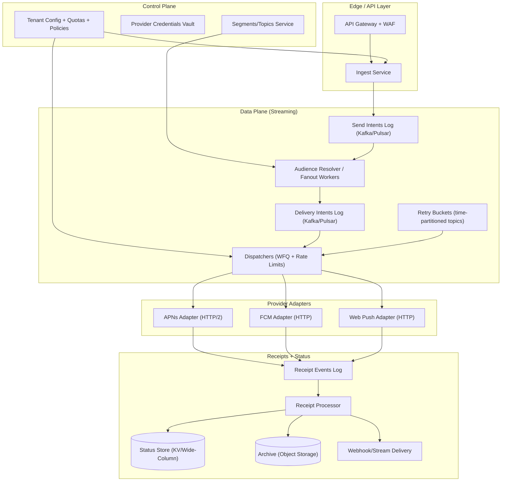
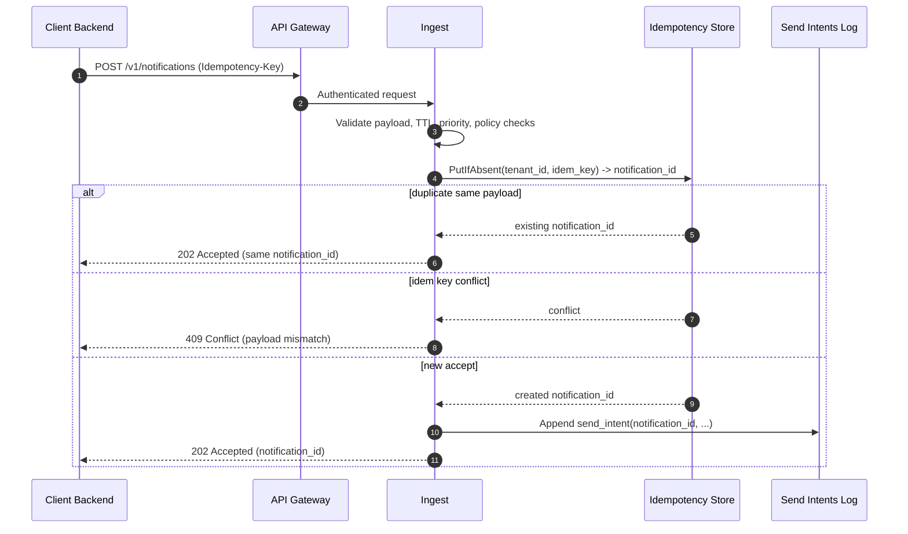
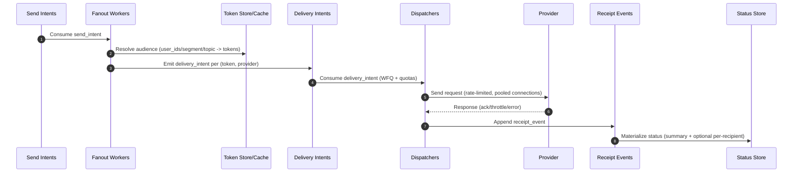
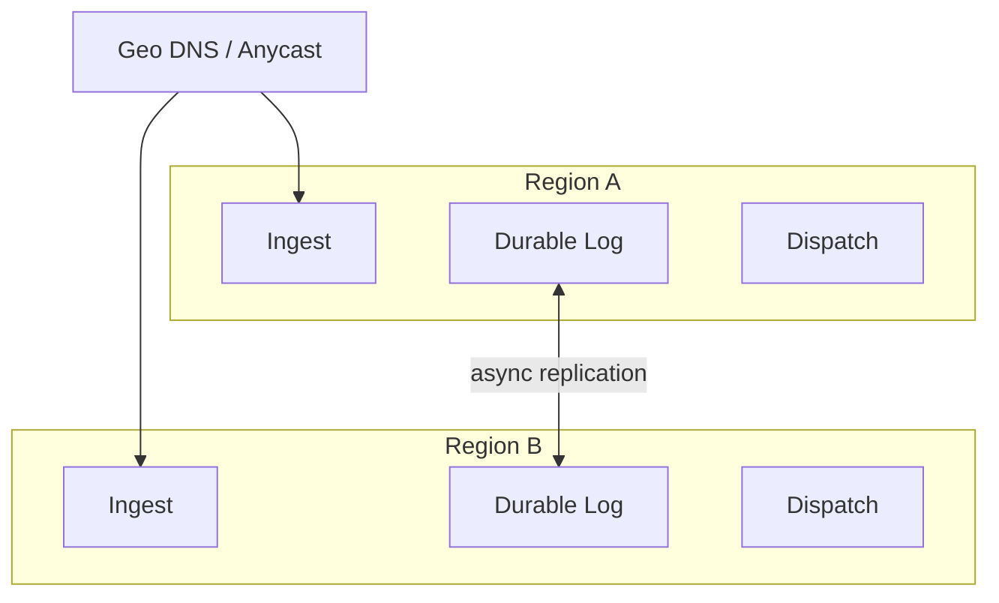

## Overview

A **push notification broker** provides a single, reliable API for sending notifications to many delivery channels (APNs, FCM, Web Push, and optionally SMS/email). It sits between application backends and external providers, handling the hard parts that make “send” a distributed workflow rather than a single RPC: validation, fanout, prioritization, quota enforcement, provider throttling, retries, token hygiene, receipts, and auditing—under extreme throughput with strict availability goals.

The core architectural idea is to treat delivery as a **streaming data plane** governed by a **control plane**:

- The **data plane** is a set of stateless ingestion services that append immutable events to durable logs/queues, and dispatchers that consume those events and perform rate-limited sends to providers via long-lived connection pools.
- The **control plane** manages tenant configuration (quotas, priorities, credentials, segments/topics), safety guardrails, schema/versioning, and operational levers (kill switches, shedding rules).

Receipts are captured as immutable events and materialized into queryable views. This enables horizontal scaling, replayability, backpressure, and safe overload behavior (e.g., shedding low priority, isolating noisy tenants) without sacrificing auditability.

---

## Requirements

### Functional Requirements
- Accept notification requests via API (single + batch) with:
  - `priority`, `ttl`, optional `schedule_at`, optional `collapse` / dedupe semantics
  - per-channel provider options (APNs headers, FCM Android/Web configs, Web Push VAPID, etc.)
- Target audience modes:
  - explicit device tokens
  - user IDs (resolve to device tokens)
  - topic/segment fanout (configurable; can be large)
- Enforce multi-tenant isolation:
  - quotas/rate limits at tenant/app/priority/provider dimensions
  - predictable fairness (no starvation of smaller tenants)
- Prioritize critical traffic under load (P0 transactional > P1 important > P2 bulk).
- Deliver to multiple providers:
  - APNs (HTTP/2), FCM (HTTP v1), Web Push (HTTP)
  - provider-specific error handling, throttling, and token invalidation
- Provide receipts and status:
  - query API for current status + summary counts
  - optional per-recipient receipts (webhook / stream) by tier and use case
- Retries:
  - exponential backoff with jitter
  - retry budgeting (cap attempts, cap retry amplification)
  - dead-lettering + diagnostics for permanent failures
- Token hygiene:
  - register/rotate tokens
  - invalidate tokens based on provider feedback
  - suppress repeated sends to known-invalid tokens
- Auditing:
  - immutable event trail for sends and receipts (debugging, compliance, billing)

### Non-Functional Requirements

#### Scale (Targets)
Assume a global platform with uneven tenant distribution.

- Tenants: **100K** (top 100 generate ~60% of traffic)
- Registered device tokens: **5B**
- Notification ingestion:
  - steady: **0.5–1M notifications/sec**
  - peak bursts: **5M notifications/sec** for 1–5 minutes (e.g., incident/campaign)
- Fanout:
  - small: 1–10 deliveries/notification (user ID mode)
  - large: up to **10M deliveries/notification** (segment/topic; handled asynchronously)
- Receipts/events:
  - at least one receipt per delivery attempt
  - peak receipt rate can exceed sends during incidents; design for **10–30M events/sec** in aggregate across regions

#### Latency (SLOs)
Provider-dependent; define broker SLOs up to “first provider attempt”.

- Ingest API acknowledgement (accepted + durably queued): **P99 ≤ 50 ms**
- P0 (transactional) time from enqueue → first provider attempt (healthy provider, not rate-limited): **P99 ≤ 1 s**
- First receipt availability (accepted/sent/failed-to-provider): **P99 ≤ 5 s**
- Status query freshness (materialized view lag): **P99 ≤ 2 s**

#### Availability / Durability
- Ingestion + durable enqueue: **99.99%** per region
- Dispatch to “first provider attempt”: **99.9%** (provider health permitting)
- Durability:
  - **No loss for accepted notifications** within a region (durable log replicated across AZs)
  - Cross-region: asynchronous replication; accepted notifications may be delayed during failover
- Retention:
  - status views: **7–30 days** (tiered)
  - immutable receipt events: **30–90 days** hot, archived longer to object storage

#### Consistency Model
- **Strong (per tenant)** for request acceptance idempotency: `(tenant_id, idempotency_key)` maps to one accepted notification.
- **Eventual** for status aggregation, token invalidation propagation, and analytics.
- **Ordering**:
  - best-effort ordering per `(tenant_id, user_id)` when explicitly requested and feasible
  - no global ordering guarantees (not meaningful across providers/regions)

### Constraints & Assumptions
- External providers (APNs/FCM/Web Push) impose throttling, quotas, and partial outage modes. “Delivered” is often **not** reliably observable.
- Multi-region active-active ingestion is required; the system must keep accepting traffic if a region fails (with clear semantics during failover).
- Tenant isolation is mandatory; large tenants may require dedicated capacity and separate credentials/adapter pools.
- Security and privacy:
  - device tokens are sensitive identifiers; encrypt at rest, strict access control, audited access
  - support GDPR/DSAR deletion for user-linked identifiers and configurable retention
- Platform team size ~8–12 engineers; prefer proven managed components (Kafka/Pulsar, Redis, DynamoDB/Cassandra, object storage) and simple failure modes.

---

## Simplified Architecture

### High-Level Component Diagram



**Key separation**:
- `send_intent` is durable acceptance of *what should be sent*.
- `delivery_intent` is *who it should be sent to* (post-fanout).
- `receipt_event` is *what happened* (attempted, throttled, invalid token, etc.).

This separation keeps the ingestion path fast and stable while allowing fanout, retries, and provider variability to be handled asynchronously.

---

## Core Flows

### Request Path (Critical)



### Fanout + Delivery + Receipts (Asynchronous)



### Retry Scheduling (No Per-Message Timers)
- On transient failures (timeouts/5xx/429), dispatchers emit `retry_scheduled` with `not_before_ts`.
- Retries are placed into **time-bucket topics** (e.g., per minute) so consumers can read “due” partitions efficiently.
- Apply retry budgets:
  - max attempts (e.g., 3–5 for P0, 1–3 for P2)
  - max total retry rate per tenant/provider to prevent incident amplification
  - TTL enforcement (do not retry past message TTL)

---

## Components

### API Gateway + WAF
**Responsibilities**
- AuthN/AuthZ (tenant tokens, mTLS options)
- Request size limits and schema validation
- Basic DDoS protections (per-IP/tenant)
- Standard response headers and `Retry-After` for 429/503

**Notes**
- Keep provider credentials and sensitive routing logic out of the gateway; enforce in services.

---

### Ingest Service
**Responsibilities**
- Validate payload, enforce tenant policy (allowed channels, max TTL, priority rules)
- Admission control (protect downstream systems)
- Strong idempotent acceptance per `(tenant_id, idempotency_key)`
- Append `send_intent` event durably

**Design choices**
- Do minimal synchronous work:
  - do *not* expand large audiences on the request path
  - do *not* call providers on the request path
- Idempotency record stores:
  - `notification_id`
  - payload hash
  - accepted timestamp
  - TTL (e.g., 24h–7d depending on client retry patterns)

**Typical technologies**
- Stateless Go/Java services
- Idempotency: Redis (fast) + durable fallback (DynamoDB/Cassandra) for resilience; or DynamoDB-only if latency is acceptable
- Send intents log: Kafka/Pulsar with replication across AZs

---

### Streaming Logs (Kafka/Pulsar)
**Responsibilities**
- Durable buffering and decoupling between stages
- Partitioning to scale throughput and enforce isolation
- Replay for backfills and incident recovery

**Topics**
- `send_intents.p0/p1/p2` (separate lanes for SLO isolation)
- `delivery_intents.<provider>.p0/p1/p2` (optional per-provider lanes)
- `receipt_events` (immutable outcomes)
- `retry_bucket.<provider>.<YYYYMMDDHHmm>` (time-bucketed retries; implementation-specific)

**Event sizing guidance (critical for throughput)**
- Keep `send_intent` compact (target **< 500 bytes**):
  - store large payloads as references (e.g., blob/object store keyed by `notification_id`)
  - compress where appropriate
- This is often the difference between “the queue can handle 5M/sec” and “it cannot”.

---

### Audience Resolver / Fanout Workers
**Responsibilities**
- Resolve `audience` into device tokens:
  - user ID → active tokens
  - segment/topic → token set (can be huge)
- Produce `delivery_intent` events

**Design choices**
- For large segments, fanout is an ETL-like job:
  - pagination over segment membership (by shard)
  - backpressure aware; can pause P2 fanout under load
- Use caching for hot user lookups; avoid repeated decrypt/IO.

**Technologies**
- Token store: DynamoDB/Cassandra (wide scale, predictable)
- Cache: Redis (short TTL) for hot `(tenant_id, user_id)` token sets

---

### Dispatchers (Delivery Orchestrator)
**Responsibilities**
- Consume `delivery_intent` and enforce:
  - hierarchical quotas/rate limits
  - fairness across tenants
  - TTL expiration and retry policy
- Perform sends via provider adapters
- Emit `receipt_event` and schedule retries

**Fairness model**
- Use **weighted fair queuing (WFQ)** across tenants within each priority lane.
- Within a tenant:
  - optional weights per app/product
  - per-provider concurrency caps to prevent one provider incident from consuming all worker threads

**Rate limiting model**
- Hierarchical token buckets (or GCRA) with burst controls:
  - `tenant` → `priority` → `provider` → `optional user/device smoothing`
- Counters:
  - local in-process limits for microbursts
  - shared Redis counters for global fairness within a region
  - hard safety caps enforced even when Redis is unavailable

---

### Provider Adapters (APNs / FCM / Web Push)
**Responsibilities**
- Translate canonical broker messages into provider-specific requests
- Maintain long-lived connection pools (APNs HTTP/2)
- Normalize provider responses into a canonical receipt taxonomy
- Emit token invalidation signals

**Important provider semantics**
- **APNs**: response indicates acceptance or rejection; “delivered” is not generally available. Invalid token signals include 410/400 with specific reasons.
- **FCM**: response indicates acceptance; per-recipient errors like `UNREGISTERED` drive token invalidation.
- **Web Push**: often returns synchronous HTTP status; endpoint expiration/410 drives invalidation.

**Canonical receipt taxonomy (example)**
- `accepted` (broker accepted)
- `queued` / `sending`
- `provider_ack` (provider accepted request)
- `throttled` (provider or broker-limiter)
- `invalid_token` (permanent; suppress future sends)
- `transient_failure` (retryable)
- `permanent_failure` (do not retry)
- `expired` (TTL exceeded before attempt)
- `delivered` (only when a channel provides credible signal; optional)

---

### Receipts Processor + Status Store + Webhooks
**Responsibilities**
- Consume `receipt_events` and update materialized views:
  - current state
  - attempt count
  - summary counts by outcome/provider
  - optional per-recipient status (tiered; expensive at large fanout)
- Deliver receipts to customers:
  - webhook with signatures + replay protection
  - optional stream (tenant-scoped topic or SSE/WebSocket) for lower latency

**Materialization strategy**
- Treat receipts as the source of truth (append-only).
- Status tables are rebuildable from the log (within retention).

---

## Data Model

### Identifiers
- `notification_id`: globally unique identifier for an accepted notification (ULID/UUIDv7 recommended).
- `delivery_id`: unique per `(notification_id, recipient_device/provider)` when per-recipient tracking is enabled.
- `attempt_id`: unique per send attempt (monotonic within delivery is useful for debugging).

### Storage Schema (Conceptual)

**1) Device tokens (OLTP, wide scale)**
- Table: `device_tokens`
  - `tenant_id` (partition key)
  - `user_id` (partition/sort, optional)
  - `device_id` (sort)
  - `provider` (sort)
  - `token_ciphertext` (encrypted)
  - `platform` (ios|android|web)
  - `attributes` (locale, app_version, etc.)
  - `state` (active|invalid|blocked)
  - `state_reason` (string)
  - `created_at`, `last_seen_at`, `updated_at`

**2) Idempotency (request acceptance)**
- Table: `idempotency_keys`
  - `tenant_id` (partition key)
  - `idempotency_key` (sort)
  - `notification_id`
  - `request_hash`
  - `created_at`
  - TTL: 24h–7d

**3) Notification status (materialized, hot)**
- Table: `notification_status`
  - `tenant_id` (partition key)
  - `notification_id` (sort)
  - `priority`
  - `state` (accepted|fanout|queued|sending|provider_ack|failed|expired|completed)
  - `attempts_total`
  - `counts_by_outcome` (map)
  - `counts_by_provider` (map)
  - `first_attempt_at`, `last_attempt_at`
  - `last_error_code`, `last_error_provider`
  - `updated_at`
  - TTL: 7–30d

**4) Optional per-recipient delivery status (tiered)**
- Table: `delivery_status`
  - `tenant_id` (partition key)
  - `notification_id` (sort prefix)
  - `delivery_id` (sort)
  - `provider`
  - `state`, `attempts`, `last_error`
  - TTL: shorter (e.g., 1–7d) unless explicitly needed

**5) Receipt events (immutable stream + archive)**
- Stream/topic: `receipt_events`
  - `event_id` (ULID)
  - `tenant_id`, `notification_id`, optional `delivery_id`
  - `provider`
  - `type` (taxonomy above)
  - `provider_message_id` (if available)
  - `attempt` (int)
  - `ts`
  - `metadata` (error codes, latency, region, adapter version)
- Archive: object storage partitioned by `day/tenant_id/provider`

### Privacy Considerations
- Store tokens encrypted; never log raw tokens.
- Prefer hashing for `recipient_id` references in receipts.
- Support deletion workflows:
  - remove user→token mappings
  - tombstone user identifiers in logs where feasible (or encrypt with per-tenant keys + key destruction for crypto-erasure where policy allows)

---

## API Design

### Create Notification (single)
`POST /v1/notifications`

**Headers**
- `Authorization: Bearer <token>`
- `Idempotency-Key: <string>` (required)

**Request**
```json
{
  "priority": "P0",
  "ttl_seconds": 3600,
  "schedule_at": null,
  "audience": { "user_ids": ["u123", "u456"] },
  "message": {
    "title": "Payment received",
    "body": "Order #A123 confirmed",
    "data": { "order_id": "A123" }
  },
  "channels": {
    "apns": { "collapse_id": "order-A123" },
    "fcm":  { "collapse_key": "order-A123" },
    "webpush": { "topic": "order-A123" }
  },
  "receipts": {
    "level": "summary",
    "mode": "webhook",
    "webhook_url": "https://example.com/push/receipts"
  }
}
```

**Receipts levels**
- `none`: no receipts, best-effort delivery attempt
- `summary`: aggregate counts + final state (recommended default)
- `per_recipient`: per-token receipts (expensive; typically enterprise-only)

**Response**
```json
{
  "notification_id": "01JFP1Q6Z9W2ZK4GQ8J2G9M2QZ",
  "state": "accepted"
}
```

**Errors**
- `400` invalid payload/TTL/priority or unsupported provider options
- `401/403` authentication/authorization failures
- `409` idempotency key reused with different payload hash
- `413` payload too large (use referenced payload mode)
- `429` tenant quota exceeded (`Retry-After`)
- `503` admission control (system overload)

---

### Batch Create
`POST /v1/notifications:batch`
- Max items: **5,000** (configurable) and max total bytes enforced
- Each item has its own `idempotency_key` (or a deterministic key derived client-side)

---

### Query Status
`GET /v1/notifications/{notification_id}`

**Response**
```json
{
  "notification_id": "01JFP1Q6Z9W2ZK4GQ8J2G9M2QZ",
  "state": "sending",
  "attempts_total": 1,
  "counts_by_outcome": { "provider_ack": 120, "transient_failure": 3 },
  "last_updated_at": "2025-12-17T10:12:05Z"
}
```

---

### Device Token Registration
`PUT /v1/users/{user_id}/devices/{device_id}/tokens`

- Handles token rotation and platform/provider changes.
- Requires proof of app ownership (app attestation / signed device registration recommended).
- Response includes current token state and suppression reason if blocked/invalid.

---

### Receipts Delivery (Webhook)
- Signed requests (HMAC) with:
  - timestamp + nonce (replay protection)
  - tenant-scoped secret rotation
- Webhook retries with exponential backoff; dead-letter on repeated failure.
- Alternative delivery:
  - tenant-scoped stream topic (Kafka/Pulsar) for low-latency consumption
  - SSE for smaller customers

Example event (summary):
```json
{
  "event_id": "01JFP2...",
  "tenant_id": "t1",
  "notification_id": "01JFP1...",
  "type": "status_update",
  "state": "completed",
  "counts_by_outcome": { "provider_ack": 1000, "invalid_token": 12, "permanent_failure": 3 },
  "ts": "2025-12-17T10:12:07Z"
}
```

---

## Scaling & Performance

### Capacity Notes (Back-of-the-Envelope)
- Peak **5M notifications/sec** is achievable only if events are compact and fanout is staged.
- If `send_intent` averages **300 bytes**, peak ingress to the log is ~**1.5 GB/s** before replication/compression.
- Receipts can dominate bandwidth; aggressively normalize receipts and keep metadata small.
- For large fanouts (millions of recipients), per-recipient receipts can be cost-prohibitive; offer tiered receipt granularity.

### Bottlenecks and Mitigations
- **Provider throttling/outage**:
  - adaptive concurrency limits and circuit breakers per provider/region
  - prioritize P0; shed/defer P2 first
  - retry budgets to prevent amplification storms
- **Hot tenants**:
  - WFQ across tenants + per-tenant concurrency caps
  - dedicated partitions/worker pools for top tenants
  - “virtual tenant shards” for very large tenants: `(tenant_id, shard_id)`
- **Token lookups/fanout**:
  - cache hot user token sets
  - precomputed segment membership shards
  - async fanout with backpressure; pause bulk fanout under load
- **Receipt write amplification**:
  - summary-by-default receipts
  - separate OLTP status from immutable event archives
  - optional sampling for bulk campaigns (clearly documented)

### Partitioning Strategy
- `send_intents`: partition by `(priority, tenant_hash)` to spread load while keeping tenant isolation manageable.
- `delivery_intents`: partition by `(provider, priority, tenant_hash)` to isolate provider behavior.
- `receipt_events`: partition by `(tenant_hash)` or `(tenant_hash, day)` depending on retention and consumer patterns.

### Caching Strategy
- Token cache: Redis for hot `(tenant_id, user_id)` token sets (TTL 5–30 minutes); invalidate on registration + invalid-token receipts.
- Rate limit counters:
  - local leaky-bucket for microbursts
  - Redis for shared enforcement, TTL buckets (1s/10s/1m)
- Status caching:
  - small TTL edge cache (1–5s) for high read volume since views are eventually consistent

---

## Multi-Region Architecture

### Goals
- Continue ingesting during a regional failure.
- Avoid cross-region coordination on the ingestion critical path.
- Provide clear semantics for idempotency and duplication during failover.

### Active-Active with Asynchronous Replication



**Idempotency in multi-region**
- Normal mode: route a tenant to a “home region” to maximize idempotency consistency and simplify debugging.
- Failover: allow acceptance in another region; duplicates can occur if clients retry during the transition.
- Mitigations:
  - deterministic `collapse_id` / provider dedupe where supported
  - broker-side idempotency keys (best-effort across regions via replicated store or async reconciliation)
  - clear contract: *the broker provides at-least-once attempt semantics; duplicates are possible during partitions/failover*

---

## Trade-offs & Alternatives

### Key Trade-offs Made
- **At-least-once delivery attempts (chosen)** vs exactly-once:
  - Sacrifice: rare duplicates under retries/failover.
  - Why: providers and networks cannot support true exactly-once; idempotency + collapse keys reduce impact.
- **Streaming events + materialized views (chosen)** vs a single mutable record per message:
  - Sacrifice: more infrastructure and eventual consistency for reads.
  - Why: scales writes, supports replay/backfills, and provides strong auditability.
- **Separate priority lanes (chosen)** vs one unified queue:
  - Sacrifice: operational complexity (more topics/consumer pools).
  - Why: predictable SLO isolation and safer overload behavior.

### Alternative Approaches
- **Synchronous provider send on the API path**:
  - simpler mental model, but fails under provider latency/outages and cannot buffer spikes reliably.
- **Single global scheduler for retries**:
  - easy retries, but a bottleneck at high QPS and harder to isolate tenants fairly.
- **Per-tenant dedicated queues**:
  - strongest isolation, but expensive for 100K tenants; a hybrid is reasonable for the top N tenants only.

---

## Failure Modes & Mitigations

### Scenarios (Examples)

1) **Kafka/Pulsar broker outage (or partition unavailability)**
- Impact: ingestion cannot enqueue; lag grows.
- Detection: producer errors, under-replicated partitions, controller alerts, rising ingest 503.
- Mitigation: multi-AZ replication, capacity headroom, fast failover; admission control; shift ingest to healthy region if needed.

2) **Provider throttling/outage (429/5xx spikes)**
- Impact: queue lag, retries amplify load, P2 campaigns can starve P0 if not isolated.
- Detection: provider error taxonomy, adapter latency, retry rate, per-priority lag.
- Mitigation: circuit breakers, adaptive concurrency, exponential backoff with jitter, retry budgets, shed/defer P2 first.

3) **Rate-limiter dependency failure (Redis cluster degraded)**
- Impact: inaccurate quotas; risk of overload or unfairness.
- Detection: Redis latency/errors, limiter fallback counters.
- Mitigation: fail closed for abusive tenants, fail open with conservative global caps for others; hard per-provider concurrency limits; restore Redis with prioritized runbook.

4) **Token invalidation storm (mass reinstalls / provider feedback)**
- Impact: hot partitions in token store, cache churn, increased invalid-token receipts.
- Detection: invalid-token rate, token update QPS, partition hotspots.
- Mitigation: batch updates, write-behind queues, per-tenant throttles, suppress repeated invalid sends quickly via caches.

5) **Region failure**
- Impact: capacity loss; possible duplicate sends during failover; cross-region replication lag.
- Detection: regional health checks, global routing alarms, log replication lag.
- Mitigation: active-active ingestion, automated failover, async replication; clear duplicate semantics; reconcile status views post-failover via event replay.

### Disaster Recovery Targets
- Regional RTO: **≤ 15 minutes**
- Regional RPO (accepted notifications): **near-zero within region**; cross-region depends on replication lag target (e.g., **≤ 1 minute**)
- Backups:
  - token/status stores: continuous + daily snapshots
  - immutable events: archived to object storage with lifecycle policies

---

## Operations

### Monitoring & Alerting
- Ingestion:
  - QPS, P99 latency, 4xx/5xx, payload-too-large rate, idempotency conflicts, admission-control drops
- Logs/queues:
  - per-topic and per-priority lag, under-replicated partitions, throughput, replication lag (cross-region)
- Dispatch:
  - attempts/sec, success rate, retry rate, TTL expirations, per-tenant fairness (share vs quota), circuit breaker state
- Adapters/providers:
  - connection pool saturation, HTTP/2 resets, 429/5xx by provider/region, response latency, credential errors
- Receipts/status:
  - time-to-first-attempt, time-to-first-receipt, status lag, webhook delivery success/DLQ depth

Example alerts
- `P0` delivery_intents lag > **2s** for **5m**
- Provider 5xx > **2%** for **2m** (per provider/region)
- Retry amplification ratio > **1.5x** for **10m**
- Webhook DLQ growth > threshold (customer impact)

### Deployment & Change Management
- Progressive delivery per region (canary → ramp), with rapid rollback.
- Feature flags for:
  - retry policy changes
  - limiter policy changes
  - adapter behavior changes
- Event schemas versioned and backward compatible:
  - new fields are optional
  - consumers tolerate unknown fields
  - maintain “replay harness” for verifying new processors against historical traffic

### Security Practices
- Provider credentials stored in a dedicated secrets manager; short-lived access tokens where possible.
- Encrypt tokens at rest (KMS envelope encryption); strict IAM boundaries between tenants.
- Log hygiene:
  - never log raw tokens or full payload data by default
  - structured redaction and sampling
- Webhooks:
  - per-tenant signing secret rotation
  - replay protection and idempotent webhook processing guidance for customers

### Operational Levers (Safety)
- Per-tenant kill switch and emergency quota reductions.
- Priority shedding policies (drop or defer P2 under sustained overload).
- Provider circuit breakers and “drain mode” for safe deploys.
- Replay controls:
  - bounded reprocessing windows
  - tenant-scoped replays to avoid global load spikes

---

## References & Further Reading
- Apple APNs HTTP/2 provider API docs (error codes, token invalidation semantics)
- Firebase Cloud Messaging HTTP v1 docs (quota behavior, per-recipient errors)
- Web Push Protocol (RFC 8030) and VAPID (RFC 8292)
- Kafka/Pulsar streaming design patterns (logs, replay, compaction, tiered storage)
- Backpressure and adaptive concurrency (e.g., Netflix Concurrency Limits, circuit breaker patterns)
- Multi-tenant fairness (weighted fair queuing, hierarchical token buckets)