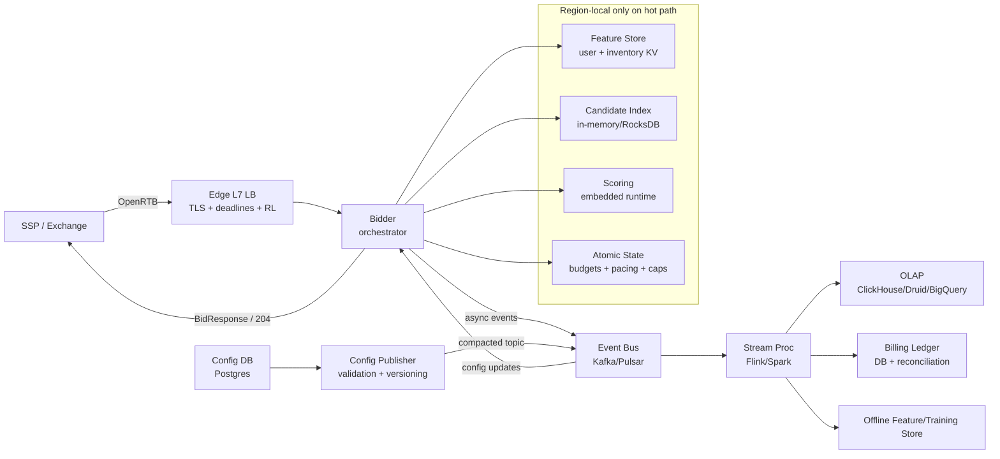
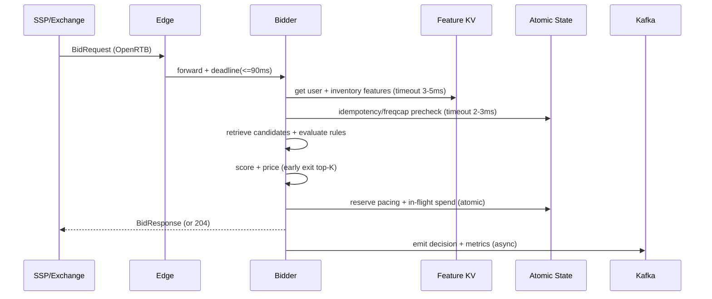

## Overview

Real-time bidding (RTB) ad serving is a latency-critical decision system: given an OpenRTB bid request from an exchange, the platform must decide whether to bid and, if so, return an eligible creative and price within a hard deadline (often 80–120ms end-to-end, including network). The core difficulty is achieving **predictable tail latency** while enforcing **correctness under extreme concurrency**: budgets, pacing, frequency caps, and policy constraints must hold even at hundreds of thousands to millions of requests per second.

A production design separates the system into two planes:

- **Hot path (serving plane)**: deterministic, bounded-latency steps (validate → enrich → retrieve candidates → evaluate rules → score → price → reserve budget/in-flight exposure → respond).
- **Cold path (event plane)**: asynchronous ingestion and processing of wins/impressions/clicks for billing, reporting, and model training.

The hot path must avoid cross-region synchronous calls and avoid blocking on analytical systems. Correctness is achieved via **region-local atomic primitives** for mutable state (budgets/pacing/frequency caps) and **idempotent event processing** with reconciliation.

---

## Requirements

### Functional Requirements
- Accept OpenRTB 2.5 bid requests and return bids or no-bid within the exchange deadline.
- Enforce targeting constraints: geo, device, app/site, time-of-day, deal IDs, categories, brand safety, audience segments, keywords.
- Enforce spend controls: daily/lifetime budgets, per-line-item constraints, and pacing (smooth or accelerated).
- Enforce frequency caps (per user, per campaign/line-item/creative) and deduplicate repeated requests.
- Rank candidates via rules + ML scoring; support A/B experiments and model versioning.
- Serve valid creatives (size/format/deal/category), including creative audit status.
- Ingest win/impression/click events; produce billing, reporting, and near-real-time dashboards.
- Provide campaign management APIs (create/update campaigns, line items, creatives, targeting, budgets).

### Non-Functional Requirements
- **Scale**
  - Bid requests: **200K QPS average**, **1M QPS peak** globally.
  - Payload size: **5–20KB** per bid request (compressed over the wire; JSON parsing cost matters).
  - Billable events (wins + impressions + clicks): **0.5–5B/day** (highly dependent on win rate and traffic mix).
  - Observability/log events: bid request/response logging is **too large to store raw at 100%** at peak; requires sampling and/or aggregation.
- **Latency (server-side budget)**
  - Bid response: **P50 ≤ 15ms**, **P99 ≤ 80ms**, hard cutoff at **90ms** to leave network headroom.
  - Target per-step (P99, region-local): parsing 2ms, feature reads 5ms, candidate retrieval 3ms, scoring 10–25ms, atomic budget/cap checks 3ms, response assembly 2ms.
- **Availability**
  - Bidding endpoint: **99.99%** monthly (define “availability” as responses before deadline, excluding caller-caused invalid requests).
  - Degrade by returning fast no-bid rather than timing out.
- **Consistency**
  - **Serving decision correctness**: strong consistency for mutable state **within a region shard** (atomic budget/cap primitives).
  - **Cross-region budgets**: bounded inconsistency accepted (budget allocator updates; overspend bounded and monitored).
  - Reporting/billing: eventual consistency (seconds to minutes), reconciled against authoritative event logs.
- **Durability**
  - Billable events: **RPO ≤ 1 minute** (practically: multi-AZ Kafka + durable sinks).
  - Decisions are ephemeral but must be reconstructable for audits via decision logs + config versioning.

### Constraints & Assumptions
- Multi-region active-active; traffic steered to nearest region.
- No cross-region synchronous calls on the hot path.
- Compliance: GDPR/CCPA consent signals, data minimization, retention policies; PII stored hashed/pseudonymized where feasible.
- Prefer proven components (e.g., Redis/Aerospike/ScyllaDB, Kafka, Flink/Spark, ClickHouse/BigQuery).

---

## Architecture

### High-Level (Hot + Cold Plane)

### Serving Path (Deadline-Driven)

---

## Components

### Edge Load Balancer
**Responsibilities**
- TLS termination, request normalization, and strict deadline enforcement.
- Per-SSP rate limiting and overload protection.
- Geo/health routing to region-local bidder pools.

**Design Notes**
- Propagate a single request deadline to all internal calls to prevent tail amplification.
- Prefer “fast no-bid” under overload rather than 5xx (many exchanges treat 5xx as unhealthy).

**Tech Choices**
- Envoy/Nginx + Anycast/GeoDNS; managed L7 LB optional.

---

### Bidder (Orchestrator)
**Responsibilities**
- Validate OpenRTB (schema + required fields).
- Enrich with region-local features.
- Candidate retrieval, policy checks, scoring, pricing, and response assembly.
- Emit decision records and counters for reconciliation and analytics.

**Design Notes**
- Partition work into tiers: required signals (must-have) vs optional signals (drop on timeout).
- Fail-open for optional features and non-critical enrichment; fail-closed for budget safety and policy blocks.
- Avoid per-request allocations and GC pressure; use bounded CPU time per request.

**Tech Choices**
- Rust/Go with careful JSON parsing (SIMD JSON libraries where possible); internal protobuf/gRPC for service boundaries (but avoid extra hops on hot path).

---

### Config Distribution (Control Plane)
**Responsibilities**
- Source of truth in relational DB (campaigns/line items/creatives/policy).
- Validation (schema, policy, creative audit status, targeting constraints).
- Publish versioned snapshots + incremental updates to bidders.

**Design Notes**
- Use a **compacted topic** for latest config state plus a monotonically increasing `config_version`.
- Bidders rebuild indexes from config topics at startup and apply incremental updates in-order.
- Rollouts: canary + rollback by pinning `config_version`.

---

### Targeting & Candidate Retrieval
**Goal**
Reduce millions of eligible line items to a small candidate set (typically **50–500**) within a few milliseconds.

**Approach**
- **Stage 1 (coarse retrieval)**: inverted indices by high-selectivity fields (app/site, ad format, geo, deal ID, category allowlists).
- **Stage 2 (fine evaluation)**: rule engine checks (segments, time windows, frequency caps, brand safety, creative constraints).

**Design Notes**
- Precompute hot “inventory → candidate list” caches with short TTL (30–120s).
- Keep indexes local to the bidder (or a co-located service) to avoid RPC latency.

**Tech Choices**
- In-memory indices + optional RocksDB for compact storage; config-fed via Kafka.

---

### Feature Store (Serving)
**Responsibilities**
- Region-local reads for user and inventory features used in targeting and scoring.
- Versioned schemas; predictable read latency.

**Design Notes**
- Store per-user segment membership and stable signals (consent flags, coarse device attributes, recent activity summary).
- Keep feature fetch under strict timeouts; missing optional features degrade gracefully.

**Tech Choices**
- Aerospike/ScyllaDB/KeyDB or similar low-latency KV, replicated within region (multi-AZ).

---

### ML Scoring (Inline)
**Responsibilities**
- Score candidates (pCTR/pCVR/value) and produce ranked list within the remaining deadline.

**Design Notes**
- Prefer embedded runtimes to remove network hops (ONNX Runtime/Treelite).
- Use fast models (GBDT or compact DNN with quantization); larger models offline for analysis and re-training.
- Early exit: score only top-K candidates after coarse ranking.

---

### Atomic State: Budgets, Pacing, Frequency Caps, Idempotency
**Responsibilities**
- Enforce mutable constraints with atomic operations under concurrency.

**Key Correctness Principle**
Anything that must be correct in the face of concurrent bids must be enforced via **single-shard atomic updates** (no multi-round-trip read-modify-write).

**Budget & Pacing Model (Production-Friendly)**
- Distinguish:
  - **Settled spend**: authoritative spend from win/impression billing events.
  - **In-flight spend**: conservative holds for outstanding bids that may still win (prevents overspending when win notices are delayed/missing).
- Reserve on bid response by incrementing `inflight_micros` (a hold), then:
  - On win/impression: move `inflight → settled`.
  - On loss/timeout (or no win notice): release hold after TTL.

This bounds overspend even with missing loss notifications; the trade-off is potential temporary underdelivery if holds aren’t released promptly.

**Frequency Caps**
- Exact per-user per-line-item keys can explode cardinality; common mitigations:
  - Cap at campaign level instead of creative/line item for most use cases.
  - Store a bounded “recent exposures” structure per user (e.g., per-user record in KV with TTL + atomic updates).
  - Use approximate structures for very large-scale caps when strictness is not required.

**Tech Choices**
- Redis Cluster with Lua scripts (or Aerospike record-level atomic updates).
- Use Redis Cluster hash tags to keep related keys co-located when needed (e.g., `budget:{line_item_id}`).

---

## Data Model

### Source of Truth (Relational)
- `advertiser(advertiser_id, status, billing_profile_id, created_at)`
- `campaign(campaign_id, advertiser_id, status, start_ts, end_ts, daily_budget_micros, lifetime_budget_micros, pacing_mode, updated_at)`
- `line_item(line_item_id, campaign_id, bid_cpm_micros, targeting_json, freq_cap_json, priority, status, updated_at)`
- `creative(creative_id, advertiser_id, format, width, height, markup, categories, audit_status, status, updated_at)`

### Serving KV (Features)
- `user_profile(user_key_hash, segments_bitmap, last_seen_ts, consent_flags, device_signals, feature_version)`
- `inventory_profile(inv_key, brand_safety_tier, historical_ctr, floor_price_stats, feature_version)`

### Atomic State (Example Keys)
**Budgets/Pacing (per region)**
- `budget:{line_item_id}:{yyyymmdd}` → `{settled_micros, inflight_micros, limit_micros}`
- `pacing:{line_item_id}:{yyyymmdd}` → `{tokens_micros, refill_rate_micros_per_sec, last_refill_ts}`
- Optional backstops:
  - `campaign_budget:{campaign_id}:{yyyymmdd}` (hierarchical budgets)
  - `overrides:{id}` (emergency kill switches)

**Frequency Caps (choose one strategy)**
- Simple exact (small scale): `freqcap:{user}:{campaign_id}:{window_end}` → counter with TTL
- Bounded per-user record (preferred at high scale): `user_caps:{user}` → map of `{campaign_id: (count, window_end)}` with TTL and atomic updates

**Idempotency**
- `idempotency:{request_id}` → `{response_hash, expiry_ts}` (TTL 5–15 minutes)
- Optionally `idempotency_lock:{request_id}` to prevent concurrent duplicate processing.

### Event Schema (Bus)
- `bid_decision`: `{ts, request_id, auction_id, seat_id, region, config_version, candidates_considered, chosen, bid_cpm_micros, hold_micros, reason_codes[]}`
- `win`: `{event_id, ts, request_id, auction_id, price_micros, line_item_id, creative_id}`
- `impression`: `{event_id, ts, request_id, auction_id, line_item_id, creative_id}`
- `click`: `{event_id, ts, request_id, auction_id, line_item_id, creative_id}`
- `loss` (if available): `{event_id, ts, request_id, auction_id}`

**Delivery Semantics**
- Hot path emits `bid_decision` at-least-once.
- Billing events are processed at-least-once; sinks must be idempotent using `event_id`.

---

## API Design

### External: OpenRTB Bidding
- `POST /openrtb2/bid`
  - Request: OpenRTB 2.5 `BidRequest` JSON
  - Response: OpenRTB `BidResponse` JSON or `204 No Content`
  - Headers (optional): `X-Request-Id`, `X-Timeout-Ms`, `X-Seat-Id`
  - Error behavior:
    - `400` invalid/malformed request
    - `429` rate limited
    - Prefer `204` over `503` during overload when safe (no-bid is usually acceptable and cheaper than retries)
  - Idempotency:
    - If `request.id` repeats within TTL, return the same response (or deterministic no-bid) to prevent duplicated holds and inconsistent auction behavior.

### External/Internal: Event Ingestion (If Not Using Exchange Callbacks)
- `POST /v1/events`
  - Body: `{event_id, type, ts, request_id, auction_id, line_item_id, creative_id, price_micros, user_key_hash}`
  - Response: `202 Accepted` (async)
  - Dedupe: `event_id` unique; enforced in stream processor / sink.

### Internal: Config Distribution
- `GET /v1/config/snapshot?version=...` (bootstrap)
- Kafka topic `config_updates` (compacted) for incremental updates
  - Bidders must be able to rebuild state without querying the DB on the hot path.

### Internal: Campaign Management (Typical)
- `POST /v1/campaigns`, `PATCH /v1/campaigns/{id}`
- `POST /v1/line-items`, `PATCH /v1/line-items/{id}`
- `POST /v1/creatives`, `PATCH /v1/creatives/{id}`
- Validation is synchronous; publishing is asynchronous and versioned.

---

## Scaling & Performance

### Capacity Planning (Concrete Starting Points)
Assume peak **1M QPS** globally across **10 regions** → **100K QPS/region** peak.

- **Network**
  - Ingress per region: 100K QPS × 10KB avg ≈ **1 GB/s** raw (compression and request mix can reduce).
- **CPU**
  - Target < 1 core per ~5–15K QPS depending on model complexity and JSON parsing; plan for **10–30 cores** per 100K QPS bidder shard plus headroom.
- **State stores**
  - Atomic state QPS scales with “requests reaching reservation” (often far less than total requests if many no-bids early).
  - Feature KV QPS scales with total requests; prefer local replication and consistent low latency.

### Latency Budget Enforcement
- Global deadline set at the edge (e.g., 90ms).
- Every dependency call uses a smaller derived timeout (e.g., KV 5ms, atomic 3ms).
- Strict per-stage cutoffs; if scoring exceeds budget, return best-so-far candidate or no-bid.

### Hot Key & Contention Mitigations
- Shard budgets by `{line_item_id}` and prefer hierarchical budgets (campaign-level + line-item-level) to reduce per-key contention.
- Add “in-flight hold TTL” to avoid permanent holds when loss events are missing.
- Use adaptive pacing refill rates (per-minute updates) to reduce burstiness.

### Caching Strategy
- In-bidder memory: configs, inverted indices, hot inventory caches.
- KV: authoritative for serving features; avoid synchronous DB calls.
- Atomic store: authoritative for budgets/pacing/caps; keep operations single-round-trip.

### Overload & Backpressure
- Early reject or fast no-bid when CPU saturation or tail latency rises.
- Prefer sampling non-billable logs before dropping billable events.
- Maintain separate priority lanes: bidding > win/impression ingestion > analytics.

---

## Trade-offs & Alternatives

### Key Trade-offs
1. **Atomic holds for budgets (in-flight + settled)**
   - Cost: additional hot-path dependency and operational complexity.
   - Benefit: bounded overspend under concurrency and delayed/missing win notices.
2. **Embedded scoring in bidder**
   - Cost: larger binaries and tighter coupling between model rollout and bidder deploy.
   - Benefit: removes an RPC hop and simplifies deadline management, improving P99.
3. **Eventual consistency for reporting**
   - Cost: dashboards lag behind real-time; requires reconciliation logic.
   - Benefit: keeps hot path lean; stream processing can scale independently.

### Alternatives
- **Centralized strongly consistent budget service (SQL/Spanner-style)**
  - Simpler accounting, but often too slow and too contention-prone at 1M QPS.
- **Purely event-based spend without holds**
  - Lowest hot-path cost, but overspend can be unbounded during win-notice delays or partitions.
- **Precomputed winners per inventory**
  - Extremely fast, but less flexible with per-user features, frequency caps, and dynamic budgets.

---

## Failure Modes & Resilience

### Common Failure Scenarios
1. **Atomic state store (Redis/Aerospike) partial outage**
   - Impact: cannot safely enforce budgets/caps; risk overspend if fail-open.
   - Mitigation: fail-closed for affected campaigns/line items (fast no-bid), circuit breakers, multi-AZ, aggressive timeouts, and scoped blast radius via sharding.
2. **Feature KV latency spike**
   - Impact: increased no-bids or degraded ranking quality.
   - Mitigation: feature tiering (drop optional), bounded stale reads, fallback to contextual targeting, and pre-warmed caches for hot inventory.
3. **Event bus ingestion lag / stream processor slowdown**
   - Impact: delayed reporting and slower release of in-flight holds; potential underdelivery.
   - Mitigation: prioritize billing events, autoscale consumers, increase partitions, enforce idempotent sinks, and add TTL-based hold releases as a safety valve.
4. **Bad config push (policy or budget misconfiguration)**
   - Impact: revenue loss, overspend, or policy violations.
   - Mitigation: validation gates, canary rollout by `config_version`, automated anomaly detection, instant rollback to last-known-good.
5. **Region outage / network partition**
   - Impact: traffic shifts, temporary cross-region budget drift.
   - Mitigation: region-local serving independence, global budget allocation updates, bounded drift policies, and post-incident reconciliation.

### Disaster Recovery Targets
- **RTO**: 15 minutes per region.
- **RPO**: 1 minute for billable events.

### Data Protection Strategy
- Config DB: multi-AZ + backups; point-in-time recovery.
- Event bus: multi-AZ durability, retention (7–14 days) and replayable pipelines.
- OLAP: periodic snapshots/replication as supported by the chosen engine.

---

## Operations

### SLOs / SLIs (Examples)
- Bidding:
  - Availability: % requests responded before deadline (target 99.99%).
  - Latency: P50/P95/P99 server-side and end-to-end.
  - No-bid rate and timeout rate by SSP/inventory.
- Budget correctness:
  - Overspend incidents (target 0), `inflight` aging, hold release rate, reservation vs settled delta.
- Data freshness:
  - Win/impression processing delay (P95), OLAP freshness lag.
- Model health:
  - Score distribution drift, win-rate/CTR guardrails, experiment invariants.

### Alerting (Examples)
- P99 bid latency > 80ms for 5 minutes.
- Timeouts > 0.5% for 5 minutes.
- Atomic store error rate > 0.1% or shard unhealthy.
- Spend anomaly > 3σ vs baseline per campaign/region.
- In-flight holds older than TTL exceed threshold (signals missing loss/win ingestion).

### Deployment Strategy
- Per-region canary (1% → 10% → 50% → 100%) with automatic rollback on latency/error regressions.
- Feature flags for model versions, targeting rules, pacing modes, and kill switches.
- Shadow traffic and replay testing against captured traffic (with PII redaction) before enabling new logic.

### Security & Privacy
- Enforce consent signals in serving logic; avoid targeting when consent is absent.
- Minimize stored identifiers; hash/pseudonymize user keys; apply retention policies.
- Strict PII redaction in logs; separate access-controlled audit logs.
- mTLS for internal service calls; least-privilege IAM for data stores.

### Runbooks (Minimum Set)
- Atomic store outage: switch to fail-closed + confirm no overspend; restore shard; backfill holds.
- KV latency spike: enable contextual-only mode; confirm feature timeouts; scale/repair KV.
- Event lag: scale consumers; confirm idempotent sinks; verify hold TTL releases.

---

## References & Further Reading
- OpenRTB 2.5 Specification: https://iabtechlab.com/standards/openrtb/
- Redis Lua scripting for atomic operations: https://redis.io/docs/latest/develop/interact/programmability/eval-intro/
- “Dynamo: Amazon’s Highly Available Key-value Store” (KV at scale patterns)
- Apache Flink (stream processing): https://nightlies.apache.org/flink/
- Budget pacing patterns: token bucket / leaky bucket; practical ad system talks from major ad platforms (Google/Meta engineering presentations)