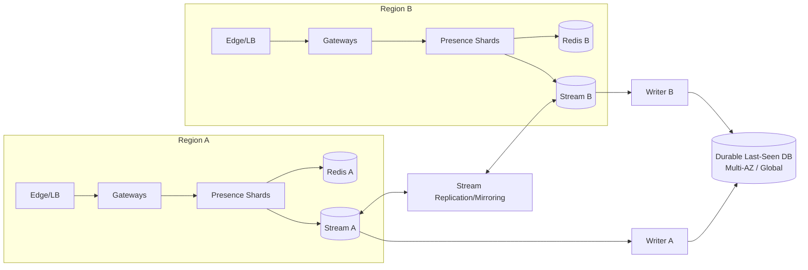
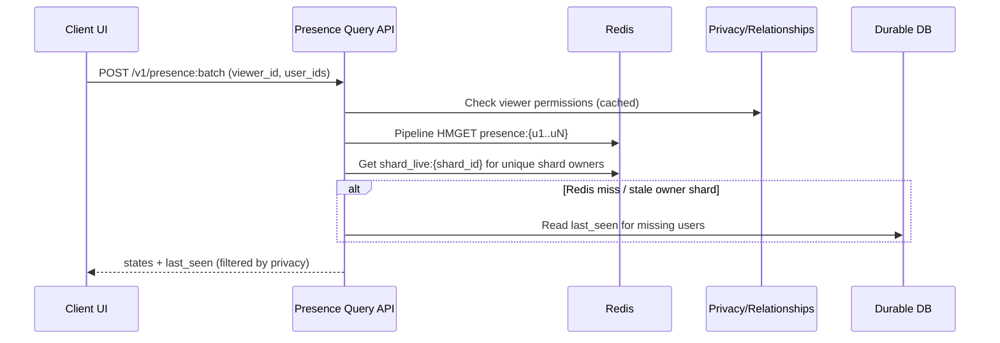

## Overview

A real-time presence service answers two deceptively simple questions at scale:

1. **Is user X online right now?**
2. **When was user X last seen online?**

The hard parts are correctness under unreliable networks (mobile backgrounding, flaky connectivity), high fanout (contacts lists), and failures (process crashes, partitions, regional outages). “Online” is inherently **ephemeral** and can tolerate brief inconsistency; “last seen” is **durable**, user-facing, and must not move backward.

This design separates:
- **Connection liveness and real-time updates**: managed close to where WebSockets live, optimized for low latency.
- **Durable last-seen**: updated only on meaningful transitions via an event log for replay and operational control.

Presence becomes an event-driven state machine: writes happen primarily on **connect / disconnect / timeout transitions**, not per-heartbeat durable writes.

---

## Requirements

### Functional Requirements
- Show `ONLINE` / `OFFLINE` (optionally `UNKNOWN`) and `last_seen` timestamp.
- Support **multi-device presence**: user is online if **any** active session exists.
- Allow clients to **subscribe** to presence updates for a list (e.g., contacts) with near-real-time delivery.
- Provide **batch presence lookup** for lists (contacts page), with pagination and rate limits.
- Enforce **privacy controls**:
  - visibility: everyone / contacts / nobody
  - per-viewer blocking
  - hide `last_seen` independently from online indicator (common product requirement)
- Emit presence events to downstream systems (chat routing, notifications, analytics) with **ordering per user**.
- Administrative tooling: session inspection, forced disconnect, replay/backfill last-seen.

### Non-Functional Requirements (Targets)
#### Scale (Example Sizing)
- 50M MAU, 10M DAU
- **Peak concurrent sessions**: 5M (multiple devices included)
- **Average session duration**: 20–40 minutes
- **Steady-state transitions** (connect/disconnect/timeout):
  - Approx steady connects/sec ≈ `5,000,000 / 1,800s ≈ 2,800/s` (if avg 30 min sessions)
  - Same order for disconnects/timeouts
- **Storms** (after outage/app push): up to **200K transitions/sec** globally is plausible (e.g., 20M reconnects over 2 minutes ≈ 167K/s)
- **Batch reads**:
  - Peak: 10K–50K req/s (contact-list heavy workloads)
  - Typical request size: 50–200 userIds (hard cap recommended)

#### Latency
- Batch presence read (in-region): **P50 20ms, P99 150ms**
- Subscription propagation: **P99 ≤ 500ms** from transition to subscriber delivery (in-region)
- Cross-region propagation (if supported): **seconds** (eventual)

#### Availability & SLOs
- Presence query API: **99.99%** monthly (degraded mode allowed)
- Subscription delivery: **99.9%** monthly (best-effort, reconnectable)
- Durable last-seen: **99.99%** read availability; write catch-up supported via log

#### Consistency Model
- `ONLINE` is **eventually consistent** during failures and cross-region replication (seconds).
- `last_seen` is **monotonic** (never decreases) with **per-user ordering** at the writer.
- Subscription updates are **at-least-once**; clients must dedupe using a monotonic version.

### Constraints & Assumptions
- Presence is a **best-effort signal**, not a financial ledger.
- Clients maintain a persistent connection (WebSocket) and can reconnect within **10–60s**.
- Avoid high write amplification: no per-heartbeat durable writes.
- GDPR/CCPA: durable `last_seen` must be deletable; ephemeral online state can be short-lived and excluded from compliance storage.

---

## Architecture

### High-Level (Single Region + Durable Pipeline)

```mermaid
flowchart TB
  C[Client App] --> E[Edge LB / Anycast]
  E --> GW[Connection Gateway<br/>WebSocket + Auth]
  GW --> PS[Presence Shard Logic<br/>State Machine]
  PS --> RE[(Redis Cluster<br/>Ephemeral Presence)]
  PS --> BUS[Internal Fanout Bus<br/>(shard->gateway)]
  BUS --> GW

  PS --> ES[Event Stream<br/>Kafka/Pulsar]
  ES --> W[Last-Seen Writer]
  W --> DB[(Durable Store<br/>Cassandra/Scylla/DynamoDB)]
```

### Multi-Region (Recommended for 99.99%+)

- Each region runs its own **connection gateways**, **presence shards**, and **regional Redis** for low-latency reads.
- A replicated **event stream** (or mirrored topics) feeds durable last-seen writers in one or more regions.
- Cross-region online presence is either:
  - **Not guaranteed** (many products accept regional accuracy), or
  - **Replicated** with seconds-level eventual consistency for read APIs.



---

## Core Concepts

### Presence State Machine
Per user:
- `session_count` (number of active sessions across devices in this region)
- `state`:
  - `ONLINE` if `session_count > 0`
  - `OFFLINE` if `session_count == 0`
  - optional `UNKNOWN` if state is stale due to shard death (used internally; can be mapped to `OFFLINE` after grace)
- `version` (monotonic, per-user): increments on each transition that changes externally visible state

Transitions:
- `CONNECT`: `session_count` increments; if it becomes `>0`, transition to `ONLINE` and emit update
- `DISCONNECT`: decrement; if it becomes `0`, transition to `OFFLINE` and emit update + durable last-seen candidate
- `TIMEOUT`: disconnect-equivalent when keepalive expires
- `ADMIN`: forced disconnects, bans, etc.

### Ownership & Routing
To minimize coordination:
- WebSocket connections are routed so that a user’s sessions **usually land on the same shard** (Rendezvous hashing on `userId`).
- A shard is responsible for merging multiple sessions into a single user presence state.

### Crash/Restart Safety Without Per-User Heartbeat Writes
Avoid refreshing per-user TTLs in Redis:
- Maintain a **per-shard liveness lease** key in Redis (or a lightweight membership system).
- Each presence record includes `owner_shard_id` and `owner_epoch_ms` (time of last transition).
- Readers treat records owned by an unhealthy shard as **stale** and may return `UNKNOWN` or `OFFLINE_AFTER_GRACE`.

This keeps steady-state Redis writes proportional to **transitions**, plus a small periodic write per shard for liveness.

---

## Components

### 1) Connection Gateway (WebSocket Front Door)
**Responsibilities**
- TLS termination (or pass-through at edge), auth (JWT/OAuth), rate limiting, abuse controls
- WebSocket lifecycle: ping/pong keepalive, reconnect hints, compression
- Routes events to the correct presence shard logic (often co-located in the same process)

**Key design points**
- **Sticky routing**: consistent hashing by `userId` ensures stable ownership for session aggregation.
- **Backpressure**: if fanout is overloaded, send `overloaded` acks, reduce update frequency, or request clients to poll.

**Implementation notes**
- Envoy/NGINX at edge; gateway service in Go/Java/Rust
- Keepalive: ping every 20–30s, timeout 60–90s (tuned for mobile)

---

### 2) Presence Shards (State Machine + Policy)
**Responsibilities**
- Track active sessions per user (in-memory for fast mutation)
- Produce user-level transitions (`ONLINE`/`OFFLINE`)
- Enforce privacy on subscription delivery (who is allowed to see what)

**Correctness**
- Updates must be monotonic and deduplicatable:
  - Each externally visible change increments `version` (per user).
  - Fanout messages include `(user_id, version)`; clients ignore older versions.

**Scaling**
- Shard by `userId` using Rendezvous hashing.
- Graceful draining: stop new connections, allow existing to disconnect/timeout, then terminate.

---

### 3) Redis Cluster (Ephemeral Presence Read Store)
**Responsibilities**
- Fast, shared read path for:
  - current online/offline state
  - `version`, `last_change_ms`, `owner_shard_id`
  - optional cached `last_seen_ms` (for convenience; durable source remains DB)

**Data access patterns**
- Batch reads use pipelined `HMGET`/`MGET` (or RedisJSON if standardized).
- Avoid hot partitions by hashing on `userId`.

**Operational choices**
- Multi-AZ Redis Cluster.
- Persistence (AOF/RDB) is optional; treat Redis as rebuildable from live state + durable store.

---

### 4) Internal Fanout Bus (Shard → Gateway Delivery)
**Responsibilities**
- Deliver presence updates from the owning shard to gateways holding subscriber connections.

**Technology options**
- NATS / Kafka (gateway-partitioned) / Redis PubSub (careful with scale) / gRPC streaming
- Partition by `gateway_id` so each gateway consumes only its own stream.

**Why separate from the durable stream**
- Fanout wants **low latency** and **in-memory backpressure**, not long retention.
- Durable stream wants **replay**, **ordering**, and **storage**.

---

### 5) Event Stream + Last-Seen Writer (Durable Pipeline)
**Responsibilities**
- Stream buffers transitions and provides replay/backfill.
- Writer updates durable `last_seen` idempotently and monotonically.

**Ordering guarantee**
- Partition the stream by `userId` so all events for a user are ordered within a partition.
- Writer processes partitions sequentially; dedupe using `event_id` and/or monotonic `version`.

**Durable store choices**
- DynamoDB: simple ops, good for key-value, conditional updates.
- Cassandra/ScyllaDB: high write throughput, predictable latencies, multi-AZ.

---

### 6) Privacy & Relationship Data
Presence depends on:
- user privacy settings (visibility, hide last seen)
- block lists / contact relationships

Recommended approach:
- Keep privacy/relationships in a dedicated service + cache.
- Presence service enforces privacy at **read time** (batch API) and **fanout time** (subscriptions).
- Cache privacy decisions for short periods (e.g., 30–120s) with explicit invalidation on setting changes.

---

## Data Model

### Redis Keys
`presence:{user_id}` (Hash)
- `state`: `"ONLINE" | "OFFLINE"`
- `version`: integer (monotonic per user; increments on externally visible changes)
- `session_count`: integer (optional; useful for debugging)
- `last_change_ms`: epoch ms (state change time)
- `owner_shard_id`: string/int
- `owner_epoch_ms`: epoch ms (timestamp of last write by owner)
- `last_seen_ms_cache`: epoch ms (optional; only meaningful when OFFLINE)
- `privacy_hint`: small enum/version (optional; not authoritative)

`shard_live:{shard_id}` (String)
- Value: epoch ms
- TTL: e.g., 15s, refreshed every 5s by shard process

### Durable DB (Example)
Table: `user_last_seen`
- `user_id` (PK)
- `last_seen_ms` (bigint) — monotonic
- `updated_at_ms` (bigint)
- `last_applied_version` (bigint) — idempotency guard
- `deleted_at_ms` (nullable) — GDPR/CCPA delete marker

### Event Stream Message: `PresenceTransition`
- `event_id` (uuid/ulid)
- `user_id`
- `version` (monotonic per user)
- `new_state`: `ONLINE | OFFLINE`
- `event_time_ms`
- `reason`: `CONNECT | DISCONNECT | TIMEOUT | ADMIN`
- `region`, `shard_id`
- `session_count` (optional)

---

## Data Flows

### Connect, Subscribe, Offline, Durable Last-Seen

```mermaid
sequenceDiagram
  participant C as Client
  participant GW as Gateway
  participant PS as Presence Shard
  participant R as Redis
  participant FB as Fanout Bus
  participant ES as Durable Stream
  participant W as LastSeen Writer
  participant DB as Durable DB

  C->>GW: WS connect + auth
  GW->>PS: Connect(user_id, session_id)
  PS->>R: Update presence:{user} (ONLINE if needed, version++)
  PS->>FB: Publish update(user_id, version, ONLINE)
  PS->>ES: Publish transition(user_id, version, ONLINE)

  C->>GW: subscribe {user_ids}
  GW->>PS: Register subscriptions (by watched-user shard)
  Note over GW,PS: Subscription indices are ephemeral;<br/>client resubscribes on reconnect.

  C--x GW: network drop
  GW->>PS: Disconnect(user_id, session_id) (or TIMEOUT)
  PS->>R: If session_count==0 => OFFLINE, version++, last_change_ms
  PS->>FB: Publish update(user_id, version, OFFLINE)
  PS->>ES: Publish transition(user_id, version, OFFLINE, event_time)

  W->>ES: Consume transitions (ordered by userId partition)
  W->>DB: Conditional update if version newer<br/>and last_seen monotonic
```

### Batch Presence Lookup (Viewer-Aware)



---

## API Design

### Query APIs (REST; gRPC equivalent recommended internally)

#### Batch Lookup
`POST /v1/presence:batch`

Request:
```json
{
  "viewer_id": "me",
  "user_ids": ["u1", "u2", "u3"],
  "max_user_ids": 200,
  "max_stale_ms": 5000,
  "include_last_seen": true
}
```

Response:
```json
{
  "results": [
    {
      "user_id": "u1",
      "state": "ONLINE",
      "version": 1842,
      "last_change_ms": 1730000000000,
      "last_seen_ms": null
    },
    {
      "user_id": "u2",
      "state": "OFFLINE",
      "version": 991,
      "last_change_ms": 1729999000000,
      "last_seen_ms": 1729999000000
    }
  ],
  "partial": false
}
```

Notes:
- If privacy forbids last-seen: return `last_seen_ms: null` while still allowing `ONLINE/OFFLINE` if product permits.
- If state is stale due to shard death:
  - Option A: return `state: "UNKNOWN"` (preferred for transparency)
  - Option B: map to `OFFLINE` after a grace window (simpler UI)

Errors:
- `400` invalid ids / too many ids
- `401/403` auth/privacy
- `429` rate limited
- `503` degraded mode (e.g., Redis unavailable; durable-only response)

#### Single Lookup (Optional)
`GET /v1/presence/{user_id}?viewer_id=me`

---

### WebSocket Protocol (Client Subscriptions)

Client → Server:
```json
{ "type": "subscribe", "request_id": "r1", "user_ids": ["u2","u3"], "since_version": 0 }
```

Server → Client (ack + snapshot):
```json
{
  "type": "subscribed",
  "request_id": "r1",
  "snapshot": [
    { "user_id": "u2", "state": "ONLINE", "version": 1842, "last_change_ms": 1730000000000 }
  ]
}
```

Server → Client (updates; at-least-once):
```json
{ "type": "presence_update", "user_id": "u2", "state": "OFFLINE", "version": 1843, "last_change_ms": 1730000100000 }
```

Client rules:
- Deduplicate using `version` (ignore updates with `version <= last_seen_version[user_id]`).
- On reconnect: resubscribe and request a snapshot (or re-batch lookup).

Server overload behavior:
- Enforce caps: e.g., max 2,000 watched users per connection.
- For extreme fanout targets, degrade update frequency or require polling.

---

## Scaling & Performance

### Key Bottlenecks
1. **WebSocket concurrency**
   - 5M sessions implies careful FD limits, memory per connection, and kernel tuning.
   - Prefer event-loop friendly runtimes; avoid per-connection threads.

2. **Subscription memory**
   - Reverse indices (target → subscribers) can dominate memory.
   - Make subscription state **ephemeral** and rebuildable on reconnect.
   - Cap per-connection watched set; cap per-target subscribers; degrade for hot users.

3. **Batch lookups**
   - Large payloads amplify Redis QPS.
   - Strongly cap request size (50–200 typical, 500 max only for internal/trusted).
   - Use request coalescing and short-lived in-process caching in the query API (e.g., 1–5s).

4. **Hot users**
   - Celebrity presence changes can cause massive fanout.
   - Mitigations:
     - per-target subscriber caps + tiered updates (coarser granularity)
     - “presence polling only” for very hot targets
     - server-side sampling / debounce (e.g., suppress flaps within 2–5s window)

### Capacity Planning (Rules of Thumb)
- **Gateway memory**: assume 5–20 KB/connection (depends on TLS, buffers, subscriptions) → 5M sessions requires horizontal sharding and conservative per-connection state.
- **Fanout traffic**: if average user watches 200 contacts and 1% of contacts change presence per minute, updates can explode—optimize by:
  - only pushing updates for watched users
  - compressing payloads
  - debouncing flaps
- **Redis**: optimize for batched HMGETs and transition writes; keep keys small and avoid multi-key transactions.

### Horizontal Scaling
- Gateways: stateless, scale by concurrent connections and network bandwidth.
- Shards: add nodes and adjust rendezvous hash weights; drain gracefully.
- Redis: cluster sharding + multi-AZ; add shards for memory/QPS.
- Stream + Writers: partitions sized for storm throughput; scale writer consumer groups with partitions.

---

## Consistency, Ordering, and Correctness

### What’s Guaranteed
- **Subscription update ordering per user**: monotonic `version` ensures clients converge even with retries.
- **Durable `last_seen` monotonicity**: writer performs conditional updates:
  - apply only if `version` is newer than `last_applied_version`
  - and `last_seen_ms = max(existing, candidate_last_seen_ms)`

### What’s Not Guaranteed (By Design)
- Instant offline detection (mobile sleep, partitions). Offline is detected via:
  - TCP close when available
  - keepalive timeout otherwise
- Perfect cross-region online accuracy during failover (seconds-level eventual at best).

---

## Trade-offs & Alternatives

### Trade-offs Made
1. **Transition-driven durability**
   - Pro: minimal steady-state durable writes; scalable
   - Con: offline detection depends on timeouts; not instantaneous on silent failures

2. **Redis for online state + durable DB for last-seen**
   - Pro: fast reads and efficient fanout; durable compliance-friendly last-seen
   - Con: two datastores + reconciliation logic (degraded modes)

3. **At-least-once updates with client dedupe**
   - Pro: simpler, robust delivery; tolerates retries and reconnects
   - Con: clients must track versions; duplicates possible

### Alternatives
- **TTL heartbeat keys (SETEX every N seconds per session)**
  - Simple correctness model but high Redis write rate at large concurrency.
- **Pure in-memory presence (no shared cache)**
  - Lowest latency; hard to serve batch reads and survives restarts poorly.
- **Per-user pub/sub topics**
  - Clean semantics but metadata/topic explosion at scale.

---

## Failure Modes & Mitigations

### 1) Presence shard crash / gateway restart
- **Impact**: affected users may appear online until timeout; subscription indices lost
- **Mitigation**:
  - client reconnect + resubscribe flow
  - shard liveness lease (`shard_live:*`) allows readers to mark stale ownership
  - fast rollout health checks and connection draining

### 2) Redis unavailable or partitioned
- **Impact**: batch reads degrade; online state may be unavailable for some users
- **Mitigation**:
  - degraded mode: serve `last_seen` from durable DB; optionally omit online
  - circuit breakers + timeouts to protect gateways
  - multi-AZ Redis + automated failover; load shedding on read APIs

### 3) Stream lag/outage (durable pipeline)
- **Impact**: durable `last_seen` delayed; real-time online still works
- **Mitigation**:
  - retention + replay; writer autoscale on lag
  - alerting on lag thresholds (especially OFFLINE transitions)
  - idempotent writer so replays are safe

### 4) Hot-user fanout overload
- **Impact**: gateway CPU/network spikes; increased tail latency
- **Mitigation**:
  - caps and tiered delivery (debounce/coalesce)
  - degrade hot targets to polling
  - per-connection and per-target quotas

### 5) Clock skew
- **Impact**: misleading last_seen timestamps
- **Mitigation**:
  - prefer shard server time; enforce monotonicity at writer (`max`)
  - monitor NTP drift; clamp abnormal deltas

---

## Operations

### Observability (Dashboards)
- Gateways: concurrent connections, new conns/sec, disconnect reasons, ping RTT, send queue depth
- Shards: transitions/sec by reason, per-user session_count distribution, hot-key detection
- Redis: ops/sec, P99 latency, errors, memory, slot imbalance, failovers
- Fanout bus: publish/consume lag by gateway, dropped messages, backpressure events
- Durable stream: produce errors, consumer lag, under-replicated partitions
- Writer/DB: conditional update failures (expected), write latency, throttling, error rate

### Alerts (Examples)
- Batch read P99 > 150ms (5m)
- Redis error rate > 0.1% (5m)
- Fanout bus lag > 1s for >1% gateways (5m)
- Stream lag > 60s for OFFLINE events (5m)
- Connection churn spikes (possible deploy/regression)
- Hot-user fanout throttle events above baseline

### Deployment & Rollouts
- Canary gateways first (watch disconnect spikes).
- Protocol versioning for WebSocket messages; keep backward compatible fields.
- Graceful draining:
  - stop accepting new connections on node
  - allow existing to disconnect/timeout
  - force close after max drain window

### Disaster Recovery
- Durable last-seen:
  - **RPO ≤ 1 minute**, **RTO ≤ 30 minutes** (via replicated log + replay)
- Regional outage behavior:
  - online presence may degrade; clients reconnect to healthy region
  - last-seen continues to serve from durable DB

---

## Security, Abuse, and Compliance

- **AuthN/AuthZ**: validate tokens at gateway; mTLS internally.
- **Rate limiting**:
  - connections per IP/device/user
  - subscribe requests per minute
  - batch lookup QPS and payload size
- **Abuse protections**:
  - prevent presence scraping (tight quotas, anomaly detection, privacy defaults)
- **GDPR/CCPA deletion**:
  - delete durable `user_last_seen` row and any derived analytics
  - purge privacy caches; ensure event retention does not violate policy (encrypt + short retention or tombstone handling)
- **Data minimization**:
  - store only what’s needed for presence; avoid storing IP/device metadata in durable stores unless required

---

## References & Further Reading
- Redis patterns and pipelining: https://redis.io/docs/latest/develop/
- Kafka partitioning and ordering: https://kafka.apache.org/documentation/
- “Designing Data-Intensive Applications” (Kleppmann): logs, idempotency, derived state, consistency trade-offs
- Engineering blogs for real-time systems (concepts): Slack, Discord, WhatsApp (presence, websockets, fanout)